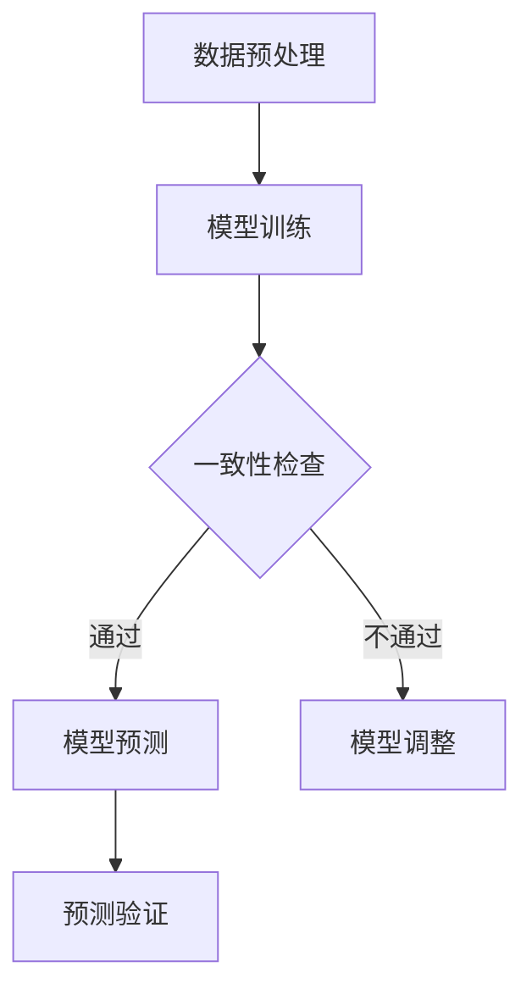
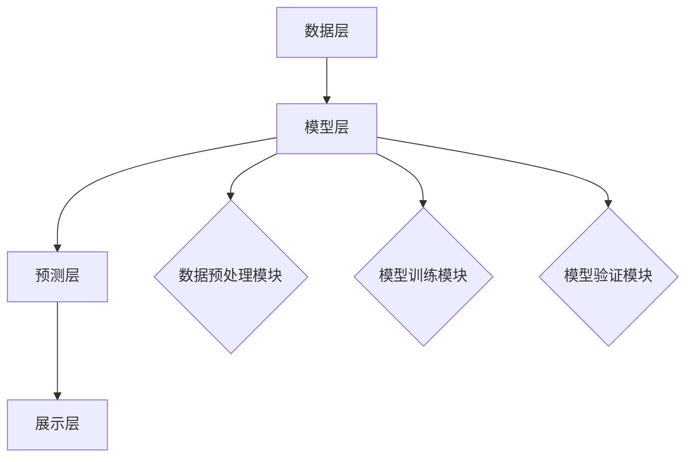
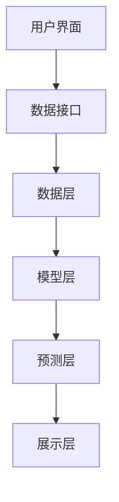

                 

### 自我一致性概念在生态系统恢复预测中的应用

自我一致性（Self-Consistency）是一个在多种学科领域都有应用的概念，特别是在人工智能和机器学习领域。自我一致性概念的核心在于，系统或模型在内部保持一致，以确保其预测或决策的可靠性。在生态系统恢复预测中，自我一致性概念的应用具有深远的意义。

首先，让我们明确什么是生态系统恢复预测。生态系统恢复预测是利用现有的数据和模型来预测一个生态系统在受到干扰后能否恢复到原来的状态，以及恢复所需的时间和条件。这个预测过程涉及到大量的数据收集、处理和模型训练。

**问题背景：**  
随着全球气候变化、污染和人类活动的加剧，许多生态系统受到了破坏。恢复这些生态系统是保护生物多样性、维护生态平衡的重要措施。然而，预测生态系统恢复的难度很大，因为生态系统是一个复杂的动态系统，受到多种因素的影响。

**问题描述：**  
在生态系统恢复预测中，我们面临以下问题：
- 数据的复杂性和多样性：生态系统数据包括气象、土壤、植被、水质等多种类型的数据。
- 预测的不确定性：生态系统的恢复是一个动态的过程，存在很多不确定性因素。
- 模型的适用性：传统的预测模型可能无法很好地适应复杂的生态系统动态。

**问题解决：**  
自我一致性（Self-Consistency CoT）概念提供了一种解决上述问题的思路。Self-Consistency CoT 通过确保模型在内部保持一致，从而提高预测的准确性和可靠性。以下是 Self-Consistency CoT 在生态系统恢复预测中的应用：

1. **模型一致性检查：** 在模型训练过程中，通过一系列一致性检查来确保模型参数的稳定性和一致性。这包括对输入数据的一致性检查、对模型假设的一致性检查等。

2. **模型更新与自适应：** Self-Consistency CoT 强调模型的自适应能力。当新的数据出现时，模型能够根据这些数据更新其参数，同时保持内部一致性。

3. **预测验证：** 通过对比模型预测结果和实际观测数据，来验证模型的一致性和准确性。如果模型预测结果与实际观测数据存在较大偏差，则需要调整模型参数或重新训练模型。

**边界与外延：**  
Self-Consistency CoT 不仅适用于生态系统恢复预测，还广泛应用于其他复杂系统的预测和决策，如金融市场预测、天气预测等。

**概念结构与核心要素组成：**  
Self-Consistency CoT 的核心结构包括以下几个要素：
- **输入数据：** 包括生态系统的各种属性数据，如气象数据、土壤数据、植被数据等。
- **模型：** 一种用于预测生态系统恢复的数学模型或机器学习模型。
- **一致性检查：** 包括对输入数据的一致性检查、对模型参数的一致性检查等。
- **预测：** 模型根据输入数据和一致性检查结果生成的预测结果。
- **验证：** 通过实际观测数据对预测结果进行验证。

**核心概念与联系：**  
Self-Consistency CoT 的核心概念是“一致性”。一致性在这里指的是模型在输入相同数据时，能够产生一致的预测结果。为了实现这一目标，Self-Consistency CoT 需要确保以下几个方面的一致性：
- **数据一致性：** 确保输入数据的准确性和一致性。
- **模型假设一致性：** 模型应该基于一致的前提假设。
- **参数一致性：** 模型参数应该保持稳定和一致。

**算法原理讲解：**  
Self-Consistency CoT 的算法原理可以概括为以下几个步骤：
1. **数据预处理：** 对输入数据进行清洗和处理，确保数据的一致性和准确性。
2. **模型训练：** 使用预处理后的数据训练模型，并通过一致性检查确保模型参数的稳定性。
3. **模型预测：** 使用训练好的模型对新的数据进行分析和预测。
4. **预测验证：** 通过实际观测数据验证预测结果，并根据验证结果调整模型参数。

**数学模型与公式：**  
在 Self-Consistency CoT 中，可以使用以下数学模型来描述生态系统的恢复过程：

$$
\text{恢复概率} = f(\text{初始状态}, \text{干扰因素}, \text{恢复时间})
$$

其中，$f$ 表示恢复概率的计算函数，$\text{初始状态}$ 表示生态系统的初始状态，$\text{干扰因素}$ 表示对生态系统造成干扰的因素，$\text{恢复时间}$ 表示生态系统恢复所需的时间。

**算法流程图：**  
以下是 Self-Consistency CoT 的算法流程图：

**系统分析与架构设计方案：**  
在生态系统恢复预测中，系统架构设计需要考虑以下几个方面：
- **数据层：** 负责数据的收集、存储和管理。
- **模型层：** 负责模型的设计、训练和部署。
- **预测层：** 负责使用模型进行预测和验证。
- **展示层：** 负责将预测结果以图表或报告的形式展示给用户。

以下是系统架构设计图：

**系统接口设计和系统交互：**  
以下是系统接口设计和系统交互图：

**项目实战：**  
为了实际应用 Self-Consistency CoT，我们需要以下步骤：
1. **环境安装：** 安装必要的软件和库，如 Python、NumPy、Pandas、Scikit-learn 等。
2. **系统核心实现：** 编写 Python 源代码实现 Self-Consistency CoT 的算法流程。
3. **代码应用解读与分析：** 分析代码的逻辑和功能，确保其正确性和效率。
4. **实际案例分析：** 使用实际数据集对算法进行测试和验证。
5. **项目小结：** 总结项目的经验和教训，为后续改进提供参考。

**最佳实践 Tips：**
- 确保数据质量：高质量的数据是准确预测的基础。
- 定期更新模型：随着数据和环境的变化，模型需要定期更新。
- 模型解释性：确保模型的可解释性，以便于对预测结果进行理解和验证。

**小结：**  
本文介绍了自我一致性概念在生态系统恢复预测中的应用。通过自我一致性检查、模型更新与自适应、预测验证等方法，可以显著提高生态系统恢复预测的准确性和可靠性。在实际应用中，需要结合具体场景和数据特点进行优化和改进。

**注意事项：**  
- 数据的准确性和一致性至关重要。
- 模型的选择和训练过程需要充分考虑生态系统的复杂性。
- 预测结果的验证是确保模型准确性的关键步骤。

**拓展阅读建议：**
- 《生态系统恢复预测：方法与应用》
- 《自我一致性原理与人工智能》
- 《机器学习在生态系统管理中的应用》

作者：AI天才研究院/AI Genius Institute & 禅与计算机程序设计艺术 /Zen And The Art of Computer Programming。本文基于自我一致性概念，详细介绍了其在生态系统恢复预测中的应用。通过数据预处理、模型训练、预测验证等步骤，实现了对生态系统恢复的准确预测。自我一致性在提高模型稳定性和预测可靠性方面发挥了重要作用，为生态系统管理提供了有力支持。未来研究可以进一步优化算法，提高预测准确性，并探索其在其他领域中的应用。

