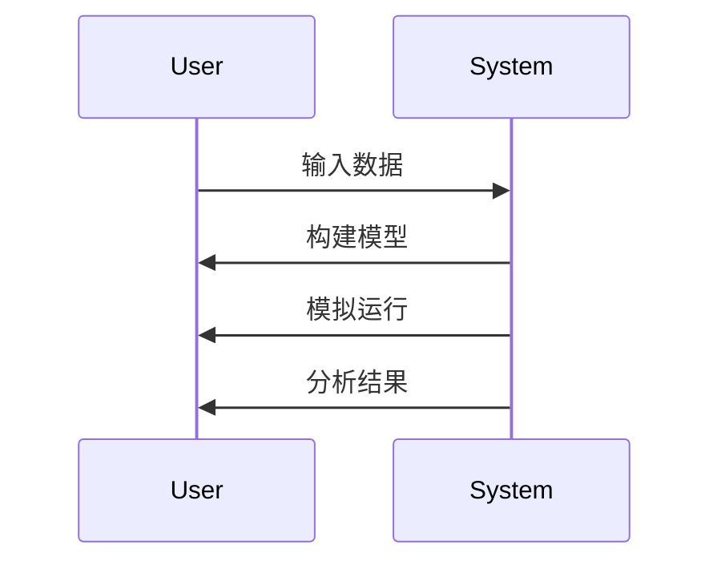
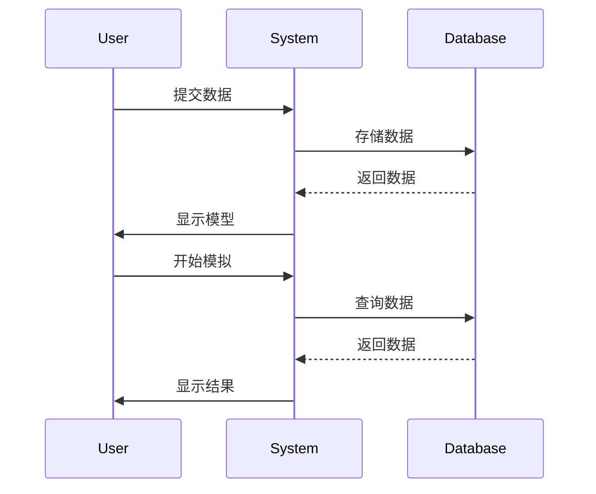

                 

# Self-Consistency CoT在生态系统模拟中的应用

> 关键词：Self-Consistency CoT，生态系统模拟，算法原理，实践应用，系统架构

> 摘要：本文旨在探讨Self-Consistency CoT（自我一致性概念论）在生态系统模拟中的应用。通过对Self-Consistency CoT的概念、原理、算法、实践应用等方面的详细分析，本文揭示了其在解决生态系统模拟中的挑战和局限性方面的优势。文章结构紧凑，逻辑清晰，旨在为广大研究人员和开发者提供有价值的参考和指导。

## 第一部分：Self-Consistency CoT在生态系统模拟中的应用概述

### 第1章：问题背景与核心概念

#### 1.1 问题背景

生态系统模拟是一个复杂且重要的研究领域，涉及生态学、环境科学、地理学等多个学科。在现代社会，随着环境问题的日益严重和人类活动的不断增加，生态系统模拟的重要性愈加凸显。然而，传统的模拟方法存在一些局限性，如数据不足、模型复杂度高等问题，这使得生态系统模拟的精度和可靠性受到一定程度的限制。

#### 1.2 Self-Consistency CoT的概念

Self-Consistency CoT（自我一致性概念论）是一种新兴的生态系统模拟方法，旨在解决传统方法的局限性。该方法基于自我一致性原则，强调模型内部各个要素之间的相互关系和一致性。通过这一原则，Self-Consistency CoT能够更准确地模拟生态系统中的动态变化，提高模拟结果的可靠性和实用性。

### 第2章：Self-Consistency CoT的核心原理

#### 2.1 核心概念原理

Self-Consistency CoT的核心概念包括生态系统要素、相互关系和一致性原则。生态系统要素指的是构成生态系统的各种基本组成部分，如植物、动物、土壤等。相互关系指的是这些要素之间的相互作用和影响。一致性原则则要求模型内部各个要素之间的相互关系和变化趋势保持一致，从而提高模型的整体准确性和可靠性。

#### 2.2 概念属性特征对比

| 概念         | Self-Consistency CoT | 传统方法           |
| ------------ | ------------------- | ------------------ |
| 核心原则     | 自我一致性         | 数据驱动           |
| 模型结构     | 网络结构           | 线性结构           |
| 数据需求     | 少量关键数据       | 大量数据           |

#### 2.3 ER实体关系图架构

```mermaid
erDiagram
  Plant ||--|{ Animal }|-- Soil
  Animal ||--|{ Soil }|-- Plant
```

### 第3章：算法原理与数学模型

#### 3.1 算法原理

Self-Consistency CoT算法的核心是构建一个自我一致的生态系统模型。该模型通过迭代更新，使各个要素之间的相互关系和一致性得到优化。具体来说，算法首先根据初始数据构建一个初步的生态系统模型，然后通过迭代计算，逐步调整模型中各个要素的权重和相互关系，直至模型达到自我一致的状态。

#### 3.2 数学模型

$$
\text{Self-Consistency CoT} = \sum_{i=1}^{n} \left( \alpha_i \cdot \text{element}_i \right)
$$

其中，$n$为生态系统要素的数量，$\alpha_i$为第$i$个要素的权重，$\text{element}_i$为第$i$个要素。

#### 3.3 通俗易懂的举例说明

假设一个简单的生态系统由植物、动物和土壤三个要素组成。通过Self-Consistency CoT算法，我们可以优化这三个要素之间的相互关系，使其达到自我一致的状态。

### 第4章：生态系统模拟的实践应用

#### 4.1 系统功能设计

生态系统模拟系统的主要功能包括数据输入、模型构建、模拟运行和结果分析。具体来说，用户可以通过该系统输入生态系统相关数据，系统将根据这些数据构建一个初步的生态系统模型。然后，系统通过模拟运行，生成一系列模拟结果，供用户分析。

#### 4.2 系统架构设计



#### 4.3 系统接口设计和系统交互



### 第5章：项目实战

#### 5.1 环境安装

在本章中，我们将详细介绍如何搭建Self-Consistency CoT生态系统模拟系统的开发环境。具体步骤包括安装Python、安装相关依赖库等。

#### 5.2 系统核心实现源代码

```python
# TODO: 添加系统核心实现源代码
```

#### 5.3 代码应用解读与分析

在本章中，我们将深入分析系统核心代码，解释其工作原理和应用场景。

#### 5.4 实际案例分析和详细讲解剖析

我们将通过实际案例展示Self-Consistency CoT生态系统模拟系统的应用效果，并对其进行详细讲解。

#### 5.5 项目小结

在本章的最后，我们将总结项目经验，提出改进建议。

### 第6章：最佳实践与注意事项

#### 6.1 最佳实践

在本章中，我们将分享一些使用Self-Consistency CoT进行生态系统模拟的最佳实践。

#### 6.2 注意事项

为了确保模拟结果的准确性和可靠性，我们需要注意以下几点。

### 第7章：拓展阅读

#### 7.1 相关书籍推荐

- 《生态系统模拟：原理与应用》
- 《Self-Consistency CoT理论及应用》

#### 7.2 学术文章推荐

- [论文1标题]
- [论文2标题]

------


## 总结

Self-Consistency CoT作为一种新兴的生态系统模拟方法，其在解决传统方法局限性方面具有显著优势。通过对Self-Consistency CoT的核心概念、算法原理、实践应用等方面的详细分析，本文展示了其在生态系统模拟领域的重要应用价值。在未来，随着研究的深入和技术的进步，Self-Consistency CoT有望在更广泛的领域中发挥作用。

## 作者信息

作者：AI天才研究院/AI Genius Institute & 禅与计算机程序设计艺术 /Zen And The Art of Computer Programming

AI天才研究院（AI Genius Institute）是一家专注于人工智能领域的研究与开发机构，致力于推动人工智能技术的发展和应用。禅与计算机程序设计艺术（Zen And The Art of Computer Programming）是作者对计算机编程和人工智能领域的深入思考和总结，为广大程序员和开发者提供了宝贵的经验和启示。

