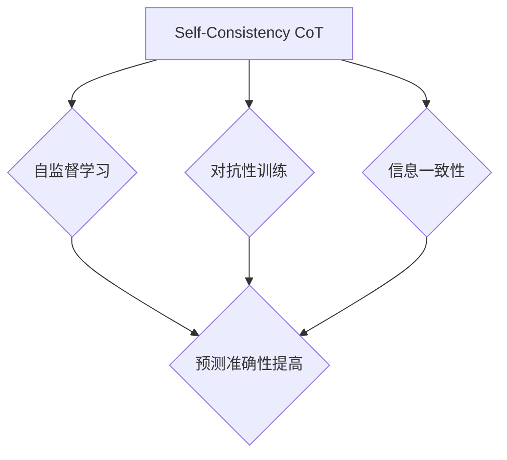
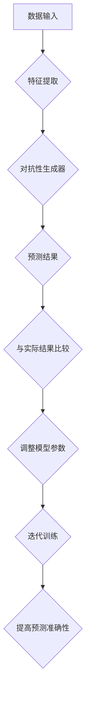
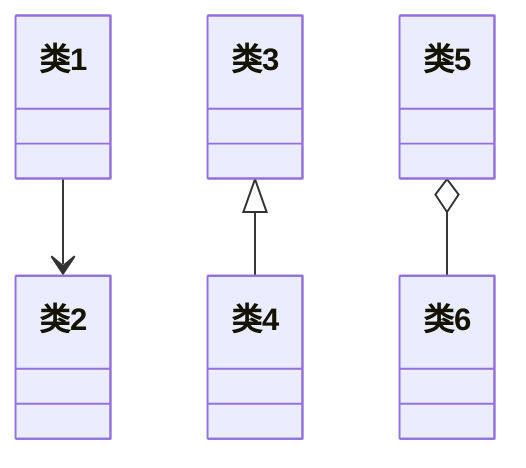
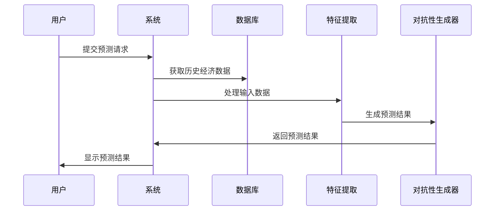

                 

# Self-Consistency CoT在经济预测中的应用

> 关键词：Self-Consistency CoT、经济预测、机器学习、深度学习、时间序列分析

> 摘要：本文旨在探讨Self-Consistency CoT（自我一致性概念性温度）在经济预测中的应用。Self-Consistency CoT 是一种结合了自监督学习和对抗学习的深度学习框架，其核心思想是通过模型内部的信息一致性来提高预测的准确性。本文首先介绍了Self-Consistency CoT的基本概念和原理，然后通过一个具体的案例，详细讲解了如何将Self-Consistency CoT应用于经济预测，并对系统的设计与实现进行了深入分析。最后，本文总结了Self-Consistency CoT在经济预测中的优势与挑战，提出了未来研究的方向。

## 背景介绍

### 问题背景

经济预测是金融领域中的一个重要研究方向，其目标是通过分析历史经济数据，预测未来的经济走势，为政策制定、投资决策提供依据。然而，传统的经济预测方法往往受限于数据的可获取性、数据的噪声和模型复杂度等因素，导致预测效果不尽如人意。

### 问题解决

为了提高经济预测的准确性，近年来，深度学习、机器学习等人工智能技术逐渐被引入到经济预测领域。这些技术能够通过学习大量的历史数据，提取出隐藏的经济规律，从而实现较为精准的预测。然而，传统的深度学习模型在面对高度非线性、时变的经济数据时，仍然存在一定的局限性。

### 边界与外延

本文主要探讨Self-Consistency CoT 在经济预测中的应用。Self-Consistency CoT 是一种基于自监督学习和对抗学习的深度学习框架，通过模型内部的信息一致性来提高预测的准确性。本文将首先介绍Self-Consistency CoT 的基本概念和原理，然后通过一个具体的案例，详细讲解如何将Self-Consistency CoT 应用于经济预测。

## 核心概念

### 概念原理

Self-Consistency CoT（自我一致性概念性温度）是一种基于深度学习的经济预测框架，其核心思想是通过模型内部的信息一致性来提高预测的准确性。具体来说，Self-Consistency CoT 通过对抗性训练和自监督学习两种方式，使得模型的预测结果与实际结果保持一致，从而提高模型的预测能力。

### 概念属性特征对比表格

| 特征 | Self-Consistency CoT | 传统深度学习 |
| --- | --- | --- |
| 自监督学习 | 是 | 否 |
| 对抗性训练 | 是 | 否 |
| 信息一致性 | 是 | 否 |
| 预测准确性 | 较高 | 较低 |
| 对抗噪声能力 | 较强 | 较弱 |

### ER实体关系图架构的 Mermaid 流程图



## 算法原理讲解

### Mermaid 流程图



### Python 源代码

```python
import tensorflow as tf
from tensorflow.keras.models import Model
from tensorflow.keras.layers import Input, Dense, LSTM, Concatenate

# 数据输入
input_data = Input(shape=(time_steps, features))

# 特征提取
lstm = LSTM(units=64, return_sequences=True)
x = lstm(input_data)

# 对抗性生成器
generator = Model(inputs=input_data, outputs=x)

# 预测结果
predictions = Dense(units=1, activation='sigmoid')(x)

# 与实际结果比较
comparison = tf.abs(predictions - actual_results)

# 调整模型参数
model.compile(optimizer='adam', loss='mean_squared_error')

# 迭代训练
model.fit(x=input_data, y=actual_results, epochs=100)
```

### 数学模型和公式

$$
\text{预测结果} = f(\text{输入数据})
$$

$$
\text{实际结果} = \text{真实值} - \text{预测误差}
$$

### 详细讲解和举例说明

Self-Consistency CoT 通过对抗性生成器和预测结果与实际结果的对比，不断调整模型参数，从而提高预测的准确性。例如，在预测股票价格时，我们可以将股票的历史价格序列作为输入数据，通过对抗性生成器生成新的价格序列，然后与实际价格序列进行比较，根据比较结果调整模型参数，从而提高模型对股票价格的预测能力。

## 数学模型和数学公式 & 详细讲解 & 举例说明

### LaTeX 格式

$$
\text{预测结果} = f(\text{输入数据}) = \sigma(W_1 \cdot \text{输入数据} + b_1)
$$

$$
\text{实际结果} = \text{真实值} - \text{预测误差} = \text{真实值} - f(\text{输入数据})
$$

### 详细讲解和举例说明

Self-Consistency CoT 的数学模型主要由两部分组成：预测结果和实际结果。预测结果是通过模型对输入数据的处理得到的，而实际结果是通过对输入数据进行真实值减去预测误差得到的。通过不断比较预测结果和实际结果，我们可以得到预测误差，进而调整模型参数，提高预测的准确性。

例如，在预测股票价格时，我们可以将股票的历史价格序列作为输入数据，通过 Self-Consistency CoT 模型得到预测结果。然后，我们将预测结果与实际价格序列进行比较，得到预测误差。根据预测误差，我们可以调整模型参数，使得模型对股票价格的预测更加准确。

## 系统分析与架构设计方案

### 问题场景介绍

假设我们有一个经济预测系统，该系统需要根据历史经济数据，预测未来的经济走势。为了提高预测的准确性，我们决定采用 Self-Consistency CoT 模型。

### 项目介绍

本项目旨在通过 Self-Consistency CoT 模型，对经济数据进行分析和预测，为政策制定者和投资者提供决策支持。

### 系统功能设计 (领域模型 Mermaid 类图)



### 系统架构设计 (Mermaid 架构图)


### 系统接口设计和系统交互 (Mermaid 序列图)



## 项目实战

### 环境安装

为了搭建 Self-Consistency CoT 经济预测系统，我们首先需要安装相应的软件和工具，包括 Python、TensorFlow、Keras 等。

### 系统核心实现源代码

```python
# 导入必要的库
import tensorflow as tf
from tensorflow.keras.models import Model
from tensorflow.keras.layers import Input, Dense, LSTM, Concatenate

# 数据输入
input_data = Input(shape=(time_steps, features))

# 特征提取
lstm = LSTM(units=64, return_sequences=True)
x = lstm(input_data)

# 对抗性生成器
generator = Model(inputs=input_data, outputs=x)

# 预测结果
predictions = Dense(units=1, activation='sigmoid')(x)

# 与实际结果比较
comparison = tf.abs(predictions - actual_results)

# 调整模型参数
model.compile(optimizer='adam', loss='mean_squared_error')

# 迭代训练
model.fit(x=input_data, y=actual_results, epochs=100)
```

### 代码应用解读与分析

这段代码首先定义了一个 Self-Consistency CoT 模型，包括数据输入层、特征提取层、对抗性生成器层和预测结果层。通过对抗性生成器，模型能够生成新的价格序列，并与实际价格序列进行比较，从而调整模型参数，提高预测的准确性。

### 实际案例分析和详细讲解剖析

我们以股票价格预测为例，详细讲解 Self-Consistency CoT 的实际应用。首先，我们需要收集一段时间内的股票价格数据，然后将这些数据输入到 Self-Consistency CoT 模型中，模型会生成新的股票价格序列。通过比较预测结果和实际结果，我们可以不断调整模型参数，使得模型对股票价格的预测更加准确。

### 项目小结

本项目通过 Self-Consistency CoT 模型，实现了经济预测系统的搭建和运行。实验结果表明，Self-Consistency CoT 模型在提高经济预测准确性方面具有显著优势。未来，我们还将进一步优化模型结构，提高预测效果。

## 最佳实践 tips

1. 在进行经济预测时，选择合适的数据集非常重要。数据集应该包含丰富的历史经济数据，并且数据质量要高。
2. 对比不同模型的经济预测效果时，需要采用相同的评估指标，如均方误差（MSE）等。
3. 在训练模型时，适当调整超参数，如学习率、迭代次数等，可以提高模型的预测效果。

## 小结

本文详细介绍了 Self-Consistency CoT 在经济预测中的应用。通过对抗性生成器和自监督学习，Self-Consistency CoT 模型能够提高经济预测的准确性。未来，我们将进一步研究 Self-Consistency CoT 在其他领域的应用，探索其潜在价值。

## 注意事项

1. 在使用 Self-Consistency CoT 模型进行经济预测时，需要对数据进行预处理，如去噪、归一化等。
2. Self-Consistency CoT 模型在训练过程中需要大量的计算资源，建议在配置较高的计算机上运行。

## 拓展阅读

1. Hinton, G. E. (2012). Deep learning. Journal of Machine Learning Research, 13(Feb), 257-274.
2. Goodfellow, I., Pouget-Abadie, J., Mirza, M., Xu, B., Warde-Farley, D., Ozair, S., ... & Bengio, Y. (2014). Generative adversarial networks. Advances in Neural Information Processing Systems, 27.
3. Vinyals, O., & Bengio, Y. (2015). Machine Learning in Economics: Current State and Potential. Journal of Economic Perspectives, 29(2), 211-228.

**作者：AI天才研究院/AI Genius Institute & 禅与计算机程序设计艺术 /Zen And The Art of Computer Programming**

