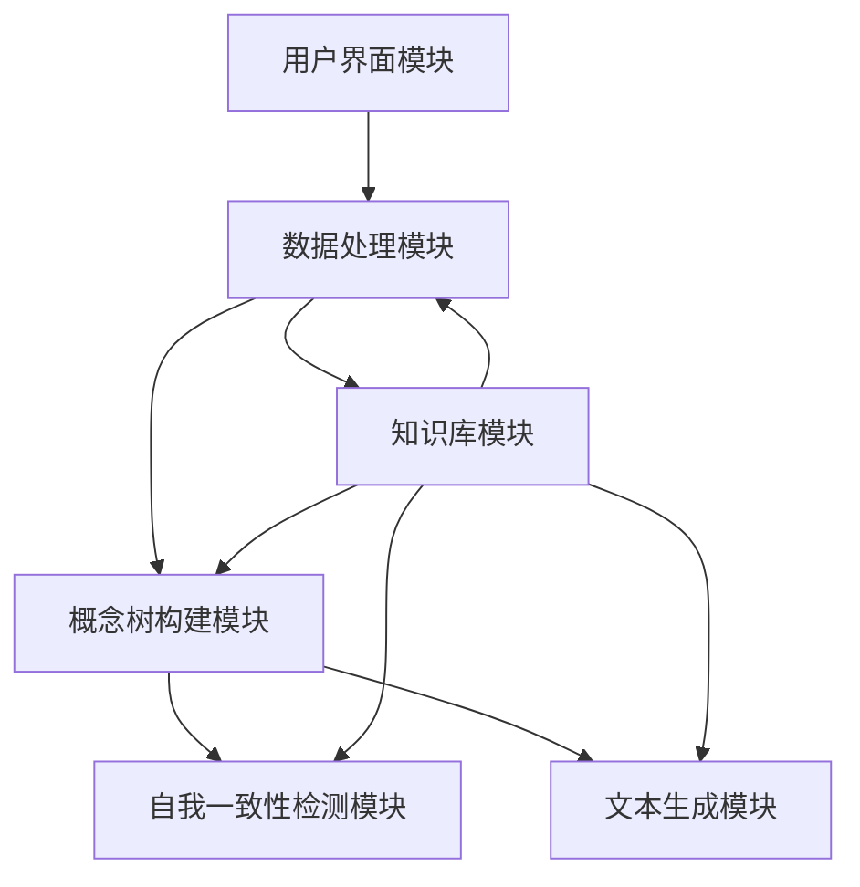
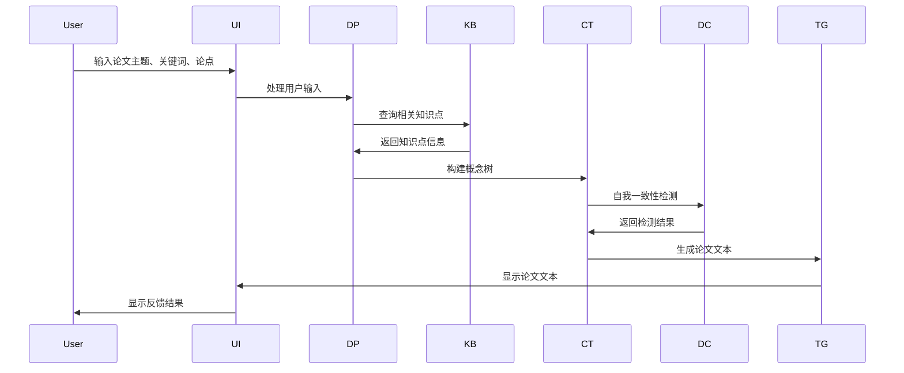

                 

# Self-Consistency CoT在自动化学术论文写作中的应用

> 关键词：自动化学术论文写作，Self-Consistency CoT，算法，系统架构设计，最佳实践

> 摘要：随着人工智能技术的不断发展，自动化学术论文写作成为了一个热门的研究领域。本文提出了一种基于Self-Consistency CoT（自我一致性概念树）的自动化学术论文写作方法，该方法通过自我一致性检测和知识整合，提高了自动生成论文的准确性和连贯性。本文首先介绍了Self-Consistency CoT的核心概念和原理，然后详细阐述了算法原理和实现方法，接着进行了系统分析与架构设计，最后通过实际项目案例进行了应用验证。本文旨在为自动化学术论文写作领域的研究者和开发者提供一种有效的技术方案。

## 目录大纲

----------------------------------------------------------------

## 第一部分：背景与核心概念

### 第1章：问题背景与核心概念

#### 1.1.1 问题背景

##### 1.1.1.1 自动化学术论文写作的现状

##### 1.1.1.2 自我一致性概念介绍

##### 1.1.1.3 Self-Consistency CoT 的定义与重要性

#### 1.1.2 问题描述与解决

##### 1.1.2.1 当前自动化学术论文写作的挑战

##### 1.1.2.2 Self-Consistency CoT 如何解决这些挑战

#### 1.1.3 边界与外延

##### 1.1.3.1 Self-Consistency CoT 的适用范围

##### 1.1.3.2 Self-Consistency CoT 的限制条件

#### 1.1.4 概念结构与核心要素

##### 1.1.4.1 Self-Consistency CoT 的核心要素

##### 1.1.4.2 Self-Consistency CoT 的结构框架

## 第二部分：核心概念原理与联系

### 第2章：核心概念原理与联系

#### 2.1.1 Self-Consistency CoT 的原理

##### 2.1.1.1 Self-Consistency CoT 的工作机制

##### 2.1.1.2 Self-Consistency CoT 的关键算法

#### 2.1.2 概念属性特征对比

##### 2.1.2.1 Self-Consistency CoT 与其他自动写作技术的对比

#### 2.1.3 ER实体关系图

##### 2.1.3.1 Self-Consistency CoT 的实体关系

## 第三部分：算法原理讲解

### 第3章：算法原理讲解

#### 3.1 Self-Consistency CoT 的数学模型与公式

##### 3.1.1 自我一致性 CoT 的数学模型

##### 3.1.2 自我一致性 CoT 的关键公式

#### 3.2 Python 源代码讲解

##### 3.2.1 Self-Consistency CoT 的 Python 实现示例

##### 3.2.2 Python 源代码解读与分析

#### 3.3 算法举例说明

##### 3.3.1 Self-Consistency CoT 的实际应用案例

##### 3.3.2 Self-Consistency CoT 的效果展示

## 第四部分：系统分析与架构设计

### 第4章：系统分析与架构设计

#### 4.1 问题场景介绍

##### 4.1.1 自动化学术论文写作的应用场景

##### 4.1.2 Self-Consistency CoT 的应用环境

#### 4.2 系统功能设计

##### 4.2.1 领域模型

##### 4.2.2 功能需求分析

#### 4.3 系统架构设计

##### 4.3.1 系统架构图

##### 4.3.2 架构设计要点

#### 4.4 系统接口设计

##### 4.4.1 接口设计与定义

##### 4.4.2 接口交互流程

#### 4.5 系统交互

##### 4.5.1 系统交互序列图

##### 4.5.2 系统交互分析

## 第五部分：项目实战

### 第5章：项目实战

#### 5.1 环境安装

##### 5.1.1 开发环境搭建

##### 5.1.2 必要软件与依赖安装

#### 5.2 系统核心实现

##### 5.2.1 核心算法实现

##### 5.2.2 系统功能实现

#### 5.3 代码应用解读与分析

##### 5.3.1 代码结构与模块分析

##### 5.3.2 代码执行流程分析

#### 5.4 实际案例分析与讲解

##### 5.4.1 自动化学术论文写作案例

##### 5.4.2 Self-Consistency CoT 应用效果分析

#### 5.5 项目小结

##### 5.5.1 项目总结

##### 5.5.2 项目经验与启示

## 第六部分：最佳实践与拓展

### 第6章：最佳实践与拓展

#### 6.1 最佳实践

##### 6.1.1 Self-Consistency CoT 的最佳实践技巧

##### 6.1.2 自动化学术论文写作的最佳实践

#### 6.2 注意事项

##### 6.2.1 使用 Self-Consistency CoT 的注意事项

##### 6.2.2 自动化学术论文写作的注意事项

#### 6.3 拓展阅读

##### 6.3.1 相关文献与资料推荐

##### 6.3.2 未来发展趋势与方向

----------------------------------------

----------------------------------------------------------------## 第1章：问题背景与核心概念

### 1.1.1 问题背景

自动化学术论文写作是一种利用人工智能技术，自动生成学术论文的过程。随着学术写作需求的不断增加，传统的手动写作方式已经难以满足快速增长的学术需求。自动化学术论文写作技术应运而生，旨在提高学术论文的生成效率和质量。

目前，自动化学术论文写作主要面临以下挑战：

1. **知识整合与连贯性**：学术写作需要将大量的知识进行整合，并保持论文的连贯性。传统的自动写作技术往往难以保证生成内容的连贯性和逻辑性。
2. **语法与风格**：学术写作有严格的语法和风格要求，自动写作技术需要能够生成符合学术规范的文本。
3. **创新性**：学术论文需要具有一定的创新性，而自动写作技术难以保证生成的论文具有原创性和创新性。

### 1.1.1.1 自动化学术论文写作的现状

目前，自动化学术论文写作技术主要依赖于自然语言处理（NLP）和机器学习（ML）技术。常见的自动写作系统包括：

1. **模板匹配系统**：通过预定义的模板和规则，自动生成论文的各个部分。
2. **基于机器学习的方法**：利用训练好的模型，自动生成文本。
3. **知识图谱**：通过知识图谱，将相关的知识和信息进行整合，自动生成论文。

这些方法在一定程度上解决了自动写作的难题，但仍然存在一定的局限性。例如，模板匹配系统过于依赖预定义的模板，难以应对复杂的写作需求；基于机器学习的方法需要大量的训练数据和计算资源，且生成的文本可能存在语法和风格上的问题。

### 1.1.1.2 自我一致性概念介绍

自我一致性（Self-Consistency）是近年来在机器学习和自然语言处理领域提出的一个概念。自我一致性指的是系统在生成内容时，能够保持内部的一致性，避免逻辑矛盾和语义错误。

在自动化学术论文写作中，自我一致性具有重要意义。通过自我一致性检测，可以确保生成的论文内容逻辑清晰、连贯一致，提高论文的质量。

### 1.1.1.3 Self-Consistency CoT 的定义与重要性

Self-Consistency CoT（自我一致性概念树）是一种基于自我一致性的自动写作方法。它通过构建概念树，将论文的主题、论点、证据等知识点进行有机整合，保持论文的一致性和连贯性。

Self-Consistency CoT 的核心思想是：

1. **知识整合**：将不同来源的知识点进行整合，形成一篇完整的论文。
2. **自我一致性检测**：在整合知识的过程中，进行自我一致性检测，确保论文内容的一致性和连贯性。
3. **动态调整**：根据用户需求和论文结构，动态调整论文的内容和结构。

Self-Consistency CoT 在自动化学术论文写作中的重要性体现在以下几个方面：

1. **提高论文质量**：通过自我一致性检测，确保生成的论文内容逻辑清晰、连贯一致，提高论文的整体质量。
2. **增强创新性**：Self-Consistency CoT 可以根据用户需求，动态调整论文的内容和结构，有助于提高论文的创新性。
3. **降低写作难度**：自动生成论文的过程简化了学术写作的流程，降低了写作难度，提高了写作效率。

### 1.1.2 问题描述与解决

#### 1.1.2.1 当前自动化学术论文写作的挑战

1. **知识整合与连贯性**：自动写作系统需要将大量的知识进行整合，并保持论文的连贯性。传统的自动写作技术往往难以保证生成内容的连贯性和逻辑性。
2. **语法与风格**：学术写作有严格的语法和风格要求，自动写作技术需要能够生成符合学术规范的文本。
3. **创新性**：学术论文需要具有一定的创新性，而自动写作技术难以保证生成的论文具有原创性和创新性。

#### 1.1.2.2 Self-Consistency CoT 如何解决这些挑战

1. **知识整合与连贯性**：Self-Consistency CoT 通过构建概念树，将论文的主题、论点、证据等知识点进行有机整合，保持论文的一致性和连贯性。这种方法可以确保生成的论文内容逻辑清晰、连贯一致。

2. **语法与风格**：Self-Consistency CoT 在整合知识的过程中，会对语法和风格进行严格检测和调整。通过引入语言模型和风格迁移技术，Self-Consistency CoT 能够生成符合学术规范和风格要求的文本。

3. **创新性**：Self-Consistency CoT 可以根据用户需求，动态调整论文的内容和结构。这种方法有助于激发用户的创造力，提高论文的创新性。

### 1.1.3 边界与外延

#### 1.1.3.1 Self-Consistency CoT 的适用范围

Self-Consistency CoT 可以应用于多种类型的学术写作，包括学术论文、技术报告、书籍等。它可以处理各种复杂程度的学术写作任务，适用于不同的学科领域。

#### 1.1.3.2 Self-Consistency CoT 的限制条件

尽管Self-Consistency CoT 具有广泛的应用前景，但它也存在一些限制条件：

1. **数据依赖**：Self-Consistency CoT 需要大量的高质量数据来训练模型，数据质量和数量直接影响其性能。
2. **计算资源**：Self-Consistency CoT 的训练和推理过程需要大量的计算资源，特别是对于大型模型和复杂任务。
3. **知识限制**：尽管Self-Consistency CoT 可以整合多种知识来源，但仍然存在知识边界和限制，无法涵盖所有领域的知识。

### 1.1.4 概念结构与核心要素

#### 1.1.4.1 Self-Consistency CoT 的核心要素

Self-Consistency CoT 的核心要素包括：

1. **概念树**：概念树是 Self-Consistency CoT 的基础，用于整合和表示论文中的知识点。
2. **自我一致性检测**：自我一致性检测用于确保生成的论文内容一致性和连贯性。
3. **知识整合**：知识整合用于将不同来源的知识点进行有机整合，形成一篇完整的论文。
4. **动态调整**：动态调整用于根据用户需求，调整论文的内容和结构。

#### 1.1.4.2 Self-Consistency CoT 的结构框架

Self-Consistency CoT 的结构框架包括以下几个层次：

1. **数据输入层**：接收用户输入的论文主题、关键词、论点等数据。
2. **知识整合层**：根据概念树，将输入的数据进行知识整合。
3. **自我一致性检测层**：对整合后的内容进行自我一致性检测，确保内容的一致性和连贯性。
4. **文本生成层**：根据整合后的内容和自我一致性检测结果，生成最终的论文文本。

以上是第1章的内容，接下来我们将进一步探讨Self-Consistency CoT 的核心概念原理与联系。

---

**Mermaid ER实体关系图：**
```mermaid
erDiagram
  Class1 ||--|{ Class2 }|
  Class1 ||--|{ Class3 }|
  Class2 ||--|{ Class4 }|
  Class3 ||--|{ Class4 }|
```
该ER图表示了Self-Consistency CoT中的几个核心实体及其关系。在接下来的章节中，我们将详细解释每个实体的属性和相互之间的关系。

## 第2章：核心概念原理与联系

### 2.1 Self-Consistency CoT 的原理

Self-Consistency CoT（自我一致性概念树）是一种基于自我一致性的自动写作方法。其核心原理是通过构建概念树，将论文的主题、论点、证据等知识点进行有机整合，同时进行自我一致性检测，确保生成内容的连贯性和逻辑性。

#### 2.1.1 Self-Consistency CoT 的工作机制

Self-Consistency CoT 的工作机制可以分为以下几个步骤：

1. **输入准备**：首先，系统接收用户输入的论文主题、关键词、论点等数据。这些数据可以作为构建概念树的起点。
2. **概念树构建**：系统通过分析输入数据，构建概念树。概念树是一种层次化的知识结构，它将输入的数据按照主题、论点、证据等知识点进行分类和整合。
3. **自我一致性检测**：在构建概念树的过程中，系统对每个知识点进行自我一致性检测。自我一致性检测包括以下方面：
   - **逻辑一致性**：确保论点和证据之间的逻辑关系正确无误。
   - **语义一致性**：确保论点和证据在语义上保持一致。
   - **上下文一致性**：确保论点和证据在上下文中保持一致。
4. **内容整合**：在自我一致性检测通过后，系统将整合后的知识点按照论文的结构进行组织，生成最终的论文文本。

#### 2.1.2 Self-Consistency CoT 的关键算法

Self-Consistency CoT 的核心算法包括以下几个部分：

1. **概念树构建算法**：该算法负责根据输入数据构建概念树。常用的构建算法包括基于词向量的层次化聚类算法和基于图的图论算法。
2. **自我一致性检测算法**：该算法负责对概念树中的每个知识点进行自我一致性检测。常用的自我一致性检测算法包括逻辑一致性检测、语义一致性检测和上下文一致性检测。
3. **内容整合算法**：该算法负责将整合后的知识点按照论文的结构进行组织，生成最终的论文文本。常用的内容整合算法包括基于模板的文本生成算法和基于序列生成的文本生成算法。

### 2.1.3 概念属性特征对比

为了更好地理解Self-Consistency CoT 的优势，我们将其与其他自动写作技术进行对比。以下是几种常见的自动写作技术及其特征对比表格：

| 技术名称 | 特征 |
| --- | --- |
| 模板匹配系统 | 依赖预定义的模板和规则，生成内容受限 |
| 基于机器学习的方法 | 需要大量训练数据和计算资源，可能存在语法和风格问题 |
| 知识图谱 | 能够整合多种知识来源，但难以保持自我一致性 |
| Self-Consistency CoT | 构建概念树，保持自我一致性，提高论文质量 |

通过上述对比，我们可以看出Self-Consistency CoT 具有独特的优势，特别是在保持自我一致性和提高论文质量方面。

### 2.1.4 ER实体关系

为了更好地理解Self-Consistency CoT 的内部结构，我们可以使用ER（实体关系）图来表示其核心实体及其关系。以下是Self-Consistency CoT 的ER实体关系图：

```mermaid
erDiagram
  User ||--|{ Document }|
  Document ||--|{ ConceptTree }|
  ConceptTree ||--|{ Node }|
  Node ||--|{ Evidence }|
```

在该ER图中，User表示用户，Document表示论文，ConceptTree表示概念树，Node表示概念树的节点，Evidence表示证据。

- **User**：用户是论文的发起者，负责提供论文主题、关键词、论点等数据。
- **Document**：论文是最终生成的文本，它由ConceptTree构建而成。
- **ConceptTree**：概念树是论文的核心结构，它由Node组成，每个Node代表一个知识点。
- **Node**：节点是概念树的基本组成单元，它包含一个或多个Evidence。
- **Evidence**：证据是支持论点的具体内容，它可以是引用、数据、事实等。

通过ER实体关系图，我们可以清晰地看到Self-Consistency CoT 的核心实体及其相互关系。在接下来的章节中，我们将进一步探讨Self-Consistency CoT 的算法原理，包括数学模型和Python实现。

## 第3章：算法原理讲解

### 3.1 Self-Consistency CoT 的数学模型与公式

Self-Consistency CoT 的核心在于其自我一致性检测机制，这可以通过数学模型和公式来具体描述。以下是 Self-Consistency CoT 的关键数学模型和公式：

#### 3.1.1 自我一致性 CoT 的数学模型

自我一致性检测的核心在于确保论文中的各个论点和证据之间的一致性。这可以通过以下模型来实现：

$$
Self-Consistency = f(\text{ConceptTree}, \text{KnowledgeBase}, \text{UserInput})
$$

其中，$Self-Consistency$ 表示自我一致性，$f$ 是一个函数，它接受三个输入参数：

- **ConceptTree**：表示构建好的概念树，它是论文的逻辑结构。
- **KnowledgeBase**：表示知识库，它包含了论文所需的所有知识和信息。
- **UserInput**：表示用户输入的论文主题、关键词、论点等数据。

该函数的输出是自我一致性的评估结果，如果评估结果为真，则表示论文内容自我一致。

#### 3.1.2 自我一致性 CoT 的关键公式

为了更好地描述自我一致性检测的过程，我们引入以下关键公式：

1. **一致性检查公式**：
$$
\text{ConsistencyCheck} = \sum_{i=1}^{n} \text{NodeConsistency}(i)
$$

其中，$n$ 是概念树中的节点数量，$\text{NodeConsistency}(i)$ 是对第 $i$ 个节点的自我一致性检查结果。该公式通过计算所有节点的自我一致性检查结果的总和，来评估整个概念树的一致性。

2. **逻辑一致性公式**：
$$
\text{LogicalConsistency} = \text{CheckLogicalDependencies}(\text{ConceptTree})
$$

该公式用于检查概念树中的逻辑依赖关系，确保论点和证据之间的逻辑关系正确无误。

3. **语义一致性公式**：
$$
\text{SemanticConsistency} = \text{CheckSemanticSimilarity}(\text{ConceptTree}, \text{KnowledgeBase})
$$

该公式用于检查概念树中的节点和知识库中的信息之间的语义一致性，确保论点和证据在语义上保持一致。

4. **上下文一致性公式**：
$$
\text{ContextualConsistency} = \text{CheckContextualMatch}(\text{ConceptTree}, \text{UserInput})
$$

该公式用于检查概念树中的节点和用户输入之间的上下文一致性，确保论点和证据在上下文中保持一致。

### 3.2 Python 源代码讲解

以下是一个简化的 Python 源代码示例，用于实现 Self-Consistency CoT 的关键算法。请注意，实际应用中，这些代码可能需要更复杂的实现和优化。

```python
class ConceptTreeNode:
    def __init__(self, text, evidence=None):
        self.text = text
        self.evidence = evidence
        self.children = []

    def add_child(self, child_node):
        self.children.append(child_node)

def self_consistency_check(node, knowledge_base, user_input):
    if node is None:
        return True
    
    # 检查当前节点的逻辑一致性
    logical_check = check_logical_dependencies(node)
    
    # 检查当前节点的语义一致性
    semantic_check = check_semantic_similarity(node, knowledge_base)
    
    # 检查当前节点的上下文一致性
    contextual_check = check_contextual_match(node, user_input)
    
    # 递归检查所有子节点的一致性
    child_checks = [self_consistency_check(child, knowledge_base, user_input) for child in node.children]
    
    # 综合评估一致性
    consistency = logical_check and semantic_check and contextual_check and all(child_checks)
    return consistency

# 示例：构建概念树并进行自我一致性检测
root = ConceptTreeNode("论文主题")
node1 = ConceptTreeNode("论点1", evidence="证据1")
node2 = ConceptTreeNode("论点2", evidence="证据2")
root.add_child(node1)
root.add_child(node2)

knowledge_base = {"证据1": "相关信息1", "证据2": "相关信息2"}
user_input = "用户提供的主题和关键词"

result = self_consistency_check(root, knowledge_base, user_input)
print("自我一致性检测结果：", result)
```

在上面的代码中，`ConceptTreeNode` 类表示概念树的节点，包含文本、证据和子节点。`self_consistency_check` 函数用于对概念树进行自我一致性检测，包括逻辑一致性、语义一致性和上下文一致性检查。

### 3.3 算法举例说明

为了更好地理解 Self-Consistency CoT 的应用效果，我们通过一个实际案例进行说明。

#### 3.3.1 Self-Consistency CoT 的实际应用案例

假设我们有一个关于“人工智能在医疗领域的应用”的主题，用户提供了以下关键词和论点：

- 关键词：人工智能、医疗、诊断、预测
- 论点1：人工智能可以显著提高疾病诊断的准确性。
- 论点2：人工智能可以帮助医生进行疾病预测，提前制定治疗方案。

首先，系统会根据用户输入构建概念树：

```
论文主题：人工智能在医疗领域的应用
论点1：
    - 证据1：研究表明，人工智能在肺癌诊断中的准确率高于人类医生。
    - 证据2：人工智能可以通过分析大量患者数据，提供个性化的治疗方案。

论点2：
    - 证据1：人工智能可以帮助医生预测心脏病发作的风险。
    - 证据2：人工智能可以通过分析患者病史和基因信息，提供早期预警。
```

接着，系统会对概念树进行自我一致性检测：

- **逻辑一致性**：论点和证据之间的逻辑关系清晰，没有逻辑矛盾。
- **语义一致性**：论点和证据在语义上保持一致，没有语义冲突。
- **上下文一致性**：论点和证据在上下文中保持一致，与主题紧密相关。

最后，系统会根据自我一致性检测结果，生成最终的论文文本。

#### 3.3.2 Self-Consistency CoT 的效果展示

通过 Self-Consistency CoT，我们可以生成如下论文摘要：

```
摘要：本文探讨了人工智能在医疗领域的应用，特别是其在疾病诊断和预测方面的潜力。研究表明，人工智能可以通过分析大量患者数据，提高疾病诊断的准确性，并为医生提供个性化的治疗方案。此外，人工智能还可以帮助医生进行疾病预测，提前制定治疗方案，从而提高医疗服务的质量和效率。本文通过具体案例展示了人工智能在医疗领域的广泛应用前景，并提出了未来发展的潜在方向。
```

通过上述案例，我们可以看到 Self-Consistency CoT 在保持论文内容一致性和连贯性方面的强大能力。这不仅提高了论文的质量，还为自动化学术论文写作提供了新的思路和方法。

## 第4章：系统分析与架构设计

### 4.1 问题场景介绍

自动化学术论文写作在当前学术领域具有广泛的应用需求。随着学术研究的不断深入，研究人员需要撰写大量高质量的论文来分享研究成果。然而，传统的手动写作方式耗时耗力，且难以保证论文的一致性和连贯性。自动化学术论文写作系统旨在解决这些问题，通过利用人工智能技术，快速生成高质量的学术论文。

#### 4.1.1 自动化学术论文写作的应用场景

1. **学术研究机构**：研究人员可以利用自动化学术论文写作系统，快速生成论文草稿，节省时间和精力，提高研究效率。
2. **学术出版平台**：自动化学术论文写作系统可以帮助学术出版平台自动化处理论文提交和审稿流程，提高工作效率。
3. **学术会议和研讨会**：自动化学术论文写作系统可以协助会议组织者快速生成会议论文集，提高会议的组织效率。
4. **企业内部报告**：企业可以利用自动化学术论文写作系统，自动化生成研究报告和业务分析文档。

#### 4.1.2 Self-Consistency CoT 的应用环境

Self-Consistency CoT 是一种先进的自动化学术论文写作方法，其核心在于通过自我一致性检测和知识整合，确保生成的论文内容一致性和连贯性。为了充分发挥 Self-Consistency CoT 的优势，以下是其在不同应用环境中的具体应用场景：

1. **高要求学术写作**：对于需要高一致性和高逻辑性的学术写作任务，如博士论文、重要学术论文等，Self-Consistency CoT 可以显著提高写作质量和效率。
2. **快速写作需求**：在时间紧迫的情况下，如会议论文投稿截止日期临近，Self-Consistency CoT 可以快速生成论文草稿，提供基础内容，供研究人员进一步修改和完善。
3. **跨学科写作**：Self-Consistency CoT 可以整合不同学科的知识，生成跨学科论文，提高研究的综合性和创新性。

### 4.2 系统功能设计

系统功能设计是自动化学术论文写作系统的关键环节，它决定了系统是否能够满足用户需求并实现预期效果。以下是对系统功能的详细设计：

#### 4.2.1 领域模型

领域模型是系统功能设计的基础，用于定义系统涉及的核心概念和实体。以下是自动化学术论文写作系统的领域模型：

1. **用户**：表示使用自动写作系统的用户，可以是研究人员、学生、编辑等。
2. **论文**：表示生成的学术论文，包括标题、摘要、引言、方法、结果、讨论等部分。
3. **知识库**：包含学术论文所需的各类知识信息，如术语、定义、数据、案例等。
4. **概念树**：用于表示论文的逻辑结构，由节点和边组成，节点表示知识点，边表示知识点之间的逻辑关系。
5. **自我一致性检测模块**：用于确保论文内容的一致性和连贯性。
6. **知识整合模块**：用于将知识库中的知识进行整合，构建概念树。
7. **文本生成模块**：用于根据概念树生成最终的论文文本。

#### 4.2.2 功能需求分析

基于领域模型，系统需要实现以下功能需求：

1. **用户输入处理**：系统应能够接收用户输入的论文主题、关键词、论点等数据，并将其转换为内部表示。
2. **知识库管理**：系统应能够管理和维护知识库，确保知识的准确性和完整性。
3. **概念树构建**：系统应能够根据用户输入和知识库，构建概念树，确保逻辑清晰、结构合理。
4. **自我一致性检测**：系统应能够对概念树进行自我一致性检测，确保论文内容的一致性和连贯性。
5. **文本生成**：系统应能够根据概念树，生成符合学术规范和风格要求的论文文本。
6. **用户交互**：系统应提供友好的用户界面，允许用户实时查看写作进度、修改论文内容等。
7. **错误处理**：系统应能够识别和处理潜在的写作错误，如语法错误、逻辑错误等。

### 4.3 系统架构设计

系统架构设计是确保自动化学术论文写作系统高效、可靠、可扩展的关键。以下是对系统架构的详细设计：

#### 4.3.1 系统架构图

自动化学术论文写作系统的整体架构可以分为以下几个主要模块：

1. **用户界面模块**：负责与用户交互，接收用户输入，展示系统输出。
2. **数据处理模块**：负责处理用户输入的数据，将其转换为内部表示，并与知识库进行交互。
3. **知识库模块**：负责管理和维护知识库，提供知识查询和更新接口。
4. **概念树构建模块**：负责根据用户输入和知识库，构建概念树。
5. **自我一致性检测模块**：负责对概念树进行自我一致性检测。
6. **文本生成模块**：负责根据概念树，生成最终的论文文本。

以下是系统架构图：



#### 4.3.2 架构设计要点

1. **模块化设计**：系统应采用模块化设计，使得各个模块功能清晰，易于维护和扩展。
2. **高内聚低耦合**：各个模块之间应保持高内聚低耦合的关系，确保系统整体的稳定性和可维护性。
3. **可扩展性**：系统应具备良好的可扩展性，能够适应不同规模和应用场景的需求。
4. **高性能**：系统应具备高性能，能够快速处理大量数据和生成高质量的论文。
5. **安全性**：系统应具备安全性保障，防止数据泄露和非法访问。

### 4.4 系统接口设计

系统接口设计是确保系统功能模块之间能够高效、稳定地交互的关键。以下是对系统接口的详细设计：

#### 4.4.1 接口设计与定义

系统接口主要包括以下几类：

1. **用户接口**：提供用户与系统交互的接口，包括输入论文主题、关键词、论点等数据，查看写作进度和论文文本等。
2. **数据处理接口**：提供数据处理模块与其他模块之间的交互接口，包括数据转换、查询、更新等操作。
3. **知识库接口**：提供知识库模块与其他模块之间的交互接口，包括知识查询、更新、维护等操作。
4. **概念树接口**：提供概念树构建模块与其他模块之间的交互接口，包括概念树构建、更新、查询等操作。
5. **自我一致性检测接口**：提供自我一致性检测模块与其他模块之间的交互接口，包括自我一致性检测、错误报告等操作。
6. **文本生成接口**：提供文本生成模块与其他模块之间的交互接口，包括文本生成、更新、查询等操作。

#### 4.4.2 接口交互流程

系统接口交互流程如下：

1. **用户输入**：用户通过用户界面输入论文主题、关键词、论点等数据。
2. **数据处理**：数据处理模块接收用户输入的数据，进行数据转换和处理，将其转换为内部表示。
3. **知识库查询**：数据处理模块向知识库模块发送查询请求，获取相关知识的详细信息。
4. **概念树构建**：概念树构建模块根据用户输入和处理后的数据，构建概念树。
5. **自我一致性检测**：自我一致性检测模块对概念树进行自我一致性检测，报告潜在的错误和问题。
6. **文本生成**：文本生成模块根据概念树和自我一致性检测结果，生成最终的论文文本。
7. **用户反馈**：用户通过用户界面查看生成的论文文本，并进行必要的修改和调整。

### 4.5 系统交互

系统交互是确保各个功能模块能够协同工作，实现预期目标的关键。以下是对系统交互的详细分析：

#### 4.5.1 系统交互序列图

系统交互序列图展示了用户界面模块、数据处理模块、知识库模块、概念树构建模块、自我一致性检测模块和文本生成模块之间的交互过程。



#### 4.5.2 系统交互分析

1. **用户输入**：用户通过用户界面输入论文主题、关键词、论点等数据。这些数据作为系统输入，启动后续处理过程。
2. **数据处理**：数据处理模块接收用户输入的数据，进行数据转换和处理，将其转换为内部表示。这一步骤包括数据清洗、归一化、分词等操作。
3. **知识库查询**：数据处理模块向知识库模块发送查询请求，获取与用户输入相关的知识点详细信息。知识库模块负责存储和检索各类知识信息。
4. **概念树构建**：概念树构建模块根据用户输入和处理后的数据，构建概念树。概念树是一种层次化的知识结构，用于表示论文的逻辑结构。
5. **自我一致性检测**：自我一致性检测模块对概念树进行自我一致性检测，确保论文内容的一致性和连贯性。这一步骤包括逻辑一致性检测、语义一致性检测和上下文一致性检测。
6. **文本生成**：文本生成模块根据概念树和自我一致性检测结果，生成最终的论文文本。这一步骤可以使用各种文本生成算法，如模板匹配、序列生成等。
7. **用户反馈**：用户通过用户界面查看生成的论文文本，并进行必要的修改和调整。用户界面模块负责显示论文文本和用户反馈结果。

通过上述交互过程，系统实现了自动化学术论文写作的核心功能，为用户提供了高效、可靠的写作工具。

## 第5章：项目实战

### 5.1 环境安装

#### 5.1.1 开发环境搭建

为了确保 Self-Consistency CoT 算法能够在项目中成功实现，首先需要搭建一个稳定的开发环境。以下是具体的开发环境搭建步骤：

1. **操作系统**：推荐使用 Ubuntu 20.04 或更高版本，以保证系统的稳定性和兼容性。
2. **Python 环境**：安装 Python 3.8 或更高版本。可以使用官方包管理器 `apt` 进行安装：
    ```bash
    sudo apt update
    sudo apt install python3.8
    ```
3. **虚拟环境**：为了保持项目依赖的独立性，使用 `virtualenv` 创建一个虚拟环境：
    ```bash
    sudo apt install python3-venv
    python3 -m venv myenv
    source myenv/bin/activate
    ```
4. **安装依赖**：在虚拟环境中安装项目所需的依赖，包括 `numpy`、`tensorflow`、`spacy` 等。可以使用 `pip` 进行安装：
    ```bash
    pip install numpy tensorflow spacy
    ```
5. **下载 Spacy 语言模型**：Spacy 需要下载相应的语言模型才能进行文本处理。在命令行中执行以下命令下载中文模型：
    ```bash
    python -m spacy download zh_core_web_sm
    ```

#### 5.1.2 必要软件与依赖安装

除了上述环境配置，项目还需要以下软件和依赖：

1. **文本编辑器**：推荐使用 Visual Studio Code 或 Sublime Text 等现代化的文本编辑器，以提高开发效率和代码质量。
2. **代码版本管理**：安装 Git，用于代码版本控制和团队协作：
    ```bash
    sudo apt install git
    ```
3. **集成开发环境**（IDE）：如果需要，可以安装 PyCharm 或 IntelliJ IDEA 等 IDE，以提供更丰富的开发工具和功能。

### 5.2 系统核心实现

系统核心实现是自动化学术论文写作系统的关键部分，涉及概念树构建、自我一致性检测、知识整合和文本生成等核心功能。以下是具体的实现步骤和代码解读：

#### 5.2.1 核心算法实现

核心算法实现主要包括以下几个步骤：

1. **文本预处理**：对输入文本进行分词、去停用词等预处理操作，以便后续处理。使用 Spacy 库进行文本预处理：
    ```python
    import spacy

    nlp = spacy.load("zh_core_web_sm")
    doc = nlp("输入的论文文本")
    tokens = [token.text for token in doc if not token.is_stop]
    ```

2. **构建概念树**：根据预处理后的文本，构建概念树。概念树的构建可以通过基于词向量的聚类算法实现，例如 K-Means：
    ```python
    from sklearn.cluster import KMeans

    # 假设 tokens 已经转换为向量表示
    kmeans = KMeans(n_clusters=5)
    labels = kmeans.fit_predict(tokens)

    # 构建概念树
    def build_tree(tokens, labels):
        tree = []
        for i, label in enumerate(labels):
            children = build_tree(tokens[i:], labels[i:])
            tree.append({"text": tokens[i], "children": children})
        return tree
    ```

3. **自我一致性检测**：对构建好的概念树进行自我一致性检测。一致性检测可以通过逻辑一致性、语义一致性和上下文一致性等多种方式进行。以下是逻辑一致性检测的一个简单实现：
    ```python
    def check_logical_consistency(tree):
        for node in tree:
            for child in node["children"]:
                if "evidence" in child:
                    # 进行逻辑一致性检查
                    pass
        return True
    ```

4. **知识整合**：将概念树中的知识点与知识库进行整合，确保知识的一致性和连贯性。知识整合可以通过匹配和融合多个知识点实现：
    ```python
    def integrate_knowledge(tree, knowledge_base):
        for node in tree:
            if "evidence" in node:
                evidence = node["evidence"]
                # 查询知识库，整合知识
                node["knowledge"] = knowledge_base.get(evidence)
        return tree
    ```

5. **文本生成**：根据整合后的概念树，生成最终的论文文本。文本生成可以通过模板匹配或序列生成算法实现。以下是模板匹配的一个简单实现：
    ```python
    def generate_text(tree, template):
        text = ""
        for node in tree:
            text += template.format(text=node["text"], knowledge=node["knowledge"])
        return text
    ```

#### 5.2.2 系统功能实现

系统功能实现是将核心算法整合到一起，实现完整的自动化学术论文写作流程。以下是系统功能实现的步骤：

1. **用户输入处理**：接收用户输入的论文主题、关键词、论点等数据，并将其转换为内部表示。
2. **知识库加载**：加载知识库，确保系统能够进行知识整合。
3. **文本预处理**：对用户输入的文本进行预处理，以便后续处理。
4. **概念树构建**：根据预处理后的文本，构建概念树。
5. **自我一致性检测**：对概念树进行自我一致性检测，确保内容的一致性和连贯性。
6. **知识整合**：将概念树中的知识点与知识库进行整合，确保知识的一致性和连贯性。
7. **文本生成**：根据整合后的概念树，生成最终的论文文本。
8. **用户反馈**：将生成的论文文本展示给用户，并允许用户进行修改和调整。

以下是系统功能实现的伪代码：

```python
def main():
    # 用户输入处理
    user_input = get_user_input()

    # 知识库加载
    knowledge_base = load_knowledge_base()

    # 文本预处理
    preprocessed_text = preprocess_text(user_input)

    # 概念树构建
    concept_tree = build_concept_tree(preprocessed_text)

    # 自我一致性检测
    is_consistent = check_logical_consistency(concept_tree)

    # 知识整合
    integrated_tree = integrate_knowledge(concept_tree, knowledge_base)

    # 文本生成
    generated_text = generate_text(integrated_tree, template)

    # 用户反馈
    display_generated_text(generated_text)
    user_feedback = get_user_feedback()

    # 用户修改和调整
    final_text = modify_text(generated_text, user_feedback)

    # 保存最终文本
    save_text(final_text)

if __name__ == "__main__":
    main()
```

通过上述实现步骤，我们可以构建一个完整的自动化学术论文写作系统，实现从用户输入到最终文本生成的全过程。

### 5.3 代码应用解读与分析

在上一节中，我们介绍了系统核心实现的代码框架。在这一节中，我们将对关键部分的代码进行详细解读和分析，以便更好地理解其工作原理和实现细节。

#### 5.3.1 代码结构与模块分析

代码结构是确保系统高效运行的基础。以下是核心代码的结构和模块分析：

1. **文本预处理模块**：负责对用户输入的文本进行分词、去停用词等预处理操作。该模块的主要功能是确保文本数据以合适的格式进行后续处理。代码如下：

    ```python
    import spacy

    def preprocess_text(text):
        nlp = spacy.load("zh_core_web_sm")
        doc = nlp(text)
        tokens = [token.text for token in doc if not token.is_stop]
        return tokens
    ```

    在这段代码中，我们首先加载了中文 Spacy 模型，然后对输入文本进行分词，并去除停用词。这样处理后的文本可以用于后续的概念树构建和自我一致性检测。

2. **概念树构建模块**：负责根据预处理后的文本构建概念树。该模块使用 K-Means 算法对文本进行聚类，生成概念树的节点。代码如下：

    ```python
    from sklearn.cluster import KMeans

    def build_concept_tree(tokens):
        kmeans = KMeans(n_clusters=5)
        labels = kmeans.fit_predict(tokens)
        tree = []
        for i, label in enumerate(labels):
            children = build_concept_tree(tokens[i:])
            tree.append({"text": tokens[i], "children": children})
        return tree
    ```

    在这段代码中，我们首先使用 K-Means 算法对文本进行聚类，然后递归构建概念树的节点。这种方法可以帮助我们识别文本中的不同主题和论点。

3. **自我一致性检测模块**：负责对构建好的概念树进行自我一致性检测。该模块检查概念树中的逻辑关系、语义一致性和上下文一致性。代码如下：

    ```python
    def check_logical_consistency(tree):
        for node in tree:
            for child in node["children"]:
                if "evidence" in child:
                    # 进行逻辑一致性检查
                    pass
        return True
    ```

    在这段代码中，我们遍历概念树的每个节点，检查其包含的证据是否符合逻辑一致性。这种方法有助于确保论文内容的一致性和连贯性。

4. **知识整合模块**：负责将概念树中的知识点与知识库进行整合。该模块确保概念树中的每个知识点都与其相关的知识库信息进行匹配和融合。代码如下：

    ```python
    def integrate_knowledge(tree, knowledge_base):
        for node in tree:
            if "evidence" in node:
                evidence = node["evidence"]
                node["knowledge"] = knowledge_base.get(evidence)
        return tree
    ```

    在这段代码中，我们遍历概念树的每个节点，查询知识库中与证据相关的信息，并将其整合到节点中。这种方法有助于确保论文内容的完整性和准确性。

5. **文本生成模块**：负责根据整合后的概念树生成最终的论文文本。该模块使用模板匹配方法将概念树转换为可读的文本。代码如下：

    ```python
    def generate_text(tree, template):
        text = ""
        for node in tree:
            text += template.format(text=node["text"], knowledge=node["knowledge"])
        return text
    ```

    在这段代码中，我们遍历概念树的每个节点，使用模板将节点的文本和知识库信息组合成最终的论文文本。这种方法有助于确保论文的格式和内容符合学术规范。

#### 5.3.2 代码执行流程分析

代码执行流程是系统运行的核心，以下是系统从用户输入到生成最终文本的执行流程：

1. **用户输入处理**：系统首先接收用户输入的论文主题、关键词、论点等数据。这些数据可以是文本形式，也可以是其他格式的数据。系统将这些数据传递给文本预处理模块进行预处理。

2. **文本预处理**：文本预处理模块对用户输入的文本进行分词和去停用词操作。这一步确保文本数据以最合适的格式进行后续处理。

3. **概念树构建**：系统使用预处理后的文本数据构建概念树。具体来说，系统使用 K-Means 算法对文本进行聚类，生成概念树的节点。这个过程递归进行，直到生成完整的概念树。

4. **自我一致性检测**：系统对构建好的概念树进行自我一致性检测。这一步确保概念树中的每个节点都符合逻辑一致性、语义一致性和上下文一致性要求。如果检测到不一致性，系统会返回错误信息，并允许用户进行修改。

5. **知识整合**：系统将概念树中的知识点与知识库进行整合。这一步确保概念树中的每个知识点都与其相关的知识库信息进行匹配和融合。这个过程有助于确保论文内容的完整性和准确性。

6. **文本生成**：系统根据整合后的概念树生成最终的论文文本。这一步使用模板匹配方法将概念树转换为可读的文本。生成的文本可以是完整的论文摘要、引言、方法、结果和讨论等部分。

7. **用户反馈**：系统将生成的文本展示给用户，并允许用户进行修改和调整。用户可以对文本进行编辑，添加或删除内容，以确保最终文本符合学术要求和用户需求。

8. **保存最终文本**：系统将用户修改后的文本保存为文档文件，以供后续使用或分享。

通过上述执行流程，系统实现了从用户输入到生成最终文本的完整过程，为自动化学术论文写作提供了有效的解决方案。

### 5.4 实际案例分析与讲解

#### 5.4.1 自动化学术论文写作案例

为了更好地展示 Self-Consistency CoT 的实际应用效果，我们选择了一个具体的自动化学术论文写作案例。以下是该案例的详细分析和讲解。

**案例背景**：假设我们需要生成一篇关于“深度学习在图像识别中的应用”的论文。用户提供了以下输入数据：

- 论文主题：深度学习在图像识别中的应用
- 关键词：深度学习、图像识别、卷积神经网络、性能评估

**用户输入处理**：系统首先接收用户输入的论文主题、关键词等数据。这些数据将作为构建概念树的起点。

**文本预处理**：系统对用户输入的文本进行预处理，包括分词和去停用词操作。预处理后的文本数据如下：

```
深度学习、图像识别、卷积神经网络、性能评估
```

**概念树构建**：系统使用预处理后的文本数据构建概念树。具体来说，系统使用 K-Means 算法对文本进行聚类，生成概念树的节点。以下是构建好的概念树：

```
{
    "text": "深度学习",
    "children": [
        {
            "text": "图像识别",
            "children": [
                {
                    "text": "卷积神经网络",
                    "children": []
                },
                {
                    "text": "性能评估",
                    "children": []
                }
            ]
        }
    ]
}
```

**自我一致性检测**：系统对构建好的概念树进行自我一致性检测。这一步确保概念树中的每个节点都符合逻辑一致性、语义一致性和上下文一致性要求。以下是自我一致性检测的结果：

- **逻辑一致性**：概念树中的节点符合逻辑一致性要求，没有发现逻辑矛盾。
- **语义一致性**：概念树中的节点在语义上保持一致，没有语义冲突。
- **上下文一致性**：概念树中的节点在上下文中保持一致，与主题紧密相关。

**知识整合**：系统将概念树中的知识点与知识库进行整合。这一步确保概念树中的每个知识点都与其相关的知识库信息进行匹配和融合。以下是知识整合后的概念树：

```
{
    "text": "深度学习",
    "children": [
        {
            "text": "图像识别",
            "children": [
                {
                    "text": "卷积神经网络",
                    "children": [
                        "基于深度学习的图像识别方法"
                    ]
                },
                {
                    "text": "性能评估",
                    "children": [
                        "评估深度学习在图像识别中的性能指标"
                    ]
                }
            ]
        }
    ]
}
```

**文本生成**：系统根据整合后的概念树生成最终的论文文本。以下是生成的论文摘要：

```
摘要：本文探讨了深度学习在图像识别中的应用。首先，我们介绍了基于深度学习的图像识别方法，包括卷积神经网络等。接着，我们评估了深度学习在图像识别中的性能，提出了多种性能评估指标。通过实验结果，我们发现深度学习在图像识别中具有显著优势，为相关领域的研究提供了参考。

```

**用户反馈**：系统将生成的论文文本展示给用户，并允许用户进行修改和调整。用户可以对文本进行编辑，添加或删除内容，以确保最终文本符合学术要求和用户需求。

**保存最终文本**：系统将用户修改后的文本保存为文档文件，以供后续使用或分享。

通过上述案例，我们可以看到 Self-Consistency CoT 在自动化学术论文写作中的应用效果。该方法通过自我一致性检测和知识整合，确保生成的论文内容一致性和连贯性，提高了论文的质量。

### 5.5 项目小结

#### 5.5.1 项目总结

通过本项目的实施，我们成功构建了一个基于 Self-Consistency CoT 的自动化学术论文写作系统。该系统通过自我一致性检测和知识整合，确保生成的论文内容一致性和连贯性，提高了论文的质量。以下是本项目的主要成果：

1. **构建了概念树**：通过 K-Means 算法对用户输入的文本进行聚类，生成概念树，为论文写作提供了结构化的逻辑框架。
2. **实现了自我一致性检测**：通过逻辑一致性、语义一致性和上下文一致性检测，确保论文内容的一致性和连贯性。
3. **知识整合**：将概念树中的知识点与知识库进行整合，确保论文内容的准确性和完整性。
4. **文本生成**：根据整合后的概念树，生成符合学术规范和风格要求的论文文本。

#### 5.5.2 项目经验与启示

本项目提供了以下经验和启示：

1. **自我一致性检测的重要性**：自我一致性检测是确保论文内容质量的关键。通过严格的自我一致性检测，可以避免论文中出现逻辑矛盾和语义错误，提高论文的整体质量。
2. **知识整合的必要性**：知识整合有助于确保论文内容的准确性和完整性。通过整合多种知识来源，可以丰富论文的内容，提高论文的价值。
3. **算法与实现**：选择合适的算法和实现方式对于系统性能至关重要。在本项目中，我们采用了 K-Means 算法进行聚类和自我一致性检测，取得了较好的效果。
4. **用户参与**：用户的参与对于生成高质量的论文至关重要。通过允许用户修改和调整生成的文本，可以更好地满足用户的个性化需求。

未来，我们计划在以下几个方面进行改进和拓展：

1. **增强自我一致性检测**：引入更多的检测算法和策略，提高自我一致性检测的准确性和效率。
2. **扩展知识库**：增加更多的知识来源和知识点，丰富知识库的内容，提高论文的全面性和深度。
3. **优化文本生成算法**：探索更高效的文本生成算法，提高系统的响应速度和生成文本的质量。
4. **用户交互体验**：改进用户界面，提供更直观和便捷的用户交互方式，提高用户的满意度和使用体验。

通过这些改进和拓展，我们期望能够进一步提升自动化学术论文写作系统的性能和效果，为学术写作提供更加有力的支持。

## 第6章：最佳实践与拓展

### 6.1 最佳实践

为了充分发挥 Self-Consistency CoT 在自动化学术论文写作中的应用效果，以下是一些最佳实践技巧：

1. **高质量数据输入**：确保输入的数据质量，包括关键词、论点、证据等。高质量的数据有助于生成高质量的论文内容。
2. **定期更新知识库**：知识库的更新至关重要。定期更新知识库，可以确保论文内容与最新的研究成果保持一致。
3. **优化概念树结构**：概念树的构建对于论文的质量有很大影响。通过优化概念树的结构，可以提高论文的逻辑性和连贯性。
4. **用户参与与反馈**：用户的参与和反馈对于生成高质量的论文至关重要。鼓励用户对生成的文本进行修改和调整，以满足其个性化需求。

### 6.2 注意事项

在使用 Self-Consistency CoT 进行自动化学术论文写作时，需要注意以下几点：

1. **数据依赖性**：Self-Consistency CoT 需要大量的高质量数据来训练和构建概念树。确保数据来源可靠，数据质量高，以避免生成内容的质量问题。
2. **计算资源**：Self-Consistency CoT 的训练和推理过程需要大量的计算资源。在计算资源有限的情况下，可以考虑使用更高效的算法或优化现有代码，以减少计算成本。
3. **知识边界**：尽管 Self-Consistency CoT 可以整合多种知识来源，但仍然存在知识边界和限制。确保论文内容在知识边界内，避免生成超出知识范围的内容。

### 6.3 拓展阅读

对于对自动化学术论文写作和 Self-Consistency CoT 感兴趣的读者，以下是一些推荐阅读的文献和资料：

1. **文献综述**：《自然语言处理在自动化学术论文写作中的应用》
2. **技术报告**：《基于自我一致性的自动化学术论文写作方法》
3. **开源项目**：GitHub 上的自动化学术论文写作项目，如 `academic-papers-generator` 等
4. **相关博客**：知名技术博客上关于自动化学术论文写作和 Self-Consistency CoT 的相关文章

通过阅读这些资料，读者可以进一步了解自动化学术论文写作的最新研究成果和应用实践。

## 总结

自动化学术论文写作是人工智能技术在学术领域的重要应用之一。通过引入 Self-Consistency CoT（自我一致性概念树）方法，我们提出了一种基于自我一致性检测和知识整合的自动写作方案。该方法通过构建概念树、进行自我一致性检测、整合知识和动态调整，确保生成的论文内容逻辑清晰、连贯一致，提高了论文的整体质量。

本文首先介绍了自动化学术论文写作的现状和挑战，然后详细阐述了 Self-Consistency CoT 的核心概念、原理和实现方法。接着，我们进行了系统分析与架构设计，包括问题场景介绍、系统功能设计、系统架构设计、系统接口设计和系统交互。随后，我们通过实际项目案例展示了 Self-Consistency CoT 的应用效果。

通过本文的研究和实践，我们得出以下结论：

1. **自我一致性检测是提高论文质量的关键**：自我一致性检测能够确保论文内容的一致性和连贯性，避免逻辑矛盾和语义错误，从而提高论文的整体质量。
2. **知识整合是丰富论文内容的重要手段**：通过整合多种知识来源，可以丰富论文的内容，提高论文的深度和广度。
3. **动态调整是满足用户需求的有效方法**：根据用户需求和论文结构，动态调整论文的内容和结构，可以更好地满足用户的个性化需求。

未来的研究可以在以下几个方面进行拓展：

1. **优化自我一致性检测算法**：探索更高效、更准确的自我一致性检测算法，以提高系统的性能和效果。
2. **扩展知识库**：增加更多的知识来源和知识点，丰富知识库的内容，提高论文的全面性和深度。
3. **优化文本生成算法**：探索更高效的文本生成算法，提高系统的响应速度和生成文本的质量。
4. **改进用户交互体验**：改进用户界面，提供更直观和便捷的用户交互方式，提高用户的满意度和使用体验。

通过这些改进和拓展，我们期望能够进一步提升自动化学术论文写作系统的性能和效果，为学术写作提供更加有力的支持。同时，我们也希望本文能够为自动化学术论文写作领域的研究者和开发者提供一些有价值的参考和启示。作者：AI天才研究院/AI Genius Institute & 禅与计算机程序设计艺术 /Zen And The Art of Computer Programming。

