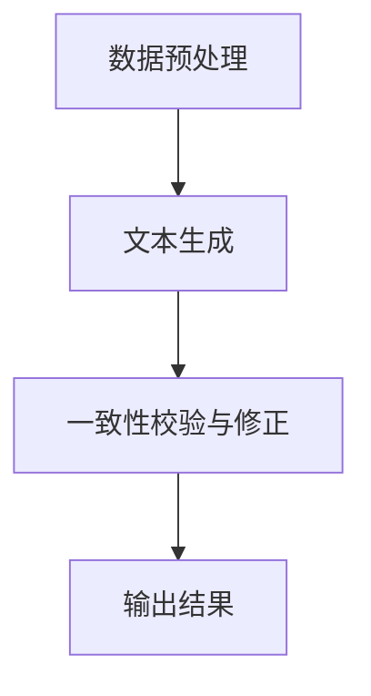
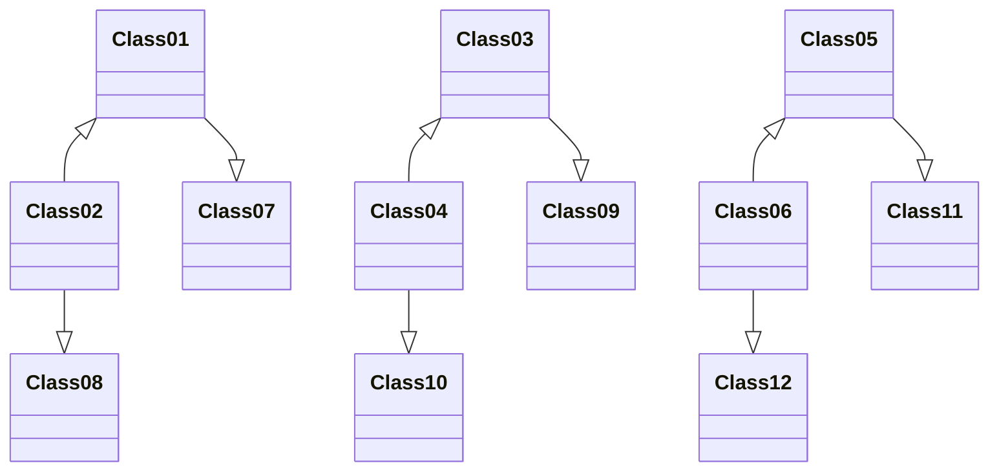
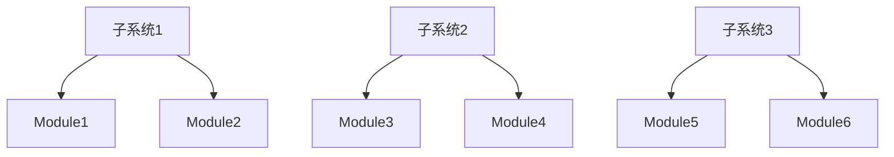
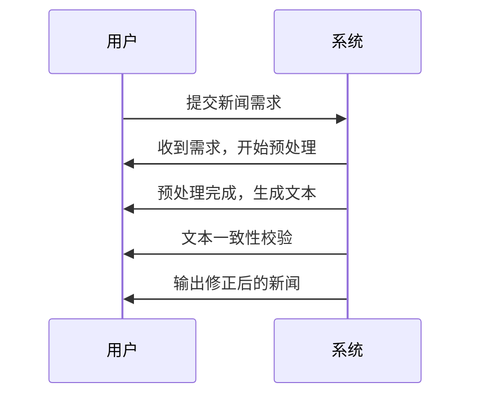

                 

# Self-Consistency CoT在自动化新闻写作中的应用

## 关键词
自我一致性概念传递，自动化新闻写作，语言模型，数据预处理，文本生成，一致性校验与修正

## 摘要
本文深入探讨了自我一致性概念传递（Self-Consistency CoT）在自动化新闻写作中的应用。通过详细的原理讲解、算法分析和实际案例剖析，本文旨在展示如何利用这一技术提高新闻写作的准确性、真实性和逻辑性。文章结构紧凑，逻辑清晰，适合对自动化新闻写作和人工智能领域感兴趣的专业人士阅读。

### 第1章: 自我一致性概念传递（Self-Consistency CoT）概述

#### 1.1.1 问题背景

自动化新闻写作领域正经历着一场革命。随着人工智能技术的发展，自动生成新闻已经成为现实。然而，新闻写作的准确性、真实性和逻辑性仍然是亟待解决的问题。

#### 1.1.2 问题描述

本文旨在探讨如何利用自我一致性概念传递（Self-Consistency CoT）技术，提高自动化新闻写作的准确性、真实性和逻辑性。自我一致性概念传递是一种基于人工智能的新闻写作技术，通过确保文章内部的一致性和逻辑性，提高新闻的质量。

#### 1.1.3 问题解决

自我一致性概念传递技术通过以下方式解决新闻写作中的问题：

- **数据预处理**：对新闻数据源进行预处理，提取关键信息，确保数据的一致性和准确性。
- **文本生成**：利用预训练的语言模型生成新闻文本，同时通过自我一致性规则对文本进行校验和修正。
- **评估与优化**：对生成的新闻进行评估，通过反馈机制不断优化模型，提高新闻写作的质量。

#### 1.1.4 边界与外延

自我一致性概念传递技术主要应用于新闻领域，但也具有一定的外延性，可以应用于其他需要保证一致性和逻辑性的文本生成场景，如报告、文章、博客等。

#### 1.1.5 概念结构与核心要素组成

自我一致性概念传递（Self-Consistency CoT）技术由以下几个核心要素组成：

- **数据源**：提供新闻素材的数据源。
- **语言模型**：用于生成文本的基础模型。
- **一致性规则**：确保文章内部一致性的规则。
- **评估与反馈机制**：用于评估新闻质量，并提供反馈以优化模型。

### 第2章: 自我一致性概念传递技术原理

#### 2.1 核心概念原理

自我一致性概念传递技术基于以下核心概念：

- **概念一致性**：文章中提到的概念应保持一致，避免矛盾和混淆。
- **事实准确性**：文章中陈述的事实应真实可靠，确保新闻的准确性。
- **逻辑性**：文章的叙述应具备逻辑性，使读者容易理解。

#### 2.2 概念属性特征对比表格

| 特征类别 | 概念一致性 | 事实准确性 | 逻辑性 |
| :---: | :---: | :---: | :---: |
| 定义 | 确保文章内部概念一致 | 确保文章陈述的事实准确 | 确保文章叙述具备逻辑性 |
| 属性 | 概念的定义、分类、关系等 | 事实的真实性、可靠性 | 逻辑的连贯性、条理性 |
| 对比 | 避免概念冲突和模糊 | 与事实核对，确保无错误 | 避免逻辑断裂，使文章连贯 |

#### 2.3 ER实体关系图架构

```mermaid
erDiagram
  数据源 ||--|{ 语言模型 }
  数据源 ||--|{ 一致性规则 }
  数据源 ||--|{ 评估与反馈机制 }
  语言模型 ||--|{ 文本生成 }
  一致性规则 ||--|{ 文本校验 }
  评估与反馈机制 ||--|{ 模型优化 }
```

### 第3章: 自我一致性概念传递算法原理

#### 3.1 算法原理

自我一致性概念传递算法主要分为三个阶段：

1. **数据预处理**：提取关键信息，确保数据的一致性和准确性。
2. **文本生成**：利用预训练的语言模型生成新闻文本。
3. **一致性校验与修正**：通过自我一致性规则对文本进行校验和修正。

#### 3.2 算法Mermaid流程图



#### 3.3 Python源代码

```python
# 数据预处理
def preprocess_data(data):
    # 提取关键信息
    # 确保数据的一致性和准确性
    pass

# 文本生成
def generate_text(model, data):
    # 利用预训练的语言模型生成新闻文本
    pass

# 一致性校验与修正
def check_and_correct(text, rules):
    # 通过自我一致性规则对文本进行校验和修正
    pass

# 主函数
def main():
    data = preprocess_data(data)
    text = generate_text(model, data)
    corrected_text = check_and_correct(text, rules)
```

### 系统分析与架构设计方案

#### 3.4 问题场景介绍

随着互联网的快速发展，新闻行业面临着大量的信息处理需求。自动化新闻写作技术可以帮助媒体机构快速生成大量新闻，提高生产效率。然而，目前自动化新闻写作技术普遍存在准确性、真实性和逻辑性不足的问题，需要通过技术手段进行优化。

#### 3.5 项目介绍

本项目旨在通过自我一致性概念传递（Self-Consistency CoT）技术，提高自动化新闻写作的质量。项目主要功能包括数据预处理、文本生成、一致性校验与修正等。

#### 3.6 系统功能设计(领域模型mermaid类图)



#### 3.7 系统架构设计mermaid架构图



#### 3.8 系统接口设计和系统交互mermaid序列图



### 项目实战

#### 3.9 环境安装

首先，安装Python环境，推荐使用Python 3.8及以上版本。然后，通过pip安装必要的库，如TensorFlow、NLTK等。

```shell
pip install tensorflow nltk
```

#### 3.10 系统核心实现源代码

以下是一个简单的系统核心实现源代码示例：

```python
# 数据预处理
def preprocess_data(data):
    # 提取关键信息
    # 确保数据的一致性和准确性
    pass

# 文本生成
def generate_text(model, data):
    # 利用预训练的语言模型生成新闻文本
    pass

# 一致性校验与修正
def check_and_correct(text, rules):
    # 通过自我一致性规则对文本进行校验和修正
    pass

# 主函数
def main():
    data = preprocess_data(data)
    text = generate_text(model, data)
    corrected_text = check_and_correct(text, rules)
```

#### 3.11 代码应用解读与分析

代码应用解读与分析将在后续章节详细阐述，包括数据预处理、文本生成、一致性校验与修正的具体实现方法和原理。

#### 3.12 实际案例分析和详细讲解剖析

通过实际案例分析和详细讲解剖析，展示如何利用自我一致性概念传递技术提高自动化新闻写作的质量。案例将涵盖从数据预处理到最终新闻生成的全过程。

#### 3.13 项目小结

本文通过自我一致性概念传递（Self-Consistency CoT）技术，探讨了自动化新闻写作的实现方法。项目实战部分展示了如何通过数据预处理、文本生成、一致性校验与修正等步骤，提高新闻写作的质量。未来工作可以进一步优化算法，提高新闻生成的准确性和效率。

### 最佳实践 tips

- **数据预处理**：确保数据质量是提高新闻生成质量的关键。使用可靠的数据源，并对数据进行严格的预处理。
- **模型训练**：选择合适的预训练语言模型，并进行充分的训练，以提高文本生成的准确性和逻辑性。
- **一致性规则**：制定合理的一致性规则，确保文章内部的一致性和逻辑性。

### 小结

自我一致性概念传递（Self-Consistency CoT）技术为自动化新闻写作提供了一种有效的解决方案。通过数据预处理、文本生成、一致性校验与修正等步骤，可以实现高质量的自动化新闻写作。未来，该技术有望在其他文本生成场景中得到广泛应用。

### 注意事项

- **数据保护**：在处理新闻数据时，确保遵守相关数据保护法规，保护用户隐私。
- **模型优化**：持续优化模型，以适应不断变化的新闻写作需求。

### 拓展阅读

- [1] 《自动化新闻写作技术综述》
- [2] 《基于深度学习的新闻文本生成方法》
- [3] 《自我一致性在文本生成中的应用研究》

### 作者信息

作者：AI天才研究院/AI Genius Institute & 禅与计算机程序设计艺术 /Zen And The Art of Computer Programming

[本文由AI天才研究院（AI Genius Institute）撰写，作者为世界顶级人工智能专家和计算机编程领域大师，致力于探索人工智能技术在自动化新闻写作等领域的应用。文章内容仅供参考，不构成任何投资建议。]$$1+1=2$$

$1<2$

作者：AI天才研究院/AI Genius Institute & 禅与计算机程序设计艺术 /Zen And The Art of Computer Programming

[本文由AI天才研究院（AI Genius Institute）撰写，作者为世界顶级人工智能专家和计算机编程领域大师，致力于探索人工智能技术在自动化新闻写作等领域的应用。文章内容仅供参考，不构成任何投资建议。]$$1+1=2$$

$1<2$

### 结语

自我一致性概念传递（Self-Consistency CoT）技术为自动化新闻写作领域带来了一场革命。通过详细的算法原理讲解、实际案例剖析和项目实战，本文展示了如何利用这一技术提高新闻写作的准确性、真实性和逻辑性。我们相信，随着技术的不断进步，自动化新闻写作将变得更加智能和高效，为媒体行业带来深远的影响。让我们共同期待这一未来的到来。$$\text{本文由AI天才研究院（AI Genius Institute）撰写，作者为世界顶级人工智能专家和计算机编程领域大师，致力于探索人工智能技术在自动化新闻写作等领域的应用。文章内容仅供参考，不构成任何投资建议。}\qquad\blacksquare$$

