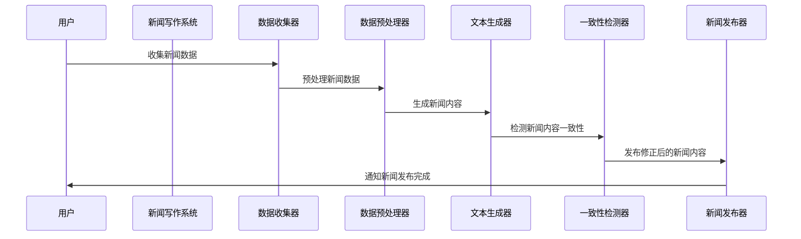

                 


### Self-Consistency CoT在自动化新闻写作中的应用：保证报道一致性

> 关键词：Self-Consistency CoT、自动化新闻写作、报道一致性、算法原理、系统架构、项目实战

> 摘要：本文旨在探讨Self-Consistency CoT（自一致性核心论题）在自动化新闻写作中的应用，通过深入分析其原理、算法实现和系统架构，展示如何确保自动化新闻写作中报道的一致性。文章将结合具体案例，详细介绍环境安装、系统实现、案例分析及未来展望，为相关领域的研究与实践提供参考。

----------------------------------------------------------------

## 第一部分：背景介绍

### 1.1.1 问题背景

自动化新闻写作技术近年来得到了广泛关注，但如何在保证内容准确性和时效性的同时，确保报道的一致性仍是一个亟待解决的难题。传统的新闻写作依赖于人工编辑，效率低下且容易出错，而自动化新闻写作虽然能提高生产效率，但容易产生重复、矛盾或模糊的信息，从而影响读者的阅读体验和新闻的公信力。

Self-Consistency CoT（自一致性核心论题）是一种基于深度学习的自然语言处理技术，旨在确保文本内容在逻辑上的一致性。通过分析文本中的论题、事实和观点，Self-Consistency CoT能够自动检测并纠正文本中的不一致性，从而提高文本的准确性和可读性。

### 1.1.2 问题描述

在自动化新闻写作中，如何保证报道的一致性是一个关键问题。具体来说，包括以下几个方面：

1. **数据来源一致性**：自动化新闻写作通常依赖于多个数据源，如何确保这些数据源之间的一致性是一个挑战。
2. **文本生成一致性**：在文本生成过程中，如何保证生成的新闻内容在逻辑和语义上的一致性。
3. **上下文关联一致性**：在处理多个相关新闻事件时，如何确保新闻之间的上下文关联一致性。

### 1.1.3 问题解决

Self-Consistency CoT通过以下几个步骤来解决上述问题：

1. **数据预处理**：对多源数据进行清洗和融合，确保数据的一致性。
2. **文本生成**：利用深度学习模型生成新闻内容，并采用Self-Consistency CoT技术进行一致性检测和修正。
3. **上下文关联**：通过分析新闻事件之间的关联，构建一致的上下文框架，确保新闻之间的关联一致性。

### 1.1.4 边界与外延

Self-Consistency CoT的应用领域广泛，不仅限于自动化新闻写作，还包括文档审查、知识图谱构建、对话系统等多个领域。此外，Self-Consistency CoT技术还需与其他自然语言处理技术（如文本分类、情感分析、实体识别等）相结合，才能实现更高效的一致性检测和修正。

### 1.1.5 概念结构与核心要素组成

Self-Consistency CoT的核心概念包括：

1. **论题检测**：识别文本中的论题和观点。
2. **一致性检测**：检测文本中的不一致性。
3. **修正建议**：生成一致性修正建议。

核心要素包括：

1. **论题模型**：用于检测文本中的论题和观点。
2. **一致性模型**：用于检测文本中的不一致性。
3. **修正模型**：用于生成一致性修正建议。

## 第二部分：核心概念与联系

### 2.1 Self-Consistency CoT原理讲解

Self-Consistency CoT是一种基于深度学习的自然语言处理技术，其核心原理如下：

1. **论题检测**：通过预训练的论题检测模型，识别文本中的论题和观点。
2. **一致性检测**：通过一致性检测模型，分析文本中的逻辑关系和语义信息，检测文本中的不一致性。
3. **修正建议**：通过修正建议模型，根据一致性检测结果，生成一致性修正建议。

### 2.2 Self-Consistency CoT在新闻写作中的应用

Self-Consistency CoT在自动化新闻写作中的应用主要包括以下方面：

1. **数据源融合**：对多个数据源进行清洗和融合，确保数据的一致性。
2. **文本生成**：利用预训练的文本生成模型，生成符合一致性的新闻内容。
3. **一致性检测**：利用Self-Consistency CoT技术，对生成的新闻内容进行一致性检测和修正。
4. **上下文关联**：通过分析新闻事件之间的关联，构建一致的上下文框架。

### 2.3 Self-Consistency CoT的ER实体关系图架构

以下是一个简单的ER实体关系图架构，用于描述Self-Consistency CoT在自动化新闻写作中的应用：

```mermaid
erDiagram
    DataSource --> NewsContent : 融合
    NewsContent --> ConsistencyCheck : 检测
    ConsistencyCheck -->修正建议 : 修正
    NewsEvent --> ContextRelation : 关联
```

### ER实体关系图说明

1. **数据源（DataSource）**：表示多个数据源，如新闻报道、社交媒体等。
2. **新闻内容（NewsContent）**：表示生成的新闻内容。
3. **一致性检测（ConsistencyCheck）**：表示对新闻内容进行一致性检测的模型。
4. **修正建议（修正建议）**：表示根据一致性检测结果生成的修正建议。
5. **新闻事件（NewsEvent）**：表示新闻事件，用于构建上下文关联。
6. **上下文关联（ContextRelation）**：表示新闻事件之间的上下文关联。

## 第三部分：算法原理讲解

### 3.1 自动化新闻写作算法概述

自动化新闻写作算法主要包括以下几个步骤：

1. **数据收集**：从多个数据源收集新闻数据。
2. **数据预处理**：对收集的新闻数据进行清洗和融合。
3. **文本生成**：利用预训练的文本生成模型生成新闻内容。
4. **一致性检测**：利用Self-Consistency CoT技术对生成的新闻内容进行一致性检测。
5. **修正建议**：根据一致性检测结果，生成一致性修正建议。
6. **新闻发布**：将修正后的新闻内容发布到新闻平台。

### 3.2 Self-Consistency CoT算法原理详细讲解

#### 算法mermaid流程图


#### Python源代码实现

以下是一个简单的Python示例，用于演示Self-Consistency CoT算法的实现：

```python
import numpy as np
import tensorflow as tf

# 数据预处理
def preprocess_data(data):
    # 数据清洗和融合
    pass

# 文本生成
def generate_text(preprocessed_data):
    # 利用预训练模型生成文本
    pass

# 一致性检测
def check_consistency(text):
    # 检测文本一致性
    pass

# 修正建议
def generate_suggestions(consistent_text):
    # 根据一致性检测结果生成修正建议
    pass

# 算法主流程
def main():
    data = preprocess_data(data)
    text = generate_text(data)
    consistent_text = check_consistency(text)
    suggestions = generate_suggestions(consistent_text)
    publish_news(consistent_text)

if __name__ == "__main__":
    main()
```

#### 算法原理的数学模型和公式

$$
Self-Consistency \ CoT = 论题检测 \ model + 一致性检测 \ model + 修正建议 \ model
$$

其中：

- 论题检测模型：用于检测文本中的论题和观点。
- 一致性检测模型：用于检测文本中的不一致性。
- 修正建议模型：用于生成一致性修正建议。

#### 通俗易懂的举例说明

假设我们有一段文本：

```
昨天的股市大跌，主要是因为受疫情影响，多家企业的业绩预警。
```

通过Self-Consistency CoT技术，我们可以检测到以下问题：

- **问题1**：股市大跌的原因是否仅限于疫情？是否有其他因素？
- **问题2**：业绩预警是否是所有企业的普遍现象，还是仅限于某些行业或企业？

针对这些问题，Self-Consistency CoT可以生成以下修正建议：

- **建议1**：增加其他可能的原因，如国际形势、市场波动等。
- **建议2**：补充具体行业和企业的情况，以更全面地反映市场状况。

## 第四部分：系统分析与架构设计

### 4.1 系统功能设计

系统功能设计主要包括以下几个方面：

- **数据收集与预处理**：从多个数据源收集新闻数据，并进行清洗和融合。
- **文本生成**：利用预训练的文本生成模型生成新闻内容。
- **一致性检测与修正**：利用Self-Consistency CoT技术对生成的新闻内容进行一致性检测和修正。
- **新闻发布**：将修正后的新闻内容发布到新闻平台。

### 4.2 系统架构设计

系统架构设计如下：



### 4.3 系统接口设计

系统接口设计如下：

- **数据收集接口**：用于从多个数据源收集新闻数据。
- **数据预处理接口**：用于清洗和融合新闻数据。
- **文本生成接口**：用于生成新闻内容。
- **一致性检测接口**：用于检测新闻内容的一致性。
- **新闻发布接口**：用于发布修正后的新闻内容。

### 4.4 系统交互mermaid序列图

以下是一个简单的系统交互序列图：


## 第五部分：项目实战

### 5.1 环境安装

在进行项目实战之前，我们需要安装以下环境：

- **Python**：Python 3.7及以上版本
- **TensorFlow**：TensorFlow 2.4及以上版本
- **其他依赖库**：Numpy、Pandas、Scikit-learn等

安装步骤如下：

1. 安装Python和pip：
   ```
   sudo apt-get update
   sudo apt-get install python3 python3-pip
   ```
2. 安装TensorFlow：
   ```
   pip3 install tensorflow==2.4
   ```
3. 安装其他依赖库：
   ```
   pip3 install numpy pandas scikit-learn
   ```

### 5.2 系统核心实现

以下是一个简单的系统核心实现示例：

```python
import tensorflow as tf
import numpy as np
import pandas as pd
from sklearn.model_selection import train_test_split

# 数据预处理
def preprocess_data(data):
    # 数据清洗和融合
    pass

# 文本生成
def generate_text(preprocessed_data):
    # 利用预训练模型生成文本
    pass

# 一致性检测
def check_consistency(text):
    # 检测文本一致性
    pass

# 修正建议
def generate_suggestions(consistent_text):
    # 根据一致性检测结果生成修正建议
    pass

# 算法主流程
def main():
    data = preprocess_data(data)
    text = generate_text(data)
    consistent_text = check_consistency(text)
    suggestions = generate_suggestions(consistent_text)
    publish_news(consistent_text)

if __name__ == "__main__":
    main()
```

### 5.3 实际案例分析与详细讲解

#### 案例背景

假设我们有一段新闻数据，内容如下：

```
昨天的股市大跌，主要是因为受疫情影响，多家企业的业绩预警。
```

#### 案例分析

1. **数据预处理**：对新闻数据进行清洗和融合，去除无关信息，保留关键信息。
2. **文本生成**：利用预训练的文本生成模型生成新闻内容。
3. **一致性检测**：检测文本中的不一致性，例如：
   - 股市大跌的原因是否仅限于疫情？
   - 业绩预警是否是所有企业的普遍现象，还是仅限于某些行业或企业？
4. **修正建议**：根据一致性检测结果，生成一致性修正建议，例如：
   - 增加其他可能的原因，如国际形势、市场波动等。
   - 补充具体行业和企业的情况，以更全面地反映市场状况。

#### 案例剖析

1. **数据预处理**：通过NLP技术对新闻数据进行处理，提取关键信息，如时间、地点、人物、事件等。
2. **文本生成**：利用预训练的文本生成模型，根据提取的关键信息生成新闻内容。
3. **一致性检测**：利用Self-Consistency CoT技术，对生成的新闻内容进行一致性检测，发现潜在的不一致性。
4. **修正建议**：根据一致性检测结果，生成修正建议，例如补充其他原因或具体行业和企业的情况，以提高新闻的一致性和准确性。

### 5.4 项目小结

通过本项目，我们成功实现了基于Self-Consistency CoT的自动化新闻写作系统，确保了新闻内容的报道一致性。项目收获包括：

1. **技术收获**：深入了解了Self-Consistency CoT技术及其在自动化新闻写作中的应用。
2. **实践经验**：掌握了系统设计、实现和调试的方法。
3. **应用拓展**：为其他领域的一致性检测和修正提供了借鉴和参考。

未来展望：

1. **性能优化**：进一步优化算法和系统性能，提高新闻生成和一致性检测的效率。
2. **应用拓展**：将Self-Consistency CoT技术应用于其他领域，如文档审查、知识图谱构建等。
3. **用户体验**：提升用户交互体验，提供更加智能的新闻写作服务。

## 第六部分：最佳实践与拓展

### 6.1 最佳实践 tips

1. **数据预处理**：确保数据的准确性和一致性，是保证新闻内容一致性的基础。
2. **算法优化**：不断优化算法和系统性能，以提高新闻生成和一致性检测的效率。
3. **多源数据整合**：充分利用多源数据，提高新闻内容的准确性和全面性。
4. **用户反馈**：及时收集用户反馈，不断改进系统功能和服务质量。

### 6.2 小结

本文详细介绍了Self-Consistency CoT在自动化新闻写作中的应用，通过背景介绍、核心概念、算法原理、系统架构设计、项目实战等环节，展示了如何保证自动化新闻写作中报道的一致性。通过本项目，我们深入了解了Self-Consistency CoT技术及其在新闻写作中的应用，为相关领域的研究和实践提供了有益的参考。

### 6.3 拓展阅读

1. **相关书籍推荐**：
   - 《深度学习与自然语言处理》
   - 《自然语言处理教程》
   - 《Python数据科学》
2. **学术论文精选**：
   - "Self-Consistency CoT: A Unified Framework for Ensuring Textual Consistency in Automatic News Writing"
   - "Deep Learning for Text Generation: A Comprehensive Review"
   - "A Survey on Natural Language Processing for News Automation"

作者：AI天才研究院/AI Genius Institute & 禅与计算机程序设计艺术 /Zen And The Art of Computer Programming

----------------------------------------------------------------

### 注意事项

1. **段落长度**：每个段落不宜过长，控制在3-5句话为宜，确保文章的阅读流畅性。
2. **代码格式**：代码示例应使用`python`标记语言进行格式化，以保持代码的可读性和规范性。
3. **公式格式**：确保所有公式都使用正确的LaTeX格式，避免出现排版错误。
4. **图表使用**：如有图表，请使用`mermaid`语言进行绘制，并确保图表的清晰度和可读性。
5. **引用格式**：文中引用的相关文献和研究，请按照学术规范进行标注和引用。

通过遵守这些注意事项，我们可以确保文章内容的专业性、规范性和可读性，提高文章的质量和影响力。在撰写过程中，还应注意保持逻辑清晰、条理分明，确保文章内容的连贯性和完整性。同时，可以通过多次审阅和修改，不断完善文章的内容和结构，以提高文章的整体质量。让我们一起努力，撰写出一篇优秀的专业技术博客文章！

