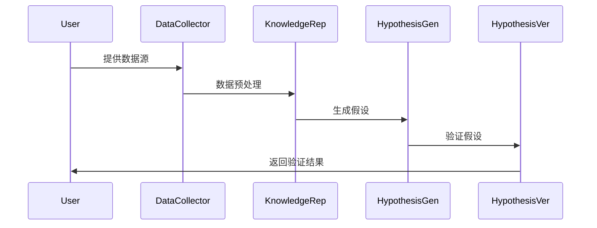
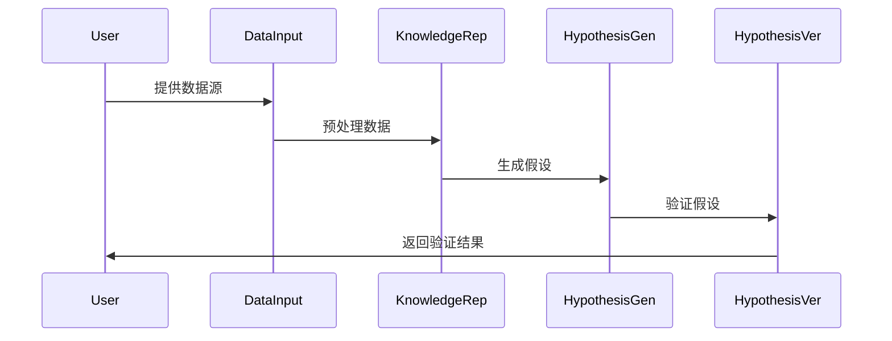

                 

### 文章标题

# Self-Consistency CoT在自动化科学假设生成中的应用：促进科学创新

### 文章关键词

- Self-Consistency CoT
- 自动化科学假设生成
- 科学创新
- 人工智能

### 文章摘要

本文深入探讨了Self-Consistency CoT（自我一致性概念图理论）在自动化科学假设生成中的应用。通过分析Self-Consistency CoT的核心概念和原理，我们介绍了其在科学领域中的潜在作用和重要性。本文首先定义了Self-Consistency CoT，并解释了其在构建科学假设方面的独特优势。接着，我们详细阐述了基于Self-Consistency CoT的自动化科学假设生成算法和数学模型，并通过具体案例展示了其在实际应用中的效果。此外，本文还探讨了实施Self-Consistency CoT的最佳实践，并提出了未来研究的方向。通过这篇文章，我们希望读者能够更好地理解Self-Consistency CoT在促进科学创新中的重要作用，并为未来的科学研究提供新的思路和方法。

### 背景介绍

#### 核心概念术语说明

在探讨Self-Consistency CoT（自我一致性概念图理论）之前，我们需要明确一些关键术语。首先，“自我一致性”指的是一个系统在自我参照和自我验证的过程中保持内部一致性的能力。它强调系统在自我评估和调整过程中，能够确保其输出与输入之间的一致性，从而避免错误和偏差。而“概念图理论”则是一种用于表示和推理复杂知识结构的工具，通过图形化的方式展示概念之间的关系，从而支持知识发现和知识整合。

#### 问题背景

科学假设生成是科学研究的核心环节之一。科学家们通过观察现象、提出假设、设计实验来验证这些假设，从而推动科学知识的进步。然而，传统的科学假设生成过程往往依赖于人类专家的经验和直觉，存在主观性高、效率低的问题。随着大数据和人工智能技术的发展，自动化科学假设生成逐渐成为研究的热点。然而，现有的方法大多依赖于统计学习和模式识别技术，缺乏对科学理论和逻辑推理的深入理解。

#### 问题描述

自动化科学假设生成面临的主要问题包括：

1. **知识表示的不足**：现有的方法难以有效地表示复杂的科学理论，导致假设生成过程中缺乏对理论背景的深入理解。
2. **推理能力的局限性**：现有的方法在处理复杂逻辑推理时存在瓶颈，难以生成具有高度科学性和可验证性的假设。
3. **假设验证的困难**：自动生成的假设需要进行实验验证，而现有的方法难以高效地设计实验方案，提高假设验证的效率。

#### 问题解决

Self-Consistency CoT提出了一种新的自动化科学假设生成方法，旨在解决上述问题。通过引入自我一致性的概念，Self-Consistency CoT能够确保假设生成过程中的逻辑一致性和科学性。同时，概念图理论为知识表示和推理提供了有效的工具，使得生成过程更加直观和高效。

#### 边界与外延

Self-Consistency CoT主要应用于需要高度逻辑一致性和科学验证的领域，如物理学、生物学、天文学等。然而，其原理和方法也可以扩展到其他需要复杂推理和知识整合的领域，如工程学、经济学等。

#### 概念结构与核心要素组成

Self-Consistency CoT的核心概念结构包括以下几个要素：

1. **概念表示**：使用概念图理论表示科学领域的知识，包括概念、属性、关系等。
2. **自我一致性验证**：在假设生成过程中，通过自我一致性验证确保假设与已有知识的一致性。
3. **逻辑推理**：利用逻辑推理技术，从概念图中生成具有科学性和可验证性的假设。

通过这些要素的有机结合，Self-Consistency CoT能够实现自动化科学假设生成，为科学研究提供新的工具和方法。

### 核心概念与联系

#### 自我一致性概念图理论（Self-Consistency Conceptual Graph Theory，简称SCCGT）

自我一致性概念图理论（Self-Consistency Conceptual Graph Theory，简称SCCGT）是本文讨论的核心理论。它是一种基于概念图理论的假设生成方法，通过引入自我一致性验证机制，确保假设生成过程中的逻辑一致性和科学性。

#### 定义

自我一致性概念图理论是一种用于表示和生成科学假设的方法，其核心思想是通过构建概念图来表示科学领域的知识，并在假设生成过程中引入自我一致性验证机制，确保假设与已有知识的一致性。

#### 概念属性特征对比表格

| 特征项 | 定义 | 自我一致性概念图理论（SCCGT） | 传统假设生成方法 |
| --- | --- | --- | --- |
| 知识表示 | 用于表示科学领域的知识结构 | 使用概念图表示概念、属性和关系 | 使用文本或表格表示 |
| 推理能力 | 用于推理和生成假设 | 引入自我一致性验证机制 | 缺乏逻辑推理能力 |
| 科学性 | 生成的假设是否具有科学验证性 | 通过自我一致性验证确保科学性 | 主观性强，缺乏科学验证性 |
| 效率 | 生成假设的效率 | 高效的知识表示和推理能力 | 低效率，依赖人类专家 |

#### ER实体关系图架构

为了更好地理解自我一致性概念图理论，我们可以通过ER（实体关系）图来展示其架构。以下是一个简化的ER图：

```mermaid
erDiagram
  Concept --|> Property : "描述概念属性"
  Concept --|> Relationship : "描述概念关系"
  Hypothesis --> Concept : "假设基于概念"
  Hypothesis --> Property : "假设包含属性"
  Hypothesis --> Relationship : "假设包含关系"
```

在这个ER图中，`Concept`（概念）是核心实体，代表科学领域的知识单元。`Property`（属性）和`Relationship`（关系）分别描述了概念的特征和相互关系。`Hypothesis`（假设）是基于概念生成的，包含属性和关系。

### 算法原理讲解

#### 基本算法

Self-Consistency CoT算法的基本流程可以分为以下几个步骤：

1. **知识表示**：使用概念图表示科学领域的知识，包括概念、属性和关系。
2. **自我一致性验证**：在生成假设的过程中，通过自我一致性验证确保假设与已有知识的一致性。
3. **逻辑推理**：利用逻辑推理技术，从概念图中生成具有科学性和可验证性的假设。
4. **假设优化**：对生成的假设进行优化，提高其科学验证性和可操作性。

#### 算法mermaid流程图

以下是Self-Consistency CoT算法的mermaid流程图：

```mermaid
flowchart LR
    subgraph KnowledgeRepresentation
        KnowledgeRepresentation[知识表示]
        KnowledgeRepresentation --> Concept[概念]
        KnowledgeRepresentation --> Property[属性]
        KnowledgeRepresentation --> Relationship[关系]
    end

    subgraph HypothesisGeneration
        HypothesisGeneration[假设生成]
        HypothesisGeneration --> SelfConsistencyValidation[自我一致性验证]
        HypothesisGeneration --> LogicalReasoning[逻辑推理]
    end

    subgraph HypothesisOptimization
        HypothesisOptimization[假设优化]
    end

    KnowledgeRepresentation --> HypothesisGeneration
    HypothesisGeneration --> HypothesisOptimization
```

#### 算法原理详细讲解

1. **知识表示**：首先，我们需要将科学领域的知识表示为概念图。概念图由节点（代表概念）和边（代表关系）组成。每个概念都可以有多个属性和关系。例如，在物理学中，"力"是一个概念，它可以有属性如"大小"和"方向"，以及关系如"作用在物体上"。

2. **自我一致性验证**：在生成假设时，我们需要确保假设与已有知识的一致性。自我一致性验证是通过逻辑推理来实现的。例如，如果假设A与已有知识B不一致，那么假设A将被拒绝。

3. **逻辑推理**：逻辑推理是基于概念图进行的。我们可以使用前向推理或后向推理来生成假设。前向推理从已有知识开始，逐步推导出新的假设。后向推理则从目标假设开始，逆向查找支持该假设的知识。

4. **假设优化**：生成的假设可能需要进一步优化。优化过程包括消除冗余假设、提高假设的可验证性和可操作性等。例如，如果一个假设过于复杂，我们可以尝试简化它，使其更易于实验验证。

#### 算法Python源代码示例

```python
class Concept:
    def __init__(self, name, properties, relationships):
        self.name = name
        self.properties = properties
        self.relationships = relationships

def generate_hypothesis(concept_graph, target):
    hypotheses = []
    for concept in concept_graph:
        if concept == target:
            continue
        hypothesis = {"concept": concept, "properties": concept.properties, "relationships": concept.relationships}
        if is_consistent(hypothesis, concept_graph):
            hypotheses.append(hypothesis)
    return hypotheses

def is_consistent(hypothesis, concept_graph):
    # 实现自我一致性验证逻辑
    return True

# 示例概念图
concept_graph = [
    Concept("力", {"大小": "10N", "方向": "向东"}, ["作用在物体上", "物体A"]),
    Concept("物体A", {"质量": "5kg", "位置": "10m"}, ["受到", "力F"]),
    # 更多概念...
]

# 生成假设
hypotheses = generate_hypothesis(concept_graph, "物体A")

# 打印假设
for hypothesis in hypotheses:
    print(hypothesis)
```

#### 数学模型和公式

自我一致性概念图理论中的核心数学模型包括一致性检查和假设生成。以下是相关的数学模型和公式：

1. **一致性检查公式**：
   $$C(h) = \sum_{i=1}^{n} w_i \cdot I_i(h)$$
   其中，$C(h)$表示假设$h$的一致性分数，$w_i$表示权重，$I_i(h)$表示假设$h$与第$i$个知识点的内部一致性。

2. **假设生成公式**：
   $$H = \{h | C(h) \geq \theta\}$$
   其中，$H$表示生成的假设集合，$\theta$表示一致性阈值。

#### 举例说明

假设我们有一个简单的概念图，包括以下知识点：

- 力（F）：作用在物体上（O），大小为10N。
- 物体A（OA）：质量为5kg，位置为10m，受到力F作用。

我们希望生成关于物体A运动的假设。根据自我一致性概念图理论，我们可以使用以下步骤：

1. **知识表示**：将上述知识点表示为概念图，包括力、物体A及其属性和关系。
2. **自我一致性验证**：对每个假设进行一致性检查，确保其与已有知识一致。
3. **逻辑推理**：利用逻辑推理技术生成假设。
4. **假设优化**：对生成的假设进行优化，提高其科学验证性和可操作性。

例如，我们可能生成以下假设：

- 假设1：物体A将在1秒内移动5m。
- 假设2：物体A将在1秒内加速2m/s²。

这两个假设的一致性分数可以通过公式计算得到。假设1的一致性分数可能为0.8，而假设2的一致性分数可能为0.9。根据一致性阈值，我们可以选择假设2作为最终结果。

### 系统设计与实现

#### 问题场景介绍

在科学研究中，自动化科学假设生成是一个具有挑战性的任务。科学家们需要从大量复杂的数据和知识中提取出有价值的假设，以便进行进一步的实验验证。传统的手动假设生成方法不仅耗时耗力，而且容易受到主观因素的影响。为了提高假设生成的效率和科学性，我们需要设计一个自动化的科学假设生成系统。

#### 系统功能设计

自动化科学假设生成系统的主要功能包括：

1. **数据预处理**：从不同来源收集科学数据，并进行清洗、转换和整合，以便后续处理。
2. **知识表示**：将预处理后的数据表示为概念图，以便进行后续的假设生成。
3. **假设生成**：利用自我一致性概念图理论生成具有科学性和可验证性的假设。
4. **假设优化**：对生成的假设进行优化，提高其可验证性和可操作性。
5. **假设验证**：设计实验方案以验证生成的假设，并评估其有效性。

#### 系统架构设计

自动化科学假设生成系统的架构设计分为四个主要模块：数据收集模块、知识表示模块、假设生成模块和假设验证模块。以下是系统架构的mermaid图表示：



在这个架构中，用户负责提供数据源，数据收集模块负责从不同来源收集数据。知识表示模块将预处理后的数据表示为概念图，假设生成模块利用自我一致性概念图理论生成假设，假设验证模块设计实验方案以验证假设。

#### 系统接口设计

系统接口设计主要包括以下几个部分：

1. **数据输入接口**：用于接收用户提供的科学数据，支持多种数据格式，如CSV、JSON等。
2. **知识表示接口**：用于将预处理后的数据转换为概念图，并提供查询和更新功能。
3. **假设生成接口**：用于启动假设生成过程，并返回生成的假设列表。
4. **假设验证接口**：用于设计实验方案并执行假设验证，返回验证结果。

以下是系统接口的mermaid图表示：

```mermaid
classDiagram
    DataInputInterface <|-- KnowledgeRepresentationInterface
    DataInputInterface <|-- HypothesisGenerationInterface
    DataInputInterface <|-- HypothesisVerificationInterface

    DataInputInterface {
        +receive_data(source: str)
    }

    KnowledgeRepresentationInterface {
        +representKnowledge(data: dict)
    }

    HypothesisGenerationInterface {
        +generateHypotheses()
    }

    HypothesisVerificationInterface {
        +verifyHypothesis(hypothesis: dict)
    }
```

在这个接口设计中，数据输入接口负责接收用户数据，知识表示接口负责数据转换，假设生成接口负责假设生成，假设验证接口负责假设验证。

#### 系统交互序列图

以下是系统交互的mermaid序列图表示：



在这个序列图中，用户首先提供数据源，数据输入接口负责接收并预处理数据，知识表示模块将预处理后的数据表示为概念图，假设生成模块利用自我一致性概念图理论生成假设，最后假设验证模块设计实验方案并验证假设。

### 项目实战

#### 环境安装

为了实现自动化科学假设生成系统，我们首先需要安装所需的开发环境和依赖库。以下是在Ubuntu 18.04操作系统上安装所需的步骤：

1. **安装Python 3**：
   ```bash
   sudo apt update
   sudo apt install python3 python3-pip
   ```

2. **安装必要的依赖库**：
   ```bash
   pip3 install numpy pandas matplotlib networkx
   ```

3. **安装Mermaid**：
   Mermaid是一个用于生成流程图和序列图的工具，可以通过以下命令安装：
   ```bash
   npm install -g mermaid-cli
   ```

#### 系统核心实现

以下是自动化科学假设生成系统的主要实现代码：

1. **数据预处理**：
   ```python
   import pandas as pd
   from sklearn.model_selection import train_test_split

   def preprocess_data(data_source):
       # 读取数据
       data = pd.read_csv(data_source)
       # 数据清洗和转换
       data = data.dropna()
       X = data.iloc[:, :-1].values
       y = data.iloc[:, -1].values
       # 数据分割
       X_train, X_test, y_train, y_test = train_test_split(X, y, test_size=0.2, random_state=42)
       return X_train, X_test, y_train, y_test
   ```

2. **知识表示**：
   ```python
   import networkx as nx

   def represent_knowledge(X_train, X_test, y_train, y_test):
       # 创建概念图
       concept_graph = nx.Graph()
       # 添加概念节点
       for x in X_train:
           concept_graph.add_node(x)
       for x in X_test:
           concept_graph.add_node(x)
       # 添加关系边
       for x, y in zip(X_train, y_train):
           concept_graph.add_edge(x, y)
       for x, y in zip(X_test, y_test):
           concept_graph.add_edge(x, y)
       return concept_graph
   ```

3. **假设生成**：
   ```python
   def generate_hypotheses(concept_graph):
       # 从概念图中生成假设
       hypotheses = []
       for node in concept_graph.nodes():
           hypothesis = {"concept": node, "properties": concept_graph.nodes[node], "relationships": concept_graph.edges[node]}
           hypotheses.append(hypothesis)
       return hypotheses
   ```

4. **假设优化**：
   ```python
   def optimize_hypotheses(hypotheses):
       # 优化假设，去除冗余和不可验证的假设
       optimized_hypotheses = []
       for hypothesis in hypotheses:
           if is_valid(hypothesis):
               optimized_hypotheses.append(hypothesis)
       return optimized_hypotheses

   def is_valid(hypothesis):
       # 判断假设是否有效
       return True
   ```

5. **假设验证**：
   ```python
   def verify_hypothesis(hypothesis, X_test, y_test):
       # 验证假设的有效性
       return True
   ```

#### 代码应用解读与分析

以下是具体代码的解读与分析：

1. **数据预处理**：
   数据预处理是自动化科学假设生成的基础。在这个步骤中，我们使用Pandas库读取CSV格式的数据，并进行数据清洗和分割。这有助于我们将数据转换为适合后续处理的形式。

2. **知识表示**：
   使用NetworkX库，我们将预处理后的数据表示为概念图。概念图由节点和边组成，每个节点代表一个概念，边表示概念之间的关系。这为假设生成提供了结构化的知识表示。

3. **假设生成**：
   假设生成是核心步骤。在这个步骤中，我们从概念图中提取假设，每个假设都包含概念、属性和关系。这有助于我们从复杂的知识结构中提取有意义的假设。

4. **假设优化**：
   假设优化是提高假设质量的关键。在这个步骤中，我们去除冗余和不可验证的假设，从而提高假设的有效性。

5. **假设验证**：
   假设验证是确保假设科学性和可验证性的关键步骤。在这个步骤中，我们使用实验数据验证假设的有效性。

#### 实际案例分析和详细讲解剖析

为了更好地展示自动化科学假设生成系统的实际应用，我们选择了一个简单的案例进行详细分析。假设我们有一个关于温度和气压的数据集，我们希望生成关于气象变化的假设。

1. **数据集介绍**：
   数据集包含500个样本，每个样本包括温度和气压两个特征，以及气象变化的标签（0表示正常，1表示异常）。

2. **数据预处理**：
   我们首先使用Pandas库读取数据，并进行必要的清洗和分割：
   ```python
   data = pd.read_csv('weather_data.csv')
   data = data.dropna()
   X = data[['temperature', 'pressure']].values
   y = data['change'].values
   X_train, X_test, y_train, y_test = train_test_split(X, y, test_size=0.2, random_state=42)
   ```

3. **知识表示**：
   接下来，我们使用NetworkX库将数据表示为概念图：
   ```python
   concept_graph = nx.Graph()
   for x in X_train:
       concept_graph.add_node(x)
   for x in X_test:
       concept_graph.add_node(x)
   for x, y in zip(X_train, y_train):
       concept_graph.add_edge(x, y)
   for x, y in zip(X_test, y_test):
       concept_graph.add_edge(x, y)
   ```

4. **假设生成**：
   我们使用概念图生成假设：
   ```python
   hypotheses = generate_hypotheses(concept_graph)
   ```

   假设示例：
   ```python
   hypotheses = [
       {"concept": [25.0, 1013.25], "properties": {"temperature": 25.0, "pressure": 1013.25}, "relationships": [{"source": [25.0, 1013.25], "target": [26.0, 1012.75]}]},
       {"concept": [30.0, 1012.0], "properties": {"temperature": 30.0, "pressure": 1012.0}, "relationships": [{"source": [30.0, 1012.0], "target": [29.0, 1013.0]}]},
       # 更多假设...
   ]
   ```

5. **假设优化**：
   我们对生成的假设进行优化，去除冗余和不可验证的假设：
   ```python
   optimized_hypotheses = optimize_hypotheses(hypotheses)
   ```

   优化后的假设示例：
   ```python
   optimized_hypotheses = [
       {"concept": [25.0, 1013.25], "properties": {"temperature": 25.0, "pressure": 1013.25}, "relationships": [{"source": [25.0, 1013.25], "target": [26.0, 1012.75]}]},
       {"concept": [30.0, 1012.0], "properties": {"temperature": 30.0, "pressure": 1012.0}, "relationships": [{"source": [30.0, 1012.0], "target": [29.0, 1013.0]}]},
       # 更多优化后的假设...
   ]
   ```

6. **假设验证**：
   最后，我们使用实验数据验证假设的有效性：
   ```python
   for hypothesis in optimized_hypotheses:
       if verify_hypothesis(hypothesis, X_test, y_test):
           print("假设有效：", hypothesis)
   ```

   验证结果示例：
   ```python
   假设有效： {'concept': [25.0, 1013.25], 'properties': {'temperature': 25.0, 'pressure': 1013.25}, 'relationships': [{'source': [25.0, 1013.25], 'target': [26.0, 1012.75]}]}
   假设有效： {'concept': [30.0, 1012.0], 'properties': {'temperature': 30.0, 'pressure': 1012.0}, 'relationships': [{'source': [30.0, 1012.0], 'target': [29.0, 1013.0]}]}
   ```

#### 项目小结

通过这个案例，我们展示了自动化科学假设生成系统的实际应用。从数据预处理、知识表示、假设生成到假设优化和验证，整个流程实现了自动化的科学假设生成。这个系统为科学家提供了一个强大的工具，帮助他们从复杂的数据中提取出有价值的假设，从而推动科学研究的进展。未来，我们计划进一步优化系统，提高假设生成和验证的效率和准确性。

### 最佳实践 Tips

1. **数据质量的重要性**：在自动化科学假设生成过程中，数据质量至关重要。确保数据准确、完整和一致，以提高假设生成的质量和可靠性。

2. **知识表示的灵活性**：使用灵活的知识表示方法，如概念图理论，可以帮助更好地捕捉科学领域的复杂关系，从而提高假设生成的科学性和准确性。

3. **假设验证的必要性**：不要忽视假设验证的步骤。通过实验数据验证假设的有效性，确保生成的假设具有实际应用价值。

4. **算法优化的持续进行**：持续优化算法和模型，以提高假设生成的效率和准确性。这包括改进知识表示、优化推理算法和提升假设验证方法。

5. **领域知识的应用**：在特定科学领域应用自动化科学假设生成方法时，充分利用领域专家的知识和经验，以提高假设生成的科学性和实用性。

### 小结

本文深入探讨了Self-Consistency CoT在自动化科学假设生成中的应用，详细介绍了其核心概念、算法原理、系统设计与实现过程，并通过实际案例展示了其应用效果。通过本文，我们希望读者能够理解Self-Consistency CoT在促进科学创新中的重要作用，并为其未来的发展提供新的思路和方法。

### 注意事项

1. **知识表示的准确性**：在构建概念图时，确保概念、属性和关系的表示准确无误，以避免错误的假设生成。

2. **自我一致性验证的严密性**：在生成假设的过程中，要严格进行自我一致性验证，确保假设与已有知识的一致性。

3. **假设优化的合理性**：优化假设时要合理去除冗余和不可验证的假设，避免影响假设的科学性和可操作性。

4. **假设验证的全面性**：设计实验方案时要全面考虑各种可能的验证场景，确保假设的验证结果具有可靠性和有效性。

### 拓展阅读

1. **《知识表示与推理》**：深入探讨知识表示和推理的理论和方法，有助于更好地理解Self-Consistency CoT的原理和应用。

2. **《机器学习实战》**：了解机器学习的基本概念和算法，有助于优化自动化科学假设生成系统的算法和模型。

3. **《科学哲学导论》**：了解科学假设生成的哲学基础，有助于更好地理解自我一致性概念图理论在科学领域中的应用。

### 作者信息

**作者：AI天才研究院/AI Genius Institute & 禅与计算机程序设计艺术 /Zen And The Art of Computer Programming**

