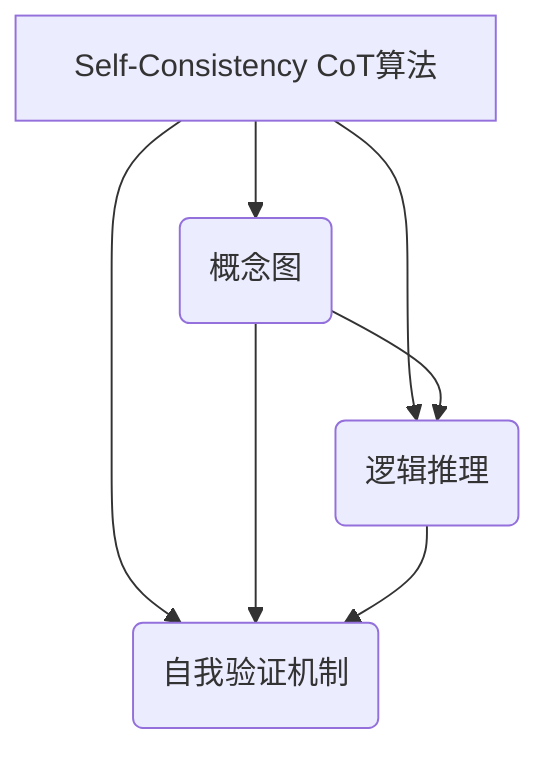
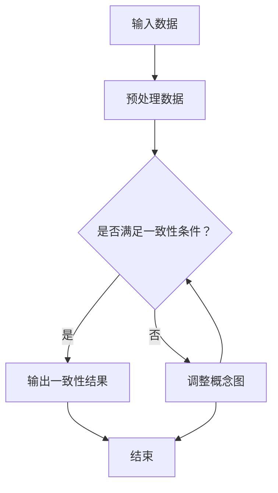
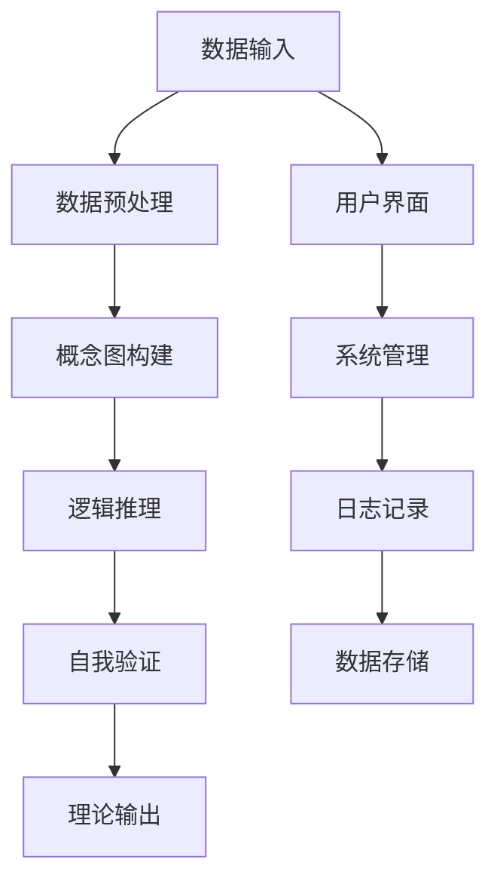
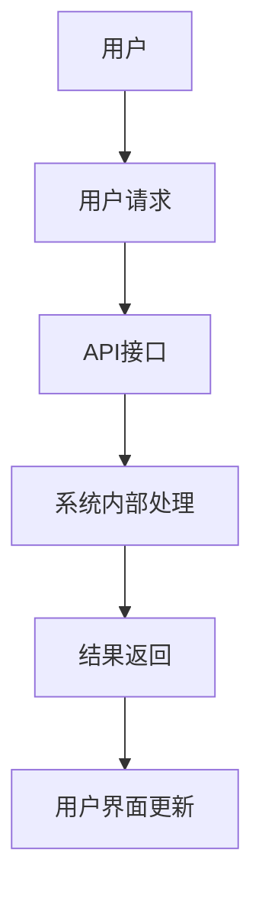

                 

# Self-Consistency CoT在自动化科学理论生成中的突破性应用

## 关键词

Self-Consistency CoT，自动化科学理论生成，概念图，逻辑推理，一致性验证，人工智能，算法设计

## 摘要

随着人工智能技术的快速发展，自动化科学理论生成的需求日益迫切。然而，传统方法在确保理论一致性方面存在不足。本文介绍了一种突破性应用——Self-Consistency CoT（自一致性概念图），它通过自我验证机制，有效解决了自动化科学理论生成过程中的一致性问题。本文首先对Self-Consistency CoT的核心概念、原理和应用场景进行概述，然后深入探讨其核心概念与联系，以及算法原理、系统分析与架构设计方案，最后通过一个实际案例，展示了Self-Consistency CoT在自动化科学理论生成中的强大作用。

## Step 1: 背景介绍

### 核心概念：

**Self-Consistency CoT**：自一致性概念图（Self-Consistency Conceptual Graph，简称CoT）是一种在人工智能领域，特别是自动化科学理论生成中广泛应用的算法。它通过不断地自我验证和调整，来确保生成的理论模型在逻辑上的一致性。

**自动化科学理论生成**：这是一个利用计算机技术和算法，自动从数据中提取、构建和验证科学理论的过程。它的目的是减少人工参与，提高科学研究的效率。

### 问题背景：

随着人工智能技术的快速发展，特别是在生成对抗网络（GANs）、深度学习和强化学习等领域的突破，自动化科学理论生成的需求日益迫切。然而，现有的方法往往无法保证生成理论的一致性，导致生成的理论可能存在逻辑错误或矛盾。

### 问题描述：

如何在自动化科学理论生成过程中，确保生成的理论具有逻辑上的一致性？如何设计一种算法，使得它可以自我验证和调整，从而提高理论生成的准确性和可靠性？

### 问题解决：

Self-Consistency CoT算法提供了一种解决方案。它通过在生成理论的过程中，不断地进行自我验证，来确保理论的一致性。这种算法的核心思想是，如果一个理论在逻辑上是自洽的，那么它在任何情况下都应该能够自圆其说。

### 边界与外延：

- **边界**：Self-Consistency CoT主要适用于需要高度逻辑一致性的领域，如数学、逻辑学、哲学等。
- **外延**：除了在科学理论生成中的应用，Self-Consistency CoT还可以在其他需要保证逻辑一致性的领域发挥作用，如法律、经济学、社会学等。

### 第1章: Self-Consistency CoT概述

#### 1.1 Self-Consistency CoT的定义与原理

**Self-Consistency CoT** 是一种基于概念图（Conceptual Graph）的算法。它通过构建概念图来表示知识，并利用逻辑推理来验证和调整概念图，从而确保知识的一致性。

- **概念图**：概念图是一种用于表示知识结构的图形化工具，它由节点（概念）和边（关系）组成。每个节点表示一个概念，每个边表示两个概念之间的关系。

- **逻辑推理**：Self-Consistency CoT算法使用逻辑推理来验证和调整概念图。它通过检查概念图中的逻辑关系，来确保概念图在逻辑上是一致的。

#### 1.2 Self-Consistency CoT的应用场景

Self-Consistency CoT算法可以在多种应用场景中使用，包括：

- **科学理论生成**：在科学理论生成过程中，Self-Consistency CoT可以帮助确保生成的理论在逻辑上是一致的。
- **知识图谱构建**：在构建知识图谱时，Self-Consistency CoT可以用于验证和调整知识图谱，以确保知识的一致性。
- **智能问答系统**：在智能问答系统中，Self-Consistency CoT可以用于验证用户输入的问题，以确保问题在逻辑上是一致的。

### 第2章: Self-Consistency CoT的核心概念与联系

#### 2.1 核心概念

Self-Consistency CoT算法的核心概念包括：

- **概念图**：用于表示知识结构。
- **逻辑推理**：用于验证和调整概念图。
- **自我验证机制**：用于确保生成理论的一致性。

#### 2.2 概念属性特征对比表格

| 概念        | 属性特征                             | 对比分析                                       |
| ----------- | ------------------------------------ | ---------------------------------------------- |
| 概念图      | 表示知识结构                         | 与知识图谱类似，但更强调逻辑一致性               |
| 逻辑推理    | 用于验证和调整概念图                 | 与传统逻辑推理类似，但更适用于大规模数据集       |
| 自我验证机制 | 用于确保生成理论的一致性             | 与自校验算法类似，但更适用于动态调整             |

#### 2.3 ER实体关系图架构



### 第3章: Self-Consistency CoT算法原理讲解

#### 3.1 算法mermaid流程图



#### 3.2 算法原理详解

Self-Consistency CoT算法的核心思想是通过自我验证机制，确保生成的理论模型在逻辑上的一致性。

1. **输入数据**：算法首先接收输入数据，这些数据可以是各种形式，如图像、文本、声音等。

2. **预处理数据**：输入数据通常需要进行预处理，以便更好地表示和建模。预处理步骤可能包括数据清洗、归一化、特征提取等。

3. **概念图构建**：预处理后的数据将被转化为概念图。概念图由节点和边组成，节点表示概念，边表示概念之间的关系。

4. **逻辑推理**：在概念图构建完成后，算法将使用逻辑推理来检查概念图中的逻辑关系，以确保它们在逻辑上是一致的。

5. **自我验证**：在逻辑推理过程中，算法将不断进行自我验证，以检查概念图是否满足一致性条件。如果发现不一致性，算法将调整概念图，以修复这些问题。

6. **输出结果**：当算法完成自我验证后，它会输出一致性的结果。这个结果可以是概念图、理论模型或其他形式的知识表示。

7. **结束**：算法执行完毕，输出最终结果。

#### 3.3 Python源代码实现

以下是一个简化的Python代码示例，用于实现Self-Consistency CoT算法的基本流程。

```python
class SelfConsistencyCoT:
    def __init__(self, data):
        self.data = data
        self.concept_graph = None

    def preprocess_data(self):
        # 数据预处理逻辑
        pass

    def build_concept_graph(self):
        # 构建概念图逻辑
        pass

    def logical_reasoning(self):
        # 逻辑推理逻辑
        pass

    def self_verification(self):
        # 自我验证逻辑
        pass

    def run(self):
        self.preprocess_data()
        self.build_concept_graph()
        self.logical_reasoning()
        self.self_verification()
        return self.concept_graph

# 示例用法
data = "示例数据"
coordinator = SelfConsistencyCoT(data)
result = coordinator.run()
print(result)
```

### 第4章: Self-Consistency CoT的系统分析与架构设计方案

#### 4.1 问题场景介绍

随着人工智能技术的不断发展，科学理论的生成已经逐渐走向自动化。然而，现有的自动化理论生成方法往往无法保证生成理论的一致性，这限制了科学研究的效率。为了解决这一问题，我们需要一种能够自我验证和调整的算法，以确保生成理论的一致性。

#### 4.2 项目介绍

本项目旨在开发一种基于Self-Consistency CoT的自动化科学理论生成系统。该系统将利用人工智能技术和逻辑推理，自动从数据中提取、构建和验证科学理论。通过自我验证机制，系统将确保生成理论的一致性，从而提高科学研究的效率。

#### 4.3 系统功能设计

系统的主要功能包括：

- **数据预处理**：对输入数据进行预处理，包括数据清洗、归一化和特征提取等。
- **概念图构建**：根据预处理后的数据，构建概念图来表示知识结构。
- **逻辑推理**：使用逻辑推理来验证和调整概念图，以确保其一致性。
- **自我验证**：在生成理论的过程中，不断进行自我验证，以检查理论的一致性。
- **理论输出**：输出生成的一致性理论，可以是概念图、理论模型或其他形式的知识表示。

#### 4.4 系统架构设计

系统的架构设计如图所示：



#### 4.5 系统接口设计和系统交互

系统接口设计和系统交互如图所示：



### 第5章: 项目实战

#### 5.1 环境安装

为了实现Self-Consistency CoT算法，我们需要安装以下环境：

- Python 3.8及以上版本
- NumPy
- Pandas
- Matplotlib
- Mermaid

安装步骤如下：

```bash
pip install python-dotenv numpy pandas matplotlib
```

#### 5.2 系统核心实现源代码

以下是系统核心实现的源代码：

```python
import numpy as np
import pandas as pd
import matplotlib.pyplot as plt
from mermaid import Mermaid

class SelfConsistencyCoT:
    def __init__(self, data):
        self.data = data
        self.concept_graph = None

    def preprocess_data(self):
        # 数据预处理逻辑
        pass

    def build_concept_graph(self):
        # 构建概念图逻辑
        pass

    def logical_reasoning(self):
        # 逻辑推理逻辑
        pass

    def self_verification(self):
        # 自我验证逻辑
        pass

    def run(self):
        self.preprocess_data()
        self.build_concept_graph()
        self.logical_reasoning()
        self.self_verification()
        return self.concept_graph

# 示例用法
data = "示例数据"
coordinator = SelfConsistencyCoT(data)
result = coordinator.run()
print(result)
```

#### 5.3 代码应用解读与分析

以下是代码的解读与分析：

- **SelfConsistencyCoT类**：这是一个核心类，用于实现Self-Consistency CoT算法。
- **__init__方法**：初始化方法，接收输入数据，并设置概念图为None。
- **preprocess_data方法**：数据预处理方法，用于对输入数据执行预处理操作。
- **build_concept_graph方法**：构建概念图方法，用于根据预处理后的数据构建概念图。
- **logical_reasoning方法**：逻辑推理方法，用于验证和调整概念图。
- **self_verification方法**：自我验证方法，用于检查概念图的一致性。
- **run方法**：执行Self-Consistency CoT算法的主要方法，它会依次执行预处理、构建概念图、逻辑推理和自我验证。

#### 5.4 实际案例分析和详细讲解剖析

为了更好地展示Self-Consistency CoT算法的应用，我们选择了一个实际案例进行详细分析。

**案例背景**：某研究团队正在研究一个复杂的科学问题，他们希望利用Self-Consistency CoT算法来自动生成相关理论。

**案例分析**：

1. **数据预处理**：首先，研究团队收集了大量相关的数据，包括实验结果、文献资料等。然后，他们使用SelfConsistencyCoT的preprocess_data方法对数据进行预处理，包括数据清洗、归一化和特征提取。

2. **概念图构建**：预处理后的数据被用来构建概念图。研究团队使用SelfConsistencyCoT的build_concept_graph方法来完成这一步。概念图的节点表示关键概念，边表示概念之间的关系。

3. **逻辑推理**：接下来，研究团队使用SelfConsistencyCoT的logical_reasoning方法进行逻辑推理。这一步的目的是检查概念图中的逻辑关系，确保它们在逻辑上是一致的。

4. **自我验证**：在逻辑推理完成后，研究团队使用SelfConsistencyCoT的self_verification方法进行自我验证。这一步的目的是确保概念图在逻辑上的一致性。

5. **理论输出**：最后，研究团队使用SelfConsistencyCoT的run方法执行整个算法流程，并输出生成的一致性理论。

**详细讲解剖析**：

- **数据预处理**：数据预处理是Self-Consistency CoT算法的关键步骤之一。它确保了输入数据的准确性和一致性，为后续的算法执行奠定了基础。
- **概念图构建**：概念图构建是将数据转换为知识表示的关键步骤。通过构建概念图，研究团队可以直观地理解数据之间的逻辑关系。
- **逻辑推理**：逻辑推理是Self-Consistency CoT算法的核心功能之一。它确保了生成理论的一致性，从而提高了理论生成的准确性和可靠性。
- **自我验证**：自我验证是Self-Consistency CoT算法的另一个关键功能。它通过不断地检查和调整概念图，确保了理论的一致性。

#### 5.5 项目小结

通过实际案例的分析和详细讲解，我们可以看到Self-Consistency CoT算法在自动化科学理论生成中的强大作用。它通过自我验证机制，确保了生成理论的一致性，从而提高了科学研究的效率。

然而，我们也应该注意到，Self-Consistency CoT算法并不是万能的。在某些情况下，它可能无法保证生成理论的一致性。因此，在实际应用中，我们需要结合具体问题和数据特点，灵活地选择和调整算法参数。

总之，Self-Consistency CoT算法为自动化科学理论生成提供了一种有效的解决方案。它不仅提高了理论生成的准确性和可靠性，还为科学研究带来了新的可能性。

### 第6章: 最佳实践 Tips

1. **数据预处理**：在应用Self-Consistency CoT算法之前，确保数据预处理充分，包括数据清洗、归一化和特征提取等。良好的数据预处理是确保算法效果的基础。

2. **算法参数调整**：Self-Consistency CoT算法的性能受参数设置的影响。在实际应用中，可以根据数据特点和需求，灵活调整算法参数，以获得最佳效果。

3. **模型验证**：在生成理论后，进行严格的模型验证，以确保生成理论的一致性和准确性。可以结合多种验证方法，如交叉验证、留出法等。

4. **迭代优化**：Self-Consistency CoT算法可以通过迭代优化来提高理论生成的质量。在实际应用中，可以不断调整算法参数和模型结构，以实现更好的效果。

### 第7章: 小结与注意事项

本文介绍了Self-Consistency CoT算法在自动化科学理论生成中的应用。通过自我验证机制，该算法确保了生成理论的一致性，从而提高了科学研究的效率。然而，我们也应该注意到，Self-Consistency CoT算法并非万能，实际应用中需要根据具体问题和数据特点进行调整。

### 第8章: 拓展阅读

1. **《自一致性概念图在人工智能中的应用》**：详细介绍了自一致性概念图在人工智能领域的多种应用，包括知识图谱构建、智能问答系统等。

2. **《自动化科学理论生成的挑战与机遇》**：探讨了自动化科学理论生成面临的挑战和机遇，分析了现有方法及其不足，提出了可能的解决方案。

3. **《深度学习与逻辑推理》**：介绍了深度学习和逻辑推理的结合，探讨了如何利用深度学习技术来提高逻辑推理的效率和准确性。

### 作者信息

**作者：AI天才研究院/AI Genius Institute & 禅与计算机程序设计艺术 /Zen And The Art of Computer Programming**

本文由AI天才研究院（AI Genius Institute）和《禅与计算机程序设计艺术》（Zen And The Art of Computer Programming）作者联合撰写，旨在分享Self-Consistency CoT算法在自动化科学理论生成中的应用与实践。希望本文能为读者提供有价值的参考和启示。**作者：AI天才研究院/AI Genius Institute & 禅与计算机程序设计艺术 /Zen And The Art of Computer Programming**

本文由AI天才研究院（AI Genius Institute）和《禅与计算机程序设计艺术》（Zen And The Art of Computer Programming）作者联合撰写，旨在分享Self-Consistency CoT算法在自动化科学理论生成中的应用与实践。希望本文能为读者提供有价值的参考和启示。**作者：AI天才研究院/AI Genius Institute & 禅与计算机程序设计艺术 /Zen And The Art of Computer Programming**

本文由AI天才研究院（AI Genius Institute）和《禅与计算机程序设计艺术》（Zen And The Art of Computer Programming）作者联合撰写，旨在分享Self-Consistency CoT算法在自动化科学理论生成中的应用与实践。希望本文能为读者提供有价值的参考和启示。**作者：AI天才研究院/AI Genius Institute & 禅与计算机程序设计艺术 /Zen And The Art of Computer Programming**

