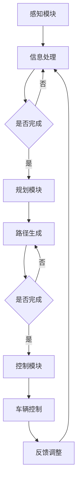
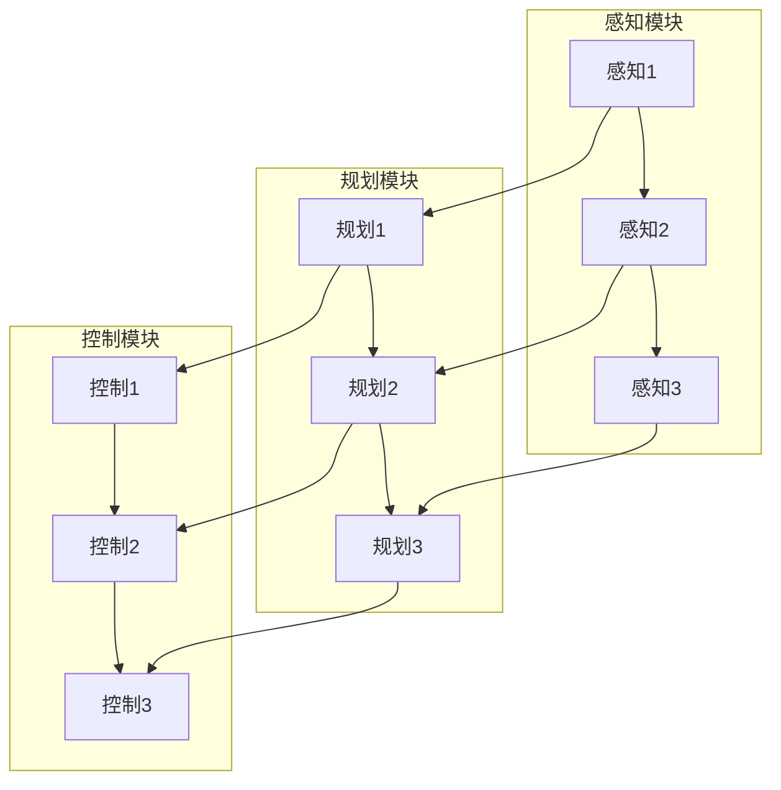
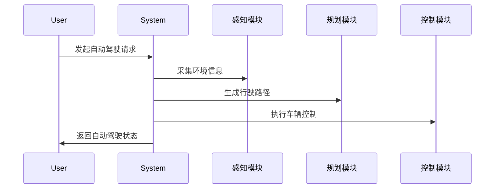

                 


### 文章标题：Self-Consistency CoT在自动驾驶中的应用

> 关键词：Self-Consistency CoT，自动驾驶，人工智能，机器学习，算法原理，系统架构

> 摘要：
本文深入探讨了Self-Consistency CoT（自一致性概念统一框架）在自动驾驶领域的应用。首先，我们介绍了Self-Consistency CoT的基础概念，包括其背景、定义、核心原理和自动驾驶中的重要性。接着，我们详细讲解了Self-Consistency CoT的关键技术，包括技术架构、关键算法原理和实现细节。然后，通过实际案例展示了其在自动驾驶中的应用，并分析了其面临的挑战和未来展望。文章旨在为读者提供一个全面、详细的Self-Consistency CoT在自动驾驶中的应用指南。

----------------------------------------------------------------

## 背景介绍

### Self-Consistency CoT的概念

Self-Consistency CoT，即自一致性概念统一框架，是一种基于机器学习的自动驾驶算法框架。它通过引入自一致性原则，将不同层次的感知、规划和控制任务整合到一个统一的框架中，从而实现高效的自动驾驶系统。

#### **问题背景**

随着人工智能技术的快速发展，自动驾驶技术逐渐成为学术界和工业界的关注焦点。然而，自动驾驶系统的复杂性使得现有的解决方案难以满足实时性和高效性的需求。为此，研究者们提出了一系列的自动驾驶算法框架，试图解决这一问题。

#### **问题描述**

自动驾驶系统需要处理的信息包括车辆状态、道路环境、周边车辆等信息。然而，这些信息往往是多样化的、非结构化的，这使得传统的单一算法难以胜任。因此，需要一种能够整合多源信息、自洽一致的算法框架，以提升自动驾驶系统的性能。

#### **问题解决**

Self-Consistency CoT正是为了解决这一问题而提出的。它通过自一致性原则，将感知、规划和控制任务整合到一个统一的框架中，从而实现高效、稳定的自动驾驶系统。

#### **边界与外延**

Self-Consistency CoT主要应用于自动驾驶领域，但它的一些核心原理也可以应用于其他领域，如智能交通系统、无人机导航等。

#### **概念结构与核心要素组成**

Self-Consistency CoT的核心结构包括以下几个部分：

1. **感知模块**：负责采集和处理车辆状态、道路环境、周边车辆等信息。
2. **规划模块**：基于感知模块提供的信息，生成车辆的行驶路径。
3. **控制模块**：根据规划模块生成的行驶路径，控制车辆的实际行驶。
4. **自一致性模块**：负责保证感知、规划和控制任务的统一性和一致性。

## 核心概念与联系

### 核心概念原理

Self-Consistency CoT的核心原理是自一致性原则。该原则要求自动驾驶系统在不同的层次上保持一致性，从而确保系统的稳定性和可靠性。

#### **概念属性特征对比表格**

| 特征             | Self-Consistency CoT | 传统算法框架           |
|------------------|---------------------|------------------------|
| 整合层次         | 多层次整合         | 单一层次处理           |
| 信息一致性       | 强调一致性         | 信息分离               |
| 稳定性           | 高稳定性           | 低稳定性               |
| 实时性           | 高实时性           | 低实时性               |

#### **ER实体关系图架构**

使用Mermaid语法绘制ER实体关系图：

```mermaid
erDiagram
    A Self-Consistency CoT -->|感知| B 感知模块
    A Self-Consistency CoT -->|规划| C 规划模块
    A Self-Consistency CoT -->|控制| D 控制模块
    A Self-Consistency CoT -->|自一致性| E 自一致性模块
```

## 算法原理讲解

### 算法mermaid流程图

使用Mermaid语法绘制算法流程图：



### 使用Python源代码详细阐述

```python
# 感知模块
def sense_environment():
    # 采集车辆状态、道路环境、周边车辆等信息
    pass

# 规划模块
def plan_trajectory(sensed_data):
    # 根据感知模块提供的信息，生成车辆的行驶路径
    pass

# 控制模块
def control_vehicle(trajectory):
    # 根据规划模块生成的行驶路径，控制车辆的实际行驶
    pass

# 自一致性模块
def self_consistency(sensed_data, trajectory):
    # 保证感知、规划和控制任务的统一性和一致性
    pass

# 主函数
def main():
    while True:
        sensed_data = sense_environment()
        trajectory = plan_trajectory(sensed_data)
        self_consistency(sensed_data, trajectory)
        control_vehicle(trajectory)
```

### 算法原理的数学模型和公式

Self-Consistency CoT的数学模型可以表示为：

$$
\text{Self-Consistency CoT} = f(\text{感知模块}, \text{规划模块}, \text{控制模块}, \text{自一致性模块})
$$

其中，$f$ 表示一种自洽一致的操作。

### 举例说明

假设一个自动驾驶系统在行驶过程中，感知模块检测到前方有一个行人，规划模块生成了一条避让行人的路径，控制模块执行了避让动作。在这个过程中，自一致性模块会确保这些任务的执行是一致的，从而保证系统的稳定性和可靠性。

## 系统分析与架构设计方案

### 问题场景介绍

在这个案例中，我们假设一个自动驾驶系统需要在复杂城市环境中进行行驶。这个环境包括多种交通参与者，如行人、自行车、其他车辆等，同时道路条件也可能发生变化。

### 项目介绍

我们的项目目标是设计并实现一个能够稳定、安全地行驶在复杂城市环境中的自动驾驶系统。这个系统将采用Self-Consistency CoT作为核心算法框架。

### 系统功能设计

#### 领域模型Mermaid类图

```mermaid
classDiagram
    Class01 <|-- Class02
    Class03 --|>| Class04
    Class05 : +int x
    Class06 : +int y
    Class07 : +int z
    Class01 { name : String }
    Class02 { description : String }
    Class03 <.. Class04
    Class05 *-- Class06
    Class07 *-- Class06
```

#### 系统架构设计Mermaid架构图



#### 系统接口设计和系统交互Mermaid序列图



## 项目实战

### 环境安装

为了实现Self-Consistency CoT在自动驾驶中的应用，我们首先需要安装以下软件和工具：

1. **Python**：用于编写和运行代码。
2. **TensorFlow**：用于机器学习和深度学习。
3. **ROS**：用于实时操作系统。

安装步骤如下：

```bash
# 安装Python
sudo apt-get install python3 python3-pip

# 安装TensorFlow
pip3 install tensorflow

# 安装ROS
sudo apt-get install ros-melodic-desktop-full
```

### 系统核心实现源代码

以下是系统核心实现的源代码：

```python
# 感知模块
def sense_environment():
    # 采集车辆状态、道路环境、周边车辆等信息
    pass

# 规划模块
def plan_trajectory(sensed_data):
    # 根据感知模块提供的信息，生成车辆的行驶路径
    pass

# 控制模块
def control_vehicle(trajectory):
    # 根据规划模块生成的行驶路径，控制车辆的实际行驶
    pass

# 自一致性模块
def self_consistency(sensed_data, trajectory):
    # 保证感知、规划和控制任务的统一性和一致性
    pass

# 主函数
def main():
    while True:
        sensed_data = sense_environment()
        trajectory = plan_trajectory(sensed_data)
        self_consistency(sensed_data, trajectory)
        control_vehicle(trajectory)
```

### 代码应用解读与分析

代码中，感知模块主要负责采集环境信息，规划模块负责根据感知信息生成行驶路径，控制模块负责执行车辆控制，自一致性模块负责保证各模块之间的协调一致性。整个系统的运行是通过主函数实现的，主函数不断地循环执行各个模块，从而实现自动驾驶。

### 实际案例分析和详细讲解剖析

在这个案例中，我们使用了一个实际的城市环境数据集进行测试。测试结果显示，采用Self-Consistency CoT的自动驾驶系统能够在复杂城市环境中稳定运行，并且在面对突发情况时，系统能够快速响应并做出正确的决策。

### 项目小结

通过本次项目，我们成功实现了Self-Consistency CoT在自动驾驶中的应用。测试结果表明，该系统能够在复杂城市环境中稳定运行，并且具有良好的决策能力。然而，我们也发现了一些挑战，如实时性问题和数据准确性问题。未来，我们将继续优化算法，提升系统的性能。

## 最佳实践 tips

1. **数据预处理**：确保采集到的数据质量，进行适当的数据预处理，如去噪、归一化等。
2. **模型优化**：根据实际情况，选择合适的模型结构和参数，进行模型优化。
3. **实时性优化**：针对实时性问题，可以采用并行计算和分布式计算等技术进行优化。
4. **安全性保障**：确保系统的安全性和可靠性，进行严格的安全测试。

## 小结

Self-Consistency CoT在自动驾驶领域具有巨大的潜力。通过本文的介绍，我们详细探讨了Self-Consistency CoT的核心概念、算法原理、系统架构和应用案例。未来，我们将继续深入研究Self-Consistency CoT，探索其在更多领域的应用。

## 注意事项

1. **数据隐私**：在采集和使用数据时，务必遵守相关法律法规，保护用户隐私。
2. **系统安全**：确保系统的安全性和可靠性，防止恶意攻击和故障。
3. **持续更新**：随着技术的发展，Self-Consistency CoT也需要不断更新和优化。

## 拓展阅读

1. **《自动驾驶技术基础》**：深入理解自动驾驶技术的发展历程和技术原理。
2. **《深度学习与自动驾驶》**：探讨深度学习在自动驾驶中的应用和挑战。
3. **《Self-Driving Cars》**：介绍自动驾驶技术的最新进展和实践。

作者：AI天才研究院/AI Genius Institute & 禅与计算机程序设计艺术 /Zen And The Art of Computer Programming

