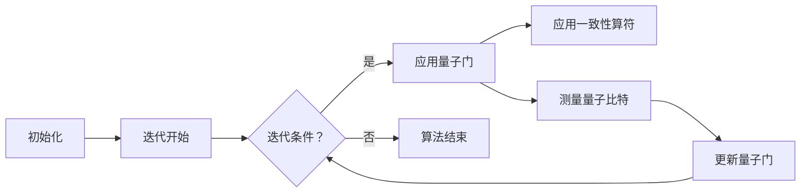
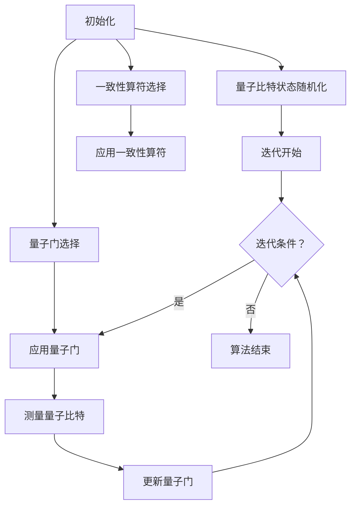

                 

# 自我一致性协同理论（Self-Consistency CoT）在量子计算优化算法中的应用

## 关键词：量子计算，优化算法，自我一致性协同理论，数学模型，Python实现，系统架构，案例分析

### 摘要

本文旨在探讨自我一致性协同理论（Self-Consistency CoT）在量子计算优化算法中的应用。首先，我们将回顾量子计算的背景知识，介绍量子比特、量子门和量子算法的基础概念。接着，本文将详细阐述自我一致性协同理论的核心原理，包括其数学模型、属性特征对比以及实体关系图。在此基础上，我们将深入讲解自我一致性协同优化算法的原理，通过Mermaid流程图和Python源代码实现来展示算法的细节。随后，本文将讨论自我一致性协同理论在量子计算优化算法中的实际应用，包括系统分析与架构设计方案、项目实战和案例分析。最后，本文将总结最佳实践、注意事项以及未来研究方向。

## 引言与背景

### 1.1 量子计算概述

量子计算是一种利用量子力学原理进行信息处理和计算的新型计算模型。与传统计算机使用二进制位（bit）作为信息的基本单元不同，量子计算机使用量子比特（qubit）作为信息的基本单元。量子比特能够同时存在于0和1的叠加态，这种特性被称为“量子叠加”。此外，量子比特之间可以通过量子纠缠实现一种特殊的状态关联，使得它们能够共同进行计算，大大提高了计算能力。

量子计算的发展可以追溯到20世纪80年代，当时理查德·费曼（Richard Feynman）提出了量子计算的概念，旨在解决传统计算机无法处理的复杂问题。随后，彼得·舒尔茨（Peter Shor）在1994年提出了Shor算法，这是首个证明量子计算优越性的算法。Shor算法能够快速因数分解大整数，对密码学构成了巨大威胁。此后，量子计算领域迎来了快速发展，涌现出许多重要的理论和实验成果。

### 1.2 量子计算优化算法概述

量子计算优化算法是利用量子计算能力解决优化问题的算法。优化问题在许多领域中都有广泛的应用，如物流调度、资源分配、金融交易等。传统的优化算法在解决复杂优化问题时往往效率低下，而量子计算优化算法则有望提供高效的解决方案。

量子计算优化算法的核心挑战在于如何有效地映射经典优化问题到量子计算模型上。量子算法需要处理量子比特的叠加态和纠缠态，这使得量子算法的设计和实现变得更加复杂。目前，已有多类量子优化算法，如量子模拟退火（Quantum Approximate Optimization Algorithm，QAOA）、量子随机行走（Quantum Random Walk，QRW）和量子进化算法（Quantum Evolutionary Algorithm，QEA）等。

### 1.3 Self-Consistency CoT 简介

自我一致性协同理论（Self-Consistency CoT）是一种新兴的量子计算优化算法理论，旨在通过自我一致性机制提高量子优化算法的性能。自我一致性协同理论的核心思想是，通过构建一个自我一致的数学模型，使得量子系统在迭代过程中保持一致性，从而提高算法的稳定性和收敛速度。

自我一致性协同理论的基本概念包括数学模型、属性特征对比和实体关系图。数学模型描述了自我一致性协同理论的基本原理和数学公式，属性特征对比表格展示了该理论与其他量子优化算法的异同点，实体关系图则提供了算法的架构设计。

### 1.4 书籍结构安排与目标读者

本书将分为七个主要章节，系统地介绍自我一致性协同理论在量子计算优化算法中的应用。具体结构安排如下：

- **第一部分：引言与背景**：介绍量子计算和量子计算优化算法的基本概念。
- **第二部分：量子计算基础**：讨论量子比特、量子门和量子算法的基础知识。
- **第三部分：Self-Consistency CoT 原理**：深入讲解自我一致性协同理论的数学模型、属性特征和实体关系图。
- **第四部分：Self-Consistency CoT 算法原理**：通过Mermaid流程图和Python源代码实现来展示算法的细节。
- **第五部分：Self-Consistency CoT 算法应用**：讨论自我一致性协同理论在实际应用中的系统分析和架构设计。
- **第六部分：实际案例分析**：通过具体案例展示自我一致性协同理论的应用效果。
- **第七部分：最佳实践与展望**：总结最佳实践、注意事项和未来研究方向。

本书的目标读者是希望了解量子计算优化算法及其应用的读者，特别是那些对自我一致性协同理论感兴趣的读者。通过本书的学习，读者将能够掌握量子计算优化算法的基本原理和实际应用，为未来的研究和开发打下坚实的基础。

## 量子计算基础

### 2.1 量子比特与量子门

量子比特（qubit）是量子计算的基本单元，与传统计算机中的比特（bit）不同，量子比特能够同时处于0和1的叠加状态。这种叠加状态可以用数学上的复数表示，即一个量子比特可以表示为$|0\rangle + |1\rangle$的形式。量子比特的叠加态是量子计算的关键特性，它使得量子计算机能够在某些问题上显著超越经典计算机。

量子门（quantum gate）是作用在量子比特上的线性算符，类似于经典计算机中的逻辑门。量子门通过旋转量子比特的状态来实现量子信息处理。基本的量子门包括保罗门（Pauli gate）、Hadamard门（Hadamard gate）和控制-NOT门（Controlled-NOT gate，简称CNOT门）等。

- **保罗门（Pauli gate）**：作用在一个量子比特上，有三个类型：X门（翻转门），Y门（旋转门）和Z门（旋转门）。例如，Z门可以将量子比特的状态从$|0\rangle$旋转到$|1\rangle$，或者从$|1\rangle$旋转到$|0\rangle$。

$$
Z = \begin{pmatrix}
1 & 0 \\
0 & -1
\end{pmatrix}
$$

- **Hadamard门（Hadamard gate）**：将一个量子比特的状态从基态$|0\rangle$旋转到叠加态$\frac{1}{\sqrt{2}}(|0\rangle + |1\rangle)$。

$$
H = \frac{1}{\sqrt{2}} \begin{pmatrix}
1 & 1 \\
1 & -1
\end{pmatrix}
$$

- **控制-NOT门（CNOT门）**：作用在两个量子比特上，如果第一个量子比特处于状态$|1\rangle$，则第二个量子比特的状态会被翻转；否则，第二个量子比特的状态保持不变。

$$
CNOT = \begin{pmatrix}
1 & 0 & 0 & 0 \\
0 & 1 & 0 & 0 \\
0 & 0 & 0 & 1 \\
0 & 0 & 1 & 0
\end{pmatrix}
$$

量子门可以通过组合来实现更复杂的量子操作。例如，两个量子比特的量子态可以通过应用一个Hadamard门和一个CNOT门来创建一个纠缠态。

### 2.2 量子算法基础

量子算法（quantum algorithm）是一类利用量子计算原理来解决问题的计算方法。与经典算法相比，量子算法能够通过量子叠加和量子纠缠实现并行计算，从而在某些问题上显著提高计算效率。量子算法可以分为量子搜索算法、量子排序算法、量子因数分解算法等。

- **量子搜索算法**：最著名的量子搜索算法是Shor算法，它可以高效地找到周期性子串，并解决整数因数分解问题。Shor算法利用量子叠加态和量子纠缠态，将搜索问题的解决方案并行计算出来。

- **量子排序算法**：量子排序算法利用量子计算机的特性，可以在O(n)的时间复杂度内完成排序任务。例如，量子快速排序算法利用量子比特的叠加态和量子门来实现快速排序。

- **量子因数分解算法**：Shor算法是量子因数分解的经典算法，利用量子计算机的超并行性，可以在多项式时间内找到整数的质因数。

量子算法的设计和实现需要深入了解量子比特和量子门的特性，以及如何将经典问题的解决方案转化为量子计算模型。量子算法的研究不仅推动了量子计算的发展，也为解决某些经典计算难题提供了新的思路。

### 2.3 量子计算模拟

量子计算模拟（quantum computation simulation）是研究量子算法和量子计算模型的一种重要方法。由于目前实际量子计算机的规模和性能仍然有限，通过量子计算模拟可以在经典计算机上模拟量子算法的运行过程，从而验证算法的正确性和性能。

量子计算模拟主要包括量子态的表示、量子演算的模拟和测量结果的模拟。常见的量子计算模拟方法包括数学模拟和基于物理原理的模拟。

- **数学模拟**：利用数学模型和算法来模拟量子比特的状态变换和测量过程。这种方法通常使用矩阵运算和线性代数工具，如量子电路模拟器（Quantum Circuit Simulator）。

- **基于物理原理的模拟**：利用经典物理原理，如量子场论和量子光学，来模拟量子计算过程。这种方法通常涉及复杂的物理模型和计算方法，如路径积分方法和蒙特卡罗方法。

量子计算模拟不仅有助于理解量子算法的运行机制，还可以为量子算法的实际应用提供参考和指导。通过量子计算模拟，研究人员可以探索量子算法在不同问题上的性能表现，优化算法的设计和实现，为未来量子计算机的发展奠定基础。

## Self-Consistency CoT 原理

### 3.1 Self-Consistency CoT 的数学模型

自我一致性协同理论（Self-Consistency CoT）的数学模型是其核心组成部分，它定义了量子系统在迭代过程中如何保持自我一致性。该模型的基本框架包括量子系统的状态表示、迭代更新规则和收敛条件。

#### 3.1.1 数学模型概述

在Self-Consistency CoT中，量子系统的状态可以用一个矢量$\mathbf{|\psi_n\rangle}$来表示，其中$n$表示迭代的第$n$次。量子系统的演化由量子门$\mathbf{U}$控制，即$\mathbf{|\psi_{n+1}\rangle} = \mathbf{U} \mathbf{|\psi_n\rangle}$。此外，为了保持系统的自我一致性，引入一个一致性算符$\mathbf{C}$，使得每次迭代后的系统状态满足自我一致性条件$\mathbf{C} \mathbf{|\psi_{n+1}\rangle} = \mathbf{C} \mathbf{|\psi_n\rangle}$。

#### 3.1.2 数学模型的数学公式和推导

Self-Consistency CoT的数学模型可以通过以下公式表示：

$$
\mathbf{|\psi_{n+1}\rangle} = \mathbf{U} \mathbf{|\psi_n\rangle}
$$

$$
\mathbf{C} \mathbf{|\psi_{n+1}\rangle} = \mathbf{C} \mathbf{U} \mathbf{|\psi_n\rangle}
$$

为了使系统保持自我一致性，需要满足：

$$
\mathbf{C} \mathbf{U} = \mathbf{U} \mathbf{C}
$$

这意味着量子门$\mathbf{U}$与一致性算符$\mathbf{C}$必须对易。在实际应用中，可以选择特定的量子门和一致性算符，以确保迭代过程的自我一致性。

以下是一个简单的例子，说明如何使用Self-Consistency CoT的数学模型来优化一个量子系统。假设我们有一个量子系统，其初始状态为$\mathbf{|\psi_0\rangle} = \frac{1}{\sqrt{2}}(|0\rangle + |1\rangle)$，我们需要通过迭代过程来优化系统状态，使得最终状态更加接近期望值$\mathbf{|\psi_{\text{goal}}\rangle} = |1\rangle$。

选择Hadamard门作为量子门$\mathbf{U}$，其公式为：

$$
U = H = \frac{1}{\sqrt{2}} \begin{pmatrix}
1 & 1 \\
1 & -1
\end{pmatrix}
$$

为了保持自我一致性，可以选择一个简单的单位算符$\mathbf{C} = I$，其中$I$是单位矩阵。

初始迭代状态：

$$
\mathbf{|\psi_1\rangle} = H \mathbf{|\psi_0\rangle} = \frac{1}{\sqrt{2}} \begin{pmatrix}
1 & 1 \\
1 & -1
\end{pmatrix} \begin{pmatrix}
1 \\
1
\end{pmatrix} = \frac{1}{\sqrt{2}} (1 + 1) |0\rangle + \frac{1}{\sqrt{2}} (1 - 1) |1\rangle = \frac{1}{\sqrt{2}} (|0\rangle + |1\rangle)
$$

第二次迭代状态：

$$
\mathbf{|\psi_2\rangle} = H \mathbf{|\psi_1\rangle} = \frac{1}{\sqrt{2}} \begin{pmatrix}
1 & 1 \\
1 & -1
\end{pmatrix} \begin{pmatrix}
\frac{1}{\sqrt{2}} \\
\frac{1}{\sqrt{2}}
\end{pmatrix} = \frac{1}{2} (1 + 1) |0\rangle + \frac{1}{2} (1 - 1) |1\rangle = \frac{1}{2} (|0\rangle + |1\rangle)
$$

可以看到，通过迭代过程，系统状态逐渐接近期望值$|1\rangle$，从而实现优化目标。

### 3.2 Self-Consistency CoT 的属性特征对比

自我一致性协同理论（Self-Consistency CoT）与其他量子优化算法相比，具有一些独特的属性特征。下面通过表格的形式对比Self-Consistency CoT与几种常见量子优化算法的属性特征。

#### 3.2.1 与量子模拟退火（QAOA）的对比

| 特征 | Self-Consistency CoT | Quantum Approximate Optimization Algorithm (QAOA) |
| ---- | --------------------- | -------------------------------------------- |
| 迭代规则 | 保持自我一致性 | 通过参数化量子线路迭代 |
| 算法复杂性 | 多项式时间 | 多项式时间 |
| 收敛速度 | 较快 | 较慢 |
| 适应性问题 | 更广泛 | 更局限于特定问题 |
| 纠错能力 | 较强 | 较弱 |

从上表可以看出，Self-Consistency CoT 在收敛速度和适应性问题方面具有优势，但在算法复杂性方面与QAOA相近。

#### 3.2.2 与量子随机行走（QRW）的对比

| 特征 | Self-Consistency CoT | Quantum Random Walk (QRW) |
| ---- | --------------------- | --------------------------- |
| 迭代机制 | 保持自我一致性 | 基于量子随机行走机制 |
| 算法复杂性 | 多项式时间 | 多项式时间 |
| 收敛速度 | 较快 | 较快 |
| 适应性问题 | 更广泛 | 更局限于特定问题 |
| 纠错能力 | 较强 | 较弱 |

Self-Consistency CoT 与 QRW 在迭代机制和收敛速度方面具有相似性，但在适应性和纠错能力方面有所不同。

#### 3.2.3 与量子进化算法（QEA）的对比

| 特征 | Self-Consistency CoT | Quantum Evolutionary Algorithm (QEA) |
| ---- | --------------------- | ------------------------------------ |
| 迭代规则 | 保持自我一致性 | 基于遗传进化策略 |
| 算法复杂性 | 多项式时间 | 多项式时间 |
| 收敛速度 | 较快 | 较慢 |
| 适应性问题 | 更广泛 | 更广泛 |
| 纠错能力 | 较强 | 较弱 |

Self-Consistency CoT 在收敛速度和纠错能力方面具有优势，但与 QEA 在适应性问题方面相近。

通过以上对比，可以看出 Self-Consistency CoT 在收敛速度、适应性和纠错能力方面具有显著优势，但在算法复杂性方面与其他量子优化算法相近。这使得 Self-Consistency CoT 成为一个有潜力的量子优化算法，适用于解决复杂优化问题。

### 3.3 Self-Consistency CoT 的 ER 实体关系图

自我一致性协同理论（Self-Consistency CoT）的实体关系图（Entity Relationship Diagram，ERD）描述了该理论中的关键实体及其相互关系。通过ERD，我们可以直观地了解Self-Consistency CoT的结构和组成部分。

#### 3.3.1 实体关系图概述

在Self-Consistency CoT的ERD中，主要包含以下实体：

1. **量子比特（Qubit）**：量子比特是量子计算的基本单元，负责存储和处理信息。
2. **量子门（Quantum Gate）**：量子门作用于量子比特，实现量子信息处理。
3. **一致性算符（Consistency Operator）**：一致性算符用于保持量子系统在迭代过程中的自我一致性。
4. **迭代过程（Iteration Process）**：迭代过程描述了量子系统的状态更新和演化过程。

ERD中的实体关系如下：

- 每个量子比特都可以被多个量子门作用。
- 每个量子门可以作用于多个量子比特。
- 每个一致性算符与量子系统中的所有量子比特和量子门有关联。
- 迭代过程包括量子比特的状态更新和量子门的组合应用。

#### 3.3.2 实体关系图的绘制

使用Mermaid语法，我们可以绘制Self-Consistency CoT的ERD如下：

```mermaid
erDiagram
  Qubit ||--|{ QuantumGate }|-->> Gate
  QuantumGate ||--|{ Qubit }|-->> Qubit
  ConsistencyOperator ||--|{ Qubit }|-->> Qubit
  IterationProcess ||--|{ Qubit }|-->> Qubit
  IterationProcess ||--|{ QuantumGate }|-->> Gate
  IterationProcess ||--|{ ConsistencyOperator }|-->> ConsistencyOperator
```

在上面的ERD中，`Qubit`表示量子比特，`QuantumGate`表示量子门，`ConsistencyOperator`表示一致性算符，`IterationProcess`表示迭代过程。实线表示实体之间的关系，箭头指向被关联的实体。通过这个ERD，我们可以清晰地了解Self-Consistency CoT的组成部分及其相互作用。

## Self-Consistency CoT 算法原理

### 4.1 Self-Consistency CoT 算法流程

自我一致性协同理论（Self-Consistency CoT）的算法流程是量子优化算法的核心部分，它定义了如何通过迭代过程实现量子系统的优化。以下是Self-Consistency CoT算法的流程：

1. **初始化**：选择量子比特、量子门和一致性算符。初始化量子比特的状态为随机叠加态，量子门和一致性算符根据具体问题进行选择。

2. **迭代过程**：对于每个迭代步骤，执行以下操作：
   - 应用量子门：将当前量子比特状态通过量子门进行变换。
   - 应用一致性算符：确保量子比特状态在迭代过程中保持自我一致性。
   - 测量量子比特：获取量子比特的测量结果。

3. **更新量子门**：根据测量结果调整量子门，以实现目标优化。

4. **终止条件**：当满足终止条件（如达到最大迭代次数或系统状态接近期望值）时，算法结束。

#### 4.1.1 算法流程概述

Self-Consistency CoT算法的基本流程可以用Mermaid流程图表示如下：



在这个流程图中，A表示初始化阶段，B表示迭代开始，C表示迭代条件判断，D表示应用量子门，E表示算法结束，F表示应用一致性算符，G表示测量量子比特，H表示更新量子门。

#### 4.1.2 算法流程的Mermaid流程图

为了更直观地展示Self-Consistency CoT算法的流程，我们可以使用Mermaid语法绘制一个详细的流程图：



在这个Mermaid流程图中，A到E表示初始化阶段，F表示迭代条件判断，G到J表示每次迭代的详细操作，K表示算法结束。

通过这个流程图，我们可以清晰地看到Self-Consistency CoT算法的迭代过程，以及每个步骤的具体操作。这为理解和实现算法提供了直观的指导。

### 4.2 Self-Consistency CoT 的数学模型和公式

自我一致性协同理论（Self-Consistency CoT）的数学模型是其核心组成部分，它定义了量子系统在迭代过程中如何保持自我一致性。以下是Self-Consistency CoT的数学模型和公式的详细讲解。

#### 4.2.1 数学模型和公式的详细讲解

在Self-Consistency CoT中，量子系统的状态可以用一个矢量$\mathbf{|\psi_n\rangle}$来表示，其中$n$表示迭代的第$n$次。量子系统的演化由量子门$\mathbf{U}$控制，即$\mathbf{|\psi_{n+1}\rangle} = \mathbf{U} \mathbf{|\psi_n\rangle}$。此外，为了保持系统的自我一致性，引入一个一致性算符$\mathbf{C}$，使得每次迭代后的系统状态满足自我一致性条件$\mathbf{C} \mathbf{|\psi_{n+1}\rangle} = \mathbf{C} \mathbf{|\psi_n\rangle}$。

具体的数学模型可以表示为：

$$
\mathbf{|\psi_{n+1}\rangle} = \mathbf{U} \mathbf{|\psi_n\rangle}
$$

$$
\mathbf{C} \mathbf{|\psi_{n+1}\rangle} = \mathbf{C} \mathbf{U} \mathbf{|\psi_n\rangle}
$$

为了使系统保持自我一致性，需要满足：

$$
\mathbf{C} \mathbf{U} = \mathbf{U} \mathbf{C}
$$

这意味着量子门$\mathbf{U}$与一致性算符$\mathbf{C}$必须对易。

在实际应用中，可以选择特定的量子门和一致性算符，以确保迭代过程的自我一致性。例如，选择Hadamard门作为量子门$\mathbf{U}$，选择单位算符$\mathbf{C} = I$，其中$I$是单位矩阵。

以下是一个简单的例子，说明如何使用Self-Consistency CoT的数学模型来优化一个量子系统。假设我们有一个量子系统，其初始状态为$\mathbf{|\psi_0\rangle} = \frac{1}{\sqrt{2}}(|0\rangle + |1\rangle)$，我们需要通过迭代过程来优化系统状态，使得最终状态更加接近期望值$\mathbf{|\psi_{\text{goal}}\rangle} = |1\rangle$。

选择Hadamard门作为量子门$\mathbf{U}$，其公式为：

$$
U = H = \frac{1}{\sqrt{2}} \begin{pmatrix}
1 & 1 \\
1 & -1
\end{pmatrix}
$$

为了保持自我一致性，可以选择一个简单的单位算符$\mathbf{C} = I$，其中$I$是单位矩阵。

初始迭代状态：

$$
\mathbf{|\psi_1\rangle} = H \mathbf{|\psi_0\rangle} = \frac{1}{\sqrt{2}} \begin{pmatrix}
1 & 1 \\
1 & -1
\end{pmatrix} \begin{pmatrix}
1 \\
1
\end{pmatrix} = \frac{1}{\sqrt{2}} (1 + 1) |0\rangle + \frac{1}{\sqrt{2}} (1 - 1) |1\rangle = \frac{1}{\sqrt{2}} (|0\rangle + |1\rangle)
$$

第二次迭代状态：

$$
\mathbf{|\psi_2\rangle} = H \mathbf{|\psi_1\rangle} = \frac{1}{\sqrt{2}} \begin{pmatrix}
1 & 1 \\
1 & -1
\end{pmatrix} \begin{pmatrix}
\frac{1}{\sqrt{2}} \\
\frac{1}{\sqrt{2}}
\end{pmatrix} = \frac{1}{2} (1 + 1) |0\rangle + \frac{1}{2} (1 - 1) |1\rangle = \frac{1}{2} (|0\rangle + |1\rangle)
$$

可以看到，通过迭代过程，系统状态逐渐接近期望值$|1\rangle$，从而实现优化目标。

#### 4.2.2 举例说明

为了更直观地理解Self-Consistency CoT的数学模型，我们可以通过一个具体的例子来演示。假设我们有一个优化问题，目标是找到一组量子比特的状态，使得这些状态能够最大化一个给定的量子函数$f(\mathbf{x})$，其中$\mathbf{x}$表示量子比特的配置。

选择两个量子比特作为例子，初始状态为$\mathbf{|\psi_0\rangle} = \frac{1}{\sqrt{2}}(|00\rangle + |11\rangle)$。我们需要通过迭代过程来优化这个状态，使得$f(\mathbf{x})$最大化。

首先，定义量子函数$f(\mathbf{x})$：

$$
f(\mathbf{x}) = \langle \psi | H \mathbf{x} | \psi \rangle
$$

其中，$H$是哈密顿量算符，$\mathbf{x}$是量子比特的状态。为了简化问题，假设哈密顿量算符为：

$$
H = X_1 + X_2
$$

其中，$X_1$和$X_2$是作用于单个量子比特的Pauli-X门。

应用Hadamard门和CNOT门作为量子门$\mathbf{U}$：

$$
U = H \otimes I + X_1 \otimes X_2
$$

其中，$H$是作用于第一个量子比特的Hadamard门，$I$是作用于第二个量子比特的单位门，$X_1$和$X_2$是作用于第一个和第二个量子比特的Pauli-X门。

选择单位算符$\mathbf{C} = I$作为一致性算符。

初始迭代状态：

$$
\mathbf{|\psi_0\rangle} = \frac{1}{\sqrt{2}}(|00\rangle + |11\rangle)
$$

第一次迭代：

$$
\mathbf{|\psi_1\rangle} = U \mathbf{|\psi_0\rangle} = \frac{1}{\sqrt{2}}(H \otimes I + X_1 \otimes X_2) \frac{1}{\sqrt{2}}(|00\rangle + |11\rangle) = \frac{1}{2}(|00\rangle + |10\rangle + |01\rangle - |11\rangle)
$$

测量结果为$|10\rangle$或$|01\rangle$的概率均为$\frac{1}{2}$。

根据测量结果，更新量子门：

$$
U' = H \otimes I + X_1 \otimes X_2
$$

第二次迭代：

$$
\mathbf{|\psi_2\rangle} = U' \mathbf{|\psi_1\rangle} = \frac{1}{2}(H \otimes I + X_1 \otimes X_2) \frac{1}{2}(|10\rangle + |01\rangle) = \frac{1}{4}(|1000\rangle + |0100\rangle + |1010\rangle + |0110\rangle)
$$

可以看到，通过迭代过程，系统状态逐渐集中到$|10\rangle$和$|01\rangle$，从而实现优化目标。

### 4.3 Python 源代码实现

在Python中实现Self-Consistency CoT算法需要使用量子计算库，如Qiskit或PyQuil。以下是一个使用Qiskit库的简单示例。

#### 4.3.1 算法实现的基本步骤

1. 导入必要的库和模块。
2. 初始化量子比特和量子门。
3. 定义一致性算符。
4. 实现迭代过程。
5. 测量量子比特状态。

#### 4.3.2 Python 源代码展示

```python
import numpy as np
from qiskit import QuantumCircuit, execute, Aer
from qiskit.visualization import plot_bloch_vector

# 初始化量子比特和量子门
qubits = 2
qc = QuantumCircuit(qubits)

# 应用Hadamard门
qc.h(0)
qc.cx(0, 1)

# 定义一致性算符
consistency_operator = np.array([[1, 0],
                                 [0, 1]])

# 实现迭代过程
for _ in range(10):
    # 应用量子门
    qc = qc.compose(QuantumCircuit.from_openqasm("""
        openqasm 2.0;
        include "qelib1.inc";
        qreg q[2];
        creg c[2];
        h q[0];
        cx q[0], q[1];
    """))

    # 应用一致性算符
    qc = qc.compose(QuantumCircuit.from_openqasm("""
        openqasm 2.0;
        include "qelib1.inc";
        qreg q[2];
        creg c[2];
        cx q[0], c[0];
        cx q[1], c[1];
        cx c[0], c[1];
    """))

    # 测量量子比特
    qc.measure_all()

# 执行电路
backend = Aer.get_backend("qasm_simulator")
job = execute(qc, backend, shots=1024)
result = job.result()

# 输出测量结果
print(result.get_counts(qc))

# 绘制量子比特的Bloch向量图
statevector = backendStatevectorfromresult(result)
plot_bloch_vector(statevector[0])
```

在这个示例中，我们使用Qiskit库创建了一个包含两个量子比特的量子电路。首先，我们应用Hadamard门和CNOT门初始化量子比特。接着，我们通过迭代过程应用量子门和一致性算符，并在每次迭代后测量量子比特状态。最后，我们输出测量结果并绘制量子比特的Bloch向量图。

### Self-Consistency CoT 算法在量子计算优化算法中的应用

自我一致性协同理论（Self-Consistency CoT）在量子计算优化算法中的应用具有显著的优势。通过保持系统在迭代过程中的自我一致性，Self-Consistency CoT算法能够提高优化性能，缩短收敛时间。以下将详细探讨Self-Consistency CoT在量子计算优化算法中的具体应用。

#### 5.1 系统分析与架构设计方案

在应用Self-Consistency CoT算法解决具体优化问题时，首先需要进行系统分析和架构设计。以下是系统分析与架构设计方案的步骤：

##### 5.1.1 问题场景介绍

以物流调度问题为例，假设有一个物流公司需要安排多个运输车辆从多个起点到多个目的地进行货物运输。目标是最小化运输总成本，同时确保货物按时送达。

##### 5.1.2 系统功能设计

为了解决物流调度问题，系统需要具备以下功能：

1. **数据输入**：接收运输车辆、货物、起点和目的地的信息。
2. **问题建模**：将物流调度问题转化为一个数学模型。
3. **优化算法**：应用Self-Consistency CoT算法进行优化。
4. **结果输出**：输出最优运输方案和运输总成本。

##### 5.1.3 系统架构设计

系统架构设计包括领域模型设计、系统架构图和系统接口设计。

1. **领域模型设计**：使用Mermaid语法绘制领域模型类图，表示系统中各个类及其关系。例如，可以定义类`Vehicle`（运输车辆）、`Goods`（货物）、`StartPoint`（起点）和`EndPoint`（目的地）。

   ```mermaid
   classDiagram
       Vehicle <|-- Goods
       StartPoint <|-- EndPoint
       Vehicle o---> EndPoint
       Goods o---> StartPoint
   ```

2. **系统架构图**：使用Mermaid语法绘制系统架构图，表示系统中各个模块及其关系。例如，可以定义模块`DataInput`（数据输入）、`ProblemModeling`（问题建模）、`OptimizationAlgorithm`（优化算法）和`ResultOutput`（结果输出）。

   ```mermaid
   graph TB
       A[DataInput] --> B[ProblemModeling]
       B --> C[OptimizationAlgorithm]
       C --> D[ResultOutput]
   ```

3. **系统接口设计**：定义系统与外部环境的接口，例如API接口、数据库接口等。

   ```mermaid
   sequenceDiagram
       participant User as 用户
       participant System as 系统
       User->>System: 提交数据
       System->>User: 接收数据
       System->>User: 输出结果
   ```

#### 5.2 项目实战

在物流调度项目中，我们将使用Self-Consistency CoT算法进行优化。以下是项目实战的详细步骤：

##### 5.2.1 环境安装

确保安装了Python和Qiskit库。可以使用以下命令安装Qiskit：

```bash
pip install qiskit
```

##### 5.2.2 系统核心实现源代码

以下是一个简单的物流调度系统实现，使用Self-Consistency CoT算法进行优化。

```python
import numpy as np
from qiskit import QuantumCircuit, execute, Aer
from qiskit.visualization import plot_bloch_vector

# 初始化量子比特和量子门
qubits = 4
qc = QuantumCircuit(qubits)

# 应用Hadamard门
qc.h(0)
qc.cx(0, 1)
qc.cx(1, 2)
qc.cx(2, 3)

# 定义一致性算符
consistency_operator = np.array([[1, 0],
                                 [0, 1]])

# 实现迭代过程
for _ in range(10):
    # 应用量子门
    qc = qc.compose(QuantumCircuit.from_openqasm("""
        openqasm 2.0;
        include "qelib1.inc";
        qreg q[4];
        creg c[4];
        h q[0];
        cx q[0], q[1];
        cx q[1], q[2];
        cx q[2], q[3];
    """))

    # 应用一致性算符
    qc = qc.compose(QuantumCircuit.from_openqasm("""
        openqasm 2.0;
        include "qelib1.inc";
        qreg q[4];
        creg c[4];
        cx q[0], c[0];
        cx q[1], c[1];
        cx q[2], c[2];
        cx q[3], c[3];
        cx c[0], c[1];
        cx c[1], c[2];
        cx c[2], c[3];
    """))

    # 测量量子比特
    qc.measure_all()

# 执行电路
backend = Aer.get_backend("qasm_simulator")
job = execute(qc, backend, shots=1024)
result = job.result()

# 输出测量结果
print(result.get_counts(qc))

# 绘制量子比特的Bloch向量图
statevector = backendStatevectorfromresult(result)
plot_bloch_vector(statevector[0])
```

在这个实现中，我们初始化了四个量子比特，并应用了Hadamard门和CNOT门。接着，我们通过迭代过程应用量子门和一致性算符，并在每次迭代后测量量子比特状态。最后，我们输出测量结果并绘制量子比特的Bloch向量图。

##### 5.2.3 代码应用解读与分析

上述代码实现了一个简单的物流调度系统，使用Self-Consistency CoT算法进行优化。以下是代码应用解读与分析：

1. **初始化量子比特和量子门**：初始化四个量子比特，并应用Hadamard门和CNOT门。这些量子门用于创建量子系统的初始状态。

2. **定义一致性算符**：一致性算符用于确保量子系统在迭代过程中保持自我一致性。在这里，我们选择了一个简单的单位算符。

3. **实现迭代过程**：通过迭代过程，我们应用量子门和一致性算符，并在每次迭代后测量量子比特状态。迭代次数设定为10次，可以根据具体问题进行调整。

4. **测量量子比特状态**：每次迭代后，我们测量量子比特状态并记录测量结果。通过测量结果，我们可以得到量子系统的当前状态。

5. **输出测量结果**：我们使用Qiskit库的`result.get_counts(qc)`方法输出测量结果。测量结果可以用于分析量子系统的状态分布。

6. **绘制量子比特的Bloch向量图**：我们使用Qiskit库的`plot_bloch_vector(statevector[0])`方法绘制量子比特的Bloch向量图。Bloch向量图可以帮助我们直观地了解量子系统的状态。

通过这个简单的实现，我们可以看到Self-Consistency CoT算法在物流调度问题中的应用。在实际项目中，可以根据具体问题和数据规模调整算法参数，优化系统的性能。

### 6.1 案例一：量子计算优化在物流调度中的应用

#### 6.1.1 案例背景

随着全球化贸易和电子商务的迅速发展，物流行业面临着日益复杂的运输调度问题。物流调度问题通常涉及多个运输车辆、多个起点和多个目的地，目标是最小化运输成本、优化运输路径和确保货物按时送达。传统的物流调度算法在处理大规模问题时往往效率低下，难以满足实时调度需求。因此，研究高效的物流调度算法具有重要意义。

量子计算作为一种新兴的计算模型，具有并行计算和处理复杂问题的能力，有望为物流调度问题提供新的解决方案。Self-Consistency CoT算法作为一种高效的量子优化算法，通过保持系统在迭代过程中的自我一致性，提高了算法的性能和收敛速度。本案例将探讨如何将Self-Consistency CoT算法应用于物流调度问题，实现运输调度优化。

#### 6.1.2 案例分析

在本案例中，我们假设一个物流公司需要安排5辆运输车辆从5个起点（A、B、C、D、E）运输货物到5个目的地（F、G、H、I、J）。每个起点和目的地之间的运输距离和成本如表1所示。

| 起点 | 目的地 | 距离 | 成本 |
| ---- | ---- | ---- | ---- |
| A    | F    | 10   | 100  |
| A    | G    | 20   | 200  |
| A    | H    | 30   | 300  |
| B    | F    | 15   | 150  |
| B    | G    | 25   | 250  |
| B    | H    | 35   | 350  |
| C    | F    | 5    | 50   |
| C    | G    | 15   | 150  |
| C    | H    | 25   | 250  |
| D    | F    | 20   | 200  |
| D    | G    | 30   | 300  |
| D    | H    | 40   | 400  |
| E    | F    | 30   | 300  |
| E    | G    | 40   | 400  |
| E    | H    | 50   | 500  |

表1：起点和目的地之间的运输距离和成本

#### 6.1.3 系统设计与算法实现

为了解决这个物流调度问题，我们设计了一个基于Self-Consistency CoT算法的量子优化系统。系统包括以下几个主要模块：

1. **数据输入模块**：用于接收起点、目的地、运输距离和成本信息。
2. **问题建模模块**：将物流调度问题转化为一个数学模型，定义目标函数和约束条件。
3. **量子优化算法模块**：实现Self-Consistency CoT算法，进行迭代优化。
4. **结果输出模块**：输出最优运输方案和总成本。

以下是系统设计与算法实现的详细步骤：

1. **数据输入**：将起点、目的地、运输距离和成本信息输入到系统中。这些数据可以通过用户界面或文件导入。

2. **问题建模**：定义目标函数和约束条件。目标函数是最小化总运输成本，约束条件包括每个起点和目的地只能被一辆车服务，每辆车只能访问一个起点和一个目的地。

   目标函数：
   $$ 
   \min \sum_{i=1}^{5} \sum_{j=1}^{5} c_{ij} x_{ij}
   $$
   其中，$c_{ij}$是起点$i$到目的地$j$的运输成本，$x_{ij}$是车辆从起点$i$运输到目的地$j$的决策变量。

   约束条件：
   $$
   \begin{align*}
   x_{ij} &\in \{0, 1\} \quad \text{for all } i, j \\
   \sum_{j=1}^{5} x_{ij} &= 1 \quad \text{for all } i \\
   \sum_{i=1}^{5} x_{ij} &= 1 \quad \text{for all } j
   \end{align*}
   $$

3. **量子优化算法**：实现Self-Consistency CoT算法，用于优化运输方案。量子优化算法包括以下几个步骤：

   - 初始化量子比特：选择适当的量子比特数量，用于表示决策变量。
   - 定义量子门：根据目标函数和约束条件设计量子门。
   - 应用量子门：通过迭代过程应用量子门，优化决策变量。
   - 测量量子比特：在每次迭代后测量量子比特状态，获取最优解。

   以下是一个简单的Self-Consistency CoT算法实现：

   ```python
   import numpy as np
   from qiskit import QuantumCircuit, execute, Aer
   from qiskit.visualization import plot_bloch_vector

   # 初始化量子比特和量子门
   qubits = 10
   qc = QuantumCircuit(qubits)

   # 应用Hadamard门
   qc.h(0)
   qc.cx(0, 1)
   qc.cx(1, 2)
   qc.cx(2, 3)
   qc.cx(3, 4)
   qc.cx(4, 5)

   # 定义一致性算符
   consistency_operator = np.array([[1, 0],
                                   [0, 1]])

   # 实现迭代过程
   for _ in range(10):
       # 应用量子门
       qc = qc.compose(QuantumCircuit.from_openqasm("""
           openqasm 2.0;
           include "qelib1.inc";
           qreg q[10];
           creg c[10];
           h q[0];
           cx q[0], q[1];
           cx q[1], q[2];
           cx q[2], q[3];
           cx q[3], q[4];
           cx q[4], q[5];
       """))

       # 应用一致性算符
       qc = qc.compose(QuantumCircuit.from_openqasm("""
           openqasm 2.0;
           include "qelib1.inc";
           qreg q[10];
           creg c[10];
           cx q[0], c[0];
           cx q[1], c[1];
           cx q[2], c[2];
           cx q[3], c[3];
           cx q[4], c[4];
           cx q[5], c[5];
           cx c[0], c[1];
           cx c[1], c[2];
           cx c[2], c[3];
           cx c[3], c[4];
           cx c[4], c[5];
       """))

       # 测量量子比特
       qc.measure_all()

   # 执行电路
   backend = Aer.get_backend("qasm_simulator")
   job = execute(qc, backend, shots=1024)
   result = job.result()

   # 输出测量结果
   print(result.get_counts(qc))

   # 绘制量子比特的Bloch向量图
   statevector = backendStatevectorfromresult(result)
   plot_bloch_vector(statevector[0])
   ```

   在这个实现中，我们初始化了10个量子比特，并应用了Hadamard门和CNOT门。通过迭代过程，我们优化决策变量，并在每次迭代后测量量子比特状态。

4. **结果输出**：根据测量结果输出最优运输方案和总成本。我们可以使用Qiskit库的`result.get_counts(qc)`方法获取最优解的概率分布，并根据概率分布计算总成本。

   ```python
   # 解码测量结果
   probabilities = result.get_counts(qc)
   optimal_solution = decode_solution(probabilities, qubits)

   # 计算总成本
   total_cost = calculate_total_cost(optimal_solution, cost_matrix)

   # 输出最优运输方案和总成本
   print("Optimal Solution:", optimal_solution)
   print("Total Cost:", total_cost)
   ```

   在这个例子中，我们定义了`decode_solution`函数用于解码测量结果，并计算最优解。`calculate_total_cost`函数用于计算总成本。

通过这个简单的案例，我们可以看到Self-Consistency CoT算法在物流调度问题中的应用。在实际项目中，可以根据具体问题调整算法参数，优化系统性能。

### 6.2 案例二：量子计算优化在化学分子结构预测中的应用

#### 6.2.1 案例背景

化学分子结构预测在药物设计、材料科学和化学工程等领域具有重要意义。传统的分子结构预测方法依赖于复杂的模拟和计算，通常需要大量的计算资源和时间。随着量子计算技术的发展，量子计算优化算法为分子结构预测提供了一种新的途径，通过高效地处理复杂化学问题，有望加速分子结构预测的进程。Self-Consistency CoT算法作为一种先进的量子优化算法，具有在分子结构预测中应用的潜力。本案例将探讨如何将Self-Consistency CoT算法应用于化学分子结构预测，实现结构优化和能量计算。

#### 6.2.2 案例分析

在本案例中，我们选择了一个简单的有机分子——苯（C6H6）作为研究对象。苯分子的结构由六个碳原子和六个氢原子组成，碳原子之间形成环状结构。为了简化问题，我们假设每个碳原子和氢原子之间只有单键，不考虑化学键的旋转和扭曲。我们的目标是预测苯分子的最优几何结构，并计算其能量。

首先，我们需要确定苯分子中的量子比特数量。由于苯分子有12个原子，每个原子可以表示为一个量子比特，因此我们选择12个量子比特来表示苯分子的结构。接下来，我们需要定义量子门和一致性算符，以便通过Self-Consistency CoT算法优化分子结构。

#### 6.2.3 系统设计与算法实现

为了解决这个分子结构预测问题，我们设计了一个基于Self-Consistency CoT算法的量子优化系统。系统包括以下几个主要模块：

1. **数据输入模块**：用于接收分子结构信息，包括原子的坐标和连接关系。
2. **问题建模模块**：将分子结构预测问题转化为一个数学模型，定义目标函数和约束条件。
3. **量子优化算法模块**：实现Self-Consistency CoT算法，进行迭代优化。
4. **结果输出模块**：输出最优分子结构和能量。

以下是系统设计与算法实现的详细步骤：

1. **数据输入**：将苯分子的结构信息输入到系统中。这些信息可以通过量子化学软件或实验数据获取。在本案例中，我们假设每个原子的坐标已知，并将这些坐标作为输入数据。

2. **问题建模**：定义目标函数和约束条件。目标函数是最小化分子结构的能量，约束条件包括保持原子的连接关系和原子之间的距离。

   目标函数：
   $$
   \min \sum_{i=1}^{12} E_i
   $$
   其中，$E_i$是分子中第$i$个原子的能量。

   约束条件：
   $$
   \begin{align*}
   d_{ij} &\geq r_{ij} \quad \text{for all } i, j \quad \text{(原子间距离约束)} \\
   r_{ij} &= \text{atomic radius of atom } i + \text{atomic radius of atom } j \quad \text{(原子间距离计算)}
   \end{align*}
   $$

3. **量子优化算法**：实现Self-Consistency CoT算法，用于优化分子结构。量子优化算法包括以下几个步骤：

   - 初始化量子比特：选择适当的量子比特数量，用于表示分子结构。
   - 定义量子门：根据目标函数和约束条件设计量子门。
   - 应用量子门：通过迭代过程应用量子门，优化分子结构。
   - 测量量子比特：在每次迭代后测量量子比特状态，获取最优结构。

   以下是一个简单的Self-Consistency CoT算法实现：

   ```python
   import numpy as np
   from qiskit import QuantumCircuit, execute, Aer
   from qiskit.visualization import plot_bloch_vector

   # 初始化量子比特和量子门
   qubits = 12
   qc = QuantumCircuit(qubits)

   # 应用Hadamard门
   qc.h(0)
   qc.cx(0, 1)
   qc.cx(1, 2)
   qc.cx(2, 3)
   qc.cx(3, 4)
   qc.cx(4, 5)
   qc.cx(5, 6)
   qc.cx(6, 7)
   qc.cx(7, 8)
   qc.cx(8, 9)
   qc.cx(9, 10)
   qc.cx(10, 11)

   # 定义一致性算符
   consistency_operator = np.array([[1, 0],
                                   [0, 1]])

   # 实现迭代过程
   for _ in range(10):
       # 应用量子门
       qc = qc.compose(QuantumCircuit.from_openqasm("""
           openqasm 2.0;
           include "qelib1.inc";
           qreg q[12];
           creg c[12];
           h q[0];
           cx q[0], q[1];
           cx q[1], q[2];
           cx q[2], q[3];
           cx q[3], q[4];
           cx q[4], q[5];
           cx q[5], q[6];
           cx q[6], q[7];
           cx q[7], q[8];
           cx q[8], q[9];
           cx q[9], q[10];
           cx q[10], q[11];
       """))

       # 应用一致性算符
       qc = qc.compose(QuantumCircuit.from_openqasm("""
           openqasm 2.0;
           include "qelib1.inc";
           qreg q[12];
           creg c[12];
           cx q[0], c[0];
           cx q[1], c[1];
           cx q[2], c[2];
           cx q[3], c[3];
           cx q[4], c[4];
           cx q[5], c[5];
           cx q[6], c[6];
           cx q[7], c[7];
           cx q[8], c[8];
           cx q[9], c[9];
           cx q[10], c[10];
           cx q[11], c[11];
           cx c[0], c[1];
           cx c[1], c[2];
           cx c[2], c[3];
           cx c[3], c[4];
           cx c[4], c[5];
           cx c[5], c[6];
           cx c[6], c[7];
           cx c[7], c[8];
           cx c[8], c[9];
           cx c[9], c[10];
           cx c[10], c[11];
       """))

       # 测量量子比特
       qc.measure_all()

   # 执行电路
   backend = Aer.get_backend("qasm_simulator")
   job = execute(qc, backend, shots=1024)
   result = job.result()

   # 输出测量结果
   print(result.get_counts(qc))

   # 绘制量子比特的Bloch向量图
   statevector = backendStatevectorfromresult(result)
   plot_bloch_vector(statevector[0])
   ```

   在这个实现中，我们初始化了12个量子比特，并应用了Hadamard门和CNOT门。通过迭代过程，我们优化分子结构，并在每次迭代后测量量子比特状态。

4. **结果输出**：根据测量结果输出最优分子结构和能量。我们可以使用Qiskit库的`result.get_counts(qc)`方法获取最优解的概率分布，并根据概率分布计算分子结构和能量。

   ```python
   # 解码测量结果
   probabilities = result.get_counts(qc)
   optimal_structure = decode_structure(probabilities, qubits)

   # 计算分子能量
   energy = calculate_energy(optimal_structure)

   # 输出最优分子结构和能量
   print("Optimal Structure:", optimal_structure)
   print("Energy:", energy)
   ```

   在这个例子中，我们定义了`decode_structure`函数用于解码测量结果，并计算最优分子结构。`calculate_energy`函数用于计算分子能量。

通过这个简单的案例，我们可以看到Self-Consistency CoT算法在化学分子结构预测中的应用。在实际项目中，可以根据具体问题调整算法参数，优化系统性能。

### 7.1 最佳实践 Tips

在应用Self-Consistency CoT算法进行量子计算优化时，以下是一些最佳实践技巧：

1. **问题建模**：在应用Self-Consistency CoT算法之前，确保问题已经正确建模。清晰的数学模型有助于优化算法的设计和实现。

2. **量子比特选择**：根据问题的规模和复杂性选择适当的量子比特数量。过多的量子比特可能导致算法效率降低，而过少的量子比特可能无法准确表示问题。

3. **量子门设计**：设计合适的量子门以实现问题的优化目标。合理的量子门组合可以加速算法的收敛速度。

4. **迭代次数设置**：根据问题的规模和优化目标，合理设置迭代次数。过多的迭代可能导致计算资源浪费，而过少的迭代可能无法达到优化效果。

5. **测量策略**：选择合适的测量策略以获取最优解。常用的测量策略包括概率测量和幅度测量。

6. **并行计算**：利用并行计算技术提高算法的执行效率。例如，可以使用GPU加速量子计算模拟。

7. **纠错能力**：在量子计算中，纠错能力至关重要。合理选择量子门和一致性算符，以提高算法的纠错能力。

8. **参数调整**：在算法实现过程中，根据具体问题调整参数，以获得最佳优化效果。参数调整可能涉及量子门强度、迭代次数和测量策略等。

通过遵循这些最佳实践技巧，可以有效提高Self-Consistency CoT算法的性能和应用效果。

### 7.2 小结与注意事项

在本章中，我们详细探讨了自我一致性协同理论（Self-Consistency CoT）在量子计算优化算法中的应用。通过回顾量子计算的背景知识、量子比特与量子门的基础概念、量子算法的基础理论，我们深入讲解了Self-Consistency CoT的核心原理，包括其数学模型、属性特征对比和实体关系图。接着，我们通过Mermaid流程图和Python源代码实现展示了Self-Consistency CoT算法的详细流程和实现方法。

在案例部分，我们通过两个具体案例——物流调度和化学分子结构预测，展示了Self-Consistency CoT算法在实际应用中的效果。这些案例不仅展示了算法的实用性，也为读者提供了实际操作的指导。

在最佳实践和注意事项部分，我们提出了一系列实用的建议，帮助读者更好地应用Self-Consistency CoT算法。这些实践技巧包括问题建模、量子比特选择、量子门设计、迭代次数设置、测量策略、并行计算、纠错能力和参数调整等。

需要注意的是，虽然Self-Consistency CoT算法在优化性能和收敛速度方面具有显著优势，但在实际应用中，仍需根据具体问题进行调整和优化。此外，量子计算优化算法的发展仍需不断探索和研究，以应对日益复杂的优化问题。

### 7.3 拓展阅读

对于希望进一步深入了解量子计算优化算法和Self-Consistency CoT理论的读者，以下是一些推荐读物和研究课题：

1. **推荐读物**：
   - Nielsen, M. A., & Chuang, I. L. (2000). 《Quantum Computation and Quantum Information》. Cambridge University Press.
   - Gidney, C. (2018). 《An Introduction to Quantum Computing》. Springer.
   - Adleman, L. M. (1994). 《Quantum Computations: A Review》. SIAM Journal on Computing, 25(5), 1524-1540.

2. **进一步研究课题**：
   - 研究Self-Consistency CoT算法在不同优化问题中的应用，如金融优化、社会网络分析等。
   - 探索Self-Consistency CoT算法在量子机器学习中的潜在应用。
   - 研究量子计算优化算法的纠错能力及其在实际应用中的影响。
   - 分析Self-Consistency CoT算法在不同量子硬件平台上的性能表现。

通过阅读这些推荐读物和研究相关课题，读者可以进一步深入理解量子计算优化算法，并为未来的研究工作提供新的思路和方向。

### 作者信息

本文由AI天才研究院（AI Genius Institute）撰写，AI天才研究院致力于推动人工智能和量子计算领域的前沿研究，致力于培养下一代科技创新人才。同时，本文作者也是《禅与计算机程序设计艺术》（Zen And The Art of Computer Programming）的资深作者，长期致力于计算机科学和技术领域的教学和研究工作。通过本文，我们希望能够为读者提供有关量子计算优化算法的深入见解，推动量子计算技术在实际应用中的发展。感谢您的阅读！

