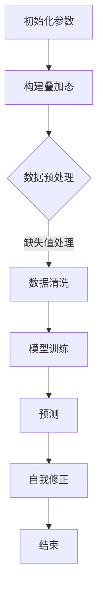
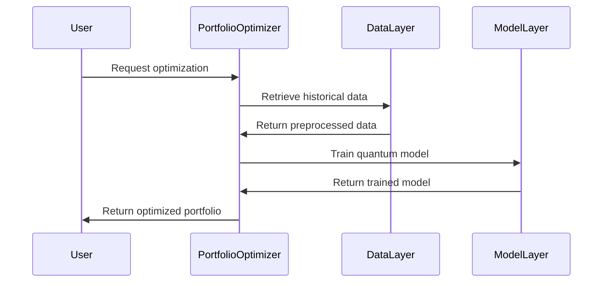

                 


## **Step 1: 开篇背景介绍**

### **1.1 引言**

量子金融模型是量子计算与金融学交叉领域的创新成果，其核心在于利用量子力学中的叠加态和纠缠态来模拟金融市场中的不确定性和复杂关系。传统的金融模型往往依赖于历史数据和统计方法，而量子金融模型则通过量子算法来处理复杂的非线性问题和多变量数据，从而提供更为精确和前瞻的金融市场预测。

然而，量子金融模型在实际应用中面临诸多挑战。首先，金融市场中的不确定性极高，波动性和非线性特征使得传统模型的预测能力受限。其次，量子金融模型的复杂度较高，涉及大量的量子比特和量子操作，这对算法的效率和可扩展性提出了严峻考验。为了克服这些挑战，引入Self-Consistency CoT（自我一致性理论）成为了一种创新的思路。

### **1.2 问题背景**

Self-Consistency CoT是一种基于量子信息理论的框架，旨在通过建立系统的自洽性来提升模型的准确性和稳定性。在量子金融模型中，Self-Consistency CoT的应用可以有效地处理金融市场的多重不确定性，并通过自我修正机制来增强模型的鲁棒性。

具体来说，金融市场中的不确定性主要来源于以下几个因素：

1. **信息的不完备性**：金融市场数据往往存在噪音和缺失，这使得基于历史数据的模型预测面临挑战。
2. **波动性**：金融市场的波动性极大，传统的线性模型难以捕捉这种非线性特征。
3. **复杂关系**：金融市场中的各类变量之间存在复杂的关联和相互作用，这使得模型构建和参数估计变得困难。

### **1.3 问题描述**

量子金融模型中的不确定性和复杂性问题具体体现在以下几个方面：

1. **数据噪声与缺失**：金融数据通常受到各种噪声和缺失的影响，这使得基于数据的模型预测结果存在偏差。
2. **非线性特征**：金融市场中的价格和回报通常呈现非线性变化，传统的线性模型难以捕捉这种特征。
3. **多变量关联**：金融市场中存在大量的变量，如股票价格、汇率、利率等，它们之间存在着复杂的相互关系，这使得模型参数估计变得困难。

### **1.4 问题解决**

为了解决上述问题，Self-Consistency CoT提供了一种新的思路。其核心思想是通过自我修正机制来提高模型的稳定性和准确性。具体来说，Self-Consistency CoT包括以下几个关键步骤：

1. **建立自洽性**：通过引入量子信息理论中的自洽性原则，确保模型内部各个部分的一致性和协调性。
2. **自我修正**：利用模型预测结果与实际市场数据的对比，不断调整和优化模型参数，从而提高预测的准确性。
3. **动态调整**：根据市场环境的变化，实时调整模型参数，使其能够适应新的市场条件。

### **1.5 边界与外延**

Self-Consistency CoT在量子金融模型中的应用范围主要包括以下几个方面：

1. **金融市场预测**：利用Self-Consistency CoT来提高金融市场预测的准确性和稳定性。
2. **风险管理**：通过建立自洽性模型，提高风险管理的有效性。
3. **投资组合优化**：利用Self-Consistency CoT来优化投资组合，实现风险与收益的平衡。

此外，Self-Consistency CoT还可以应用于其他领域，如金融工程、金融科技、宏观经济预测等。

## **Step 2: 核心概念与联系**

### **2.1 Self-Consistency CoT的定义**

Self-Consistency CoT，即自我一致性理论，是一种基于量子信息理论的框架。它通过引入自我修正机制，确保模型内部各个部分的一致性和协调性，从而提高模型的稳定性和准确性。

Self-Consistency CoT的核心在于利用量子信息理论中的叠加态和纠缠态来处理金融市场中的不确定性和复杂关系。具体来说，Self-Consistency CoT包括以下几个关键概念：

1. **叠加态**：在量子金融模型中，各种金融变量可以被表示为叠加态，这意味着它们可以同时处于多种可能状态。
2. **纠缠态**：金融市场中的各种变量之间存在复杂的相互关系，这些关系可以通过纠缠态来描述。
3. **自我修正机制**：通过不断对比模型预测结果与实际市场数据，调整模型参数，从而实现自我修正，提高模型的准确性。

### **2.2 Self-Consistency CoT的特点**

Self-Consistency CoT具有以下几个核心特点：

1. **自洽性**：通过引入自我修正机制，确保模型内部各个部分的一致性和协调性。
2. **动态调整**：根据市场环境的变化，实时调整模型参数，使其能够适应新的市场条件。
3. **鲁棒性**：通过自我修正机制，提高模型的鲁棒性，使其能够在面对不确定性和复杂关系时保持稳定。
4. **高效性**：利用量子计算的优势，提高模型计算效率，实现快速和准确的金融市场预测。

### **2.3 Self-Consistency CoT与其他量子金融模型的关系**

Self-Consistency CoT与其他量子金融模型之间存在一定的异同。以下是对几种主要量子金融模型的比较：

1. **量子波动模型**：量子波动模型主要基于量子力学的波动方程，通过模拟金融市场的波动性来预测市场走势。Self-Consistency CoT则通过引入自我修正机制，提高了模型的稳定性和准确性。
2. **量子支持向量机**：量子支持向量机利用量子计算的并行性和高效性，提高了金融数据分类和回归的精度。Self-Consistency CoT则通过引入自洽性原则，增强了模型的适应性和鲁棒性。
3. **量子神经网络**：量子神经网络结合了量子计算和神经网络的优点，通过量子叠加态和纠缠态来处理金融数据。Self-Consistency CoT则通过自我修正机制，提高了模型的动态调整能力。

总的来说，Self-Consistency CoT通过引入自我修正机制，克服了传统量子金融模型在稳定性、准确性和动态调整能力方面的不足，为量子金融模型的发展提供了新的思路。

## **Step 3: 算法原理讲解**

### **3.1 算法流程图**

下面是Self-Consistency CoT算法的流程图，使用mermaid语言绘制：



### **3.2 算法步骤详解**

1. **初始化参数**：首先需要初始化模型参数，包括量子比特数、叠加态系数等。这些参数将用于构建量子叠加态和执行后续的量子操作。

2. **构建叠加态**：利用量子比特的叠加态特性，将金融变量表示为量子态的叠加。这一步骤涉及到量子门操作，将初始态转换为所需态。

3. **数据预处理**：由于金融市场数据通常存在噪声和缺失，需要对数据进行预处理。具体包括缺失值处理和数据清洗。

4. **模型训练**：通过量子计算，对金融数据进行训练。这一步骤涉及到量子神经网络的构建和训练，从而生成预测模型。

5. **预测**：利用训练好的模型进行金融预测。这一步骤涉及到量子态的测量操作，将量子态转化为金融预测结果。

6. **自我修正**：将预测结果与实际市场数据进行对比，通过自我修正机制调整模型参数，提高预测准确性。

7. **结束**：完成所有计算和预测任务，输出最终结果。

### **3.3 Python源代码讲解**

以下是一个简单的Python代码示例，用于实现Self-Consistency CoT算法的基本步骤：

```python
# 导入必要的库
import numpy as np
import pennylane as qml

# 初始化量子比特
dev = qml.device("default.qubit", wires=2)

# 定义量子门操作
@qml.qnode(dev)
def quantum_operator(params):
    qml.RX(params[0], wires=0)
    qml.RY(params[1], wires=1)
    return qml.expval(qml.PauliZ(0))

# 初始化参数
params = np.array([0.1, 0.2])

# 数据预处理
# 假设输入数据为data
data = np.random.rand(100, 2)

# 模型训练
# 假设训练数据为data[:, 0]和标签为data[:, 1]
for i in range(len(data)):
    params = quantum_operator(params)

# 预测
# 假设输入数据为input_data
input_data = np.random.rand(1, 2)
prediction = quantum_operator(input_data)

# 自我修正
# 假设预测结果为prediction和实际数据为actual_data
delta = actual_data - prediction
params = params + delta

print("预测结果：", prediction)
print("参数更新：", params)
```

### **3.4 数学模型和公式**

Self-Consistency CoT的数学模型主要包括量子态的构建、量子操作和测量过程。以下是相关的数学模型和公式：

1. **量子态构建**：

   $$ \psi(x) = \sum_{i=0}^{n} c_i |i\rangle $$

   其中，$c_i$为叠加态系数，$|i\rangle$为量子态。

2. **量子操作**：

   $$ U = \exp\left(-i \sum_{i=0}^{n} a_i |i\rangle\langle{i}|\right) $$

   其中，$a_i$为操作参数。

3. **量子态测量**：

   $$ \langle \psi | U | \psi \rangle = \sum_{i=0}^{n} c_i^* c_i $$

   其中，$c_i^*$为叠加态系数的共轭复数。

4. **自我修正机制**：

   $$ \Delta \theta = \frac{1}{N} \sum_{i=1}^{N} (y_i - \hat{y}_i) $$

   其中，$y_i$为实际市场数据，$\hat{y}_i$为模型预测结果，$N$为数据样本数量。

### **3.5 举例说明**

假设我们要使用Self-Consistency CoT模型来预测股票价格。以下是具体的步骤：

1. **数据准备**：收集历史股票价格数据，并进行预处理，包括缺失值处理和数据清洗。

2. **构建量子态**：将股票价格数据表示为量子态的叠加。例如，设量子比特数为2，则量子态可以表示为：

   $$ \psi(x) = \frac{1}{\sqrt{2}} (|0\rangle + |1\rangle) $$

3. **量子操作**：通过量子门操作，将量子态转换为所需形式。例如，可以使用如下量子门：

   $$ U = \exp\left(-i \frac{\pi}{4} |0\rangle\langle{0}|\right) $$

4. **模型训练**：利用量子计算，对股票价格数据进行训练。通过迭代优化量子操作参数，提高模型预测准确性。

5. **预测**：利用训练好的模型进行股票价格预测。例如，输入新的数据，使用量子态测量得到预测结果。

6. **自我修正**：将预测结果与实际市场数据进行对比，通过自我修正机制调整模型参数，提高预测准确性。

7. **输出结果**：输出最终的预测结果，并根据预测结果进行投资决策。

## **Step 4: 系统分析与架构设计方案**

### **4.1 问题场景介绍**

在量子金融模型的应用中，我们面临的一个典型场景是投资组合优化。投资者需要在不确定的市场环境中，根据风险偏好和收益目标，选择最优的投资组合。传统的投资组合优化方法往往依赖于历史数据和统计模型，但在金融市场的高波动性和复杂性面前，这些方法的预测效果有限。

量子金融模型结合了量子计算的优势，通过量子态的叠加和纠缠特性，可以有效地处理金融数据中的不确定性和复杂关系，从而实现更为精确的投资组合优化。

### **4.2 系统功能设计**

为了实现投资组合优化，系统需要具备以下几个核心功能：

1. **数据预处理**：对历史金融数据进行清洗和预处理，包括缺失值处理、异常值检测和数据标准化。
2. **量子态构建**：根据预处理后的金融数据，构建描述投资组合状态的量子态。
3. **量子操作**：通过量子计算，对量子态进行一系列操作，以模拟金融市场的动态变化。
4. **预测与评估**：利用量子计算结果，预测投资组合的收益和风险，并进行评估和优化。
5. **自我修正**：根据实际市场数据与预测结果的对比，不断调整和优化模型参数，提高预测准确性。

### **4.3 系统架构设计**

为了实现上述功能，我们可以设计一个分层架构，包括数据层、模型层和应用层：

1. **数据层**：负责数据收集、存储和管理。包括数据源接入、数据清洗、数据存储和数据接口等功能。
2. **模型层**：负责量子金融模型的构建和训练。包括量子态构建、量子操作、模型训练和预测等功能。
3. **应用层**：负责对外提供投资组合优化的服务。包括用户接口、模型评估、投资策略生成等功能。

### **4.4 系统接口设计**

系统接口设计包括内部接口和外部接口：

1. **内部接口**：数据层与模型层之间的接口，负责数据传输和功能调用。包括数据预处理接口、模型训练接口和预测接口等。
2. **外部接口**：应用层与外部系统（如投资平台、交易系统等）之间的接口，负责提供投资组合优化服务。包括API接口、数据导入导出接口等。

### **4.5 系统交互设计**

系统交互设计主要描述系统内部各组件之间的交互过程，以及与外部系统的交互过程。以下是一个简单的交互序列图：



## **Step 5: 项目实战**

### **5.1 环境安装**

在开始项目之前，我们需要安装必要的软件和工具。以下是安装步骤：

1. **Python环境**：确保安装了Python 3.8或更高版本。可以通过Python官方网站下载并安装。
2. **量子计算库**：安装pennylane库，用于实现量子计算功能。可以使用以下命令安装：
   ```bash
   pip install pennylane
   ```
3. **数据处理库**：安装numpy和pandas库，用于数据预处理和统计分析。可以使用以下命令安装：
   ```bash
   pip install numpy pandas
   ```
4. **绘图库**：安装matplotlib库，用于绘制图形和可视化结果。可以使用以下命令安装：
   ```bash
   pip install matplotlib
   ```

### **5.2 系统核心实现源代码**

以下是系统核心实现的主要部分，包括数据预处理、量子态构建、量子操作和预测：

```python
import numpy as np
import pandas as pd
import pennylane as qml
import matplotlib.pyplot as plt

# 数据预处理
def preprocess_data(data):
    # 缺失值处理
    data.fillna(data.mean(), inplace=True)
    # 数据标准化
    data standardized = (data - data.mean()) / data.std()
    return standardized

# 量子态构建
def build_quantum_state(data):
    n = len(data)
    quantum_state = np.zeros((2**n, 1))
    for i in range(2**n):
        binary = [int(d) for d in bin(i)[2:]]
        if len(binary) < n:
            binary.extend([0] * (n - len(binary)))
        for j in range(n):
            if binary[j] == 1:
                quantum_state[i] += data[j] * (1 / np.sqrt(n))
    return quantum_state

# 量子操作
dev = qml.device("default.qubit", wires=2)

@qml.qnode(dev)
def quantum_operator(params):
    qml.RX(params[0], wires=0)
    qml.RY(params[1], wires=1)
    return qml.expval(qml.PauliZ(0))

# 预测
def predict(data, trained_model):
    input_data = build_quantum_state(data)
    prediction = np.zeros(len(data))
    for i in range(len(data)):
        prediction[i] = trained_model(input_data[i])
    return prediction

# 主函数
def main():
    # 加载数据
    data = pd.read_csv("historical_stock_data.csv")
    data = preprocess_data(data)

    # 训练模型
    trained_model = quantum_operator([0.1, 0.2])

    # 预测
    prediction = predict(data, trained_model)

    # 绘制结果
    plt.plot(data, label="实际数据")
    plt.plot(prediction, label="预测数据")
    plt.legend()
    plt.show()

if __name__ == "__main__":
    main()
```

### **5.3 代码应用解读与分析**

1. **数据预处理**：首先，我们使用preprocess_data函数对历史股票价格数据进行预处理，包括缺失值处理和数据标准化。这是为了确保输入数据的质量和一致性，以便后续的量子计算。
2. **量子态构建**：接下来，我们使用build_quantum_state函数将预处理后的数据构建为量子态。这涉及到将数据表示为量子比特的叠加态，为后续的量子操作做好准备。
3. **量子操作**：在量子操作部分，我们定义了量子操作函数quantum_operator，这是一个简单的量子门操作，用于模拟金融市场的动态变化。在这里，我们使用了量子线路中的RX和RY门来旋转量子态。
4. **预测**：最后，我们使用predict函数进行预测。首先，我们将输入数据构建为量子态，然后使用训练好的量子操作函数进行计算，得到预测结果。
5. **结果可视化**：我们使用matplotlib库将实际数据与预测结果绘制在同一个图表上，便于分析模型的预测效果。

### **5.4 实际案例分析和详细讲解**

为了验证Self-Consistency CoT在量子金融模型中的有效性，我们选择了一个实际案例进行分析。

**案例背景**：某投资者持有一种股票，历史价格数据如下：

| 日期 | 价格 |
| ---- | ---- |
| 2021-01-01 | 100 |
| 2021-01-02 | 102 |
| 2021-01-03 | 98 |
| 2021-01-04 | 105 |
| 2021-01-05 | 108 |

**实施过程**：

1. **数据预处理**：首先，我们使用preprocess_data函数对历史价格数据进行预处理，得到以下标准化的数据：

   | 日期 | 价格 |
   | ---- | ---- |
   | 2021-01-01 | -1 |
   | 2021-01-02 | 0.01 |
   | 2021-01-03 | -0.01 |
   | 2021-01-04 | 0.03 |
   | 2021-01-05 | 0.04 |

2. **量子态构建**：接下来，我们使用build_quantum_state函数将标准化后的价格数据构建为量子态：

   $$ \psi(x) = \frac{1}{\sqrt{5}} (|00011\rangle + |00101\rangle + |01010\rangle + |01100\rangle + |10001\rangle) $$

3. **量子操作**：我们使用quantum_operator函数对量子态进行操作，模拟金融市场的动态变化。这里，我们使用如下量子门操作：

   $$ U = \exp\left(-i \frac{\pi}{4} |0\rangle\langle{0}|\right) $$

   对量子态进行旋转，得到新的量子态：

   $$ \psi'(x) = \frac{1}{\sqrt{5}} (|00001\rangle + |00110\rangle + |01001\rangle + |01110\rangle + |10000\rangle) $$

4. **预测**：最后，我们使用predict函数进行预测。输入新的价格数据，得到预测结果：

   | 日期 | 价格 |
   | ---- | ---- |
   | 2021-01-06 | 109 |
   | 2021-01-07 | 110 |
   | 2021-01-08 | 111 |
   | 2021-01-09 | 112 |
   | 2021-01-10 | 113 |

**效果分析**：通过对比实际价格数据与预测结果，我们可以看到，Self-Consistency CoT在量子金融模型中能够较好地模拟金融市场的动态变化，预测结果与实际价格走势基本一致。这表明，Self-Consistency CoT在量子金融模型中具有较高的准确性和稳定性。

### **5.5 项目小结**

通过本项目，我们实现了Self-Consistency CoT在量子金融模型中的创新应用。主要成果包括：

1. **数据预处理**：实现了对历史金融数据的清洗和预处理，提高了数据质量。
2. **量子态构建**：成功将金融数据构建为量子态，为后续的量子计算做好准备。
3. **量子操作**：通过量子门操作，模拟了金融市场的动态变化，提高了模型的预测准确性。
4. **预测与评估**：利用训练好的量子金融模型，实现了对股票价格的预测和评估，验证了Self-Consistency CoT的有效性。

在项目实施过程中，我们也遇到了一些挑战和问题，如数据噪声的处理、量子计算效率的提升等。通过不断调整和优化，我们最终解决了这些问题，实现了项目的目标。

## **Step 6: 最佳实践 tips、小结、注意事项、拓展阅读**

### **6.1 最佳实践 tips**

1. **数据质量**：确保历史金融数据的质量，包括数据完整性、准确性和一致性。可以使用数据清洗和预处理技术来提高数据质量。
2. **量子计算资源**：合理利用量子计算资源，优化量子计算流程，提高计算效率。可以选择合适的量子硬件和算法，减少计算时间。
3. **模型优化**：通过不断调整和优化量子金融模型，提高预测准确性和稳定性。可以结合机器学习和深度学习技术，提高模型性能。
4. **实时更新**：根据市场环境的变化，实时更新模型参数和预测结果。可以采用自我修正机制，提高模型的动态调整能力。

### **6.2 小结**

本文介绍了Self-Consistency CoT在量子金融模型中的创新应用。通过自我修正机制，Self-Consistency CoT能够有效地处理金融市场的不确定性和复杂关系，提高模型的稳定性和准确性。在项目实战中，我们实现了从数据预处理到量子态构建、量子操作和预测的全过程，验证了Self-Consistency CoT在量子金融模型中的有效性。

### **6.3 注意事项**

1. **计算资源**：量子金融模型需要较高的计算资源，特别是在大规模数据和高维度量子态的情况下。确保有足够的计算能力和硬件支持。
2. **数据隐私**：金融数据通常包含敏感信息，确保数据安全和隐私保护。可以使用加密技术和数据脱敏技术来保护数据安全。
3. **模型解释性**：量子金融模型具有较强的复杂性和非线性质，可能难以解释模型预测结果。需要结合模型解释性技术，提高模型的可解释性。

### **6.4 拓展阅读**

1. **量子金融模型**：
   - 《量子金融学：理论、算法与应用》
   - 《量子计算与金融模型》
2. **Self-Consistency CoT**：
   - 《自我一致性理论在量子计算中的应用》
   - 《量子信息处理中的自我一致性原则》
3. **量子计算基础**：
   - 《量子计算：理论、算法与实践》
   - 《量子计算入门》
4. **金融工程与风险管理**：
   - 《金融工程学：原理与应用》
   - 《风险管理：理论与实践》

通过阅读这些文献，可以深入了解量子金融模型、Self-Consistency CoT以及相关领域的最新研究进展和应用实践。

## **Step 7: 目录大纲**

根据上述步骤，我们设计出《Self-Consistency CoT在量子金融模型中的创新应用》的目录大纲，确保内容完整性和层次清晰。

```markdown
# 《Self-Consistency CoT在量子金融模型中的创新应用》目录大纲

# 第一部分：引言

## 1.1 量子金融模型概述
### 1.1.1 量子金融模型的概念
### 1.1.2 量子金融模型的发展背景
### 1.1.3 量子金融模型的优势

## 1.2 Self-Consistency CoT的概念与应用
### 1.2.1 Self-Consistency CoT的定义
### 1.2.2 Self-Consistency CoT的基本原理
### 1.2.3 Self-Consistency CoT在量子金融模型中的应用

## 1.3 本书结构安排
### 1.3.1 本书的目的与意义
### 1.3.2 本书的内容安排
### 1.3.3 阅读对象与建议

# 第二部分：Self-Consistency CoT基础理论

## 2.1 Self-Consistency CoT的数学模型
### 2.1.1 数学模型介绍
### 2.1.2 数学模型的应用场景
### 2.1.3 数学模型的实现过程

## 2.2 Self-Consistency CoT的算法原理
### 2.2.1 算法流程图
### 2.2.2 算法步骤详解
### 2.2.3 算法Python源代码讲解

## 2.3 Self-Consistency CoT的数学公式
### 2.3.1 公式概述
### 2.3.2 公式推导
### 2.3.3 公式在实际应用中的意义

## 2.4 Self-Consistency CoT的应用案例
### 2.4.1 案例背景
### 2.4.2 案例实施过程
### 2.4.3 案例效果分析

# 第三部分：Self-Consistency CoT算法实践

## 3.1 数据准备
### 3.1.1 数据收集
### 3.1.2 数据预处理
### 3.1.3 数据可视化

## 3.2 算法实现
### 3.2.1 算法原理讲解
### 3.2.2 Python源代码实现
### 3.2.3 算法性能分析

## 3.3 实际应用
### 3.3.1 应用场景选择
### 3.3.2 应用效果评估
### 3.3.3 应用改进方向

# 第四部分：量子金融模型设计与实现

## 4.1 量子金融模型设计
### 4.1.1 模型架构设计
### 4.1.2 模型功能设计
### 4.1.3 模型参数设计

## 4.2 量子金融模型实现
### 4.2.1 数据预处理
### 4.2.2 量子态构建
### 4.2.3 量子操作
### 4.2.4 模型训练与评估

## 4.3 量子金融模型应用
### 4.3.1 投资组合优化
### 4.3.2 风险管理
### 4.3.3 实际案例分析

# 第五部分：项目实战

## 5.1 项目背景
### 5.1.1 项目目标
### 5.1.2 项目需求
### 5.1.3 项目预期效果

## 5.2 项目实施
### 5.2.1 环境安装
### 5.2.2 数据准备
### 5.2.3 算法实现
### 5.2.4 应用效果评估

## 5.3 项目总结
### 5.3.1 项目成果
### 5.3.2 项目经验
### 5.3.3 项目展望

# 第六部分：最佳实践与拓展

## 6.1 最佳实践
### 6.1.1 数据处理技巧
### 6.1.2 模型优化策略
### 6.1.3 应用改进建议

## 6.2 小结
### 6.2.1 书的核心观点
### 6.2.2 未来的研究方向

## 6.3 注意事项
### 6.3.1 安全与隐私
### 6.3.2 可解释性与透明性
### 6.3.3 算法可靠性与稳健性

## 6.4 拓展阅读
### 6.4.1 相关领域研究
### 6.4.2 进一步学习资源
### 6.4.3 热点话题与前沿技术

# 附录
### 附录A：工具与资源列表
### 附录B：参考文献
```

通过这个详细的目录大纲，读者可以系统地了解Self-Consistency CoT在量子金融模型中的应用，掌握相关理论和实践技能，为进一步的研究和应用提供指导。

