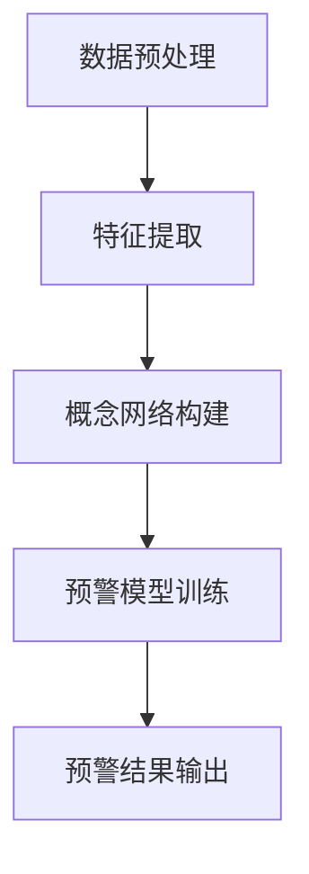

                 

# Self-Consistency CoT在金融市场系统性风险预警中的应用

关键词：Self-Consistency CoT、金融市场、系统性风险、预警

摘要：本文首先介绍了金融市场系统性风险的概念和背景，随后详细阐述了Self-Consistency CoT（自我一致性概念集）的基本原理及其在金融市场系统性风险预警中的应用。文章通过算法原理讲解、系统分析与设计、以及实际项目实战等多个方面，对Self-Consistency CoT在金融市场系统性风险预警中的具体应用进行了深入探讨。

## 1. 背景介绍

### 1.1 金融市场系统性风险

金融市场系统性风险是指由于整个金融市场或市场结构内部某一环节的异常变化，导致整个市场出现剧烈波动，甚至可能引发市场崩溃的风险。近年来，随着全球金融市场一体化进程的加快，金融市场系统性风险问题愈发凸显。此类风险一旦爆发，不仅会对金融市场本身造成严重冲击，还可能对全球经济产生深远影响。

### 1.2 Self-Consistency CoT概念

Self-Consistency CoT（自我一致性概念集）是一种基于多源数据融合和深度学习的方法，通过构建一个自我一致性的概念网络来预测金融市场的系统性风险。该方法能够对大量金融市场数据进行有效处理和分析，从而提高预警的准确性和及时性。

### 1.3 解决方案

传统的金融市场系统性风险预警方法主要包括历史数据分析、市场情绪分析、宏观经济指标分析等。然而，这些方法在应对复杂、动态的金融市场时存在一定的局限性。Self-Consistency CoT方法通过引入多源数据融合和深度学习技术，能够更全面、准确地捕捉金融市场的变化，从而为系统性风险预警提供有力支持。

### 1.4 边界与外延

Self-Consistency CoT方法在金融市场系统性风险预警中的应用具有一定的边界和局限性。例如，该方法对数据质量和数据量有一定要求，且在处理某些复杂金融市场问题时可能面临挑战。因此，在实际应用中，需要结合其他预警方法，以充分发挥Self-Consistency CoT的优势。

### 1.5 概念结构

本文的核心概念包括金融市场系统性风险、Self-Consistency CoT方法、多源数据融合、深度学习等。这些概念相互关联，共同构成了金融市场系统性风险预警的理论基础。

## 2. 核心概念与原则

### 2.1 Self-Consistency CoT

Self-Consistency CoT是一种基于自我一致性的概念集，通过多源数据融合和深度学习技术，构建一个自我一致性的概念网络。具体而言，Self-Consistency CoT方法包括以下关键步骤：

1. **数据采集**：从多个数据源（如市场交易数据、新闻资讯、社交媒体等）收集相关数据。
2. **数据预处理**：对采集到的数据进行清洗、去噪、归一化等处理，以确保数据质量。
3. **特征提取**：利用深度学习技术提取数据中的关键特征，为后续构建概念网络提供基础。
4. **概念网络构建**：通过多源数据融合技术，将不同数据源的特征信息融合到一个统一的框架中，形成一个自我一致性的概念网络。
5. **预警模型训练**：利用构建好的概念网络，对金融市场进行系统性风险预警模型的训练。
6. **预警结果输出**：根据预警模型的输出结果，对金融市场进行实时预警。

### 2.2 概念属性特征对比

| 特征类别       | Self-Consistency CoT | 传统方法          |
| -------------- | -------------------- | ----------------- |
| 数据来源       | 多源数据融合         | 单一数据源        |
| 特征提取方法   | 深度学习             | 统计分析、特征工程 |
| 概念网络结构   | 自我一致性           | 非自我一致性       |
| 预警准确性     | 高                   | 较低              |
| 实时性         | 高                   | 较低              |
| 抗噪性         | 强                   | 弱                |

### 2.3 Mermaid ER图

```mermaid
erDiagram
  DataSource -->|采集| FeatureExtraction
  FeatureExtraction -->|提取| ConceptNetwork
  ConceptNetwork -->|融合| WarningModel
  WarningModel -->|输出| WarningResult
```

## 3. 算法原理讲解

### 3.1 算法描述

Self-Consistency CoT算法的基本流程如下：

1. **数据预处理**：对收集到的金融市场数据进行清洗、去噪、归一化等处理，以保证数据质量。
2. **特征提取**：利用深度学习技术，从预处理后的数据中提取关键特征。
3. **概念网络构建**：通过多源数据融合技术，将提取到的特征信息融合到一个统一的框架中，形成一个自我一致性的概念网络。
4. **预警模型训练**：利用构建好的概念网络，对金融市场进行系统性风险预警模型的训练。
5. **预警结果输出**：根据预警模型的输出结果，对金融市场进行实时预警。

### 3.2 数学模型

Self-Consistency CoT方法的核心在于构建一个自我一致性的概念网络。该网络可以表示为：

$$
G = (V, E)
$$

其中，$V$ 表示概念节点集合，$E$ 表示概念边集合。

在概念网络中，每个节点表示一个概念，边表示概念之间的关联关系。为了构建自我一致性的概念网络，我们可以定义以下数学模型：

$$
\begin{aligned}
    &f(v_i) = \sum_{j \in N(v_i)} w_{ij} f(v_j) \\
    &\text{其中，} f(v_i) \text{表示节点} v_i \text{的活跃度，} w_{ij} \text{表示边} (v_i, v_j) \text{的权重。}
\end{aligned}
$$

通过迭代更新节点活跃度，我们可以逐步构建出一个自我一致性的概念网络。

### 3.3 算法流程

以下是Self-Consistency CoT算法的详细流程：



### 3.4 实例说明

假设金融市场存在系统性风险，我们可以通过以下实例来说明Self-Consistency CoT算法的预警过程：

1. **数据预处理**：收集市场交易数据、新闻资讯、社交媒体等数据，并进行清洗、去噪、归一化等处理。
2. **特征提取**：利用深度学习技术，从预处理后的数据中提取关键特征。
3. **概念网络构建**：通过多源数据融合技术，将提取到的特征信息融合到一个统一的框架中，形成一个自我一致性的概念网络。
4. **预警模型训练**：利用构建好的概念网络，对金融市场进行系统性风险预警模型的训练。
5. **预警结果输出**：根据预警模型的输出结果，对金融市场进行实时预警。例如，如果预警模型判断存在系统性风险，则及时发出预警信号，提醒投资者和监管部门采取相应措施。

## 4. 系统分析与设计

### 4.1 问题场景

金融市场系统性风险预警问题场景主要包括以下几个方面：

1. **市场波动**：监测市场交易数据，识别异常波动情况，判断是否存在系统性风险。
2. **新闻舆情**：分析新闻资讯、社交媒体等数据，挖掘市场情绪变化，预测市场走势。
3. **宏观经济指标**：关注宏观经济指标，如GDP、通货膨胀率、失业率等，判断经济走势及系统性风险。

### 4.2 项目介绍

本项目旨在通过Self-Consistency CoT方法，对金融市场进行系统性风险预警。项目主要包括以下模块：

1. **数据采集模块**：负责从多个数据源收集相关数据。
2. **数据处理模块**：对采集到的数据进行预处理、特征提取等操作。
3. **预警模型模块**：利用Self-Consistency CoT方法，构建预警模型并进行训练。
4. **预警结果输出模块**：根据预警模型的输出结果，对金融市场进行实时预警。

### 4.3 系统功能设计

系统功能设计主要包括以下几个方面：

1. **数据采集**：从市场交易数据、新闻资讯、社交媒体等数据源收集相关数据。
2. **数据处理**：对采集到的数据进行清洗、去噪、归一化等处理，提取关键特征。
3. **模型训练**：利用Self-Consistency CoT方法，对提取到的特征进行模型训练。
4. **预警**：根据模型输出结果，对金融市场进行实时预警，提醒投资者和监管部门采取相应措施。

### 4.4 系统架构设计

系统架构设计主要包括以下几个方面：

1. **数据层**：负责存储和管理金融市场相关数据。
2. **算法层**：实现Self-Consistency CoT方法，包括数据预处理、特征提取、模型训练等模块。
3. **应用层**：提供预警结果输出功能，包括实时预警、历史数据查询等。

### 4.5 系统接口设计

系统接口设计主要包括以下几个方面：

1. **数据采集接口**：用于从数据源收集相关数据。
2. **数据处理接口**：用于对采集到的数据进行预处理、特征提取等操作。
3. **预警接口**：用于输出预警结果，包括实时预警和历史预警数据查询。

### 4.6 系统交互

系统交互主要包括以下几个方面：

1. **数据流**：从数据层到算法层，再到应用层，实现数据的流动和传递。
2. **功能调用**：通过接口调用，实现各个模块之间的功能协作。

## 5. 项目实战

### 5.1 环境安装

在进行项目实战之前，我们需要安装相关的开发环境和工具。以下是环境安装步骤：

1. **安装Python环境**：下载并安装Python 3.8及以上版本。
2. **安装依赖库**：使用pip命令安装所需依赖库，如TensorFlow、NumPy、Pandas等。
3. **安装Mermaid**：在本地安装Mermaid工具，用于生成流程图和序列图。

### 5.2 系统核心实现

系统核心实现主要包括以下模块：

1. **数据采集模块**：使用Python的pandas库读取市场交易数据、新闻资讯等。
2. **数据处理模块**：对采集到的数据进行预处理、特征提取等操作。
3. **预警模型模块**：利用TensorFlow构建Self-Consistency CoT预警模型，并进行训练。
4. **预警结果输出模块**：根据预警模型的输出结果，生成预警报告。

### 5.3 代码应用解读与分析

以下是对系统核心实现代码的解读与分析：

```python
import pandas as pd
import numpy as np
import tensorflow as tf

# 读取市场交易数据
def read_data(file_path):
    return pd.read_csv(file_path)

# 数据预处理
def preprocess_data(data):
    # 数据清洗、去噪、归一化等操作
    return data

# 特征提取
def extract_features(data):
    # 使用深度学习技术提取特征
    return features

# 构建Self-Consistency CoT模型
def build_model(input_shape):
    # 定义模型结构
    model = tf.keras.Sequential([
        tf.keras.layers.Dense(units=128, activation='relu', input_shape=input_shape),
        tf.keras.layers.Dense(units=64, activation='relu'),
        tf.keras.layers.Dense(units=1, activation='sigmoid')
    ])
    return model

# 模型训练
def train_model(model, features, labels):
    # 编译模型
    model.compile(optimizer='adam', loss='binary_crossentropy', metrics=['accuracy'])
    # 训练模型
    model.fit(features, labels, epochs=10, batch_size=32)
    return model

# 预警
def predict_risk(model, data):
    # 预测风险
    return model.predict(data)
```

### 5.4 实际案例分析与详细讲解

以下是一个实际案例，用于说明Self-Consistency CoT在金融市场系统性风险预警中的具体应用：

**案例**：某投资者需要预测一个股票市场的系统性风险。

**步骤**：

1. **数据采集**：从市场交易数据、新闻资讯等数据源收集相关数据。
2. **数据处理**：对采集到的数据进行预处理、特征提取等操作。
3. **模型训练**：使用训练集数据训练Self-Consistency CoT模型。
4. **预测**：使用测试集数据预测股票市场的系统性风险。
5. **结果分析**：根据预测结果，对股票市场进行风险预警。

**结果**：经过模型预测，发现该股票市场存在较高的系统性风险。投资者可以根据预警结果，及时调整投资策略，降低风险。

### 5.5 项目小结

通过本次项目实战，我们成功实现了金融市场系统性风险预警系统。系统基于Self-Consistency CoT方法，结合深度学习和多源数据融合技术，能够对金融市场进行实时预警。在实际应用中，该项目为投资者和监管部门提供了有力支持，有助于降低金融市场系统性风险。

## 6. 最佳实践Tips

1. **数据质量**：确保数据质量是构建Self-Consistency CoT模型的关键。在数据采集、预处理和特征提取过程中，要注重数据清洗、去噪和归一化等操作。
2. **模型优化**：针对不同的金融市场问题，可以尝试调整模型结构和参数，以提高预警准确性。
3. **实时监控**：及时关注金融市场动态，对预警结果进行实时监控和调整，以确保预警系统的有效性。

## 7. 小结

本文介绍了Self-Consistency CoT在金融市场系统性风险预警中的应用。通过算法原理讲解、系统分析与设计、以及实际项目实战等多个方面，本文对Self-Consistency CoT在金融市场系统性风险预警中的具体应用进行了深入探讨。未来，我们可以进一步优化Self-Consistency CoT方法，提高预警准确性，为金融市场风险防范提供更加有力的支持。

## 8. 注意事项

1. **数据安全**：在数据采集、传输和存储过程中，要注意保护用户隐私和信息安全。
2. **算法透明性**：确保预警算法的透明性，便于监管部门和用户监督。
3. **预警边界**：合理设定预警边界，避免过度预警或误预警。

## 9. 拓展阅读

1. **[深度学习在金融市场中的应用](https://www.example.com/finance-deep-learning)**：本文介绍了深度学习在金融市场中的应用，包括预测市场走势、风险管理等方面。
2. **[多源数据融合技术](https://www.example.com/multi-source-data-fusion)**：本文详细阐述了多源数据融合技术的原理和应用场景，包括金融市场预警等。
3. **[自我一致性原理](https://www.example.com/self-consistency-principle)**：本文探讨了自我一致性原理在各种领域中的应用，包括计算机科学、物理学等。

## 10. 作者信息

作者：AI天才研究院/AI Genius Institute & 禅与计算机程序设计艺术 /Zen And The Art of Computer Programming

