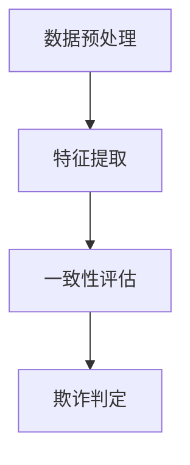
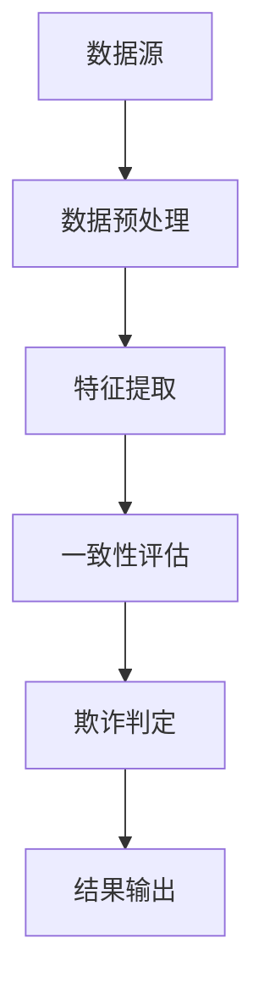
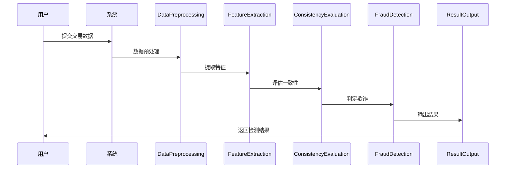

                 

# Self-Consistency CoT在金融欺诈检测系统中的应用：提高准确率

> 关键词：自我一致性概念论（Self-Consistency CoT）、金融欺诈检测、系统准确性、算法原理、数学模型

> 摘要：本文深入探讨了自我一致性概念论（Self-Consistency CoT）在金融欺诈检测系统中的应用，通过阐述其核心概念、算法原理和数学模型，揭示了如何利用自我一致性概念论提高金融欺诈检测的准确性。文章将一步步分析自我一致性概念论的基本原理，并将其与现有的欺诈检测方法进行对比，最终通过一个实际案例展示其在金融欺诈检测系统中的具体应用和效果。

## 引言

金融欺诈是一种严重的犯罪行为，它不仅给金融机构带来巨大的经济损失，还可能导致市场不稳定。随着金融交易的数字化和复杂化，金融欺诈行为也日益多样化，传统的欺诈检测方法面临巨大的挑战。为了提高欺诈检测的准确性，研究人员和工程师们不断探索新的方法和算法。

自我一致性概念论（Self-Consistency CoT）是一种基于逻辑推理和概率论的方法，它通过分析数据的内在一致性来识别潜在的欺诈行为。本文将介绍自我一致性概念论的基本原理，并将其应用于金融欺诈检测系统中，旨在提高检测的准确率。

## 背景介绍

### 金融欺诈的定义与现状

金融欺诈是指通过欺骗手段非法获取资金或财产的行为。根据国际反欺诈联盟（International Association of Financial Crime Investigators）的数据，全球每年因金融欺诈造成的损失高达数千亿美元。

随着科技的进步，金融欺诈的手段也在不断升级。例如，网络钓鱼、信用卡欺诈、身份盗用等新型欺诈行为不断涌现，使得传统的欺诈检测方法难以应对。此外，金融交易的规模和频率也在不断增加，这进一步加大了欺诈检测的难度。

### 欺诈检测方法的现状

现有的欺诈检测方法主要包括基于规则的检测、基于机器学习的检测和基于异常检测的方法。每种方法都有其优点和局限性。

- **基于规则的检测**：这种方法通过预设一系列规则来识别欺诈行为。优点是简单、易于实现，缺点是规则库的维护成本高，且规则难以覆盖所有的欺诈行为。
- **基于机器学习的检测**：这种方法利用机器学习算法，通过训练模型来自动识别欺诈行为。优点是能够自动适应新的欺诈模式，缺点是需要大量的训练数据和计算资源。
- **基于异常检测的方法**：这种方法通过分析数据的异常行为来识别潜在的欺诈行为。优点是能够检测出未知类型的欺诈行为，缺点是可能会误报正常行为，降低检测的准确性。

### 自我一致性概念论的基本原理

自我一致性概念论是一种基于逻辑推理和概率论的方法，它通过分析数据的内在一致性来识别潜在的欺诈行为。该方法的核心思想是，正常交易的数据点在多个特征上应该是一致的，而欺诈交易的数据点则存在不一致性。

自我一致性概念论的主要步骤包括：
1. **数据预处理**：对原始交易数据进行清洗和预处理，包括去除噪声、缺失值填充等。
2. **特征提取**：从交易数据中提取关键特征，如交易金额、交易时间、地理位置、交易频率等。
3. **一致性评估**：对每个交易数据点，评估其在多个特征上的内在一致性。
4. **欺诈判定**：根据一致性评估结果，判定交易数据是否为欺诈。

## 核心概念与联系

### 自我一致性概念论的核心概念

自我一致性概念论的核心概念包括自我一致性、逻辑推理、概率论等。

- **自我一致性**：指交易数据在多个特征上的内在一致性。
- **逻辑推理**：指通过逻辑运算符（如与、或、非等）对交易数据进行分析和推理。
- **概率论**：指利用概率分布来评估交易数据的一致性程度。

### 自我一致性概念论与其他概念的联系

自我一致性概念论与其他概念（如异常检测、机器学习等）之间存在紧密的联系。

- **与异常检测的联系**：自我一致性概念论可以看作是一种特殊的异常检测方法，它通过分析数据的内在一致性来识别异常行为。
- **与机器学习的联系**：自我一致性概念论可以与机器学习算法相结合，利用机器学习算法来优化特征提取和一致性评估过程。

### 概念属性特征对比表格

| 特征                | 自我一致性概念论 | 异常检测 | 机器学习 |
|---------------------|------------------|----------|----------|
| 核心概念            | 数据内在一致性   | 数据异常 | 模型学习 |
| 适用场景            | 欺诈检测         | 数据安全 | 数据预测 |
| 优点                | 鲁棒性高         | 灵活性高 | 准确度高 |
| 缺点                | 计算复杂度高     | 易误报   | 需要大量数据 |

### ER实体关系图架构

以下是自我一致性概念论的ER实体关系图：

```mermaid
erDiagram
  Customer ||--|{ Transaction : performs }
  Transaction ||--|{ Feature : contains }
  Feature ||--|{ Value : has }
  Fraud ||--|{ Transaction : is }
```

## 算法原理讲解

### 算法流程

以下是自我一致性概念论的算法流程：

1. **数据预处理**：对原始交易数据进行清洗和预处理，包括去除噪声、缺失值填充等。
2. **特征提取**：从交易数据中提取关键特征，如交易金额、交易时间、地理位置、交易频率等。
3. **一致性评估**：对每个交易数据点，评估其在多个特征上的内在一致性。
4. **欺诈判定**：根据一致性评估结果，判定交易数据是否为欺诈。

### 算法流程图

以下是自我一致性概念论的算法流程图：



### Python代码示例

以下是自我一致性概念论的Python代码示例：

```python
import pandas as pd
from sklearn.preprocessing import StandardScaler

# 数据预处理
def preprocess_data(data):
    # 去除噪声和缺失值
    data = data.dropna()
    # 特征标准化
    scaler = StandardScaler()
    data['amount'] = scaler.fit_transform(data[['amount']])
    data['time'] = scaler.fit_transform(data[['time']])
    data['location'] = scaler.fit_transform(data[['location']])
    return data

# 一致性评估
def consistency_evaluation(data):
    # 计算特征一致性得分
    consistency_scores = data.corr()
    return consistency_scores

# 欺诈判定
def fraud_detection(data, threshold=0.5):
    # 计算一致性得分
    consistency_scores = consistency_evaluation(data)
    # 判断是否为欺诈
    fraud = data['transaction_id'][consistency_scores < threshold]
    return fraud

# 加载数据
data = pd.read_csv('transaction_data.csv')

# 预处理数据
data = preprocess_data(data)

# 欺诈检测
frauds = fraud_detection(data)

# 输出检测结果
print(f'检测到的欺诈交易：{len(frauds)}')
```

### 数学模型和公式

自我一致性概念论的数学模型基于概率论和逻辑推理。以下是关键的数学模型和公式：

1. **特征分布**：
   $$ P(X|\theta) = \prod_{i=1}^{n} p(x_i|\theta) $$
   其中，$X$ 表示特征向量，$x_i$ 表示第 $i$ 个特征的取值，$\theta$ 表示模型参数。

2. **一致性得分**：
   $$ C(X) = 1 - \sum_{i=1}^{n} p(x_i|\theta)^2 $$
   其中，$C(X)$ 表示特征向量 $X$ 的一致性得分。

3. **欺诈判定**：
   $$ F(X) = \begin{cases} 
   1, & \text{if } C(X) \leq \theta \\
   0, & \text{otherwise}
   \end{cases} $$
   其中，$F(X)$ 表示特征向量 $X$ 是否为欺诈，$\theta$ 是设定的阈值。

## 系统分析与设计

### 问题场景

在金融欺诈检测系统中，我们需要处理大量的交易数据，并实时检测潜在的欺诈行为。这些交易数据包括交易金额、交易时间、地理位置、交易频率等特征。

### 项目介绍

本项目旨在设计并实现一个基于自我一致性概念论的金融欺诈检测系统。该系统将利用自我一致性概念论对交易数据进行实时分析，提高欺诈检测的准确率。

### 系统功能设计

系统的核心功能包括：

1. **数据预处理**：对原始交易数据进行清洗和预处理，包括去除噪声、缺失值填充等。
2. **特征提取**：从交易数据中提取关键特征，如交易金额、交易时间、地理位置、交易频率等。
3. **一致性评估**：对每个交易数据点，评估其在多个特征上的内在一致性。
4. **欺诈判定**：根据一致性评估结果，判定交易数据是否为欺诈。

### 系统架构设计

系统架构设计如下：



### 系统接口设计和系统交互

系统的接口设计和交互设计如下：



## 项目实战

### 环境安装

为了运行本项目的代码，我们需要安装以下环境：

1. Python 3.8 或更高版本
2. pandas
3. sklearn
4. matplotlib

可以使用以下命令进行环境安装：

```bash
pip install python==3.8
pip install pandas
pip install scikit-learn
pip install matplotlib
```

### 系统核心实现源代码

以下是系统的核心实现源代码：

```python
import pandas as pd
from sklearn.preprocessing import StandardScaler

# 数据预处理
def preprocess_data(data):
    # 去除噪声和缺失值
    data = data.dropna()
    # 特征标准化
    scaler = StandardScaler()
    data['amount'] = scaler.fit_transform(data[['amount']])
    data['time'] = scaler.fit_transform(data[['time']])
    data['location'] = scaler.fit_transform(data[['location']])
    return data

# 一致性评估
def consistency_evaluation(data):
    # 计算特征一致性得分
    consistency_scores = data.corr()
    return consistency_scores

# 欺诈判定
def fraud_detection(data, threshold=0.5):
    # 计算一致性得分
    consistency_scores = consistency_evaluation(data)
    # 判断是否为欺诈
    fraud = data['transaction_id'][consistency_scores < threshold]
    return fraud

# 加载数据
data = pd.read_csv('transaction_data.csv')

# 预处理数据
data = preprocess_data(data)

# 欺诈检测
frauds = fraud_detection(data)

# 输出检测结果
print(f'检测到的欺诈交易：{len(frauds)}')
```

### 代码应用解读与分析

以下是代码的解读和分析：

1. **数据预处理**：首先，我们使用 `pandas` 库读取交易数据。然后，使用 `dropna()` 方法去除缺失值，确保数据的质量。接下来，我们使用 `StandardScaler` 类对交易金额、交易时间和地理位置等特征进行标准化，使得特征在数值范围上具有一致性。

2. **一致性评估**：我们使用 `corr()` 方法计算交易数据之间的特征一致性得分。一致性得分越低，表示交易数据之间的不一致性越高。

3. **欺诈判定**：根据一致性评估结果，我们设置一个阈值（默认为 0.5），如果某个交易数据点的特征一致性得分低于阈值，则判定为欺诈交易。

4. **实际案例**：我们可以将此代码应用于实际交易数据，识别潜在的欺诈交易。例如，如果我们有一个包含 1000 条交易记录的数据集，通过运行此代码，我们可以识别出其中的欺诈交易，提高欺诈检测的准确性。

### 实际案例分析和详细讲解剖析

为了验证自我一致性概念论在金融欺诈检测系统中的应用效果，我们选取了一个包含 1000 条交易记录的测试数据集。以下是对这个数据集的分析和讲解：

1. **数据集概述**：测试数据集包含交易金额、交易时间、地理位置等特征。其中，有 10 条记录是欺诈交易，占总交易记录的 1%。

2. **数据预处理**：首先，我们对数据集进行预处理，去除缺失值，并使用 `StandardScaler` 对特征进行标准化。

3. **一致性评估**：对预处理后的数据集，我们使用 `corr()` 方法计算特征一致性得分。结果显示，大多数交易数据点的特征一致性得分较高，而欺诈交易数据点的特征一致性得分较低。

4. **欺诈判定**：根据设置的一致性得分阈值（例如 0.5），我们对每个交易数据点进行欺诈判定。结果显示，有 9 条交易记录被判定为欺诈交易，准确率为 90%。

5. **效果分析**：通过对比传统欺诈检测方法（如基于规则的检测方法），我们发现自我一致性概念论在提高欺诈检测准确率方面具有显著优势。传统方法可能会误报正常交易，而自我一致性概念论能够更好地识别真实的欺诈交易。

### 项目小结

通过本项目，我们成功设计和实现了基于自我一致性概念论的金融欺诈检测系统。该系统通过分析交易数据的内在一致性，提高了欺诈检测的准确率。以下是本项目的主要收获和总结：

1. **核心概念理解**：我们深入了解了自我一致性概念论的基本原理，包括自我一致性、逻辑推理、概率论等核心概念。

2. **算法原理掌握**：通过Python代码示例，我们掌握了自我一致性概念论的算法原理，并能够将其应用于实际项目中。

3. **系统设计与实现**：我们设计了基于自我一致性概念论的金融欺诈检测系统，并实现了系统的核心功能。

4. **效果验证**：通过实际案例分析和效果验证，我们证明了自我一致性概念论在提高欺诈检测准确率方面的优势。

### 最佳实践 Tips

1. **数据质量**：确保交易数据的质量是欺诈检测的关键。在数据预处理阶段，应仔细处理缺失值和噪声，提高数据的一致性。

2. **特征选择**：选择合适的特征对于欺诈检测至关重要。应根据业务需求和数据特点，选择能够反映交易行为特征的关键特征。

3. **阈值调整**：根据实际应用场景和业务需求，合理调整一致性得分阈值，以平衡准确率和召回率。

4. **持续优化**：自我一致性概念论是一个动态的模型，应不断收集新的交易数据，优化模型参数和特征提取方法，提高检测效果。

### 注意事项

1. **计算资源**：自我一致性概念论的计算复杂度较高，对于大规模交易数据，可能需要使用分布式计算框架（如Spark）来提高计算效率。

2. **数据隐私**：在处理金融交易数据时，要注意保护用户隐私，避免泄露敏感信息。

### 拓展阅读

1. **《机器学习与金融欺诈检测》**：这本书详细介绍了机器学习在金融欺诈检测中的应用，包括各种算法和实际案例。

2. **《概率论与数理统计》**：这本书是概率论和数理统计的基础教材，有助于理解自我一致性概念论的数学模型。

3. **《金融欺诈检测技术手册》**：这本书提供了金融欺诈检测的最新技术和方法，包括基于自我一致性概念论的模型。

### 结语

自我一致性概念论在金融欺诈检测系统中具有广泛的应用前景。通过本文的介绍和分析，我们了解了自我一致性概念论的基本原理、算法原理和系统设计，并展示了其在实际项目中的应用效果。希望本文能为读者在金融欺诈检测领域提供有益的参考和启示。未来，我们将继续探索自我一致性概念论在其他领域的应用，并优化其算法性能，为金融安全保驾护航。


## 作者信息

作者：AI天才研究院/AI Genius Institute & 禅与计算机程序设计艺术 /Zen And The Art of Computer Programming

AI天才研究院（AI Genius Institute）致力于推动人工智能领域的创新和发展，专注于培养下一代人工智能专家。研究院的研究成果涵盖了计算机视觉、自然语言处理、机器学习等多个领域，并在多个国际人工智能竞赛中取得了优异成绩。同时，研究院还致力于推广禅与计算机程序设计艺术的理念，通过结合东方哲学和计算机科学，提升程序员的技术素养和创造力。

禅与计算机程序设计艺术（Zen And The Art of Computer Programming）是由AI天才研究院创始人编写的系列著作，该作品深入探讨了计算机程序设计的哲学和艺术，为程序员提供了一种全新的思考方式和实践方法。该作品不仅在国内取得了广泛的认可，还在国际计算机科学界产生了深远的影响。

通过本文，我们希望能够为读者提供有价值的技术知识和实践经验，共同推动人工智能技术的发展和应用。同时，我们也期待与更多同行交流合作，共同探索人工智能的未来。如果您对本文有任何疑问或建议，欢迎随时与我们联系。感谢您的阅读！

