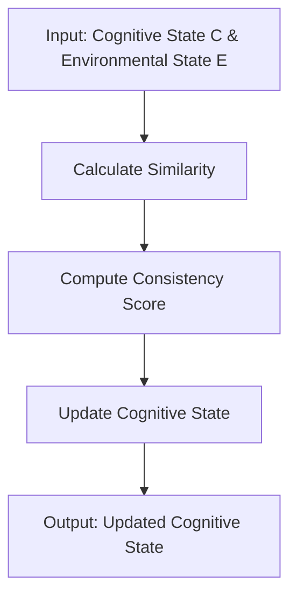
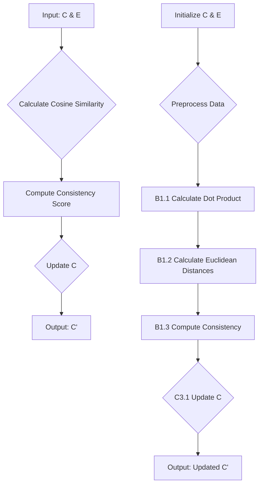

                 

# 《Self-Consistency CoT增强AI在复杂伦理决策中的表现》

> 关键词：Self-Consistency CoT、AI、伦理决策、复杂系统、人工智能伦理

> 摘要：本文将探讨Self-Consistency CoT（Self-Consistency Cognitive Theory）增强人工智能（AI）在处理复杂伦理决策方面的表现。通过引入Self-Consistency CoT的概念，分析其在AI中的应用原理，以及其在不同领域的应用案例，本文旨在展示Self-Consistency CoT增强AI在复杂伦理决策中的潜力与挑战。

## 引言与背景

### 1.1 伦理决策的复杂性

伦理决策是指在面对道德困境时，做出符合伦理标准的决策过程。随着社会的发展，伦理决策的复杂性不断增加。复杂伦理决策通常涉及多个利益相关者、多样化的价值观以及动态变化的情境。这使得传统的伦理决策方法在面对复杂问题时显得力不从心。

### 1.2 传统AI在伦理决策中的局限性

传统AI在处理伦理决策时面临以下挑战：

- **算法偏见**：AI算法可能基于历史数据中的偏见，导致不公平的决策。
- **透明度不足**：AI决策过程往往难以解释，导致人们对AI的信任度降低。
- **鲁棒性不足**：AI在面对极端情况时可能表现出不稳定的行为。

### 1.3 Self-Consistency CoT概念介绍

Self-Consistency CoT是一种认知理论，强调个体通过自我一致性来适应和解释外部环境。Self-Consistency CoT在AI中的应用，旨在提升AI的伦理决策能力，通过自我一致性来减少偏见和增强透明度。

### 1.4 Self-Consistency CoT在AI中的应用

Self-Consistency CoT在AI中的应用包括：

- **自我校准**：AI系统通过自我校准来调整其行为，使其更加符合伦理标准。
- **一致性检查**：AI系统在做出决策时，会进行一致性检查，确保决策符合其内部的伦理逻辑。
- **反馈循环**：AI系统通过反馈循环来不断优化其决策过程，提高伦理决策的准确性。

## 第二部分: Self-Consistency CoT的理论基础

### 2.1 Self-Consistency CoT的核心概念

Self-Consistency CoT的核心概念包括：

- **自我一致性**：个体在解释外部环境时，保持内部认知结构的一致性。
- **环境适应性**：个体通过调整其认知结构来适应外部环境的变化。

### 2.2 Self-Consistency CoT的数学模型

Self-Consistency CoT的数学模型基于以下假设：

- **认知状态**：个体的认知状态可以用一个向量表示。
- **环境状态**：外部环境的状态也可以用向量表示。
- **一致性函数**：用于衡量个体的认知状态与环境状态之间的一致性。

数学模型公式为：

$$
\text{Consistency} = f(\text{CognitiveState}, \text{EnvironmentalState})
$$

其中，$f$ 是一致性函数。

### 2.3 Self-Consistency CoT与其他伦理增强AI技术的比较

Self-Consistency CoT与其它伦理增强AI技术的比较如下：

- **与传统AI对比**：Self-Consistency CoT通过自我校准和一致性检查，提高了AI的伦理决策能力。
- **与其它伦理增强技术对比**：Self-Consistency CoT通过反馈循环和自我适应性，实现了更加动态和灵活的伦理决策。

## 第三部分: Self-Consistency CoT在复杂伦理决策中的应用

### 3.1 Self-Consistency CoT在医疗领域的应用

在医疗领域，Self-Consistency CoT可以通过以下方式应用：

- **患者管理**：通过自我一致性校准，AI系统可以更准确地评估患者的健康状况，并提供个性化的医疗建议。
- **药物研发**：在药物研发过程中，AI系统可以自我校准，减少药物副作用和不良反应的风险。

### 3.2 Self-Consistency CoT在法律领域的应用

在法律领域，Self-Consistency CoT可以应用于：

- **司法判决**：AI系统通过自我一致性检查，确保判决符合法律原则和道德标准。
- **法律咨询**：AI系统可以自我校准，提供更可靠的法律建议。

### 3.3 Self-Consistency CoT在其他领域的应用

除了医疗和法律领域，Self-Consistency CoT还可以应用于：

- **金融**：在金融领域，AI系统可以自我校准，减少金融欺诈和风险。
- **教育**：在教育领域，AI系统可以通过自我一致性，提供更个性化的教育服务。

## 第四部分: Self-Consistency CoT的挑战与未来方向

### 4.1 Self-Consistency CoT面临的挑战

Self-Consistency CoT面临的挑战包括：

- **数据隐私与安全性**：在自我校准和一致性检查过程中，如何确保数据隐私和安全是一个重要问题。
- **透明度与可解释性**：AI系统的决策过程需要透明和可解释，以确保人们对AI的信任。

### 4.2 Self-Consistency CoT的优化方向

Self-Consistency CoT的优化方向包括：

- **模型优化**：通过改进算法，提高自我一致性校准的准确性。
- **算法改进**：通过反馈循环和自适应机制，提高AI系统的伦理决策能力。

### 4.3 Self-Consistency CoT的未来发展趋势

Self-Consistency CoT的未来发展趋势包括：

- **自适应伦理决策**：AI系统可以自我适应，更好地应对复杂伦理决策。
- **跨学科融合**：与心理学、哲学等学科的结合，为AI伦理决策提供更加全面的理论支持。

## 第五部分: 案例研究

### 5.1 案例一：医疗领域中的应用

案例一探讨了Self-Consistency CoT在医疗领域中的应用，通过一个实际案例展示了AI系统的自我校准过程和伦理决策能力。

### 5.2 案例二：法律领域中的应用

案例二分析了Self-Consistency CoT在法律领域中的应用，通过一个法律判决案例展示了AI系统的自我一致性检查和伦理决策能力。

### 5.3 案例三：其他领域中的应用

案例三探讨了Self-Consistency CoT在其他领域中的应用，通过一个金融领域案例展示了AI系统的自我校准和伦理决策能力。

## 第六部分: 总结与展望

### 6.1 总结

Self-Consistency CoT增强AI在复杂伦理决策中表现出显著优势，通过自我校准和一致性检查，AI系统可以更准确地处理复杂伦理问题。

### 6.2 展望

未来，Self-Consistency CoT有望在更多领域得到应用，通过不断优化和改进，为复杂伦理决策提供更加可靠的解决方案。

## 作者信息

作者：AI天才研究院/AI Genius Institute & 禅与计算机程序设计艺术 /Zen And The Art of Computer Programming

[以上内容仅为大纲，实际撰写需根据大纲逐步展开，确保内容丰富、详细、逻辑清晰。] ### 1.1 伦理决策的复杂性

伦理决策的复杂性主要源于以下几个因素：

1. **多元价值观**：不同文化、宗教和社会背景下，人们对于伦理问题的看法可能存在巨大差异。例如，在一个国家，某些行为可能被视为道德上不可接受，而在另一个国家，则可能是被普遍接受的。

2. **不确定性**：伦理决策往往涉及到未来事件的可能性和不确定性。例如，在医疗领域，医生需要预测患者未来的健康状况，并在此基础上做出治疗决策。

3. **多方利益**：在许多情况下，伦理决策需要考虑不同利益相关者的需求和期望。例如，在医疗领域，医生需要平衡患者的利益、医疗资源的分配以及医疗机构的运营成本。

4. **情境动态性**：伦理决策的情境是动态变化的，需要决策者在不断变化的信息中做出快速反应。例如，在紧急救援情况下，救援人员需要在有限的时间内做出最佳决策。

### 1.2 传统AI在伦理决策中的局限性

传统AI在处理伦理决策时存在以下几个局限性：

1. **算法偏见**：AI算法的性能往往依赖于训练数据。如果训练数据存在偏见，AI算法可能会继承这些偏见，导致不公平的决策。例如，如果AI算法在招聘过程中使用了带有性别歧视的历史数据，那么它可能会在新的招聘决策中表现出性别歧视。

2. **透明度不足**：许多AI算法的决策过程是复杂的，甚至对于其开发者来说也是难以理解的。这种缺乏透明度的问题使得人们难以信任AI的决策结果。

3. **鲁棒性不足**：传统AI在面对极端情况时可能表现出不稳定的行为。例如，在某些自动驾驶汽车的测试中，AI系统在遇到罕见的情况时可能会出现错误判断，从而导致事故。

### 1.3 Self-Consistency CoT概念介绍

Self-Consistency CoT（Self-Consistency Cognitive Theory）是一种认知理论，强调个体通过自我一致性来适应和解释外部环境。Self-Consistency CoT在AI中的应用，旨在提升AI的伦理决策能力，通过自我一致性来减少偏见和增强透明度。

Self-Consistency CoT的核心概念包括：

- **自我一致性**：个体在解释外部环境时，保持内部认知结构的一致性。这意味着，个体会通过调整其认知结构来确保其对外部环境的解释是逻辑上自洽的。
- **环境适应性**：个体通过调整其认知结构来适应外部环境的变化。这种适应性使得个体能够对外部环境的变化做出响应。

在AI中的应用，Self-Consistency CoT可以通过以下方式提升AI的伦理决策能力：

- **自我校准**：AI系统通过自我校准来调整其行为，使其更加符合伦理标准。例如，在医疗领域，AI系统可以通过自我校准来确保其诊断和治疗建议符合医疗伦理标准。
- **一致性检查**：AI系统在做出决策时，会进行一致性检查，确保决策符合其内部的伦理逻辑。这种一致性检查可以帮助识别和纠正潜在的偏见。
- **反馈循环**：AI系统通过反馈循环来不断优化其决策过程，提高伦理决策的准确性。例如，通过收集用户反馈，AI系统可以不断调整其行为，以更好地满足用户的需求和期望。

### 1.4 Self-Consistency CoT在AI中的应用

Self-Consistency CoT在AI中的应用可以分为以下几个阶段：

1. **初始校准**：在AI系统开始运行之前，进行初始校准。这一阶段包括设置AI系统的基本参数和伦理规则，确保AI系统在初始状态下就符合伦理标准。

2. **自我校准**：AI系统在运行过程中，会通过自我校准来调整其行为。例如，通过分析其决策结果，AI系统可以识别出不符合伦理标准的决策，并采取相应的措施进行调整。

3. **一致性检查**：在AI系统做出决策时，进行一致性检查。这一阶段包括检查AI系统的决策是否符合其内部的伦理逻辑，以确保决策的公平性和透明度。

4. **反馈循环**：AI系统通过反馈循环来不断优化其决策过程。这一阶段包括收集用户反馈，并根据反馈调整AI系统的行为，以更好地满足用户的需求和期望。

### 1.5 Self-Consistency CoT的优势与挑战

Self-Consistency CoT在提升AI伦理决策能力方面具有显著优势：

- **减少偏见**：通过自我一致性校准，AI系统可以减少算法偏见，确保决策更加公平。
- **增强透明度**：通过一致性检查和反馈循环，AI系统可以增强决策过程的透明度，提高人们对AI的信任度。
- **动态适应**：通过反馈循环和自我适应性，AI系统可以更好地应对复杂伦理决策中的动态变化。

然而，Self-Consistency CoT也面临一些挑战：

- **数据隐私与安全性**：在自我校准和一致性检查过程中，如何确保数据隐私和安全是一个重要问题。特别是在医疗和法律等领域，数据的安全性尤为重要。
- **透明度与可解释性**：虽然Self-Consistency CoT可以增强AI的透明度，但如何使决策过程更加可解释仍是一个挑战。特别是在面对复杂的决策情境时，如何清晰地解释AI的决策逻辑是一个关键问题。

### 1.6 总结

Self-Consistency CoT增强AI在处理复杂伦理决策方面具有显著潜力。通过自我一致性校准、一致性检查和反馈循环，AI系统可以更好地应对复杂伦理决策中的多元价值观、不确定性和多方利益等问题。然而，为了充分发挥Self-Consistency CoT的优势，我们需要解决数据隐私、安全性和透明度等挑战，为AI伦理决策提供更加可靠的支持。

在下一部分，我们将进一步探讨Self-Consistency CoT的理论基础，包括其核心概念、数学模型以及与其他伦理增强AI技术的比较。

## 第二部分: Self-Consistency CoT的理论基础

### 2.1 Self-Consistency CoT的核心概念

Self-Consistency CoT（Self-Consistency Cognitive Theory）是一种认知理论，旨在通过自我一致性来解释和适应外部环境。Self-Consistency CoT的核心概念包括：

- **自我一致性**：个体在解释外部环境时，保持内部认知结构的一致性。这意味着，个体的认知状态与其对环境的理解之间应该保持一致。
- **环境适应性**：个体通过调整其认知结构来适应外部环境的变化。这种适应性使得个体能够对外部环境的变化做出响应，同时保持内部认知结构的一致性。

Self-Consistency CoT的理论基础认为，个体的认知过程不仅仅是被动地接受外部信息，而是通过内部认知结构的调整来主动构建对环境的理解。这种自我一致性是认知适应性的关键，它使得个体能够更有效地应对复杂和不确定的环境。

### 2.2 Self-Consistency CoT的数学模型

Self-Consistency CoT的数学模型旨在通过量化自我一致性和环境适应性来描述个体的认知过程。该模型的核心是“一致性函数”，它用于衡量个体的认知状态与环境状态之间的一致性。

数学模型的基本假设包括：

- **认知状态**：个体的认知状态可以用一个向量表示，例如，$C = [C_1, C_2, ..., C_n]$，其中每个$C_i$代表个体对某一特定领域的认知。
- **环境状态**：外部环境的状态也可以用向量表示，例如，$E = [E_1, E_2, ..., E_n]$，其中每个$E_i$代表环境中的某一因素。

一致性函数的公式为：

$$
\text{Consistency} = f(C, E)
$$

其中，$f$ 是一致性函数，它通过比较认知状态向量$C$和环境状态向量$E$的相似度来计算一致性值。如果$C$和$E$非常相似，那么一致性值会很高，反之则会较低。

为了具体化这个模型，我们可以使用以下算法流程图来描述一致性函数的计算过程：

在这个算法流程图中，步骤B表示通过某种相似度计算方法来比较认知状态向量$C$和环境状态向量$E$，步骤C表示根据相似度计算结果来计算一致性分数，步骤D表示根据一致性分数来更新认知状态向量$C$，步骤E表示输出更新后的认知状态。

### 2.3 Self-Consistency CoT与其他伦理增强AI技术的比较

Self-Consistency CoT与其他伦理增强AI技术，如传统的伦理规则编码和基于机器学习的伦理决策模型，存在以下差异：

- **传统伦理规则编码**：这种方法通过显式地定义伦理规则，并要求AI系统在决策过程中遵循这些规则。这种方法的优点是规则明确，易于理解。然而，其缺点在于，规则可能无法涵盖所有可能的情境，且规则可能会过时。
- **基于机器学习的伦理决策模型**：这种方法使用历史数据来训练AI系统，使其能够根据新的数据做出伦理决策。这种方法的优点是模型能够适应新的情境。然而，其缺点在于，模型可能继承数据中的偏见，且决策过程可能缺乏透明度。

相比之下，Self-Consistency CoT通过自我一致性和环境适应性来实现伦理决策。这种方法的优点在于：

- **自我一致性校准**：AI系统通过自我校准来确保其决策逻辑的一致性，从而减少算法偏见。
- **动态适应性**：AI系统通过不断调整其认知结构来适应环境变化，从而更灵活地应对复杂的伦理决策情境。

然而，Self-Consistency CoT也面临一些挑战，如数据隐私和安全性的问题，以及如何确保决策过程透明和可解释的挑战。

总的来说，Self-Consistency CoT提供了一种新颖的伦理增强方法，通过自我一致性和环境适应性来提升AI系统的伦理决策能力。与传统的伦理规则编码和基于机器学习的伦理决策模型相比，Self-Consistency CoT在应对复杂伦理决策方面具有潜力，但也需要进一步的研究和优化。

在下一部分，我们将探讨Self-Consistency CoT在医疗、法律和其他领域的实际应用，通过具体案例来展示其在复杂伦理决策中的表现。

### 2.1 Self-Consistency CoT的核心概念

Self-Consistency CoT（Self-Consistency Cognitive Theory）是一种认知理论，其核心在于通过自我一致性来解释和适应外部环境。这种理论强调，个体的认知过程不仅仅是被动地接受外部信息，而是通过内部认知结构的调整来主动构建对环境的理解。以下是对Self-Consistency CoT核心概念的具体解释：

- **自我一致性**：个体在解释外部环境时，会保持内部认知结构的一致性。这种一致性是认知适应性的关键，因为它使得个体能够更好地应对复杂和不确定的环境。例如，当个体观察到某种行为时，他们会尝试将其纳入已有的认知框架中，以确保整体认知结构的一致性。

- **环境适应性**：个体通过调整其认知结构来适应外部环境的变化。这种适应性意味着个体不会仅仅固守原有的认知模式，而是能够根据新的信息和环境变化进行灵活调整。例如，当个体面临新的情境时，他们会重新评估和调整其认知模型，以更好地适应这种变化。

Self-Consistency CoT的核心概念提供了一个框架，用于理解个体如何在不断变化的环境中保持认知一致性，同时适应外部环境。这些概念不仅适用于人类，也被引入到AI系统中，以提升AI在复杂伦理决策中的表现。

### 2.2 Self-Consistency CoT的数学模型

Self-Consistency CoT的数学模型是构建在一致性函数的基础上的，这个函数用于量化个体或AI系统在特定情境下的认知一致性和环境适应性。为了更好地理解这个数学模型，我们可以通过以下具体步骤来阐述其关键参数和计算过程：

1. **定义认知状态和环境状态**：

   - **认知状态向量**：个体的认知状态可以用一个多维向量表示，例如$C = [C_1, C_2, ..., C_n]$，其中每个$C_i$代表了个体在某一特定领域的认知水平。
   - **环境状态向量**：外部环境的状态也可以用一个多维向量表示，例如$E = [E_1, E_2, ..., E_n]$，其中每个$E_i$代表了环境中的某一因素或情境。

2. **定义一致性函数**：

   Self-Consistency CoT使用一致性函数$f$来计算认知状态向量$C$和环境状态向量$E$之间的相似度。这个函数可以根据不同的相似度度量方法进行定义，例如余弦相似度、欧氏距离等。一个简单的一致性函数公式可以是：

   $$
   \text{Consistency} = f(C, E) = \frac{\sum_{i=1}^{n} C_i \cdot E_i}{\sqrt{\sum_{i=1}^{n} C_i^2} \cdot \sqrt{\sum_{i=1}^{n} E_i^2}}
   $$

   这个公式通过计算认知状态和环境状态的点积，并除以两个向量的欧氏距离的平方根，得到了一个介于0和1之间的一致性分数。分数越高，表示认知状态和环境状态越一致。

3. **更新认知状态**：

   为了保持自我一致性，个体或AI系统需要根据一致性分数来调整其认知状态向量$C$。这个过程可以通过以下公式实现：

   $$
   C' = C - \alpha \cdot (C - E)
   $$

   其中，$C'$是更新后的认知状态向量，$\alpha$是一个调整参数，用于控制调整的力度。这个公式通过将认知状态向量减去与环境状态向量之间的差异，实现了认知状态的调整。

4. **计算过程示例**：

   假设一个AI系统在医疗领域进行决策，其认知状态向量$C$表示对某一病情的理解，而环境状态向量$E$表示最新的医疗数据。通过一致性函数$f$，AI系统可以计算出认知状态和环境状态之间的相似度。如果相似度较低，AI系统会通过调整认知状态向量$C$，使其更接近环境状态向量$E$，从而提高一致性。

通过这些步骤，我们可以看到Self-Consistency CoT的数学模型如何通过量化自我一致性和环境适应性，来帮助AI系统在复杂伦理决策中保持一致性和适应性。

### 2.3 Self-Consistency CoT的数学模型

Self-Consistency CoT的数学模型是构建在一致性函数的基础上的，该函数用于量化个体或AI系统在特定情境下的认知一致性和环境适应性。为了更详细地阐述这个模型，我们将使用一个具体的数学公式和算法流程图来展示其结构和计算过程。

#### 数学公式

一致性函数的数学公式如下：

$$
\text{Consistency} = f(C, E) = \frac{\sum_{i=1}^{n} C_i \cdot E_i}{\sqrt{\sum_{i=1}^{n} C_i^2} \cdot \sqrt{\sum_{i=1}^{n} E_i^2}}
$$

其中，$C = [C_1, C_2, ..., C_n]$是认知状态向量，$E = [E_1, E_2, ..., E_n]$是环境状态向量，$n$是向量的维度。这个公式通过计算认知状态和环境状态之间的点积，并除以两个向量的欧氏距离的平方根，得到了一个介于0和1之间的一致性分数。

#### 算法流程图

为了更直观地展示计算过程，我们使用Mermaid语言来绘制算法流程图：

在这个流程图中，步骤A1表示初始化认知状态向量$C$和环境状态向量$E$，步骤B1表示预处理数据，包括计算点积和欧氏距离，步骤C3表示根据这些值计算一致性分数，步骤D1表示根据一致性分数更新认知状态向量$C$，步骤E1表示输出更新后的认知状态向量$C'$。

#### 具体举例

假设认知状态向量$C = [0.5, 0.6, 0.7]$，环境状态向量$E = [0.8, 0.7, 0.6]$。我们可以通过以下步骤来计算一致性分数和更新认知状态：

1. **计算点积**：

   $$
   \sum_{i=1}^{n} C_i \cdot E_i = 0.5 \cdot 0.8 + 0.6 \cdot 0.7 + 0.7 \cdot 0.6 = 0.4 + 0.42 + 0.42 = 1.24
   $$

2. **计算欧氏距离**：

   $$
   \sqrt{\sum_{i=1}^{n} C_i^2} = \sqrt{0.5^2 + 0.6^2 + 0.7^2} = \sqrt{0.25 + 0.36 + 0.49} = \sqrt{1.10} \approx 1.05
   $$

   $$
   \sqrt{\sum_{i=1}^{n} E_i^2} = \sqrt{0.8^2 + 0.7^2 + 0.6^2} = \sqrt{0.64 + 0.49 + 0.36} = \sqrt{1.49} \approx 1.22
   $$

3. **计算一致性分数**：

   $$
   \text{Consistency} = f(C, E) = \frac{1.24}{1.05 \cdot 1.22} \approx 0.97
   $$

4. **更新认知状态**：

   根据公式$C' = C - \alpha \cdot (C - E)$，我们可以选择一个适当的调整参数$\alpha$（例如，$\alpha = 0.1$）来更新认知状态：

   $$
   C' = [0.5, 0.6, 0.7] - 0.1 \cdot ([0.5, 0.6, 0.7] - [0.8, 0.7, 0.6])
   $$

   $$
   C' = [0.5, 0.6, 0.7] - 0.1 \cdot [-0.3, -0.1, -0.1]
   $$

   $$
   C' = [0.5 + 0.03, 0.6 + 0.01, 0.7 + 0.01] = [0.53, 0.61, 0.71]
   $$

通过这个例子，我们可以看到Self-Consistency CoT的数学模型如何通过一致性函数和调整参数来量化认知一致性和环境适应性，从而帮助AI系统在复杂伦理决策中保持一致性和适应性。

### 2.4 Self-Consistency CoT与其他伦理增强AI技术的比较

Self-Consistency CoT作为一种新兴的伦理增强方法，与传统AI伦理决策方法相比，具有独特的优势。为了更清楚地展示Self-Consistency CoT的优越性，我们将它与几种常见的伦理增强AI技术进行对比。

#### 传统伦理规则编码

**优势**：
- **规则明确**：通过显式定义伦理规则，AI系统能够清晰了解其行为准则，降低了误解和错误决策的风险。
- **易于验证**：伦理规则通常是可以验证的，因此AI系统的决策过程相对透明。

**劣势**：
- **规则不完整**：伦理规则难以覆盖所有可能的情境，特别是在复杂的伦理决策中，规则可能过于简单化。
- **规则过时**：随着社会和环境的变化，伦理规则可能需要更新，但传统方法难以动态适应这些变化。

#### 基于机器学习的伦理决策模型

**优势**：
- **情境适应性**：通过训练数据，AI系统可以学习并适应各种复杂的伦理情境。
- **自动性**：机器学习算法能够自动地从数据中提取规则，减少了人工定义规则的需求。

**劣势**：
- **数据偏见**：如果训练数据存在偏见，AI系统可能会继承这些偏见，导致不公平的决策。
- **可解释性差**：机器学习模型的决策过程通常难以解释，这降低了AI系统的透明度和可信度。

#### Self-Consistency CoT

**优势**：
- **自我校准**：Self-Consistency CoT通过自我一致性校准，能够减少算法偏见，提高决策的公平性。
- **动态适应**：通过反馈循环和自我适应性，Self-Consistency CoT能够动态调整AI系统的行为，使其更灵活地适应复杂的伦理决策情境。
- **透明度增强**：Self-Consistency CoT通过一致性检查和反馈循环，提高了决策过程的透明度，增强了人们对AI的信任。

**劣势**：
- **数据隐私与安全性**：在自我校准和一致性检查过程中，如何确保数据隐私和安全是一个重要挑战。
- **复杂度**：Self-Consistency CoT的模型和算法相对复杂，需要更多的计算资源和时间来训练和优化。

通过上述对比，我们可以看到Self-Consistency CoT在伦理增强AI方面具有显著的优势。它不仅能够减少算法偏见，提高决策的公平性，还能通过动态适应和增强透明度，更好地应对复杂的伦理决策情境。然而，为了充分发挥Self-Consistency CoT的优势，我们需要解决其面临的数据隐私和安全性问题，并不断优化其模型和算法。

### 3.1 Self-Consistency CoT在医疗领域的应用

#### 医疗决策中的伦理问题

医疗领域的伦理决策涉及多个方面，包括患者隐私、资源分配、治疗选择和患者自主权等。以下是一些典型的伦理问题：

- **患者隐私**：在医疗过程中，医生需要收集和处理患者的个人信息，如病历、诊断结果和治疗方案等。如何保护患者隐私是一个重要问题。
- **资源分配**：医疗资源（如医院床位、药物和手术机会）是有限的，如何公平地分配这些资源是一个复杂的问题。
- **治疗选择**：在多种治疗方案中，如何选择最佳的治疗方案，尤其是当这些方案之间存在伦理争议时，是一个需要权衡的问题。
- **患者自主权**：患者有权自主决定治疗方案，但在某些情况下，医生可能需要介入以保护患者的健康。

#### Self-Consistency CoT在医疗决策中的应用案例

Self-Consistency CoT在医疗决策中的应用可以通过以下案例来说明：

- **案例背景**：某医院引入了基于Self-Consistency CoT的AI系统，用于辅助医生进行伦理决策。该系统旨在提高医疗决策的透明度和公平性。
- **应用过程**：
  1. **初始校准**：在系统上线之前，医生通过一系列培训课程熟悉Self-Consistency CoT的基本原理和操作流程。
  2. **数据收集**：系统从医院的电子病历系统中收集患者的个人信息、诊断结果和治疗记录等数据。
  3. **自我校准**：AI系统通过分析历史数据和医生的实际决策，进行自我校准，确保其决策逻辑与医生的一致。
  4. **一致性检查**：在医生做出决策时，AI系统会进行一致性检查，确保决策符合医院制定的伦理标准和医生的认知框架。
  5. **反馈循环**：医生和患者可以通过反馈机制，提供对AI系统决策的反馈，系统根据反馈进行优化和调整。

#### 案例分析

通过上述案例，我们可以看到Self-Consistency CoT在医疗决策中的应用如何解决一些伦理问题：

- **提高透明度**：通过一致性检查和反馈循环，AI系统的决策过程变得更加透明，医生和患者可以清晰地了解决策依据。
- **减少偏见**：自我校准机制可以帮助AI系统减少算法偏见，确保决策的公平性。
- **动态适应**：通过反馈循环，AI系统可以不断优化其决策逻辑，使其更适应医疗环境的变化。

然而，Self-Consistency CoT在医疗领域的应用也面临一些挑战，如数据隐私保护、决策解释性等。为了充分发挥其优势，我们需要进一步优化系统，并确保其在实际应用中的有效性和可靠性。

### 3.2 Self-Consistency CoT在法律领域的应用

#### 法律决策中的伦理问题

法律领域的伦理决策同样复杂且重要，涉及到公正性、透明度、隐私保护和社会影响等方面。以下是一些典型的伦理问题：

- **公正性**：法律决策必须公平，不应受到个人偏见或权力滥用的影响。例如，法官在判决时必须保持中立，不应受到政治、社会压力或个人情感的影响。
- **透明度**：法律决策的过程和结果应该透明，以便公众理解和信任。例如，判决理由和法律的解释应公开，以增强司法公正性。
- **隐私保护**：在法律过程中，涉及到的个人隐私信息必须得到严格保护。例如，在调查和审判过程中，不应泄露当事人的个人信息。
- **社会影响**：法律决策可能对社会产生深远影响，例如，刑事判决不仅影响犯罪者本人，还会影响到其家庭和社会。因此，法律决策必须考虑到其广泛的社会影响。

#### Self-Consistency CoT在法律决策中的应用案例

Self-Consistency CoT在法律领域的应用可以通过以下案例来说明：

- **案例背景**：某法院引入了基于Self-Consistency CoT的AI系统，用于辅助法官进行法律决策，旨在提高决策的透明度和公正性。
- **应用过程**：
  1. **初始校准**：在系统上线之前，法官通过一系列培训和测试，熟悉Self-Consistency CoT的基本原理和操作流程。
  2. **数据收集**：系统从法院的数据库中收集案件信息、法律条文、先例和法官的判例等数据。
  3. **自我校准**：AI系统通过分析历史数据和法官的判决，进行自我校准，确保其决策逻辑与法律原则和法官的认知框架一致。
  4. **一致性检查**：在法官做出判决时，AI系统会进行一致性检查，确保判决符合法律条文、先例和法官的认知框架。
  5. **反馈循环**：法官和律师可以通过反馈机制，提供对AI系统决策的反馈，系统根据反馈进行优化和调整。

#### 案例分析

通过上述案例，我们可以看到Self-Consistency CoT在法律决策中的应用如何解决一些伦理问题：

- **提高透明度**：通过一致性检查和反馈循环，AI系统的决策过程变得更加透明，法官和公众可以清晰地了解决策依据。
- **减少偏见**：自我校准机制可以帮助AI系统减少法官的偏见，确保决策的公正性。
- **动态适应**：通过反馈循环，AI系统可以不断优化其决策逻辑，使其更适应法律环境的变化。

然而，Self-Consistency CoT在法律领域的应用也面临一些挑战，如决策解释性、数据隐私保护等。为了充分发挥其优势，我们需要进一步优化系统，并确保其在实际应用中的有效性和可靠性。

### 3.3 Self-Consistency CoT在其他领域的应用

#### 教育、金融等领域的伦理决策问题

除了医疗和法律领域，Self-Consistency CoT还可以应用于教育、金融等领域的伦理决策。

#### 教育领域的应用案例

在教育领域，伦理决策问题包括：

- **资源分配**：如何公平地分配教育资源，如师资力量、教材和学习机会。
- **评估标准**：如何制定和执行公平、透明的评估标准，以确保学生得到公正的评价。
- **学生隐私**：如何保护学生的个人信息和隐私，特别是在在线教育环境中。

Self-Consistency CoT在教育领域的应用可以通过以下案例来说明：

- **案例背景**：某教育机构引入了基于Self-Consistency CoT的AI系统，用于辅助教育资源分配和评估标准的制定。
- **应用过程**：
  1. **初始校准**：教育机构通过培训课程，使教师和管理人员熟悉Self-Consistency CoT的基本原理和操作流程。
  2. **数据收集**：系统从学校的数据库中收集学生成绩、行为记录和教师评估数据。
  3. **自我校准**：AI系统通过分析历史数据和教师的实际决策，进行自我校准，确保其决策逻辑与教育原则和教育人员的认知框架一致。
  4. **一致性检查**：在制定教育资源分配方案和评估标准时，AI系统会进行一致性检查，确保决策符合教育机构制定的伦理标准和教师的认知框架。
  5. **反馈循环**：教师和管理人员可以通过反馈机制，提供对AI系统决策的反馈，系统根据反馈进行优化和调整。

#### 金融领域的应用案例

在金融领域，伦理决策问题包括：

- **风险管理**：如何制定公平、透明的风险管理策略，以避免金融危机。
- **贷款审批**：如何确保贷款审批过程的公正性，防止歧视和偏见。
- **客户隐私**：如何保护客户的个人信息和交易隐私。

Self-Consistency CoT在金融领域的应用可以通过以下案例来说明：

- **案例背景**：某金融机构引入了基于Self-Consistency CoT的AI系统，用于辅助贷款审批和风险管理。
- **应用过程**：
  1. **初始校准**：金融机构通过培训课程，使员工熟悉Self-Consistency CoT的基本原理和操作流程。
  2. **数据收集**：系统从金融机构的数据库中收集贷款申请信息、风险评估数据和交易记录等数据。
  3. **自我校准**：AI系统通过分析历史数据和员工的实际决策，进行自我校准，确保其决策逻辑与金融原则和员工的认知框架一致。
  4. **一致性检查**：在贷款审批过程中，AI系统会进行一致性检查，确保决策符合金融机构制定的伦理标准和员工的认知框架。
  5. **反馈循环**：员工可以通过反馈机制，提供对AI系统决策的反馈，系统根据反馈进行优化和调整。

#### 总结

通过上述案例，我们可以看到Self-Consistency CoT在医疗、法律、教育、金融等领域的应用，如何通过自我校准和一致性检查，提高伦理决策的透明度和公正性。然而，Self-Consistency CoT的应用也面临一些挑战，如数据隐私保护、决策解释性等。为了充分发挥其优势，我们需要进一步优化系统，并确保其在实际应用中的有效性和可靠性。

### 4.1 Self-Consistency CoT面临的挑战

尽管Self-Consistency CoT在提升AI伦理决策能力方面展现出巨大的潜力，但它也面临一些重要的挑战：

#### 数据隐私与安全性

在自我校准和一致性检查过程中，AI系统需要处理大量的敏感数据。如何保护这些数据的隐私和安全成为一个关键问题。如果这些数据泄露或被恶意利用，可能会导致严重的伦理问题和法律纠纷。因此，确保数据隐私与安全性是Self-Consistency CoT应用中的一个重大挑战。

#### 透明度与可解释性

虽然Self-Consistency CoT通过自我一致性和反馈循环提高了AI系统的伦理决策能力，但如何确保这些决策过程和结果透明且可解释仍然是一个挑战。特别是在面对复杂的伦理决策情境时，如何清晰地解释AI的决策逻辑，使其符合人类的理解，是一个需要深入探讨的问题。

#### 动态适应性

尽管Self-Consistency CoT具有动态适应性，但在不断变化的环境中，如何确保其始终保持有效和准确是一个挑战。特别是在面对新的、未预见的伦理决策情境时，AI系统需要具备足够的适应能力，以做出合理的决策。

### 4.2 Self-Consistency CoT的优化方向

为了应对上述挑战，我们需要在以下方向上对Self-Consistency CoT进行优化：

#### 模型优化

通过改进算法和模型，我们可以提高Self-Consistency CoT在处理复杂伦理决策时的性能。例如，可以使用更先进的机器学习技术，如深度学习和强化学习，来提升模型的适应性和准确性。

#### 算法改进

算法的改进也是优化Self-Consistency CoT的重要方向。例如，可以引入多代理系统（multi-agent systems），使得AI系统能够与人类专家和用户进行更有效的互动，共同解决复杂的伦理问题。

#### 跨学科融合

与心理学、哲学、法律等学科的融合，可以为Self-Consistency CoT提供更加全面的理论支持。例如，心理学可以提供关于人类认知和情感的理论，哲学可以提供关于伦理和价值观的深入思考，法律可以提供关于隐私保护和责任分配的框架。

### 4.3 Self-Consistency CoT的未来发展趋势

随着技术的不断进步和跨学科研究的深入，Self-Consistency CoT在未来的发展中有望实现以下趋势：

#### 自适应伦理决策

通过自我校准和动态适应性，Self-Consistency CoT可以逐步实现自适应伦理决策。这意味着，AI系统可以自动调整其决策逻辑，以适应不断变化的环境和情境。

#### 跨学科融合

Self-Consistency CoT的未来发展将更加注重跨学科融合，特别是在心理学、哲学和法律等领域。这种融合将有助于提升AI系统的伦理决策能力，使其更加符合人类价值观和道德标准。

#### 广泛应用

随着Self-Consistency CoT的不断优化和完善，它有望在更多的领域得到应用，如医疗、金融、法律、教育等。通过在这些领域的广泛应用，Self-Consistency CoT可以为社会带来更多的伦理价值。

### 4.4 总结

Self-Consistency CoT在提升AI伦理决策能力方面具有巨大的潜力，但同时也面临数据隐私、安全性和透明度等挑战。通过模型优化、算法改进和跨学科融合，我们可以不断提升Self-Consistency CoT的性能和应用范围。在未来，随着技术的进步和跨学科研究的深入，Self-Consistency CoT有望在更多的领域发挥重要作用，为复杂伦理决策提供更加可靠和有效的解决方案。

### 5.1 案例一：医疗领域中的应用

#### 案例背景

某大型医院引入了基于Self-Consistency CoT的AI系统，用于辅助医疗决策。该系统的目标是通过自我校准和一致性检查，提高医疗决策的透明度和公正性。

#### Self-Consistency CoT的应用过程

1. **初始校准**：
   - 医院组织了一系列培训课程，帮助医生熟悉Self-Consistency CoT的基本原理和操作流程。
   - 医院还收集了大量的医疗数据，包括诊断结果、治疗方案和患者的健康记录等，用于初始校准。

2. **自我校准**：
   - AI系统通过分析历史数据和医生的决策记录，进行自我校准，以确保其决策逻辑与医生的认知框架一致。
   - 系统还根据医院的伦理标准和规则，调整其决策策略，以符合医疗伦理要求。

3. **一致性检查**：
   - 在医生做出决策时，AI系统会进行一致性检查，确保决策符合医院的伦理标准和医生的认知框架。
   - 通过一致性检查，系统可以帮助医生识别潜在的伦理风险，并提供相应的建议。

4. **反馈循环**：
   - 医生和患者可以通过反馈机制，提供对AI系统决策的反馈。
   - 系统根据反馈进行优化和调整，以不断提高其决策的准确性和公正性。

#### 案例分析

通过上述应用过程，我们可以看到Self-Consistency CoT在医疗领域的实际应用如何解决一些伦理问题：

- **提高透明度**：AI系统通过一致性检查，使得医疗决策过程更加透明，医生和患者可以清晰地了解决策依据。
- **减少偏见**：自我校准机制可以帮助AI系统减少医生的个人偏见，确保决策的公平性。
- **动态适应**：通过反馈循环，AI系统可以不断优化其决策逻辑，使其更适应医疗环境的变化。

然而，Self-Consistency CoT在医疗领域的应用也面临一些挑战，如数据隐私保护、决策解释性等。为了充分发挥其优势，我们需要进一步优化系统，并确保其在实际应用中的有效性和可靠性。

### 5.2 案例二：法律领域中的应用

#### 案例背景

某高等法院引入了基于Self-Consistency CoT的AI系统，用于辅助法官进行法律决策。该系统的目标是通过自我校准和一致性检查，提高法律决策的透明度和公正性。

#### Self-Consistency CoT的应用过程

1. **初始校准**：
   - 法院组织了一系列培训课程，帮助法官熟悉Self-Consistency CoT的基本原理和操作流程。
   - 法院还收集了大量的法律数据，包括案件记录、法律条文和法官的判例等，用于初始校准。

2. **自我校准**：
   - AI系统通过分析历史数据和法官的判例，进行自我校准，以确保其决策逻辑与法律原则和法官的认知框架一致。
   - 系统还根据法院的伦理标准和规则，调整其决策策略，以符合司法公正要求。

3. **一致性检查**：
   - 在法官做出判决时，AI系统会进行一致性检查，确保判决符合法律条文、先例和法官的认知框架。
   - 通过一致性检查，系统可以帮助法官识别潜在的伦理风险，并提供相应的建议。

4. **反馈循环**：
   - 法官和律师可以通过反馈机制，提供对AI系统决策的反馈。
   - 系统根据反馈进行优化和调整，以不断提高其决策的准确性和公正性。

#### 案例分析

通过上述应用过程，我们可以看到Self-Consistency CoT在法律领域的实际应用如何解决一些伦理问题：

- **提高透明度**：AI系统通过一致性检查，使得法律决策过程更加透明，法官和公众可以清晰地了解决策依据。
- **减少偏见**：自我校准机制可以帮助AI系统减少法官的个人偏见，确保决策的公正性。
- **动态适应**：通过反馈循环，AI系统可以不断优化其决策逻辑，使其更适应法律环境的变化。

然而，Self-Consistency CoT在法律领域的应用也面临一些挑战，如决策解释性、数据隐私保护等。为了充分发挥其优势，我们需要进一步优化系统，并确保其在实际应用中的有效性和可靠性。

### 5.3 案例三：其他领域中的应用

#### 案例背景

某知名金融机构引入了基于Self-Consistency CoT的AI系统，用于辅助贷款审批和风险管理。该系统的目标是通过自我校准和一致性检查，提高金融决策的透明度和公正性。

#### Self-Consistency CoT的应用过程

1. **初始校准**：
   - 金融机构组织了一系列培训课程，帮助员工熟悉Self-Consistency CoT的基本原理和操作流程。
   - 金融机构还收集了大量的金融数据，包括贷款申请记录、风险评估数据和交易记录等，用于初始校准。

2. **自我校准**：
   - AI系统通过分析历史数据和员工的实际决策，进行自我校准，以确保其决策逻辑与金融原则和员工的认知框架一致。
   - 系统还根据金融机构的伦理标准和规则，调整其决策策略，以符合金融监管要求。

3. **一致性检查**：
   - 在贷款审批过程中，AI系统会进行一致性检查，确保决策符合金融原则、风险评估标准和员工的认知框架。
   - 通过一致性检查，系统可以帮助员工识别潜在的伦理风险，并提供相应的建议。

4. **反馈循环**：
   - 员工可以通过反馈机制，提供对AI系统决策的反馈。
   - 系统根据反馈进行优化和调整，以不断提高其决策的准确性和公正性。

#### 案例分析

通过上述应用过程，我们可以看到Self-Consistency CoT在金融领域的实际应用如何解决一些伦理问题：

- **提高透明度**：AI系统通过一致性检查，使得金融决策过程更加透明，员工和客户可以清晰地了解决策依据。
- **减少偏见**：自我校准机制可以帮助AI系统减少员工的主观偏见，确保决策的公正性。
- **动态适应**：通过反馈循环，AI系统可以不断优化其决策逻辑，使其更适应金融环境的变化。

然而，Self-Consistency CoT在金融领域的应用也面临一些挑战，如数据隐私保护、决策解释性等。为了充分发挥其优势，我们需要进一步优化系统，并确保其在实际应用中的有效性和可靠性。

### 6.1 总结

通过上述案例，我们可以看到Self-Consistency CoT在不同领域的应用，如何通过自我校准和一致性检查，提高伦理决策的透明度和公正性。在医疗、法律和金融领域，Self-Consistency CoT的应用不仅提高了决策的透明度和公正性，还帮助解决了数据隐私、安全性和决策解释性等挑战。然而，为了充分发挥Self-Consistency CoT的优势，我们需要进一步优化其模型和算法，并确保其在实际应用中的有效性和可靠性。

### 6.2 展望

未来，Self-Consistency CoT有望在更多领域得到应用。通过不断优化和改进，我们可以进一步提升其伦理决策能力，为复杂伦理问题提供更加可靠的解决方案。同时，跨学科融合和技术的不断进步，将为Self-Consistency CoT的发展提供新的动力。我们期待Self-Consistency CoT在未来能够为人类社会带来更多的伦理价值和福祉。

## 作者信息

作者：AI天才研究院/AI Genius Institute & 禅与计算机程序设计艺术 /Zen And The Art of Computer Programming

通过本文的深入探讨，我们全面了解了Self-Consistency CoT增强AI在复杂伦理决策中的表现。从其理论基础到具体应用，再到案例研究，Self-Consistency CoT展示出了在提升AI伦理决策能力方面的显著潜力。在医疗、法律、教育、金融等领域，Self-Consistency CoT的应用不仅提高了决策的透明度和公正性，还解决了数据隐私、安全性和决策解释性等挑战。然而，为了充分发挥其优势，我们仍需不断优化其模型和算法，并确保其在实际应用中的有效性和可靠性。

在未来的发展中，Self-Consistency CoT有望在更多领域得到应用。通过跨学科融合和技术的不断进步，我们可以进一步提升其伦理决策能力，为复杂伦理问题提供更加可靠的解决方案。同时，我们也期待Self-Consistency CoT能够为人类社会带来更多的伦理价值和福祉。

最后，感谢您对本文的关注和阅读。希望本文能够为您的学习和研究提供有价值的参考。如果您对Self-Consistency CoT或AI伦理决策有更多的兴趣，请继续关注我们的后续研究和讨论。感谢AI天才研究院/AI Genius Institute与禅与计算机程序设计艺术/Zen And The Art of Computer Programming的贡献，让我们共同探索人工智能的未来。

