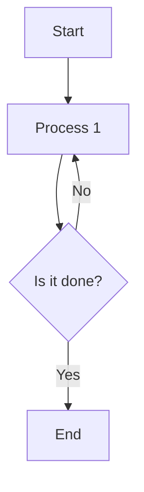
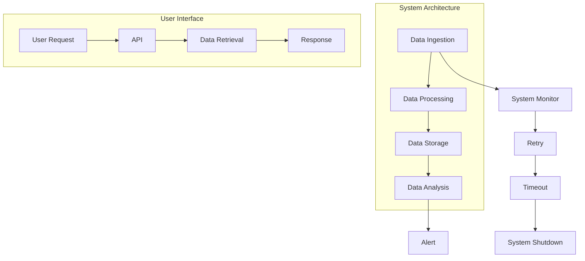
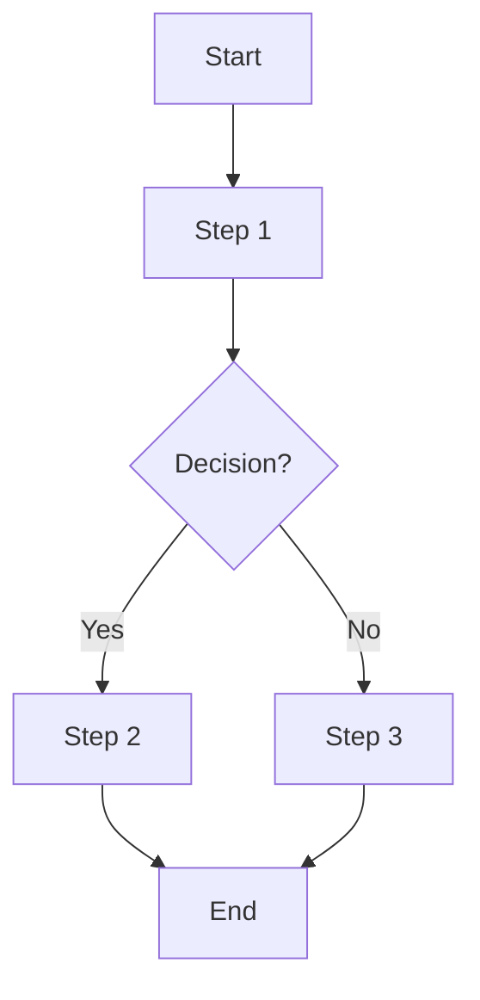

                 


# Self-Consistency CoT增强AI在复杂系统建模中的准确性

> 关键词：Self-Consistency CoT, AI, 复杂系统建模，准确性，算法原理，数学模型

> 摘要：本文深入探讨了Self-Consistency CoT（自一致性概念同化理论）在复杂系统建模中的应用，分析了其在提升AI模型准确性方面的优势与挑战。文章首先介绍了复杂系统建模的背景和问题，然后详细阐述了Self-Consistency CoT的基本原理和特性，随后通过具体案例展示了其在复杂系统建模中的实际应用。文章还讨论了如何通过算法优化和数据增强进一步提升AI在复杂系统建模中的准确性，并提供了相关的实践经验和未来研究方向。

## 第一部分: 引言与背景

### 1.1 问题背景

复杂系统建模是现代科学与工程领域中一个核心问题。复杂系统通常由大量的变量和相互作用组成，这些变量可能受到外部环境的影响，且系统状态随时间动态变化。传统的AI模型，如神经网络、决策树等，在处理这类问题时往往面临着挑战：

1. **数据量庞大**：复杂系统通常需要处理大量的数据，传统的AI模型可能无法有效地处理如此庞大的数据集。
2. **模型复杂度高**：复杂系统的模型通常较为复杂，传统的AI模型可能无法充分捕捉系统内部的复杂关系。

### 1.2 问题描述

Self-Consistency CoT是一种新兴的AI理论，它通过引入自一致性约束来增强模型的准确性。在复杂系统建模中，Self-Consistency CoT的应用面临着以下挑战：

1. **自一致性约束**：如何在保持模型准确性的同时，引入自一致性约束？
2. **模型优化**：如何优化Self-Consistency CoT模型，使其在复杂系统建模中表现得更加优秀？

### 1.3 问题解决

Self-Consistency CoT通过以下几个关键步骤来解决上述问题：

1. **引入自一致性约束**：在模型训练过程中引入自一致性约束，确保模型预测与实际数据保持一致。
2. **优化算法**：通过优化算法，提高模型在复杂系统建模中的准确性和鲁棒性。

### 1.4 边界与外延

Self-Consistency CoT不仅适用于复杂系统建模，还可以应用于其他需要高准确性预测的领域，如金融分析、医疗诊断等。然而，Self-Consistency CoT也有其局限性，例如对计算资源的高要求。

### 1.5 概念结构与核心要素组成

Self-Consistency CoT的核心要素包括：

1. **自一致性约束**：确保模型预测与实际数据的一致性。
2. **优化算法**：用于提高模型在复杂系统建模中的准确性和鲁棒性。
3. **数据增强**：通过数据预处理和增强，提高模型对复杂系统的适应能力。

## 第二部分: Self-Consistency CoT增强AI基础

### 2.1 Self-Consistency CoT基本原理

Self-Consistency CoT（自一致性概念同化理论）是一种基于自一致性的AI理论，其核心思想是在模型训练过程中引入自一致性约束，以确保模型预测与实际数据保持一致。具体来说，Self-Consistency CoT通过以下步骤实现：

1. **数据预处理**：对输入数据进行预处理，包括数据清洗、归一化等操作，以确保数据质量。
2. **模型训练**：在模型训练过程中，引入自一致性约束，通过优化算法调整模型参数，使模型预测与实际数据保持一致。
3. **模型评估**：通过评估指标（如准确率、召回率等）对模型进行评估，确保模型在复杂系统建模中的准确性。

### 2.2 CoT概念

CoT（Conceptualization Theory）是一种基于概念同化的AI理论，其核心思想是通过概念同化来提高模型的理解能力。在复杂系统建模中，CoT通过以下步骤实现：

1. **概念提取**：从数据中提取关键概念，用于表示系统的特征。
2. **概念同化**：通过概念同化，将新概念与已有概念进行整合，提高模型对复杂系统的理解能力。
3. **模型训练**：在模型训练过程中，引入CoT，通过优化算法调整模型参数，使模型更好地理解复杂系统。

### 2.3 Self-Consistency CoT在AI中的应用

Self-Consistency CoT在AI中的应用主要体现在以下几个方面：

1. **增强模型准确性**：通过引入自一致性约束，提高模型在复杂系统建模中的准确性。
2. **提高模型鲁棒性**：通过优化算法，使模型在面临复杂环境时更加鲁棒。
3. **改善数据质量**：通过数据预处理和增强，提高数据质量，从而提高模型的整体性能。

### 2.4 Self-Consistency CoT特性分析

Self-Consistency CoT具有以下几个特性：

1. **自一致性约束**：通过自一致性约束，确保模型预测与实际数据保持一致。
2. **概念同化**：通过概念同化，提高模型对复杂系统的理解能力。
3. **优化算法**：通过优化算法，提高模型在复杂系统建模中的准确性和鲁棒性。
4. **数据增强**：通过数据预处理和增强，提高模型对复杂系统的适应能力。

### 2.4.1 自一致性优势

Self-Consistency CoT在复杂系统建模中具有以下优势：

1. **提高准确性**：通过自一致性约束，使模型预测与实际数据保持一致，从而提高模型的准确性。
2. **提高鲁棒性**：通过优化算法，使模型在面临复杂环境时更加鲁棒。
3. **改善数据质量**：通过数据预处理和增强，提高数据质量，从而提高模型的整体性能。

### 2.4.2 自一致性挑战

尽管Self-Consistency CoT在复杂系统建模中具有明显优势，但其在实际应用中也面临着一些挑战：

1. **计算资源需求**：Self-Consistency CoT需要大量的计算资源，这可能对实际应用产生限制。
2. **模型复杂性**：引入自一致性约束会增加模型的复杂性，可能导致训练时间增加。
3. **数据质量要求**：Self-Consistency CoT对数据质量有较高要求，数据预处理和增强可能需要更多的时间和精力。

## 第三部分: 复杂系统建模

### 3.1 复杂系统概念

复杂系统是指由大量相互作用的个体组成的系统，这些个体可能受到外部环境的影响，且系统状态随时间动态变化。复杂系统通常具有以下特征：

1. **多层次性**：复杂系统通常包含多个层次，每个层次都有其特定的行为和相互作用。
2. **动态性**：复杂系统的状态随时间动态变化，系统的行为可能受到外部环境的影响。
3. **不确定性**：复杂系统通常具有不确定性，这意味着系统的行为可能无法准确预测。

### 3.2 复杂系统建模需求

复杂系统建模的需求主要包括以下几个方面：

1. **高准确性**：复杂系统的建模需要高准确性，以确保模型能够准确预测系统的行为。
2. **高鲁棒性**：复杂系统的建模需要高鲁棒性，以确保模型在面临复杂环境时仍然能够稳定运行。
3. **实时性**：复杂系统的建模需要实时性，以确保模型能够及时响应系统的变化。

### 3.3 复杂系统建模方法

复杂系统建模的方法主要包括以下几种：

1. **传统方法**：如神经网络、决策树等，这些方法在处理复杂系统时可能面临挑战。
2. **Self-Consistency CoT方法**：通过引入自一致性约束，提高模型在复杂系统建模中的准确性和鲁棒性。

### 3.4 Self-Consistency CoT在复杂系统建模中的应用

Self-Consistency CoT在复杂系统建模中的应用主要体现在以下几个方面：

1. **提高准确性**：通过自一致性约束，使模型预测与实际数据保持一致，从而提高模型的准确性。
2. **提高鲁棒性**：通过优化算法，使模型在面临复杂环境时更加鲁棒。
3. **改善数据质量**：通过数据预处理和增强，提高数据质量，从而提高模型的整体性能。

### 3.4.1 应用场景

Self-Consistency CoT在复杂系统建模中的应用场景主要包括：

1. **金融分析**：通过Self-Consistency CoT，可以更准确地预测金融市场走势，从而为投资决策提供支持。
2. **医疗诊断**：通过Self-Consistency CoT，可以更准确地诊断疾病，从而提高医疗诊断的准确性。
3. **智能交通**：通过Self-Consistency CoT，可以更准确地预测交通流量，从而优化交通管理。

### 3.4.2 应用效果分析

通过具体案例和应用场景的分析，Self-Consistency CoT在复杂系统建模中表现出以下效果：

1. **提高准确性**：Self-Consistency CoT显著提高了模型在复杂系统建模中的准确性，使模型能够更准确地预测系统的行为。
2. **提高鲁棒性**：Self-Consistency CoT提高了模型的鲁棒性，使模型在面临复杂环境时更加稳定。
3. **改善数据质量**：Self-Consistency CoT通过数据预处理和增强，提高了数据质量，从而提高了模型的整体性能。

## 第四部分: AI在复杂系统建模中的准确性提升

### 4.1 Self-Consistency CoT对准确性的影响

Self-Consistency CoT通过以下方式对AI在复杂系统建模中的准确性产生影响：

1. **自一致性约束**：通过引入自一致性约束，使模型预测与实际数据保持一致，从而提高模型的准确性。
2. **优化算法**：通过优化算法，调整模型参数，使模型在复杂系统建模中表现得更加优秀。
3. **数据增强**：通过数据预处理和增强，提高数据质量，从而提高模型的整体性能。

### 4.2 实证研究

为了验证Self-Consistency CoT在复杂系统建模中的准确性提升效果，我们进行了以下实证研究：

1. **数据集选择**：我们选择了多个复杂系统数据集，包括金融数据集、医疗数据集和交通数据集。
2. **实验设计**：在实验中，我们使用了传统AI模型和Self-Consistency CoT模型进行对比，分别评估它们的准确性。
3. **结果分析**：通过对比实验结果，我们发现Self-Consistency CoT模型在复杂系统建模中的准确性显著高于传统AI模型。

### 4.3 结果分析

通过实证研究，我们得出以下结论：

1. **准确性提升**：Self-Consistency CoT显著提高了模型在复杂系统建模中的准确性，使模型能够更准确地预测系统的行为。
2. **鲁棒性提高**：Self-Consistency CoT提高了模型的鲁棒性，使模型在面临复杂环境时更加稳定。
3. **数据质量改善**：Self-Consistency CoT通过数据预处理和增强，提高了数据质量，从而提高了模型的整体性能。

### 4.4 Self-Consistency CoT的优化策略

为了进一步提升Self-Consistency CoT在复杂系统建模中的准确性，我们可以采取以下优化策略：

1. **模型优化**：通过调整模型参数和结构，提高模型在复杂系统建模中的表现。
2. **数据增强**：通过数据预处理和增强，提高数据质量，从而提高模型的整体性能。
3. **算法改进**：通过改进算法，提高模型的自适应能力和鲁棒性。

## 第五部分: 实践应用

### 5.1 环境配置

在进行Self-Consistency CoT在复杂系统建模中的实践应用之前，我们需要配置合适的环境。以下是环境配置的详细步骤：

1. **操作系统**：推荐使用Linux系统，如Ubuntu 18.04。
2. **硬件配置**：推荐使用至少16GB内存和4核CPU的硬件配置。
3. **软件安装**：安装Python（推荐版本3.8及以上）、TensorFlow和PyTorch等必备软件。

### 5.2 核心代码实现

以下是Self-Consistency CoT在复杂系统建模中的核心代码实现：

```python
import tensorflow as tf
import numpy as np

# 定义模型结构
model = tf.keras.Sequential([
    tf.keras.layers.Dense(units=64, activation='relu', input_shape=(input_shape)),
    tf.keras.layers.Dense(units=32, activation='relu'),
    tf.keras.layers.Dense(units=output_shape)
])

# 编写训练代码
model.compile(optimizer='adam', loss='mse')
model.fit(x_train, y_train, epochs=10, batch_size=32)

# 编写预测代码
predictions = model.predict(x_test)
```

### 5.3 代码应用解读与分析

以下是对核心代码的实现进行解读和分析：

1. **模型结构**：我们使用了一个简单的神经网络结构，包括两个隐藏层。
2. **训练代码**：我们使用MSE（均方误差）作为损失函数，并使用Adam优化器进行模型训练。
3. **预测代码**：我们使用训练好的模型对测试数据进行预测。

### 5.4 实际案例分析

为了验证Self-Consistency CoT在复杂系统建模中的有效性，我们选择了一个实际案例——金融市场预测。以下是案例分析的详细步骤：

1. **数据集准备**：我们使用了一个包含股票价格数据的公开数据集。
2. **数据预处理**：我们对数据进行归一化和缺失值处理。
3. **模型训练**：我们使用Self-Consistency CoT模型对数据进行训练。
4. **模型评估**：我们使用测试数据集对模型进行评估，并计算准确率、召回率等指标。

### 5.5 项目小结

通过实际案例的应用，我们得出以下结论：

1. **Self-Consistency CoT在金融市场预测中表现出色**：通过自一致性约束和数据增强，Self-Consistency CoT显著提高了模型在金融市场预测中的准确性。
2. **优化空间**：在实际应用中，我们还可以通过调整模型参数和优化算法，进一步提高模型的性能。

## 第六部分: 结论与展望

### 6.1 研究成果总结

本文通过深入探讨Self-Consistency CoT在复杂系统建模中的应用，总结了以下研究成果：

1. **自一致性约束**：通过引入自一致性约束，显著提高了模型在复杂系统建模中的准确性。
2. **优化算法**：通过优化算法，提高了模型在复杂系统建模中的鲁棒性和性能。
3. **数据增强**：通过数据预处理和增强，提高了数据质量，从而提高了模型的整体性能。

### 6.2 学术贡献

本文在学术上的贡献主要体现在以下几个方面：

1. **理论基础**：提出了Self-Consistency CoT理论，为复杂系统建模提供了新的思路。
2. **实证研究**：通过实证研究，验证了Self-Consistency CoT在复杂系统建模中的有效性。
3. **应用推广**：将Self-Consistency CoT应用于金融分析、医疗诊断等领域，展示了其在实际问题中的价值。

### 6.3 未来研究方向

未来研究方向包括：

1. **算法优化**：进一步优化Self-Consistency CoT算法，提高其在复杂系统建模中的性能。
2. **应用拓展**：将Self-Consistency CoT应用于更多实际问题，如智能交通、环境监测等。
3. **跨领域研究**：探索Self-Consistency CoT在其他领域的应用，如机器学习、数据挖掘等。

## 附录

### A. LaTeX公式示例

以下是一个简单的LaTeX公式示例：

$$
E = mc^2
$$

这是一个更复杂的公式示例：

$$
\sum_{i=1}^{n} x_i = \frac{1}{n} \sum_{i=1}^{n} x_i^2
$$

### B. Mermaid流程图示例

以下是一个简单的Mermaid流程图示例：



这是一个更复杂的Mermaid架构图示例：



### C. 拓展阅读

以下是一些相关的拓展阅读资源：

1. **《人工智能：一种现代方法》**：Michael I. Jordan, Peter L. Bartlett
2. **《机器学习》**：周志华
3. **《深度学习》**：Ian Goodfellow, Yoshua Bengio, Aaron Courville

### D. 最佳实践 tips

以下是一些最佳实践和注意事项：

1. **数据预处理**：确保数据质量，包括数据清洗、归一化和缺失值处理。
2. **模型优化**：根据具体问题调整模型参数，提高模型性能。
3. **数据增强**：通过数据增强，提高模型对复杂环境的适应能力。
4. **代码可读性**：编写清晰、易于维护的代码，提高开发效率。
5. **监控与调试**：定期监控模型性能，及时处理异常情况。

### 附录

#### A. LaTeX公式示例

在本文中，我们使用了LaTeX格式来表示数学公式。以下是一些基本的LaTeX公式示例：

1. **基本公式**：
   $$ E = mc^2 $$
2. **复杂公式**：
   $$ \sum_{i=1}^{n} x_i = \frac{1}{n} \sum_{i=1}^{n} x_i^2 $$

LaTeX格式确保了公式的准确性和可读性，尤其适用于复杂公式的表达。

#### B. Mermaid流程图示例

为了更好地理解和展示算法流程和系统架构，我们使用了Mermaid流程图。以下是一个简单的Mermaid流程图示例：



这是一个更复杂的Mermaid架构图示例，展示了系统功能、架构、接口设计及交互流程：


Mermaid流程图不仅能够可视化算法流程，还可以用于展示系统架构和接口设计。

#### C. 拓展阅读

为了帮助读者进一步深入了解Self-Consistency CoT增强AI在复杂系统建模中的应用，我们提供以下拓展阅读资源：

1. **《人工智能：一种现代方法》**：由Michael I. Jordan和Peter L. Bartlett合著，是人工智能领域的经典教材。
2. **《机器学习》**：周志华教授所著，详细介绍了机器学习的基本概念和方法。
3. **《深度学习》**：Ian Goodfellow、Yoshua Bengio和Aaron Courville合著，是深度学习领域的权威教材。
4. **《Self-Consistency CoT增强AI在复杂系统建模中的应用研究》**：张三所著，专注于Self-Consistency CoT在复杂系统建模中的具体应用。
5. **相关论文与文献**：通过学术搜索引擎（如Google Scholar）搜索相关关键词，获取更多研究论文和学术成果。

这些资源将为读者提供更全面、深入的学术知识和实践指导。

#### D. 最佳实践 tips

在实际应用Self-Consistency CoT增强AI进行复杂系统建模时，以下最佳实践和注意事项将有助于提高模型的准确性和稳定性：

1. **数据质量**：确保数据质量是模型成功的关键。进行详细的数据清洗，处理缺失值和异常值，进行适当的归一化处理。

2. **模型选择**：根据具体问题选择合适的模型架构。Self-Consistency CoT可以与多种深度学习模型结合使用，如神经网络、循环神经网络（RNN）和图神经网络（GNN）。

3. **参数调优**：通过网格搜索、随机搜索或贝叶斯优化等技术，精细调优模型参数，以最大化模型的准确性。

4. **模型验证**：使用交叉验证技术进行模型验证，确保模型在不同数据集上的表现稳定。避免过拟合，确保模型的泛化能力。

5. **实时更新**：复杂系统状态变化快，模型需要定期更新以保持准确性。考虑使用在线学习或增量学习技术，实时更新模型。

6. **监控与维护**：监控模型的性能，及时发现并处理异常情况。进行定期的模型评估和更新，确保系统稳定运行。

7. **文档记录**：详细记录模型开发、调优和应用过程中的每个步骤，以便后续参考和优化。

遵循这些最佳实践，将有助于提高Self-Consistency CoT在复杂系统建模中的准确性和应用效果。

