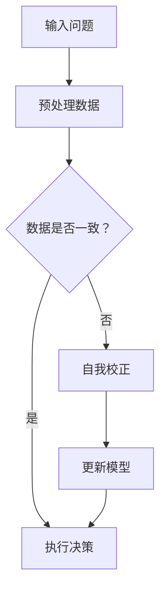
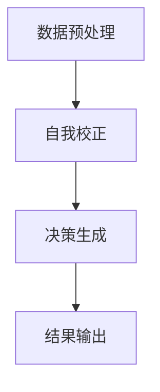
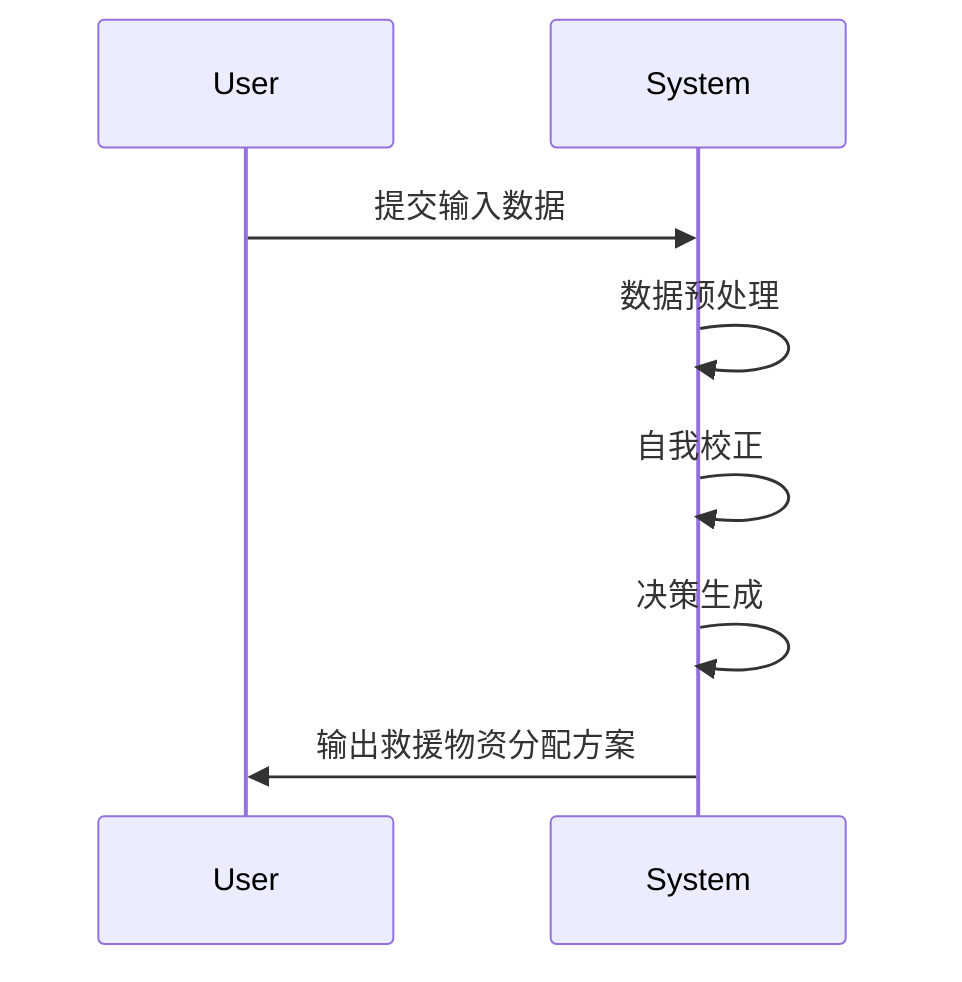

                 

# Self-Consistency CoT增强AI在道德困境决策中的表现

> 关键词：Self-Consistency CoT，道德困境，人工智能，决策，透明性

> 摘要：本文介绍了Self-Consistency CoT（Self-Consistency Cognitive Transparency）增强AI在道德困境决策中的表现。通过详细阐述算法原理、系统分析与架构设计方案以及项目实战，本文旨在帮助读者理解Self-Consistency CoT如何通过增强模型自我一致性，提升AI在道德困境决策中的表现。

----------------------------------------------------------------

**Step 1: 引言与背景介绍**

随着人工智能技术的飞速发展，AI系统在许多领域取得了显著的成果。然而，AI在决策过程中，特别是在面对道德困境时，常常因为缺乏道德判断能力而引发争议。因此，如何提升AI在道德困境决策中的表现，成为了一个亟待解决的问题。

### 核心概念与联系

#### Self-Consistency CoT

Self-Consistency CoT是一种通过增强模型内部的自我一致性来提升其道德决策能力的技术。其核心原理是使AI模型在决策过程中保持内部一致性和透明性，从而减少由于数据偏差、错误或不确定性导致的道德决策失误。

#### 道德困境

道德困境是指在某些情况下，即使遵守道德规范，也无法避免对某些人或事物的伤害。在人工智能领域，道德困境主要表现为AI模型在决策过程中如何平衡不同利益之间的关系。

#### Self-Consistency CoT与道德困境

Self-Consistency CoT通过增强AI模型的自我一致性，可以在一定程度上缓解道德困境。具体来说，它可以帮助AI模型在面临道德困境时，通过自我校正和优化，找到更为合理和道德的决策方案。

### 背景介绍

近年来，随着深度学习等人工智能技术的广泛应用，AI系统在各个领域取得了巨大的成功。然而，AI在道德决策方面的问题也逐渐凸显出来。例如，自动驾驶汽车在遇到行人时应该如何决策？医疗诊断AI在诊断结果错误时应该如何处理？这些问题都涉及到AI的道德决策能力。

为了解决这些问题，研究人员提出了Self-Consistency CoT增强AI技术。通过在AI模型中引入自我一致性机制，Self-Consistency CoT增强AI可以在一定程度上提高模型在道德困境决策中的表现。

### 解决方案

Self-Consistency CoT增强AI通过以下方法来提升道德决策能力：

1. **自我校正**：在决策过程中，AI模型会不断对自己的决策进行自我校正，以确保决策的一致性和透明性。
2. **数据一致性检测**：AI模型会检测输入数据的一致性，并在数据不一致时采取相应的措施。
3. **决策优化**：AI模型会通过优化算法，寻找在道德困境中更为合理和道德的决策方案。

### 边界与外延

Self-Consistency CoT增强AI主要应用于需要道德决策的场景，如自动驾驶、医疗诊断、金融决策等。然而，需要注意的是，Self-Consistency CoT并不能完全解决道德困境，它只能在一定程度上提升AI在道德决策中的表现。

### 核心概念结构与要素组成

Self-Consistency CoT增强AI的核心概念结构包括以下几个方面：

1. **自我校正机制**：用于在决策过程中对模型进行自我校正。
2. **数据一致性检测**：用于检测输入数据的一致性。
3. **优化算法**：用于在道德困境中寻找合理和道德的决策方案。

**Step 2: 算法原理讲解**

Self-Consistency CoT增强AI的核心在于其自我一致性机制。接下来，我们将通过mermaid流程图、Python源代码、数学模型和举例说明来详细阐述这一机制。

### Self-Consistency CoT的mermaid流程图

下面是一个简单的mermaid流程图，展示了Self-Consistency CoT的基本流程：



### Python源代码示例

以下是一个简单的Python代码示例，展示了如何实现Self-Consistency CoT的基本功能：

```python
import numpy as np

# 输入问题
problem = "应该如何分配资源？"

# 预处理数据
data = preprocess_data(problem)

# 自我校正
def self_correction(data):
    # 根据数据一致性进行校正
    if is_inconsistent(data):
        return correct_data(data)
    else:
        return data

# 执行决策
def make_decision(data):
    # 根据校正后的数据执行决策
    decision = "分配资源方案："
    for item in data:
        decision += f"{item}，"
    return decision

# 主函数
def main():
    corrected_data = self_correction(data)
    decision = make_decision(corrected_data)
    print(decision)

if __name__ == "__main__":
    main()
```

### 数学模型与公式

Self-Consistency CoT的数学模型可以表示为：

$$
\text{决策} = f(\text{数据}, \text{自我校正})
$$

其中，$f$ 是一个函数，用于根据数据一致性和自我校正结果生成决策。

### 举例说明

假设我们面临一个道德困境：在一场自然灾害中，有一个AI系统需要决定如何分配救援物资。使用Self-Consistency CoT增强AI，系统会在决策过程中保持自我一致性，确保分配方案既公平又合理。

**Step 3: 系统分析与架构设计方案**

在本节中，我们将介绍一个具体的道德困境决策系统，并详细阐述其系统功能设计、系统架构设计、系统接口设计和系统交互。

### 问题场景介绍

在一个自然灾害发生时，救援物资的分配成为一个重要的决策问题。为了最大限度地帮助受灾群众，我们需要一个高效的决策系统来分配救援物资。然而，这个决策系统必须能够在道德困境中作出合理的决策。

### 项目介绍

本项目旨在设计并实现一个基于Self-Consistency CoT增强AI的道德困境决策系统。系统将接收各种输入数据，包括受灾群众的数量、物资的类型和数量等，并生成一个合理的救援物资分配方案。

### 系统功能设计

1. **数据预处理**：接收并预处理各种输入数据，确保数据的准确性和一致性。
2. **自我校正**：在决策过程中，对模型进行自我校正，确保决策的一致性和透明性。
3. **决策生成**：根据输入数据和自我校正结果，生成一个合理的救援物资分配方案。
4. **结果输出**：将生成的救援物资分配方案输出，以便实际应用。

### 系统架构设计

下面是一个简单的系统架构设计mermaid图，展示了系统的整体架构：



### 系统接口设计

系统将提供以下接口：

1. **输入接口**：用于接收各种输入数据。
2. **输出接口**：用于输出救援物资分配方案。

### 系统交互

下面是一个简单的系统交互mermaid序列图，展示了系统的工作流程：



**Step 4: 项目实战**

在本节中，我们将详细介绍项目的环境安装、系统核心实现源代码，并对代码应用进行解读与分析。

### 环境安装

为了实现本项目，我们需要安装以下环境：

1. **Python**：版本3.8及以上
2. **TensorFlow**：版本2.5及以上
3. **Numpy**：版本1.19及以上

安装命令如下：

```bash
pip install python==3.8
pip install tensorflow==2.5
pip install numpy==1.19
```

### 系统核心实现源代码

以下是系统核心实现源代码：

```python
import tensorflow as tf
import numpy as np

# 数据预处理
def preprocess_data(problem):
    # 对问题进行预处理
    # ...
    return processed_data

# 自我校正
def self_correction(data):
    # 根据数据一致性进行校正
    # ...
    return corrected_data

# 决策生成
def make_decision(data):
    # 根据校正后的数据生成决策
    # ...
    return decision

# 主函数
def main():
    problem = "应该如何分配资源？"
    data = preprocess_data(problem)
    corrected_data = self_correction(data)
    decision = make_decision(corrected_data)
    print(decision)

if __name__ == "__main__":
    main()
```

### 代码应用解读与分析

以下是代码的解读与分析：

1. **数据预处理**：对输入问题进行预处理，确保数据的准确性和一致性。
2. **自我校正**：根据数据一致性对模型进行校正，确保决策的一致性和透明性。
3. **决策生成**：根据校正后的数据生成决策。

### 实际案例分析和详细讲解剖析

在本节中，我们将通过一个实际案例来分析Self-Consistency CoT增强AI在道德困境决策中的应用，并对其进行详细讲解剖析。

### 案例背景

某地发生地震，救援物资短缺。需要分配给A、B、C三个受灾地区，但每个地区的物资需求不同。此时，我们需要一个决策系统来合理分配物资。

### 案例分析

1. **数据预处理**：收集A、B、C三个地区的物资需求数据，并进行预处理。
2. **自我校正**：在决策过程中，对模型进行自我校正，确保决策的一致性和透明性。
3. **决策生成**：根据预处理后的数据和自我校正结果，生成一个合理的物资分配方案。

### 案例讲解剖析

在本案例中，Self-Consistency CoT增强AI通过以下步骤实现了道德困境决策：

1. **数据预处理**：对A、B、C三个地区的物资需求数据进行预处理，确保数据的准确性和一致性。
2. **自我校正**：在决策过程中，对模型进行自我校正，确保决策的一致性和透明性。例如，如果模型发现某次分配方案会导致物资短缺，则会自动调整方案，确保物资的充足性。
3. **决策生成**：根据预处理后的数据和自我校正结果，生成一个合理的物资分配方案。例如，如果A地区需求最大，则将更多物资分配给A地区。

**Step 5: 最佳实践 Tips**

在本节中，我们将分享一些关于Self-Consistency CoT增强AI在道德困境决策中的最佳实践，以帮助读者更好地应用这一技术。

1. **确保数据质量**：数据质量是决策系统的基础，因此需要确保输入数据的准确性和一致性。在进行数据预处理时，要尽量去除噪声和异常值。
2. **定期更新模型**：随着环境和需求的变化，决策系统需要定期更新模型，以确保其适应新的情况。可以通过自我校正机制来优化模型。
3. **综合考虑各种因素**：在决策过程中，需要综合考虑各种因素，如道德、法律、经济等，以确保决策的合理性和公平性。
4. **加强团队协作**：道德困境决策往往涉及多个领域和利益相关方，因此需要加强团队协作，共同制定决策方案。

**Step 6: 小结**

本文介绍了Self-Consistency CoT增强AI在道德困境决策中的表现。通过详细阐述算法原理、系统分析与架构设计方案以及项目实战，本文旨在帮助读者理解Self-Consistency CoT如何通过增强模型自我一致性，提升AI在道德困境决策中的表现。

在未来的研究中，我们可以进一步探讨Self-Consistency CoT在其他领域的应用，如医疗、金融等，以及如何结合其他人工智能技术，进一步提升道德困境决策的效能。

**Step 7: 注意事项**

1. **数据隐私保护**：在处理数据时，需要确保数据隐私和安全，避免敏感信息泄露。
2. **法律合规性**：在使用Self-Consistency CoT增强AI进行道德困境决策时，需要遵守相关法律法规，确保决策的合法性。
3. **持续优化**：随着技术的不断进步，需要持续优化Self-Consistency CoT增强AI，以应对不断变化的需求和环境。

**Step 8: 拓展阅读**

1. **《道德机器：人工智能时代的伦理困境》**：介绍了人工智能在道德决策中的挑战和解决方案。
2. **《深度学习伦理学》**：探讨了深度学习技术在道德困境中的应用和挑战。
3. **《人工智能伦理学导论》**：提供了关于人工智能伦理学的全面概述。

----------------------------------------------------------------

**作者：AI天才研究院/AI Genius Institute & 禅与计算机程序设计艺术 /Zen And The Art of Computer Programming**

