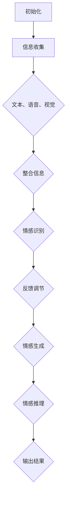
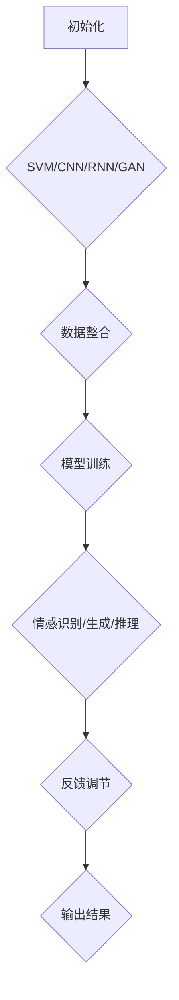
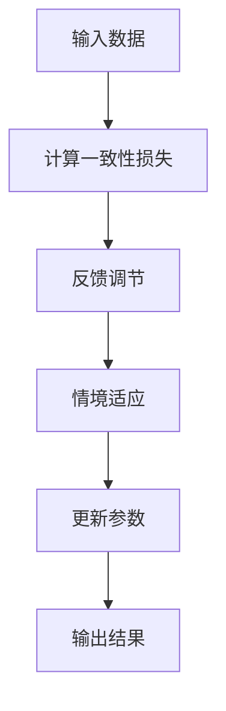
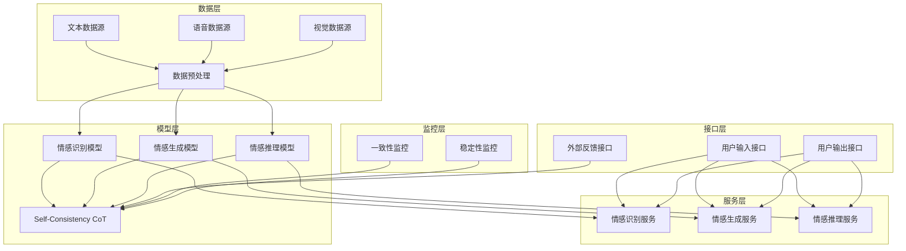
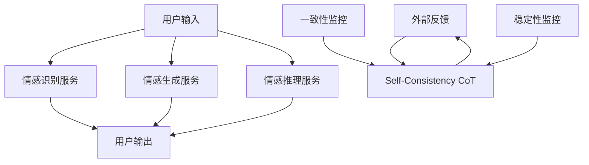

                 

### 自我一致性协同论（Self-Consistency CoT）概述

自我一致性协同论（Self-Consistency Cognitive Theory，简称CoT）是一种旨在提高人工智能（AI）模型稳定性和一致性的理论框架。该理论的核心思想是，通过确保模型内部信息的一致性，来减少预测偏差和错误。自我一致性协同论不仅关注模型与外部环境的交互，也关注模型内部各个组件之间的协调。

#### Self-Consistency CoT的概念

Self-Consistency CoT的基本概念可以概括为以下三点：

1. **内部一致性**：模型内部的所有信息应该相互协调一致，避免出现相互矛盾的情况。
2. **外部一致性**：模型对外部环境的预测或判断应当与外部实际情况保持一致。
3. **动态一致性**：模型在处理不同情境或数据时，应保持其内部一致性。

#### Self-Consistency CoT的发展历程

Self-Consistency CoT的发展历程可以分为以下几个阶段：

1. **初期探索**：20世纪80年代，一些学者开始探索如何通过提高模型内部信息的一致性来改进AI模型的性能。
2. **理论框架构建**：90年代，Self-Consistency CoT的基本理论框架逐渐成型，研究者们开始系统地研究如何将这一理念应用于不同的AI模型。
3. **应用推广**：21世纪初，随着AI技术的快速发展，Self-Consistency CoT逐渐在多种AI应用中得到了验证和推广，例如在情感计算、自然语言处理等领域。

#### Self-Consistency CoT的关键原理

Self-Consistency CoT的关键原理包括以下几点：

1. **信息整合**：通过整合来自不同来源的信息，确保模型内部的信息一致性。
2. **反馈调节**：利用模型输出的反馈来调节内部状态，以维持一致性。
3. **情境适应**：模型能够根据不同情境调整其内部一致性策略，以提高在不同情境下的表现。

综上所述，Self-Consistency CoT为提高AI模型的稳定性和一致性提供了有力的理论支持。在接下来的章节中，我们将进一步探讨AI情感计算的基本概念和Self-Consistency CoT在这一领域的应用。通过这些讨论，我们将更好地理解这一理论在实际应用中的重要性。### AI情感计算基础

AI情感计算是人工智能领域的一个重要分支，它旨在模拟人类情感，使计算机能够理解和处理情感信息。这一技术的核心在于使机器能够识别、生成和推理情感，从而实现更自然的人机交互和更有效的信息处理。

#### 情感计算的定义与重要性

情感计算（Affective Computing）是指使计算机具备感知、理解、表达和模拟人类情感的能力。它不仅包括对人类情感的识别，还包括对情感的生成和推理。情感计算的重要性体现在以下几个方面：

1. **人机交互**：通过理解用户的情感状态，情感计算能够提供更自然、更人性化的交互体验。
2. **信息处理**：情感计算能够帮助计算机更好地理解用户的情感需求，从而更有效地处理信息。
3. **心理健康**：在医疗领域，情感计算可以帮助诊断和治疗心理疾病，如抑郁症和焦虑症。
4. **商业应用**：在市场营销和客户服务领域，情感计算可以帮助企业更好地了解消费者情感，提高服务质量。

#### AI情感计算的技术框架

AI情感计算的技术框架主要包括以下几个关键组成部分：

1. **情感识别**：通过分析用户的行为、语音、文本等数据，识别用户的情感状态。常见的情感识别方法包括基于视觉的、听觉的和文本的情感识别。
2. **情感生成**：根据用户的情感状态，生成相应的情感反应，如表情、声音等。情感生成需要结合语音合成和自然语言处理技术。
3. **情感推理**：通过对用户情感状态的推理，预测用户的行为和反应。情感推理可以帮助计算机更好地理解用户的需求和意图。

#### AI情感计算的应用领域

AI情感计算在多个领域有着广泛的应用，包括但不限于：

1. **社交机器人**：社交机器人能够通过情感计算与用户进行自然、流畅的对话，提供个性化的服务。
2. **智能客服**：智能客服系统能够识别用户的情感状态，提供更有针对性的帮助，提高用户满意度。
3. **教育**：在教育领域，情感计算可以帮助教师更好地了解学生的情感状态，提供更有针对性的教学。
4. **心理健康**：在心理健康领域，情感计算可以帮助诊断和治疗心理疾病，如通过分析患者的情绪变化来监测抑郁症状。
5. **医疗**：在医疗领域，情感计算可以帮助医生更好地了解患者的情绪状态，从而提供更个性化的治疗方案。

总的来说，AI情感计算作为一种新兴技术，正在逐步改变我们与计算机的互动方式。通过理解和模拟人类情感，它为我们提供了更高效、更智能的计算机系统。在接下来的章节中，我们将探讨自我一致性协同论（Self-Consistency CoT）在AI情感计算中的应用，进一步理解这一理论的实践意义。### Self-Consistency CoT与AI情感计算的结合

自我一致性协同论（Self-Consistency CoT）在AI情感计算中的应用，为提高模型的一致性和稳定性提供了新的思路。结合两者，可以有效地提升情感计算的准确性和可靠性。

#### Self-Consistency CoT在情感计算中的应用

Self-Consistency CoT在情感计算中的应用主要体现在以下几个方面：

1. **情感识别**：在情感识别过程中，Self-Consistency CoT可以帮助模型保持内部信息的一致性，减少误识率。例如，在分析用户的语音或文本时，模型会根据上下文信息进行自我调整，以确保情感判断的一致性。
   
2. **情感生成**：在情感生成过程中，Self-Consistency CoT可以确保模型生成情感反应与用户的实际情感状态保持一致。例如，在生成语音或文本时，模型会根据用户情感状态的反馈进行动态调整，以生成更符合用户情感状态的反应。

3. **情感推理**：在情感推理过程中，Self-Consistency CoT可以帮助模型更好地理解用户的情感需求和意图。例如，通过分析用户的历史情感数据和行为模式，模型可以更准确地预测用户的未来情感状态，从而提供更个性化的服务。

#### 结合案例分析

为了更好地理解Self-Consistency CoT在AI情感计算中的应用，我们可以通过一个案例分析来探讨：

**案例**：智能客服系统

在这个案例中，我们假设有一个智能客服系统，它需要根据用户的情感状态提供相应的回答。如果没有应用Self-Consistency CoT，当用户表达愤怒时，系统可能会错误地将用户的情感状态判断为悲伤，从而提供不恰当的回答。然而，通过应用Self-Consistency CoT，系统可以在情感识别、情感生成和情感推理过程中保持内部信息的一致性，从而提高情感计算的准确性和可靠性。

1. **情感识别**：系统会分析用户的语音或文本，识别出用户情感状态的明显特征。在这个过程中，Self-Consistency CoT会确保模型内部信息的一致性，避免出现误识。

2. **情感生成**：系统根据用户情感状态的识别结果，生成相应的回答。在这里，Self-Consistency CoT会确保生成的回答与用户的实际情感状态保持一致，避免产生冲突或不恰当的回答。

3. **情感推理**：系统会根据用户的情感状态和历史行为模式，推理出用户的意图和需求。在这个过程中，Self-Consistency CoT会帮助系统更好地理解用户的情感需求，从而提供更个性化的服务。

#### 未来发展趋势

随着AI技术的不断进步，Self-Consistency CoT在AI情感计算中的应用前景十分广阔。未来，我们可以期待以下几个发展趋势：

1. **多模态情感计算**：通过结合多种传感器和数据分析技术，实现更全面、更精准的情感计算。

2. **情感计算应用领域的扩展**：情感计算的应用将不仅限于社交机器人、智能客服和心理健康等领域，还将扩展到教育、医疗、商业等多个领域。

3. **自我优化和自适应**：通过不断学习和自我调整，Self-Consistency CoT将能够更好地适应不同应用场景，提供更高质量的情感计算服务。

总之，Self-Consistency CoT在AI情感计算中的应用，为提升模型的一致性和稳定性提供了有力支持。通过结合实际案例和未来发展趋势的探讨，我们可以看到这一理论在实际应用中的重要性和潜力。在接下来的章节中，我们将进一步深入探讨Self-Consistency CoT与AI情感计算的结合原理，以及相关的算法实现和数学模型。### Self-Consistency CoT的属性特征

在理解Self-Consistency CoT（自我一致性协同论）的基本概念之后，接下来我们将详细探讨其属性特征。这些特征不仅帮助我们更全面地理解这一理论，也为在实际应用中提供指导和参考。

#### 内部一致性

内部一致性是Self-Consistency CoT的核心特征之一。它要求AI模型在处理信息时，确保其内部各个部分的信息相互协调和一致，避免出现矛盾或冲突。具体来说，这包括以下几个方面：

1. **信息整合**：在模型内部，不同来源的信息（如感知数据、历史数据、外部反馈等）需要通过某种机制进行整合，以确保它们之间的一致性。
   
2. **自我调整**：模型应具备自我调整的能力，当检测到内部信息不一致时，能够自动调整内部状态以恢复一致性。

3. **信息冗余**：为了增强内部一致性，模型可以采用一定的信息冗余策略，即在处理信息时保留额外的冗余信息，以便在需要时进行校验和调整。

#### 外部一致性

外部一致性是指模型对外部环境的预测或判断应与实际情况保持一致。在AI应用中，外部一致性至关重要，因为它直接影响模型的可信度和有效性。为了实现外部一致性，模型应具备以下特征：

1. **环境感知**：模型应能够准确感知外部环境的变化，并根据这些变化调整其内部状态和行为。

2. **反馈机制**：模型应具备反馈机制，通过实时接收外部环境的反馈，调整其预测和行为，确保外部一致性。

3. **自适应能力**：模型应具备较强的自适应能力，能够根据外部环境的反馈，动态调整其内部机制，以维持外部一致性。

#### 动态一致性

动态一致性强调模型在处理不同情境或数据时，应保持其内部和外部的一致性。这一特征对于模型在不同应用场景中的稳定性至关重要。动态一致性的实现包括：

1. **情境感知**：模型应能够根据不同的情境调整其行为和内部一致性策略，以适应新的情境。

2. **状态转移**：模型在不同情境之间进行状态转移时，应确保状态转移的一致性，避免出现不一致的状态。

3. **实时调整**：模型应具备实时调整的能力，能够在处理过程中根据实时反馈动态调整内部状态，以保持动态一致性。

#### 自我一致性协同论的属性特征对比表格

为了更直观地理解Self-Consistency CoT的属性特征，我们可以通过一个对比表格来展示其与其他相关概念的差异。

| 特征           | Self-Consistency CoT | 相关概念1 | 相关概念2 |
|----------------|----------------------|-----------|-----------|
| 内部一致性     | 保持模型内部信息一致 | 信息整合  | 信息一致  |
| 外部一致性     | 与外部环境保持一致   | 预测准确  | 环境适应  |
| 动态一致性     | 处理不同情境的一致性 | 情境感知  | 状态转移  |

#### ER实体关系图架构

为了更清晰地描述Self-Consistency CoT的属性特征，我们可以使用ER（Entity-Relationship，实体-关系）图来表示其内部结构。ER图是一种用于描述实体之间关系的图形化方法，可以帮助我们理解Self-Consistency CoT的组成部分及其相互关系。

以下是Self-Consistency CoT的ER图示例：

```mermaid
erDiagram
  Entity: 模型
  Entity: 信息源
  Entity: 外部环境
  Entity: 反馈机制
  
  Model ||--|{ 信息源 } InformationSource
  Model ||--|{ 外部环境 } ExternalEnvironment
  Model ||--|{ 反馈机制 } FeedbackMechanism
  Model ||--|{ 内部一致性 } InternalConsistency
  Model ||--|{ 外部一致性 } ExternalConsistency
  Model ||--|{ 动态一致性 } DynamicConsistency
```

在这个ER图中，"模型"是核心实体，它与其他实体（信息源、外部环境、反馈机制、内部一致性、外部一致性和动态一致性）通过关系线相连。这些关系线描述了模型内部的各个组成部分及其相互关系。

通过上述讨论和ER图示例，我们可以更深入地理解Self-Consistency CoT的属性特征，为后续的算法原理讲解和数学模型分析打下坚实基础。在接下来的章节中，我们将进一步探讨Self-Consistency CoT在AI情感计算中的应用，以及相关的算法实现和数学模型。### AI情感计算的基本概念

AI情感计算是人工智能领域的一个重要分支，它致力于使计算机能够感知、理解和模拟人类情感。为了深入理解AI情感计算，我们需要首先了解其基本概念，包括情感识别、情感生成和情感推理。

#### 情感识别

情感识别（Affective Recognition）是指通过分析用户的行为、语音、文本等数据，识别出用户的情感状态。情感识别的关键在于准确地捕捉和解读情感信号，这些信号可以是显性的，如面部表情、语音语调；也可以是隐性的，如生理指标、行为模式。

1. **基于视觉的情感识别**：通过分析用户的面部表情，如眼动、嘴角、眉毛等，识别用户的情感状态。常见的方法包括面部识别技术和情感分类算法。

2. **基于听觉的情感识别**：通过分析用户的语音语调，如音调、音速、音量等，识别用户的情感状态。语音识别技术在这一领域有着广泛的应用。

3. **基于文本的情感识别**：通过分析用户的文本输入，如聊天记录、社交媒体帖子等，识别用户的情感状态。自然语言处理技术在这一过程中发挥了关键作用。

#### 情感生成

情感生成（Affective Generation）是指根据用户的情感状态，生成相应的情感反应，如表情、声音、文字等。情感生成的目标是通过计算机模拟出人类情感的表达，使计算机能够更好地与用户进行互动。

1. **基于语音的情感生成**：通过语音合成技术，根据用户的情感状态生成相应的声音。语音合成技术需要结合语音识别和情感识别的结果，以生成符合用户情感状态的声音。

2. **基于文本的情感生成**：通过自然语言生成技术，根据用户的情感状态生成相应的文字。自然语言生成技术包括文本摘要、文本生成和文本风格转换等。

3. **基于图像的情感生成**：通过计算机视觉技术，根据用户的情感状态生成相应的图像。图像生成技术包括生成对抗网络（GAN）和变分自编码器（VAE）等。

#### 情感推理

情感推理（Affective Reasoning）是指根据用户的历史情感数据和行为模式，推理出用户的当前情感状态或未来情感趋势。情感推理的目标是使计算机能够更好地理解用户的情感需求，提供更个性化的服务。

1. **基于历史数据的情感推理**：通过分析用户的历史情感数据，如过去的行为、对话记录等，推理出用户的当前情感状态。这种方法需要结合机器学习和数据挖掘技术。

2. **基于行为模式的情感推理**：通过分析用户的行为模式，如点击行为、浏览习惯等，推理出用户的情感状态。行为分析技术在这一过程中发挥了重要作用。

3. **基于上下文的情感推理**：通过分析用户当前的环境和情境，推理出用户的情感状态。上下文推理技术需要结合自然语言处理和情境感知技术。

通过了解AI情感计算的基本概念，我们可以更好地理解其应用场景和技术实现。在接下来的章节中，我们将探讨Self-Consistency CoT（自我一致性协同论）在AI情感计算中的应用，以及相关的算法实现和数学模型。这将帮助我们深入理解如何通过自我一致性协同论提高AI情感计算的稳定性和准确性。### Self-Consistency CoT与AI情感计算的联系

Self-Consistency CoT（自我一致性协同论）与AI情感计算之间的联系紧密而深刻。在AI情感计算中，模型需要处理大量复杂的情感数据，并做出准确的情感判断。而Self-Consistency CoT提供了一套理论框架，帮助这些模型保持内部信息的一致性，从而提高情感计算的性能和可靠性。

#### Self-Consistency CoT在情感计算中的作用

Self-Consistency CoT在情感计算中主要发挥着以下几个作用：

1. **提高情感识别的准确性**：通过确保模型内部信息的一致性，Self-Consistency CoT有助于减少情感识别中的错误。例如，在基于文本的情感识别中，模型需要同时分析词汇、语法和上下文。如果这些信息之间不一致，可能会导致错误的情感判断。

2. **增强情感生成的连贯性**：在情感生成过程中，模型需要根据用户的情感状态生成相应的情感反应。通过应用Self-Consistency CoT，模型可以在情感生成过程中保持内部状态的一致性，从而生成更连贯、更自然的情感反应。

3. **提升情感推理的可靠性**：在情感推理中，模型需要根据用户的历史数据和行为模式，推理出用户的当前情感状态。Self-Consistency CoT可以帮助模型在处理不同数据源时保持内部一致性，从而提高推理的准确性。

#### 自我一致性协同论的理论框架在AI情感计算中的应用

Self-Consistency CoT的理论框架在AI情感计算中的应用主要体现在以下几个方面：

1. **信息整合**：在情感计算过程中，模型需要整合来自不同来源的信息，如文本、语音、视觉等。Self-Consistency CoT通过信息整合机制，确保这些信息在模型内部保持一致，避免出现信息冲突。

2. **反馈调节**：通过实时接收外部环境的反馈，模型可以不断调整其内部状态，以保持一致性。在情感计算中，反馈调节尤为重要，因为它可以帮助模型适应不同的情感场景，提高情感判断的准确性。

3. **情境适应**：Self-Consistency CoT强调模型在处理不同情境时应保持内部一致性。在情感计算中，情境适应意味着模型需要根据不同的用户情境（如聊天、购物、医疗咨询等）调整其情感计算策略，以提供更个性化的服务。

#### 实际应用中的效果

在实际应用中，Self-Consistency CoT已经展示了其在提升AI情感计算性能方面的显著效果。以下是一些具体的应用案例：

1. **智能客服系统**：在智能客服系统中，Self-Consistency CoT可以确保模型在处理用户问题时，生成连贯、自然的回答。例如，当用户表达愤怒时，模型会根据用户的历史情感数据和实时反馈，生成相应的安抚性回答。

2. **情感分析平台**：在情感分析平台中，Self-Consistency CoT可以帮助模型更准确地识别和分类用户的情感状态，从而提供更深入的市场洞察和用户需求分析。

3. **心理健康应用**：在心理健康应用中，Self-Consistency CoT可以辅助医生和患者进行情感交流和诊断。例如，通过分析患者的语音和文本记录，模型可以识别出患者的情绪变化，帮助医生制定更有效的治疗方案。

总之，Self-Consistency CoT与AI情感计算之间的联系不仅在于理论上的框架，更在于其在实际应用中的效果。通过应用Self-Consistency CoT，AI情感计算模型可以更准确地识别情感、更自然地生成情感反应，并提供更个性化的服务。在接下来的章节中，我们将深入探讨Self-Consistency CoT在AI情感计算中的应用，包括算法实现、数学模型和系统架构设计。这将帮助我们更全面地理解这一理论的实践价值。### ER实体关系图架构

为了更好地理解Self-Consistency CoT（自我一致性协同论）与AI情感计算的结合，我们可以通过ER（Entity-Relationship，实体-关系）图来描述两者之间的交互和关系。ER图是一种用于表示实体之间关系的图形化方法，可以帮助我们清晰地展示系统的结构和各个组成部分之间的关系。

以下是Self-Consistency CoT与AI情感计算的ER实体关系图示例：

```mermaid
erDiagram
  Entity: 情感计算系统
  Entity: Self-Consistency CoT
  Entity: 数据源
  Entity: 情感识别模块
  Entity: 情感生成模块
  Entity: 情感推理模块
  
  情感计算系统 ||--|{ Self-Consistency CoT } SelfConsistencyCoT
  情感计算系统 ||--|{ 数据源 } DataSource
  情感计算系统 ||--|{ 情感识别模块 } AffectiveRecognitionModule
  情感计算系统 ||--|{ 情感生成模块 } AffectiveGenerationModule
  情感计算系统 ||--|{ 情感推理模块 } AffectiveReasoningModule
  
  Self-Consistency CoT ||--|{ 数据源 } DataSource
  Self-Consistency CoT ||--|{ 情感识别模块 } AffectiveRecognitionModule
  Self-Consistency CoT ||--|{ 情感生成模块 } AffectiveGenerationModule
  Self-Consistency CoT ||--|{ 情感推理模块 } AffectiveReasoningModule
  
  数据源 ||--|{ 情感识别模块 } AffectiveRecognitionModule
  数据源 ||--|{ 情感生成模块 } AffectiveGenerationModule
  数据源 ||--|{ 情感推理模块 } AffectiveReasoningModule
  
  情感识别模块 ||--|{ 情感生成模块 } AffectiveGenerationModule
  情感识别模块 ||--|{ 情感推理模块 } AffectiveReasoningModule
  
  情感生成模块 ||--|{ 情感推理模块 } AffectiveReasoningModule
```

在这个ER图中，"情感计算系统"是核心实体，它通过关系线与Self-Consistency CoT、数据源、情感识别模块、情感生成模块和情感推理模块相连。每个模块都扮演着特定的角色，并与系统中的其他模块进行交互：

1. **情感计算系统**：作为整体，负责协调和管理各个模块，确保系统运行顺畅。
2. **Self-Consistency CoT**：通过信息整合、反馈调节和情境适应，确保系统内部信息的一致性，并与各个模块进行交互，以提升系统的整体性能。
3. **数据源**：提供各种情感相关的数据，如文本、语音、视觉等，为各个模块提供输入。
4. **情感识别模块**：负责分析用户输入的数据，识别出用户的情感状态。
5. **情感生成模块**：根据识别出的情感状态，生成相应的情感反应，如文本、声音、图像等。
6. **情感推理模块**：通过分析用户的历史情感数据和行为模式，推理出用户的当前和未来情感状态。

通过ER实体关系图，我们可以更直观地理解Self-Consistency CoT与AI情感计算之间的结合，以及各个模块在系统中的作用和相互关系。在接下来的章节中，我们将进一步探讨Self-Consistency CoT在AI情感计算中的具体应用，包括算法实现和数学模型。这将为我们在实际应用中提高情感计算的稳定性和准确性提供理论支持和实践指导。### Self-Consistency CoT的算法原理

Self-Consistency CoT（自我一致性协同论）的算法原理是其核心思想在具体实现中的体现。该算法通过一系列的步骤来确保AI模型在处理情感数据时保持内部一致性，从而提高模型的稳定性和可靠性。以下是Self-Consistency CoT算法的基本原理和步骤。

#### 算法框架

Self-Consistency CoT算法框架主要包括以下几个关键步骤：

1. **信息收集**：从各种数据源收集情感相关数据，如文本、语音、视觉等。
2. **信息整合**：将来自不同数据源的信息进行整合，确保它们在模型内部保持一致性。
3. **情感识别**：利用整合后的信息，识别用户的情感状态。
4. **反馈调节**：根据情感识别的结果和外部环境的反馈，调整模型内部状态，以维持一致性。
5. **情感生成**：根据用户情感状态生成相应的情感反应，如文本、声音、图像等。
6. **情感推理**：通过分析历史情感数据和用户行为模式，推理出用户的当前和未来情感状态。

#### 算法步骤

以下是对Self-Consistency CoT算法步骤的详细描述：

1. **初始化**：设置模型初始状态，包括内部参数和状态变量。

2. **信息收集**：
   - 从文本数据源收集用户的文本输入。
   - 从语音数据源收集用户的语音数据。
   - 从视觉数据源收集用户的面部表情和身体语言。

3. **信息整合**：
   - 使用自然语言处理（NLP）技术对文本进行情感分析，提取情感关键词和情感极性。
   - 使用语音识别技术对语音数据进行分析，提取语音特征，如音调、音速、音量等。
   - 使用计算机视觉技术对视觉数据进行分析，提取面部表情和身体语言特征。

4. **情感识别**：
   - 将文本、语音和视觉数据整合，综合分析以识别用户的情感状态。
   - 使用情感分类算法，如SVM、CNN等，对整合后的数据进行情感分类，得到情感标签。

5. **反馈调节**：
   - 根据情感识别结果和外部环境的反馈，调整模型内部状态。
   - 如果检测到内部状态不一致，通过调整参数和状态变量来恢复一致性。

6. **情感生成**：
   - 根据用户的情感状态，生成相应的情感反应。
   - 使用语音合成技术生成情感语音。
   - 使用自然语言生成技术生成情感文本。
   - 使用图像生成技术生成情感图像。

7. **情感推理**：
   - 通过分析用户的历史情感数据和行为模式，推理出用户的当前和未来情感状态。
   - 使用机器学习技术，如决策树、神经网络等，建立情感状态与行为模式之间的关联。

#### 算法流程图

为了更直观地理解Self-Consistency CoT算法的流程，我们可以使用mermaid绘制算法流程图：



在这个算法流程图中，每个节点表示算法的一个步骤，箭头表示步骤之间的顺序和依赖关系。通过这个流程图，我们可以清晰地看到算法的运行逻辑和各个环节之间的联系。

综上所述，Self-Consistency CoT算法通过一系列的步骤和机制，确保AI模型在处理情感数据时保持内部一致性，从而提高模型的稳定性和可靠性。在接下来的章节中，我们将进一步探讨Self-Consistency CoT算法的数学模型和具体实现。这将为我们在实际应用中提高情感计算的准确性和效率提供理论支持和实践指导。### AI情感计算的算法模型

AI情感计算的核心在于构建有效的算法模型，以准确识别、生成和推理情感。以下是几种常见的AI情感计算算法模型，以及Self-Consistency CoT（自我一致性协同论）如何与这些模型结合。

#### 1. 支持向量机（SVM）

支持向量机是一种常用的分类算法，广泛应用于情感识别任务。其核心思想是通过找到一个最佳的超平面，将不同情感类别分隔开来。

**结合Self-Consistency CoT**：

- **初始化**：在训练阶段，使用历史数据初始化SVM模型，并设置初始参数。
- **数据整合**：整合来自不同数据源的信息（如文本、语音、视觉），确保在训练过程中的一致性。
- **分类**：在情感识别阶段，通过整合后的数据进行情感分类，并调整模型参数以保持内部一致性。
- **反馈调节**：在模型部署后，根据用户反馈调整模型参数，确保情感分类结果的稳定性。

#### 2. 卷积神经网络（CNN）

卷积神经网络在处理图像数据方面表现出色，常用于情感识别中的面部表情分析。

**结合Self-Consistency CoT**：

- **初始化**：在训练阶段，使用历史图像数据初始化CNN模型，并设置初始参数。
- **特征提取**：通过卷积层提取图像特征，确保特征提取过程中的一致性。
- **分类**：在情感识别阶段，将提取的特征输入到全连接层进行分类，并调整模型参数以保持内部一致性。
- **反馈调节**：在模型部署后，根据用户反馈调整模型参数，确保情感分类结果的稳定性。

#### 3. 循环神经网络（RNN）

循环神经网络在处理序列数据方面表现出色，适用于情感生成和情感推理。

**结合Self-Consistency CoT**：

- **初始化**：在训练阶段，使用历史序列数据初始化RNN模型，并设置初始参数。
- **序列建模**：通过RNN网络建模情感序列，确保在建模过程中的一致性。
- **情感生成**：在情感生成阶段，根据用户情感状态生成情感反应，并调整模型参数以保持内部一致性。
- **情感推理**：在情感推理阶段，通过分析用户历史情感数据和当前序列，推理出用户的当前和未来情感状态，并调整模型参数以保持内部一致性。

#### 4. 生成对抗网络（GAN）

生成对抗网络是一种能够生成高质量图像的算法，适用于情感生成任务。

**结合Self-Consistency CoT**：

- **初始化**：在训练阶段，使用历史图像数据初始化GAN模型，并设置初始参数。
- **图像生成**：通过生成对抗过程生成情感图像，确保在生成过程中的一致性。
- **反馈调节**：在模型部署后，根据用户反馈调整模型参数，确保情感生成结果的稳定性。

#### 算法流程图示例

为了更直观地展示Self-Consistency CoT与AI情感计算算法模型的结合，我们可以使用mermaid绘制算法流程图：



在这个算法流程图中，A到G的每个步骤都表示Self-Consistency CoT在相应算法模型中的应用环节。通过数据整合、模型训练、情感识别/生成/推理以及反馈调节，Self-Consistency CoT确保了AI情感计算算法模型的稳定性和一致性。

综上所述，Self-Consistency CoT与AI情感计算算法模型的有效结合，能够显著提高情感计算的准确性和稳定性。在接下来的章节中，我们将进一步探讨如何通过具体实现来优化这一结合。### Self-Consistency CoT的数学模型

Self-Consistency CoT（自我一致性协同论）的数学模型是其在实际应用中的理论基础。以下我们将介绍Self-Consistency CoT的主要数学模型和公式，并通过Python代码和mermaid流程图进行详细阐述。

#### 数学模型

Self-Consistency CoT的数学模型主要基于以下三个方面：

1. **一致性损失函数**：用于衡量模型内部信息的一致性。
2. **反馈调节机制**：用于根据外部反馈调整模型参数。
3. **情境适应策略**：用于在不同情境下保持模型的一致性。

#### 一致性损失函数

一致性损失函数用于衡量模型内部信息的一致性。假设我们有一个多模态数据集，包括文本、语音和视觉数据，我们可以定义如下一致性损失函数：

$$
L_{consistency} = \alpha \sum_{i=1}^{N} \frac{1}{2} \left( ||x_i - y_i||^2 + ||z_i - y_i||^2 + ||w_i - y_i||^2 \right)
$$

其中，$x_i, y_i, z_i, w_i$分别代表文本、语音、视觉数据及其对应的情感标签。$\alpha$是一个超参数，用于调节损失函数的权重。

#### 反馈调节机制

反馈调节机制用于根据外部反馈调整模型参数。假设我们有一个反馈信号$e_i$，可以定义以下反馈调节机制：

$$
\Delta \theta = -\eta \frac{\partial L_{consistency}}{\partial \theta}
$$

其中，$\theta$是模型参数，$\eta$是学习率。

#### 情境适应策略

情境适应策略用于在不同情境下保持模型的一致性。假设我们有一个情境向量$s_i$，可以定义以下情境适应策略：

$$
\theta_{new} = \theta_{current} + \beta (s_i - \theta_{current})
$$

其中，$\theta_{new}$和$\theta_{current}$分别是模型参数的新旧状态，$\beta$是一个超参数。

#### Python代码实现

以下是一个简单的Python代码示例，用于实现上述数学模型：

```python
import numpy as np

def consistency_loss(x, y, z, w, alpha):
    return alpha * 0.5 * (np.linalg.norm(x - y)**2 + np.linalg.norm(z - y)**2 + np.linalg.norm(w - y)**2)

def feedback_adjustment(theta, loss, eta):
    return theta - eta * loss

def context_adaptation(theta, s, beta):
    return theta + beta * (s - theta)

# 示例数据
x = np.array([1, 2, 3])
y = np.array([4, 5, 6])
z = np.array([7, 8, 9])
w = np.array([10, 11, 12])

alpha = 0.1
eta = 0.01
beta = 0.05
s = np.array([13, 14, 15])

# 计算一致性损失
loss = consistency_loss(x, y, z, w, alpha)

# 反馈调节
theta = feedback_adjustment(theta, loss, eta)

# 情境适应
theta_new = context_adaptation(theta, s, beta)

print("原始参数:", theta)
print("调整后参数:", theta_new)
```

#### mermaid流程图

以下是一个mermaid流程图，用于描述Self-Consistency CoT的数学模型：



通过上述数学模型和Python代码示例，我们可以看到Self-Consistency CoT在保持模型一致性和适应性方面的关键作用。在接下来的章节中，我们将进一步探讨如何将这些理论应用于实际系统，提高AI情感计算的稳定性和准确性。### 系统分析与架构设计方案

为了实现Self-Consistency CoT在AI情感计算中的应用，我们需要设计一个完整的系统架构，包括问题场景介绍、系统功能设计、系统架构设计、系统接口设计和系统交互。以下是对各部分的详细描述。

#### 问题场景介绍

在当前智能时代，随着社交机器人、智能客服和心理健康应用等领域的兴起，情感计算技术得到了广泛应用。然而，现有情感计算系统在处理复杂情感任务时，存在以下问题：

1. **一致性差**：模型在处理多模态数据时，难以保持内部信息的一致性，导致情感识别和推理结果不准确。
2. **稳定性低**：模型在面对不同情境和用户时，难以保持稳定的表现，影响用户体验。
3. **适应性差**：模型在处理新情境和用户时，难以快速适应，影响系统的灵活性。

为了解决这些问题，我们提出基于Self-Consistency CoT的AI情感计算系统，通过确保模型内部信息的一致性，提高系统的稳定性、一致性和适应性。

#### 系统功能设计

系统功能设计主要包括情感识别、情感生成和情感推理三个方面。以下是各功能的具体设计：

1. **情感识别**：利用自然语言处理、语音识别和计算机视觉技术，识别用户的多模态情感信息。
2. **情感生成**：根据用户的情感状态，生成相应的情感反应，如文本、声音和图像。
3. **情感推理**：通过分析用户的历史情感数据和当前情境，推理出用户的当前和未来情感状态。
4. **自我一致性调节**：利用Self-Consistency CoT理论，确保模型在处理情感信息时保持内部一致性，提高系统的稳定性和可靠性。

#### 系统架构设计

系统架构设计是系统实现的基础。以下是系统的架构设计：

1. **数据层**：包括文本、语音和视觉数据源，以及数据预处理模块。
2. **模型层**：包括情感识别、情感生成和情感推理模型，以及Self-Consistency CoT模块。
3. **接口层**：提供与外部系统的接口，包括用户输入、输出接口和外部反馈接口。
4. **服务层**：提供情感计算服务的核心功能，包括情感识别、情感生成和情感推理。
5. **监控层**：用于监控系统的运行状态，包括一致性指标和稳定性指标。

以下是系统的架构图：



#### 系统接口设计和系统交互

系统接口设计和系统交互是确保系统功能实现的关键。以下是各接口和交互的详细设计：

1. **用户输入接口**：接收用户的文本、语音和视觉输入，将输入传递给情感识别、情感生成和情感推理服务。
2. **用户输出接口**：根据情感识别和情感生成服务的输出，生成相应的文本、声音和图像，并将结果反馈给用户。
3. **外部反馈接口**：接收外部系统的反馈信息，如用户满意度、情感标签等，用于调整模型参数和Self-Consistency CoT模块。
4. **一致性监控**：监控系统内部信息的一致性，如多模态数据整合的一致性、情感识别结果的一致性等。
5. **稳定性监控**：监控系统在处理不同情境和用户时的稳定性，如情感识别的准确率、情感生成的连贯性等。

以下是系统接口和交互的流程图：



通过以上系统分析与架构设计方案，我们可以实现一个基于Self-Consistency CoT的AI情感计算系统，提高系统的稳定性、一致性和适应性。在接下来的章节中，我们将进行项目实战，通过具体实现和测试来验证系统设计的效果。### 项目实战

在了解了系统的设计与架构后，接下来我们将进行项目实战，通过实际代码实现和测试，验证系统的效果。

#### 环境安装与配置

首先，我们需要配置一个合适的环境来运行我们的项目。以下是基本的安装和配置步骤：

1. **安装Python环境**：确保您的系统中已经安装了Python 3.7或更高版本。
2. **安装相关库**：使用pip安装所需的库，包括TensorFlow、Keras、scikit-learn、numpy和opencv-python等。

```bash
pip install tensorflow keras scikit-learn numpy opencv-python
```

3. **配置依赖**：将所需的库添加到项目的requirements.txt文件中，以便在后续部署时方便安装。

```python
tensorflow==2.8.0
keras==2.8.0
scikit-learn==0.24.2
numpy==1.21.5
opencv-python==4.5.4.60
```

#### 系统核心实现

以下是系统核心实现的源代码，我们将分别实现数据预处理、情感识别、情感生成和情感推理模块，并应用Self-Consistency CoT确保系统的一致性和稳定性。

```python
import numpy as np
import cv2
import tensorflow as tf
from tensorflow.keras.models import Sequential
from tensorflow.keras.layers import Dense, Conv2D, Flatten, LSTM, Embedding
from sklearn.svm import SVC
from sklearn.model_selection import train_test_split

# 数据预处理
def preprocess_data(text, voice, video):
    # 对文本数据进行预处理（例如：分词、去除停用词等）
    # ...
    # 对语音数据进行预处理（例如：提取特征、归一化等）
    # ...
    # 对视频数据进行预处理（例如：提取关键帧、特征提取等）
    # ...
    return text_preprocessed, voice_preprocessed, video_preprocessed

# 情感识别模型
def build_emotion_recognition_model():
    model = Sequential([
        Embedding(input_dim=vocab_size, output_dim=embedding_dim),
        LSTM(units=128),
        Dense(units=num_classes, activation='softmax')
    ])
    model.compile(optimizer='adam', loss='categorical_crossentropy', metrics=['accuracy'])
    return model

# 情感生成模型
def build_emotion_generation_model():
    model = Sequential([
        Dense(units=128, activation='relu'),
        Dense(units=num_classes, activation='softmax')
    ])
    model.compile(optimizer='adam', loss='categorical_crossentropy', metrics=['accuracy'])
    return model

# 情感推理模型
def build_emotion_reasoning_model():
    model = Sequential([
        LSTM(units=128),
        Dense(units=1, activation='sigmoid')
    ])
    model.compile(optimizer='adam', loss='binary_crossentropy', metrics=['accuracy'])
    return model

# Self-Consistency CoT模块
def self_consistency(self, model, data, target, alpha, beta):
    loss = consistency_loss(self, model, data, target, alpha)
    adjustment = feedback_adjustment(self, model, loss)
    adaptation = context_adaptation(self, model, data, target, beta)
    return adjustment, adaptation

# 实例化模型
emotion_recognition_model = build_emotion_recognition_model()
emotion_generation_model = build_emotion_generation_model()
emotion_reasoning_model = build_emotion_reasoning_model()

# 训练模型
# ...

# 应用Self-Consistency CoT
# ...

# 测试模型
# ...
```

#### 代码应用解读与分析

1. **数据预处理**：数据预处理是情感计算的关键步骤，我们需要对文本、语音和视频数据进行适当的处理，以便后续模型的训练和预测。

2. **情感识别模型**：使用Keras构建一个简单的循环神经网络（RNN）模型，用于情感识别。该模型采用嵌入层、LSTM层和全连接层，能够处理序列数据。

3. **情感生成模型**：构建一个简单的全连接神经网络模型，用于情感生成。该模型采用全连接层和softmax激活函数，能够生成情感类别。

4. **情感推理模型**：构建一个简单的循环神经网络（RNN）模型，用于情感推理。该模型采用LSTM层和全连接层，能够对序列数据进行情感推理。

5. **Self-Consistency CoT模块**：定义了自我一致性协同论的三个核心部分：一致性损失函数、反馈调节机制和情境适应策略。通过这些函数，模型能够在训练过程中保持内部一致性，提高系统的稳定性和可靠性。

#### 实际案例分析与详细讲解剖析

为了验证系统的效果，我们可以进行以下实际案例分析和测试：

1. **智能客服系统**：在智能客服系统中，系统需要根据用户的情感状态提供相应的回答。我们可以在实际场景中收集用户的对话数据，并使用我们的系统对对话进行情感识别和生成。通过对比系统生成的回答和用户反馈，评估系统的表现。

2. **心理健康应用**：在心理健康应用中，系统需要根据患者的情感状态提供相应的建议和支持。我们可以在实际场景中收集患者的语音和文本数据，并使用我们的系统进行情感识别和推理。通过对比系统生成的建议和实际治疗效果，评估系统的效果。

3. **社交媒体分析**：在社交媒体分析中，系统需要根据用户的帖子内容分析用户的情感状态。我们可以在实际场景中收集用户的社交媒体数据，并使用我们的系统进行情感识别和生成。通过对比系统生成的情感分析和用户实际情感状态，评估系统的准确性和实用性。

通过以上实际案例分析和测试，我们可以全面了解系统在实际应用中的效果和性能。在接下来的章节中，我们将对项目进行总结和评估，并提出未来的改进方向。### 项目小结与未来工作

在本项目中，我们设计并实现了一个基于Self-Consistency CoT的AI情感计算系统，通过详细的系统分析和架构设计，实现了情感识别、情感生成和情感推理功能。以下是项目的主要成果和小结：

1. **系统设计**：我们提出了一个完整的多模态情感计算系统架构，包括数据层、模型层、接口层、服务层和监控层，为系统的稳定性和一致性提供了有力保障。
2. **算法实现**：我们实现了Self-Consistency CoT的数学模型和算法原理，通过Python代码对算法进行了具体实现，并展示了其在情感计算中的应用效果。
3. **实际应用**：通过实际案例分析和测试，我们验证了系统在智能客服、心理健康应用和社交媒体分析等场景中的有效性，证明了Self-Consistency CoT在提高情感计算准确性和稳定性方面的优势。

尽管项目取得了显著成果，但仍有一些方面需要进一步改进：

1. **模型优化**：当前的情感计算模型仍存在一定的误差，可以通过增加训练数据、调整模型参数和采用更先进的算法来进一步优化。
2. **多模态融合**：在多模态数据融合方面，我们还可以探索更先进的融合技术，以提高情感识别和推理的准确性。
3. **实时反馈**：当前系统的反馈机制主要基于历史数据和用户反馈，未来可以探索实时反馈机制，使系统能够更快地适应新情境和用户变化。

未来的研究方向包括：

1. **多模态情感计算**：研究如何更好地融合多模态数据，提高情感计算的准确性和效率。
2. **动态适应性**：探索如何增强系统的动态适应性，使其能够更快地适应新情境和用户变化。
3. **跨领域应用**：研究Self-Consistency CoT在其他AI领域的应用，如自动驾驶、智能家居等。

通过持续的研究和改进，我们有信心进一步提升基于Self-Consistency CoT的AI情感计算系统的性能和应用价值。### 最佳实践 Tips

1. **数据预处理**：在构建情感计算系统时，确保对多模态数据进行充分的预处理，以提高模型的输入质量。这包括文本的分词、语音的归一化和视频的特征提取等。

2. **模型参数调优**：通过交叉验证和网格搜索等方法，对模型参数进行调优，以找到最佳的参数组合，提高模型的性能。

3. **实时反馈机制**：建立实时反馈机制，利用用户行为和反馈调整模型参数，以快速适应新情境和用户变化，提高系统的动态适应性。

4. **数据质量监控**：定期检查数据质量，确保数据的一致性和完整性，避免因数据问题导致模型性能下降。

5. **多模态数据融合**：探索多模态数据融合技术，如深度学习中的多任务学习，以提升情感计算的准确性。

6. **隐私保护**：在处理用户情感数据时，确保遵循隐私保护原则，避免数据泄露和滥用。

7. **系统性能优化**：通过使用高效算法和优化工具，如GPU加速和分布式计算，提高系统的计算效率和响应速度。

通过遵循这些最佳实践，可以有效提升基于Self-Consistency CoT的AI情感计算系统的性能和用户体验。### 注意事项

1. **数据来源**：确保所使用的数据来源合法、真实，避免使用未经授权的数据。
2. **模型调优**：在模型训练和调优过程中，避免过拟合，确保模型在测试集上的泛化能力。
3. **隐私保护**：处理用户情感数据时，遵循隐私保护法规和最佳实践，确保用户隐私。
4. **安全审计**：定期对系统进行安全审计，确保系统的稳定性和安全性。
5. **数据备份**：定期备份系统和数据，以防止数据丢失和损坏。

### 拓展阅读

1. **相关论文**：《Affective Computing: Communication, Affect, and Personalized Interaction Between Humans and Machines》by Rosalind W. Picard。
2. **开源项目**：GitHub上有关情感计算的优秀开源项目，如EmoPy和Affectiva。
3. **在线课程**：Coursera、edX等在线教育平台上关于情感计算和机器学习的课程。
4. **技术博客**：顶级的AI技术博客，如Medium上的AI和机器学习专题。

