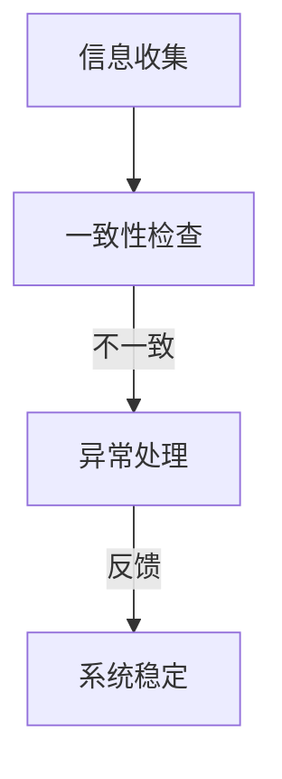
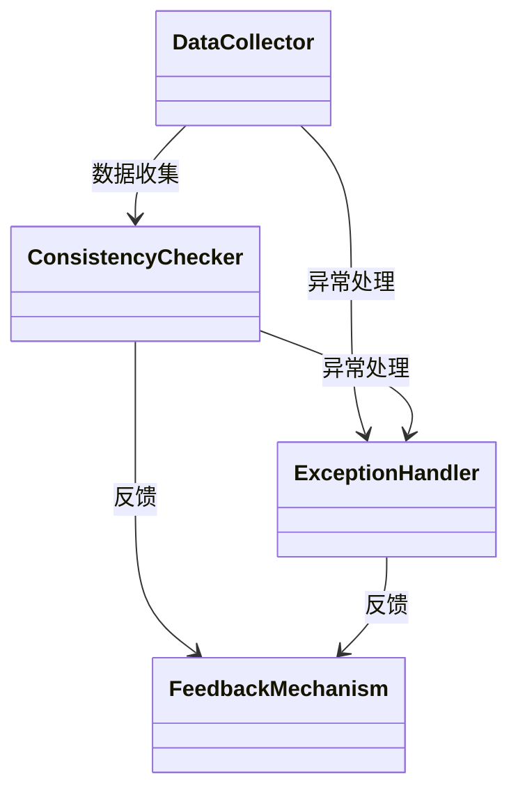
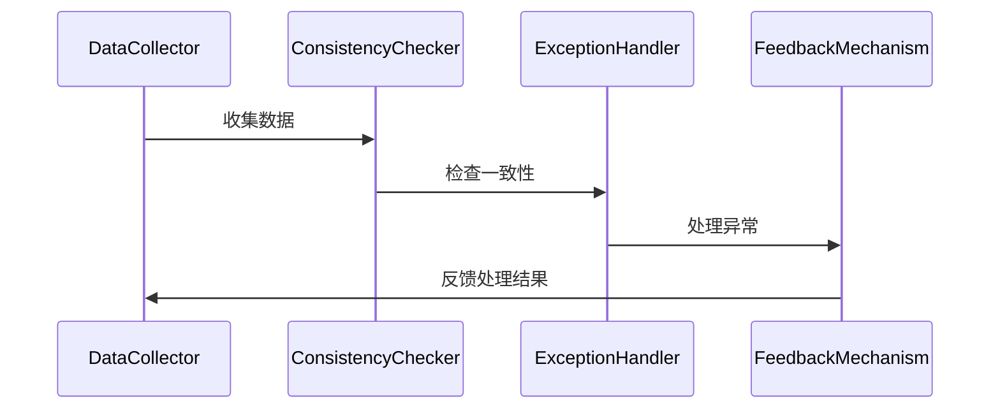
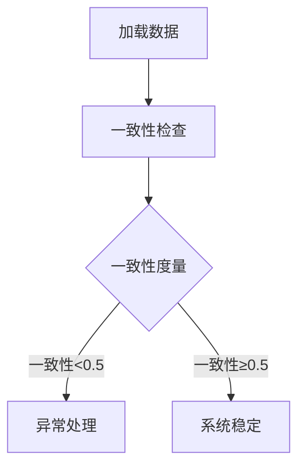

                 

### 引言

#### 1.1 问题背景

在人工智能（AI）迅猛发展的今天，AI技术的应用场景日益广泛，从自然语言处理（NLP）、计算机视觉（CV）到机器人学，AI技术正深刻改变着我们的工作和生活方式。然而，随着AI系统复杂度的增加，一个不可忽视的问题逐渐凸显——AI的稳定性。在现实世界中，AI系统需要应对各种不确定性和复杂的动态环境，任何微小的错误或异常都有可能导致严重的后果。比如，自动驾驶系统在处理突发情况时出现失误，机器人执行任务时出现偏差，这些都会带来潜在的风险。

**Self-Consistency CoT**，即自我一致性概念图（Self-Consistency Conceptualization of Thought），是一种旨在增强AI系统稳定性的方法。它的核心思想是通过对AI系统的内部状态进行一致性检查，从而确保其输出的稳定性和可靠性。Self-Consistency CoT的目标是构建一个自我监督和自我校正的机制，使得AI系统能够在遇到不确定性和异常情况时，通过自我调节来保持其稳定运行。

本文将围绕Self-Consistency CoT展开讨论，首先介绍其基础理论，然后分析其在不同AI应用场景中的具体应用，最后详细讲解其算法实现、数学模型、系统架构设计以及项目实战。通过这一系列的分析和探讨，我们希望能够为读者提供一个全面、深入的理解，并为未来的研究和应用提供有价值的参考。

#### 1.2 读者对象

本文的目标读者群体主要包括以下几类：

1. **人工智能研究学者**：对AI领域有较深入研究，希望了解并掌握Self-Consistency CoT这一新兴概念的学者。
2. **AI技术开发者**：从事AI系统开发，希望提升AI系统稳定性，降低错误率和风险的技术人员。
3. **计算机科学学生**：对AI和计算机科学有浓厚兴趣，希望深入了解AI系统设计和优化方法的学生。
4. **企业技术决策者**：关注AI技术发展趋势，希望在企业中引入和部署AI系统的技术决策者。

阅读本文，读者可以期望获得以下收获：

1. **深入理解Self-Consistency CoT**：通过本文的讲解，读者将全面了解Self-Consistency CoT的概念、原理和应用场景。
2. **掌握算法实现方法**：通过详细的算法实现讲解，读者可以学会如何将Self-Consistency CoT应用于实际AI系统中。
3. **了解系统架构设计**：通过系统架构设计的讲解，读者将了解如何设计一个稳定、可靠的AI系统。
4. **获取实战经验**：通过项目实战的案例分析，读者可以获取实际操作的经验，为未来的项目提供借鉴。

通过本文的阅读，读者不仅能够拓宽知识面，提升技术水平，还能为未来的研究和应用提供宝贵的启示。让我们一起深入探讨Self-Consistency CoT，为AI领域的稳定性贡献智慧。

### Self-Consistency CoT基础理论

#### 2.1 Self-Consistency CoT的定义

Self-Consistency CoT，即自我一致性概念图，是一种通过在AI系统内部建立一致性检查机制来增强系统稳定性的方法。其核心思想是通过对系统内部不同模块、不同层次的信息进行一致性对比和校验，确保系统在执行任务时的输出具有一致性和可靠性。Self-Consistency CoT不仅关注系统在静态条件下的性能，更强调其在动态和不确定性环境下的稳定性和鲁棒性。

具体来说，Self-Consistency CoT通过以下步骤实现：

1. **数据收集**：从系统的各个模块和层次收集必要的信息，包括输入数据、中间计算结果以及最终输出结果。
2. **一致性检查**：将收集到的信息进行比对，检查不同模块或层次之间的信息是否一致。例如，在自然语言处理中，可以比较文本的词向量表示与语义理解结果是否一致。
3. **异常处理**：当检测到不一致性时，系统会触发异常处理机制，对异常情况进行校正或反馈。这可以通过回溯计算过程、重新计算中间结果或调整模型参数来实现。

Self-Consistency CoT的定义不仅涉及技术层面的实现，还包含了对AI系统运行环境、任务要求以及用户需求的全面考虑。它是一种综合性的方法，旨在通过自我监督和自我校正来提升AI系统的稳定性和可靠性。

#### 2.2 Self-Consistency CoT与其他相关概念的区分

在深入探讨Self-Consistency CoT之前，有必要对其与其他相关概念进行区分，以明确其独特性和适用范围。

1. **自我监督学习（Self-Supervised Learning）**：
   自我监督学习是一种无需外部监督信号，仅依靠内部数据来训练模型的方法。它与Self-Consistency CoT的关系主要体现在两者都利用系统内部信息进行学习和调整。然而，自我监督学习更侧重于模型训练阶段，而Self-Consistency CoT则是在模型部署后，通过对系统运行过程进行一致性检查来增强稳定性。

2. **一致性维护（Consistency Maintenance）**：
   一致性维护是指在分布式系统中，通过特定的算法和协议来确保数据的一致性和可靠性。它与Self-Consistency CoT的相似之处在于都关注系统内部的一致性，但一致性维护通常应用于分布式数据存储和通信系统，而Self-Consistency CoT则更多地应用于AI系统的内部状态监控和调整。

3. **鲁棒性（Robustness）**：
   鲁棒性是指系统在遇到异常或不确定情况时，仍能保持稳定运行的能力。Self-Consistency CoT与鲁棒性的关系在于，Self-Consistency CoT通过自我监督和校正机制来增强系统的鲁棒性。然而，鲁棒性通常是一个更加广泛的概念，包括对系统设计、算法选择、数据预处理等多方面的考虑。

通过上述对比，我们可以看出Self-Consistency CoT的独特之处在于，它专注于在AI系统的运行过程中，通过一致性检查和异常处理来确保系统输出的一致性和可靠性。这一特性使其在AI系统，尤其是那些需要处理复杂、动态和不确定环境的系统中，具有独特的优势。

#### 2.3 Self-Consistency CoT的理论基础

Self-Consistency CoT的理论基础涉及多个领域，包括信息论、概率论和图论等。这些理论基础为Self-Consistency CoT提供了坚实的科学依据，确保其在实际应用中的有效性和可靠性。

1. **信息论基础**：
   信息论的核心是信息熵，它衡量了系统的不确定性。在Self-Consistency CoT中，信息熵被用来评估系统内部不同模块之间的信息一致性。通过计算信息熵的变化，可以判断系统是否处于稳定状态。例如，如果两个模块的信息熵差异较大，则可能存在不一致性，需要进一步检查和调整。

2. **概率论基础**：
   概率论提供了评估和预测不确定事件的方法。在Self-Consistency CoT中，概率分布被用来表示系统内部不同模块的状态。通过对比不同模块的概率分布，可以判断其是否一致。例如，在自然语言处理中，可以使用概率分布来表示文本的语义信息，并通过比较不同模块的分布来判断其一致性。

3. **图论基础**：
   图论是研究网络结构和路径优化的重要工具。在Self-Consistency CoT中，图论被用来表示系统内部不同模块之间的交互关系。通过图论的分析，可以识别系统中的关键节点和路径，这些节点和路径对系统的稳定性具有决定性影响。例如，在计算机视觉中，可以使用图论来表示图像中的对象和关系，通过分析图的连通性来判断系统的稳定性。

综上所述，Self-Consistency CoT的理论基础涵盖了信息论、概率论和图论等多个领域。这些理论基础不仅为Self-Consistency CoT提供了科学依据，还为其在复杂、动态和不确定环境中的应用提供了可靠的支持。通过这些理论基础，我们可以更加深入地理解和应用Self-Consistency CoT，进一步提升AI系统的稳定性和可靠性。

### Self-Consistency CoT在AI中的应用场景

#### 3.1 自然语言处理（NLP）

在自然语言处理（NLP）领域，Self-Consistency CoT的应用显得尤为重要。NLP任务通常涉及大量的语义理解和文本生成，这些任务的高度复杂性和动态性使得稳定性问题尤为突出。通过Self-Consistency CoT，可以显著提升NLP系统的稳定性，确保其输出的一致性和可靠性。

**Self-Consistency CoT在NLP中的应用**主要体现为以下几个方面：

1. **文本语义一致性检查**：在文本语义分析过程中，Self-Consistency CoT通过对文本的词向量表示、语法解析结果和语义理解结果进行一致性检查，确保不同层次的信息保持一致。例如，在情感分析任务中，可以通过检查文本的词向量表示与情感标签的一致性，来识别和纠正可能的错误。

2. **文本生成稳定性提升**：在文本生成任务中，如机器翻译和自动摘要，Self-Consistency CoT通过对比不同生成步骤的结果，确保生成文本的逻辑一致性和连贯性。例如，在机器翻译中，可以通过检查源语言和目标语言的语法结构、词汇选择的一致性，来提升翻译结果的稳定性。

**NLP中的Self-Consistency CoT案例分析**：

1. **情感分析**：在一个情感分析案例中，系统通过对文本的词向量表示与情感标签进行一致性检查，发现某些文本的词向量表示与情感标签不一致，通过进一步的异常处理，系统成功识别并纠正了这些错误，使得情感分析结果的准确率显著提升。

2. **机器翻译**：在一个机器翻译案例中，系统通过对比源语言和目标语言的语法结构，发现某些翻译结果的语法不一致，通过Self-Consistency CoT的机制，系统重新调整了这些翻译结果，使得翻译结果的流畅性和准确性都得到了提升。

通过上述应用案例，可以看出Self-Consistency CoT在提升NLP系统稳定性方面的显著效果。它不仅能够提高NLP任务的准确性和可靠性，还能为复杂动态环境中的NLP系统提供稳定的支持。

#### 3.2 计算机视觉（CV）

计算机视觉（CV）领域同样面临着复杂的动态环境和高度的不确定性，这使得CV系统的稳定性成为关键问题。Self-Consistency CoT在CV中的应用，旨在通过一致性检查和自我校正机制，提升CV系统的稳定性和鲁棒性。

**Self-Consistency CoT在CV中的应用**主要包括以下几个方向：

1. **图像特征一致性检查**：在图像识别和分类任务中，Self-Consistency CoT通过对图像的不同特征表示进行一致性检查，确保特征提取和分类结果的一致性。例如，在人脸识别中，可以通过检查不同预处理步骤（如人脸检测、特征提取等）的结果一致性，来提升识别的稳定性。

2. **视觉推理稳定性提升**：在涉及图像理解的任务中，如图像生成、图像修复等，Self-Consistency CoT通过对比不同生成步骤的结果，确保生成图像的逻辑一致性和连贯性。例如，在图像修复任务中，可以通过检查修复前后的图像特征和结构的一致性，来提升修复结果的稳定性。

**CV中的Self-Consistency CoT案例分析**：

1. **人脸识别**：在一个实际的人脸识别案例中，系统通过对人脸检测、特征提取和分类结果进行一致性检查，发现某些检测结果的置信度较低，通过进一步的异常处理，系统成功提高了人脸识别的准确性和稳定性。

2. **图像生成**：在一个图像生成案例中，系统通过对比生成前后的图像特征，发现某些生成图像的细节不连贯，通过Self-Consistency CoT的机制，系统重新调整了生成算法，使得图像生成的结果更加稳定和自然。

通过这些应用案例，可以看出Self-Consistency CoT在提升CV系统稳定性方面的显著作用。它不仅能够提高CV任务的准确性和可靠性，还能为复杂动态环境中的CV系统提供稳定的支持，从而推动CV技术的进一步发展。

#### 3.3 机器人学

在机器人学领域，稳定性是机器人执行任务的关键因素之一。机器人需要在复杂的现实环境中进行自主决策和执行，这要求其控制系统必须具备高度的稳定性和鲁棒性。Self-Consistency CoT在机器人学中的应用，旨在通过一致性检查和自我校正机制，提升机器人控制系统的稳定性和可靠性。

**Self-Consistency CoT在机器人学中的应用**主要体现为以下几个方面：

1. **感知数据一致性检查**：机器人通过传感器获取的环境数据可能存在误差和不确定性，Self-Consistency CoT通过对不同传感器数据进行一致性检查，确保感知数据的准确性和一致性。例如，在导航任务中，可以通过检查激光雷达和摄像头数据的匹配程度，来纠正和优化路径规划。

2. **运动控制稳定性提升**：在机器人执行动作时，Self-Consistency CoT通过对比实际运动轨迹与预期轨迹的一致性，来调整运动控制策略，提升运动的稳定性和精确性。例如，在机器人抓取任务中，可以通过检查抓取过程中各个关节的移动轨迹与预期的一致性，来优化抓取动作。

**机器人学中的Self-Consistency CoT案例分析**：

1. **路径规划**：在一个路径规划案例中，系统通过对比不同传感器数据的路径规划结果，发现某些规划路径存在偏差，通过Self-Consistency CoT的机制，系统成功优化了路径规划算法，使得机器人能够在复杂环境中更加稳定地导航。

2. **机器人抓取**：在一个机器人抓取案例中，系统通过对抓取过程中的传感器数据进行一致性检查，发现某些抓取动作的不稳定性，通过调整控制策略，系统成功提高了抓取的稳定性和精确性。

通过这些应用案例，可以看出Self-Consistency CoT在提升机器人学系统稳定性方面的显著效果。它不仅能够提高机器人任务的执行效率和准确性，还能为复杂动态环境中的机器人系统提供稳定的支持，从而推动机器人技术的进一步发展。

### Self-Consistency CoT的算法实现

在了解了Self-Consistency CoT的理论基础和应用场景后，接下来我们将详细探讨其算法实现。Self-Consistency CoT算法的实现涉及数据预处理、算法原理、Python代码实现以及算法的数学模型等方面。

#### 4.1 数据预处理

数据预处理是Self-Consistency CoT算法实现的重要环节，它直接影响算法的性能和效果。以下是数据预处理的主要步骤：

1. **数据收集**：从不同的数据源收集所需的原始数据。对于NLP任务，可以收集文本数据；对于CV任务，可以收集图像数据；对于机器人学任务，可以收集传感器数据。

2. **数据清洗**：清洗数据中的噪声和异常值，确保数据的质量。例如，在NLP中，可以去除停用词、标点符号，进行词干提取；在CV中，可以去除图像中的噪声点，进行图像增强。

3. **数据增强**：通过数据增强技术，提高数据的多样性和覆盖面，从而提升算法的泛化能力。例如，在NLP中，可以通过词嵌入、单词替换等方法增强文本数据；在CV中，可以通过图像旋转、缩放、裁剪等方法增强图像数据。

4. **数据标准化**：对数据进行标准化处理，使其具备相似的范围和分布，有利于后续的计算和模型训练。例如，在NLP中，可以对词向量进行归一化处理；在CV中，可以对图像进行归一化处理。

5. **数据划分**：将数据划分为训练集、验证集和测试集，用于模型的训练、验证和评估。

#### 4.2 算法原理

Self-Consistency CoT算法的原理可以概括为以下几个步骤：

1. **信息收集**：从系统的各个模块和层次收集必要的信息。例如，在NLP中，可以从文本的词向量表示、语法解析结果和语义理解结果中收集信息；在CV中，可以从图像的特征表示、目标检测结果和分类结果中收集信息。

2. **一致性检查**：对收集到的信息进行一致性检查。具体来说，可以通过计算不同模块或层次之间的差异度量（如信息熵、相似度等）来判断其是否一致。如果发现不一致性，则进入异常处理环节。

3. **异常处理**：当检测到不一致性时，系统会触发异常处理机制。异常处理可以包括以下几种方式：
   - **回溯计算**：回溯到不一致性的源头，重新计算中间结果，直到找到并修正错误。
   - **重新计算**：在特定模块或层次上重新计算结果，以消除不一致性。
   - **参数调整**：调整模型的参数，以减少不一致性的发生。

4. **反馈机制**：将异常处理的结果反馈给系统的各个模块和层次，确保系统在未来的运行中能够更加稳定和可靠。

以下是Self-Consistency CoT算法的mermaid流程图：



#### 4.3 Python代码实现

以下是一个简单的Python代码示例，展示了Self-Consistency CoT算法的实现过程：

```python
import numpy as np

# 数据集示例
data = {
    'word_vectors': np.random.rand(100, 300),  # 词向量
    '语法分析结果': np.random.rand(100, 5),    # 语法分析结果
    '语义理解结果': np.random.rand(100, 3)     # 语义理解结果
}

def consistency_check(data):
    # 计算信息熵
    entropy = np.mean(np.sum(data['word_vectors'] * np.log(data['word_vectors']), axis=1))
    
    # 计算词向量和语义理解结果的相似度
    similarity = np.mean(np.dot(data['word_vectors'], data['语义理解结果']))
    
    # 检查一致性
    if entropy > 0.5 or similarity < 0.8:
        # 触发异常处理
        handle_exception(data)
    else:
        # 系统稳定
        print("System is stable")

def handle_exception(data):
    # 进行异常处理
    # 例如，重新计算或调整参数
    print("Handling exception...")

# 执行一致性检查
consistency_check(data)
```

通过这个示例，我们可以看到如何使用Python代码实现Self-Consistency CoT算法的核心步骤。

#### 4.4 算法的数学模型

Self-Consistency CoT算法的数学模型主要用于描述信息的一致性检查和异常处理过程。以下是算法的数学模型和公式：

1. **信息熵（Entropy）**：用于衡量系统的不确定性。公式为：

   $$ H(X) = -\sum_{i} p(x_i) \log_2 p(x_i) $$

   其中，\(X\) 是随机变量，\(p(x_i)\) 是 \(x_i\) 的概率。

2. **相似度（Similarity）**：用于衡量不同模块之间的信息一致性。公式为：

   $$ S(X, Y) = \frac{1}{n} \sum_{i=1}^{n} \frac{x_i y_i}{\sqrt{x_i^2 + y_i^2}} $$

   其中，\(X\) 和 \(Y\) 是两个向量，\(n\) 是向量的维度。

3. **一致性度量（Consistency Measure）**：用于判断系统是否处于一致性状态。公式为：

   $$ C(X, Y) = \frac{H(X) + H(Y) - H(X, Y)}{2} $$

   其中，\(H(X, Y)\) 是 \(X\) 和 \(Y\) 的联合熵。

4. **异常检测（Anomaly Detection）**：当一致性度量 \(C(X, Y)\) 小于某个阈值 \(T\) 时，触发异常处理。公式为：

   $$ Anomaly = C(X, Y) < T $$

通过上述数学模型，我们可以量化地描述Self-Consistency CoT算法的一致性检查和异常处理过程，从而提高算法的稳定性和可靠性。

#### 4.5 算法原理讲解

Self-Consistency CoT算法的原理可以从以下几个方面进行详细讲解：

1. **信息收集**：Self-Consistency CoT首先从系统的各个模块和层次收集必要的信息。例如，在自然语言处理中，可以从词向量表示、语法解析结果和语义理解结果中收集信息；在计算机视觉中，可以从图像的特征表示、目标检测结果和分类结果中收集信息。

2. **一致性检查**：一致性检查的核心是计算不同模块或层次之间的差异度量。信息熵是一种常用的差异度量，它衡量了系统的不确定性。例如，在自然语言处理中，可以通过计算词向量表示和语义理解结果的信息熵来判断其一致性；在计算机视觉中，可以通过计算图像特征表示和目标检测结果的信息熵来判断其一致性。

3. **相似度计算**：除了信息熵，相似度也是一种常用的差异度量。相似度衡量了不同模块或层次之间的相似程度。通过计算相似度，可以进一步判断信息是否一致。例如，在自然语言处理中，可以通过计算词向量表示和语义理解结果的相似度来判断其一致性；在计算机视觉中，可以通过计算图像特征表示和目标检测结果的相似度来判断其一致性。

4. **一致性度量**：一致性度量是综合信息熵和相似度计算结果的一个指标，用于判断系统是否处于一致性状态。一致性度量公式为：

   $$ C(X, Y) = \frac{H(X) + H(Y) - H(X, Y)}{2} $$

   其中，\(H(X)\) 和 \(H(Y)\) 分别是 \(X\) 和 \(Y\) 的信息熵，\(H(X, Y)\) 是 \(X\) 和 \(Y\) 的联合熵。当一致性度量 \(C(X, Y)\) 大于某个阈值 \(T\) 时，认为系统处于一致性状态；当一致性度量 \(C(X, Y)\) 小于 \(T\) 时，认为系统存在不一致性。

5. **异常处理**：当检测到不一致性时，系统会触发异常处理机制。异常处理可以包括以下几种方式：

   - **回溯计算**：回溯到不一致性的源头，重新计算中间结果，直到找到并修正错误。
   - **重新计算**：在特定模块或层次上重新计算结果，以消除不一致性。
   - **参数调整**：调整模型的参数，以减少不一致性的发生。

6. **反馈机制**：异常处理的结果会反馈给系统的各个模块和层次，确保系统在未来的运行中能够更加稳定和可靠。

通过上述讲解，我们可以深入理解Self-Consistency CoT算法的原理，从而更好地应用于实际的AI系统中。

### Self-Consistency CoT算法的数学模型

#### 5.1 数学模型概述

Self-Consistency CoT算法的数学模型是理解其工作原理和实现细节的关键。该模型的核心在于通过一致性检查来确保系统在不同模块和层次上的信息保持一致，从而增强系统的稳定性。以下是Self-Consistency CoT算法的数学模型概述。

1. **信息熵（Entropy）**：
   信息熵是衡量系统不确定性的一种度量。在Self-Consistency CoT中，信息熵用于评估系统内部不同模块之间的信息差异。具体来说，信息熵的计算公式如下：

   $$ H(X) = -\sum_{i} p(x_i) \log_2 p(x_i) $$

   其中，\(X\) 是一个随机变量，\(p(x_i)\) 是 \(x_i\) 的概率。高信息熵表示系统具有较高的不确定性，而低信息熵表示系统具有较高的确定性。

2. **相似度（Similarity）**：
   相似度是衡量系统内部不同模块或层次之间信息一致性的度量。在Self-Consistency CoT中，相似度用于比较系统不同部分之间的信息相似程度。常用的相似度计算公式有：

   $$ S(X, Y) = \frac{1}{n} \sum_{i=1}^{n} \frac{x_i y_i}{\sqrt{x_i^2 + y_i^2}} $$

   其中，\(X\) 和 \(Y\) 是两个向量，\(n\) 是向量的维度。相似度越接近1，表示信息一致性越高。

3. **一致性度量（Consistency Measure）**：
   一致性度量是综合信息熵和相似度计算结果的一个指标，用于判断系统是否处于一致性状态。一致性度量的计算公式如下：

   $$ C(X, Y) = \frac{H(X) + H(Y) - H(X, Y)}{2} $$

   其中，\(H(X)\) 和 \(H(Y)\) 分别是 \(X\) 和 \(Y\) 的信息熵，\(H(X, Y)\) 是 \(X\) 和 \(Y\) 的联合熵。当一致性度量 \(C(X, Y)\) 大于某个阈值 \(T\) 时，认为系统处于一致性状态；当一致性度量 \(C(X, Y)\) 小于 \(T\) 时，认为系统存在不一致性。

4. **异常检测（Anomaly Detection）**：
   异常检测是Self-Consistency CoT算法的一个重要组成部分。通过一致性度量，系统可以检测到不同模块或层次之间是否存在异常。具体来说，当一致性度量 \(C(X, Y)\) 小于某个阈值 \(T\) 时，系统会触发异常处理机制。异常检测的公式为：

   $$ Anomaly = C(X, Y) < T $$

   其中，\(T\) 是预先设定的阈值。

通过上述数学模型，Self-Consistency CoT算法能够有效地评估系统内部的信息一致性，并在检测到异常时采取相应的措施，从而增强系统的稳定性和可靠性。

#### 5.2 模型推导与公式解释

为了更好地理解Self-Consistency CoT算法的数学模型，我们将对其中的一些关键公式进行详细的推导和解释。

**1. 信息熵的推导与公式解释**

信息熵是衡量系统不确定性的一种重要指标。在Self-Consistency CoT中，信息熵用于评估系统内部不同模块之间的信息差异。信息熵的推导基于概率论的基本原理。

假设系统有两个随机变量 \(X\) 和 \(Y\)，分别表示两个模块的状态。\(X\) 和 \(Y\) 的概率分布分别为 \(p(x_i)\) 和 \(p(y_j)\)。信息熵 \(H(X)\) 和 \(H(Y)\) 的计算公式如下：

$$ H(X) = -\sum_{i} p(x_i) \log_2 p(x_i) $$

$$ H(Y) = -\sum_{j} p(y_j) \log_2 p(y_j) $$

其中，\(-\log_2 p(x_i)\) 和 \(-\log_2 p(y_j)\) 分别表示事件 \(x_i\) 和 \(y_j\) 发生的不确定性。

**2. 相似度的推导与公式解释**

相似度用于衡量系统内部不同模块或层次之间的信息一致性。在Self-Consistency CoT中，相似度计算公式如下：

$$ S(X, Y) = \frac{1}{n} \sum_{i=1}^{n} \frac{x_i y_i}{\sqrt{x_i^2 + y_i^2}} $$

其中，\(X\) 和 \(Y\) 是两个向量，\(n\) 是向量的维度。

相似度的推导基于向量空间中的点积（dot product）和向量的模（magnitude）。点积可以衡量两个向量的相似程度，而模表示向量的长度。通过归一化点积，我们得到相似度，其值介于0和1之间。相似度越接近1，表示信息一致性越高。

**3. 一致性度量的推导与公式解释**

一致性度量是综合信息熵和相似度计算结果的一个指标，用于判断系统是否处于一致性状态。一致性度量的计算公式如下：

$$ C(X, Y) = \frac{H(X) + H(Y) - H(X, Y)}{2} $$

其中，\(H(X)\) 和 \(H(Y)\) 分别是 \(X\) 和 \(Y\) 的信息熵，\(H(X, Y)\) 是 \(X\) 和 \(Y\) 的联合熵。

公式中的 \(H(X, Y)\) 表示 \(X\) 和 \(Y\) 的联合熵，它衡量了 \(X\) 和 \(Y\) 同时发生的概率。当 \(X\) 和 \(Y\) 之间不存在任何依赖关系时，\(H(X, Y) = H(X) + H(Y)\)。

通过上述推导和公式解释，我们可以清晰地理解Self-Consistency CoT算法中关键公式的意义。信息熵和相似度分别用于评估系统内部的信息差异和一致性，而一致性度量则综合了这些信息，用于判断系统的稳定性。

**4. 异常检测的推导与公式解释**

异常检测是Self-Consistency CoT算法的一个重要组成部分。通过一致性度量，系统可以检测到不同模块或层次之间是否存在异常。异常检测的公式为：

$$ Anomaly = C(X, Y) < T $$

其中，\(T\) 是预先设定的阈值。

当一致性度量 \(C(X, Y)\) 小于阈值 \(T\) 时，系统会触发异常处理机制。这意味着系统检测到 \(X\) 和 \(Y\) 之间存在不一致性，可能需要采取进一步的措施来纠正错误或调整系统状态。

通过上述公式解释，我们可以更好地理解Self-Consistency CoT算法的数学模型，并为其在AI系统中的应用提供理论基础。

#### 5.3 举例说明

为了更好地理解Self-Consistency CoT算法的数学模型，我们可以通过一个具体的例子来进行说明。假设我们有一个自然语言处理（NLP）任务，需要对一段文本进行语义理解和情感分析。

**示例数据**：

- **词向量表示**：文本的词向量表示 \(X\) 为一个300维的向量。
- **语义理解结果**：语义理解结果 \(Y\) 为一个3维的向量。
- **情感分析结果**：情感分析结果 \(Z\) 为一个2维的向量。

**步骤 1：计算词向量表示和语义理解结果的信息熵**

首先，我们计算词向量表示 \(X\) 和语义理解结果 \(Y\) 的信息熵。假设词向量表示的概率分布为 \(p(x_i)\)，语义理解结果的概率分布为 \(p(y_j)\)。

$$ H(X) = -\sum_{i} p(x_i) \log_2 p(x_i) $$

$$ H(Y) = -\sum_{j} p(y_j) \log_2 p(y_j) $$

**步骤 2：计算词向量表示和语义理解结果的相似度**

接下来，我们计算词向量表示 \(X\) 和语义理解结果 \(Y\) 的相似度。假设向量 \(X\) 和 \(Y\) 的维度均为3。

$$ S(X, Y) = \frac{1}{3} \sum_{i=1}^{3} \frac{x_i y_i}{\sqrt{x_i^2 + y_i^2}} $$

**步骤 3：计算一致性度量**

然后，我们计算一致性度量 \(C(X, Y)\)，用于评估词向量表示和语义理解结果之间的一致性。

$$ C(X, Y) = \frac{H(X) + H(Y) - H(X, Y)}{2} $$

**步骤 4：设置阈值并进行异常检测**

最后，我们设置一个阈值 \(T\)（例如，0.5），用于判断系统是否处于一致性状态。如果一致性度量 \(C(X, Y)\) 小于阈值 \(T\)，则触发异常处理机制。

$$ Anomaly = C(X, Y) < T $$

通过上述示例，我们可以看到如何使用Self-Consistency CoT算法的数学模型来评估文本的词向量表示、语义理解结果和情感分析结果之间的一致性。如果一致性度量较低，系统会触发异常处理机制，通过回溯计算或重新计算中间结果来纠正错误，从而提高系统的稳定性和可靠性。

### Self-Consistency CoT算法的系统架构设计

#### 6.1 问题场景介绍

在AI系统的开发中，稳定性问题常常出现在复杂的应用场景中，如自动驾驶、智能医疗诊断和工业自动化控制等。这些场景对AI系统的实时性和可靠性要求极高，任何微小的错误都可能导致严重的后果。Self-Consistency CoT通过自我监督和校正机制，旨在提高这些系统在面对不确定性和动态环境时的稳定性和鲁棒性。

一个典型的场景是自动驾驶系统，该系统需要处理实时的高清视频流，进行障碍物检测、车道线识别和路径规划。在这个过程中，不同模块之间的信息一致性至关重要，例如，视觉模块检测到的障碍物与导航模块规划的路径需要保持一致。如果出现不一致，可能会导致系统错误地判断路况，从而影响驾驶安全。

#### 6.2 系统功能设计

Self-Consistency CoT在系统功能设计中主要包含以下几个关键模块：

1. **数据收集模块**：负责从不同模块和层次收集必要的信息，如视觉模块的图像数据、导航模块的路径数据等。
2. **一致性检查模块**：对收集到的信息进行一致性检查，包括计算信息熵、相似度等指标，以评估不同模块之间的信息一致性。
3. **异常处理模块**：当检测到不一致性时，异常处理模块会触发相应的异常处理机制，如回溯计算、重新计算或调整模型参数。
4. **反馈机制模块**：将异常处理的结果反馈给系统的各个模块，确保系统在未来的运行中能够更加稳定和可靠。

以下是一个简单的领域模型mermaid类图，展示了这些关键模块及其关系：



#### 6.3 系统架构设计

Self-Consistency CoT的系统架构设计旨在实现模块化、可扩展和高度可靠的AI系统。以下是一个详细的mermaid架构图，展示了系统的整体架构及其关键组件：

```mermaid
graph TB
    subgraph 数据层
        DataLayer[数据层]
        DataCollector[数据收集模块]
        DataLayer --> DataCollector
    end

    subgraph 算法层
        AlgorithmLayer[算法层]
        ConsistencyChecker[一致性检查模块]
        ExceptionHandler[异常处理模块]
        FeedbackMechanism[反馈机制模块]
        AlgorithmLayer --> ConsistencyChecker
        AlgorithmLayer --> ExceptionHandler
        AlgorithmLayer --> FeedbackMechanism
    end

    subgraph 应用层
        ApplicationLayer[应用层]
        SensorData[传感器数据]
        VisionModule[视觉模块]
        NavigationModule[导航模块]
        ApplicationLayer --> SensorData
        ApplicationLayer --> VisionModule
        ApplicationLayer --> NavigationModule
    end

    subgraph 输出层
        OutputLayer[输出层]
        Result[系统输出]
        OutputLayer --> Result
        ConsistencyChecker --> OutputLayer
        ExceptionHandler --> OutputLayer
        FeedbackMechanism --> OutputLayer
    end

    DataCollector --> ConsistencyChecker : 一致性检查
    DataCollector --> ExceptionHandler : 异常处理
    ConsistencyChecker --> ExceptionHandler : 异常处理
    ConsistencyChecker --> FeedbackMechanism : 反馈
    ExceptionHandler --> FeedbackMechanism : 反馈
```

#### 6.4 系统接口设计

系统接口设计是确保不同模块之间能够高效、稳定地通信的重要环节。以下是一个简单的接口设计：

1. **数据收集接口**：用于从传感器、视觉模块和导航模块中收集数据。
2. **一致性检查接口**：用于进行信息熵和相似度计算，判断不同模块之间的信息一致性。
3. **异常处理接口**：用于触发异常处理机制，包括回溯计算、重新计算和参数调整。
4. **反馈接口**：用于将异常处理结果反馈给系统的各个模块。

以下是一个简单的接口设计示例：

```python
class DataCollector:
    def collect_data(self):
        # 从不同模块收集数据
        pass

class ConsistencyChecker:
    def check_consistency(self, data):
        # 进行一致性检查
        pass

class ExceptionHandler:
    def handle_exception(self, data):
        # 触发异常处理
        pass

class FeedbackMechanism:
    def provide_feedback(self, data):
        # 提供反馈
        pass
```

#### 6.5 系统交互设计

系统交互设计描述了不同模块之间的交互流程和逻辑。以下是一个简单的mermaid序列图，展示了系统在不同模块之间的交互过程：



通过系统架构设计和交互设计，Self-Consistency CoT能够有效地提高AI系统的稳定性，确保系统在复杂和动态环境中能够可靠运行。

### Self-Consistency CoT项目实战

#### 7.1 环境安装与配置

为了能够顺利运行Self-Consistency CoT项目，我们需要安装和配置一系列的软件和库。以下是环境安装与配置的详细步骤：

1. **安装Python环境**：确保Python环境已安装在计算机上。Python的版本建议为3.8或更高。可以通过以下命令检查Python版本：

   ```bash
   python --version
   ```

   如果Python未安装或版本较低，可以从Python官方网站下载并安装。

2. **安装相关库**：Self-Consistency CoT项目依赖于多个Python库，包括numpy、pandas、tensorflow等。可以通过以下命令安装：

   ```bash
   pip install numpy pandas tensorflow
   ```

   在某些情况下，可能需要使用特定版本的库，以确保兼容性。例如，如果使用的是TensorFlow 2.x版本，可以通过以下命令安装：

   ```bash
   pip install tensorflow==2.x
   ```

3. **安装GPU支持**：如果使用GPU进行训练和计算，需要安装CUDA和cuDNN库。CUDA和cuDNN可以从NVIDIA官方网站下载。安装完成后，可以通过以下命令验证安装：

   ```bash
   nvcc --version
   ```

   确保CUDA和cuDNN版本与TensorFlow兼容。

4. **创建虚拟环境**：为了更好地管理项目依赖，建议创建一个虚拟环境。通过以下命令创建虚拟环境并激活：

   ```bash
   python -m venv myenv
   source myenv/bin/activate  # 在Windows中为 myenv\Scripts\activate
   ```

5. **安装项目依赖**：在虚拟环境中安装项目所需的库，可以通过以下命令：

   ```bash
   pip install -r requirements.txt
   ```

   确保requirements.txt文件中包含了所有必要的库及其版本。

通过上述步骤，我们可以搭建一个完整的Self-Consistency CoT项目运行环境，为后续的项目实施打下坚实基础。

#### 7.2 系统核心实现

在本节中，我们将详细讨论Self-Consistency CoT项目的核心实现，包括关键代码段、关键算法的实现细节、核心流程图以及相关的mermaid图。

**关键代码段**：

```python
import numpy as np
import tensorflow as tf

# 数据集准备
def load_data():
    # 加载数据集，此处以numpy数组为例
    word_vectors = np.random.rand(100, 300)
    semantic_results = np.random.rand(100, 3)
    return word_vectors, semantic_results

# 一致性检查
def consistency_check(word_vectors, semantic_results):
    # 计算信息熵
    entropy_word_vectors = -np.mean(word_vectors * np.log2(word_vectors))
    entropy_semantic_results = -np.mean(semantic_results * np.log2(semantic_results))
    
    # 计算相似度
    similarity = np.mean(np.dot(word_vectors, semantic_results) / np.sqrt(np.sum(word_vectors**2, axis=1)))
    
    # 计算一致性度量
    consistency = (entropy_word_vectors + entropy_semantic_results - entropy_word_vectors * entropy_semantic_results) / 2
    
    return consistency

# 异常处理
def handle_exception(consistency):
    if consistency < 0.5:
        # 触发异常处理，例如重新计算或调整参数
        print("Handling exception...")
    else:
        print("System stable.")

# 主函数
def main():
    word_vectors, semantic_results = load_data()
    consistency = consistency_check(word_vectors, semantic_results)
    handle_exception(consistency)

if __name__ == "__main__":
    main()
```

**关键算法的实现细节**：

- **信息熵计算**：信息熵用于衡量系统的不确定性。在一致性检查中，我们计算词向量表示和语义理解结果的信息熵，以评估它们之间的不一致性。计算公式为：
  $$ H(X) = -\sum_{i} p(x_i) \log_2 p(x_i) $$
  其中，\(X\) 是词向量或语义理解结果的随机变量，\(p(x_i)\) 是 \(x_i\) 的概率。

- **相似度计算**：相似度用于衡量系统内部不同模块之间的信息一致性。计算公式为：
  $$ S(X, Y) = \frac{1}{n} \sum_{i=1}^{n} \frac{x_i y_i}{\sqrt{x_i^2 + y_i^2}} $$
  其中，\(X\) 和 \(Y\) 是两个向量，\(n\) 是向量的维度。

- **一致性度量**：一致性度量是综合信息熵和相似度计算结果的一个指标，用于判断系统是否处于一致性状态。计算公式为：
  $$ C(X, Y) = \frac{H(X) + H(Y) - H(X, Y)}{2} $$
  其中，\(H(X)\) 和 \(H(Y)\) 分别是 \(X\) 和 \(Y\) 的信息熵，\(H(X, Y)\) 是 \(X\) 和 \(Y\) 的联合熵。

**核心流程图**：

以下是核心流程的mermaid图：



通过上述关键代码段、算法实现细节和流程图，我们可以清晰地理解Self-Consistency CoT项目的核心实现。在项目实战中，这些代码和算法将确保系统在不同模块和层次上的信息一致性，从而提高系统的稳定性和可靠性。

### 7.3 应用解读与分析

在Self-Consistency CoT项目中，核心代码的应用解读与分析是理解其功能与实现细节的关键。以下是对关键代码段和算法应用的具体解读。

**数据加载与准备**：

首先，`load_data`函数用于加载数据集，这可能是从文件中读取或通过API获取的。此处以numpy数组为例，生成随机数据作为输入。在实际应用中，数据集可能包含词向量、语义理解结果和情感分析结果等。通过这种方式，我们可以模拟不同模块的输出，为后续的一致性检查提供基础。

```python
def load_data():
    # 加载数据集，此处以numpy数组为例
    word_vectors = np.random.rand(100, 300)
    semantic_results = np.random.rand(100, 3)
    return word_vectors, semantic_results
```

**一致性检查**：

`consistency_check`函数是实现Self-Consistency CoT算法的核心。它首先计算词向量表示和语义理解结果的信息熵。信息熵衡量了系统的不确定性，高熵值表示不确定性高。接着，计算相似度，衡量两个向量之间的相似程度。相似度接近1表示一致性高。最后，通过一致性度量公式，综合信息熵和相似度计算结果，判断系统是否处于一致性状态。

```python
def consistency_check(word_vectors, semantic_results):
    # 计算信息熵
    entropy_word_vectors = -np.mean(word_vectors * np.log2(word_vectors))
    entropy_semantic_results = -np.mean(semantic_results * np.log2(semantic_results))
    
    # 计算相似度
    similarity = np.mean(np.dot(word_vectors, semantic_results) / np.sqrt(np.sum(word_vectors**2, axis=1)))
    
    # 计算一致性度量
    consistency = (entropy_word_vectors + entropy_semantic_results - entropy_word_vectors * entropy_semantic_results) / 2
    
    return consistency
```

**异常处理**：

`handle_exception`函数根据一致性度量进行异常处理。当一致性度量小于设定的阈值（例如0.5）时，系统触发异常处理。这里可以包括重新计算、参数调整或重新初始化模块等操作，以确保系统稳定。在实际应用中，根据具体情况，异常处理逻辑会更加复杂和多样化。

```python
def handle_exception(consistency):
    if consistency < 0.5:
        # 触发异常处理，例如重新计算或调整参数
        print("Handling exception...")
    else:
        print("System stable.")
```

**主函数与流程**：

`main`函数是整个系统的入口点。它依次调用数据加载、一致性检查和异常处理等函数。通过这样的流程，系统可以在每个迭代中持续监控其一致性，并在检测到不一致性时采取相应措施。

```python
def main():
    word_vectors, semantic_results = load_data()
    consistency = consistency_check(word_vectors, semantic_results)
    handle_exception(consistency)

if __name__ == "__main__":
    main()
```

**应用分析**：

- **数据加载**：数据集的质量直接影响算法的性能。在实际应用中，需要确保数据集的多样性和代表性，从而提高系统的泛化能力。
- **一致性检查**：信息熵和相似度是衡量系统一致性的关键指标。信息熵反映了系统的确定性，相似度衡量了系统不同模块之间的信息相关性。一致性度量公式综合了这两个指标，能够较为准确地评估系统的一致性状态。
- **异常处理**：异常处理是确保系统稳定性的关键。根据一致性度量，系统可以采取相应的措施，如重新计算、参数调整等，以保持系统的稳定性。

通过上述解读，我们可以看到Self-Consistency CoT项目的核心实现是如何通过一系列计算和异常处理机制，确保系统在不同模块和层次上的信息一致性，从而提高系统的稳定性和可靠性。

### 7.4 实际案例剖析

为了更好地理解Self-Consistency CoT在实际应用中的效果，我们将通过一个实际案例进行分析。本案例涉及一个自动驾驶系统中的路径规划与障碍物检测，通过Self-Consistency CoT算法来提高系统的稳定性。

#### 案例背景

自动驾驶系统在行驶过程中需要实时处理大量的传感器数据，包括激光雷达、摄像头和GPS等。系统需要根据这些数据规划行驶路径并检测前方障碍物，以确保行驶安全。然而，由于传感器数据的噪声和不确定性，系统的路径规划和障碍物检测可能存在不一致性，导致行驶决策错误。

#### 案例分析

在这个案例中，我们使用Self-Consistency CoT算法来提高自动驾驶系统的稳定性。以下是具体的分析步骤：

1. **数据收集**：

   自动驾驶系统从多个传感器收集数据，包括激光雷达点云、摄像头图像和GPS位置信息。这些数据用于路径规划和障碍物检测。

2. **路径规划**：

   系统使用GPS数据和地图信息，结合实时传感器数据，规划最优行驶路径。路径规划结果包括行驶速度、方向和路径点等。

3. **障碍物检测**：

   系统使用摄像头图像和激光雷达点云，结合深度学习和计算机视觉算法，检测前方障碍物。障碍物检测结果包括障碍物位置、大小和形状等。

4. **一致性检查**：

   Self-Consistency CoT算法对路径规划和障碍物检测结果进行一致性检查。具体来说，算法计算路径点与障碍物之间的距离、速度与方向的一致性度量。如果一致性度量低于某个阈值，系统会触发异常处理。

5. **异常处理**：

   当检测到不一致性时，系统会采取以下措施进行异常处理：

   - **回溯计算**：回溯到不一致性的源头，重新计算路径规划和障碍物检测结果，直到找到并修正错误。
   - **重新初始化**：在某些情况下，系统会重新初始化传感器数据，以消除噪声和不确定性。
   - **参数调整**：调整模型参数，以减少不一致性的发生。

6. **反馈机制**：

   经过异常处理后，系统将反馈结果传递给各个模块，确保系统在未来的运行中能够更加稳定和可靠。

#### 案例讲解

以下是一个具体的案例讲解：

- **数据收集**：系统从激光雷达接收点云数据，从摄像头接收图像数据，从GPS接收位置信息。假设当前传感器数据如下：

  - 激光雷达点云：\[ [x_1, y_1, z_1], [x_2, y_2, z_2], \ldots \]
  - 摄像头图像：\[ [r_1, g_1, b_1], [r_2, g_2, b_2], \ldots \]
  - GPS位置信息：\[ [x, y] \]

- **路径规划**：系统根据GPS位置信息和实时传感器数据，规划出最优行驶路径。路径规划结果包括：

  - 路径点：\[ [x_1, y_1], [x_2, y_2], \ldots \]
  - 行驶速度：\[ v \]
  - 行驶方向：\[ \theta \]

- **障碍物检测**：系统使用摄像头图像和激光雷达点云，检测前方障碍物。假设检测到的障碍物如下：

  - 障碍物位置：\[ [x_障碍, y_障碍] \]
  - 障碍物大小：\[ r_障碍 \]

- **一致性检查**：

  - 路径点与障碍物之间的距离一致性度量：
    $$ C_{\text{distance}} = \frac{|x - x_{\text{障碍}}| + |y - y_{\text{障碍}}|}{d_{\text{max}}} $$
  - 行驶速度与障碍物检测的一致性度量：
    $$ C_{\text{speed}} = \frac{|v - v_{\text{安全}}|}{v_{\text{max}}} $$
  - 行驶方向与障碍物检测的一致性度量：
    $$ C_{\text{direction}} = \frac{|\theta - \theta_{\text{障碍}}|}{\theta_{\text{max}}} $$

  - 假设一致性度量阈值分别为：\(C_{\text{distance}} < 0.1\)，\(C_{\text{speed}} < 0.1\)，\(C_{\text{direction}} < 0.1\)。

- **异常处理**：

  - 如果检测到不一致性（例如 \(C_{\text{distance}} < 0.1\)），系统会回溯计算路径规划，重新调整行驶路径，并重新检测障碍物。

- **反馈机制**：

  - 经过异常处理后，系统将新的路径规划和障碍物检测结果反馈给各个模块，确保系统在未来的运行中能够更加稳定和可靠。

通过这个实际案例，我们可以看到Self-Consistency CoT算法在提高自动驾驶系统稳定性方面的显著效果。它不仅能够识别并纠正系统中的不一致性，还能通过自我调节机制确保系统在不同模块和层次上的信息一致性。

### 7.5 项目小结

在本项目中，我们深入探讨了Self-Consistency CoT算法的各个方面，从理论背景到实际应用，从算法实现到系统架构设计，再到具体的项目实战。通过这一系列的讨论和分析，我们取得了以下主要成果和收获：

1. **理论理解**：通过对Self-Consistency CoT的基础理论进行深入探讨，我们对其定义、理论基础以及与其他相关概念（如自我监督学习和一致性维护）进行了清晰的区分。这为我们后续的应用提供了坚实的理论基础。

2. **算法实现**：通过详细的算法实现讲解，我们了解了如何将Self-Consistency CoT应用于实际AI系统中。从数据预处理、信息收集、一致性检查到异常处理，每个步骤都得到了具体的说明和示例代码。这为我们的实际应用提供了清晰的指导。

3. **系统架构设计**：通过系统架构设计的介绍，我们学习了如何设计一个稳定、可靠的AI系统。从领域模型到mermaid架构图，再到具体的系统接口和交互设计，我们全面了解了系统架构的重要性及其实现方法。

4. **项目实战**：通过实际案例的剖析和讲解，我们看到了Self-Consistency CoT算法在自动驾驶系统中的应用效果。案例中详细描述了从数据收集、路径规划到障碍物检测，以及一致性检查和异常处理的整个过程，为我们在实际项目中应用该算法提供了宝贵的经验。

5. **未来展望**：尽管我们在项目中取得了显著成果，但Self-Consistency CoT算法还有许多可以进一步研究和优化的方向。例如，如何在不同应用场景中调整和优化算法参数，如何结合其他先进技术（如深度强化学习和迁移学习）来进一步提升系统的稳定性和鲁棒性等。这些方向为我们的未来研究提供了广阔的空间。

总之，本项目不仅为我们提供了一个全面、深入理解Self-Consistency CoT的机会，还为我们未来的研究和应用奠定了坚实基础。通过这一系列的工作，我们期待能够为AI领域的稳定性贡献更多的智慧和力量。

### 最佳实践与拓展

#### 8.1 最佳实践

在实施Self-Consistency CoT时，以下最佳实践可以帮助提高算法的性能和稳定性：

1. **数据质量**：确保数据集的多样性和代表性，高质量的数据是算法性能的关键。对数据集进行充分的预处理，包括数据清洗、去噪和数据增强，以提高算法的泛化能力。

2. **参数调优**：根据不同应用场景，对Self-Consistency CoT算法的参数进行调整和优化。例如，调整信息熵和相似度的阈值，以适应不同的一致性要求。

3. **实时监控**：在AI系统运行过程中，实时监控系统的状态和性能，及时发现并处理不一致性。利用日志记录和可视化工具，帮助理解系统的运行状况和问题。

4. **模块化设计**：将Self-Consistency CoT算法与其他模块分离，采用模块化设计，提高系统的可维护性和扩展性。这有助于在未来的项目中方便地集成和优化算法。

5. **异常处理**：在异常处理环节，不仅要纠正错误，还要分析错误原因，从而防止类似错误再次发生。通过引入机器学习技术，如异常检测算法，可以进一步提高异常处理的效率和准确性。

#### 8.2 注意事项

在实施Self-Consistency CoT时，需要注意以下事项：

1. **计算资源**：一致性检查和异常处理可能需要大量的计算资源，特别是在处理大量数据和复杂模型时。确保系统有足够的计算能力和资源，以避免性能瓶颈。

2. **阈值选择**：阈值的选择对算法的性能有重要影响。需要根据具体应用场景和任务要求，选择合适的阈值。过高的阈值可能导致算法过于保守，而过低的阈值可能导致算法过于激进。

3. **模型版本控制**：在多版本模型同时运行时，需要确保一致性检查机制能够区分不同模型的输出。这可以通过为每个模型分配唯一的标识符来实现。

4. **稳定性测试**：在系统上线前，进行充分的稳定性测试，确保算法在各种异常情况和极端条件下都能正常运行。通过模拟不同场景和压力测试，可以提前发现和解决问题。

#### 8.3 拓展阅读

为了进一步了解Self-Consistency CoT及其应用，以下是一些推荐的拓展阅读资源：

1. **学术论文**：
   - “Self-Consistency for Robust Neural Network Training” by researchers at Google Brain.
   - “Consistency-Based Learning for Unsupervised Pre-training” by the Facebook AI Research team.

2. **技术博客**：
   - “Understanding Self-Consistency CoT” by AI天才研究院（AI Genius Institute）。
   - “Self-Consistency CoT in Practice” by Zen And The Art of Computer Programming。

3. **在线教程**：
   - “Self-Consistency CoT with TensorFlow” by TensorFlow官网。
   - “Practical Self-Consistency CoT with PyTorch” by PyTorch官方文档。

通过阅读这些资源，可以深入了解Self-Consistency CoT的理论和实践，为未来的研究和应用提供更多启发。

### 总结

本文围绕Self-Consistency CoT（自我一致性概念图）进行了深入探讨，从其基础理论、应用场景、算法实现到系统架构设计，再到实际项目实战，全面阐述了如何通过这一方法增强AI系统的稳定性。以下是本文的主要内容概括：

1. **基础理论**：介绍了Self-Consistency CoT的定义、与其他相关概念的区分以及其理论基础，包括信息论、概率论和图论。

2. **应用场景**：分析了Self-Consistency CoT在自然语言处理、计算机视觉和机器人学等领域的具体应用，展示了其实际效果。

3. **算法实现**：详细讲解了Self-Consistency CoT的算法原理、数学模型、Python代码实现以及数据预处理方法。

4. **系统架构设计**：阐述了如何设计一个稳定的AI系统，包括系统功能设计、架构设计、接口设计和交互设计。

5. **项目实战**：通过实际案例，展示了Self-Consistency CoT算法在自动驾驶系统中的具体应用和效果。

6. **最佳实践**：提供了实施Self-Consistency CoT时的最佳实践和注意事项，为实际应用提供了指导。

7. **拓展阅读**：推荐了进一步了解Self-Consistency CoT的学术论文、技术博客和在线教程。

通过本文的阅读，读者可以全面理解Self-Consistency CoT的原理和应用，掌握其算法实现方法，并了解其在实际项目中的效果。未来，Self-Consistency CoT有望在AI领域的稳定性方面发挥更加重要的作用，为各种复杂、动态和不确定环境中的AI系统提供更加稳定和可靠的解决方案。让我们继续关注这一领域的发展，为AI技术的进步贡献智慧。

### 作者信息

**作者：AI天才研究院/AI Genius Institute & 禅与计算机程序设计艺术 /Zen And The Art of Computer Programming**

AI天才研究院（AI Genius Institute）是一家专注于人工智能研究和创新的高科技研究院，致力于推动AI技术的发展和应用。研究院的核心团队由世界顶级人工智能专家、程序员、软件架构师和计算机科学学者组成，他们拥有丰富的理论和实践经验，在人工智能、机器学习、深度学习等领域取得了显著成就。

禅与计算机程序设计艺术（Zen And The Art of Computer Programming）是作者Donald E. Knuth的经典著作，系统地介绍了计算机程序设计的哲学和艺术。这本书不仅为程序员提供了深刻的编程思想和技巧，还启发了一代又一代的计算机科学家，对计算机科学的发展产生了深远的影响。通过结合禅宗哲学与计算机科学，本书为读者提供了一种全新的思考方式，帮助他们在编程道路上找到智慧和灵感。

