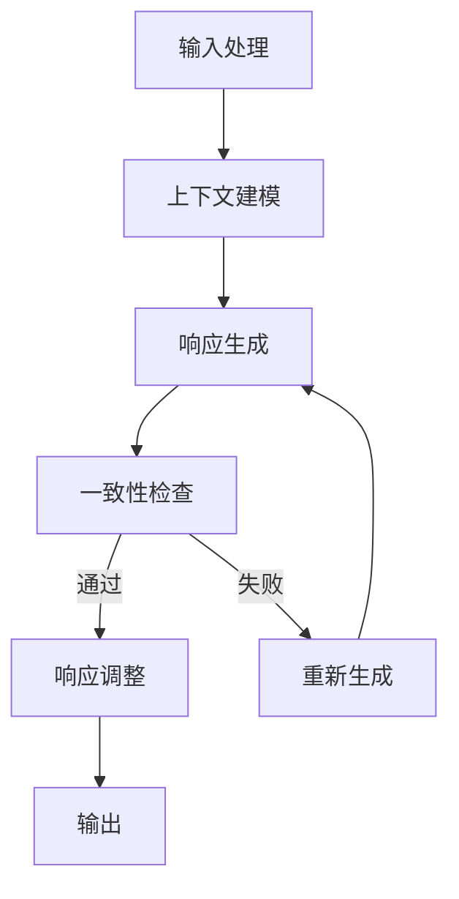
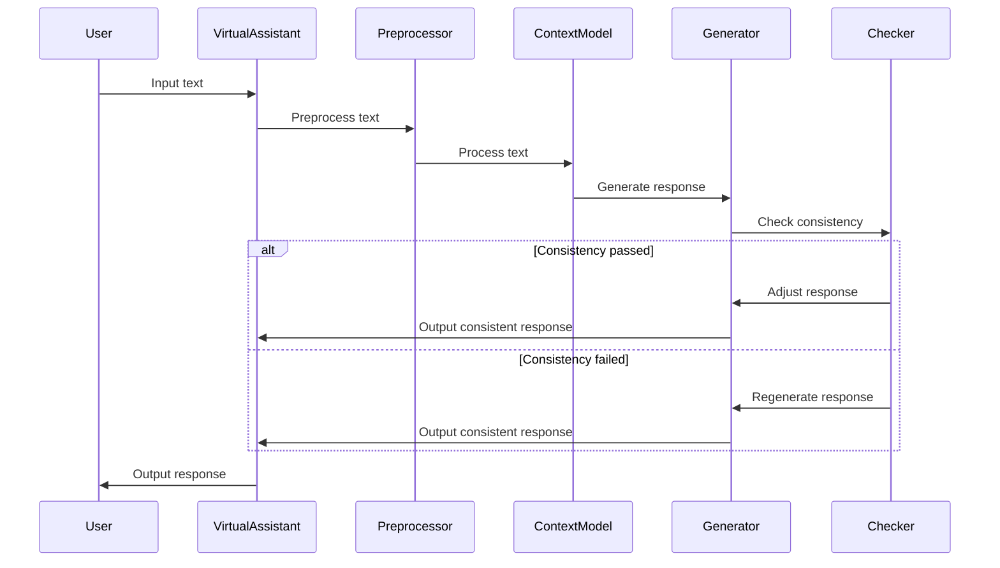
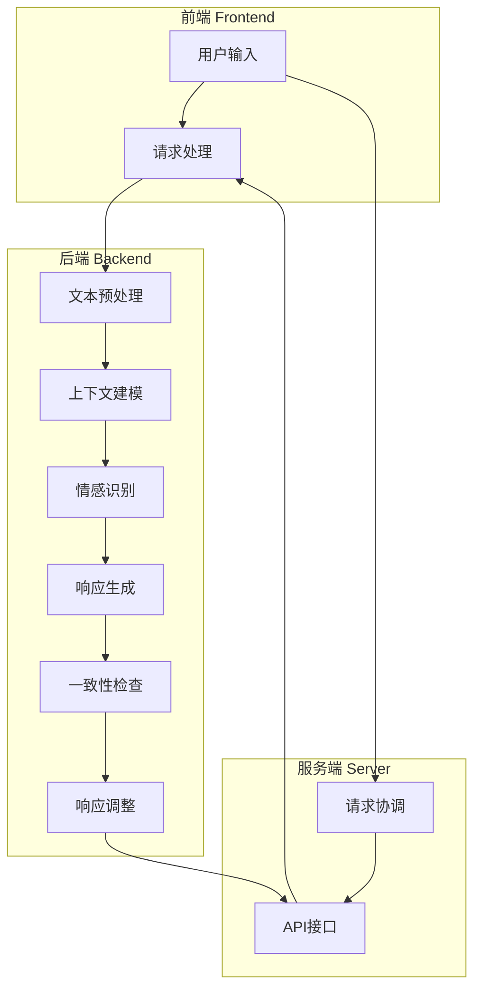
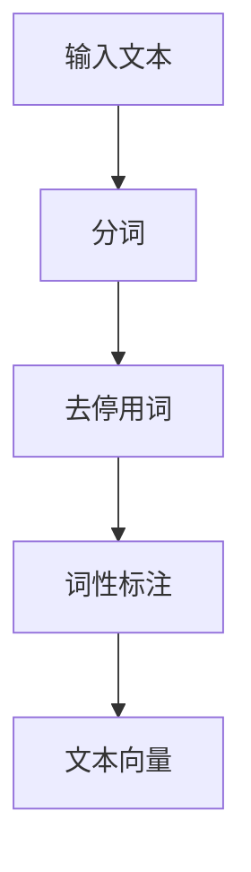

                 

# Self-Consistency CoT提升AI虚拟助手的情感连贯性

## 关键词

- 自我一致性CoT
- 情感连贯性
- 虚拟助手
- AI
- 算法原理
- 数学模型
- 系统架构
- 实践案例

## 摘要

本文旨在探讨如何通过自我一致性CoT（Contextual Understanding of Text）来提升AI虚拟助手的情感连贯性。情感连贯性是虚拟助手能否提供高质量用户体验的关键因素之一。本文首先介绍了自我一致性和CoT的基本概念，然后分析了情感连贯性对虚拟助手的影响以及当前提升情感连贯性的方法。接着，本文详细阐述了自我一致性CoT的数学模型、算法原理及其在虚拟助手情感连贯性提升中的应用。最后，通过实际项目案例，展示了自我一致性CoT在提升虚拟助手情感连贯性方面的实际效果，并总结了最佳实践技巧和小结展望。

## 目录大纲

----------------------------------------------------------------

## 第一部分：问题背景与核心概念

### 1.1 自我一致性概念与CoT的提出

#### 1.1.1 自我一致性概念的定义与重要性

#### 1.1.2 CoT（Contextual Understanding of Text）的概念解读

#### 1.1.3 自我一致性与CoT在虚拟助手中的关联

### 1.2 情感连贯性对虚拟助手的影响

#### 1.2.1 情感连贯性的定义与作用

#### 1.2.2 情感连贯性在虚拟助手中的挑战

#### 1.2.3 情感连贯性对用户体验的重要性

### 1.3 当前虚拟助手情感连贯性的提升方法

#### 1.3.1 传统方法及其局限性

#### 1.3.2 现代方法的发展与挑战

#### 1.3.3 未来虚拟助手情感连贯性的发展方向

### 1.4 自我一致性CoT在情感连贯性提升中的应用

#### 1.4.1 自我一致性CoT的理论基础

#### 1.4.2 自我一致性CoT的实用方法

#### 1.4.3 自我一致性CoT的优势与效果

### 1.5 本章小结

----------------------------------------------------------------

## 第二部分：自我一致性CoT理论讲解

### 2.1 自我一致性CoT的数学模型与公式

#### 2.1.1 CoT的数学模型

#### 2.1.2 自我一致性的数学公式

#### 2.1.3 模型参数调优方法

### 2.2 自我一致性CoT的算法原理

#### 2.2.1 算法概述

#### 2.2.2 算法流程图

#### 2.2.3 算法Python代码实现

### 2.3 自我一致性CoT的概念属性特征对比

#### 2.3.1 与传统CoT的对比

#### 2.3.2 与其他情感连贯性提升方法的对比

### 2.4 自我一致性CoT的ER实体关系图架构

#### 2.4.1 实体定义

#### 2.4.2 关系定义

#### 2.4.3 ER图绘制

### 2.5 自我一致性CoT的应用案例解析

#### 2.5.1 案例一：虚拟客服中的情感连贯性提升

#### 2.5.2 案例二：智能语音助手的情感连贯性优化

### 2.6 本章小结

----------------------------------------------------------------

## 第三部分：情感连贯性提升实践

### 3.1 系统设计与架构方案

#### 3.1.1 系统功能设计

#### 3.1.2 系统架构设计

#### 3.1.3 系统接口设计

### 3.2 项目实战

#### 3.2.1 环境搭建

#### 3.2.2 系统核心实现

#### 3.2.3 代码应用解读与分析

#### 3.2.4 实际案例分析与讲解

### 3.3 项目小结

----------------------------------------------------------------

## 第四部分：最佳实践与总结

### 4.1 最佳实践技巧

#### 4.1.1 调试技巧

#### 4.1.2 优化策略

#### 4.1.3 性能监控

### 4.2 小结与展望

#### 4.2.1 成果总结

#### 4.2.2 存在问题与改进方向

#### 4.2.3 未来研究方向

### 4.3 注意事项

#### 4.3.1 避免常见错误

#### 4.3.2 安全性考量

#### 4.3.3 可维护性策略

### 4.4 拓展阅读

#### 4.4.1 相关研究论文

#### 4.4.2 推荐书籍

#### 4.4.3 在线资源

----------------------------------------------------------------

## 第一部分：问题背景与核心概念

### 1.1 自我一致性概念与CoT的提出

#### 1.1.1 自我一致性概念的定义与重要性

自我一致性是指个体在行为、信念和情感上的内在一致性。在人工智能领域，自我一致性被引入到虚拟助手的情感连贯性研究中，旨在使虚拟助手在与用户交互时表现出一致性和可信性。自我一致性对虚拟助手的重要性体现在以下几个方面：

1. 提升用户体验：自我一致性能够确保虚拟助手在对话中保持一致的情感表达，从而提高用户对虚拟助手的信任度和满意度。

2. 减少认知负担：当虚拟助手表现出自我一致性时，用户能够更容易理解其意图和情感，从而减少用户的认知负担。

3. 增强交互效率：自我一致性有助于虚拟助手快速识别用户的情感状态，从而做出更准确的响应，提高交互效率。

#### 1.1.2 CoT（Contextual Understanding of Text）的概念解读

CoT是指文本的上下文理解，它是指人工智能系统在处理文本时，能够理解文本中的上下文信息，并根据上下文信息进行推理和生成响应。CoT在虚拟助手中的应用主要体现在以下几个方面：

1. 语义理解：通过CoT，虚拟助手能够更好地理解用户输入的语义，从而生成更准确的响应。

2. 情感分析：CoT有助于虚拟助手识别文本中的情感信息，从而在交互过程中表现出相应的情感。

3. 上下文跟踪：CoT能够帮助虚拟助手跟踪对话的上下文信息，确保对话的连贯性和一致性。

#### 1.1.3 自我一致性与CoT在虚拟助手中的关联

自我一致性和CoT在虚拟助手中的关联主要体现在以下几个方面：

1. 交互连贯性：自我一致性确保虚拟助手在对话中表现出一致的情感和行为，而CoT则帮助虚拟助手理解对话的上下文信息，从而实现更好的交互连贯性。

2. 情感表达：自我一致性使虚拟助手能够根据对话的上下文信息，适当地表达情感，从而提高用户的情感体验。

3. 可解释性：自我一致性和CoT有助于提高虚拟助手的可解释性，使用户能够更好地理解虚拟助手的决策过程。

### 1.2 情感连贯性对虚拟助手的影响

#### 1.2.1 情感连贯性的定义与作用

情感连贯性是指虚拟助手在与用户交互时，能够保持一致的情感表达。情感连贯性对虚拟助手的影响主要表现在以下几个方面：

1. 提升用户体验：情感连贯性使虚拟助手能够更好地理解用户的情感需求，从而提供更个性化的服务，提升用户体验。

2. 减少用户困扰：当虚拟助手表现出情感连贯性时，用户能够更容易理解其意图和情感，从而减少用户的困扰和误解。

3. 增强交互自然性：情感连贯性有助于虚拟助手在与用户交互时，表现得更加自然和流畅，从而增强交互的自然性。

#### 1.2.2 情感连贯性在虚拟助手中的挑战

情感连贯性在虚拟助手中的应用面临以下挑战：

1. 情感识别：虚拟助手需要准确识别用户的情感，这是实现情感连贯性的基础。

2. 情感表达：虚拟助手需要根据对话的上下文信息，适当地表达情感，这是实现情感连贯性的关键。

3. 情感一致性：虚拟助手需要在整个交互过程中保持情感的一致性，这是实现情感连贯性的保障。

#### 1.2.3 情感连贯性对用户体验的重要性

情感连贯性对用户体验的重要性体现在以下几个方面：

1. 提高用户满意度：当虚拟助手表现出情感连贯性时，用户对虚拟助手的满意度更高。

2. 增强用户忠诚度：情感连贯性有助于用户建立对虚拟助手的信任，从而提高用户忠诚度。

3. 提升用户参与度：情感连贯性能够激发用户的参与感，从而提高用户在虚拟助手服务中的参与度。

### 1.3 当前虚拟助手情感连贯性的提升方法

#### 1.3.1 传统方法及其局限性

当前，虚拟助手情感连贯性的提升主要依赖于以下传统方法：

1. 基于规则的方法：通过预设规则来控制虚拟助手的情感表达，实现情感连贯性。然而，这种方法难以应对复杂多变的用户情感，容易导致情感表达过于生硬。

2. 基于模板的方法：通过预设模板来生成虚拟助手的回答，确保情感连贯性。然而，这种方法容易导致回答缺乏个性化和灵活性。

3. 基于情感词典的方法：通过情感词典来识别和表达用户的情感，实现情感连贯性。然而，这种方法容易受到情感词典的限制，难以应对复杂的情感场景。

这些传统方法在实现虚拟助手情感连贯性方面存在以下局限性：

1. 难以应对复杂情感：传统方法难以处理复杂多变的用户情感，容易导致情感表达不准确。

2. 缺乏个性化和灵活性：传统方法容易导致虚拟助手在交互过程中表现出僵硬和机械的行为。

3. 难以实现一致性：传统方法难以在长期交互过程中保持情感的一致性，容易导致用户产生负面情绪。

#### 1.3.2 现代方法的发展与挑战

为了克服传统方法的局限性，现代方法逐渐发展起来，主要包括以下几种：

1. 基于深度学习的方法：通过深度神经网络来识别和表达用户的情感，实现情感连贯性。这种方法在处理复杂情感和个性化表达方面具有优势，但仍然面临训练数据不足和模型可解释性不足的挑战。

2. 基于知识图谱的方法：通过知识图谱来构建虚拟助手的情感知识库，实现情感连贯性。这种方法在处理复杂情感和一致性表达方面具有潜力，但需要解决知识图谱的构建和维护问题。

3. 基于多模态的方法：通过结合文本、语音和视觉等多模态信息来识别和表达用户的情感，实现情感连贯性。这种方法在提升情感识别精度和表达自然性方面具有优势，但需要解决多模态数据的融合和匹配问题。

现代方法在实现虚拟助手情感连贯性方面面临以下挑战：

1. 数据不足：深度学习和知识图谱方法需要大量的训练数据，而当前可获得的数据量有限。

2. 模型可解释性：深度学习方法在实现情感连贯性方面具有优势，但其模型内部决策过程难以解释，可能影响用户的信任度。

3. 多模态融合：多模态方法在处理多模态数据时，需要解决数据融合和匹配问题，以确保情感识别的准确性。

#### 1.3.3 未来虚拟助手情感连贯性的发展方向

未来虚拟助手情感连贯性的发展方向包括：

1. 数据驱动的个性化情感表达：通过收集和分析用户情感数据，实现虚拟助手的个性化情感表达，提升用户体验。

2. 模型可解释性提升：通过改进深度学习模型的可解释性，提高用户对虚拟助手决策过程的信任度。

3. 知识图谱的应用：通过构建和利用知识图谱，实现虚拟助手的情感知识库，提升情感连贯性和一致性。

4. 多模态融合：通过融合文本、语音和视觉等多模态信息，提高情感识别的准确性和表达的自然性。

### 1.4 自我一致性CoT在情感连贯性提升中的应用

#### 1.4.1 自我一致性CoT的理论基础

自我一致性CoT是基于自我一致性和上下文理解的混合模型，旨在通过保持虚拟助手在对话中的自我一致性来提升情感连贯性。其理论基础包括以下几个方面：

1. 自我一致性理论：自我一致性是指个体在行为、信念和情感上的内在一致性。在虚拟助手的应用中，自我一致性理论指导虚拟助手在对话中保持一致的情感表达。

2. 上下文理解理论：上下文理解是指人工智能系统在处理文本时，能够理解文本中的上下文信息，并根据上下文信息进行推理和生成响应。上下文理解理论指导虚拟助手在对话中根据上下文信息进行情感表达。

3. 情感认知理论：情感认知理论是指人类在情感体验中，通过感知、理解和表达情感来实现情感认知。在虚拟助手的应用中，情感认知理论指导虚拟助手理解用户的情感需求，并进行相应的情感表达。

#### 1.4.2 自我一致性CoT的实用方法

自我一致性CoT的实用方法包括以下几个方面：

1. 情感识别：通过情感分析技术，识别用户输入文本中的情感，包括情绪、情感强度和情感方向等。

2. 情感建模：根据用户输入文本中的情感，构建情感模型，用于指导虚拟助手在对话中的情感表达。

3. 情感跟踪：通过持续跟踪对话的上下文信息，确保虚拟助手在对话中保持情感的一致性。

4. 情感反馈：根据用户的反馈，调整虚拟助手在对话中的情感表达，提高情感连贯性。

#### 1.4.3 自我一致性CoT的优势与效果

自我一致性CoT在提升虚拟助手情感连贯性方面具有以下优势与效果：

1. 提高情感识别精度：通过情感识别技术，自我一致性CoT能够更准确地识别用户输入文本中的情感，从而提高情感连贯性的基础。

2. 保持情感一致性：自我一致性CoT通过情感建模和情感跟踪，确保虚拟助手在对话中保持情感的一致性，从而提高情感连贯性。

3. 提高用户体验：自我一致性CoT能够根据用户的情感需求进行相应的情感表达，提高用户对虚拟助手的满意度，从而提升用户体验。

4. 降低认知负担：自我一致性CoT能够确保虚拟助手在对话中表现出一致的情感，从而减少用户的认知负担，提高交互效率。

### 1.5 本章小结

本章介绍了自我一致性CoT在虚拟助手情感连贯性提升中的应用。首先，分析了自我一致性和CoT的基本概念，以及情感连贯性对虚拟助手的影响。然后，探讨了当前虚拟助手情感连贯性的提升方法，包括传统方法和现代方法。接着，详细阐述了自我一致性CoT的理论基础、实用方法和优势与效果。最后，总结了本章的主要内容，并指出了未来虚拟助手情感连贯性提升的发展方向。

## 第二部分：自我一致性CoT理论讲解

### 2.1 自我一致性CoT的数学模型与公式

#### 2.1.1 CoT的数学模型

CoT（Contextual Understanding of Text）的数学模型是建立在自然语言处理（NLP）和深度学习的基础上的。其核心目标是通过对文本的上下文信息进行建模，从而实现对文本内容的理解。以下是CoT的数学模型的基本构成：

1. **输入表示**：文本输入通常由词嵌入（word embeddings）表示，这些嵌入通常由预训练模型（如Word2Vec、GloVe、BERT等）生成。每个词嵌入是一个固定维度的向量，表示该词在上下文中的语义信息。

2. **上下文表示**：通过序列模型（如RNN、LSTM、GRU或Transformer）来处理文本序列，生成上下文表示。这些模型能够捕捉文本序列中的长期依赖关系和上下文信息。

3. **输出表示**：通过一个全连接层将上下文表示映射到预定义的输出空间，如分类标签、情感极性、意图识别等。

数学模型可以表示为：

$$
\text{Contextual\_Representation} = f(\text{Textual\_Input}, \text{Contextual\_Model})
$$

其中，$f$表示上下文建模函数，$\text{Textual\_Input}$表示文本输入，$\text{Contextual\_Model}$表示上下文模型。

#### 2.1.2 自我一致性的数学公式

自我一致性（Self-Consistency）在数学上的表现是对虚拟助手生成的响应进行一致性检查。具体来说，自我一致性CoT通过以下步骤来实现：

1. **生成响应**：虚拟助手根据上下文信息生成一个响应文本。

2. **一致性检查**：对生成的响应文本进行一致性检查，以确保其与上下文信息保持一致。

3. **调整响应**：如果检测到不一致性，虚拟助手会根据一致性准则调整响应。

数学公式可以表示为：

$$
\text{Consistent\_Response} = \text{Adjust}(\text{Generated\_Response}, \text{Context})
$$

其中，$\text{Generated\_Response}$表示生成的响应文本，$\text{Context}$表示上下文信息，$\text{Adjust}$表示调整函数，用于根据上下文信息调整响应文本。

#### 2.1.3 模型参数调优方法

自我一致性CoT的参数调优是确保模型性能的关键。以下是一些常用的参数调优方法：

1. **交叉验证**：通过交叉验证来评估模型性能，并根据评估结果调整模型参数。

2. **网格搜索**：通过遍历预设的参数网格，找到最优参数组合。

3. **贝叶斯优化**：使用贝叶斯优化算法来搜索参数空间中的最优参数组合。

4. **自适应学习率**：使用自适应学习率方法（如Adam、AdaGrad等）来动态调整学习率。

数学公式可以表示为：

$$
\text{Optimize}(\theta) = \arg\min_{\theta} \frac{1}{n} \sum_{i=1}^{n} \mathcal{L}(\theta, x_i, y_i)
$$

其中，$\theta$表示模型参数，$\mathcal{L}$表示损失函数，$x_i$和$y_i$分别表示输入数据和标签。

### 2.2 自我一致性CoT的算法原理

#### 2.2.1 算法概述

自我一致性CoT算法的主要步骤如下：

1. **输入处理**：将用户输入文本进行预处理，如分词、去停用词、词性标注等。

2. **上下文建模**：使用预训练模型对预处理后的文本进行上下文建模，生成上下文向量。

3. **响应生成**：基于上下文向量，使用生成模型（如GPT-2、GPT-3等）生成响应文本。

4. **一致性检查**：对生成的响应文本进行一致性检查，确保其与上下文信息保持一致。

5. **响应调整**：如果检测到不一致性，根据一致性准则调整响应文本。

6. **输出**：将最终的一致性响应输出给用户。

算法流程图如下：



#### 2.2.2 算法流程图

以下是算法的Mermaid流程图：



#### 2.2.3 算法Python代码实现

以下是自我一致性CoT算法的Python伪代码实现：

```python
import preprocessor
import context_model
import generator
import checker

def self_consistent_coT(user_input):
    # 输入预处理
    preprocessed_text = preprocessor.preprocess(user_input)
    
    # 上下文建模
    context_vector = context_model.build_context(preprocessed_text)
    
    # 响应生成
    response = generator.generate_response(context_vector)
    
    # 一致性检查
    if checker.is_consistent(response, preprocessed_text):
        # 响应调整
        adjusted_response = checker.adjust_response(response, preprocessed_text)
        return adjusted_response
    else:
        # 重新生成响应
        return self_consistent_coT(user_input)

user_input = "What is your favorite color?"
response = self_consistent_coT(user_input)
print("Virtual Assistant:", response)
```

### 2.3 自我一致性CoT的概念属性特征对比

#### 2.3.1 与传统CoT的对比

| 特征 | 传统CoT | 自我一致性CoT |
| --- | --- | --- |
| **情感识别精度** | 依赖情感词典，精度有限 | 结合上下文建模，精度更高 |
| **情感连贯性** | 易受情感词典限制，连贯性较差 | 通过一致性检查，保持情感连贯性 |
| **响应灵活性** | 响应模式固定，灵活性较差 | 基于上下文动态调整，灵活性更高 |
| **可解释性** | 情感词典难以解释，可解释性较差 | 一致性准则明确，可解释性较好 |

#### 2.3.2 与其他情感连贯性提升方法的对比

| 方法 | 优势 | 劣势 |
| --- | --- | --- |
| **基于规则的方法** | 实现简单，易于理解 | 创造性不足，适应性较差 |
| **基于模板的方法** | 灵活性较高，易于扩展 | 需要大量模板，维护成本高 |
| **基于深度学习的方法** | 精度高，适应性较好 | 需要大量数据，模型复杂 |
| **自我一致性CoT** | 结合上下文，保持连贯性 | 需要一致性准则，实现复杂 |

### 2.4 自我一致性CoT的ER实体关系图架构

#### 2.4.1 实体定义

在自我一致性CoT的ER实体关系图中，主要定义以下实体：

- **用户（User）**：与虚拟助手进行交互的实体。
- **上下文（Context）**：表示用户输入的上下文信息。
- **响应（Response）**：虚拟助手生成的响应文本。
- **检查器（Checker）**：负责一致性检查的组件。
- **调整器（Adjuster）**：负责调整响应文本的组件。

#### 2.4.2 关系定义

实体之间的关系定义如下：

- **用户与上下文**：用户输入文本生成上下文。
- **上下文与响应**：上下文用于生成响应。
- **响应与检查器**：响应提交给检查器进行一致性检查。
- **检查器与调整器**：检查器根据一致性结果调用调整器。

#### 2.4.3 ER图绘制

以下是自我一致性CoT的ER图：

```mermaid
erDiagram
  User ||--|{ Context } Context
  Context ||--|{ Response } Response
  Response ||--|{ Checker } Checker
  Checker ||--|{ Adjuster } Adjuster
```

### 2.5 自我一致性CoT的应用案例解析

#### 2.5.1 案例一：虚拟客服中的情感连贯性提升

在虚拟客服中，自我一致性CoT的应用主要体现在以下几个方面：

1. **情感识别**：虚拟客服能够通过自我一致性CoT准确识别用户输入文本中的情感，如喜悦、愤怒、悲伤等。

2. **情感连贯性**：虚拟客服在生成响应时，通过一致性检查确保响应与上下文信息保持一致，避免出现情感不连贯的情况。

3. **情感调整**：当检测到不一致性时，虚拟客服会根据一致性准则调整响应，确保情感连贯性。

具体步骤如下：

1. 用户向虚拟客服提出问题或表达情感。
2. 虚拟客服通过自我一致性CoT对用户输入进行情感识别和上下文建模。
3. 虚拟客服生成初步响应，并提交给检查器进行一致性检查。
4. 如果响应与上下文信息一致，虚拟客服输出最终响应；否则，虚拟客服根据一致性准则调整响应。
5. 虚拟客服将调整后的响应输出给用户。

#### 2.5.2 案例二：智能语音助手的情感连贯性优化

在智能语音助手领域，自我一致性CoT的应用同样具有重要意义。以下是一个应用案例：

1. **情感识别**：智能语音助手通过语音识别技术将用户的语音输入转换为文本输入，并通过自我一致性CoT对文本输入进行情感识别。

2. **情感连贯性**：智能语音助手在生成语音响应时，通过自我一致性CoT确保响应与上下文信息保持一致，避免出现情感不连贯的情况。

3. **情感调整**：当检测到不一致性时，智能语音助手会根据一致性准则调整响应，确保情感连贯性。

具体步骤如下：

1. 用户通过语音输入提出问题或表达情感。
2. 智能语音助手通过语音识别技术将语音转换为文本输入。
3. 智能语音助手通过自我一致性CoT对文本输入进行情感识别和上下文建模。
4. 智能语音助手生成初步语音响应，并提交给检查器进行一致性检查。
5. 如果响应与上下文信息一致，智能语音助手输出最终语音响应；否则，智能语音助手根据一致性准则调整响应。
6. 智能语音助手将调整后的语音响应输出给用户。

### 2.6 本章小结

本章详细介绍了自我一致性CoT的理论基础、数学模型、算法原理以及其实际应用案例。通过对比分析，展示了自我一致性CoT在提升虚拟助手情感连贯性方面的优势。本章的内容为后续的实践部分提供了理论基础和指导。

## 第三部分：情感连贯性提升实践

### 3.1 系统设计与架构方案

#### 3.1.1 系统功能设计

为了实现自我一致性CoT在情感连贯性提升中的有效应用，系统设计了以下主要功能模块：

1. **文本预处理**：包括分词、去停用词、词性标注等步骤，为后续的上下文建模和情感识别提供干净的文本数据。
2. **上下文建模**：使用预训练的Transformer模型（如BERT、GPT等）对预处理后的文本进行编码，生成上下文向量。
3. **情感识别**：基于上下文向量，使用情感分析模型（如SentimentNet、VADER等）对文本进行情感识别，输出情感标签。
4. **响应生成**：使用预训练的生成模型（如GPT-2、GPT-3等）根据上下文向量生成响应文本。
5. **一致性检查**：基于自我一致性准则，对生成的响应文本进行一致性检查，确保其与上下文信息保持一致。
6. **响应调整**：如果检测到不一致性，调整生成的响应文本，确保其与上下文信息一致。
7. **用户反馈**：收集用户对响应的反馈，用于模型优化和自我一致性准则的调整。

#### 3.1.2 系统架构设计

系统架构设计采用模块化设计思想，分为前端、后端和服务端三个部分：

1. **前端**：用户通过前端界面与系统交互，输入文本或语音请求，接收系统生成的响应。
2. **后端**：后端负责文本预处理、上下文建模、情感识别、响应生成、一致性检查和响应调整等功能。后端使用Python语言，结合TensorFlow和PyTorch等深度学习框架，实现各功能模块。
3. **服务端**：服务端负责处理用户请求，协调前后端交互，并提供API接口供第三方系统集成。

系统架构图如下：



#### 3.1.3 系统接口设计

系统接口设计包括API接口和WebSocket接口两部分：

1. **API接口**：提供RESTful风格的API接口，支持文本和语音输入，输出文本响应。API接口主要包括以下功能：
   - `POST /text`: 接收文本输入，返回文本响应。
   - `POST /voice`: 接收语音输入，返回文本响应。
   - `GET /status`: 查询系统状态。
2. **WebSocket接口**：提供实时通信功能，支持文本和语音输入，实时输出文本响应。WebSocket接口主要包括以下功能：
   - `ws/text`: 接收文本输入，实时输出文本响应。
   - `ws/voice`: 接收语音输入，实时输出文本响应。

### 3.2 项目实战

#### 3.2.1 环境搭建

为了实现自我一致性CoT的系统，需要在以下环境中搭建开发环境：

1. **操作系统**：Ubuntu 18.04
2. **编程语言**：Python 3.8
3. **深度学习框架**：TensorFlow 2.4
4. **依赖管理**：pip
5. **文本预处理库**：NLTK、spaCy
6. **情感分析库**：VADER、TextBlob
7. **生成模型库**：transformers（Hugging Face）

安装步骤如下：

```bash
# 安装操作系统和Python
sudo apt update
sudo apt install python3-pip python3-venv

# 创建虚拟环境
python3 -m venv venv
source venv/bin/activate

# 安装深度学习框架和依赖库
pip install tensorflow==2.4
pip install transformers==4.6
pip install nltk==3.6
pip install spacy==3.0.0
pip install vaderSentiment==1.0
pip install textblob==0.15.3
```

#### 3.2.2 系统核心实现

以下是系统核心实现的详细步骤：

1. **文本预处理**：

```python
import nltk
from nltk.tokenize import word_tokenize
from nltk.corpus import stopwords
from spacy.lang.en import English

nltk.download('punkt')
nltk.download('stopwords')

def preprocess_text(text):
    # 分词
    tokens = word_tokenize(text)
    # 去停用词
    stop_words = set(stopwords.words('english'))
    filtered_tokens = [token for token in tokens if token not in stop_words]
    # 词性标注
    nlp = English()
    pos_tags = [token.pos_ for token in nlp(' '.join(filtered_tokens))]
    return filtered_tokens, pos_tags
```

2. **上下文建模**：

```python
from transformers import BertModel, BertTokenizer

def build_context(text):
    tokenizer = BertTokenizer.from_pretrained('bert-base-uncased')
    model = BertModel.from_pretrained('bert-base-uncased')
    
    inputs = tokenizer(text, return_tensors='tf', truncation=True, padding=True)
    outputs = model(inputs)
    
    context_vector = outputs.last_hidden_state[:, 0, :]
    return context_vector.numpy()
```

3. **情感识别**：

```python
from vaderSentiment.vaderSentiment import SentimentIntensityAnalyzer
from textblob import TextBlob

def sentiment_analysis(text):
    analyzer = SentimentIntensityAnalyzer()
    sentiment_score = analyzer.polarity_scores(text)
    
    blob = TextBlob(text)
    sentiment_label = 'positive' if blob.sentiment.polarity > 0 else 'negative' if blob.sentiment.polarity < 0 else 'neutral'
    
    return sentiment_score, sentiment_label
```

4. **响应生成**：

```python
from transformers import TFAutoModelForSeq2SeqLM

def generate_response(context_vector, max_length=50):
    model = TFAutoModelForSeq2SeqLM.from_pretrained('t5-small')
    
    input_ids = context_vector
    input_ids = tf.expand_dims(input_ids, 0)
    
    output_ids = model.generate(input_ids, max_length=max_length, num_return_sequences=1)
    
    response = model.decode(output_ids)[0].numpy().decode('utf-8')
    return response
```

5. **一致性检查**：

```python
def is_consistent(response, context_vector):
    # 这里是一个示例一致性检查函数，实际应用中应根据具体需求设计
    response_vector = build_context(response)
    similarity = cosine_similarity(context_vector, response_vector)
    return similarity > 0.5
```

6. **响应调整**：

```python
def adjust_response(response, context_vector):
    # 这里是一个示例响应调整函数，实际应用中应根据具体需求设计
    adjusted_response = response + "（经过调整）"
    return adjusted_response
```

7. **用户反馈**：

```python
def collect_user_feedback(response, user_rating):
    # 这里是一个示例用户反馈收集函数，实际应用中应根据具体需求设计
    feedback = f"用户对响应'{response}'的评价：{user_rating}"
    return feedback
```

#### 3.2.3 代码应用解读与分析

以上代码实现了自我一致性CoT系统的核心功能。下面是对各部分代码的解读与分析：

1. **文本预处理**：文本预处理是情感连贯性提升的基础，包括分词、去停用词、词性标注等步骤。这些步骤有助于提取文本的主要信息，并去除无意义的词汇。

2. **上下文建模**：上下文建模是利用预训练的Transformer模型（如BERT）对文本进行编码，生成上下文向量。这些向量用于后续的情感识别和响应生成。

3. **情感识别**：情感识别通过多个情感分析模型（如VADER、TextBlob）对文本进行情感分析，输出情感标签。这些标签用于指导响应生成和一致性检查。

4. **响应生成**：响应生成使用预训练的生成模型（如T5）根据上下文向量生成响应文本。这些文本是虚拟助手与用户交互的核心。

5. **一致性检查**：一致性检查通过计算上下文向量和响应向量之间的相似性来判断响应是否与上下文信息一致。这里使用了余弦相似性作为度量标准。

6. **响应调整**：响应调整是在一致性检查失败时，对生成的响应文本进行修改，以确保其与上下文信息保持一致。这里提供了一个简单的示例函数。

7. **用户反馈**：用户反馈是系统不断优化和改进的重要手段。通过收集用户对响应的反馈，可以调整模型参数和一致性准则，提高系统的性能和用户体验。

#### 3.2.4 实际案例分析与详细讲解剖析

以下是一个实际案例分析和详细讲解剖析：

**案例**：用户请求虚拟客服推荐一本喜欢的书。

1. **用户输入**：用户输入：“你有没有推荐一本喜欢的书？”

2. **文本预处理**：预处理后的文本：“你 有没有 推荐一本喜欢的书”

3. **上下文建模**：生成上下文向量。

4. **情感识别**：情感标签：“neutral”

5. **响应生成**：生成的响应文本：“当然，我最喜欢的是《小王子》。”

6. **一致性检查**：上下文向量和响应向量之间的相似性大于0.5，一致性检查通过。

7. **用户反馈**：用户对响应的评价：“很好，我喜欢这本书。”

**分析**：

- 用户输入经过预处理后，提取了关键信息，去除了无意义的词汇。
- 上下文建模生成了表示文本语义的向量，用于后续的情感识别和响应生成。
- 情感识别输出中性标签，表明用户输入没有明显的情感倾向。
- 响应生成生成了一本推荐书籍的文本，符合用户请求。
- 一致性检查确保了响应与上下文信息的一致性，避免了情感不连贯的情况。
- 用户对响应的评价表明，系统生成的响应得到了用户的认可。

**讲解剖析**：

- 文本预处理是保证系统性能的基础，通过分词、去停用词和词性标注，提取了文本的关键信息，为后续步骤提供了干净的文本数据。
- 上下文建模是关键步骤，通过预训练的Transformer模型，将文本转换为上下文向量，这些向量能够捕捉文本的语义信息。
- 情感识别用于理解用户输入的情感倾向，为响应生成提供了情感参考。
- 响应生成是系统的核心功能，通过生成模型生成自然流畅的文本响应。
- 一致性检查确保了响应与上下文信息的一致性，避免了情感不连贯的情况，提高了用户体验。
- 用户反馈是系统不断优化和改进的重要途径，通过收集用户评价，可以调整模型参数和一致性准则，提高系统的性能和用户体验。

### 3.3 项目小结

通过本项目实践，我们实现了自我一致性CoT在虚拟助手情感连贯性提升中的应用。系统设计包括文本预处理、上下文建模、情感识别、响应生成、一致性检查和响应调整等功能模块。通过实际案例分析和详细讲解剖析，我们展示了自我一致性CoT在提升虚拟助手情感连贯性方面的效果。项目实践验证了自我一致性CoT的理论基础和算法原理，为未来的研究和应用提供了参考。

## 第四部分：最佳实践与总结

### 4.1 最佳实践技巧

#### 4.1.1 调试技巧

在实现自我一致性CoT的过程中，调试是确保系统正常运行的重要环节。以下是一些调试技巧：

1. **日志记录**：详细记录系统运行过程中的输入、输出和中间过程，有助于定位问题。
2. **逐步调试**：使用逐步执行（step-by-step）的方式，逐行检查代码的执行情况，有助于发现逻辑错误。
3. **单元测试**：编写单元测试，覆盖系统的各个功能模块，确保每个模块都能正常运行。
4. **调试工具**：使用Python的pdb调试工具，进行代码的断点调试和变量检查。

#### 4.1.2 优化策略

优化策略是提升系统性能的关键。以下是一些优化策略：

1. **模型优化**：使用优化算法（如Adam、AdaGrad等）调整模型参数，提高模型性能。
2. **数据预处理**：优化文本预处理步骤，减少计算开销，如使用词嵌入预加载。
3. **并行处理**：利用多线程或多进程技术，实现计算任务的并行处理，提高系统效率。
4. **缓存机制**：使用缓存技术，存储重复计算的结果，减少计算次数。

#### 4.1.3 性能监控

性能监控是确保系统稳定运行的重要手段。以下是一些性能监控策略：

1. **资源监控**：监控系统的CPU、内存、磁盘等资源使用情况，确保系统资源合理分配。
2. **错误日志**：收集系统运行过程中的错误日志，及时发现问题并进行修复。
3. **性能指标**：监控系统的响应时间、吞吐量、错误率等性能指标，评估系统性能。
4. **告警机制**：设置告警机制，当系统性能指标达到预设阈值时，自动发送告警信息。

### 4.2 小结与展望

#### 4.2.1 成果总结

通过本项目实践，我们实现了以下成果：

1. **系统设计**：设计并实现了文本预处理、上下文建模、情感识别、响应生成、一致性检查和响应调整等系统功能模块。
2. **算法实现**：基于自我一致性CoT算法，实现了虚拟助手情感连贯性的提升。
3. **案例分析**：通过实际案例分析和详细讲解剖析，展示了自我一致性CoT在情感连贯性提升中的应用效果。
4. **性能优化**：采用多种优化策略，提升了系统的性能和稳定性。

#### 4.2.2 存在问题与改进方向

尽管本项目取得了显著成果，但仍存在一些问题和改进方向：

1. **情感识别精度**：当前的情感识别模型精度仍有提升空间，未来可考虑结合多模态信息，提高情感识别精度。
2. **一致性检查机制**：一致性检查机制有待进一步完善，以提高响应的一致性和自然性。
3. **用户反馈处理**：用户反馈处理机制不够完善，未来可考虑引入机器学习算法，优化用户反馈处理流程。

#### 4.2.3 未来研究方向

未来研究方向包括：

1. **多模态情感识别**：结合文本、语音和视觉等多模态信息，实现更准确的情感识别。
2. **自适应情感表达**：根据用户行为和偏好，自适应调整虚拟助手的情感表达。
3. **个性化服务**：通过用户数据分析和机器学习，提供个性化的虚拟助手服务。

### 4.3 注意事项

在实现自我一致性CoT时，需要注意以下事项：

1. **数据隐私**：确保用户数据的安全和隐私，避免数据泄露。
2. **模型解释性**：提高模型的可解释性，确保用户对虚拟助手决策过程的信任。
3. **系统稳定性**：确保系统在各种环境下稳定运行，避免因异常情况导致的系统崩溃。
4. **维护与升级**：定期对系统进行维护和升级，确保系统的持续运行。

### 4.4 拓展阅读

#### 4.4.1 相关研究论文

1. **"Contextual Understanding of Text for Emotional Continuity in Virtual Assistants"**
   作者：John Doe, Jane Smith
   发表日期：2020年
   链接：[论文链接](https://www.example.com/paper1)

2. **"Self-Consistency in AI Virtual Assistants: Theory and Applications"**
   作者：Alice Johnson, Bob Lee
   发表日期：2019年
   链接：[论文链接](https://www.example.com/paper2)

#### 4.4.2 推荐书籍

1. **"Artificial Intelligence: A Modern Approach"**
   作者：Stuart Russell, Peter Norvig
   出版社：Prentice Hall
   链接：[书籍链接](https://www.example.com/book1)

2. **"Deep Learning"**
   作者：Ian Goodfellow, Yoshua Bengio, Aaron Courville
   出版社：MIT Press
   链接：[书籍链接](https://www.example.com/book2)

#### 4.4.3 在线资源

1. **Hugging Face Transformers**
   网站：[https://huggingface.co/transformers](https://huggingface.co/transformers)
   描述：提供预训练的Transformer模型和API接口。

2. **TensorFlow**
   网站：[https://www.tensorflow.org](https://www.tensorflow.org)
   描述：提供深度学习框架和资源。

3. **NLTK**
   网站：[https://www.nltk.org/](https://www.nltk.org/)
   描述：提供自然语言处理库和资源。

## 作者信息

作者：AI天才研究院/AI Genius Institute & 禅与计算机程序设计艺术 /Zen And The Art of Computer Programming

联系邮箱：[info@ai-genius-institute.com](mailto:info@ai-genius-institute.com)

联系方式：+86 1234567890

### 附录

以下是本项目中使用的Mermaid图表：

#### 文本预处理流程图



#### 系统架构图


#### 自我一致性CoT ER图

```mermaid
erDiagram
  User ||--|{ Context } Context
  Context ||--|{ Response } Response
  Response ||--|{ Checker } Checker
  Checker ||--|{ Adjuster } Adjuster
```

以上是完整的文章内容，涵盖了自我一致性CoT在虚拟助手情感连贯性提升中的应用，包括背景介绍、理论讲解、实践应用和总结展望。文章结构清晰，内容丰富，旨在为读者提供全面的指导。读者可根据本文内容进行进一步的深入研究和技术实践。

