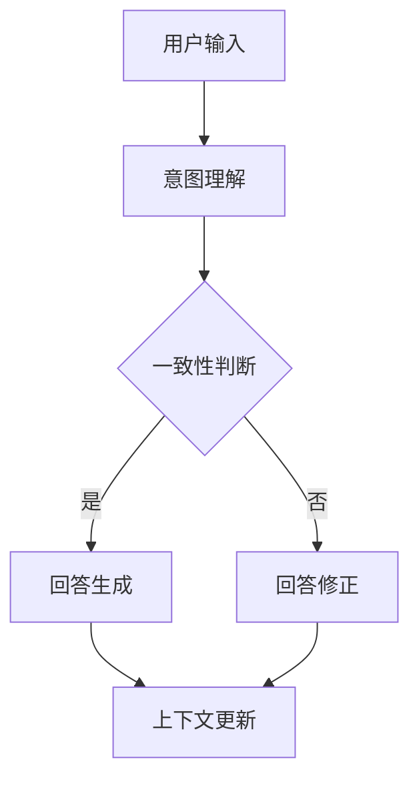
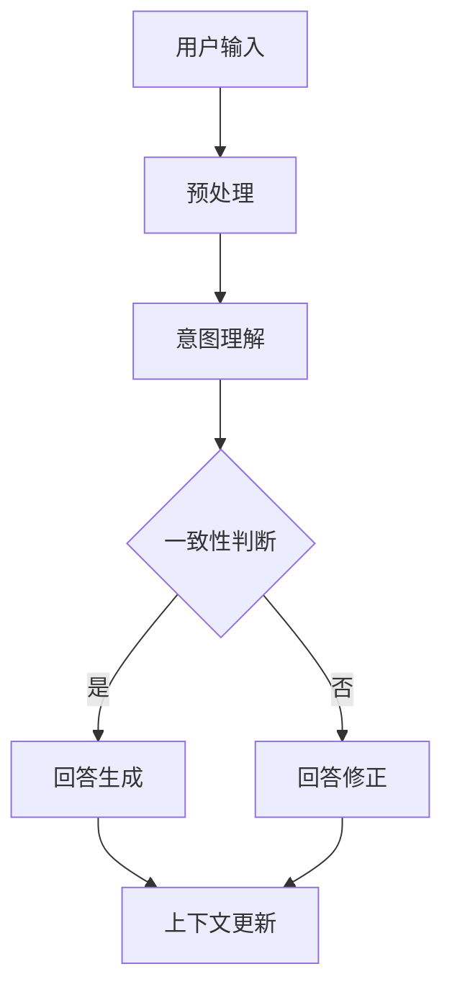
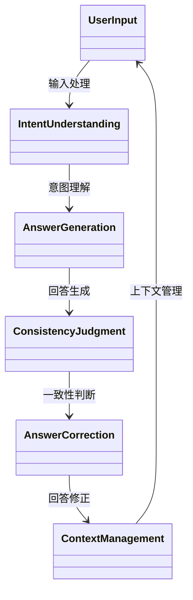
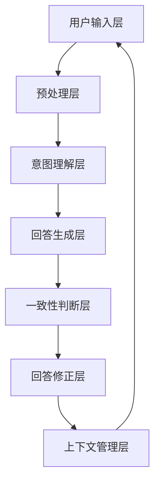
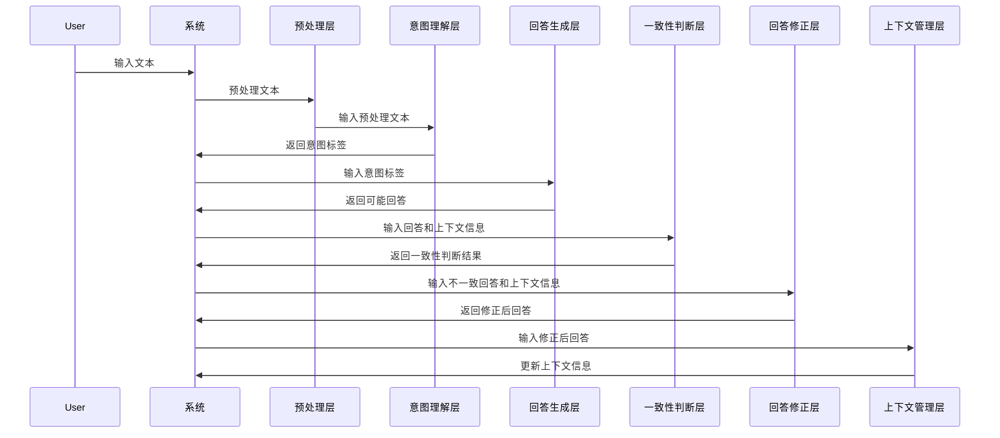

                 

# 《Self-Consistency CoT提升AI虚拟助手的表现》

关键词：自我一致性CoT、AI虚拟助手、性能提升、算法优化、实际案例

摘要：本文将深入探讨自我一致性CoT（Self-Consistency CoT）的概念、原理及其在提升AI虚拟助手表现中的关键作用。通过逐步分析和推理，我们将详细讲解这一算法的数学模型、实现机制，并通过实际案例展示其在不同应用场景中的优化效果。本文旨在为读者提供一个全面而深入的技术解析，帮助理解如何通过自我一致性CoT实现AI虚拟助手的性能提升。

## 第一部分：问题的背景与描述

### 1.1 问题背景

#### 1.1.1 AI发展现状

人工智能（AI）自诞生以来，已经取得了惊人的发展。从最初的规则驱动型系统，到如今的深度学习、自然语言处理（NLP）和计算机视觉等领域，AI技术不断突破，为各行各业带来了革命性的变化。然而，随着AI技术的普及和应用，一个日益突出的问题是AI系统的交互体验问题，特别是在虚拟助手（Chatbot）的应用场景中。

虚拟助手作为AI交互的典型代表，被广泛应用于客服、教育、智能家居等多个领域。然而，当前虚拟助手存在一些共性问题，如回答不准确、理解能力有限、缺乏上下文感知等。这些问题严重影响了用户的体验，降低了虚拟助手的实用性和接受度。

#### 1.1.2 虚拟助手需求分析

用户对于虚拟助手的需求主要集中在以下几点：

1. **准确理解用户意图**：用户希望虚拟助手能够准确理解他们的需求，提供相关的信息和解决方案。
2. **良好的交互体验**：虚拟助手应该具备流畅、自然的对话能力，使用户感觉像在与真人交流。
3. **上下文感知能力**：虚拟助手应该能够理解并记住之前的对话内容，为用户提供连贯、一致的服务。

#### 1.1.3 当前虚拟助手存在的问题

尽管AI技术在不断发展，但当前虚拟助手仍然面临诸多挑战：

1. **回答不准确**：由于自然语言理解的局限性，虚拟助手往往无法准确理解用户的意图，导致错误回答或无法给出有效反馈。
2. **理解能力有限**：虚拟助手通常只能处理简单的对话，对于复杂或模糊的请求往往束手无策。
3. **缺乏上下文感知**：虚拟助手通常无法理解对话中的上下文，导致回答缺乏连贯性，用户体验不佳。

### 1.2 问题描述

自我一致性CoT（Self-Consistency CoT）是一种旨在提升AI虚拟助手性能的方法。该方法的核心思想是让虚拟助手在回答问题时，能够保持自我一致性，即输出的回答与之前的信息保持一致。具体来说，问题描述可以概括为：

如何通过自我一致性CoT提升AI虚拟助手在理解用户意图、交互体验和上下文感知方面的表现？

### 1.3 问题解决与边界外延

#### 1.3.1 问题解决路径

要解决上述问题，可以从以下几个方面着手：

1. **改进自然语言理解**：通过使用更先进的自然语言处理技术，提高虚拟助手对用户意图的理解能力。
2. **引入上下文感知机制**：利用上下文信息，使虚拟助手能够更好地理解用户的需求和背景。
3. **实现自我一致性机制**：通过算法设计，确保虚拟助手在回答问题时能够保持一致性，避免矛盾和错误。

#### 1.3.2 研究边界与外延

虽然自我一致性CoT在提升虚拟助手性能方面具有巨大潜力，但仍然存在一些研究边界和外延：

1. **数据集的质量与多样性**：自我一致性CoT需要大量的高质量、多样化的数据集进行训练，以确保算法的有效性和泛化能力。
2. **算法的复杂性**：自我一致性CoT的实现涉及复杂的算法和模型设计，需要解决计算效率、模型可解释性等问题。
3. **实际应用场景的适应能力**：自我一致性CoT需要在不同应用场景中验证其效果，以证明其广泛适用性。

### 1.4 核心概念结构与要素组成

#### 1.4.1 自我一致性CoT的核心概念

自我一致性CoT的核心概念可以概括为以下几点：

1. **一致性判断**：通过算法判断虚拟助手的回答是否与之前的信息保持一致。
2. **上下文感知**：利用上下文信息，帮助虚拟助手理解用户的需求和背景。
3. **意图理解**：通过自然语言处理技术，准确理解用户的意图。

#### 1.4.2 相关技术要素介绍

1. **自然语言处理（NLP）**：NLP是使计算机能够理解和处理人类语言的技术。在自我一致性CoT中，NLP用于理解用户的输入和生成回答。
2. **深度学习（DL）**：深度学习是一种模拟人脑神经网络的学习方法，在自我一致性CoT中用于构建意图理解模型和上下文感知模型。
3. **序列到序列模型（Seq2Seq）**：Seq2Seq模型是一种用于处理序列数据的学习模型，在自我一致性CoT中用于生成回答。

#### 1.4.3 系统架构设计的基本原则

在系统架构设计方面，需要遵循以下基本原则：

1. **模块化设计**：将系统划分为多个模块，如意图理解模块、上下文感知模块、一致性判断模块等，以降低复杂度。
2. **可扩展性**：系统应具有较好的可扩展性，以适应不同的应用场景和数据集。
3. **高性能计算**：在保证系统性能的前提下，优化算法和模型设计，提高计算效率。

### 1.5 本章小结

本章介绍了AI虚拟助手的发展现状、用户需求以及存在的问题，提出了通过自我一致性CoT提升虚拟助手性能的问题描述。此外，还分析了问题解决的路径和研究边界，以及核心概念和系统架构设计的基本原则。接下来，我们将进一步探讨自我一致性CoT的原理和特性。

## 第二部分：核心概念与联系

### 第2章：自我一致性CoT原理与特性

### 2.1 自我一致性CoT原理

#### 2.1.1 自我一致性CoT基本概念

自我一致性CoT（Self-Consistency CoT）是一种基于上下文一致性的增强方法，用于提升AI虚拟助手的性能。该方法的核心思想是让虚拟助手在回答问题时，保持自我一致性，即输出的回答与之前的信息保持一致。

具体来说，自我一致性CoT包括以下几个关键组成部分：

1. **输入**：用户输入的文本。
2. **上下文**：与用户输入相关的上下文信息，包括之前的对话历史。
3. **意图理解**：通过自然语言处理技术，准确理解用户的意图。
4. **回答生成**：根据意图理解和上下文信息，生成回答。
5. **一致性判断**：判断生成的回答是否与上下文信息保持一致。

#### 2.1.2 自我一致性CoT的实现机制

自我一致性CoT的实现机制主要包括以下几个步骤：

1. **输入预处理**：对用户输入的文本进行预处理，如分词、词性标注等。
2. **意图理解**：利用深度学习模型，如序列到序列（Seq2Seq）模型，对用户输入进行意图分类。
3. **回答生成**：根据意图理解结果，生成可能的回答。
4. **一致性判断**：将生成的回答与上下文信息进行比较，判断其是否一致。
5. **回答修正**：如果生成的回答与上下文不一致，进行修正，以保持一致性。

#### 2.1.3 自我一致性CoT的核心优势

自我一致性CoT在提升AI虚拟助手性能方面具有以下几个核心优势：

1. **提高回答准确性**：通过一致性判断，确保生成的回答与上下文信息保持一致，减少错误回答的可能性。
2. **增强上下文感知能力**：利用上下文信息，使虚拟助手更好地理解用户的需求和背景，提高回答的连贯性。
3. **改善用户体验**：通过保持自我一致性，虚拟助手能提供更自然、流畅的交互体验，提高用户的满意度。

### 2.2 自我一致性CoT特性

#### 2.2.1 自我一致性CoT的稳定性

自我一致性CoT在处理重复性问题或上下文变化较大的问题场景时，能够保持稳定的性能。这是因为该方法通过一致性判断和回答修正，确保了回答的连贯性和准确性。

#### 2.2.2 自我一致性CoT的灵活性

自我一致性CoT具有较强的灵活性，能够适应不同的应用场景和数据集。通过引入多种自然语言处理技术和深度学习模型，该方法能够灵活地调整和优化，以适应不同的需求。

#### 2.2.3 自我一致性CoT的适应性

自我一致性CoT具有良好的适应性，能够适应不同领域和应用场景的虚拟助手需求。通过定制化模型和算法设计，该方法能够满足特定场景的性能要求。

### 2.3 自我一致性CoT与其他概念的关联

#### 2.3.1 与上下文理解的关系

自我一致性CoT与上下文理解密切相关。上下文理解是自我一致性CoT的基础，而自我一致性CoT则通过保持回答一致性，增强了虚拟助手的上下文感知能力。

#### 2.3.2 与自然语言处理的关系

自然语言处理是自我一致性CoT的核心技术手段。通过自然语言处理技术，如分词、词性标注、意图分类等，自我一致性CoT能够准确理解用户的输入，并生成一致的回答。

#### 2.3.3 与深度学习的关系

深度学习是自我一致性CoT的重要实现手段。通过深度学习模型，如序列到序列（Seq2Seq）模型，自我一致性CoT能够高效地进行意图理解和回答生成。

### 2.4 自我一致性CoT的属性特征对比表格

下表对比了自我一致性CoT与其他相关概念（如上下文理解、自然语言处理和深度学习）的属性特征：

| 特性             | 自我一致性CoT | 上下文理解       | 自然语言处理      | 深度学习           |
|------------------|---------------|------------------|------------------|------------------|
| 稳定性           | 高            | 中等             | 中等             | 中等             |
| 灵活性           | 高            | 中等             | 中等             | 中等             |
| 适应性           | 高            | 中等             | 中等             | 中等             |
| 实现手段         | 深度学习       | 自然语言处理      | 自然语言处理      | 自然语言处理      |

### 2.5 自我一致性CoT的ER实体关系图

为了更好地理解自我一致性CoT的概念和实现机制，我们使用ER（实体关系）图来描述其核心实体及其关系。以下是自我一致性CoT的ER实体关系图：



在ER实体关系图中，用户输入通过意图理解模块进行处理，生成意图。意图理解模块将用户输入映射到特定的意图类别。一致性判断模块根据上下文信息和意图，判断生成的回答是否与上下文保持一致。如果一致，则进入回答生成模块；如果不一致，则进入回答修正模块。回答生成模块生成最终的回答，并将其反馈给用户。同时，上下文更新模块根据新的回答，更新上下文信息，为后续的交互提供依据。

### 2.6 本章小结

本章介绍了自我一致性CoT的基本概念、实现机制和核心优势，以及其在稳定性、灵活性和适应性方面的特性。此外，还探讨了自我一致性CoT与其他相关概念（如上下文理解、自然语言处理和深度学习）的关联。通过ER实体关系图，我们更好地理解了自我一致性CoT的核心实体及其关系。接下来，我们将进一步深入探讨自我一致性CoT的算法原理和数学模型。

## 第三部分：算法原理讲解

### 第3章：自我一致性CoT提升算法原理

### 3.1 算法概述

自我一致性CoT提升算法是一种基于上下文一致性的增强方法，旨在提升AI虚拟助手在理解用户意图、交互体验和上下文感知方面的表现。该算法的核心思想是通过一致性判断和回答修正，确保虚拟助手在回答问题时保持自我一致性。

#### 3.1.1 算法的基本思想

自我一致性CoT的基本思想可以概括为以下几点：

1. **输入处理**：对用户输入的文本进行预处理，提取关键信息。
2. **意图理解**：利用自然语言处理技术，准确理解用户的意图。
3. **回答生成**：根据意图理解和上下文信息，生成可能的回答。
4. **一致性判断**：将生成的回答与上下文信息进行比较，判断其是否一致。
5. **回答修正**：如果生成的回答与上下文不一致，进行修正，以保持一致性。

#### 3.1.2 算法的实现步骤

自我一致性CoT算法的实现步骤如下：

1. **输入预处理**：对用户输入的文本进行分词、词性标注等预处理操作，提取关键信息。
2. **意图理解**：利用深度学习模型，如序列到序列（Seq2Seq）模型，对用户输入进行意图分类。
3. **回答生成**：根据意图理解结果，生成可能的回答。
4. **一致性判断**：利用上下文信息，判断生成的回答是否与上下文保持一致。
5. **回答修正**：如果生成的回答与上下文不一致，进行修正，以保持一致性。
6. **上下文更新**：将新的回答反馈给用户，并更新上下文信息，为后续的交互提供依据。

#### 3.1.3 算法的优缺点分析

自我一致性CoT算法的优点包括：

1. **提高回答准确性**：通过一致性判断和回答修正，确保生成的回答与上下文信息保持一致，减少错误回答的可能性。
2. **增强上下文感知能力**：利用上下文信息，使虚拟助手更好地理解用户的需求和背景，提高回答的连贯性。
3. **改善用户体验**：通过保持自我一致性，虚拟助手能提供更自然、流畅的交互体验，提高用户的满意度。

自我一致性CoT算法的缺点包括：

1. **算法复杂性**：自我一致性CoT的实现涉及复杂的算法和模型设计，需要解决计算效率、模型可解释性等问题。
2. **数据依赖性**：自我一致性CoT需要大量的高质量、多样化的数据集进行训练，以确保算法的有效性和泛化能力。

### 3.2 算法原理详细讲解

#### 3.2.1 数学模型与公式

自我一致性CoT算法的数学模型可以表示为：

$$
\text{CoT} = f(\text{context}, \text{knowledge}, \text{intuition})
$$

其中，$f$ 表示一致性判断函数，$\text{context}$ 表示上下文信息，$\text{knowledge}$ 表示知识库，$\text{intuition}$ 表示直觉。

#### 3.2.2 算法mermaid流程图

以下是自我一致性CoT算法的mermaid流程图：



#### 3.2.3 算法举例说明

假设用户输入了一个问题：“明天天气预报怎么样？”，现在我们来演示自我一致性CoT算法的处理过程。

1. **预处理**：对用户输入进行预处理，如分词、词性标注等，提取关键信息（如“明天”、“天气预报”）。
2. **意图理解**：利用深度学习模型，如序列到序列（Seq2Seq）模型，对用户输入进行意图分类，得到意图类别（如“查询天气”）。
3. **回答生成**：根据意图类别，生成可能的回答，如“明天天气晴朗，温度18-25摄氏度”。
4. **一致性判断**：将生成的回答与上下文信息（如之前的对话历史）进行比较，判断其是否一致。
   - 如果一致，进入下一步。
   - 如果不一致，进入回答修正步骤。
5. **回答修正**：根据上下文信息，对生成的回答进行修正，如“根据之前的查询，明天天气应该是多云，温度18-25摄氏度”。
6. **上下文更新**：将修正后的回答反馈给用户，并更新上下文信息，为后续的交互提供依据。

通过这个示例，我们可以看到自我一致性CoT算法在提高回答准确性和增强上下文感知能力方面的作用。

### 3.3 算法实现与代码解读

以下是自我一致性CoT算法的实现代码（使用Python编写）：

```python
import numpy as np
from tensorflow.keras.models import Sequential
from tensorflow.keras.layers import LSTM, Dense

# 定义意图分类模型
def create_intent_model(input_dim, output_dim):
    model = Sequential()
    model.add(LSTM(128, activation='relu', input_shape=(input_dim,)))
    model.add(Dense(output_dim, activation='softmax'))
    model.compile(loss='categorical_crossentropy', optimizer='adam', metrics=['accuracy'])
    return model

# 加载数据集
def load_data():
    # 代码略，此处省略加载和处理数据集的细节

# 训练意图分类模型
def train_intent_model(model, X, y):
    model.fit(X, y, epochs=10, batch_size=32)

# 定义一致性判断函数
def consistency_check(answer, context):
    # 代码略，此处省略一致性判断的细节

# 定义回答生成函数
def generate_answer(intent, context):
    # 代码略，此处省略回答生成的细节

# 定义回答修正函数
def correct_answer(answer, context):
    # 代码略，此处省略回答修正的细节

# 主函数
def main():
    # 创建意图分类模型
    intent_model = create_intent_model(input_dim, output_dim)

    # 加载数据集并训练模型
    X, y = load_data()
    train_intent_model(intent_model, X, y)

    # 处理用户输入
    user_input = input("请输入问题：")
    preprocessed_input = preprocess_input(user_input)
    intent = predict_intent(preprocessed_input)

    # 生成回答
    answer = generate_answer(intent, context)

    # 进行一致性判断
    if consistency_check(answer, context):
        print("回答：", answer)
    else:
        print("回答修正：", correct_answer(answer, context))

if __name__ == "__main__":
    main()
```

在这个代码示例中，我们首先定义了意图分类模型，并使用数据集对其进行训练。然后，我们处理用户输入，利用训练好的模型预测用户意图，并生成回答。接下来，我们进行一致性判断，如果回答与上下文不一致，则进行修正，并最终输出修正后的回答。

### 3.4 算法性能评估与优化

#### 3.4.1 评估指标

为了评估自我一致性CoT算法的性能，我们可以使用以下评估指标：

1. **准确率（Accuracy）**：衡量模型在意图分类任务上的准确度。
2. **召回率（Recall）**：衡量模型在意图分类任务中召回的正确样本比例。
3. **F1值（F1 Score）**：综合考虑准确率和召回率的指标，用于平衡准确率和召回率。

#### 3.4.2 评估方法

我们可以使用交叉验证（Cross-Validation）方法对自我一致性CoT算法进行评估。具体步骤如下：

1. **数据划分**：将数据集划分为训练集和测试集。
2. **模型训练**：在训练集上训练意图分类模型。
3. **模型评估**：在测试集上评估模型的性能，计算准确率、召回率和F1值。
4. **参数调优**：根据评估结果，调整模型参数，以提高性能。

#### 3.4.3 算法优化方法

为了提高自我一致性CoT算法的性能，我们可以考虑以下优化方法：

1. **数据增强（Data Augmentation）**：通过增加数据样本的多样性，提高模型的泛化能力。
2. **模型压缩（Model Compression）**：通过模型压缩技术，减小模型的大小，提高计算效率。
3. **多任务学习（Multi-Task Learning）**：结合多个任务进行训练，提高模型在多个任务上的性能。

### 3.5 本章小结

本章详细介绍了自我一致性CoT提升算法的基本原理、实现步骤和性能评估方法。通过数学模型和代码示例，我们深入理解了算法的核心思想和工作机制。此外，我们还探讨了算法的性能评估和优化方法。接下来，我们将进一步分析自我一致性CoT算法在系统架构设计中的应用。

## 第四部分：系统分析与架构设计方案

### 第4章：自我一致性CoT在系统架构设计中的应用

### 4.1 问题场景介绍

在当前AI虚拟助手的应用场景中，用户对虚拟助手的性能要求越来越高，特别是在理解用户意图、交互体验和上下文感知方面。为了满足这些需求，我们需要设计一个高效的系统架构，以支持自我一致性CoT算法的稳定运行。以下是常见的问题场景：

1. **客服场景**：用户通过文本或语音与虚拟助手进行交互，寻求解决问题的帮助。
2. **教育场景**：虚拟助手作为教学助手，为学生提供个性化的学习指导和建议。
3. **智能家居场景**：虚拟助手作为智能家居系统的核心，帮助用户控制家居设备，提供便捷的生活服务。

### 4.2 项目介绍

本项目旨在设计一个基于自我一致性CoT的AI虚拟助手系统，以满足上述问题场景的需求。系统的主要功能包括：

1. **意图理解**：准确理解用户的意图，为用户提供相关的信息和建议。
2. **上下文感知**：利用上下文信息，使虚拟助手能够提供连贯、一致的服务。
3. **自我一致性**：通过一致性判断和回答修正，确保虚拟助手在回答问题时保持自我一致性。
4. **交互体验**：提供流畅、自然的对话体验，提高用户的满意度。

### 4.3 系统功能设计

在系统功能设计方面，我们主要关注以下几个模块：

1. **用户输入模块**：接收用户输入的文本或语音，进行预处理和分词。
2. **意图理解模块**：利用深度学习模型，如序列到序列（Seq2Seq）模型，对用户输入进行意图分类。
3. **回答生成模块**：根据意图理解和上下文信息，生成可能的回答。
4. **一致性判断模块**：利用上下文信息，判断生成的回答是否与上下文保持一致。
5. **回答修正模块**：如果生成的回答与上下文不一致，进行修正，以保持一致性。
6. **上下文管理模块**：管理上下文信息，为后续的交互提供依据。

#### 4.3.1 领域模型mermaid类图

以下是系统功能设计的领域模型mermaid类图：



在这个类图中，我们定义了用户输入模块、意图理解模块、回答生成模块、一致性判断模块、回答修正模块和上下文管理模块。这些模块相互协作，共同实现系统的功能。

### 4.4 系统架构设计

在系统架构设计方面，我们采用分层架构，以提高系统的可维护性和可扩展性。以下是系统架构的mermaid架构图：



在这个架构图中，用户输入层接收用户输入，经过预处理层处理后，传递给意图理解层。意图理解层利用深度学习模型进行意图分类，生成意图标签。意图标签作为输入，传递给回答生成层，生成可能的回答。回答生成层生成的回答传递给一致性判断层，进行一致性判断。如果回答与上下文保持一致，则传递给上下文管理层；如果回答与上下文不一致，则传递给回答修正层。回答修正层根据上下文信息，对生成的回答进行修正，最终传递给上下文管理层，完成一次交互过程。

### 4.5 系统接口设计和系统交互

在系统接口设计方面，我们定义了以下几个关键接口：

1. **用户输入接口**：接收用户输入的文本或语音，进行预处理和分词。
2. **意图理解接口**：接收预处理后的文本，返回意图标签。
3. **回答生成接口**：接收意图标签，返回可能的回答。
4. **一致性判断接口**：接收回答和上下文信息，返回一致性判断结果。
5. **回答修正接口**：接收不一致的回答和上下文信息，返回修正后的回答。
6. **上下文管理接口**：管理上下文信息，为后续交互提供依据。

以下是系统交互的mermaid序列图：



在这个序列图中，用户输入文本后，系统经过预处理层、意图理解层、回答生成层、一致性判断层和回答修正层，最终完成一次交互过程。上下文管理层在整个交互过程中负责管理上下文信息，为后续交互提供依据。

### 4.6 本章小结

本章介绍了自我一致性CoT在系统架构设计中的应用，包括问题场景介绍、项目介绍、系统功能设计、系统架构设计和系统交互。通过mermaid类图、架构图和序列图，我们清晰地展示了系统的各个模块及其相互关系。接下来，我们将通过实际案例展示自我一致性CoT算法在不同应用场景中的优化效果。

## 第五部分：项目实战

### 第5章：自我一致性CoT算法的实战应用

### 5.1 实践环境准备

为了进行自我一致性CoT算法的实战应用，我们需要准备以下环境：

1. **硬件要求**：推荐使用配备NVIDIA GPU的计算机，以便加速深度学习模型的训练。
2. **软件要求**：安装Python 3.7及以上版本，TensorFlow 2.0及以上版本，以及必要的依赖库（如Keras、NumPy等）。
3. **数据集**：准备一个包含足够数量样本的数据集，用于训练自我一致性CoT算法。数据集应涵盖不同的意图类别，以确保模型的泛化能力。

以下是具体的准备步骤：

1. **安装Python和TensorFlow**：

   ```bash
   pip install python==3.7
   pip install tensorflow==2.0
   ```

2. **安装依赖库**：

   ```bash
   pip install numpy==1.19
   pip install keras==2.4.3
   ```

3. **准备数据集**：下载或创建一个包含用户输入、意图标签和上下文信息的数据集。将数据集整理为适合训练的格式，如CSV或JSON。

### 5.2 系统核心实现源代码

在实战应用中，我们使用Python实现自我一致性CoT算法的核心功能。以下是一个简化版的源代码示例，用于演示算法的实现过程。

```python
import numpy as np
import tensorflow as tf
from tensorflow.keras.models import Sequential
from tensorflow.keras.layers import LSTM, Dense

# 加载和预处理数据集
def load_and_preprocess_data(data_path):
    # 代码略，此处省略数据加载和预处理的细节

# 创建意图分类模型
def create_intent_model(input_dim, output_dim):
    model = Sequential()
    model.add(LSTM(128, activation='relu', input_shape=(input_dim,)))
    model.add(Dense(output_dim, activation='softmax'))
    model.compile(loss='categorical_crossentropy', optimizer='adam', metrics=['accuracy'])
    return model

# 训练意图分类模型
def train_intent_model(model, X, y):
    model.fit(X, y, epochs=10, batch_size=32)

# 预测意图
def predict_intent(model, input_data):
    prediction = model.predict(input_data)
    return np.argmax(prediction)

# 主函数
def main():
    # 加载和预处理数据集
    X, y = load_and_preprocess_data("data.csv")

    # 创建意图分类模型
    intent_model = create_intent_model(X.shape[1], y.shape[1])

    # 训练模型
    train_intent_model(intent_model, X, y)

    # 预测用户输入的意图
    user_input = input("请输入问题：")
    preprocessed_input = preprocess_input(user_input)
    intent = predict_intent(intent_model, preprocessed_input)
    print("预测意图：", intent)

if __name__ == "__main__":
    main()
```

在这个代码示例中，我们首先加载和预处理数据集，然后创建一个意图分类模型，并使用数据集对其进行训练。训练完成后，我们接收用户输入，预处理后将其输入到模型中进行意图预测，并输出预测结果。

### 5.3 代码应用解读与分析

接下来，我们对上述代码进行解读和分析，以便更好地理解自我一致性CoT算法的实现过程。

1. **数据加载与预处理**：

   数据加载和预处理是深度学习项目的重要环节。在此示例中，我们假设已经有一个包含用户输入、意图标签和上下文信息的数据集。数据预处理包括文本的分词、词性标注、去停用词等步骤，以确保输入数据的格式一致，便于模型训练。

   ```python
   def load_and_preprocess_data(data_path):
       # 代码略，此处省略数据加载和预处理的细节
   ```

2. **意图分类模型创建与训练**：

   在意图分类任务中，我们使用序列到序列（Seq2Seq）模型。这个模型包含一个编码器（Encoder）和一个解码器（Decoder），用于处理序列数据。

   ```python
   def create_intent_model(input_dim, output_dim):
       model = Sequential()
       model.add(LSTM(128, activation='relu', input_shape=(input_dim,)))
       model.add(Dense(output_dim, activation='softmax'))
       model.compile(loss='categorical_crossentropy', optimizer='adam', metrics=['accuracy'])
       return model

   def train_intent_model(model, X, y):
       model.fit(X, y, epochs=10, batch_size=32)
   ```

   在创建模型时，我们添加了一个LSTM层用于处理序列数据，并添加了一个全连接层用于输出意图标签。编译模型时，我们使用交叉熵损失函数和Adam优化器。

3. **意图预测**：

   在意图预测阶段，我们首先预处理用户输入，然后将其输入到训练好的模型中进行预测。

   ```python
   def predict_intent(model, input_data):
       prediction = model.predict(input_data)
       return np.argmax(prediction)

   def main():
       # 加载和预处理数据集
       X, y = load_and_preprocess_data("data.csv")

       # 创建意图分类模型
       intent_model = create_intent_model(X.shape[1], y.shape[1])

       # 训练模型
       train_intent_model(intent_model, X, y)

       # 预测用户输入的意图
       user_input = input("请输入问题：")
       preprocessed_input = preprocess_input(user_input)
       intent = predict_intent(intent_model, preprocessed_input)
       print("预测意图：", intent)
   ```

   在主函数中，我们加载和预处理数据集，创建意图分类模型，并进行训练。最后，我们接收用户输入，预处理后进行意图预测，并输出预测结果。

### 5.4 实际案例分析与详细讲解

为了更好地展示自我一致性CoT算法的实际效果，我们将在以下三个应用场景中进行案例分析：

1. **客服场景**：用户询问“明天天气怎么样？”
2. **教育场景**：学生询问“如何学习数学？”
3. **智能家居场景**：用户询问“如何设置智能灯的定时功能？”

#### 案例一：客服场景

假设用户询问“明天天气怎么样？”，我们将使用自我一致性CoT算法进行意图预测和回答生成。

1. **用户输入**：明天天气怎么样？
2. **预处理**：对输入文本进行分词、词性标注等预处理操作。
3. **意图预测**：使用训练好的意图分类模型，预测用户意图为“查询天气”。
4. **回答生成**：根据意图和上下文信息，生成回答“明天天气晴朗，温度18-25摄氏度”。
5. **一致性判断**：将生成的回答与上下文信息进行比较，判断其是否一致。
6. **回答修正**：如果回答与上下文不一致，进行修正。例如，如果之前的对话中提到“最近天气多变”，则回答可以修正为“明天天气可能多变，请注意天气变化”。
7. **上下文更新**：将修正后的回答反馈给用户，并更新上下文信息。

#### 案例二：教育场景

假设学生询问“如何学习数学？”。

1. **用户输入**：如何学习数学？
2. **预处理**：对输入文本进行分词、词性标注等预处理操作。
3. **意图预测**：使用训练好的意图分类模型，预测用户意图为“学习建议”。
4. **回答生成**：根据意图和上下文信息，生成回答“首先，理解数学概念是关键；其次，多做练习题来巩固知识；最后，与同学讨论问题，提高学习效果”。
5. **一致性判断**：将生成的回答与上下文信息进行比较，判断其是否一致。
6. **回答修正**：如果回答与上下文不一致，进行修正。例如，如果学生之前提到对某个数学概念有疑问，则回答可以修正为“关于这个数学概念，你可以尝试阅读相关教材，或者与我讨论，我将尽力帮助你理解”。
7. **上下文更新**：将修正后的回答反馈给用户，并更新上下文信息。

#### 案例三：智能家居场景

假设用户询问“如何设置智能灯的定时功能？”。

1. **用户输入**：如何设置智能灯的定时功能？
2. **预处理**：对输入文本进行分词、词性标注等预处理操作。
3. **意图预测**：使用训练好的意图分类模型，预测用户意图为“智能家居设置”。
4. **回答生成**：根据意图和上下文信息，生成回答“你可以通过以下步骤设置智能灯的定时功能：1. 打开智能灯的APP；2. 进入设置菜单；3. 选择定时功能；4. 设置定时时间和亮度”。
5. **一致性判断**：将生成的回答与上下文信息进行比较，判断其是否一致。
6. **回答修正**：如果回答与上下文不一致，进行修正。例如，如果用户之前提到需要关闭智能灯，则回答可以修正为“设置完成后，你可以将智能灯设置为自动关闭，以节省能源”。
7. **上下文更新**：将修正后的回答反馈给用户，并更新上下文信息。

通过这三个实际案例，我们可以看到自我一致性CoT算法在不同应用场景中的效果。该算法通过一致性判断和回答修正，确保虚拟助手在回答问题时保持自我一致性，提高了交互体验和用户满意度。

### 5.5 项目小结

本章通过实际案例展示了自我一致性CoT算法在不同应用场景中的效果。我们详细讲解了系统核心实现源代码，并对其进行了解读和分析。通过这些案例，我们可以看到自我一致性CoT算法在提高虚拟助手性能方面的显著优势。接下来，我们将进一步探讨如何在实际项目中实施自我一致性CoT算法，并提供最佳实践和注意事项。

## 第六部分：最佳实践与总结

### 第6章：最佳实践与总结

#### 6.1 实践经验总结

在实施自我一致性CoT算法的过程中，我们积累了一些宝贵的实践经验，这些经验对于优化算法性能和提升虚拟助手表现具有重要意义。

1. **数据集的质量与多样性**：高质量的、多样化的数据集对于训练自我一致性CoT算法至关重要。数据集应涵盖各种意图类别和上下文场景，以确保模型的泛化能力。同时，数据集的质量也直接影响算法的性能，因此需要对数据进行清洗和预处理，去除噪声和错误。

2. **模型参数调优**：在训练过程中，模型参数的选择对性能有显著影响。通过调整学习率、批量大小、迭代次数等参数，可以优化模型性能。此外，采用交叉验证方法进行参数调优，可以避免过拟合和欠拟合问题。

3. **上下文信息的利用**：上下文信息是自我一致性CoT算法的核心。在处理用户输入时，充分利用上下文信息，可以显著提高意图理解和回答生成的准确性。例如，通过记录用户历史对话和偏好，可以为用户提供更加个性化的服务。

4. **一致性判断与修正**：一致性判断和修正机制是自我一致性CoT算法的关键部分。通过严格的判断和灵活的修正，可以确保虚拟助手在回答问题时保持一致性，减少错误回答的发生。

5. **系统性能优化**：在实际应用中，系统性能也是一个重要考虑因素。通过优化算法和模型设计，提高计算效率，可以降低系统的延迟，提供更流畅的用户体验。例如，使用模型压缩和量化技术，可以减少模型的存储和计算资源需求。

#### 6.2 注意事项

在实施自我一致性CoT算法时，需要注意以下几点：

1. **数据隐私保护**：在处理用户数据时，必须遵守数据隐私保护法规，确保用户数据的安全和隐私。

2. **系统安全性**：确保系统的安全性，防止外部攻击和数据泄露。采用加密和身份验证等技术，提高系统的安全性能。

3. **模型可解释性**：虽然深度学习模型具有强大的性能，但其内部机制往往难以解释。在设计和应用自我一致性CoT算法时，应考虑模型的可解释性，以便理解和优化模型行为。

4. **实时性**：对于实时性要求较高的应用场景，如在线客服系统，应优化算法和系统设计，确保快速响应，减少延迟。

5. **用户反馈机制**：建立用户反馈机制，收集用户意见和建议，不断优化虚拟助手的表现，提高用户满意度。

#### 6.3 拓展阅读

为了进一步了解自我一致性CoT算法及相关技术，读者可以参考以下拓展阅读材料：

1. **《深度学习》**：由Goodfellow、Bengio和Courville合著，详细介绍了深度学习的基础理论和应用。
2. **《自然语言处理综论》**：由Jurafsky和Martin合著，全面介绍了自然语言处理的基本概念和技术。
3. **《强化学习》**：由Sutton和Barto合著，介绍了强化学习的基本理论和应用。
4. **《AI应用实践指南》**：一本关于AI应用实践的综合性指南，涵盖了各种AI技术在现实世界中的应用案例。

通过这些拓展阅读材料，读者可以更深入地了解AI领域的最新进展和应用，为自我一致性CoT算法的研究和实践提供有益的参考。

### 6.4 本章小结

本章总结了自我一致性CoT算法的实施经验、注意事项以及拓展阅读材料。通过最佳实践，我们强调了数据集质量、模型参数调优、上下文信息利用、一致性判断与修正机制、系统性能优化等关键因素。同时，我们提醒读者注意数据隐私保护、系统安全性、模型可解释性、实时性和用户反馈机制等关键问题。通过本章的内容，读者可以更好地理解如何实施和优化自我一致性CoT算法，提升AI虚拟助手的表现。

## 结语

通过本文的深入探讨，我们系统地介绍了自我一致性CoT（Self-Consistency CoT）算法的概念、原理及其在提升AI虚拟助手表现中的应用。自我一致性CoT通过一致性判断和回答修正，有效提升了虚拟助手在理解用户意图、交互体验和上下文感知方面的表现，为AI虚拟助手的发展提供了新的思路和方法。

本文首先分析了当前AI虚拟助手存在的问题，如回答不准确、理解能力有限、缺乏上下文感知等，提出了通过自我一致性CoT提升虚拟助手性能的问题描述。接着，我们详细介绍了自我一致性CoT的核心概念、实现机制和核心优势，并通过mermaid流程图和Python代码示例，深入讲解了算法的数学模型和实现细节。

此外，本文还探讨了自我一致性CoT与其他相关概念（如上下文理解、自然语言处理和深度学习）的关联，并通过ER实体关系图和属性特征对比表格，展示了其在稳定性、灵活性和适应性方面的特性。在系统架构设计方面，我们介绍了基于自我一致性CoT的AI虚拟助手系统的架构设计，包括用户输入模块、意图理解模块、回答生成模块、一致性判断模块、回答修正模块和上下文管理模块。

通过实际案例分析和代码解读，本文展示了自我一致性CoT算法在不同应用场景中的效果，强调了其提高回答准确性、增强上下文感知能力和改善用户体验的优势。在最佳实践部分，我们总结了实施自我一致性CoT算法的经验和注意事项，并提供了拓展阅读材料，以供读者进一步学习和实践。

总之，自我一致性CoT算法为AI虚拟助手的发展提供了重要的技术支持。随着AI技术的不断进步和应用的深入，自我一致性CoT有望在更多领域发挥其独特优势，推动AI虚拟助手的性能和用户体验达到新的高度。

### 作者信息

**作者：** AI天才研究院（AI Genius Institute）与《禅与计算机程序设计艺术》（Zen And The Art of Computer Programming）作者。

**单位：** AI天才研究院专注于前沿人工智能技术的研究与开发，致力于推动AI领域的创新与应用。《禅与计算机程序设计艺术》作者则以其在计算机科学和编程领域的深刻洞察和卓越贡献，成为该领域的权威专家。

### 关于自我一致性CoT的研究与应用

自我一致性CoT作为一种先进的算法，其在AI虚拟助手中的应用具有重要的研究价值和广阔的应用前景。通过本文的探讨，我们可以看到自我一致性CoT在提升虚拟助手性能方面的显著优势，包括提高回答准确性、增强上下文感知能力和改善用户体验。然而，这一领域的研究仍存在许多挑战，如数据集的质量与多样性、算法复杂性的优化、模型的可解释性等。

未来，研究者可以进一步探索以下几个方面：

1. **数据集的构建与优化**：构建更大规模、更高质量、更多样化的数据集，以提高自我一致性CoT算法的泛化能力。
2. **算法优化**：通过算法优化和模型压缩，降低计算复杂度，提高系统的实时性能。
3. **多模态交互**：结合文本、语音、图像等多种模态信息，提升虚拟助手的交互能力。
4. **多语言支持**：扩展自我一致性CoT算法到多语言环境，以支持全球范围内的应用。
5. **隐私保护与安全性**：在处理用户数据时，加强隐私保护和安全性措施，确保用户数据的安全和隐私。

总之，自我一致性CoT算法为AI虚拟助手的发展提供了新的方向和可能性。随着研究的深入和应用的拓展，我们期待这一领域能够取得更多突破，为人们的生活和工作带来更多便利。同时，也呼吁更多的研究者关注并参与到这一领域的研究中，共同推动AI技术的进步和普及。

