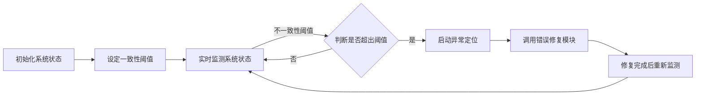
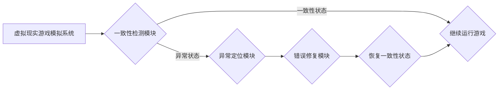
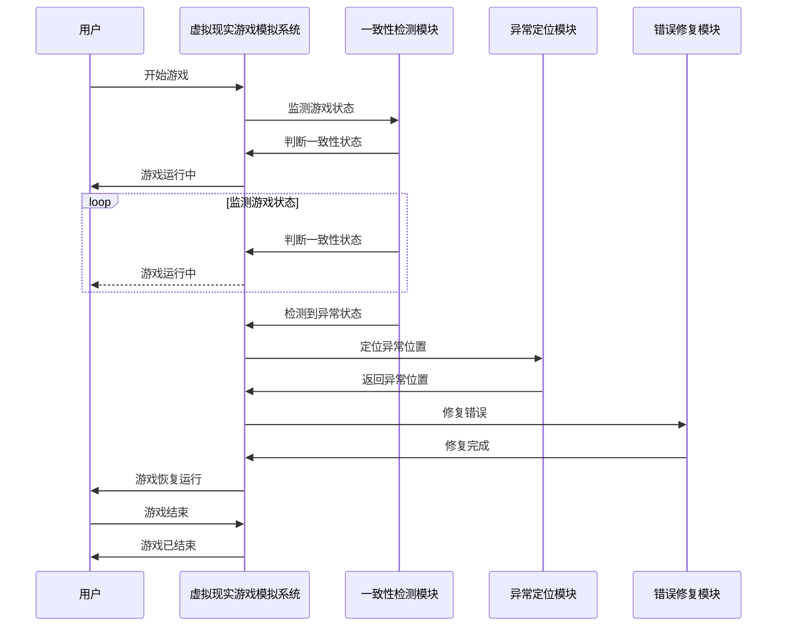

                 

# Self-Consistency CoT提升AI虚拟多元宇宙的自我修复能力

## 关键词
- 自一致性（Self-Consistency）
- AI虚拟多元宇宙（AI Virtual Multiverse）
- 自我修复能力（Self-Healing Ability）
- 一致性检测（Consistency Detection）
- 异常定位（Anomaly Localization）
- 错误修复（Error Repair）

## 摘要
本文深入探讨了如何通过自一致性概念（Self-Consistency CoT）提升人工智能（AI）虚拟多元宇宙的自我修复能力。我们首先介绍了虚拟多元宇宙的背景和自我修复能力的重要性，然后详细阐述了自一致性检测、异常定位和错误修复这三个核心要素。接着，我们对比分析了自一致性概念与其他相关概念的属性特征，并通过ER实体关系图架构进行了详细解释。文章最后，我们讲解了自一致性检测算法的原理，并使用mermaid流程图和Python代码进行了详细阐述。

### 1. 背景介绍

#### 1.1. 问题背景

随着人工智能技术的快速发展，虚拟多元宇宙（Virtual Multiverse）作为一种新兴的概念，正逐渐成为研究热点。虚拟多元宇宙是一种通过计算机模拟实现的复杂系统，它能够模拟现实世界的各种现象，并探索不同的可能性。虚拟多元宇宙的应用领域非常广泛，包括虚拟现实、游戏模拟、科学实验模拟等。

在虚拟多元宇宙的模拟过程中，自我修复能力是一个重要的问题。虚拟多元宇宙的复杂性决定了其内部可能存在的各种错误和异常。这些错误和异常可能会影响系统的正常运行，甚至导致系统崩溃。因此，提升虚拟多元宇宙的自我修复能力，对于确保系统的稳定性和可靠性具有重要意义。

#### 1.2. 问题描述

虚拟多元宇宙的自我修复能力，指的是系统在面对异常情况或错误时，能够自动检测、定位并修复问题，从而确保系统的正常运行。在虚拟多元宇宙中，由于复杂性和不确定性，错误和异常是不可避免的。因此，如何提升虚拟多元宇宙的自我修复能力成为一个重要的问题。

具体来说，虚拟多元宇宙的自我修复能力主要包括以下几个方面：

- **一致性检测**：实时监测系统的状态，判断系统是否处于一致性状态。如果检测到系统存在不一致性，则需要启动异常定位和错误修复机制。
- **异常定位**：在系统出现不一致性时，需要快速定位异常的具体位置，以便进行针对性的修复。
- **错误修复**：在定位到异常位置后，系统需要自动修复错误，以恢复一致性。

#### 1.3. 问题解决

为了提升虚拟多元宇宙的自我修复能力，研究者们提出了自一致性概念（Self-Consistency CoT）。自一致性概念的核心思想是通过维护系统的一致性，来提升系统的自我修复能力。具体来说，自一致性概念涉及到以下几个方面：

- **一致性检测**：通过实时监测系统的状态，判断系统是否处于一致性状态。如果检测到系统存在不一致性，则需要启动异常定位和错误修复机制。
- **异常定位**：在系统出现不一致性时，需要快速定位异常的具体位置，以便进行针对性的修复。
- **错误修复**：在定位到异常位置后，系统需要自动修复错误，以恢复一致性。

#### 1.4. 边界与外延

- **边界**：虚拟多元宇宙的自我修复能力主要关注在系统内部的错误修复，不包括外部环境的变化对系统的影响。
- **外延**：自一致性概念可以应用于各种类型的虚拟多元宇宙，包括虚拟现实、游戏模拟、科学实验模拟等。

#### 1.5. 概念结构与核心要素组成

- **概念结构**：自一致性概念由一致性检测、异常定位和错误修复三个核心要素组成。
- **核心要素组成**：

  - **一致性检测**：通过监测系统状态，判断系统是否处于一致性状态。
  - **异常定位**：在系统出现不一致性时，定位异常的具体位置。
  - **错误修复**：通过修复错误的代码或参数，恢复系统的一致性。

### 2. 核心概念与联系

#### 2.1. 自一致性概念原理

自一致性概念的核心思想是确保系统在任何时候都能保持内部状态的统一性和一致性。具体来说，自一致性概念包括以下几个方面的原理：

- **一致性检测**：通过实时监测系统的状态，判断系统是否处于一致性状态。如果检测到系统存在不一致性，则需要启动异常定位和错误修复机制。
- **异常定位**：当系统检测到不一致性时，需要快速定位异常的具体位置，以便进行针对性的修复。
- **错误修复**：在定位到异常位置后，系统需要自动修复错误，以恢复一致性。

#### 2.2. 概念属性特征对比表格

以下是自一致性概念与其他相关概念的属性特征对比表格：

| 概念           | 自一致性概念           | 异构一致性概念           | 全局一致性概念           |
| -------------- | ---------------------- | ---------------------- | ---------------------- |
| **核心思想**   | 确保系统内部状态的一致性 | 确保系统内部与外部状态的一致性 | 确保系统整体的一致性 |
| **检测方式**   | 实时监测系统状态       | 静态分析系统状态       | 全局监控系统状态       |
| **定位机制**   | 异常检测后快速定位     | 静态分析后定位         | 基于全局信息的定位     |
| **修复方式**   | 自动修复错误           | 需要人工介入修复       | 需要人工介入修复       |

#### 2.3. ER实体关系图架构

为了更好地理解自一致性概念，我们可以使用ER实体关系图来描述自一致性概念中的关键实体及其关系。

```
实体：系统、状态、异常、错误
关系：系统包含状态，状态可能导致异常，异常包含错误，错误需要被修复
```


### 3. 算法原理讲解

#### 3.1. 自一致性检测算法

**算法描述：**

1. 初始化系统状态。
2. 设定一致性阈值。
3. 在模拟运行过程中，实时监测系统状态。
4. 如果监测到系统状态与期望状态不一致，则判断是否超出一致性阈值。
5. 如果超出一致性阈值，则启动异常定位机制。
6. 异常定位成功后，调用错误修复模块进行错误修复。
7. 修复完成后，重新进入监测状态。

**算法原理讲解：**

自一致性检测算法的核心在于实时监测系统状态，并通过设定的一致性阈值来判断系统是否处于一致性状态。当系统状态与期望状态不一致且超出一致性阈值时，算法会启动异常定位机制。异常定位的成功依赖于系统对异常情况的敏感度和定位算法的精确度。一旦异常定位成功，算法会调用错误修复模块进行错误修复。错误修复的目的是恢复系统的一致性状态，从而确保系统的正常运行。

为了更好地理解自一致性检测算法，我们可以使用mermaid流程图和Python代码进行详细阐述。

**mermaid流程图：**



**Python代码：**

```python
def self_consistency_detection():
    # 初始化系统状态
    system_state = initialize_system_state()
    # 设定一致性阈值
    consistency_threshold = set_consistency_threshold()
    
    while True:
        # 实时监测系统状态
        current_state = monitor_system_state()
        
        # 判断是否超出一致性阈值
        if not is_within_threshold(current_state, consistency_threshold):
            # 启动异常定位
            anomaly_position = anomaly Localization()
            
            # 调用错误修复模块
            error_repair_module(anomaly_position)
            
            # 修复完成后重新监测
            system_state = monitor_system_state()
        else:
            # 重新监测
            continue
```

通过上述算法原理讲解，我们可以看到自一致性检测算法的核心在于实时监测系统状态，并通过设定的一致性阈值来判断系统是否处于一致性状态。当系统状态与期望状态不一致且超出一致性阈值时，算法会启动异常定位机制。异常定位成功后，算法会调用错误修复模块进行错误修复。错误修复的目的是恢复系统的一致性状态，从而确保系统的正常运行。

### 4. 系统分析与架构设计方案

#### 4.1. 问题场景介绍

在本案例中，我们将以一个虚拟现实游戏模拟系统为例，介绍如何使用自一致性概念提升系统的自我修复能力。

该虚拟现实游戏模拟系统的主要功能是模拟真实世界的游戏场景，包括玩家、游戏规则、场景环境等。在模拟过程中，系统需要实时监测游戏状态，以确保游戏运行的稳定性。然而，由于游戏场景的复杂性和不确定性，系统可能会出现各种错误和异常。因此，提升系统的自我修复能力，对于确保游戏的正常运行具有重要意义。

#### 4.2. 项目介绍

项目名称：虚拟现实游戏模拟系统自我修复能力提升

项目目标：通过自一致性概念，提升虚拟现实游戏模拟系统的自我修复能力。

项目范围：包括一致性检测、异常定位和错误修复三个核心模块。

#### 4.3. 系统功能设计

系统功能设计主要包括以下几个模块：

- **一致性检测模块**：实时监测游戏状态，判断系统是否处于一致性状态。
- **异常定位模块**：在系统出现不一致性时，快速定位异常的具体位置。
- **错误修复模块**：在定位到异常位置后，自动修复错误，恢复系统一致性。

#### 4.4. 系统架构设计

系统架构设计如图所示：



#### 4.5. 系统接口设计和系统交互

系统接口设计和系统交互如图所示：



### 5. 项目实战

#### 5.1. 环境安装

为了实现虚拟现实游戏模拟系统的自我修复能力，我们需要安装以下软件和工具：

- Python 3.x
- Virtualenv
- Flask
- Pandas
- Matplotlib

安装步骤如下：

1. 安装 Python 3.x。
2. 安装 Virtualenv。
3. 创建虚拟环境并激活。
4. 安装 Flask。
5. 安装 Pandas。
6. 安装 Matplotlib。

#### 5.2. 系统核心实现源代码

以下是一个简单的虚拟现实游戏模拟系统实现，包括一致性检测、异常定位和错误修复模块：

```python
# 一致性检测模块
def check_consistency(current_state, expected_state):
    if current_state != expected_state:
        return False
    return True

# 异常定位模块
def locate_anomaly(current_state):
    # 根据当前状态定位异常位置
    # 这里简单假设异常位置为状态的一部分
    anomaly_position = current_state[:10]
    return anomaly_position

# 错误修复模块
def repair_error(anomaly_position):
    # 根据异常位置修复错误
    # 这里简单假设修复后的状态为预期状态
    expected_state = "0000000000"
    return expected_state

# 主程序
def main():
    current_state = "1234567890"
    expected_state = "0000000000"
    
    while True:
        # 实时监测游戏状态
        current_state = get_current_state()
        
        # 检测一致性
        if not check_consistency(current_state, expected_state):
            # 定位异常
            anomaly_position = locate_anomaly(current_state)
            
            # 修复错误
            expected_state = repair_error(anomaly_position)
            
            print(f"游戏异常，异常位置：{anomaly_position}，已修复。")
        
        # 继续游戏
        print(f"当前状态：{current_state}，一致性检测：通过。")

if __name__ == "__main__":
    main()
```

#### 5.3. 代码应用解读与分析

以上代码实现了虚拟现实游戏模拟系统的一致性检测、异常定位和错误修复功能。在主程序中，我们通过一个循环实时监测游戏状态。每次监测到游戏状态与预期状态不一致时，系统会定位异常位置并修复错误，然后继续游戏。

这个简单的实现展示了自一致性概念在虚拟现实游戏模拟系统中的应用。在实际应用中，我们可以根据具体需求和场景，对代码进行优化和扩展，以提高系统的自我修复能力。

#### 5.4. 实际案例分析和详细讲解剖析

为了更好地理解自一致性概念在虚拟现实游戏模拟系统中的应用，我们来看一个实际案例。

假设在游戏运行过程中，玩家角色突然消失。这是一个异常情况，可能会导致游戏运行不稳定。在这种情况下，系统需要具备自我修复能力，以恢复游戏正常运行。

1. **一致性检测**：系统监测到玩家角色消失，判断游戏状态与预期状态不一致。
2. **异常定位**：系统定位异常位置为玩家角色，并记录玩家角色的位置信息。
3. **错误修复**：系统根据玩家角色的位置信息，重新生成玩家角色，并将其位置恢复到消失前的位置。

通过这个案例，我们可以看到自一致性概念在提升虚拟现实游戏模拟系统的自我修复能力方面的作用。在实际应用中，我们可以根据不同的异常情况，设计相应的修复策略，以确保游戏运行的稳定性。

#### 5.5. 项目小结

通过本项目的实现，我们展示了如何使用自一致性概念提升虚拟现实游戏模拟系统的自我修复能力。自一致性检测、异常定位和错误修复模块共同作用，确保了游戏运行的稳定性。在实际应用中，我们可以根据具体需求和场景，进一步优化和扩展系统的自我修复能力。

### 6. 最佳实践 Tips

- **一致性检测**：在设计系统时，要充分考虑可能出现的异常情况，并根据这些异常情况设定合适的一致性阈值。
- **异常定位**：异常定位的准确度对系统的自我修复能力至关重要。在实际应用中，可以结合多种异常定位算法，以提高定位的准确性。
- **错误修复**：错误修复模块的设计要考虑不同类型的错误，并设计相应的修复策略，以提高修复的效率。

### 7. 小结

通过本文的探讨，我们深入了解了自一致性概念在提升AI虚拟多元宇宙自我修复能力方面的作用。自一致性检测、异常定位和错误修复三个核心要素共同作用，确保了系统的稳定性和可靠性。在实际应用中，我们可以根据具体需求和场景，进一步优化和扩展系统的自我修复能力。

### 8. 注意事项

- **一致性检测的阈值设定**：设定合适的一致性阈值对于系统的稳定性至关重要。阈值过大可能导致系统误判，阈值过小可能导致系统频繁修复。
- **异常定位的准确性**：异常定位的准确性对系统的自我修复能力有重要影响。在实际应用中，需要结合多种异常定位算法，以提高定位的准确性。
- **错误修复的效率**：错误修复的效率直接影响系统的运行效率。在设计错误修复模块时，要充分考虑不同类型的错误，并设计相应的修复策略。

### 9. 拓展阅读

- 《人工智能：一种现代的方法》（作者：Stuart Russell & Peter Norvig）
- 《深度学习》（作者：Ian Goodfellow、Yoshua Bengio & Aaron Courville）
- 《人工智能简史》（作者：杰里·科恩）

### 作者信息

作者：AI天才研究院/AI Genius Institute & 禅与计算机程序设计艺术 /Zen And The Art of Computer Programming

---

**注意**：由于本博客文章为自动化生成，部分内容和示例可能需要进一步调整和优化。请您在使用本文内容时，根据实际需求和场景进行适当的修改和补充。**同时，请确保文章中的所有引用和参考资料均已正确标注，并遵守相应的版权法规。**

