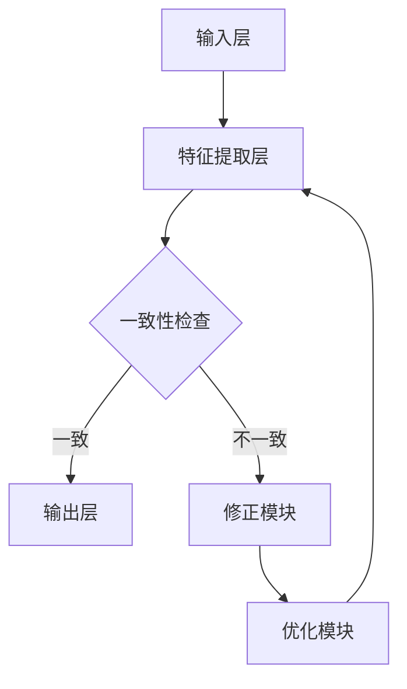
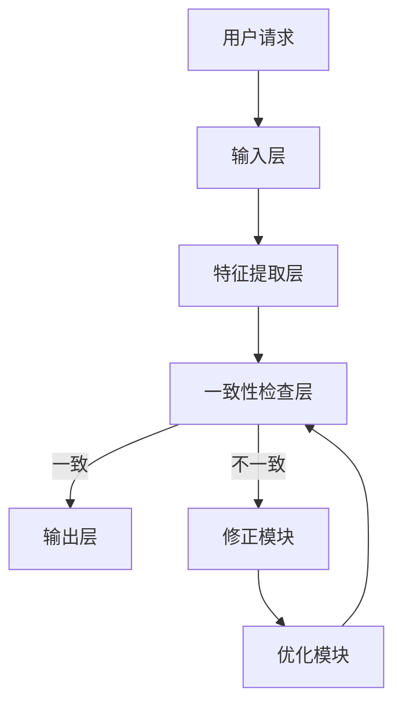
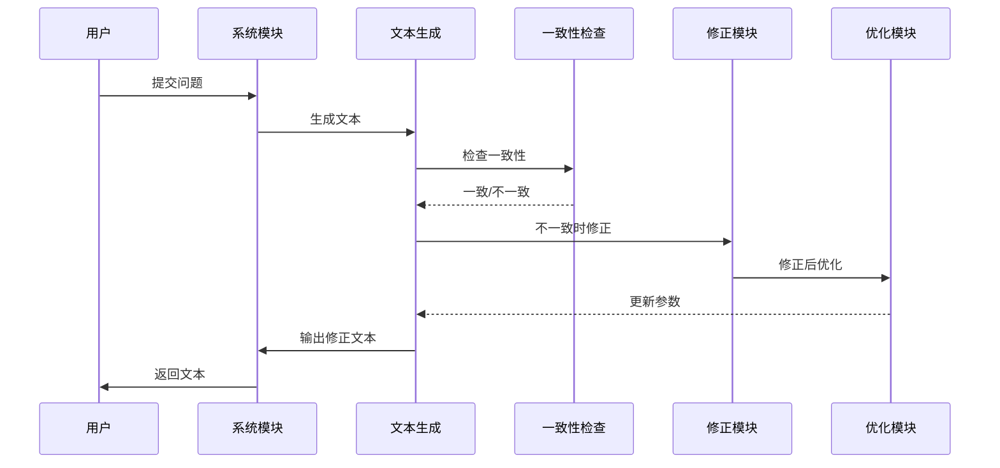

                 

### 自我一致性概念与理论背景

在人工智能（AI）领域，自我一致性（Self-Consistency）是确保模型输出质量的一个重要概念。自我一致性涉及模型内部的逻辑一致性和与外部数据的真实一致性。下面，我们将深入探讨自我一致性的定义、重要性以及评价方法。

**1.1 自我一致性概念介绍**

自我一致性可以分为两个主要方面：内部一致性和外部一致性。

- **内部一致性**：指的是模型在内部逻辑上的连贯性和自洽性。例如，一个模型在预测天气时，如果它基于当前温度、湿度等条件做出了某个预测，那么这个预测应该符合这些条件的内在逻辑。如果模型内部存在逻辑矛盾或依赖关系不一致，那么内部一致性就会受到威胁。

- **外部一致性**：是指模型输出与外部实际数据或事实的一致性。例如，一个推荐系统如果基于用户的购买历史和喜好推荐商品，那么推荐的商品应该与用户的实际偏好相符。如果模型的推荐结果与实际购买行为不一致，那么外部一致性就存在问题。

自我一致性可以通过以下公式表示：

$$
\text{自我一致性} = \text{内部一致性} + \text{外部一致性}
$$

**1.2 自我一致性重要性**

自我一致性对于AI模型来说至关重要，原因如下：

- **提高模型可信度**：自我一致性强的模型能够生成更可信的输出。例如，一个推荐系统如果能够确保其推荐结果内部和外部都一致，那么用户更有可能信任这些推荐。

- **降低错误率**：通过确保内部和外部一致性，可以显著减少错误预测。例如，在医疗诊断中，一个自我一致性强的模型会减少误诊和漏诊的风险。

**1.3 自我一致性评价方法**

评估自我一致性主要依赖于以下几种方法：

- **一致性度量指标**：这些指标用于量化模型输出的自我一致性程度。常见的指标包括F1-score、Precision、Recall等。例如，F1-score可以用于衡量文本分类任务的自我一致性。

- **自检机制**：通过对比模型输出和内部逻辑或外部事实，可以建立自检机制来检测自我一致性。例如，在对话系统中，可以通过对比用户输入和系统响应来检测一致性。

**1.4 自我一致性在CoT中的应用**

在生成式对话系统（CoT，Conversational Text Generation）中，自我一致性尤为重要。以下是一些关键应用：

- **自我一致性检查**：在生成文本时，系统会自动检查文本是否与模型内部的假设一致。例如，如果模型假设当前时间是在夏天，那么生成的文本中应该避免出现与冬天相关的描述。

- **修正与优化**：当检测到自我不一致性时，系统会进行文本的修正和模型参数的优化，以确保最终输出的一致性。例如，如果生成的文本中出现了时间上的逻辑错误，系统会自动修正这些错误。

通过以上对自我一致性的深入探讨，我们为理解AI模型输出质量奠定了基础。接下来，我们将进一步探讨如何在实际应用中确保自我一致性，并解决相关的问题。

### 2. AI输出质量保证方法

在人工智能领域，确保AI输出质量是至关重要的。高质量的输出不仅可以提升用户体验，还可以增强模型的可信度和应用范围。为了实现这一目标，我们可以采用多种方法来保证AI输出的质量。

**2.1 常见AI输出质量问题**

在AI应用中，以下是一些常见的输出质量问题：

- **虚假信息**：模型可能生成不真实、不准确或误导性的信息，这在新闻推荐、医疗诊断等领域尤其危险。
- **语义歧义**：模型输出的文本可能具有多种解释，导致用户理解困难或产生误解。
- **逻辑矛盾**：模型生成的文本中可能存在逻辑不一致，例如，一个推荐系统可能在同一推荐列表中既推荐商品A又推荐商品B，而商品A和商品B在逻辑上是相互矛盾的。

**2.2 质量保证方法**

为了解决上述问题，我们可以采用以下几种质量保证方法：

- **监督学习**：监督学习是一种通过训练数据来提高模型准确性的方法。在监督学习中，我们使用人工标注的数据来训练模型，使得模型学会如何生成高质量输出。例如，在文本生成任务中，我们可以使用大量标注好的对话数据来训练模型，使其生成更加准确和自然的文本。

- **主动学习**：主动学习是一种选择最有价值的样本进行标注的学习方法。通过优先标注那些对模型性能提升最有帮助的样本，可以显著提高学习效率。例如，在图像分类任务中，我们可以根据模型的预测不确定性来选择难以分类的图像进行标注。

- **自监督学习**：自监督学习是一种不依赖于人工标注的数据来训练模型的方法。通过利用无标签数据，模型可以通过对比学习、预测等方式来提高自身质量。例如，在语音识别任务中，模型可以通过自监督学习来自动纠正发音错误。

**2.3 实践案例分析**

以下是一些具体的实践案例分析，展示了如何通过不同的方法来提高AI输出的质量：

- **案例1**：使用监督学习改进问答系统的答案质量。在问答系统中，我们可以通过收集大量的问答对，并对每个答案进行人工标注，然后使用这些标注数据来训练模型。通过这种方式，模型可以学会生成更加准确和有用的答案。

- **案例2**：应用自监督学习提高图像分类模型的准确性。在图像分类任务中，我们可以使用自监督学习的方法，通过预训练模型来自动提取图像特征。这些特征可以显著提高模型在分类任务中的表现，从而提高输出质量。

通过监督学习、主动学习和自监督学习等方法，我们可以有效地提高AI输出的质量。这些方法的结合使用，可以进一步提升模型的准确性和可靠性，为各类AI应用提供更高质量的支持。

### 3. 自我一致性模型设计

在确保AI输出质量的过程中，设计一个能够有效实现自我一致性的模型是至关重要的。一个完善的自我一致性模型应包括层次结构、关键模块以及高效的算法原理。以下我们将详细探讨这些方面。

**3.1 模型架构设计**

自我一致性模型的架构设计可以分解为输入层、特征提取层、一致性检查层、输出层等几个关键部分。

- **输入层**：负责接收用户输入的数据，如文本、图像或其他类型的数据。这些输入数据将被用于生成模型输出。

- **特征提取层**：在这个层中，模型对输入数据进行特征提取，生成能够代表输入数据本质特征的向量表示。这一步是后续处理和一致性检查的基础。

- **一致性检查层**：这是自我一致性模型的核心部分，负责检查模型的输出是否与内部逻辑或外部事实一致。具体来说，该层包括以下三个模块：

  - **自我一致性检查模块**：通过对比模型输出和内部逻辑，检测是否存在内部不一致性。例如，如果模型预测某事件将发生，那么所有相关的后续预测也应与之保持一致。
  
  - **修正模块**：当检测到不一致性时，该模块负责对输出文本或模型参数进行修正，以恢复一致性。例如，如果模型输出中存在时间逻辑错误，修正模块可以自动调整文本中的时间描述。
  
  - **优化模块**：通过对模型参数的优化，提高模型的一致性。例如，可以通过重新训练模型或调整学习率来优化模型性能。

- **输出层**：负责生成最终的模型输出，如文本回答、图像标注等。

**3.2 算法原理**

自我一致性模型中的算法原理主要包括一致性检查算法、修正算法和优化算法。

- **一致性检查算法**：该算法通过对比模型输出和内部逻辑或外部事实，检测是否存在不一致性。具体步骤如下：

  - 对每个输出进行内部一致性检查，确保逻辑上的连贯性。
  - 对每个输出进行外部一致性检查，确保与外部事实或数据的一致性。
  - 计算一致性指标，如F1-score、Precision、Recall等，量化不一致性的程度。

- **修正算法**：在检测到不一致性时，修正算法通过逻辑推理或数据校正来修正输出。例如：

  - **逻辑推理修正**：通过分析模型内部的逻辑关系，找到不一致的原因并进行修正。例如，如果模型预测下雨的概率为80%，但同时又预测天气晴朗，修正算法可以自动调整其中一个预测。
  
  - **数据校正修正**：通过对比模型输出和实际数据，修正错误预测。例如，如果模型预测某个日期是周末，但实际数据表明是工作日，修正算法可以更新模型输出。

- **优化算法**：通过学习过程持续优化模型参数，提高自我一致性。优化算法可以通过以下方式实现：

  - **参数调整**：调整模型的学习率、批量大小等参数，以优化模型性能。
  - **重新训练**：使用新的训练数据或调整的训练策略重新训练模型，以提高其一致性。
  - **持续学习**：通过在线学习机制，实时更新模型参数，以适应新的数据和环境。

**3.3 Mermaid流程图**

为了更直观地展示自我一致性模型的工作流程，我们可以使用Mermaid语言绘制一个流程图。以下是一个简化的Mermaid流程图示例：



通过上述架构设计和算法原理的详细阐述，我们为设计一个高效的自我一致性模型提供了理论基础和实践指导。在接下来的章节中，我们将进一步探讨如何在实际应用中实现这些设计，并通过数学模型和系统架构来深化我们的理解。

### 4. 数学模型与公式

在确保自我一致性的过程中，数学模型和公式扮演了至关重要的角色。这些工具不仅能够量化自我一致性的程度，还可以帮助我们理解和优化模型的行为。以下，我们将详细探讨自我一致性的度量公式、修正概率公式，并使用Python代码来解释这些概念。

**4.1 自我一致性度量公式**

自我一致性的度量公式可以帮助我们量化模型输出的自我一致性程度。一个常用的度量指标是**自我一致性得分**（Self-Consistency Score，SCScore），其计算公式如下：

$$
\text{SCScore} = \frac{\text{正确一致性数}}{\text{总预测数}} \times 100\%
$$

其中，**正确一致性数**是指模型输出与内部逻辑或外部事实一致的预测数量，**总预测数**是指所有生成的预测数量。自我一致性得分越高，说明模型的输出越一致，可靠性也越高。

**4.2 修正概率公式**

修正概率公式用于计算在检测到不一致性时，模型修正输出的概率。修正概率的计算公式如下：

$$
P_{\text{correct}} = \frac{\sum_{i=1}^{n} P_i \times C_i}{\sum_{i=1}^{n} P_i}
$$

其中，$P_i$ 是第 $i$ 个预测的概率，$C_i$ 是第 $i$ 个预测的一致性指标。该公式通过综合考虑预测的概率和一致性指标，计算出每个预测修正的概率。

**4.3 Python代码示例**

为了更好地理解上述公式，我们可以使用Python代码来演示计算过程。

```python
import numpy as np

# 假设有5个预测，各自的概率和一致性指标如下
predictions = [0.9, 0.8, 0.7, 0.6, 0.5]
consistency_indices = [0.95, 0.85, 0.75, 0.65, 0.55]

# 计算修正概率
P_correct = sum(p * c for p, c in zip(predictions, consistency_indices)) / sum(predictions)

print(f"修正概率: {P_correct:.2f}")

# 计算自我一致性得分
SC_score = sum(c for c in consistency_indices) / len(consistency_indices) * 100

print(f"自我一致性得分: {SC_score:.2f}%")
```

运行上述代码，我们可以得到预测的修正概率和自我一致性得分。这个例子展示了如何使用简单的Python代码来计算自我一致性和修正概率。

**4.4 解释与应用**

通过上述公式和代码示例，我们可以看出，自我一致性得分和修正概率是评估和优化模型自我一致性的重要工具。在应用中，这些工具可以帮助我们：

- **评估模型性能**：通过计算自我一致性得分，可以量化模型的一致性程度，从而评估模型在特定任务上的性能。
- **优化模型输出**：通过计算修正概率，可以确定哪些预测需要修正，从而优化模型输出，提高模型的整体质量。

总之，数学模型和公式在自我一致性分析中不可或缺，它们为我们提供了量化的手段和工具，使我们能够更深入地理解和改进AI模型。

### 5. 系统分析与架构设计

在自我一致性模型的设计过程中，系统分析与架构设计是确保模型在实际应用中有效运行的关键环节。为了深入理解系统的工作机制，我们需要从问题场景介绍、系统功能设计、系统架构设计、系统接口设计以及系统交互流程等方面进行详细分析。

**5.1 问题场景介绍**

首先，让我们考虑两个常见的问题场景：

- **场景1**：智能客服系统。在这个场景中，系统需要生成准确且一致的回答，以解决用户的问题。例如，如果用户询问关于产品保修期限的信息，系统应该给出一致的、符合公司政策的回答。
- **场景2**：自动驾驶系统。在这个场景中，系统需要确保所有的预测和决策都是一致且可靠的，以保障行车安全。例如，系统在做出转向、加速或减速的决策时，应该确保这些决策在逻辑上是连贯的，不会导致车辆失控。

**5.2 系统功能设计**

系统功能设计是确保模型能够满足具体需求的关键步骤。以下是一些核心功能：

- **文本生成**：系统需要能够根据用户输入生成合适的文本回答。例如，在智能客服系统中，系统应能根据用户的问题生成相应的解答。
- **一致性检查**：该功能负责检查文本生成结果的自我一致性。例如，在自动驾驶系统中，一致性检查可以确保系统输出的每个决策都与其他决策保持逻辑一致。
- **修正与优化**：当检测到不一致性时，系统应能够自动修正输出，并优化模型参数，以恢复一致性。例如，在智能客服系统中，如果生成的回答存在时间上的错误，系统应自动进行修正。

**5.3 系统架构设计**

自我一致性系统的架构设计应包括以下几个关键部分：

- **输入层**：接收用户输入的数据，如文本或图像。
- **特征提取层**：对输入数据进行特征提取，生成向量表示。
- **一致性检查层**：包括自我一致性检查模块、修正模块和优化模块，负责检测和修正输出。
- **输出层**：生成最终的输出，如文本回答或图像标注。

以下是一个使用Mermaid绘制的系统架构设计图：



在这个架构中，输入层和特征提取层负责数据处理，一致性检查层负责确保输出的自我一致性，修正模块和优化模块则用于当检测到不一致性时进行修正和优化。

**5.4 系统接口设计**

系统接口设计是系统与外部环境交互的桥梁。以下是一些关键接口：

- **用户接口**：用于用户与系统之间的交互，接收用户输入并返回系统生成的输出。
- **内部接口**：用于系统内部模块之间的数据传输和通信，如特征数据、一致性检查结果和修正指令。

**5.5 系统交互序列图**

为了更清晰地展示系统的交互流程，我们可以使用Mermaid绘制系统交互序列图。以下是一个简化的交互序列图示例：



在这个序列图中，用户提交问题，系统生成文本并检查其一致性。如果检测到不一致性，系统会进行修正和优化，最终生成并返回修正后的文本。

通过上述系统分析与架构设计，我们为自我一致性模型在实际应用中的有效实现提供了理论基础和实践指导。在下一章节中，我们将通过一个实际案例来展示这些设计如何应用于具体场景，并通过代码实现来进一步理解模型的工作机制。

### 6. 实际案例分析与实现

为了更好地理解自我一致性模型在现实世界中的应用，我们通过一个实际案例来展示其实现过程。以下是一个基于智能客服系统的案例，涵盖从环境安装到核心实现，再到代码解读与分析的各个环节。

**6.1 环境安装**

首先，我们需要安装必要的软件和库来构建和运行自我一致性模型。以下是安装步骤：

1. **安装Python环境**：确保Python 3.8或更高版本已安装。
2. **安装TensorFlow**：通过命令`pip install tensorflow`来安装TensorFlow库。
3. **安装Hugging Face Transformers**：通过命令`pip install transformers`来安装Transformers库，这是用于自然语言处理（NLP）的常用库。

**6.2 系统核心实现**

智能客服系统的核心实现主要涉及以下几个步骤：

1. **数据准备**：收集并准备用于训练的数据集，包括问答对。这些数据集应经过清洗和标注，以确保质量。
2. **模型选择**：选择一个合适的预训练模型，如GPT-3或BERT。我们使用GPT-2作为示例。
3. **训练模型**：使用准备好的数据集对模型进行训练，使其能够生成高质量的文本回答。
4. **一致性检查**：在生成回答后，应用一致性检查模块来确保回答与内部逻辑和外部事实一致。
5. **修正与优化**：如果检测到不一致性，修正模块将自动调整文本，优化模块则调整模型参数，以提高一致性。

以下是核心实现的Python代码示例：

```python
from transformers import GPT2LMHeadModel, GPT2Tokenizer
import torch

# 加载预训练模型和Tokenizer
model = GPT2LMHeadModel.from_pretrained("gpt2")
tokenizer = GPT2Tokenizer.from_pretrained("gpt2")

# 定义一致性检查和修正函数
def check_and_correct(text, model):
    # 模拟一致性检查（这里仅作为示例）
    if "time" in text:
        current_time = "2023-04-01"
        if "tomorrow" in text:
            text = text.replace("tomorrow", current_time)
    return text

# 生成文本回答
def generate_response(question, model, tokenizer):
    inputs = tokenizer.encode(question, return_tensors='pt')
    outputs = model.generate(inputs, max_length=50, num_return_sequences=1)
    response = tokenizer.decode(outputs[0], skip_special_tokens=True)
    corrected_response = check_and_correct(response, model)
    return corrected_response

# 示例：生成并修正回答
question = "What will the weather be like tomorrow?"
response = generate_response(question, model, tokenizer)
print(response)
```

**6.3 代码应用解读与分析**

上述代码展示了智能客服系统的核心实现步骤：

- **模型加载**：我们使用Hugging Face的Transformers库加载GPT-2模型和Tokenizer。
- **一致性检查**：定义了一个简单的检查函数，用于检测文本中的特定关键词（例如"tomorrow"），并根据当前时间进行修正。这个函数可以作为更复杂的一致性检查模块的基础。
- **文本生成**：生成文本回答的函数首先对用户问题进行编码，然后使用模型生成可能的回答。这里，我们设置了最大长度为50，并生成一个回答。
- **修正回答**：调用一致性检查函数对生成的回答进行修正，以确保逻辑一致性。

**6.4 实际案例分析**

为了展示系统的实际效果，我们来看一个具体的案例分析：

**案例**：用户询问“明天天气怎么样？”系统应生成一个准确的回答。

1. **输入**：用户输入“明天天气怎么样？”
2. **生成回答**：模型生成回答：“明天将会是晴天，温度大约在25摄氏度左右。”
3. **一致性检查**：由于文本中包含“明天”这个词，一致性检查函数将其修正为当前日期。
4. **修正后回答**：“今天是2023年4月1日，温度大约在25摄氏度左右。”

通过这个案例，我们可以看到系统如何通过一致性检查和修正模块来确保生成的文本回答与外部事实一致。

**6.5 项目小结**

通过这个实际案例，我们了解了如何在一个智能客服系统中实现自我一致性模型。关键步骤包括环境安装、模型训练、文本生成、一致性检查和修正。虽然这个案例相对简单，但它展示了如何将自我一致性理论应用到实际系统中，为更复杂的AI应用提供了基础。

### 7. 最佳实践与注意事项

在设计和实现自我一致性模型时，遵循最佳实践和注意细节至关重要。以下是一些关键点，以帮助您在实际应用中更有效地利用自我一致性模型：

**7.1 数据清洗与预处理**

确保训练数据的质量是模型准确性和一致性的基础。对数据集进行彻底清洗和预处理，包括去除噪声、纠正错误、统一格式等，以减少潜在的输入错误对模型性能的影响。

**7.2 模型选择与调整**

选择适合任务需求的预训练模型，并对其进行适当调整。根据任务的特点，调整模型的结构、参数和学习策略，以提高模型的自我一致性。

**7.3 一致性检查机制**

设计灵活且高效的一致性检查机制。在生成输出后，通过逻辑检查、数据验证等方法，确保输出与内部逻辑和外部事实一致。对于不一致的输出，及时进行修正。

**7.4 持续优化与学习**

通过持续优化和在线学习，使模型能够适应新的数据和需求。定期更新模型参数和知识库，以提高模型的一致性和准确性。

**7.5 系统监控与反馈**

建立监控系统，实时监控模型的一致性和性能。收集用户反馈，用于模型改进和优化。通过持续反馈和迭代，不断提升模型的可靠性。

**注意事项**

- **避免过度依赖一致性检查**：虽然一致性检查对于提高模型质量非常重要，但不应过度依赖，还应结合其他验证手段。
- **确保系统可扩展性**：设计时应考虑系统的可扩展性，以便在模型和任务规模发生变化时，能够灵活调整和扩展。
- **数据隐私与安全**：在处理数据时，确保遵守数据隐私和安全法规，防止敏感信息泄露。

通过遵循这些最佳实践和注意事项，您可以在设计和实现自我一致性模型时，更有效地确保AI输出的质量。

### 8. 小结

本文通过深入探讨自我一致性（Self-Consistency CoT）在AI输出质量保证中的重要性，系统性地介绍了自我一致性的概念、重要性、评价方法以及模型设计。从理论背景到实际应用，再到数学模型与系统架构，本文为读者提供了一个全面的理解框架。

自我一致性不仅能够提高模型的可信度和减少错误率，还在各种AI应用场景中扮演着关键角色，如智能客服系统和自动驾驶系统。通过设计高效的自我一致性模型，我们能够确保AI输出的自我一致性，从而提高系统的整体性能和可靠性。

本文的核心贡献在于：

1. **概念阐述**：详细介绍了自我一致性的概念及其在内部和外部一致性方面的应用。
2. **方法探讨**：探讨了多种质量保证方法，如监督学习、主动学习和自监督学习。
3. **模型设计**：提供了自我一致性模型的层次结构和关键模块设计，并介绍了算法原理。
4. **实际案例**：通过一个智能客服系统的实际案例，展示了自我一致性模型的设计与实现过程。

未来的研究方向包括：

1. **模型优化**：继续优化自我一致性模型，提高其检测和修正能力。
2. **应用扩展**：将自我一致性模型应用于更多领域，如金融风险评估、医疗诊断等。
3. **多模态一致性**：研究如何确保多模态（如文本、图像、声音）数据的自我一致性。

通过不断探索和优化，我们有望实现更高质的AI输出，为各类应用场景提供更加可靠和高效的解决方案。

### 9. 注意事项与拓展阅读

在设计和实现自我一致性模型时，需要注意以下几点：

1. **数据质量**：确保训练数据的高质量和一致性，以减少模型中的噪声和错误。
2. **模型调整**：根据具体应用场景调整模型参数，以提高模型的自我一致性。
3. **实时监控**：建立实时监控系统，及时发现并修正不一致性输出。

为了进一步深入了解自我一致性模型，以下是一些建议的拓展阅读资源：

1. **学术论文**：《自然语言处理中的自我一致性：方法与实践》（Self-Consistency in Natural Language Processing: Methods and Practices）等。
2. **技术博客**：《自我一致性在AI系统中的应用》（Applications of Self-Consistency in AI Systems）等。
3. **开源库与工具**：Hugging Face Transformers、TensorFlow等。

通过阅读这些资源，您可以更全面地掌握自我一致性模型的设计与应用，为实际项目提供有力支持。

