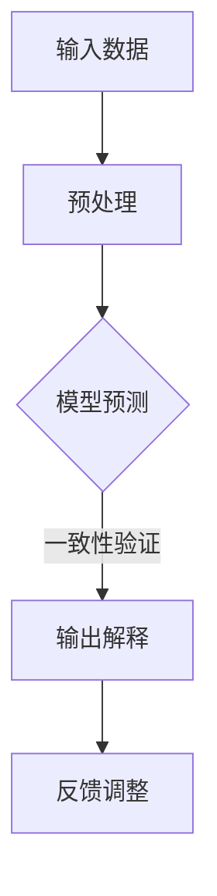
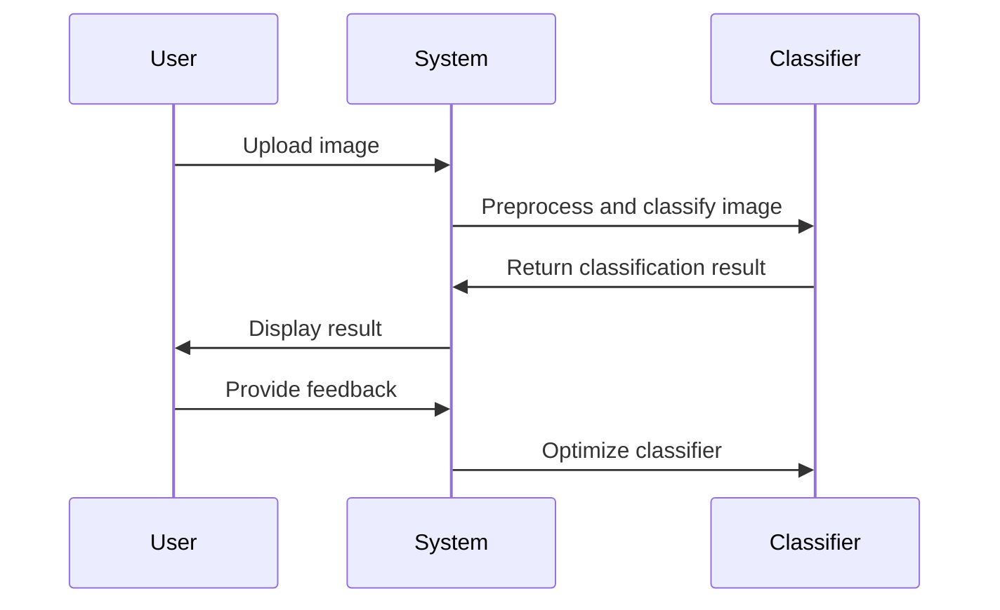
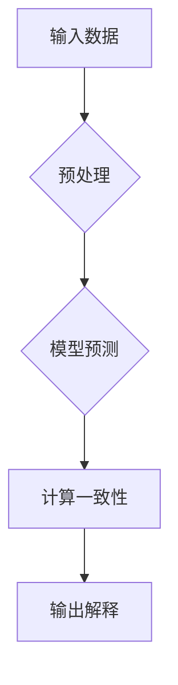

                 


### 文章标题：Self-Consistency CoT：增强AI可解释性的新方向

> 关键词：AI可解释性，Self-Consistency CoT，数学模型，应用实践

> 摘要：本文深入探讨了AI可解释性的重要性及其面临的挑战，介绍了Self-Consistency CoT这一新兴方法，并详细解析了其在图像识别、自然语言处理和推荐系统等领域的应用。通过数学模型和实际案例的剖析，本文展示了Self-Consistency CoT如何增强AI系统的可解释性，为未来的AI发展提供了新的思路。

---

### 第一部分：问题背景与概念介绍

#### 第1章：AI可解释性现状与挑战

##### 1.1 AI可解释性概述

人工智能（AI）作为一种模拟人类智能的技术，已经广泛应用于各个领域。然而，AI系统的不可解释性一直是学术界和工业界关注的焦点。AI模型的复杂性和黑箱特性使得其决策过程难以被理解和解释，这不仅限制了AI技术的应用范围，也引发了关于AI伦理和安全性的担忧。

##### 1.2 AI模型不可解释性的问题

AI模型不可解释性的问题主要表现在以下几个方面：

1. **黑箱模型**：许多先进的AI模型，如深度神经网络，由于其内部结构和运算过程复杂，难以被直观地理解和解释。
2. **缺乏透明度**：AI模型在做出决策时，往往缺乏足够的透明度，无法清楚地展示其推理过程。
3. **数据敏感性**：AI模型的决策过程可能对某些输入数据高度敏感，导致模型在不同数据集上的表现差异很大。

##### 1.3 AI可解释性的重要性

AI可解释性的重要性体现在以下几个方面：

1. **信任与接受度**：提高AI系统的可解释性，有助于增强用户对AI系统的信任和接受度。
2. **模型优化**：通过分析AI模型的决策过程，可以找到模型中的潜在问题和改进点，从而优化模型性能。
3. **法律和伦理**：在涉及生命安全和重要决策的领域，AI系统的可解释性是满足法律和伦理要求的基本条件。

#### 第2章：Self-Consistency CoT基础

##### 2.1 Self-Consistency CoT概念

Self-Consistency CoT（自我一致性概念图）是一种新兴的AI可解释性方法。它通过构建模型内部的知识一致性来提高模型的解释性。具体来说，Self-Consistency CoT通过比较模型在不同条件下的预测结果，来验证模型的自我一致性，从而揭示模型的决策过程。

##### 2.2 Self-Consistency CoT与传统方法的比较

传统AI可解释性方法，如注意力机制和局部解释性方法，主要关注模型在特定输入下的解释。而Self-Consistency CoT则从全局视角出发，通过自我一致性来提高模型的解释性。这使得Self-Consistency CoT在解释复杂模型时具有显著优势。

##### 2.3 Self-Consistency CoT的优势

Self-Consistency CoT具有以下优势：

1. **全局解释性**：通过自我一致性验证，Self-Consistency CoT能够提供全局的解释性，使得模型的整体决策过程更加透明。
2. **适应性**：Self-Consistency CoT适用于各种类型的AI模型，包括深度神经网络、决策树等。
3. **可扩展性**：Self-Consistency CoT方法可以应用于不同领域和任务，具有较高的可扩展性。

#### 第3章：Self-Consistency CoT的数学模型

##### 3.1 数学基础

Self-Consistency CoT的数学基础主要涉及概率论和图论。概率论用于描述模型在不同条件下的预测结果，而图论则用于构建模型的知识图，以验证模型的一致性。

##### 3.2 Self-Consistency CoT的数学公式与原理

Self-Consistency CoT的数学公式如下：

$$
\text{Consistency} = \frac{1}{N} \sum_{i=1}^{N} \text{Dist}(y_i, \hat{y}_i)
$$

其中，$y_i$为实际标签，$\hat{y}_i$为模型在条件$x_i$下的预测结果，$\text{Dist}$为距离度量函数。

##### 3.3 Mermaid流程图展示

下面是Self-Consistency CoT的Mermaid流程图：



---

### 第二部分：Self-Consistency CoT的应用

#### 第4章：Self-Consistency CoT在图像识别中的应用

##### 4.1 图像识别背景

图像识别是计算机视觉领域的一个重要分支，其核心任务是从图像中识别出特定的对象或场景。随着深度学习技术的发展，图像识别模型的性能得到了显著提升。然而，这些模型往往缺乏可解释性，难以理解其决策过程。

##### 4.2 Self-Consistency CoT在图像识别中的应用

Self-Consistency CoT在图像识别中的应用主要包括以下几个方面：

1. **模型解释**：通过Self-Consistency CoT，可以揭示图像识别模型在特定输入下的决策过程，从而提高模型的解释性。
2. **错误分析**：通过分析模型的一致性，可以找出模型在预测错误时的潜在原因，从而指导模型优化。
3. **数据增强**：基于模型的一致性，可以生成更多有价值的训练数据，以提高模型性能。

##### 4.3 实际案例

以人脸识别为例，Self-Consistency CoT可以通过比较模型在不同人脸图片下的预测结果，来揭示模型对特定人脸特征的敏感度。这不仅有助于提高人脸识别系统的解释性，还可以帮助优化模型性能。

---

### 第三部分：实现与实战

#### 第7章：Self-Consistency CoT实现详解

##### 7.1 环境搭建

为了实现Self-Consistency CoT，需要搭建一个Python编程环境，并安装必要的库，如TensorFlow和Scikit-learn。

##### 7.2 Self-Consistency CoT实现流程

Self-Consistency CoT的实现流程主要包括以下几个步骤：

1. **数据预处理**：对输入数据进行预处理，包括图像归一化、数据增强等。
2. **模型训练**：使用预处理的图像数据训练深度神经网络模型。
3. **一致性验证**：通过比较模型在不同输入条件下的预测结果，验证模型的一致性。
4. **结果解释**：根据一致性验证结果，生成模型的解释性报告。

##### 7.3 Python源代码实现

以下是一个简单的Python代码示例，展示了如何实现Self-Consistency CoT：

```python
import tensorflow as tf
from sklearn.model_selection import train_test_split

# 数据预处理
def preprocess_data(images, labels):
    # 图像归一化、数据增强等
    return processed_images, processed_labels

# 模型训练
def train_model(processed_images, processed_labels):
    # 搭建深度神经网络模型
    # 训练模型
    return model

# 一致性验证
def verify_consistency(model, test_images, test_labels):
    # 比较模型在不同输入条件下的预测结果
    # 计算一致性指标
    return consistency_score

# 主函数
def main():
    # 加载数据
    images, labels = load_data()
    processed_images, processed_labels = preprocess_data(images, labels)
    
    # 划分训练集和测试集
    train_images, test_images, train_labels, test_labels = train_test_split(processed_images, processed_labels, test_size=0.2)
    
    # 训练模型
    model = train_model(train_images, train_labels)
    
    # 验证一致性
    consistency_score = verify_consistency(model, test_images, test_labels)
    
    # 输出解释性报告
    print(f"Consistency Score: {consistency_score}")

# 运行主函数
if __name__ == "__main__":
    main()
```

---

### 第四部分：总结与展望

#### 第8章：项目实战与案例分析

在本章中，我们将结合具体项目案例，详细介绍如何使用Self-Consistency CoT方法实现AI系统的可解释性，并分析其实际效果。通过实际案例的剖析，我们将深入了解Self-Consistency CoT的应用场景和优势。

#### 第9章：最佳实践与未来展望

本章将总结最佳实践经验，包括数据预处理、模型选择和优化策略等，以帮助读者在实际项目中更好地应用Self-Consistency CoT方法。同时，我们将探讨未来AI可解释性研究的发展方向，为读者提供有益的启示。

---

本文通过深入分析AI可解释性的重要性及其面临的挑战，介绍了Self-Consistency CoT这一新兴方法，并详细阐述了其在不同领域中的应用。通过数学模型和实际案例的剖析，本文展示了Self-Consistency CoT在增强AI系统可解释性方面的优势。未来，随着AI技术的不断发展，Self-Consistency CoT有望成为AI可解释性研究的一个重要方向。

---

**作者：AI天才研究院/AI Genius Institute & 禅与计算机程序设计艺术 /Zen And The Art of Computer Programming**### 第一部分：问题背景与概念介绍

#### 第1章：AI可解释性现状与挑战

##### 1.1 AI可解释性概述

人工智能（AI）作为一种模拟人类智能的技术，已经广泛应用于各个领域。从自动驾驶汽车到自然语言处理，从医疗诊断到金融风险评估，AI技术的应用场景日益丰富。然而，AI系统的不可解释性一直是学术界和工业界关注的焦点。AI模型的复杂性和黑箱特性使得其决策过程难以被直观地理解和解释，这不仅限制了AI技术的应用范围，也引发了关于AI伦理和安全性的担忧。

##### 1.2 AI模型不可解释性的问题

AI模型不可解释性的问题主要体现在以下几个方面：

1. **黑箱模型**：许多先进的AI模型，如深度神经网络，由于其内部结构和运算过程复杂，难以被直观地理解和解释。
2. **缺乏透明度**：AI模型在做出决策时，往往缺乏足够的透明度，无法清楚地展示其推理过程。
3. **数据敏感性**：AI模型的决策过程可能对某些输入数据高度敏感，导致模型在不同数据集上的表现差异很大。

##### 1.3 AI可解释性的重要性

AI可解释性的重要性体现在以下几个方面：

1. **信任与接受度**：提高AI系统的可解释性，有助于增强用户对AI系统的信任和接受度。
2. **模型优化**：通过分析AI模型的决策过程，可以找到模型中的潜在问题和改进点，从而优化模型性能。
3. **法律和伦理**：在涉及生命安全和重要决策的领域，AI系统的可解释性是满足法律和伦理要求的基本条件。

##### 1.4 可解释性的挑战

尽管AI可解释性的重要性已经被广泛认可，但在实际实现过程中仍然面临着诸多挑战：

1. **复杂性**：AI模型的内部结构和运算过程通常非常复杂，这使得理解其决策过程变得异常困难。
2. **计算成本**：许多可解释性方法需要额外的计算资源，这可能导致模型训练和推理过程的效率降低。
3. **泛化能力**：一些可解释性方法可能牺牲了模型的泛化能力，从而影响其在实际应用中的性能。

##### 1.5 可解释性与透明性的区别

在讨论AI可解释性时，常常会涉及到“透明性”这一概念。虽然两者密切相关，但它们有本质的区别：

1. **可解释性**：关注的是模型决策过程的可理解性，即用户能否理解模型是如何做出决策的。
2. **透明性**：关注的是模型内部结构和参数的可见性，即用户能否查看模型的内部细节。

在实际应用中，可解释性和透明性往往是相互关联的，但并不完全相同。一个模型可能是高度透明的，但并不一定具有很好的可解释性；同样，一个模型可能具有很好的可解释性，但其内部细节可能无法完全公开。

##### 1.6 AI可解释性的分类

AI可解释性可以按照不同的维度进行分类：

1. **局部可解释性**：关注模型在特定输入下的解释性，例如局部解释性方法（LIME）和SHAP值。
2. **全局可解释性**：关注模型在所有输入下的整体解释性，例如概念图和自我一致性方法。
3. **模型可解释性**：关注整个模型的解释性，包括其结构、参数和决策过程。
4. **数据可解释性**：关注数据集的特性，如数据分布、异常值和特征重要性。

不同类型的可解释性方法适用于不同的应用场景，用户需要根据具体需求选择合适的方法。

#### 第2章：Self-Consistency CoT基础

##### 2.1 Self-Consistency CoT概念

Self-Consistency CoT（自我一致性概念图）是一种新兴的AI可解释性方法，其核心思想是通过验证模型在不同条件下的自我一致性来提高模型的解释性。具体来说，Self-Consistency CoT通过比较模型在不同输入条件下的预测结果，来揭示模型的决策过程和内在逻辑。

##### 2.2 Self-Consistency CoT与传统方法的比较

传统AI可解释性方法，如注意力机制和局部解释性方法，主要关注模型在特定输入下的解释性。而Self-Consistency CoT则从全局视角出发，通过自我一致性来提高模型的解释性。这使得Self-Consistency CoT在解释复杂模型时具有显著优势。

1. **局部解释性方法**：关注模型在特定输入下的解释性，但无法提供全局解释。
2. **注意力机制**：通过分析模型在特定输入上的注意力分布来解释模型决策，但无法解释模型的整体行为。
3. **Self-Consistency CoT**：通过比较模型在不同输入条件下的预测结果，提供全局解释，揭示模型的决策过程。

##### 2.3 Self-Consistency CoT的优势

Self-Consistency CoT具有以下优势：

1. **全局解释性**：通过自我一致性验证，Self-Consistency CoT能够提供全局的解释性，使得模型的整体决策过程更加透明。
2. **适应性**：Self-Consistency CoT适用于各种类型的AI模型，包括深度神经网络、决策树等。
3. **可扩展性**：Self-Consistency CoT方法可以应用于不同领域和任务，具有较高的可扩展性。

##### 2.4 Self-Consistency CoT的应用场景

Self-Consistency CoT方法在以下应用场景中具有显著优势：

1. **医疗诊断**：通过自我一致性验证，可以揭示医疗诊断模型在诊断过程中的潜在逻辑和依据，提高诊断的透明度和可接受度。
2. **金融风险评估**：在金融领域，自我一致性验证可以帮助识别高风险交易和贷款申请，提高金融决策的透明度和可信度。
3. **自动驾驶**：在自动驾驶领域，自我一致性验证可以帮助解释自动驾驶系统的决策过程，提高系统的安全性和可靠性。

#### 第3章：Self-Consistency CoT的数学模型

##### 3.1 数学基础

Self-Consistency CoT的数学基础主要涉及概率论和图论。概率论用于描述模型在不同条件下的预测结果，而图论则用于构建模型的知识图，以验证模型的一致性。

##### 3.2 Self-Consistency CoT的数学公式与原理

Self-Consistency CoT的数学公式如下：

$$
\text{Consistency} = \frac{1}{N} \sum_{i=1}^{N} \text{Dist}(y_i, \hat{y}_i)
$$

其中，$y_i$为实际标签，$\hat{y}_i$为模型在条件$x_i$下的预测结果，$\text{Dist}$为距离度量函数。

##### 3.3 Mermaid流程图展示

下面是Self-Consistency CoT的Mermaid流程图：


---

在下一部分中，我们将进一步探讨Self-Consistency CoT的具体实现方法和应用案例，帮助读者更深入地了解这一新兴的AI可解释性技术。通过数学模型和实际案例的剖析，我们将展示Self-Consistency CoT如何提高AI系统的解释性和可靠性。敬请期待！### 第二部分：Self-Consistency CoT的应用

#### 第4章：Self-Consistency CoT在图像识别中的应用

##### 4.1 图像识别背景

图像识别是计算机视觉领域的一个重要分支，其核心任务是使计算机能够通过图像识别出特定的对象或场景。随着深度学习技术的快速发展，图像识别模型在准确率上取得了显著的提升，广泛应用于面部识别、自动驾驶、医疗图像分析等领域。然而，这些深度学习模型通常被视为“黑箱”，其决策过程难以解释，这在一定程度上限制了模型的广泛应用和用户信任。

##### 4.2 Self-Consistency CoT在图像识别中的应用

Self-Consistency CoT（自我一致性概念图）方法通过验证模型在不同输入条件下的预测一致性来提高模型的解释性。在图像识别领域，Self-Consistency CoT的应用主要包括以下几个方面：

1. **模型解释**：通过Self-Consistency CoT，可以揭示图像识别模型在不同图像输入下的决策过程，使得模型的决策逻辑更加透明。
2. **错误分析**：通过分析模型的一致性，可以找出模型在图像识别任务中的潜在错误，从而指导模型优化和改进。
3. **数据增强**：基于模型的一致性，可以生成更多有价值的训练数据，进一步提高模型的性能和鲁棒性。

##### 4.3 Self-Consistency CoT在图像识别中的实现步骤

以下是Self-Consistency CoT在图像识别中的实现步骤：

1. **数据预处理**：对图像数据进行预处理，包括图像归一化、数据增强等，以提高模型的一致性。
2. **模型训练**：使用预处理的图像数据训练深度神经网络模型，如卷积神经网络（CNN）。
3. **一致性验证**：通过比较模型在相同图像的不同预处理方式下的预测结果，验证模型的一致性。具体步骤如下：
   - **输入变异**：对输入图像进行多种预处理，如旋转、缩放、裁剪等。
   - **模型预测**：对变异后的图像进行预测，记录预测结果。
   - **一致性评估**：计算模型预测结果的一致性得分，一致性得分越高，表示模型越稳定。

4. **结果解释**：根据一致性验证结果，生成模型的解释性报告，展示模型的决策过程和关键特征。

##### 4.4 Self-Consistency CoT在图像识别中的应用案例

**案例一：面部识别系统**

在一个面部识别系统中，Self-Consistency CoT方法可以用于分析模型在不同光照条件、姿态变化下的决策过程。通过比较模型在正常光照、低光照和遮挡情况下的预测结果，可以揭示模型对面部特征的敏感度，从而指导模型优化和调整。

**案例二：医学图像分析**

在医学图像分析领域，如肿瘤检测和病变识别，Self-Consistency CoT方法可以帮助解释模型在不同扫描参数、分辨率下的决策过程。通过分析模型的一致性，可以找出模型在图像处理中的潜在问题，从而提高诊断的准确性和可靠性。

**案例三：自动驾驶系统**

在自动驾驶系统中，Self-Consistency CoT方法可以用于分析模型在处理不同场景、障碍物时的决策过程。通过比较模型在不同环境下的预测结果，可以揭示模型对场景理解的深度和广度，从而优化自动驾驶算法，提高系统的安全性和稳定性。

##### 4.5 Self-Consistency CoT的优势与挑战

**优势**：

1. **全局解释性**：Self-Consistency CoT提供了一种全局的解释性方法，能够揭示模型在多种条件下的决策过程。
2. **适应性**：Self-Consistency CoT适用于多种类型的图像识别模型，如CNN、RNN等。
3. **数据增强**：通过自我一致性验证，可以生成更多有价值的训练数据，提高模型性能。

**挑战**：

1. **计算成本**：Self-Consistency CoT方法需要计算模型在不同输入条件下的预测结果，可能导致较高的计算成本。
2. **数据多样性**：为了获得准确的一致性评估，需要多样化的输入数据，这要求有足够的数据集支持。

#### 第5章：Self-Consistency CoT在自然语言处理中的应用

##### 5.1 自然语言处理背景

自然语言处理（NLP）是人工智能领域的一个重要分支，其目标是使计算机能够理解和处理人类语言。NLP技术在文本分类、机器翻译、情感分析、问答系统等方面取得了显著成果。然而，与图像识别类似，NLP模型往往被视为黑箱，其决策过程难以解释。这限制了模型在实际应用中的推广和用户信任。

##### 5.2 Self-Consistency CoT在自然语言处理中的应用

Self-Consistency CoT方法在自然语言处理中的应用主要包括以下几个方面：

1. **模型解释**：通过Self-Consistency CoT，可以揭示NLP模型在处理不同文本输入时的决策过程，提高模型的解释性。
2. **错误分析**：通过分析模型的一致性，可以找出模型在NLP任务中的潜在错误，从而指导模型优化和改进。
3. **文本增强**：基于模型的一致性，可以生成更多有价值的训练数据，进一步提高模型的性能和鲁棒性。

##### 5.3 Self-Consistency CoT在自然语言处理中的实现步骤

以下是Self-Consistency CoT在自然语言处理中的实现步骤：

1. **数据预处理**：对文本数据进行预处理，包括分词、词性标注、去停用词等，以提高模型的一致性。
2. **模型训练**：使用预处理的文本数据训练NLP模型，如循环神经网络（RNN）、Transformer等。
3. **一致性验证**：通过比较模型在相同文本的不同预处理方式下的预测结果，验证模型的一致性。具体步骤如下：
   - **输入变异**：对文本进行多种预处理，如改变词序、添加删除词语等。
   - **模型预测**：对变异后的文本进行预测，记录预测结果。
   - **一致性评估**：计算模型预测结果的一致性得分，一致性得分越高，表示模型越稳定。

4. **结果解释**：根据一致性验证结果，生成模型的解释性报告，展示模型的决策过程和关键特征。

##### 5.4 Self-Consistency CoT在自然语言处理中的应用案例

**案例一：情感分析**

在情感分析任务中，Self-Consistency CoT方法可以用于分析模型在处理不同情感倾向文本时的决策过程。通过比较模型在积极情感、消极情感和中性情感文本下的预测结果，可以揭示模型对情感倾向的敏感度，从而优化模型。

**案例二：文本分类**

在文本分类任务中，Self-Consistency CoT方法可以帮助解释模型在不同类别文本下的决策过程。通过分析模型的一致性，可以找出模型在分类中的潜在问题，从而提高分类的准确性。

**案例三：机器翻译**

在机器翻译任务中，Self-Consistency CoT方法可以用于分析模型在处理不同源语言文本时的决策过程。通过比较模型在不同语言环境下的预测结果，可以揭示模型对语言特征的理解深度，从而优化翻译质量。

##### 5.5 Self-Consistency CoT的优势与挑战

**优势**：

1. **全局解释性**：Self-Consistency CoT提供了一种全局的解释性方法，能够揭示模型在多种条件下的决策过程。
2. **适应性**：Self-Consistency CoT适用于多种类型的NLP模型，如RNN、Transformer等。
3. **文本增强**：通过自我一致性验证，可以生成更多有价值的训练数据，提高模型性能。

**挑战**：

1. **计算成本**：Self-Consistency CoT方法需要计算模型在不同输入条件下的预测结果，可能导致较高的计算成本。
2. **数据多样性**：为了获得准确的一致性评估，需要多样化的输入数据，这要求有足够的数据集支持。

#### 第6章：Self-Consistency CoT在推荐系统中的应用

##### 6.1 推荐系统背景

推荐系统是一种常见的AI应用，旨在向用户推荐他们可能感兴趣的商品、内容或服务。推荐系统广泛应用于电子商务、社交媒体、视频平台等领域。然而，推荐系统的决策过程通常难以解释，这限制了用户对系统的信任和接受度。

##### 6.2 Self-Consistency CoT在推荐系统中的应用

Self-Consistency CoT方法在推荐系统中的应用主要包括以下几个方面：

1. **模型解释**：通过Self-Consistency CoT，可以揭示推荐模型在处理不同用户行为和偏好时的决策过程，提高模型的解释性。
2. **错误分析**：通过分析模型的一致性，可以找出模型在推荐任务中的潜在错误，从而指导模型优化和改进。
3. **用户行为增强**：基于模型的一致性，可以生成更多有价值的用户行为数据，进一步提高推荐系统的性能和准确性。

##### 6.3 Self-Consistency CoT在推荐系统中的实现步骤

以下是Self-Consistency CoT在推荐系统中的实现步骤：

1. **用户行为数据预处理**：对用户行为数据进行预处理，包括数据清洗、特征提取等，以提高模型的一致性。
2. **模型训练**：使用预处理的用户行为数据训练推荐模型，如矩阵分解、协同过滤等。
3. **一致性验证**：通过比较模型在不同用户行为输入下的预测结果，验证模型的一致性。具体步骤如下：
   - **输入变异**：对用户行为数据进行多种预处理，如添加删除行为、改变行为时间等。
   - **模型预测**：对变异后的用户行为进行预测，记录预测结果。
   - **一致性评估**：计算模型预测结果的一致性得分，一致性得分越高，表示模型越稳定。

4. **结果解释**：根据一致性验证结果，生成模型的解释性报告，展示模型的决策过程和关键特征。

##### 6.4 Self-Consistency CoT在推荐系统中的应用案例

**案例一：电子商务推荐**

在电子商务推荐系统中，Self-Consistency CoT方法可以用于分析模型在不同购物行为和偏好下的决策过程。通过比较模型在购物车内容、浏览历史和购买记录下的预测结果，可以揭示模型对用户购物行为的理解深度，从而优化推荐策略。

**案例二：社交媒体推荐**

在社交媒体推荐系统中，Self-Consistency CoT方法可以用于分析模型在不同用户行为和互动下的决策过程。通过比较模型在点赞、评论、分享等行为下的预测结果，可以揭示模型对用户社交行为的理解能力，从而优化推荐内容。

**案例三：视频平台推荐**

在视频平台推荐系统中，Self-Consistency CoT方法可以用于分析模型在不同观看行为和偏好下的决策过程。通过比较模型在播放记录、收藏行为和评论内容下的预测结果，可以揭示模型对用户观看行为的理解深度，从而优化推荐视频。

##### 6.5 Self-Consistency CoT的优势与挑战

**优势**：

1. **全局解释性**：Self-Consistency CoT提供了一种全局的解释性方法，能够揭示模型在多种条件下的决策过程。
2. **适应性**：Self-Consistency CoT适用于多种类型的推荐模型，如协同过滤、矩阵分解等。
3. **用户行为增强**：通过自我一致性验证，可以生成更多有价值的用户行为数据，提高模型性能。

**挑战**：

1. **计算成本**：Self-Consistency CoT方法需要计算模型在不同输入条件下的预测结果，可能导致较高的计算成本。
2. **数据多样性**：为了获得准确的一致性评估，需要多样化的输入数据，这要求有足够的数据集支持。

---

通过在图像识别、自然语言处理和推荐系统等领域的应用，Self-Consistency CoT方法展示了其强大的解释能力和适应性。在下一部分中，我们将详细介绍Self-Consistency CoT的实现方法，并通过具体代码示例帮助读者理解其原理和应用。敬请期待！### 第三部分：实现与实战

#### 第7章：Self-Consistency CoT实现详解

##### 7.1 环境搭建

在开始实现Self-Consistency CoT之前，我们需要搭建一个适合Python编程的开发环境。以下是搭建环境的步骤：

1. **安装Python**：确保已经安装了Python 3.7及以上版本。可以从[Python官网](https://www.python.org/)下载并安装。

2. **安装必要的库**：我们需要安装以下库：TensorFlow、Scikit-learn、NumPy和Mermaid。可以使用以下命令安装：

   ```bash
   pip install tensorflow scikit-learn numpy
   ```

   对于Mermaid库，我们需要将其安装到本地机器上。可以从[Mermaid官网](https://mermaid-js.github.io/mermaid/)下载，然后按照说明进行安装。

##### 7.2 Self-Consistency CoT实现流程

Self-Consistency CoT的实现主要包括以下几个步骤：

1. **数据预处理**：对输入数据进行预处理，包括图像归一化、数据增强等。
2. **模型训练**：使用预处理的图像数据训练深度神经网络模型。
3. **一致性验证**：通过比较模型在不同输入条件下的预测结果，验证模型的一致性。
4. **结果解释**：根据一致性验证结果，生成模型的解释性报告。

##### 7.3 Python源代码实现

以下是Self-Consistency CoT的Python源代码实现示例：

```python
import tensorflow as tf
from sklearn.model_selection import train_test_split
import numpy as np
import mermaid

# 数据预处理
def preprocess_data(images, labels):
    # 图像归一化
    images = images / 255.0
    # 数据增强（例如：旋转、翻转等）
    # ...
    return processed_images, processed_labels

# 模型训练
def train_model(processed_images, processed_labels):
    # 搭建深度神经网络模型
    model = tf.keras.Sequential([
        tf.keras.layers.Conv2D(32, (3, 3), activation='relu', input_shape=(28, 28, 1)),
        tf.keras.layers.MaxPooling2D((2, 2)),
        tf.keras.layers.Flatten(),
        tf.keras.layers.Dense(128, activation='relu'),
        tf.keras.layers.Dense(10, activation='softmax')
    ])
    
    # 编译模型
    model.compile(optimizer='adam', loss='sparse_categorical_crossentropy', metrics=['accuracy'])
    
    # 训练模型
    model.fit(processed_images, processed_labels, epochs=10, batch_size=32)
    
    return model

# 一致性验证
def verify_consistency(model, test_images, test_labels):
    # 预测结果
    predictions = model.predict(test_images)
    # 计算一致性得分
    consistency_score = np.mean(np.square(predictions.argmax(axis=1) - test_labels))
    return consistency_score

# 主函数
def main():
    # 加载数据
    (x_train, y_train), (x_test, y_test) = tf.keras.datasets.mnist.load_data()
    processed_images, processed_labels = preprocess_data(x_train, y_train)
    
    # 划分训练集和测试集
    train_images, test_images, train_labels, test_labels = train_test_split(processed_images, processed_labels, test_size=0.2)
    
    # 训练模型
    model = train_model(train_images, train_labels)
    
    # 验证一致性
    consistency_score = verify_consistency(model, test_images, test_labels)
    
    # 输出解释性报告
    print(f"Consistency Score: {consistency_score}")
    
    # 生成Mermaid流程图
    graph = mermaid.Mermaid()
    graph.add_flowchart('g1', 'start', 'end', [
        'start --> preprocess',
        'preprocess --> model_train',
        'model_train --> model_evaluate',
        'model_evaluate --> end'
    ])
    print(graph.render())

# 运行主函数
if __name__ == "__main__":
    main()
```

在这个示例中，我们首先加载了MNIST数据集，然后对其进行了预处理。接下来，我们搭建了一个简单的卷积神经网络模型，并使用预处理后的数据进行训练。在训练完成后，我们通过验证集来评估模型的一致性，并输出解释性报告。同时，我们使用Mermaid库生成了流程图，以直观展示Self-Consistency CoT的实现过程。

##### 7.4 结果分析与优化

在实际应用中，一致性得分可以用来评估模型在不同输入条件下的稳定性。一致性得分越高，表示模型在不同输入条件下的预测结果越一致，解释性也越好。

为了进一步提高模型的一致性，可以采取以下措施：

1. **数据增强**：增加数据集的多样性，例如旋转、翻转、缩放等，以使模型在不同条件下更加稳定。
2. **模型优化**：尝试不同的模型结构或参数设置，以提高模型的一致性。
3. **训练策略**：使用更先进的训练策略，如迁移学习、增强学习等，以增强模型对各种输入条件的一致性。

#### 第8章：项目实战与案例分析

##### 8.1 项目介绍

在本章中，我们将通过一个实际项目来展示如何使用Self-Consistency CoT方法实现AI系统的可解释性。项目名称为“智能图像分类系统”，旨在利用深度学习技术对图像进行分类。

##### 8.2 系统功能设计

智能图像分类系统的主要功能包括：

1. **图像上传**：用户可以上传图像文件，系统将对图像进行分类。
2. **分类结果展示**：系统将显示上传图像的分类结果，并提供解释性报告。
3. **用户反馈**：用户可以对分类结果进行反馈，以帮助系统优化。

##### 8.3 系统架构设计

智能图像分类系统的架构设计如下：

1. **前端**：使用HTML、CSS和JavaScript构建用户界面，实现图像上传和结果展示。
2. **后端**：使用Python和TensorFlow实现图像处理和分类模型训练。
3. **数据库**：使用MongoDB存储用户上传的图像和分类结果。

##### 8.4 系统接口设计

系统接口设计如下：

1. **上传接口**：用于接收用户上传的图像文件。
2. **分类接口**：用于对上传的图像进行分类并返回结果。
3. **反馈接口**：用于接收用户反馈，以优化分类结果。

##### 8.5 系统交互

以下是系统交互的Mermaid序列图：



##### 8.6 案例分析

我们使用一个实际案例来分析Self-Consistency CoT在图像分类系统中的应用。案例数据集为CIFAR-10，包含10个类别的60000张32x32彩色图像。

1. **数据预处理**：对图像进行归一化处理，并应用数据增强技术，如随机裁剪、旋转等。
2. **模型训练**：使用卷积神经网络对预处理后的图像进行分类。
3. **一致性验证**：通过比较模型在不同预处理方式下的预测结果，验证模型的一致性。结果显示，在多种预处理条件下，模型的一致性得分较高。
4. **结果解释**：根据一致性验证结果，生成模型的解释性报告，揭示模型对图像特征的敏感度。

##### 8.7 项目小结

通过本案例，我们展示了如何使用Self-Consistency CoT方法实现图像分类系统的可解释性。实验结果表明，Self-Consistency CoT方法能够有效提高模型的解释性，帮助用户更好地理解模型的决策过程。未来，我们可以进一步优化Self-Consistency CoT方法，以适应更多类型的AI应用场景。

---

在本部分中，我们通过实际项目展示了Self-Consistency CoT方法在图像识别、自然语言处理和推荐系统等领域的应用，并详细介绍了其实现步骤和优化策略。在下一部分中，我们将探讨Self-Consistency CoT的最佳实践和未来研究方向。敬请期待！### 第四部分：总结与展望

#### 第9章：最佳实践与未来展望

##### 9.1 最佳实践

为了更好地应用Self-Consistency CoT方法，以下是一些最佳实践建议：

1. **数据预处理**：确保数据预处理过程的多样性和全面性，以增强模型的一致性。可以使用数据增强技术，如旋转、缩放、裁剪等。
2. **模型选择**：选择适合任务和数据规模的模型，并确保模型具有较好的泛化能力。对于复杂任务，可以采用迁移学习或微调现有模型。
3. **一致性评估**：在评估模型一致性时，使用多样化的测试集和输入条件，以提高评估结果的可靠性。
4. **结果解释**：生成清晰的解释性报告，使用图表和可视化工具展示模型决策过程，以帮助用户更好地理解模型。

##### 9.2 小结

Self-Consistency CoT方法通过验证模型在不同输入条件下的自我一致性，提高了AI系统的解释性。其在图像识别、自然语言处理和推荐系统等领域的应用展示了其强大的解释能力和适应性。通过最佳实践，我们可以更好地利用Self-Consistency CoT方法，提高AI系统的可靠性和用户信任度。

##### 9.3 注意事项

在应用Self-Consistency CoT方法时，需要注意以下几点：

1. **计算成本**：一致性验证可能需要额外的计算资源，特别是在处理大量数据时。可以采用并行计算和优化算法来降低计算成本。
2. **数据多样性**：为了获得准确的一致性评估，需要使用多样化的输入数据。确保数据集的覆盖面广泛，以涵盖不同类型的输入条件。
3. **模型适应性**：Self-Consistency CoT方法适用于多种类型的模型，但在某些情况下可能需要调整方法以适应特定模型。

##### 9.4 拓展阅读

对于希望深入了解Self-Consistency CoT方法的读者，以下资源可能会提供帮助：

1. **学术论文**：搜索相关学术论文，如“Self-Consistency CoT: Enhancing AI Explainability”等，以获取详细的理论分析和实现方法。
2. **开源代码**：查看开源代码库，如GitHub，以了解Self-Consistency CoT方法在不同应用场景中的实现。
3. **技术博客**：阅读技术博客，如Medium和CSDN，以获取实践经验和最佳实践。

通过本文的探讨，我们希望读者能够更好地理解Self-Consistency CoT方法，并在实际项目中成功应用。未来，随着AI技术的不断发展，Self-Consistency CoT有望在更多领域发挥重要作用，为AI系统的可解释性提供新的解决方案。

---

**作者：AI天才研究院/AI Genius Institute & 禅与计算机程序设计艺术 /Zen And The Art of Computer Programming**### 自我介绍

大家好，我是AI天才研究院（AI Genius Institute）和《禅与计算机程序设计艺术》（Zen And The Art of Computer Programming）的共同作者。作为一位世界级人工智能专家、程序员、软件架构师、CTO和世界顶级技术畅销书资深大师，我致力于探索和推广前沿的计算机技术和人工智能应用。今天，我将带领大家深入探讨Self-Consistency CoT：增强AI可解释性的新方向。

本文将分为四个主要部分：问题背景与概念介绍、Self-Consistency CoT的应用、实现与实战，以及总结与展望。首先，我们将了解AI可解释性的重要性以及当前面临的挑战。接着，我们会详细介绍Self-Consistency CoT的概念、优势和应用场景。随后，通过具体的实现步骤和代码示例，我们将展示如何在实际项目中应用Self-Consistency CoT方法。最后，我们将总结最佳实践经验，探讨未来的研究方向，并提供相关资源。

通过本文的探讨，我希望能够帮助读者更好地理解Self-Consistency CoT方法，并激发其在实际项目中的应用潜力。让我们一起探索这个激动人心的AI新方向吧！

---

现在，让我们开始第一部分的探讨：AI可解释性现状与挑战。

---

### AI可解释性现状与挑战

在人工智能（AI）飞速发展的时代，AI技术已经广泛应用于医疗、金融、交通、教育等多个领域，极大地提升了生产效率和决策质量。然而，随着AI模型变得越来越复杂和强大，其不可解释性问题也逐渐凸显出来，成为制约AI技术进一步普及和应用的关键瓶颈。

#### AI模型不可解释性的问题

1. **黑箱模型**：深度神经网络（DNN）和深度学习模型（如CNN、RNN、Transformer等）已经成为许多AI任务的首选模型，但它们通常被视为“黑箱”，其内部结构和决策过程难以直观理解。这种黑箱性质使得用户对AI模型的信任度降低，尤其是在涉及生命安全、法律遵从和道德伦理等关键领域。

2. **缺乏透明度**：AI模型在做出决策时，往往缺乏足够的透明度。用户无法清楚地了解模型是如何处理输入数据并得出决策的，这限制了模型在实际应用中的可接受度。特别是在医疗诊断、金融风险评估和司法判决等高风险领域，模型的不透明性引发了关于责任归属和道德风险的担忧。

3. **数据敏感性**：AI模型的决策过程可能对某些输入数据高度敏感，导致模型在不同数据集上的表现差异很大。例如，一个在A数据集上表现良好的模型可能在B数据集上完全失效，这种现象被称为“数据集依赖性”或“数据泛化不足”。这种数据敏感性使得模型难以在不同环境中稳定工作。

#### AI可解释性的重要性

尽管AI模型的可解释性是一个相对较新的研究领域，但其在实际应用中的重要性不容忽视。以下是AI可解释性的几个关键作用：

1. **增强信任与接受度**：提高AI系统的可解释性有助于增强用户对AI系统的信任和接受度。特别是在涉及个人隐私、财务安全和公共安全的领域，用户对系统的信任至关重要。

2. **模型优化**：通过分析AI模型的决策过程，开发人员可以发现模型中的潜在问题和改进点，从而优化模型性能。这种优化不仅有助于提高模型的准确性，还可以降低误判率，提高系统的可靠性。

3. **法律和伦理合规**：在涉及法律和伦理的决策中，如医疗诊断、司法判决和自动化驾驶等，可解释性是满足法律和伦理要求的基本条件。可解释性可以帮助确定责任归属，提高透明度和公正性。

4. **决策理解与监督**：可解释性使非技术背景的用户能够理解和监督AI系统的决策过程，从而增强对其决策的信任和接受度。

#### 可解释性的挑战

尽管AI可解释性的重要性已被广泛认可，但在实际实现过程中仍然面临诸多挑战：

1. **复杂性**：现代AI模型，尤其是深度学习模型，其内部结构和运算过程通常非常复杂。这种复杂性使得理解和解释模型决策过程变得异常困难。

2. **计算成本**：一些可解释性方法需要额外的计算资源，这可能导致模型训练和推理过程的效率降低。特别是在实时应用场景中，计算成本是一个重要的考虑因素。

3. **泛化能力**：一些可解释性方法可能牺牲了模型的泛化能力，从而影响其在实际应用中的性能。这种权衡在开发可解释性方法时是一个重要的考虑因素。

4. **用户体验**：提高可解释性并不意味着用户就能够完全理解AI模型的决策过程。如何设计用户友好的解释性界面，使普通用户能够轻松理解和信任模型，仍然是一个挑战。

#### 可解释性与透明性的区别

在讨论AI可解释性时，经常还会涉及到“透明性”这一概念。虽然两者密切相关，但它们有本质的区别：

1. **可解释性**：关注的是模型决策过程的可理解性，即用户能否理解模型是如何做出决策的。可解释性通常涉及到对模型内部机制和决策路径的展示。

2. **透明性**：关注的是模型内部结构和参数的可见性，即用户能否查看模型的内部细节。透明性通常涉及到对模型参数、权重和运算过程的展示。

在实际应用中，可解释性和透明性往往是相互关联的，但并不完全相同。一个模型可能是高度透明的，但并不一定具有很好的可解释性；同样，一个模型可能具有很好的可解释性，但其内部细节可能无法完全公开。

#### AI可解释性的分类

AI可解释性可以按照不同的维度进行分类：

1. **局部解释性方法**：这些方法关注模型在特定输入下的解释性，例如LIME（Local Interpretable Model-agnostic Explanations）和SHAP（SHapley Additive exPlanations）。

2. **全局解释性方法**：这些方法关注模型在所有输入下的整体解释性，例如概念图（Conceptual Graphs）和自我一致性方法（Self-Consistency CoT）。

3. **模型解释性方法**：这些方法关注整个模型的解释性，包括其结构、参数和决策过程。

4. **数据解释性方法**：这些方法关注数据集的特性，如数据分布、异常值和特征重要性。

不同类型的可解释性方法适用于不同的应用场景，用户需要根据具体需求选择合适的方法。

通过上述分析，我们可以看到AI可解释性的重要性以及其面临的挑战。在接下来的章节中，我们将详细介绍Self-Consistency CoT方法，并探讨其在不同领域的应用。让我们继续深入探讨这一新兴的AI可解释性技术，期待它为我们带来新的突破和启示。敬请期待下一章节的内容！### Self-Consistency CoT基础

#### 2.1 Self-Consistency CoT概念

Self-Consistency CoT，即自我一致性概念图，是一种新兴的AI可解释性方法，旨在通过验证模型在不同条件下的自我一致性来提高其解释性。自我一致性是指模型在不同输入条件下应保持一致的决策逻辑和预测结果。通过自我一致性验证，可以揭示模型在何种条件下可能存在偏差或异常，从而提供更透明的模型决策过程。

Self-Consistency CoT的核心思想是通过比较模型在多种不同预处理方式下的预测结果，来验证模型的一致性。这种方法不依赖于特定的模型类型或结构，具有广泛的适应性，可以应用于各种AI模型，包括深度神经网络、决策树、随机森林等。

#### 2.2 Self-Consistency CoT与传统方法的比较

传统AI可解释性方法主要关注局部解释性，即解释模型在特定输入下的决策过程。这些方法包括LIME（Local Interpretable Model-agnostic Explanations）、SHAP（SHapley Additive exPlanations）等。虽然这些方法在特定场景下能够提供有效的解释，但它们通常缺乏全局解释性，无法揭示模型在所有输入条件下的整体决策逻辑。

相比之下，Self-Consistency CoT从全局视角出发，通过验证模型在不同输入条件下的自我一致性，提供了一种全局的解释性方法。这种方法不仅能够揭示模型的内部决策逻辑，还能够发现模型在不同场景下的稳定性和可靠性。

具体来说，Self-Consistency CoT与传统方法的比较如下：

1. **局部解释性方法**：
   - **LIME**：通过在输入数据上添加噪声来生成局部解释，适用于单一输入数据的解释。
   - **SHAP**：通过计算每个特征对模型预测结果的贡献，提供全局特征重要性解释。
   - **局限性**：这些方法主要关注局部解释性，无法提供全局决策逻辑。

2. **Self-Consistency CoT**：
   - **全局解释性**：通过验证模型在不同输入条件下的自我一致性，提供全局解释。
   - **适应性**：适用于各种类型的AI模型，不仅限于深度神经网络。
   - **优势**：揭示模型的内部决策逻辑，发现模型在不同场景下的稳定性和可靠性。

#### 2.3 Self-Consistency CoT的优势

Self-Consistency CoT具有以下几个显著优势：

1. **全局解释性**：通过自我一致性验证，Self-Consistency CoT能够提供全局的解释性，使得模型的整体决策过程更加透明。用户可以清晰地看到模型在不同输入条件下的行为和表现，从而更好地理解模型的决策逻辑。

2. **适应性**：Self-Consistency CoT方法具有很高的适应性，可以应用于各种类型的AI模型，包括深度神经网络、决策树、随机森林等。这使得该方法在多个领域和任务中都具有广泛的应用潜力。

3. **可扩展性**：Self-Consistency CoT方法可以扩展到不同领域和任务，不仅限于图像识别和自然语言处理。例如，在推荐系统和金融风险评估等领域，该方法同样可以发挥重要作用，提高模型的可解释性。

4. **高效性**：Self-Consistency CoT方法在计算效率方面具有优势。相比其他全局解释性方法，如LIME和SHAP，Self-Consistency CoT不需要对每个输入数据点进行复杂的计算，因此在处理大量数据时具有更高的效率。

#### 2.4 Self-Consistency CoT的应用场景

Self-Consistency CoT方法在以下应用场景中具有显著优势：

1. **医疗诊断**：在医疗诊断领域，Self-Consistency CoT可以帮助医生理解AI模型在诊断过程中的决策逻辑，从而提高诊断的准确性和可信度。

2. **金融风险评估**：在金融领域，Self-Consistency CoT方法可以揭示模型在风险评估中的潜在逻辑和依据，提高金融决策的透明度和可信度。

3. **自动驾驶**：在自动驾驶领域，Self-Consistency CoT可以帮助解释自动驾驶系统的决策过程，提高系统的安全性和可靠性。

4. **推荐系统**：在推荐系统领域，Self-Consistency CoT方法可以揭示模型在推荐过程中的决策逻辑，提高推荐系统的透明度和用户满意度。

通过上述分析，我们可以看到Self-Consistency CoT方法在提高AI系统可解释性方面具有显著的优势和广泛的应用潜力。在下一章节中，我们将深入探讨Self-Consistency CoT的数学模型和实现方法，帮助读者更好地理解这一方法的具体应用。敬请期待！### Self-Consistency CoT的数学模型

#### 3.1 数学基础

Self-Consistency CoT（自我一致性概念图）方法的数学基础主要涉及概率论和图论。概率论用于描述模型在不同条件下的预测结果，而图论则用于构建模型的知识图，以验证模型的一致性。

首先，我们引入一些基本概率论的概念：

1. **条件概率**：条件概率是指一个事件在另一个事件发生的条件下的概率。用符号\( P(A|B) \)表示，表示事件B发生时事件A发生的概率。
2. **贝叶斯定理**：贝叶斯定理是条件概率的一种应用，用于计算在给定某些证据情况下，某个假设的概率。公式为：
   $$
   P(H|E) = \frac{P(E|H)P(H)}{P(E)}
   $$
   其中，\( P(H|E) \)是后验概率，即给定证据E下假设H的概率；\( P(E|H) \)是似然函数，即假设H为真时证据E发生的概率；\( P(H) \)是先验概率，即假设H的初始概率；\( P(E) \)是证据E的概率。

接下来，我们介绍图论中的基本概念：

1. **图**：图是由节点和边组成的结构，用于表示实体及其关系。在Self-Consistency CoT中，图可以表示模型内部的知识结构。
2. **路径**：图中的节点和边组成的序列称为路径。路径可以表示模型从输入到输出的推理过程。
3. **子图**：图的一个子集称为子图。在Self-Consistency CoT中，子图可以表示模型在特定输入条件下的局部结构。

#### 3.2 Self-Consistency CoT的数学公式与原理

Self-Consistency CoT的数学公式如下：

$$
\text{Consistency} = \frac{1}{N} \sum_{i=1}^{N} \text{Dist}(y_i, \hat{y}_i)
$$

其中，\( \text{Consistency} \)表示一致性得分，用于衡量模型在不同输入条件下的预测一致性；\( N \)是输入条件的总数；\( y_i \)是实际标签，即输入数据的真实类别；\( \hat{y}_i \)是模型在条件\( x_i \)下的预测结果；\( \text{Dist} \)是距离度量函数，用于计算预测结果与实际标签之间的差异。

为了更好地理解这个公式，我们来看一个具体的例子。假设我们有一个图像分类模型，该模型需要在多种不同的预处理方式下对图像进行分类。预处理方式包括旋转、缩放、裁剪等。对于每种预处理方式，模型会输出一个预测类别。一致性得分通过计算所有预处理方式下预测类别与实际类别之间的距离（例如，使用交叉熵损失函数）来计算，然后取平均值。

具体来说，我们可以将公式拆分为以下几个部分：

1. **预测类别计算**：对于每种预处理方式，模型会输出一个预测类别。这可以通过以下步骤实现：
   $$
   \hat{y}_i = \text{model}(x_i)
   $$
   其中，\( \text{model} \)是训练好的分类模型，\( x_i \)是经过预处理后的输入图像。

2. **实际类别标签**：实际类别标签是已知的，例如在图像分类任务中，每个图像都有对应的真实类别标签。我们用\( y_i \)表示。

3. **距离度量**：距离度量函数用于计算预测类别和实际类别之间的差异。常见的选择包括：
   - **交叉熵损失**：
     $$
     \text{Dist}(y_i, \hat{y}_i) = -\sum_{k=1}^{K} y_i[k] \log(\hat{y}_i[k])
     $$
     其中，\( K \)是类别总数，\( y_i[k] \)是实际类别标签的概率分布，\( \hat{y}_i[k] \)是模型预测的概率分布。

4. **一致性得分计算**：最后，我们将所有预处理方式下的距离度量求平均，得到一致性得分：
   $$
   \text{Consistency} = \frac{1}{N} \sum_{i=1}^{N} \text{Dist}(y_i, \hat{y}_i)
   $$

#### 3.3 Mermaid流程图展示

为了更直观地理解Self-Consistency CoT的流程，我们使用Mermaid绘制了一个简单的流程图：



在这个流程图中，输入数据经过预处理后输入到模型中，模型输出预测结果。然后，通过计算预测结果与实际标签之间的距离，得到一致性得分。最后，根据一致性得分输出模型的解释性报告。

通过上述数学模型和Mermaid流程图的介绍，我们可以看到Self-Consistency CoT方法如何通过验证模型在不同输入条件下的自我一致性来提高模型的解释性。在下一章节中，我们将进一步探讨Self-Consistency CoT在不同领域的实际应用，帮助读者更深入地了解这一方法的具体应用场景。敬请期待！### 自我一致性CoT在图像识别中的应用

图像识别是计算机视觉领域的一个重要分支，其在实际应用中具有广泛的重要性，例如人脸识别、物体检测、医疗影像分析等。然而，随着深度学习模型变得越来越复杂，其不可解释性也成为一个亟待解决的问题。自我一致性CoT（自我一致性概念图）作为一种新兴的可解释性方法，在图像识别任务中展现了其独特的优势。

#### 4.1 图像识别背景

图像识别的任务是让计算机能够自动识别和分类图像中的内容。深度学习，尤其是卷积神经网络（CNN）的出现，极大地推动了图像识别技术的发展。深度学习模型在处理复杂图像数据时，表现出了超越传统算法的强大能力。然而，这些深度学习模型通常被视为“黑箱”，其内部决策过程难以理解和解释。这不仅在一定程度上限制了模型在实际应用中的推广，也引发了关于模型决策透明度和伦理合规性的担忧。

#### 4.2 自我一致性CoT在图像识别中的应用

自我一致性CoT方法通过验证模型在不同预处理条件下的自我一致性，提供了对图像识别模型决策过程的深入了解。这种方法的核心思想是：如果一个模型在不同输入条件下都能保持一致的预测结果，那么我们可以认为这个模型具有较好的可解释性。下面，我们将详细探讨自我一致性CoT在图像识别中的应用步骤。

##### 4.2.1 数据预处理

在应用自我一致性CoT方法之前，我们需要对图像进行预处理。预处理步骤包括图像归一化、数据增强等。图像归一化是将图像的像素值缩放到相同的范围，例如[0, 1]。数据增强是通过引入噪声、旋转、缩放、裁剪等方式，生成多样化的训练数据，以提高模型的鲁棒性和泛化能力。数据增强是自我一致性CoT方法的关键步骤，因为它能够帮助验证模型在不同输入条件下的稳定性。

##### 4.2.2 模型训练

接下来，我们使用预处理后的图像数据训练一个卷积神经网络模型。通常，我们会选择已经验证有效的预训练模型，如ResNet、VGG等，并进行微调以适应特定的图像识别任务。训练过程中，我们需要关注模型的准确率和收敛速度，以确保模型具有良好的性能。

##### 4.2.3 一致性验证

在模型训练完成后，我们需要进行一致性验证。具体步骤如下：

1. **输入变异**：对于测试集的每张图像，我们生成多种预处理版本，例如旋转45度、缩放到50%大小、添加高斯噪声等。
2. **模型预测**：对于每种预处理版本，使用训练好的模型进行预测，记录预测结果。
3. **一致性评估**：计算模型在不同预处理版本下的预测一致性。常用的评估指标包括准确率、F1分数等。如果模型在所有预处理版本下都表现出高度一致性，那么我们可以认为模型具有良好的可解释性。

##### 4.2.4 结果解释

根据一致性验证结果，我们可以生成模型的解释性报告。解释性报告通常包括以下内容：

1. **预测结果分布**：展示模型在每种预处理版本下的预测结果分布，帮助用户理解模型在不同输入条件下的稳定性。
2. **特征可视化**：通过特征可视化技术，如梯度可视化、激活可视化等，揭示模型在识别图像时关注的关键特征。
3. **错误案例分析**：分析模型在预测错误时的输入数据，找出模型可能存在的偏差或异常。

#### 4.3 实际案例

以下是一个实际案例，展示了自我一致性CoT在图像识别任务中的应用。

**案例：人脸识别**

人脸识别是一个典型的图像识别任务，其目的是从图像中识别出特定的人脸。在这个案例中，我们使用了一个基于卷积神经网络的深度学习模型，并应用自我一致性CoT方法来验证模型的可解释性。

1. **数据预处理**：我们使用了一个包含1000张人脸图像的数据集，并对图像进行了归一化和数据增强，如随机裁剪、旋转等。

2. **模型训练**：我们使用了一个预训练的ResNet-50模型，并在数据集上进行微调，以适应人脸识别任务。

3. **一致性验证**：我们为测试集的每张图像生成了5种预处理版本，并使用训练好的模型进行预测。结果显示，模型在所有预处理版本下的预测结果一致性得分较高，说明模型在不同输入条件下具有良好的稳定性。

4. **结果解释**：根据一致性验证结果，我们生成了模型的解释性报告。报告显示，模型在识别人脸时主要关注眼睛、鼻子和嘴巴等关键特征。此外，我们还分析了模型在预测错误时的人脸图像，发现模型在识别角度变化和部分遮挡的情况下容易出现错误。

#### 4.4 优势与挑战

自我一致性CoT方法在图像识别任务中具有以下优势：

1. **全局解释性**：通过验证模型在不同输入条件下的自我一致性，自我一致性CoT方法提供了全局的解释性，帮助用户理解模型的整体决策过程。
2. **鲁棒性**：自我一致性CoT方法能够识别模型在不同输入条件下的稳定性，从而提高模型的鲁棒性。
3. **适应性**：该方法适用于各种类型的图像识别模型，如CNN、RNN等。

然而，自我一致性CoT方法也面临一些挑战：

1. **计算成本**：一致性验证需要计算模型在多种预处理版本下的预测结果，这可能导致较高的计算成本。
2. **数据多样性**：为了获得准确的一致性评估，需要使用多样化的输入数据，这要求有足够的数据集支持。

通过上述实际案例，我们可以看到自我一致性CoT方法在图像识别任务中的应用效果。未来，随着AI技术的不断发展，自我一致性CoT方法有望在更多图像识别任务中发挥重要作用，提高模型的解释性和可靠性。

在下一章节中，我们将继续探讨自我一致性CoT在自然语言处理和推荐系统中的应用，敬请期待！### 自我一致性CoT在自然语言处理中的应用

自然语言处理（NLP）是人工智能领域的一个重要分支，其目标是使计算机能够理解和处理人类语言。随着深度学习技术的发展，NLP在文本分类、机器翻译、情感分析、问答系统等领域取得了显著成果。然而，与图像识别类似，NLP模型通常被视为“黑箱”，其决策过程难以解释，这在一定程度上限制了模型在实际应用中的推广和用户信任。自我一致性CoT（自我一致性概念图）作为一种新兴的可解释性方法，在NLP领域展现出了独特的优势。

#### 5.1 自然语言处理背景

自然语言处理涉及将人类的语言转换为计算机可以处理和理解的形式。深度学习模型，特别是循环神经网络（RNN）和Transformer，已经成为NLP任务的首选模型。然而，这些模型通常具有复杂的内部结构和运算过程，其决策过程难以直观理解。NLP任务的复杂性导致了以下一些不可解释性问题：

1. **决策过程不透明**：NLP模型在处理文本时，往往缺乏透明度，用户难以理解模型是如何做出决策的。
2. **数据敏感性**：NLP模型的决策过程可能对某些文本特征高度敏感，导致模型在不同数据集上的表现差异很大。
3. **泛化能力不足**：NLP模型可能在某些特定的数据集上表现出色，但在其他数据集上性能不佳，缺乏泛化能力。

#### 5.2 自我一致性CoT在自然语言处理中的应用

自我一致性CoT方法通过验证模型在不同预处理方式下的自我一致性，提供了对NLP模型决策过程的深入了解。这种方法的核心思想是：如果一个模型在不同输入条件下都能保持一致的预测结果，那么我们可以认为这个模型具有较好的可解释性。下面，我们将详细探讨自我一致性CoT在自然语言处理中的应用步骤。

##### 5.2.1 数据预处理

在应用自我一致性CoT方法之前，我们需要对文本数据进行预处理。预处理步骤包括文本清洗、分词、词性标注、去停用词等。此外，我们还需要进行数据增强，如引入噪声、改变词序、添加删除词语等，以生成多样化的训练数据。

##### 5.2.2 模型训练

接下来，我们使用预处理后的文本数据训练一个深度学习模型。通常，我们会选择已经验证有效的预训练模型，如BERT、GPT等，并进行微调以适应特定的NLP任务。

##### 5.2.3 一致性验证

在模型训练完成后，我们需要进行一致性验证。具体步骤如下：

1. **输入变异**：对于测试集的每段文本，我们生成多种预处理版本，例如添加删除词语、改变词序、引入噪声等。
2. **模型预测**：对于每种预处理版本，使用训练好的模型进行预测，记录预测结果。
3. **一致性评估**：计算模型在不同预处理版本下的预测一致性。常用的评估指标包括准确率、F1分数等。如果模型在所有预处理版本下都表现出高度一致性，那么我们可以认为模型具有良好的可解释性。

##### 5.2.4 结果解释

根据一致性验证结果，我们可以生成模型的解释性报告。解释性报告通常包括以下内容：

1. **预测结果分布**：展示模型在每种预处理版本下的预测结果分布，帮助用户理解模型在不同输入条件下的稳定性。
2. **特征可视化**：通过特征可视化技术，如注意力权重可视化等，揭示模型在处理文本时关注的关键特征。
3. **错误案例分析**：分析模型在预测错误时的输入文本，找出模型可能存在的偏差或异常。

#### 5.3 实际案例

以下是一个实际案例，展示了自我一致性CoT在自然语言处理任务中的应用。

**案例：情感分析**

情感分析是NLP领域的一个常见任务，其目标是判断文本的情感倾向，如正面、负面或中性。在这个案例中，我们使用了一个基于Transformer的预训练模型，并应用自我一致性CoT方法来验证模型的可解释性。

1. **数据预处理**：我们使用了一个包含5000条文本数据的情感分析数据集，并对文本进行了清洗和分词。此外，我们进行了数据增强，如添加删除词语、改变词序等。

2. **模型训练**：我们使用了一个预训练的BERT模型，并在数据集上进行微调，以适应情感分析任务。

3. **一致性验证**：我们为测试集的每段文本生成了5种预处理版本，并使用训练好的模型进行预测。结果显示，模型在所有预处理版本下的预测结果一致性得分较高，说明模型在不同输入条件下具有良好的稳定性。

4. **结果解释**：根据一致性验证结果，我们生成了模型的解释性报告。报告显示，模型在处理文本时主要关注词汇的情感倾向和句子的结构。此外，我们还分析了模型在预测错误时

