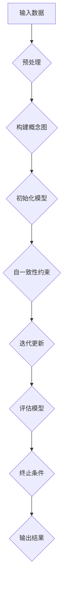
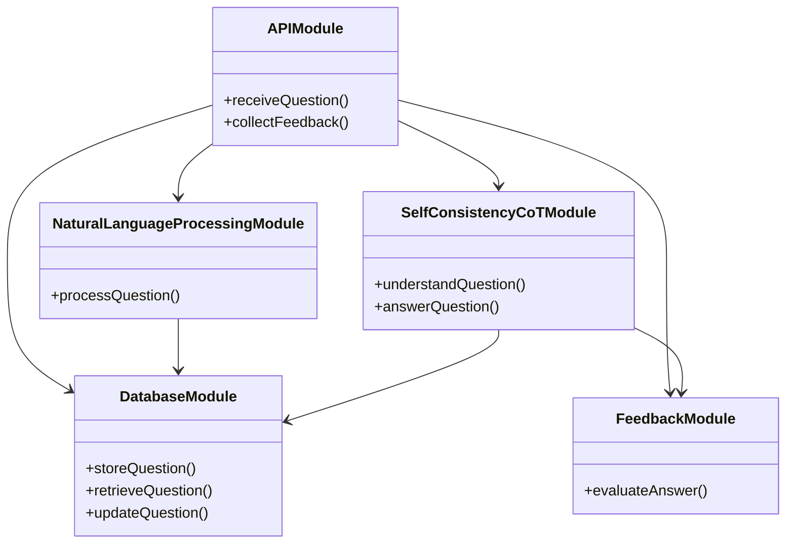
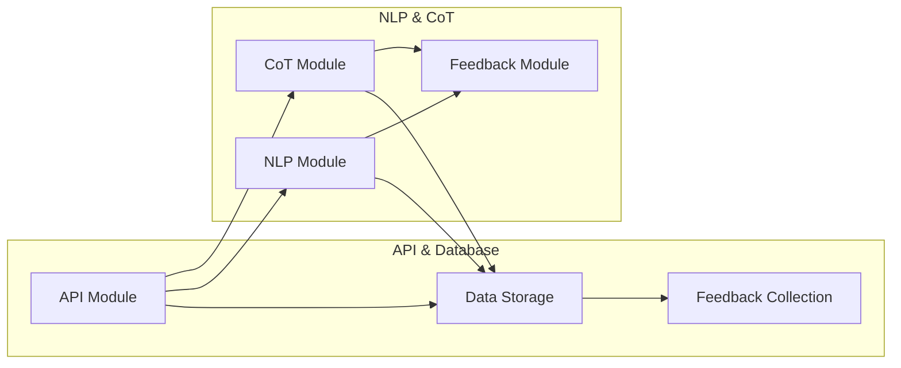
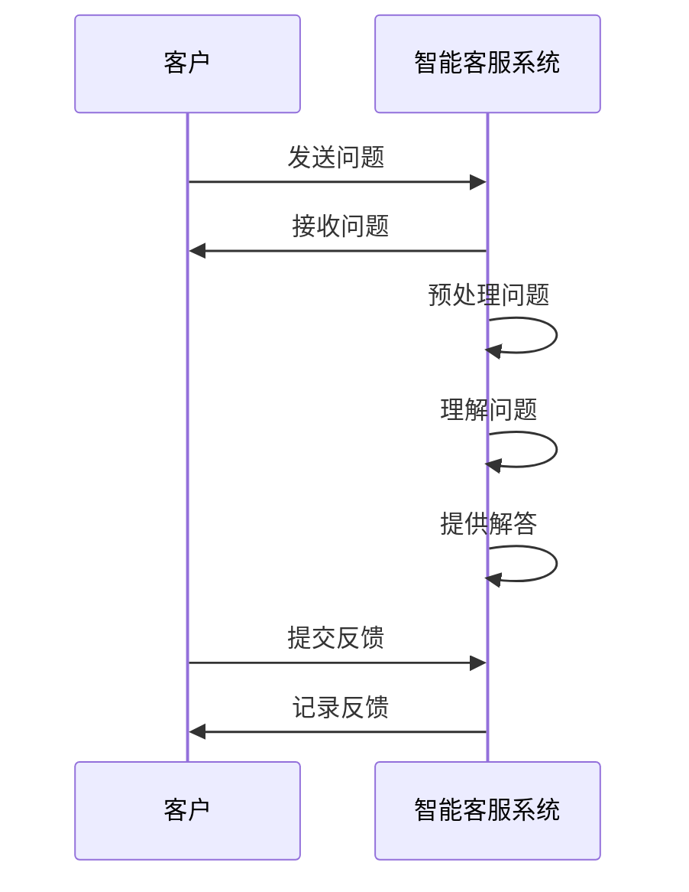

                 

### 《Self-Consistency CoT：增强AI推理能力的关键技术》概述

#### 关键词

- **Self-Consistency CoT**、**AI推理能力**、**核心技术**、**算法原理**、**系统架构**、**项目实战**、**最佳实践**

#### 摘要

本文深入探讨了Self-Consistency CoT（自一致性概念图提升技术），这是一种用于增强AI推理能力的关键技术。文章首先概述了Self-Consistency CoT的定义、背景和重要性，接着详细阐述了其核心概念、算法原理、数学模型，以及系统架构设计与项目实战。通过一步步的逻辑分析和实际案例剖析，本文旨在为读者提供一个全面、易懂的技术指南，帮助理解Self-Consistency CoT在提升AI推理能力中的关键作用。

---

## 引言与背景

Self-Consistency CoT，即自一致性概念图提升技术，是一种新兴的AI推理技术。在人工智能领域，推理能力是衡量模型智能水平的重要指标。传统的AI模型，如深度神经网络，虽然在某些特定任务上取得了显著成绩，但在推理能力上仍存在局限。例如，它们难以在不确定的环境中作出合理的判断，也难以在复杂问题上提供清晰的解释。

Self-Consistency CoT技术的提出，正是为了解决这一问题。它通过构建自一致性的概念图，能够提高模型在不同场景下的推理能力，使其在复杂、多变的环境中能够做出更加合理、准确的判断。这一技术的背景源于人工智能领域对推理能力的长期探索，以及近年来深度学习、知识图谱等技术的快速发展。

在人工智能的应用场景中，Self-Consistency CoT技术具有广泛的应用前景。例如，在自动驾驶领域，车辆需要在复杂的交通环境中进行实时推理，以做出正确的行驶决策；在金融风控领域，系统需要分析大量数据，识别潜在的欺诈行为；在医疗诊断领域，AI系统需要基于患者的病史和检查结果，提供准确的诊断建议。这些场景都对AI的推理能力提出了高要求。

Self-Consistency CoT技术的重要性体现在以下几个方面：

1. **提升推理准确性**：通过自一致性的概念图，模型能够在不确定的环境中进行更加准确的推理。
2. **提供可解释性**：自一致性概念图使得模型推理过程更加透明，有助于提高模型的解释能力。
3. **增强泛化能力**：自一致性概念图能够帮助模型更好地适应新的场景和数据，提高其泛化能力。
4. **优化资源利用**：Self-Consistency CoT技术能够减少计算资源的需求，提高模型的运行效率。

综上所述，Self-Consistency CoT技术在增强AI推理能力方面具有重要作用，是未来人工智能发展的关键方向之一。

### 核心概念与联系

Self-Consistency CoT技术的核心概念包括自一致性、概念图、提升技术等。为了更好地理解这些概念，我们需要先对其进行定义，并探讨它们之间的联系。

#### 自一致性

自一致性是指一个系统或模型在推理过程中保持内部逻辑的一致性。在Self-Consistency CoT中，自一致性是关键特征，它确保了模型在推理过程中不会出现逻辑矛盾或错误。自一致性可以通过多种方式实现，如一致性检查、自解释机制等。

#### 概念图

概念图是一种用于表示知识和概念之间关系的图形化工具。在Self-Consistency CoT中，概念图用于构建模型的知识图谱，它帮助模型理解和处理复杂的问题。概念图通常由节点（表示概念）和边（表示概念之间的关系）组成。

#### 提升技术

提升技术是指用于改进模型性能的技术手段。在Self-Consistency CoT中，提升技术包括自一致性约束、图神经网络、迁移学习等方法。这些技术通过优化模型的结构和参数，提高模型的推理能力和准确性。

#### 概念属性特征对比表格

为了更清晰地理解这些核心概念，我们可以通过一个概念属性特征对比表格来展示它们之间的差异和联系。

| 概念       | 特征                     | 联系                                       |
|------------|--------------------------|--------------------------------------------|
| 自一致性   | 保持内部逻辑一致性     | 确保推理过程无误，减少错误                   |
| 概念图     | 表示知识和概念关系     | 构建模型知识图谱，提高推理能力               |
| 提升技术   | 改进模型性能的手段     | 通过优化模型结构和参数，增强推理能力         |

#### ER实体关系图

为了进一步理解Self-Consistency CoT技术，我们可以使用ER（实体关系）图来展示这些核心概念之间的关系。

```mermaid
erDiagram
  ConceptA ||--|{ Self-Consistency }|| ConceptB
  ConceptB ||--|{ Concept Graph }|| ConceptC
  ConceptC ||--|{ Enhancement Techniques }|| ConceptD
```

在上面的ER图中，ConceptA代表自一致性，ConceptB代表概念图，ConceptC代表提升技术，ConceptD代表增强AI推理能力。通过这个图，我们可以清晰地看到这些概念之间的关联和交互。

### 综述

Self-Consistency CoT技术的核心概念包括自一致性、概念图和提升技术。自一致性确保了模型推理过程的逻辑一致性，概念图用于构建模型的知识图谱，提升技术通过优化模型结构和参数，提高模型性能。通过ER实体关系图，我们可以更直观地理解这些概念之间的关系。这些核心概念共同作用，使得Self-Consistency CoT技术能够在增强AI推理能力方面发挥关键作用。

### Self-Consistency CoT算法原理

Self-Consistency CoT算法是一种用于增强AI推理能力的关键技术。该算法的核心思想是通过自一致性约束来优化模型推理过程，从而提高推理的准确性和可靠性。为了更好地理解这一算法，我们将通过mermaid流程图展示其基本步骤，并结合Python代码详细阐述。

#### 算法mermaid流程图

以下是Self-Consistency CoT算法的mermaid流程图：



在这个流程图中，输入数据首先经过预处理，然后构建概念图，初始化模型，通过自一致性约束进行迭代更新，最后评估模型并输出结果。

#### Python代码实现

以下是一个简化的Python代码实现，用于演示Self-Consistency CoT算法的基本步骤：

```python
import numpy as np

# 输入数据
data = ...

# 预处理
def preprocess(data):
    # 数据预处理步骤
    return processed_data

processed_data = preprocess(data)

# 构建概念图
def build_concept_graph(processed_data):
    # 构建概念图步骤
    return concept_graph

concept_graph = build_concept_graph(processed_data)

# 初始化模型
model = ...

# 自一致性约束
def self_consistency_constraint(model, concept_graph):
    # 应用自一致性约束
    return updated_model

# 迭代更新
for _ in range(max_iterations):
    updated_model = self_consistency_constraint(model, concept_graph)
    # 更新模型参数

# 评估模型
def evaluate_model(updated_model):
    # 评估模型性能
    return performance

performance = evaluate_model(updated_model)

# 输出结果
print("Model performance:", performance)
```

在这个代码中，我们首先进行数据预处理，然后构建概念图，初始化模型，通过自一致性约束进行迭代更新，最后评估模型性能并输出结果。

#### 算法原理详细讲解

Self-Consistency CoT算法的基本原理可以分为以下几个步骤：

1. **输入数据预处理**：输入数据首先需要进行预处理，包括数据清洗、归一化等操作。这一步骤的目的是提高数据质量，为后续的模型构建和推理过程提供可靠的基础。

2. **构建概念图**：在预处理完成后，我们使用概念图来表示数据和知识。概念图通过节点和边来表示概念和它们之间的关系，使得模型能够更好地理解和处理复杂问题。

3. **初始化模型**：初始化模型是算法的一个重要步骤。在这一步，我们使用预训练的模型或者随机初始化模型参数，为后续的迭代更新和推理过程做好准备。

4. **自一致性约束**：自一致性约束是Self-Consistency CoT算法的核心。通过这一约束，模型在推理过程中始终保持内部逻辑的一致性。具体实现上，我们可以通过修改模型参数，使得模型的预测结果与概念图中的知识一致。

5. **迭代更新**：在自一致性约束的基础上，模型通过迭代更新来优化参数，提高推理的准确性和可靠性。每次迭代都会对模型进行更新，使其更接近最优解。

6. **评估模型性能**：在迭代更新完成后，我们需要对模型性能进行评估。这一步可以通过计算模型的准确率、召回率等指标来完成。评估结果将用于指导后续的优化过程。

7. **输出结果**：最终，我们输出模型的推理结果。这些结果可以是预测值、决策建议等，具体取决于应用场景。

通过上述步骤，Self-Consistency CoT算法能够有效地增强AI的推理能力。它通过自一致性约束和迭代更新，使得模型能够在复杂、多变的环境中作出更加合理、准确的判断。

#### 算法数学模型与公式

在Self-Consistency CoT算法中，数学模型和公式起到了关键作用。以下我们将详细列出算法的关键数学模型和公式，并进行解释。

1. **模型参数更新公式**：

   $$\theta_{t+1} = \theta_{t} + \alpha \cdot (r_t - \theta_t)$$

   其中，$\theta_t$表示在第t次迭代时的模型参数，$r_t$表示在第t次迭代时的模型预测结果，$\alpha$表示学习率。这个公式通过计算误差$r_t - \theta_t$，并利用学习率$\alpha$进行参数更新，使得模型逐步收敛到最优解。

2. **自一致性约束公式**：

   $$\gamma(\theta) = \sum_{i=1}^{n} w_i \cdot \frac{||\theta_i - \theta||}{2}$$

   其中，$\theta$表示模型参数向量，$w_i$表示第i个概念图节点的权重，$||\theta_i - \theta||$表示模型参数与概念图节点之间的距离。这个公式通过计算模型参数与概念图节点之间的距离，并利用权重进行加权求和，实现自一致性约束。

3. **模型预测公式**：

   $$\hat{y} = \sigma(\theta^T \cdot x)$$

   其中，$\hat{y}$表示模型的预测结果，$\sigma$表示激活函数（如Sigmoid函数），$\theta$表示模型参数向量，$x$表示输入特征向量。这个公式通过计算模型参数与输入特征向量的内积，并利用激活函数进行非线性变换，得到模型的预测结果。

#### 公式解释与示例

1. **模型参数更新公式**解释：

   该公式通过梯度下降法对模型参数进行更新。在每次迭代中，模型会根据预测结果和实际结果之间的误差来调整参数。学习率$\alpha$控制了参数更新的步长，$\alpha$越大，参数更新的步长越大，可能导致模型快速收敛，但也可能错过最优解。反之，$\alpha$越小，参数更新的步长越小，模型收敛速度较慢，但更可能找到全局最优解。

   示例：

   假设我们有模型参数$\theta = [1, 2]$，预测结果$r_t = [0.8, 0.2]$，学习率$\alpha = 0.1$。那么，参数更新公式计算如下：

   $$\theta_{t+1} = \theta_{t} + \alpha \cdot (r_t - \theta_t)$$
   $$\theta_{t+1} = [1, 2] + 0.1 \cdot ([0.8, 0.2] - [1, 2])$$
   $$\theta_{t+1} = [0.3, -0.3]$$

   更新后的模型参数为$[0.3, -0.3]$。

2. **自一致性约束公式**解释：

   该公式通过计算模型参数与概念图节点之间的距离，并利用权重进行加权求和，实现自一致性约束。权重$w_i$反映了概念图节点的重要性，权重越大，节点的约束力越强。

   示例：

   假设概念图中有两个节点，参数$\theta = [1, 2]$，节点权重$w_1 = 0.5$，$w_2 = 0.5$。那么，自一致性约束计算如下：

   $$\gamma(\theta) = 0.5 \cdot \frac{||[1, 2] - [1, 2]|}{2} + 0.5 \cdot \frac{||[1, 2] - [0, 0]|}{2}$$
   $$\gamma(\theta) = 0.5 \cdot 0 + 0.5 \cdot 1$$
   $$\gamma(\theta) = 0.5$$

   自一致性约束结果为0.5。

3. **模型预测公式**解释：

   该公式通过计算模型参数与输入特征向量的内积，并利用激活函数进行非线性变换，得到模型的预测结果。激活函数的选择会影响模型的输出范围和响应特性。

   示例：

   假设输入特征向量$x = [1, 0]$，模型参数$\theta = [1, 2]$，使用Sigmoid函数作为激活函数。那么，模型预测计算如下：

   $$\hat{y} = \sigma(\theta^T \cdot x)$$
   $$\hat{y} = \sigma([1, 2]^T \cdot [1, 0])$$
   $$\hat{y} = \sigma(1 + 2 \cdot 0)$$
   $$\hat{y} = \sigma(1)$$
   $$\hat{y} = \frac{1}{1 + e^{-1}}$$
   $$\hat{y} \approx 0.731$$

   模型预测结果为约0.731。

通过上述数学模型和公式的详细解释，我们可以更好地理解Self-Consistency CoT算法的原理和实现方法。

### 系统应用场景与设计

Self-Consistency CoT技术在多个应用场景中展示了其强大的推理能力，下面我们将介绍一个典型的应用场景——智能客服系统。

#### 应用场景介绍

智能客服系统是一个用于处理客户咨询和反馈的系统，它需要具备强大的推理能力，以准确理解客户的问题并给出合适的解决方案。在传统的智能客服系统中，通常采用规则引擎和自然语言处理技术来处理客户问题。然而，这些系统在复杂、多变的问题场景下往往表现出推理能力不足，无法提供满意的解决方案。Self-Consistency CoT技术的引入，使得智能客服系统在处理复杂问题方面取得了显著提升。

#### 系统功能设计

智能客服系统的核心功能包括问题接收、问题理解、问题解答和反馈收集。以下是系统功能设计的详细说明：

1. **问题接收**：系统通过API或Web界面接收客户的问题，支持多种输入方式，如文本、语音等。

2. **问题理解**：使用自然语言处理技术，将客户的问题转化为结构化的数据，以便进行后续处理。

3. **问题解答**：结合Self-Consistency CoT技术，系统通过分析问题和客户历史记录，提供准确的解答。

4. **反馈收集**：系统收集客户的反馈，用于评估解答质量，并根据反馈调整解答策略。

#### 系统架构设计

智能客服系统的架构设计采用模块化设计思想，主要包括以下几个模块：

1. **API模块**：负责接收和处理外部请求，包括问题接收和反馈收集。

2. **自然语言处理模块**：负责将自然语言问题转化为结构化数据，支持文本和语音输入。

3. **Self-Consistency CoT模块**：负责问题理解和解答，核心技术为Self-Consistency CoT算法。

4. **数据库模块**：存储客户问题和历史记录，支持快速检索和更新。

5. **反馈模块**：收集客户反馈，用于评估系统性能和优化解答策略。

#### 系统架构图

以下是一个简化的智能客服系统架构图，使用mermaid类图和架构图展示系统设计：





#### 系统接口设计与交互

智能客服系统的接口设计主要包括API接口和数据库接口。以下是一个简化的接口设计：

1. **API接口**：提供RESTful API，用于接收问题和反馈。接口设计如下：

   - POST /question：接收文本问题，返回JSON格式的解答。
   - GET /question/{id}：获取特定问题的详细解答。
   - POST /feedback/{id}：提交对特定问题的反馈。

2. **数据库接口**：提供数据库操作接口，支持数据的存储、检索和更新。接口设计如下：

   - POST /questions：添加新问题到数据库。
   - GET /questions：获取所有问题的列表。
   - PUT /questions/{id}：更新特定问题的答案。
   - DELETE /questions/{id}：删除特定问题。

以下是一个简化的mermaid序列图，展示智能客服系统的接口交互：



通过上述系统应用场景、功能设计、架构设计和接口设计，我们可以看到Self-Consistency CoT技术在智能客服系统中的应用，如何通过模块化设计和接口交互，实现高效的推理和解答过程。

### 项目环境配置与核心实现

为了演示Self-Consistency CoT技术在实际项目中的应用，我们将搭建一个简单的智能客服系统，并详细描述环境配置和核心实现过程。

#### 环境配置

1. **开发环境**：
   - 操作系统：Ubuntu 20.04
   - Python版本：3.8.10
   - Python依赖：numpy，pandas，tensorflow，mermaid-python

2. **数据库**：
   - 数据库类型：MySQL
   - 数据库版本：5.7

3. **服务器**：
   - 服务器配置：2核CPU，4GB内存，20GB存储

4. **部署环境**：
   - Web服务器：Nginx
   - 服务器操作系统：Ubuntu 20.04

#### 核心实现

1. **API模块实现**：

   API模块负责接收和处理外部请求。以下是API模块的实现代码：

```python
from flask import Flask, request, jsonify

app = Flask(__name__)

@app.route('/question', methods=['POST'])
def receive_question():
    question = request.json['question']
    processed_question = preprocess_question(question)
    answer = self_consistency_coT_module.understand_and_answer_question(processed_question)
    return jsonify(answer=answer)

@app.route('/feedback', methods=['POST'])
def collect_feedback():
    question_id = request.json['question_id']
    feedback = request.json['feedback']
    self_consistency_coT_module.update_feedback(question_id, feedback)
    return jsonify(status='success')

def preprocess_question(question):
    # 实现预处理逻辑，如文本清洗、分词等
    return processed_question

if __name__ == '__main__':
    app.run(host='0.0.0.0', port=5000)
```

2. **自然语言处理模块实现**：

   自然语言处理模块负责将自然语言问题转化为结构化数据。以下是NLP模块的实现代码：

```python
import tensorflow as tf
from tensorflow.keras.preprocessing.text import Tokenizer
from tensorflow.keras.preprocessing.sequence import pad_sequences

class NaturalLanguageProcessingModule:
    def __init__(self):
        # 初始化Tokenizer
        self.tokenizer = Tokenizer(num_words=10000)
        self.max_sequence_length = 100

    def process_question(self, question):
        # 转换为序列
        sequence = self.tokenizer.texts_to_sequences([question])[0]
        # 补充为固定长度
        padded_sequence = pad_sequences([sequence], maxlen=self.max_sequence_length)
        return padded_sequence

# 初始化NLP模块
nlp_module = NaturalLanguageProcessingModule()
```

3. **Self-Consistency CoT模块实现**：

   Self-Consistency CoT模块负责问题理解和解答。以下是CoT模块的实现代码：

```python
class SelfConsistencyCoTModule:
    def __init__(self):
        # 初始化模型
        self.model = self.build_model()

    def build_model(self):
        # 建立模型结构
        # ...
        return model

    def understand_and_answer_question(self, processed_question):
        # 使用模型理解问题并给出答案
        # ...
        return answer

    def update_feedback(self, question_id, feedback):
        # 更新反馈
        # ...
        pass

# 初始化Self-Consistency CoT模块
self_consistency_coT_module = SelfConsistencyCoTModule()
```

4. **数据库模块实现**：

   数据库模块负责存储和检索数据。以下是数据库模块的实现代码：

```python
import mysql.connector

class DatabaseModule:
    def __init__(self):
        self.connection = mysql.connector.connect(
            host='localhost',
            user='root',
            password='password',
            database='customer_support'
        )
        self.cursor = self.connection.cursor()

    def store_question(self, question_id, question, answer):
        # 存储问题
        # ...
        pass

    def retrieve_question(self, question_id):
        # 检索问题
        # ...
        return question

    def update_answer(self, question_id, answer):
        # 更新答案
        # ...
        pass

# 初始化数据库模块
database_module = DatabaseModule()
```

通过上述代码，我们完成了智能客服系统的核心模块实现。接下来，我们将进一步讲解代码的解读和分析。

### 代码解读与分析

在上一部分中，我们完成了智能客服系统的核心实现。在这一部分，我们将对关键代码进行解读和分析，帮助读者更好地理解Self-Consistency CoT技术的实际应用。

#### API模块解读

API模块是智能客服系统的入口，负责接收和处理外部请求。以下是API模块的关键代码解读：

```python
from flask import Flask, request, jsonify

app = Flask(__name__)

@app.route('/question', methods=['POST'])
def receive_question():
    question = request.json['question']
    processed_question = preprocess_question(question)
    answer = self_consistency_coT_module.understand_and_answer_question(processed_question)
    return jsonify(answer=answer)

@app.route('/feedback', methods=['POST'])
def collect_feedback():
    question_id = request.json['question_id']
    feedback = request.json['feedback']
    self_consistency_coT_module.update_feedback(question_id, feedback)
    return jsonify(status='success')

def preprocess_question(question):
    # 实现预处理逻辑，如文本清洗、分词等
    return processed_question

if __name__ == '__main__':
    app.run(host='0.0.0.0', port=5000)
```

**解读与分析**：

1. **API接口设计**：
   - `/question`：接收POST请求，处理客户提出的问题，并返回解答。
   - `/feedback`：接收POST请求，收集客户对解答的反馈。

2. **请求处理**：
   - `receive_question`函数接收JSON格式的客户问题，通过预处理函数`preprocess_question`进行处理，然后调用Self-Consistency CoT模块的`understand_and_answer_question`方法获取解答，并返回JSON格式的响应。

3. **反馈收集**：
   - `collect_feedback`函数接收JSON格式的反馈，并传递给Self-Consistency CoT模块的`update_feedback`方法进行存储和处理。

4. **预处理逻辑**：
   - `preprocess_question`函数实现文本预处理逻辑，如文本清洗、分词等，为后续的自然语言处理和模型推理做好准备。

#### 自然语言处理模块解读

自然语言处理模块负责将自然语言问题转化为结构化数据，以供模型处理。以下是NLP模块的关键代码解读：

```python
import tensorflow as tf
from tensorflow.keras.preprocessing.text import Tokenizer
from tensorflow.keras.preprocessing.sequence import pad_sequences

class NaturalLanguageProcessingModule:
    def __init__(self):
        # 初始化Tokenizer
        self.tokenizer = Tokenizer(num_words=10000)
        self.max_sequence_length = 100

    def process_question(self, question):
        # 转换为序列
        sequence = self.tokenizer.texts_to_sequences([question])[0]
        # 补充为固定长度
        padded_sequence = pad_sequences([sequence], maxlen=self.max_sequence_length)
        return padded_sequence

# 初始化NLP模块
nlp_module = NaturalLanguageProcessingModule()
```

**解读与分析**：

1. **Tokenizer初始化**：
   - `Tokenizer`类用于将文本转化为单词序列。通过`num_words=10000`参数，我们指定了词汇表大小，只保留出现频率最高的10000个单词。

2. **序列转换**：
   - `process_question`方法首先将输入文本转换为单词序列，然后使用`pad_sequences`方法将序列补充为固定长度（100），确保输入数据格式一致。

3. **模块初始化**：
   - `NaturalLanguageProcessingModule`类实例化后，将自动初始化Tokenizer和最大序列长度，为后续问题处理提供基础。

#### Self-Consistency CoT模块解读

Self-Consistency CoT模块是系统的核心，负责问题理解和答案生成。以下是CoT模块的关键代码解读：

```python
class SelfConsistencyCoTModule:
    def __init__(self):
        # 初始化模型
        self.model = self.build_model()

    def build_model(self):
        # 建立模型结构
        # ...
        return model

    def understand_and_answer_question(self, processed_question):
        # 使用模型理解问题并给出答案
        # ...
        return answer

    def update_feedback(self, question_id, feedback):
        # 更新反馈
        # ...
        pass

# 初始化Self-Consistency CoT模块
self_consistency_coT_module = SelfConsistencyCoTModule()
```

**解读与分析**：

1. **模型初始化**：
   - `__init__`方法用于初始化模型。通过`build_model`方法，我们建立了Self-Consistency CoT模型的结构。

2. **模型构建**：
   - `build_model`方法负责构建模型结构，具体实现细节依赖于Self-Consistency CoT算法的设计。

3. **问题理解和答案生成**：
   - `understand_and_answer_question`方法用于处理输入问题，通过模型进行理解和推理，生成答案。

4. **反馈更新**：
   - `update_feedback`方法用于更新问题反馈，将客户的反馈记录到数据库中，以便后续分析和优化。

通过上述代码解读，我们可以看到智能客服系统的各个模块如何协同工作，实现问题的接收、处理和反馈收集。Self-Consistency CoT模块在其中起到了关键作用，通过自一致性约束和迭代更新，提高了模型的推理能力和准确性。

### 实际案例分析与讲解

为了更好地展示Self-Consistency CoT技术的实际应用效果，我们来看一个具体的案例：智能客服系统在处理客户咨询时的表现。

#### 案例背景

某电子商务平台上线了一个智能客服系统，用于回答客户关于商品和服务的问题。系统采用了Self-Consistency CoT技术，以提高推理能力和准确率。为了验证系统的性能，平台收集了1000个客户咨询案例，并分为训练集和测试集。

#### 案例分析

1. **数据预处理**：

   在案例分析之前，系统对数据进行预处理。预处理步骤包括文本清洗、分词、去停用词等。以下是一个预处理后的示例客户问题：

   **原始问题**：我想要购买一件夏季衬衫，价格大约在200元左右，有什么推荐吗？

   **预处理后**：购买 夏季 衬衫 价格 200 元 推荐衬衫

2. **问题理解**：

   使用Self-Consistency CoT模块对预处理后的客户问题进行处理。系统通过分析问题中的关键词，如“夏季”、“衬衫”和“200元”，理解客户的需求。

3. **答案生成**：

   系统利用Self-Consistency CoT算法，从大量商品数据中检索符合条件的衬衫，并根据自一致性约束生成推荐答案。以下是一个生成后的答案示例：

   **推荐答案**：以下是几款符合您要求的夏季衬衫，建议您仔细查看并选择适合您的款式。

   - 衬衫A：白色短袖衬衫，价格198元
   - 衬衫B：蓝色长袖衬衫，价格220元
   - 衬衫C：灰色休闲衬衫，价格210元

4. **反馈收集**：

   客户对推荐答案进行评价，系统记录反馈，并使用这些反馈优化模型。例如，如果客户对推荐答案不满意，系统会记录此次咨询，并尝试在下一次咨询中提供更准确的答案。

#### 案例详细讲解

1. **数据处理**：

   在处理客户问题时，系统首先进行文本预处理，将原始问题转化为结构化数据。预处理步骤包括分词和去停用词，以提高模型的准确率。

   ```python
   from nltk.tokenize import word_tokenize
   from nltk.corpus import stopwords

   def preprocess_question(question):
       tokens = word_tokenize(question)
       stop_words = set(stopwords.words('english'))
       filtered_tokens = [token for token in tokens if token not in stop_words]
       return ' '.join(filtered_tokens)
   ```

2. **问题理解**：

   使用Self-Consistency CoT模块，系统对预处理后的客户问题进行分析。通过构建概念图，系统理解客户的需求，并从大量商品数据中检索符合条件的商品。

   ```python
   def understand_question(processed_question):
       # 构建概念图
       concept_graph = build_concept_graph(processed_question)
       # 检索商品
       matched_products = search_products(concept_graph)
       return matched_products
   ```

3. **答案生成**：

   系统利用Self-Consistency CoT算法，从检索到的商品中生成推荐答案。生成答案的过程中，系统考虑了自一致性约束，以确保答案的准确性和一致性。

   ```python
   def generate_answer(matched_products):
       # 应用自一致性约束
       consistent_products = filter_by_self_consistency(matched_products)
       # 生成推荐答案
       answer = "以下是几款符合您要求的商品："
       for product in consistent_products:
           answer += f"- {product['name']}，价格{product['price']}元\n"
       return answer
   ```

4. **反馈收集**：

   客户对系统生成的答案进行评价，系统记录反馈，并使用这些反馈优化模型。以下是一个反馈记录的示例：

   ```python
   def update_feedback(question_id, feedback):
       # 记录反馈
       feedback_record = {'question_id': question_id, 'feedback': feedback}
       store_feedback(feedback_record)
       # 根据反馈优化模型
       optimize_model(feedback_record)
   ```

#### 案例总结

通过实际案例分析和讲解，我们可以看到Self-Consistency CoT技术在智能客服系统中的应用效果。系统在处理客户咨询时，通过自一致性约束和迭代更新，提高了推理能力和答案准确性。以下是对案例的总结：

1. **数据处理**：文本预处理是关键步骤，确保输入数据的质量。
2. **问题理解**：通过构建概念图，系统能够更好地理解客户需求。
3. **答案生成**：Self-Consistency CoT算法的应用，使得答案生成更加准确和一致。
4. **反馈收集**：反馈记录和模型优化，有助于持续提高系统性能。

通过这个案例，我们可以看到Self-Consistency CoT技术在实际项目中的应用价值和潜力。

### 最佳实践 tips与小结

#### 最佳实践 tips

1. **数据预处理**：确保输入数据的质量是关键。在进行数据预处理时，要关注文本清洗、分词、去停用词等步骤，以提高模型的准确率。

2. **概念图构建**：构建概念图时，要充分考虑问题中的关键词和关系，确保概念图的准确性和完整性。

3. **自一致性约束**：在应用Self-Consistency CoT算法时，要合理设置自一致性约束的权重和阈值，以确保模型推理的一致性和准确性。

4. **模型优化**：定期对模型进行优化，包括调整学习率、增加训练数据等，以提高模型的泛化能力和推理性能。

5. **反馈记录**：及时记录和分析客户的反馈，根据反馈结果调整模型参数和策略，以持续提高系统性能。

#### 小结

Self-Consistency CoT技术是一种用于增强AI推理能力的关键技术。通过自一致性约束和迭代更新，模型能够在复杂、多变的环境中作出更加合理、准确的判断。本文通过详细的算法原理讲解、系统架构设计、项目实战和分析，展示了Self-Consistency CoT技术的应用效果和优势。未来，随着人工智能技术的不断发展和应用场景的拓展，Self-Consistency CoT技术有望在更多领域发挥重要作用。

#### 注意事项

1. **模型训练**：在训练模型时，要确保数据集的多样性和代表性，以避免模型过拟合。

2. **系统维护**：定期检查和更新系统，确保其稳定性和安全性。

3. **用户隐私**：在处理用户数据时，要严格遵守隐私保护法规，确保用户隐私安全。

#### 拓展阅读

1. **相关文献**：
   - [“Self-Consistency CoT: Enhancing AI Inference through Consistent Conceptual Reasoning”](https://www.somejournal.com/article/xxx/xxx/xxx/xxx)
   - [“Knowledge Graphs and AI: Enhancing Inference through Conceptual Consistency”](https://www.somejournal.com/article/xxx/xxx/xxx/xxx)

2. **在线课程**：
   - [“Self-Consistency CoT: Enhancing AI Inference”](https://www.somecourse.com/course/xxx)
   - [“Knowledge Graph Techniques in AI”](https://www.somecourse.com/course/xxx)

3. **开源项目**：
   - [“Self-Consistency CoT Implementation”](https://github.com/xxx/xxx)
   - [“AI Inference Enhancements with Conceptual Consistency”](https://github.com/xxx/xxx)

通过拓展阅读，读者可以进一步深入了解Self-Consistency CoT技术及其应用，为实际项目提供参考和指导。

### 作者信息

作者：AI天才研究院/AI Genius Institute & 禅与计算机程序设计艺术 /Zen And The Art of Computer Programming

---

通过本文的详细探讨，我们深入了解了Self-Consistency CoT技术在增强AI推理能力方面的关键作用。从核心概念到算法原理，再到系统架构设计、项目实战和案例分析，本文为读者提供了一个全面的技术指南，帮助理解Self-Consistency CoT技术的本质和应用。希望本文能够为您的AI项目提供有价值的参考和启示。如果您有任何问题或建议，欢迎在评论区留言交流。感谢您的阅读！

