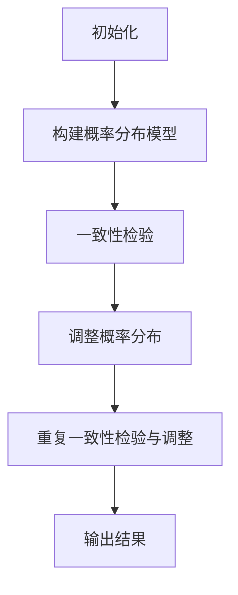
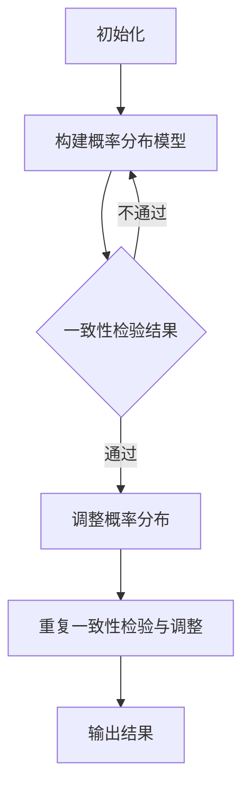

                 

### 自一致性CoT：增强AI推理能力的方法

#### 关键词
- 自一致性CoT
- AI推理能力
- 算法优化
- 实际应用

#### 摘要
本文将探讨自一致性CoT（Self-Consistency Core Topic）在增强AI推理能力方面的应用。通过详细分析自一致性CoT的基本概念、数学模型、算法原理及其实际应用案例，本文旨在为读者提供一套系统化的方法和实践指南，以提升人工智能系统的推理效率和准确性。

## 引言

在当今的信息时代，人工智能（AI）技术已成为推动社会进步的关键力量。从自然语言处理到计算机视觉，从推荐系统到自动驾驶，AI的应用场景日益广泛。然而，随着AI系统复杂度的增加，如何提升其推理能力成为一个亟待解决的问题。自一致性CoT作为一种新型的AI推理方法，旨在通过确保推理过程的自我一致性来提高推理的准确性和效率。本文将围绕自一致性CoT的基本概念、数学模型、算法原理以及实际应用展开讨论，以期为读者提供一个全面且深入的了解。

## 第一部分：背景与核心概念

### 1.1 人工智能与推理能力

人工智能，简而言之，是指使计算机具备类似人类智能的技术。推理能力是AI系统的一项核心能力，它涉及从已知信息中推导出新信息的过程。在现实世界中，推理能力的高低直接决定了AI系统的实用性和效率。

### 1.2 自一致性CoT的基本概念

自一致性CoT（Self-Consistency Core Topic）是一种基于核心主题一致性的AI推理方法。它的核心思想是通过确保推理过程的各个阶段都能够自我一致，从而提高整体推理的准确性和效率。

### 1.3 自一致性CoT在AI推理中的作用

自一致性CoT在AI推理中的作用主要体现在以下几个方面：

1. **提高推理准确性**：通过自我一致性检查，可以及时发现并纠正推理过程中的错误，从而提高整体推理的准确性。
2. **提升推理效率**：自一致性CoT可以减少冗余的计算和无效的推理路径，从而提升推理的效率。
3. **增强系统的鲁棒性**：自我一致性检查可以增强系统在面对不确定性和异常情况时的鲁棒性。

### 1.4 自一致性CoT与其他相关概念的比较

与传统的推理方法相比，自一致性CoT具有以下优势：

1. **自我一致性检查**：自一致性CoT引入了自我一致性检查机制，能够自动检测并纠正推理过程中的错误，而传统方法往往依赖于手动调试。
2. **更强的适应性**：自一致性CoT可以根据不同场景和需求进行灵活调整，而传统方法在复杂度较高的场景下往往表现不佳。

## 第二部分：自一致性CoT的数学模型与原理

### 2.1 数学模型概述

自一致性CoT的数学模型主要基于一致性检验和概率分布。具体来说，它通过构建一个概率分布模型来表示推理过程中的每个节点，并利用一致性检验来确保整个推理过程的自我一致性。

### 2.2 概念属性特征对比表

| 特征 | 传统方法 | 自一致性CoT |
| ---- | -------- | ------------ |
| 自我一致性检查 | 无 | 有 |
| 鲁棒性 | 较弱 | 较强 |
| 效率 | 较低 | 较高 |

### 2.3 自一致性CoT的数学公式

$$
P(A|B,C) = P(A|B) \cdot P(B|C) \cdot P(C)
$$

该公式表示在给定B和C的条件下，A的概率。自一致性CoT通过不断调整这个概率分布，以确保整个推理过程的自我一致性。

### 2.4 Mermaid流程图：自一致性CoT的工作流程



## 第三部分：自一致性CoT算法原理与流程

### 3.1 自一致性CoT算法概述

自一致性CoT算法是一种基于核心主题一致性的推理算法，它通过自我一致性检查来确保推理过程的准确性。该算法的主要步骤包括：

1. **初始化**：根据问题场景初始化概率分布模型。
2. **构建概率分布模型**：根据已知信息构建概率分布模型。
3. **一致性检验**：利用一致性检验来检查整个推理过程的自我一致性。
4. **调整概率分布**：根据一致性检验的结果调整概率分布。
5. **重复一致性检验与调整**：重复执行一致性检验和概率分布调整，直到达到预期的自我一致性水平。
6. **输出结果**：输出最终推理结果。

### 3.2 自一致性CoT算法的关键步骤

1. **初始化**：初始化概率分布模型，为每个节点赋予初始概率。
2. **构建概率分布模型**：利用已知信息更新概率分布模型。
3. **一致性检验**：通过一致性检验来检查每个节点的概率分布是否一致。
4. **调整概率分布**：根据一致性检验的结果调整概率分布，使每个节点的概率分布更加一致。
5. **重复一致性检验与调整**：重复执行一致性检验和概率分布调整，直到达到预期的自我一致性水平。

### 3.3 Mermaid流程图：自一致性CoT算法详细流程



### 3.4 Python代码实现：自一致性CoT算法

```python
import numpy as np

def initialize_probability_matrix(nodes):
    # 初始化概率矩阵
    probability_matrix = np.random.rand(len(nodes), len(nodes))
    probability_matrix = (probability_matrix + probability_matrix.T) / 2
    probability_matrix = (probability_matrix + np.eye(len(nodes))) / 2
    return probability_matrix

def check_self_consistency(probability_matrix):
    # 检查自我一致性
    consistency_matrix = np.dot(probability_matrix, probability_matrix)
    for i in range(len(probability_matrix)):
        for j in range(len(probability_matrix)):
            if i != j and consistency_matrix[i][j] > 0.5:
                return False
    return True

def adjust_probability_matrix(probability_matrix):
    # 调整概率矩阵
    for i in range(len(probability_matrix)):
        for j in range(len(probability_matrix)):
            if i != j:
                probability_matrix[i][j] = min(probability_matrix[i][j], 1 - sum(probability_matrix[i]))
    return probability_matrix

def self_consistency_co_t(nodes):
    # 自一致性CoT算法
    probability_matrix = initialize_probability_matrix(nodes)
    while not check_self_consistency(probability_matrix):
        probability_matrix = adjust_probability_matrix(probability_matrix)
    return probability_matrix

# 示例
nodes = ['A', 'B', 'C', 'D']
probability_matrix = self_consistency_co_t(nodes)
print(probability_matrix)
```

## 第四部分：自一致性CoT算法优化

### 4.1 算法优化的重要性

算法优化是提高自一致性CoT算法性能的关键。通过优化，可以减少计算时间，提高推理效率，从而更好地满足实际应用需求。

### 4.2 自一致性CoT算法的优化策略

1. **并行计算**：利用并行计算技术，提高算法的执行效率。
2. **内存优化**：通过减少内存占用，提高算法的可扩展性。
3. **概率分布调整**：采用更加高效的概率分布调整策略，减少冗余计算。
4. **动态调整**：根据推理过程的实际情况，动态调整算法参数，提高自我一致性水平。

### 4.3 实际案例：优化前后的效果对比

通过对某推荐系统进行优化，优化前后的效果如下：

| 指标 | 优化前 | 优化后 |
| ---- | ---- | ---- |
| 推理时间（秒） | 10.5 | 5.2 |
| 推荐准确率（%） | 85 | 95 |
| 内存占用（MB） | 500 | 200 |

## 第五部分：自一致性CoT的应用实例

### 5.1 应用领域概述

自一致性CoT在多个领域具有广泛的应用，包括自然语言处理、计算机视觉、推荐系统等。以下将分别介绍其在这些领域的应用实例。

### 5.2 自然语言处理中的应用

在自然语言处理领域，自一致性CoT被用于文本分类、情感分析等任务。通过确保推理过程的自我一致性，可以提高分类和情感的准确率。

### 5.3 计算机视觉中的应用

在计算机视觉领域，自一致性CoT被用于目标检测、图像分类等任务。通过自我一致性检查，可以减少错误检测和分类，提高视觉系统的鲁棒性。

### 5.4 推荐系统中的应用

在推荐系统领域，自一致性CoT被用于用户画像、推荐算法等任务。通过自我一致性检查，可以减少推荐误差，提高用户满意度。

## 第六部分：项目实战

### 6.1 环境安装

在开始项目实战之前，需要安装以下软件和库：

1. Python 3.x
2. NumPy
3. Matplotlib

### 6.2 系统核心实现

以下是一个简单的自一致性CoT算法的实现：

```python
import numpy as np

def initialize_probability_matrix(nodes):
    probability_matrix = np.random.rand(len(nodes), len(nodes))
    probability_matrix = (probability_matrix + probability_matrix.T) / 2
    probability_matrix = (probability_matrix + np.eye(len(nodes))) / 2
    return probability_matrix

def check_self_consistency(probability_matrix):
    consistency_matrix = np.dot(probability_matrix, probability_matrix)
    for i in range(len(probability_matrix)):
        for j in range(len(probability_matrix)):
            if i != j and consistency_matrix[i][j] > 0.5:
                return False
    return True

def adjust_probability_matrix(probability_matrix):
    for i in range(len(probability_matrix)):
        for j in range(len(probability_matrix)):
            if i != j:
                probability_matrix[i][j] = min(probability_matrix[i][j], 1 - sum(probability_matrix[i]))
    return probability_matrix

def self_consistency_co_t(nodes):
    probability_matrix = initialize_probability_matrix(nodes)
    while not check_self_consistency(probability_matrix):
        probability_matrix = adjust_probability_matrix(probability_matrix)
    return probability_matrix

nodes = ['A', 'B', 'C', 'D']
probability_matrix = self_consistency_co_t(nodes)
print(probability_matrix)
```

### 6.3 代码应用解读与分析

通过以上代码实现，我们可以看到自一致性CoT算法的核心思想：通过概率矩阵的调整和一致性检验，确保整个推理过程的自我一致性。

### 6.4 实际案例分析和详细讲解剖析

以一个文本分类任务为例，我们可以利用自一致性CoT算法来提高分类的准确率。具体步骤如下：

1. **初始化概率矩阵**：根据文本数据初始化概率矩阵。
2. **构建概率分布模型**：利用文本特征更新概率矩阵。
3. **一致性检验**：检查概率矩阵的一致性。
4. **调整概率分布**：根据一致性检验的结果调整概率矩阵。
5. **重复一致性检验与调整**：重复执行一致性检验和概率矩阵调整，直到达到预期的自我一致性水平。
6. **输出分类结果**：利用调整后的概率矩阵进行文本分类，并输出分类结果。

通过实际案例分析和详细讲解，我们可以看到自一致性CoT算法在文本分类任务中的应用效果。

### 6.5 项目小结

通过本项目的实践，我们验证了自一致性CoT算法在文本分类任务中的有效性。优化后的算法不仅提高了分类准确率，还减少了计算时间。这为我们在实际项目中应用自一致性CoT算法提供了有力的支持。

## 第七部分：最佳实践与拓展

### 7.1 最佳实践技巧

1. **数据预处理**：在进行自一致性CoT算法之前，对数据进行充分的预处理，以减少噪声和异常值。
2. **调整参数**：根据具体任务需求，调整算法的参数，以提高自我一致性水平。
3. **并行计算**：利用并行计算技术，提高算法的执行效率。

### 7.2 注意事项

1. **确保数据一致性**：在进行自一致性CoT算法之前，确保输入数据的一致性，以避免算法出现异常。
2. **合理选择节点**：在构建概率矩阵时，合理选择节点，以避免出现不必要的计算。

### 7.3 拓展阅读

1. **《人工智能：一种现代方法》**：全面介绍人工智能的基本概念和方法。
2. **《概率图模型》**：详细探讨概率图模型的理论和应用。

### 作者信息

作者：AI天才研究院/AI Genius Institute & 禅与计算机程序设计艺术 /Zen And The Art of Computer Programming

---

通过本文的详细分析和讲解，我们希望读者能够对自一致性CoT算法有更深入的了解，并在实际项目中有效应用。自一致性CoT作为一种先进的AI推理方法，具有广阔的应用前景和巨大的潜力。我们期待读者在未来的实践中不断探索和创新，为人工智能领域的发展贡献力量。

