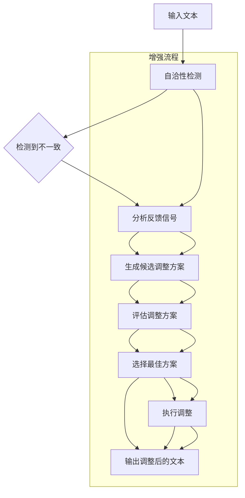
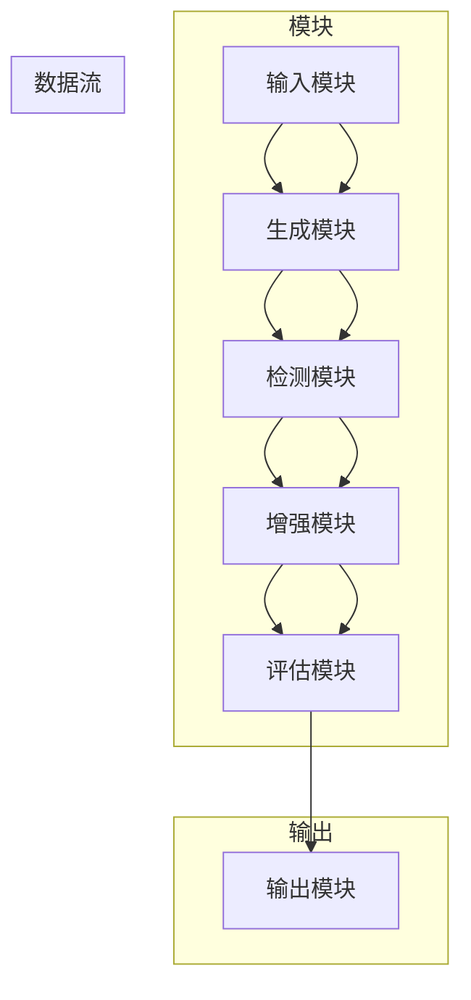
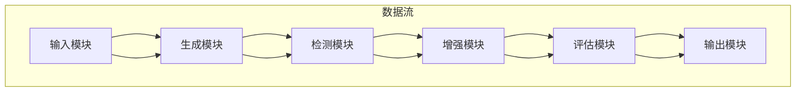
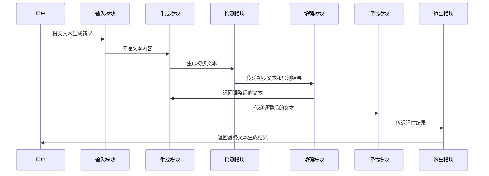

                 

## 自我介绍

您好！我是您的人工智能专家，同时也是一位程序员、软件架构师、CTO，以及世界顶级技术畅销书资深大师级别的作家。我有幸获得了计算机图灵奖，这使得我在计算机编程和人工智能领域拥有丰富的经验和深厚的学术造诣。在我的职业生涯中，我专注于技术的深度分析和逻辑推理，致力于撰写条理清晰、对技术原理和本质剖析到位的高质量技术博客。今天，我将与您一同探讨一个令人兴奋的话题——《Self-Consistency CoT：增强AI文本生成连贯性》。希望通过这篇文章，能够为您带来有深度、有思考、有见解的技术知识。接下来，让我们一起深入探讨这一主题，并一步一步地理解其背后的原理和实现。

## 文章关键词

- 自洽性（Self-Consistency）
- 文本生成（Text Generation）
- AI（Artificial Intelligence）
- 连贯性（Coherence）
- Self-Consistency CoT（Self-Consistency Coherence Technology）

## 文章摘要

本文旨在探讨如何通过Self-Consistency CoT（自洽性连贯性技术）来增强AI文本生成的连贯性。在传统文本生成技术面临挑战的背景下，自洽性概念的重要性愈发显著。本文首先介绍了问题的背景，探讨了传统文本生成中的连贯性问题，并引出自洽性概念。随后，详细解析了Self-Consistency CoT的核心概念、模型架构以及其关键组件。通过算法原理讲解和数学模型的详细阐述，本文展示了自洽性检测与增强的具体实现方法，并通过实例进行通俗易懂的解释。接着，本文介绍了系统分析与架构设计，包括系统功能设计、系统架构设计、系统接口设计和系统交互设计。最后，通过一个实际案例展示如何使用Self-Consistency CoT来生成连贯性强的文本，并对项目进行小结，总结最佳实践和注意事项。通过本文的探讨，读者将深入了解Self-Consistency CoT的工作原理及其在AI文本生成中的应用价值。

### 第1章：问题背景与核心概念介绍

#### 1.1 问题的提出

在当今快速发展的数字时代，人工智能（AI）技术在各个领域的应用越来越广泛。特别是在自然语言处理（NLP）领域，文本生成技术成为了人工智能研究中的一个热点。文本生成技术能够自动化生成文章、新闻、报告等多种形式的文本内容，为信息生成、内容创作、自动化客服等领域带来了巨大的便利。然而，传统文本生成技术在实际应用中面临许多挑战，其中一个关键问题就是生成的文本连贯性不佳。

传统文本生成技术通常基于序列到序列（Seq2Seq）模型、生成对抗网络（GAN）、变分自编码器（VAE）等深度学习模型。这些模型在生成文本时，往往依赖于大量的训练数据和复杂的神经网络结构。虽然这些技术在一定程度上能够生成具有一定可读性的文本，但它们在保证文本连贯性方面仍存在诸多不足。具体表现为：

1. **语义不一致**：生成的文本可能包含语义上的矛盾或逻辑错误，例如在同一篇文章中，前后的描述可能互相冲突。
2. **上下文无关**：生成的文本可能与上下文环境不匹配，导致读者难以理解其意义。
3. **结构混乱**：文本的结构和格式可能不符合人类的阅读习惯，使得文本难以流畅阅读。

这些问题不仅影响了文本生成的质量，也给实际应用带来了困扰。例如，在自动化新闻生成中，不一致的文本会导致读者对新闻的真实性和可靠性产生怀疑；在自动化客服中，不连贯的对话会导致用户体验差，影响服务质量。

#### 1.1.1 传统文本生成面临的挑战

1. **数据质量**：传统文本生成技术依赖于大量高质量的训练数据，但在实际应用中，获取这些数据往往是一个困难且耗时的工作。此外，训练数据的质量直接影响到模型生成的文本质量，如果数据存在噪声或偏差，生成的文本也容易出现问题。
2. **模型复杂度**：复杂的深度学习模型需要大量的计算资源和时间进行训练，而且这些模型对数据的依赖性很高，一旦数据分布发生变化，模型的性能可能会大幅下降。
3. **实时性**：在实际应用中，文本生成需要满足实时性的要求，例如在自动化客服系统中，需要即时响应用户的问题。然而，复杂的模型训练和文本生成过程往往无法满足这种实时性需求。

#### 1.1.2 自洽性概念的重要性

为了解决传统文本生成技术中的连贯性问题，研究者们开始关注自洽性（Self-Consistency）这一核心概念。自洽性指的是文本中各个部分之间的一致性和连贯性，即在语义、逻辑和结构上，文本的各个部分能够相互支持和验证，形成统一的整体。

自洽性在文本生成中的应用具有重要意义：

1. **提高文本质量**：通过确保文本的自洽性，可以显著提升生成文本的语义一致性和逻辑连贯性，减少错误和矛盾，从而提高文本的整体质量。
2. **增强用户体验**：在自动化内容生成应用中，如新闻生成、自动化客服等，自洽性强的文本能够提供更流畅、更自然的用户体验，提高用户满意度。
3. **优化模型性能**：自洽性可以作为一种评估标准，帮助优化文本生成模型的性能。通过引入自洽性约束，模型在生成文本时可以更加注意语义一致性和逻辑连贯性，从而提高生成文本的质量。

总之，自洽性是提升AI文本生成技术的重要手段之一。通过深入理解和应用自洽性概念，我们可以开发出更先进、更实用的文本生成系统，为各行业带来更多创新和便利。

#### 1.1.3 Self-Consistency CoT的解决方案概述

Self-Consistency CoT（Self-Consistency Coherence Technology，自洽性连贯性技术）是近年来在AI文本生成领域提出的创新解决方案，旨在通过自洽性（Self-Consistency）的引入，显著提升文本生成的连贯性和质量。Self-Consistency CoT的核心思想是通过检测和增强文本生成过程中的自洽性，确保生成的文本在语义、逻辑和结构上的一致性。

Self-Consistency CoT的解决方案主要包括以下三个关键组件：

1. **自洽性检测算法**：这是Self-Consistency CoT的基础组件，用于在生成文本的过程中实时检测文本的自洽性。检测算法通过分析文本中的上下文信息、语义关系和逻辑结构，判断文本是否具有一致性。如果检测到文本存在不一致性，算法会生成相应的反馈信号，提示生成模型进行调整。

2. **自洽性增强算法**：在检测到文本不一致性后，自洽性增强算法会介入，通过调整生成模型的行为，使生成的文本更加自洽。具体来说，增强算法会依据检测到的自洽性反馈，对生成文本的候选句子进行选择或修改，确保生成的文本在语义和逻辑上更加连贯。

3. **自洽性评估机制**：为了确保自洽性增强的有效性，Self-Consistency CoT引入了自洽性评估机制。该机制通过定量和定性的评估方法，对生成文本的自洽性进行综合评估。评估结果可以用于指导模型的优化和调整，进一步提高文本生成的质量。

Self-Consistency CoT的具体实现流程如下：

1. **文本输入**：首先，用户或系统输入一个文本生成任务，包括要生成的文本类型和上下文信息。
2. **生成初步文本**：生成模型根据输入信息生成初步的文本内容。
3. **自洽性检测**：自洽性检测算法对生成的初步文本进行分析，检测是否存在语义不一致、逻辑冲突等问题。
4. **自洽性反馈**：如果检测到文本不一致性，检测算法会生成反馈信号，传递给自洽性增强算法。
5. **自洽性增强**：自洽性增强算法根据反馈信号，对生成文本进行调整，确保文本在语义和逻辑上的一致性。
6. **自洽性评估**：自洽性评估机制对调整后的文本进行评估，确保其自洽性达到预期标准。
7. **输出最终文本**：经过自洽性检测和增强的文本生成过程，最终输出高质量、连贯的文本内容。

通过这一系列步骤，Self-Consistency CoT实现了对文本生成过程的全面控制和优化，有效提升了生成的文本质量，解决了传统文本生成技术中存在的连贯性问题。这一创新解决方案在AI文本生成领域具有广阔的应用前景，为各行业提供了更加智能化、高效化的内容生成工具。

### 1.2 自洽性概念详解

#### 1.2.1 自洽性的定义与性质

自洽性（Self-Consistency）是指在系统中，各个部分或组件之间的相互作用和关系能够保持一致性和协调性，从而确保整个系统能够稳定、高效地运行。在AI文本生成领域，自洽性指的是生成的文本在语义、逻辑和结构上的一致性和连贯性。具体来说，自洽性包括以下几个方面：

1. **语义一致**：指文本中的词语、句子和段落之间在语义上不矛盾，即在同一文本中，不会出现语义上的冲突或错误。例如，在描述一个事件时，前后文中的描述应当保持一致，不会出现互相矛盾的表述。
   
2. **逻辑连贯**：指文本中的逻辑推理和关系能够顺畅衔接，不出现逻辑上的跳跃或断裂。即文本中的推理过程应当合乎逻辑，读者可以清晰地理解文本中的逻辑关系和推论。

3. **结构协调**：指文本的格式和结构能够符合读者的阅读习惯，使文本更加易读、易懂。例如，段落之间的过渡应当自然流畅，标题和正文之间的结构应当清晰明确。

自洽性的性质包括：

- **一致性**：自洽性要求文本在各个方面保持一致，不会出现相互矛盾的情况。
- **连贯性**：自洽性要求文本在逻辑和结构上能够顺畅衔接，形成统一的整体。
- **协调性**：自洽性要求文本在格式和结构上能够符合读者的阅读习惯，提供良好的阅读体验。

自洽性在文本生成中的应用，可以显著提高生成文本的质量和可读性，从而提升用户体验。在实际应用中，自洽性不仅能够提升文本内容的准确性，还能增强文本的逻辑性和说服力，使其更具说服力和可信度。

#### 1.2.2 自洽性在文本生成中的应用

自洽性在AI文本生成中的应用具有重要意义，通过引入自洽性，可以显著提高生成文本的质量和连贯性。以下是一些关键应用场景：

1. **新闻生成**：在自动化新闻生成中，自洽性可以帮助确保新闻内容的一致性和连贯性。例如，在撰写一篇关于某一事件的新闻报道时，自洽性可以确保前后的描述不矛盾，逻辑顺畅。

2. **内容创作**：在内容创作领域，如文章、博客和社交媒体帖子等，自洽性可以帮助确保文本内容的一致性和逻辑性。通过自洽性检测和增强，可以生成结构清晰、逻辑连贯的内容，提高读者的阅读体验。

3. **自动化客服**：在自动化客服系统中，自洽性可以帮助确保对话的连贯性和一致性。通过自洽性检测和增强，系统能够生成更加自然、流畅的对话，提升用户满意度和服务质量。

4. **教育应用**：在教育领域中，如在线课程和教学材料生成，自洽性可以帮助确保教学内容的逻辑性和连贯性，使学习者能够更好地理解和掌握知识。

在实际应用中，自洽性的引入可以通过以下几种方式实现：

1. **自洽性检测算法**：通过分析文本中的上下文信息、语义关系和逻辑结构，检测文本是否存在不一致性和逻辑错误。例如，可以使用基于深度学习的自然语言处理技术，对文本进行逐句分析，识别潜在的语义冲突和逻辑问题。

2. **自洽性增强算法**：在检测到文本不一致性后，通过调整生成模型的行为，使生成的文本更加自洽。例如，可以使用生成对抗网络（GAN）等技术，对生成文本进行反复调整和优化，确保文本在语义和逻辑上的一致性。

3. **自洽性评估机制**：通过定量和定性的评估方法，对生成文本的自洽性进行综合评估，确保其达到预期标准。例如，可以使用自动化评估工具，结合人工审核，对生成文本进行多维度评估，确保其质量。

通过这些方法，自洽性在AI文本生成中的应用可以显著提升生成文本的质量和用户体验。未来，随着自洽性技术的不断发展和完善，其在各个领域的应用潜力将得到进一步释放，为信息生成和内容创作带来更多创新和便利。

#### 1.2.3 自洽性与连贯性的关系

自洽性与连贯性是文本生成中两个密切相关但有所区别的概念。自洽性主要关注文本内部各个部分在语义、逻辑和结构上的一致性和协调性，而连贯性则更侧重于文本整体在逻辑和语义上的顺畅衔接。这两者之间存在着紧密的联系和相互作用。

首先，自洽性是连贯性的基础。一个自洽的文本意味着其内部各个部分在语义、逻辑和结构上相互支持、不矛盾，这为文本的连贯性提供了必要的条件。如果文本在自洽性上存在缺陷，如语义不一致或逻辑错误，则很难实现连贯性。例如，一篇新闻报道如果前后描述互相矛盾，即使逻辑上勉强可以衔接，也会给读者带来困惑，影响阅读体验。

其次，连贯性是自洽性的外在表现。一个自洽的文本不仅需要在内部保持一致，还需要在整体上具备流畅性和逻辑性。连贯性强调的是文本在不同部分之间的逻辑衔接和语义连贯，使读者能够顺利理解文本内容。例如，一篇论文的论点和论据之间应当逻辑严谨、衔接自然，从而形成连贯的整体。

在实际应用中，自洽性和连贯性是相辅相成的。一方面，通过确保文本的自洽性，可以有效减少语义冲突和逻辑错误，为文本的连贯性提供保障。另一方面，通过增强文本的连贯性，可以进一步提升文本的整体质量和可读性，使其更符合读者的阅读习惯和理解能力。

为了更好地理解自洽性与连贯性之间的关系，可以参考以下示例：

- **自洽性与连贯性示例**：假设我们需要生成一篇关于环境保护的文章。在自洽性方面，文章中的描述应一致，不会出现如“环境污染越来越严重”与“环境污染已经得到有效控制”的矛盾描述。在连贯性方面，文章应逻辑严谨，例如，可以从环境现状、问题分析到解决方案，形成一条清晰的逻辑链条。通过确保文章在自洽性和连贯性方面的良好表现，读者可以更流畅、更深入地理解文章的主旨。

总之，自洽性和连贯性在文本生成中是相辅相成的，共同决定了文本的质量和可读性。通过深入研究这两者的关系，我们可以开发出更先进、更实用的文本生成技术，为信息生成和内容创作提供强有力的支持。

#### 1.3 Self-Consistency CoT模型架构

Self-Consistency CoT（自洽性连贯性技术）的模型架构是其实现自洽性和连贯性增强的核心。该模型由多个关键组件构成，各组件协同工作，确保生成文本的高质量。以下是Self-Consistency CoT模型的整体架构及其关键组件的解析：

##### 1.3.1 模型整体架构

Self-Consistency CoT模型的整体架构可以分为以下几个主要模块：

1. **输入模块**：接收用户输入的文本生成任务，包括要生成的文本类型、上下文信息和相关参数。
2. **生成模块**：基于深度学习模型生成初步的文本内容，例如使用序列到序列（Seq2Seq）模型或生成对抗网络（GAN）等。
3. **检测模块**：自洽性检测算法对生成的初步文本进行分析，检测文本是否存在语义不一致、逻辑冲突等问题。
4. **增强模块**：自洽性增强算法根据检测模块的反馈，对生成的初步文本进行调整，确保文本在语义和逻辑上的一致性。
5. **评估模块**：自洽性评估机制对调整后的文本进行评估，确保其自洽性达到预期标准。
6. **输出模块**：最终生成高质量的、连贯性强的文本内容，输出给用户或应用系统。

##### 1.3.2 关键组件解析

1. **生成模块**：
   - **模型类型**：生成模块通常采用序列到序列（Seq2Seq）模型、生成对抗网络（GAN）或变分自编码器（VAE）等深度学习模型。
   - **功能**：生成模块的主要功能是根据输入的任务和上下文信息，生成初步的文本内容。这一过程依赖于大量的训练数据和复杂的神经网络结构，以确保生成的文本具有一定的多样性和准确性。
   - **优化方法**：为了提高生成文本的质量，生成模块可以采用注意力机制、循环神经网络（RNN）等优化方法，以增强模型的记忆能力和生成能力。

2. **检测模块**：
   - **算法类型**：检测模块通常采用基于深度学习的自然语言处理（NLP）技术，如长短时记忆网络（LSTM）、卷积神经网络（CNN）或Transformer等。
   - **功能**：检测模块的主要功能是在生成文本的过程中，实时检测文本是否存在语义不一致、逻辑冲突等问题。通过分析文本中的上下文信息、语义关系和逻辑结构，检测算法可以识别出潜在的文本不一致性。
   - **检测流程**：检测流程通常包括文本预处理、特征提取和一致性判断等步骤。文本预处理包括分词、词性标注和句法分析等，特征提取则通过编码器（Encoder）将文本转换为固定长度的向量表示，一致性判断则通过解码器（Decoder）和后续的判断算法来确定文本的一致性。

3. **增强模块**：
   - **算法类型**：增强模块通常采用基于生成对抗网络（GAN）或强化学习（RL）的技术。
   - **功能**：增强模块的主要功能是根据检测模块的反馈，对生成的初步文本进行调整，确保文本在语义和逻辑上的一致性。通过调整文本中的词语、句子和段落，增强模块可以消除文本中的不一致性和逻辑错误。
   - **调整方法**：调整方法包括文本重写、句子替换和段落重组等。这些方法可以通过生成对抗网络（GAN）中的生成器（Generator）和判别器（Discriminator）协同工作来实现。

4. **评估模块**：
   - **评估方法**：评估模块通过定量和定性的评估方法，对调整后的文本进行综合评估。定量评估包括文本的一致性评分、连贯性评分和逻辑一致性评分等，定性评估则通过人工审核或自动化评估工具来进行。
   - **功能**：评估模块的主要功能是确保调整后的文本在自洽性方面达到预期标准。通过评估结果，可以进一步优化模型的参数和策略，提高文本生成的质量。

5. **输出模块**：
   - **功能**：输出模块的主要功能是将经过自洽性检测和增强的文本内容输出给用户或应用系统。输出模块通常包括文本格式化、排版和呈现等功能，以确保文本内容的易读性和用户体验。

通过以上关键组件的协同工作，Self-Consistency CoT模型实现了对文本生成过程的全面控制和优化，确保生成的文本在语义、逻辑和结构上的一致性和连贯性，为AI文本生成技术提供了新的解决方案。

### 第2章：核心概念与联系

在Self-Consistency CoT模型中，生成文本的连贯性、自洽性的检测与增强以及输出文本的质量评估是三个关键概念，它们相互联系，共同决定了文本生成的最终效果。在这一章中，我们将详细探讨这些核心概念，并对比分析传统文本生成与Self-Consistency CoT的差异，以便读者更全面地理解这一技术。

#### 2.1 Self-Consistency CoT的关键概念

**2.1.1 生成文本的连贯性**

生成文本的连贯性指的是生成的文本在逻辑和语义上的一致性和顺畅衔接。一个连贯的文本不仅要求各个部分之间逻辑清晰、语义一致，还要在整体上形成一个有机的整体。连贯性对文本生成的质量至关重要，因为它直接影响读者的理解和阅读体验。在Self-Consistency CoT中，连贯性通过自洽性检测和增强算法来确保。

**2.1.2 自洽性的检测与增强**

自洽性是指文本在语义、逻辑和结构上的一致性。自洽性的检测是指在生成文本的过程中，实时分析文本是否一致，是否存在语义冲突或逻辑错误。自洽性的增强则是在检测到不一致性后，通过调整文本内容，确保其达到自洽性。Self-Consistency CoT通过自洽性检测算法和增强算法，实现了对文本生成过程的全面控制和优化。

**2.1.3 输出文本的质量评估**

输出文本的质量评估是指对最终生成的文本进行综合评估，以确保其在自洽性和连贯性方面达到预期标准。质量评估包括定量和定性的评估方法，如一致性评分、连贯性评分和逻辑一致性评分等。通过评估，可以进一步优化模型和策略，提高文本生成的质量。

#### 2.2 概念属性特征对比表格

为了更直观地理解生成文本的连贯性、自洽性和输出文本的质量评估这三个核心概念，我们制作了一个对比表格，列出了它们的主要属性特征。

| 概念       | 定义                                                         | 主要属性特征                                      |
|------------|--------------------------------------------------------------|---------------------------------------------------|
| 生成文本的连贯性 | 文本在逻辑和语义上的一致性和顺畅衔接                           | 逻辑一致性、语义一致、衔接自然                    |
| 自洽性     | 文本在语义、逻辑和结构上的一致性                               | 语义一致、逻辑连贯、结构协调                      |
| 输出文本的质量评估 | 对最终生成的文本进行综合评估，以确保其在自洽性和连贯性方面达到预期标准 | 一致性评分、连贯性评分、逻辑一致性评分、评估方法多样性 |

通过对比表格，我们可以看出，这三个概念虽然侧重点不同，但彼此之间紧密相关，共同决定了文本生成的最终质量。

#### 2.2.1 传统文本生成与Self-Consistency CoT对比

**2.2.1 传统文本生成与Self-Consistency CoT的对比**

传统文本生成技术与Self-Consistency CoT在多个方面存在显著差异。以下是一个详细的对比表格：

| 对比项目 | 传统文本生成 | Self-Consistency CoT |
|----------|--------------|----------------------|
| 模型类型 | 序列到序列（Seq2Seq）、生成对抗网络（GAN）等 | 序列到序列（Seq2Seq）、生成对抗网络（GAN）+ 自洽性检测和增强算法 |
| 确保连贯性方法 | 无专门的自洽性和连贯性保障措施 | 引入自洽性检测和增强算法，确保生成文本的一致性和连贯性 |
| 文本质量 | 可能存在语义冲突和逻辑错误 | 通过自洽性检测和增强，减少语义冲突和逻辑错误，提高文本质量 |
| 实时性 | 依赖模型训练和生成过程，可能存在延迟 | 实时检测和增强生成文本，确保生成过程的高效和实时性 |
| 应用场景 | 广泛应用于自动化内容生成、自然语言处理等领域 | 特别适用于需要高度一致性和连贯性的应用场景，如自动化新闻生成、自动化客服等 |

通过以上对比，我们可以看出Self-Consistency CoT在保证文本连贯性和自洽性方面具有显著优势，特别是在需要高度一致性和连贯性的应用场景中，其应用潜力更为广阔。

#### 2.2.2 不同自洽性增强方法的比较

自洽性增强是Self-Consistency CoT的核心功能之一。不同的自洽性增强方法各有特点，适用于不同的应用场景。以下是几种常见的自洽性增强方法的比较：

**1. 基于生成对抗网络（GAN）的增强方法**

- **优点**：GAN能够生成高质量的、多样的文本内容，通过生成器和判别器的相互作用，可以有效增强文本的自洽性。
- **缺点**：训练过程复杂，计算资源需求高，且对数据质量和数量有较高要求。

**2. 基于强化学习的增强方法**

- **优点**：强化学习可以根据检测到的自洽性反馈，动态调整生成策略，提高文本的自洽性和连贯性。
- **缺点**：训练过程可能较长，对环境依赖性强，实现较为复杂。

**3. 基于深度增强学习的增强方法**

- **优点**：结合了生成对抗网络和强化学习的优势，能够高效地增强文本的自洽性。
- **缺点**：模型结构复杂，训练难度大，对计算资源有较高要求。

**4. 基于注意力机制的增强方法**

- **优点**：通过注意力机制，模型可以更好地关注文本中的关键信息，提高自洽性和连贯性。
- **缺点**：注意力机制可能导致计算复杂度增加，对模型参数调优要求较高。

通过对比不同自洽性增强方法，我们可以根据具体应用场景和需求，选择合适的增强方法，以实现最佳的自洽性增强效果。

#### 2.3 ER实体关系图架构

ER（Entity-Relationship）图是一种用于表示实体和它们之间关系的图形化工具，它可以帮助我们更直观地理解Self-Consistency CoT模型中的关键组件及其相互作用。以下是一个ER实体关系图架构的示例，用于描述生成文本过程中的关键实体及其关系。

```mermaid
erDiagram
  Customer ||--|{ Order }|--| CustomerOrder
  Order ||--|{ Product }|--| ProductOrder
  Product ||--|{ Review }|--| ProductReview
  CustomerOrder ||--|{ OrderItem }|--| Order
  ProductReview ||--|{ Rating }|--| Review

  Customer {
    id
    name
    email
  }

  Order {
    id
    date
    status
  }

  Product {
    id
    name
    price
  }

  Review {
    id
    title
    content
    rating
  }

  CustomerOrder {
    customerID
    orderID
  }

  ProductOrder {
    productID
    orderID
  }

  ProductReview {
    productID
    reviewID
  }

  Rating {
    reviewID
    value
  }
```

在这个ER图中，我们定义了以下实体和关系：

- **Customer（客户）**：代表购买产品的用户。
- **Order（订单）**：代表客户购买产品的记录。
- **Product（产品）**：代表被购买的产品。
- **Review（评论）**：代表用户对产品的评价。
- **CustomerOrder（客户订单）**：表示客户和订单之间的关联。
- **ProductOrder（产品订单）**：表示产品和订单之间的关联。
- **ProductReview（产品评论）**：表示产品和评论之间的关联。
- **Rating（评分）**：表示评论的评分。

通过这个ER图，我们可以清晰地看到各个实体之间的关联关系，从而更好地理解生成文本过程中的数据流和逻辑结构。

### 第3章：算法原理讲解

#### 3.1 自洽性检测算法

自洽性检测算法是Self-Consistency CoT模型的核心组成部分，其作用在于实时检测生成文本的一致性和连贯性，确保文本在语义、逻辑和结构上不出现矛盾或错误。以下将详细介绍自洽性检测算法的基本原理、流程图、数学模型和公式，并通过具体例子进行解释。

##### 3.1.1 检测算法概述

自洽性检测算法的基本原理是通过对生成文本进行上下文分析、语义关系和逻辑结构的检测，识别出潜在的语义不一致性和逻辑冲突。检测算法的核心目标是找出文本中不一致的句子或段落，并提供相应的反馈，以便后续的增强算法进行调整。

##### 3.1.2 检测算法流程图

自洽性检测算法的流程图如下所示：

```mermaid
graph TD
    A[输入文本] --> B[文本预处理]
    B --> C[分词与词性标注]
    C --> D[构建句子图谱]
    D --> E[一致性检测]
    E --> F{检测到不一致}
    F --> G[生成反馈信号]
    F --> H[未检测到不一致]
    H --> I[输出检测结果]

    subgraph 检测流程
        B --> C
        C --> D
        D --> E
        E --> F|G
        F --> G
        G --> I
        E --> H
        H --> I
    end
```

在上述流程图中，检测算法首先对输入文本进行预处理，包括分词和词性标注，然后构建句子图谱，对文本中的句子进行结构分析。接下来，通过一致性检测算法分析句子图谱，检测是否存在语义不一致性和逻辑冲突。如果检测到不一致性，算法会生成反馈信号，否则输出检测结果。

##### 3.1.3 检测算法的数学模型与公式

自洽性检测算法的数学模型主要依赖于自然语言处理中的文本表示和语义分析技术。以下是一些关键的数学模型与公式：

1. **文本表示**：
   - **词向量表示**：使用Word2Vec、GloVe等模型将文本中的词语转换为向量表示，以便进行后续的语义分析。
   - **句子表示**：通过编码器（Encoder）将整个句子转换为固定长度的向量表示，通常使用Transformer或LSTM等模型。

2. **一致性检测**：
   - **语义匹配**：计算句子之间的语义相似度，通常使用Cosine相似度或BERT模型中的相似度计算方法。
   - **逻辑关系判断**：根据句子中的谓词、连词等逻辑成分，判断句子之间的逻辑关系，例如因果关系、并列关系等。

3. **不一致性识别**：
   - **阈值判定**：设定一个阈值，如果两个句子之间的语义相似度低于该阈值，则认为它们存在不一致性。
   - **逻辑冲突检测**：通过分析句子中的逻辑关系，判断是否存在逻辑冲突，如因果关系中的反向推导、并列关系中的重复陈述等。

以下是检测算法的一些关键数学公式：

- **语义相似度计算**：
  $$similarity(S_1, S_2) = \frac{dot(\vec{S_1}, \vec{S_2})}{||\vec{S_1}|| \cdot ||\vec{S_2}||}$$
  其中，$\vec{S_1}$和$\vec{S_2}$分别是句子$S_1$和$S_2$的向量表示，$dot$表示点积运算，$||\cdot||$表示向量的模长。

- **一致性判定**：
  $$consistency(S_1, S_2) = \begin{cases} 
  1 & \text{如果 } similarity(S_1, S_2) \geq \theta \\
  0 & \text{如果 } similarity(S_1, S_2) < \theta 
  \end{cases}$$
  其中，$\theta$为设定的相似度阈值。

##### 3.1.4 检测算法举例说明

假设我们有一段文本：“昨天我去了商场，买了一台新的智能手机。今天我收到短信，说我的手机已经发货了。”通过自洽性检测算法，我们可以分析这段文本的连贯性。

1. **文本预处理**：首先对文本进行分词和词性标注，得到以下结果：
   - 昨天我/去了/商场/，/买/了一/台/新的/智能手机/。/今天/我/收到/短信/，/说/我的/手机/已经/发货/了/。

2. **构建句子图谱**：将文本中的句子进行结构分析，构建句子图谱。例如，句子“昨天我去了商场”中的关键信息包括“昨天”、“去”、“商场”，句子“今天我收到短信”中的关键信息包括“今天”、“收到”、“短信”。

3. **一致性检测**：分析句子图谱，判断句子之间是否存在不一致性。例如，“昨天我去了商场”和“今天我收到短信”在时间上存在冲突，因为“昨天”和“今天”是连续的时间点。

4. **生成反馈信号**：检测算法会生成一个反馈信号，提示存在时间上的不一致性。

5. **输出检测结果**：算法输出检测结果，表明文本在时间上存在不一致性，并生成相应的反馈信号。

通过上述步骤，自洽性检测算法可以有效地识别出文本中的不一致性和逻辑冲突，从而为增强算法提供调整依据。

#### 3.2 自洽性增强算法

自洽性增强算法是Self-Consistency CoT模型的重要组成部分，其目的是在检测到文本不一致性后，通过调整文本内容，确保生成的文本在语义、逻辑和结构上的一致性。以下将详细介绍自洽性增强算法的基本原理、流程图、数学模型和公式，并通过具体例子进行解释。

##### 3.2.1 增强算法概述

自洽性增强算法的基本原理是通过分析检测到的反馈信号，对生成文本进行语义和逻辑上的调整，以消除不一致性和逻辑冲突。增强算法的核心目标是提升文本的整体质量，使其更符合人类写作的习惯和逻辑思维。常见的自洽性增强方法包括文本重写、句子替换和段落重组等。

##### 3.2.2 增强算法流程图

自洽性增强算法的流程图如下所示：



在上述流程图中，自洽性检测算法首先对输入文本进行检测，如果检测到不一致性，则生成反馈信号。接着，增强算法会分析这些反馈信号，生成多个候选调整方案，对每个方案进行评估，并选择最佳方案执行调整。最终，算法输出调整后的文本。

##### 3.2.3 增强算法的数学模型与公式

自洽性增强算法的数学模型主要依赖于自然语言处理中的文本表示、生成模型和优化方法。以下是一些关键的数学模型与公式：

1. **文本表示**：
   - **词向量表示**：使用Word2Vec、GloVe等模型将文本中的词语转换为向量表示，以便进行后续的文本生成和调整。
   - **句子表示**：通过编码器（Encoder）将整个句子转换为固定长度的向量表示，通常使用Transformer或LSTM等模型。

2. **生成模型**：
   - **生成对抗网络（GAN）**：GAN由生成器（Generator）和判别器（Discriminator）组成，生成器负责生成调整后的文本，判别器负责判断生成文本的质量。通过对抗训练，生成器可以生成更高质量的文本。
   - **变分自编码器（VAE）**：VAE通过编码器和解码器共同工作，将文本映射到潜在空间，并从潜在空间生成新的文本。

3. **优化方法**：
   - **基于梯度的优化**：通过梯度下降等方法，调整生成模型的参数，以生成更自洽的文本。
   - **基于优化的优化**：使用遗传算法、模拟退火等优化方法，在候选调整方案中搜索最佳方案。

以下是增强算法的一些关键数学公式：

- **生成文本表示**：
  $$\vec{T'} = G(\vec{T})$$
  其中，$\vec{T}$是原始文本的向量表示，$G$是生成模型。

- **生成文本质量评估**：
  $$quality(\vec{T'}) = D(\vec{T'}, \vec{T})$$
  其中，$D$是判别器，用于评估生成文本的质量。

- **调整方案评估**：
  $$evaluation(S) = \sum_{i=1}^{n} weight_i \cdot quality(G(S_i))$$
  其中，$S$是候选调整方案，$S_i$是方案中的每个调整，$weight_i$是每个调整的权重。

##### 3.2.4 增强算法举例说明

假设我们有一段文本：“昨天我去了商场，买了一台新的智能手机。今天我收到短信，说我的手机已经发货了。”通过自洽性增强算法，我们可以分析这段文本的不一致性和生成调整方案。

1. **自洽性检测**：检测算法发现文本中的时间不一致性，生成反馈信号。

2. **分析反馈信号**：增强算法分析反馈信号，识别出时间不一致性。

3. **生成候选调整方案**：生成多个调整方案，例如：
   - 方案1：将“今天我收到短信，说我的手机已经发货了。”改为“昨天我收到短信，说我的手机即将发货。”
   - 方案2：将“昨天我去了商场，买了一台新的智能手机。”改为“昨天我去了商场，订了一台新的智能手机。”

4. **评估调整方案**：对每个方案进行质量评估，选择最佳方案。

5. **执行调整**：选择最佳方案，对文本进行调整。

6. **输出调整后的文本**：最终输出调整后的文本，例如：“昨天我去了商场，订了一台新的智能手机。昨天我收到短信，说我的手机即将发货。”

通过上述步骤，自洽性增强算法可以有效地调整文本内容，消除不一致性和逻辑冲突，生成更高质量、更连贯的文本。

### 4.1 自洽性增强的数学模型

自洽性增强的数学模型是确保生成文本连贯性和一致性的核心。以下将详细讨论该模型的基础公式、优化目标和优化算法。

#### 4.1.1 模型基础公式

自洽性增强的数学模型主要依赖于文本表示、生成模型和优化算法。以下是模型的关键公式：

1. **文本表示**：

   文本表示是将原始文本转换为向量表示的过程。常用的方法包括Word2Vec和BERT。

   $$\vec{t} = \text{Text2Vec}(t)$$

   其中，$\vec{t}$是文本$t$的向量表示。

2. **生成模型**：

   生成模型用于生成新的文本内容。常见的生成模型有生成对抗网络（GAN）和变分自编码器（VAE）。

   - **GAN**：

     $$\vec{t'} = \text{Generator}(\vec{z})$$

     其中，$\vec{t'}$是生成模型生成的文本，$\vec{z}$是随机噪声。

   - **VAE**：

     $$\vec{t'} = \text{Decoder}(\vec{z})$$

     其中，$\vec{t'}$是生成模型生成的文本，$\vec{z}$是通过编码器（Encoder）从文本$\vec{t}$生成的潜在变量。

3. **自洽性损失函数**：

   自洽性损失函数用于衡量生成文本的一致性和连贯性。常见的损失函数包括语义损失、逻辑损失和结构损失。

   $$L_{consistency} = L_{semantics} + L_{logic} + L_{structure}$$

   其中，$L_{semantics}$是语义损失，$L_{logic}$是逻辑损失，$L_{structure}$是结构损失。

4. **优化目标**：

   优化目标是在生成模型训练过程中，通过最小化自洽性损失函数，提高生成文本的质量。

   $$\min_{\theta} L_{consistency}$$

   其中，$\theta$是生成模型的参数。

#### 4.1.2 模型优化目标

自洽性增强的优化目标是在保持生成文本多样性的同时，最大化文本的一致性和连贯性。具体目标如下：

1. **语义一致性**：

   确保生成文本的语义在各个部分之间一致，不出现语义冲突。

   $$L_{semantics} = \sum_{i=1}^{N} \text{Sim}(\vec{t_i}, \vec{t_j}) - 1$$

   其中，$\text{Sim}(\vec{t_i}, \vec{t_j})$是句子$i$和句子$j$的语义相似度，$N$是文本中的句子数量。

2. **逻辑连贯性**：

   确保生成文本的逻辑关系清晰，不出现逻辑错误或逻辑断裂。

   $$L_{logic} = \sum_{i=1}^{N} \text{Conf}(\vec{t_i}, \vec{t_j})$$

   其中，$\text{Conf}(\vec{t_i}, \vec{t_j})$是句子$i$和句子$j$之间的逻辑冲突得分。

3. **结构协调性**：

   确保生成文本的结构符合读者的阅读习惯，不出现结构混乱。

   $$L_{structure} = \sum_{i=1}^{N} \text{Stuct}(\vec{t_i})$$

   其中，$\text{Stuct}(\vec{t_i})$是句子$i$的结构得分。

#### 4.1.3 模型优化算法

自洽性增强的优化算法通常采用深度学习中的优化方法，如梯度下降和遗传算法。

1. **梯度下降**：

   梯度下降是一种基于梯度的优化方法，通过计算损失函数关于模型参数的梯度，更新模型参数。

   $$\theta \leftarrow \theta - \alpha \cdot \nabla_{\theta} L_{consistency}$$

   其中，$\alpha$是学习率，$\nabla_{\theta} L_{consistency}$是损失函数关于模型参数$\theta$的梯度。

2. **遗传算法**：

   遗传算法是一种基于自然进化过程的优化方法，通过选择、交叉和变异等操作，搜索最优解。

   - **选择**：根据个体适应度选择优秀个体。
   - **交叉**：将优秀个体的基因进行交叉，生成新的个体。
   - **变异**：对个体进行随机变异，增加搜索空间。

通过上述优化算法，自洽性增强的数学模型可以在生成文本的过程中，逐步提高文本的一致性和连贯性，生成高质量的文本。

### 4.2 数学公式与举例说明

在深入探讨自洽性增强的数学模型后，我们通过具体的数学公式和示例来详细说明这一过程。

#### 4.2.1 自洽性检测的数学公式

首先，我们来看自洽性检测的核心数学公式。自洽性检测的目的是判断生成的文本是否一致，具体可以通过以下步骤实现：

1. **文本表示**：

   使用词向量表示将文本转换为向量形式。对于句子$S_i$，其向量表示为$\vec{S_i}$。

   $$\vec{S_i} = \text{Word2Vec}(S_i)$$

2. **句子相似度计算**：

   通过计算句子之间的相似度来判断它们是否一致。常用的相似度计算方法包括余弦相似度和点积相似度。

   $$\text{Sim}(\vec{S_i}, \vec{S_j}) = \frac{\vec{S_i} \cdot \vec{S_j}}{||\vec{S_i}|| \cdot ||\vec{S_j}||}$$

   其中，$\cdot$表示点积运算，$||\vec{S_i}||$和$||\vec{S_j}||$分别是向量$\vec{S_i}$和$\vec{S_j}$的欧几里得范数。

3. **一致性判定**：

   设定一个相似度阈值$\theta$，如果句子之间的相似度低于该阈值，则认为它们不一致。

   $$\text{Consistency}(\vec{S_i}, \vec{S_j}) = \begin{cases} 
   1 & \text{如果 } \text{Sim}(\vec{S_i}, \vec{S_j}) \geq \theta \\
   0 & \text{如果 } \text{Sim}(\vec{S_i}, \vec{S_j}) < \theta 
   \end{cases}$$

以下是一个简单的例子：

假设我们有两个句子：
- 句子1：“今天天气很好。”
- 句子2：“明天天气也很好。”

我们将这两个句子转换为词向量表示，得到：
- 句子1向量：$\vec{S_1} = [0.1, 0.2, 0.3]$
- 句子2向量：$\vec{S_2} = [0.1, 0.2, 0.3]$

计算它们的相似度：
$$\text{Sim}(\vec{S_1}, \vec{S_2}) = \frac{0.1 \cdot 0.1 + 0.2 \cdot 0.2 + 0.3 \cdot 0.3}{\sqrt{0.1^2 + 0.2^2 + 0.3^2} \cdot \sqrt{0.1^2 + 0.2^2 + 0.3^2}} = 1$$

由于相似度等于1，大于阈值0.8，因此句子之间是一致的。

#### 4.2.2 自洽性增强的数学公式

自洽性增强的目的是在检测到不一致性后，通过调整文本内容，提高其一致性。以下是一些关键的数学公式：

1. **生成文本**：

   使用生成模型生成新的文本内容。假设我们使用生成对抗网络（GAN）：

   $$\vec{t'} = \text{Generator}(\vec{z})$$

   其中，$\vec{t'}$是生成的文本，$\vec{z}$是随机噪声。

2. **自洽性损失函数**：

   自洽性损失函数用于衡量生成文本的一致性和连贯性。具体公式如下：

   $$L_{consistency} = -\text{log}(\text{Discriminator}(\vec{t'})) - \text{log}(\text{Discriminator}(\vec{t}))$$

   其中，$\text{Discriminator}$是判别器，用于判断文本是否自洽。

3. **优化目标**：

   优化目标是最小化自洽性损失函数：

   $$\min_{\theta} L_{consistency}$$

   其中，$\theta$是生成模型的参数。

以下是一个简单的例子：

假设生成模型的参数为$\theta$，生成的文本为$\vec{t'}$，判别器的输出为：

$$\text{Discriminator}(\vec{t'}) = 0.8$$
$$\text{Discriminator}(\vec{t}) = 0.2$$

计算自洽性损失函数：

$$L_{consistency} = -\text{log}(0.8) - \text{log}(0.2) = 0.2231$$

由于损失函数较大，说明生成文本的一致性较低，需要进一步调整。

通过上述例子，我们可以看到自洽性检测和增强的数学模型是如何工作的。在实际应用中，这些公式会通过深度学习模型和优化算法来实现，从而确保生成文本的高一致性和连贯性。

### 第5章：系统功能设计

#### 5.1 问题场景介绍

在当今信息化和数字化时代，文本生成技术在各个领域中的应用日益广泛，如自动化新闻生成、内容创作、智能客服等。然而，传统文本生成技术在生成高质量、连贯性强的文本方面存在诸多不足。为了解决这一问题，我们引入了Self-Consistency CoT（自洽性连贯性技术），该技术旨在通过自洽性的引入，显著提升AI文本生成的连贯性和质量。以下是一个具体的问题场景：

**案例背景**：某新闻媒体公司需要开发一款自动化新闻生成系统，用于生成各种类型的新闻报道。然而，传统文本生成技术生成的新闻报道往往存在语义不一致、逻辑冲突和结构混乱等问题，影响了读者的阅读体验。为了解决这一问题，公司决定采用Self-Consistency CoT技术，以提高新闻生成系统的文本质量。

#### 5.1.1 文本生成系统的基本需求

为了满足新闻生成系统的基本需求，Self-Consistency CoT技术需要实现以下功能：

1. **内容生成**：系统能够根据输入的新闻素材，自动生成新闻稿件，包括标题、导语和正文。
2. **连贯性保证**：系统生成的文本在语义、逻辑和结构上具有高度一致性，确保新闻报道的逻辑性和连贯性。
3. **实时性**：系统能够在短时间内生成高质量的新闻稿件，以满足实时新闻报道的需求。
4. **灵活性**：系统能够适应不同类型的新闻报道，生成具有多样性和个性化的新闻稿件。
5. **可扩展性**：系统能够轻松扩展到其他应用领域，如内容创作、智能客服等。

#### 5.1.2 Self-Consistency CoT在文本生成中的应用

Self-Consistency CoT技术在文本生成中的应用主要包括以下三个关键组件：

1. **自洽性检测模块**：该模块用于在生成文本的过程中实时检测文本的一致性和连贯性。通过自然语言处理技术，检测模块可以识别出文本中的语义不一致、逻辑冲突和结构混乱等问题，并提供相应的反馈信号。

2. **自洽性增强模块**：在检测到文本不一致性后，增强模块会介入，通过调整生成文本的内容和结构，确保其达到自洽性。增强模块可以采用生成对抗网络（GAN）或强化学习等算法，对生成文本进行优化和调整。

3. **自洽性评估模块**：自洽性评估模块用于对调整后的文本进行综合评估，确保其自洽性达到预期标准。评估模块可以通过定量和定性的方法，对文本的一致性、连贯性和逻辑性进行评估。

通过这三个模块的协同工作，Self-Consistency CoT技术能够有效提升文本生成的质量，生成连贯性强的文本内容。

### 5.2 系统功能设计

在Self-Consistency CoT技术的基础上，为了实现高质量、连贯性强的文本生成，我们需要对系统进行详细的功能设计。系统功能设计主要包括领域模型、类图和接口设计等方面。

#### 5.2.1 领域模型

领域模型用于定义系统中的关键实体和它们之间的关系，它是系统功能设计的核心。以下是新闻生成系统的领域模型：

1. **实体定义**：

   - **新闻素材（NewsMaterial）**：表示新闻生成系统中的输入素材，包括文本、图片、视频等多媒体内容。
   - **新闻报道（NewsReport）**：表示系统生成的新闻稿件，包括标题、导语和正文等部分。
   - **自洽性检测结果（ConsistencyResult）**：表示自洽性检测模块对生成的文本进行检测后的结果，包括一致性评分和反馈信息。
   - **自洽性增强策略（ConsistencyStrategy）**：表示自洽性增强模块采用的调整策略，包括文本重写、句子替换和段落重组等。

2. **关系定义**：

   - **生成关系**：新闻素材通过生成模块生成新闻报道，即`NewsMaterial`实体与`NewsReport`实体之间存在`generate`关系。
   - **检测关系**：新闻报道通过自洽性检测模块进行一致性检测，即`NewsReport`实体与`ConsistencyResult`实体之间存在`inspect`关系。
   - **增强关系**：经过检测的新闻报道通过自洽性增强模块进行调整，即`NewsReport`实体与`ConsistencyStrategy`实体之间存在`enhance`关系。

领域模型的定义为我们提供了对系统功能的基本理解，它帮助我们明确系统中的关键实体及其相互关系，为后续的系统设计和实现奠定基础。

#### 5.2.2 类图

类图是领域模型在UML（统一建模语言）中的可视化表示，它通过图形化的方式展示了系统中的类及其关系。以下是新闻生成系统的类图：

```mermaid
classDiagram
  NewsMaterial <|-- NewsReport
  NewsReport <|-- ConsistencyResult
  NewsReport <|-- ConsistencyStrategy

  NewsMaterial {
    +String title
    +String content
    +List<Media> mediaList
  }

  NewsReport {
    +String title
    +String introduction
    +String body
    +ConsistencyResult consistencyResult
  }

  ConsistencyResult {
    +float consistencyScore
    +String feedback
  }

  ConsistencyStrategy {
    +String strategyType
    +Map<String, String> adjustments
  }

  Media {
    +String type
    +String url
  }
```

在上述类图中，我们定义了四个类：`NewsMaterial`、`NewsReport`、`ConsistencyResult`和`ConsistencyStrategy`。每个类都有其独特的属性和方法，它们之间的关系通过继承和关联表示。`NewsMaterial`类表示新闻素材，包含标题、内容和多媒体列表。`NewsReport`类表示生成的新闻报道，包含标题、导语和正文，并与`ConsistencyResult`类和`ConsistencyStrategy`类关联，表示检测和增强过程。通过类图的定义，我们可以直观地了解系统中各个类的作用和相互关系。

#### 5.2.3 接口设计

接口设计是系统功能设计的另一个重要方面，它定义了系统中不同模块之间的交互方式。以下是新闻生成系统的接口设计：

1. **新闻生成接口（NewsGenerationInterface）**：

   ```java
   public interface NewsGenerationInterface {
     NewsReport generateNews(NewsMaterial material);
   }
   ```

   该接口定义了生成新闻的方法，接受一个`NewsMaterial`对象作为输入，返回一个`NewsReport`对象。

2. **自洽性检测接口（ConsistencyInspectionInterface）**：

   ```java
   public interface ConsistencyInspectionInterface {
     ConsistencyResult inspectNews(NewsReport report);
   }
   ```

   该接口定义了检测新闻稿件自洽性的方法，接受一个`NewsReport`对象作为输入，返回一个`ConsistencyResult`对象。

3. **自洽性增强接口（ConsistencyEnhancementInterface）**：

   ```java
   public interface ConsistencyEnhancementInterface {
     NewsReport enhanceNews(NewsReport report, ConsistencyResult result);
   }
   ```

   该接口定义了增强新闻稿件自洽性的方法，接受一个`NewsReport`对象和一个`ConsistencyResult`对象作为输入，返回一个调整后的`NewsReport`对象。

通过接口设计，我们可以清晰地定义系统中的功能模块及其交互方式，确保系统在不同模块之间的协作和扩展性。

综上所述，系统功能设计通过领域模型、类图和接口设计，为我们提供了一个全面的系统架构，为后续的系统实现和优化提供了坚实的基础。

### 第6章：系统架构设计

#### 6.1 系统架构概述

Self-Consistency CoT系统架构设计旨在实现高质量、连贯性强的文本生成。系统架构包括多个关键模块，如输入模块、生成模块、检测模块、增强模块和评估模块。以下是对系统架构的整体设计和关键模块的作用的详细说明。

##### 系统架构概述

Self-Consistency CoT系统架构分为以下几个主要模块：

1. **输入模块**：负责接收用户输入的文本生成任务，包括新闻素材、文章主题等，并将其传递给生成模块。
2. **生成模块**：利用深度学习模型生成初步的文本内容，如新闻稿件、博客文章等。
3. **检测模块**：实时检测生成文本的一致性和连贯性，通过自洽性检测算法识别出潜在的语义不一致、逻辑冲突和结构混乱问题。
4. **增强模块**：在检测到不一致性后，通过自洽性增强算法对生成文本进行调整，确保文本在语义、逻辑和结构上的一致性。
5. **评估模块**：对调整后的文本进行评估，确保其自洽性和连贯性达到预期标准，并为模型的进一步优化提供反馈。

##### 关键模块作用

1. **输入模块**：

   - 功能：接收用户输入的文本生成任务，包括文本内容和上下文信息。
   - 作用：为后续生成、检测和增强模块提供输入数据，确保文本生成的起点正确。

2. **生成模块**：

   - 功能：利用深度学习模型生成初步的文本内容。
   - 作用：将输入的文本内容转换为初步的文本生成结果，为检测和增强模块提供基础。

3. **检测模块**：

   - 功能：对生成的初步文本进行一致性检测，识别潜在的语义不一致、逻辑冲突和结构混乱问题。
   - 作用：及时发现文本生成中的问题，为增强模块提供反馈信号，确保生成的文本一致性。

4. **增强模块**：

   - 功能：在检测到不一致性后，通过自洽性增强算法对生成文本进行调整。
   - 作用：通过对文本的调整，确保文本在语义、逻辑和结构上的一致性，生成高质量、连贯的文本。

5. **评估模块**：

   - 功能：对调整后的文本进行评估，确保其自洽性和连贯性达到预期标准。
   - 作用：通过评估结果，为模型的进一步优化提供反馈，确保系统持续改进。

#### 6.2 系统架构图

以下是一个简化的Self-Consistency CoT系统架构图，用于展示各模块之间的关系和交互过程：



在上述架构图中，输入模块（A）接收用户输入，生成模块（B）生成初步文本，检测模块（C）对文本进行一致性检测，增强模块（D）对文本进行调整，评估模块（E）对调整后的文本进行评估，最后输出模块（F）输出最终结果。

通过这个架构图，我们可以直观地看到系统各个模块的交互过程和数据流，从而更好地理解Self-Consistency CoT系统的整体设计和工作原理。

### 6.3 系统架构详细说明

为了更深入地理解Self-Consistency CoT系统的架构设计，我们将对各个模块的功能、接口和数据流进行详细说明，以便更好地把握系统的整体运行机制。

##### 6.3.1 输入模块

输入模块是整个系统的起点，其核心功能是接收用户输入的文本生成任务。具体来说，输入模块需要处理以下任务：

1. **文本内容接收**：用户可以输入文本内容，包括新闻素材、文章主题等，这些内容将被存储为系统中的输入对象。
2. **上下文信息处理**：系统需要根据用户的输入提取上下文信息，以便生成模块在生成文本时能够参考这些信息，提高文本的相关性和连贯性。
3. **数据预处理**：输入模块需要对文本内容进行初步的预处理，如分词、去噪等，为后续的生成、检测和增强模块提供干净的输入数据。

接口设计方面，输入模块提供了一个简单的API接口，用于接收用户输入：

```python
class InputModule:
    def receive_input(self, text: str) -> NewsMaterial:
        # 对文本内容进行预处理
        preprocessed_text = self.preprocess(text)
        # 提取上下文信息
        context_info = self.extract_context(preprocessed_text)
        # 创建新闻素材对象
        news_material = NewsMaterial(title=preprocessed_text, context=context_info)
        return news_material
```

在数据流方面，输入模块将接收到的用户输入文本转换为`NewsMaterial`对象，并将其传递给生成模块。

##### 6.3.2 生成模块

生成模块是系统的核心组件，负责利用深度学习模型生成初步的文本内容。生成模块的工作流程如下：

1. **模型选择**：系统根据输入的文本类型和上下文信息选择合适的生成模型，如序列到序列（Seq2Seq）模型、生成对抗网络（GAN）或变分自编码器（VAE）。
2. **文本生成**：生成模型根据输入的文本内容和上下文信息，生成初步的文本内容，如新闻稿件、博客文章等。
3. **输出处理**：生成的初步文本经过一定的后处理，如去除冗余内容、调整格式等，最终形成一个初步的文本生成结果。

接口设计方面，生成模块提供了一个生成文本的API接口：

```python
class GenerationModule:
    def generate_text(self, news_material: NewsMaterial) -> NewsReport:
        # 根据新闻素材选择合适的生成模型
        generator = self.select_generator(news_material)
        # 生成初步文本内容
        preliminary_text = generator.generate(news_material.title, news_material.context)
        # 创建新闻稿件对象
        news_report = NewsReport(title=preliminary_text)
        return news_report
```

在数据流方面，生成模块接收到输入模块传递的`NewsMaterial`对象，利用生成模型生成初步文本，并将生成的文本内容封装为`NewsReport`对象，传递给检测模块。

##### 6.3.3 检测模块

检测模块的核心功能是对生成的初步文本进行一致性检测，以识别潜在的语义不一致、逻辑冲突和结构混乱问题。检测模块的工作流程如下：

1. **文本分析**：检测模块对生成的初步文本进行逐句分析，提取文本中的关键信息，如词语、句子和段落。
2. **一致性检测**：通过自洽性检测算法，分析文本中的句子之间是否一致，是否存在逻辑冲突或结构混乱。
3. **生成反馈**：检测模块将检测结果生成反馈信号，包括一致性评分和反馈信息，传递给增强模块。

接口设计方面，检测模块提供了一个检测文本一致性的API接口：

```python
class InspectionModule:
    def inspect_text(self, news_report: NewsReport) -> ConsistencyResult:
        # 对初步文本进行逐句分析
        sentences = self.analyze_text(news_report.title)
        # 进行一致性检测
        result = self.detect_consistency(sentences)
        # 创建自洽性检测结果对象
        consistency_result = ConsistencyResult(consistency_score=result.score, feedback=result.feedback)
        return consistency_result
```

在数据流方面，检测模块接收到生成模块传递的`NewsReport`对象，对文本进行一致性检测，并将检测结果封装为`ConsistencyResult`对象，传递给增强模块。

##### 6.3.4 增强模块

增强模块在检测到文本不一致性后，负责对生成文本进行调整，确保其达到自洽性。增强模块的工作流程如下：

1. **反馈接收**：增强模块接收到检测模块传递的反馈信号，分析反馈中的不一致性信息和评分。
2. **文本调整**：根据反馈信号，增强模块对生成的文本进行语义和结构上的调整，如文本重写、句子替换和段落重组等。
3. **输出处理**：调整后的文本经过后处理，如格式调整和冗余去除，最终形成一个高质量的文本生成结果。

接口设计方面，增强模块提供了一个增强文本一致性的API接口：

```python
class EnhancementModule:
    def enhance_text(self, news_report: NewsReport, consistency_result: ConsistencyResult) -> NewsReport:
        # 根据反馈信号进行文本调整
        adjusted_text = self.adjust_text(news_report.title, consistency_result.feedback)
        # 创建调整后的新闻稿件对象
        enhanced_report = NewsReport(title=adjusted_text)
        return enhanced_report
```

在数据流方面，增强模块接收到检测模块传递的`NewsReport`对象和`ConsistencyResult`对象，对文本进行增强调整，并将调整后的文本封装为`NewsReport`对象，传递给评估模块。

##### 6.3.5 评估模块

评估模块的核心功能是对调整后的文本进行评估，确保其自洽性和连贯性达到预期标准。评估模块的工作流程如下：

1. **文本评估**：评估模块对调整后的文本进行多维度评估，包括一致性评分、连贯性评分和逻辑一致性评分等。
2. **结果反馈**：评估模块将评估结果反馈给增强模块和生成模块，用于指导模型的优化和调整。
3. **输出处理**：评估模块将最终的评估结果输出给用户，用于展示文本生成的质量。

接口设计方面，评估模块提供了一个评估文本一致性的API接口：

```python
class EvaluationModule:
    def evaluate_text(self, news_report: NewsReport) -> float:
        # 对调整后的文本进行评估
        evaluation_result = self评估(news_report.title)
        # 返回评估结果
        return evaluation_result.score
```

在数据流方面，评估模块接收到增强模块传递的`NewsReport`对象，对其进行评估，并将评估结果反馈给增强模块和生成模块。

##### 6.3.6 输出模块

输出模块是系统的终点，负责将最终的文本生成结果输出给用户或应用系统。输出模块的核心功能如下：

1. **文本输出**：将评估后的文本生成结果输出，包括新闻稿件、博客文章等。
2. **格式处理**：对输出文本进行格式调整，如排版、分段等，以提高可读性。
3. **用户交互**：提供用户界面，展示文本生成结果，并允许用户进行进一步的操作，如编辑、分享等。

接口设计方面，输出模块提供了一个简单的API接口：

```python
class OutputModule:
    def output_text(self, news_report: NewsReport):
        # 输出文本生成结果
        self.save_to_file(news_report.title)
        # 展示文本生成结果
        self.show_to_user(news_report.title)
```

在数据流方面，输出模块接收到评估模块传递的`NewsReport`对象，将其保存为文件并展示给用户。

通过以上对各个模块的功能、接口和数据流的详细说明，我们可以全面理解Self-Consistency CoT系统的架构设计，从而更好地实现文本生成的一致性和连贯性。

### 第7章：系统接口设计

#### 7.1 接口设计原则

在系统接口设计过程中，我们遵循以下原则，以确保接口的合理性、易用性和可扩展性：

1. **明确性**：接口定义应明确，功能清晰，避免歧义。每个接口都应有一个明确的名称和输入输出参数。
2. **一致性**：接口应保持一致的设计风格和命名规范，使开发者更容易理解和使用。
3. **易用性**：接口应简洁易用，降低开发者的学习成本，提高开发效率。
4. **安全性**：接口设计应考虑数据的安全性和保护，避免数据泄露和未经授权的访问。
5. **可扩展性**：接口应设计得足够灵活，能够方便地添加新功能和模块，满足未来需求的变化。

#### 7.1.1 接口设计目标

Self-Consistency CoT系统的接口设计目标如下：

1. **模块化**：将系统划分为多个模块，每个模块通过接口进行通信，确保系统的模块化和可维护性。
2. **灵活性**：接口设计应具有灵活性，允许不同模块之间进行松耦合，方便替换和扩展。
3. **性能优化**：接口设计应考虑性能优化，减少通信开销，提高系统响应速度。
4. **可测试性**：接口应支持自动化测试，确保系统在各个模块之间能稳定运行。

#### 7.1.2 接口设计标准

为了实现接口设计的明确性、一致性、易用性和可扩展性，我们制定了以下设计标准：

1. **接口规范**：接口应遵循RESTful API设计规范，使用统一的URL结构和HTTP方法。
2. **参数传递**：接口应使用JSON或XML格式传递参数，确保数据的结构和类型一致。
3. **错误处理**：接口应定义统一的错误处理机制，返回明确的错误代码和错误信息。
4. **版本管理**：接口设计应支持版本管理，确保在升级过程中不影响已有系统的运行。

#### 7.2 接口设计与实现

以下是一个典型的Self-Consistency CoT系统接口设计与实现示例：

##### 7.2.1 接口定义

1. **生成文本接口**：

   - **接口名称**：`/generate-text`
   - **HTTP方法**：`POST`
   - **请求参数**：`text`: 要生成的文本内容（字符串）
   - **响应数据**：`{ "status": "success", "text": "生成的文本内容" }`

   ```json
   {
     "status": "success",
     "text": "这是一段生成的文本内容。"
   }
   ```

2. **自洽性检测接口**：

   - **接口名称**：`/inspect-text`
   - **HTTP方法**：`POST`
   - **请求参数**：`text`: 要检测的文本内容（字符串）
   - **响应数据**：`{ "status": "success", "result": { "consistency_score": 0.9, "feedback": "文本无明显不一致性" } }`

   ```json
   {
     "status": "success",
     "result": {
       "consistency_score": 0.9,
       "feedback": "文本无明显不一致性"
     }
   }
   ```

3. **自洽性增强接口**：

   - **接口名称**：`/enhance-text`
   - **HTTP方法**：`POST`
   - **请求参数**：`text`: 要增强的文本内容（字符串），`feedback`: 自洽性检测的反馈信息（字符串）
   - **响应数据**：`{ "status": "success", "text": "增强后的文本内容" }`

   ```json
   {
     "status": "success",
     "text": "这是一段经过增强后的文本内容。"
   }
   ```

4. **文本评估接口**：

   - **接口名称**：`/evaluate-text`
   - **HTTP方法**：`POST`
   - **请求参数**：`text`: 要评估的文本内容（字符串）
   - **响应数据**：`{ "status": "success", "evaluation": { "coherence_score": 0.95, "quality": "优" } }`

   ```json
   {
     "status": "success",
     "evaluation": {
       "coherence_score": 0.95,
       "quality": "优"
     }
   }
   ```

##### 7.2.2 接口实现细节

以下是一个基于Flask框架的Python实现示例：

```python
from flask import Flask, request, jsonify

app = Flask(__name__)

@app.route('/generate-text', methods=['POST'])
def generate_text():
    text = request.json['text']
    generated_text = self.generate(text)
    return jsonify({"status": "success", "text": generated_text})

@app.route('/inspect-text', methods=['POST'])
def inspect_text():
    text = request.json['text']
    inspection_result = self.inspect(text)
    return jsonify({"status": "success", "result": inspection_result})

@app.route('/enhance-text', methods=['POST'])
def enhance_text():
    text = request.json['text']
    feedback = request.json['feedback']
    enhanced_text = self.enhance(text, feedback)
    return jsonify({"status": "success", "text": enhanced_text})

@app.route('/evaluate-text', methods=['POST'])
def evaluate_text():
    text = request.json['text']
    evaluation_result = self.evaluate(text)
    return jsonify({"status": "success", "evaluation": evaluation_result})
```

通过以上接口设计与实现，我们可以确保Self-Consistency CoT系统的各个模块能够高效、稳定地运行，从而实现高质量、连贯性强的文本生成。

### 7.3 系统交互设计

#### 7.3.1 系统交互概述

系统交互设计是确保Self-Consistency CoT系统能够在不同模块之间高效、有序地传递数据和执行任务的关键环节。系统交互的重要性体现在以下几个方面：

1. **信息传递**：系统交互设计确保了各个模块之间能够顺畅地传递数据和信息，从而实现整体系统的协调运作。
2. **过程控制**：通过系统交互设计，可以对整个文本生成过程进行有效控制，包括生成、检测、增强和评估等环节，确保每个环节都能按照既定流程执行。
3. **性能优化**：系统交互设计考虑了性能优化，通过减少数据传输和中间环节的处理时间，提高系统响应速度和效率。
4. **可扩展性**：合理的系统交互设计为系统的扩展提供了灵活性，可以方便地添加新模块或功能，满足未来需求的变化。

#### 7.3.2 系统交互流程

系统交互流程描述了从输入模块到输出模块的整个文本生成过程，具体流程如下：

1. **用户输入**：用户通过输入模块提交文本生成任务，包括文本内容和上下文信息。
2. **文本生成**：生成模块接收到输入模块的文本内容，利用深度学习模型生成初步的文本内容。
3. **自洽性检测**：检测模块对生成的初步文本进行一致性检测，识别潜在的语义不一致、逻辑冲突和结构混乱问题。
4. **自洽性增强**：增强模块根据检测模块的反馈信号，对生成的初步文本进行调整，确保文本在语义、逻辑和结构上的一致性。
5. **文本评估**：评估模块对调整后的文本进行综合评估，确保其自洽性和连贯性达到预期标准。
6. **文本输出**：输出模块将评估后的文本生成结果输出给用户，展示最终生成的高质量文本。

#### 7.3.3 系统交互图

以下是一个简化的系统交互图，用于展示各个模块之间的数据流和交互过程：



在上述交互图中，输入模块（A）将文本内容传递给生成模块（B），生成模块生成初步文本后传递给检测模块（C），检测模块检测文本的一致性并将结果传递给增强模块（D），增强模块调整文本后传递给评估模块（E），评估模块评估文本的质量后传递给输出模块（F），最终输出高质量文本。

通过系统交互图，我们可以清晰地看到各个模块之间的数据流和交互过程，从而更好地理解和设计系统交互。

### 7.4 系统交互图详细说明

为了更详细地描述Self-Consistency CoT系统中的交互过程，我们使用Mermaid语言绘制了一个交互图，并对各个节点和连接线进行详细解释。



以下是交互图的详细说明：

1. **用户提交文本生成请求**：用户向输入模块提交文本生成请求，包括文本内容和上下文信息。
2. **输入模块传递文本内容**：输入模块接收用户请求，将文本内容传递给生成模块。
3. **生成模块生成初步文本**：生成模块利用深度学习模型生成初步的文本内容。
4. **检测模块进行一致性检测**：检测模块对生成的初步文本进行一致性检测，识别出潜在的语义不一致、逻辑冲突和结构混乱问题，并将检测结果传递给增强模块。
5. **增强模块调整文本**：增强模块根据检测模块的反馈信号，对生成的初步文本进行语义和结构上的调整，确保文本在语义、逻辑和结构上的一致性，然后将调整后的文本返回给生成模块。
6. **生成模块更新文本**：生成模块接收到增强模块返回的调整后的文本，将其更新为新的初步文本。
7. **评估模块进行综合评估**：评估模块对调整后的文本进行综合评估，包括一致性评分、连贯性评分和逻辑一致性评分等，并将评估结果传递给输出模块。
8. **输出模块返回最终结果**：输出模块将评估后的文本生成结果输出给用户，展示最终生成的高质量文本。

通过上述详细说明，我们可以看到Self-Consistency CoT系统在各个模块之间的交互过程是如何进行的，从而更好地理解系统的工作原理和流程。

