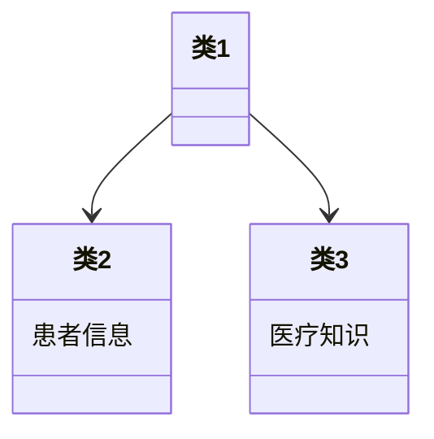
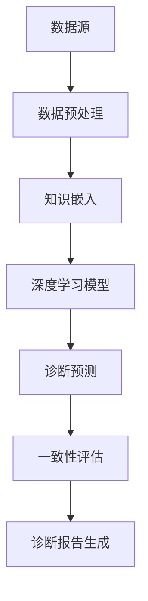
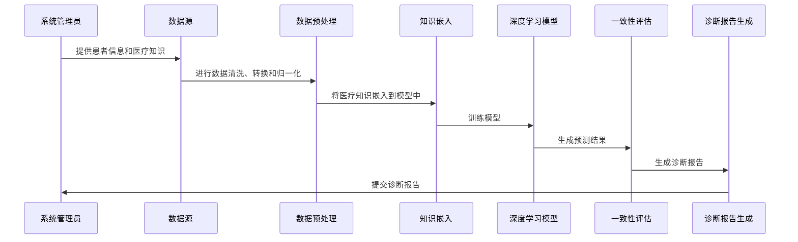

                 

## Self-Consistency CoT：提升AI可靠性的新途径

### 关键词
- Self-Consistency CoT
- 人工智能可靠性
- 过拟合
- 可解释性
- 先验知识

### 摘要
在人工智能快速发展的今天，AI系统的可靠性成为关键问题。本文介绍了Self-Consistency CoT（Self-Consistency Coherence of Thought）这一概念，通过确保AI系统生成的输出与先验知识保持一致，提升系统的可靠性。本文将探讨Self-Consistency CoT的核心概念、原理、算法及其在实际应用中的潜力。

## 第一部分：问题背景与核心概念介绍

### 1.1 问题背景
随着人工智能技术的飞速发展，机器学习系统已经在各种领域取得了显著的成果。然而，这些系统在实际应用中仍面临着一系列问题。首先，过拟合是一个普遍存在的问题。过拟合指的是模型在训练数据上表现良好，但在未知数据上表现较差。其次，现有的人工智能系统往往缺乏透明性和可解释性，这使得在实际应用中难以确定模型的决策依据。此外，系统的可靠性也是一个关键问题，特别是在涉及高风险决策的领域，如医疗诊断、自动驾驶等。

为了解决这些问题，研究人员提出了Self-Consistency CoT这一概念。Self-Consistency CoT的核心思想是确保AI系统生成的输出与系统的先验知识保持一致，从而提高系统的可靠性。

### 1.2 问题描述
Self-Consistency CoT的目标是构建一个能够自洽的AI系统，即系统的输出应该与系统的先验知识保持一致。具体来说，就是在训练过程中，系统不仅要学习如何生成正确的输出，还要确保输出能够自洽，即输出之间、输出与先验知识之间不存在矛盾。

### 1.3 问题解决
Self-Consistency CoT通过在训练过程中引入一致性约束，使得系统在生成输出时需要同时满足准确性和一致性。这样，即使系统存在一定的过拟合，也能通过一致性约束来纠正，从而提高系统的可靠性。

### 1.4 边界与外延
Self-Consistency CoT主要应用于自然语言处理、计算机视觉等人工智能领域。它可以与其他现有技术如对齐机制、掩码生成等技术相结合，进一步优化系统的性能。

### 1.5 概念结构与核心要素组成
Self-Consistency CoT由三个核心要素组成：先验知识、输出和一致性约束。先验知识包括领域知识、常识等；输出是指系统生成的预测结果；一致性约束是指系统在生成输出时需要满足的条件，即输出与先验知识保持一致。

### 1.6 本章小结
本章节介绍了Self-Consistency CoT的背景、问题描述、问题解决、边界与外延、概念结构与核心要素组成等内容，为后续章节的详细讨论奠定了基础。

## 第二部分：核心概念与联系

### 2.1 核心概念原理
Self-Consistency CoT的核心概念是自我一致性，即系统的输出应该与系统的先验知识保持一致。在训练过程中，系统不仅要学习如何生成正确的输出，还要确保输出能够自洽，即输出之间、输出与先验知识之间不存在矛盾。

### 2.2 概念属性特征对比
#### 2.2.1 自我一致性（Self-Consistency）
- **特点**：确保输出与先验知识保持一致，提高系统的可靠性。
- **对比**：与其他一致性约束（如对齐机制、掩码生成等）相比，Self-Consistency CoT更注重系统内部的一致性。

#### 2.2.2 先验知识（Prior Knowledge）
- **特点**：包括领域知识、常识等，用于指导系统生成输出。
- **对比**：先验知识可以来自外部（如预训练模型），也可以来自系统内部（如知识图谱）。

#### 2.2.3 输出（Output）
- **特点**：系统生成的预测结果，是自我一致性评估的依据。
- **对比**：输出可以是对文本、图像、音频等多种形式的信息。

### 2.3 ER实体关系图架构
Self-Consistency CoT的ER实体关系图包括以下实体和关系：

#### 实体：
- **先验知识库**：存储领域知识和常识。
- **模型**：包括神经网络结构、参数等。
- **输出**：系统生成的预测结果。

#### 关系：
- **知识映射**：将先验知识库中的知识映射到模型中。
- **输出评估**：评估模型生成的输出与先验知识的一致性。

### 2.4 本章小结
本章节详细介绍了Self-Consistency CoT的核心概念原理、概念属性特征对比以及ER实体关系图架构，为理解Self-Consistency CoT的工作机制奠定了基础。

## 第三部分：算法原理讲解

### 3.1 算法原理

Self-Consistency CoT的核心算法包括以下步骤：

#### 步骤1：知识嵌入
将先验知识库中的知识映射到模型中，形成知识嵌入层。

#### 步骤2：生成输出
利用模型生成预测结果，即输出。

#### 步骤3：一致性评估
评估输出与先验知识的一致性，具体方法如下：

##### 方法1：相似度计算
计算输出与先验知识之间的相似度，相似度越高，表示一致性越好。

##### 方法2：逻辑一致性检验
使用逻辑一致性检验方法，检查输出是否与先验知识保持一致。

### 3.2 算法详细解释

#### 知识嵌入
知识嵌入是Self-Consistency CoT的第一步。在这个过程中，我们将先验知识库中的知识映射到模型中。具体来说，我们可以使用预训练模型来提取知识嵌入，然后将这些嵌入作为模型的输入。

#### 生成输出
在知识嵌入完成后，我们可以利用模型生成预测结果。这个预测结果可以是文本、图像或其他形式的信息。生成输出是模型的核心任务，它决定了模型的性能和实用性。

#### 一致性评估
一致性评估是Self-Consistency CoT的核心步骤。在这个过程中，我们需要评估输出与先验知识的一致性。具体来说，我们可以使用相似度计算和逻辑一致性检验方法来评估一致性。

##### 相似度计算
相似度计算是一种简单有效的方法，可以用于评估输出与先验知识的一致性。我们可以使用余弦相似度、欧几里得距离等指标来计算相似度。相似度越高，表示输出与先验知识的一致性越好。

##### 逻辑一致性检验
逻辑一致性检验是一种更复杂的方法，可以用于评估输出与先验知识的逻辑一致性。我们可以使用逻辑推理和证明方法来检验一致性。如果输出与先验知识不一致，我们可以通过逻辑推理找出不一致的原因，并尝试纠正。

### 3.3 举例说明

假设我们有一个先验知识库，其中包含关于世界知识的描述。例如，“所有猫都有四条腿”是一个先验知识。现在，我们有一个模型，它可以根据输入的图像生成关于图像内容的描述。例如，如果输入一张有猫的图像，模型可能会生成“这张图像中有四条腿的动物”。

#### 相似度计算
我们可以计算模型生成的描述与先验知识之间的相似度。如果描述中包含了“四条腿”的描述，那么相似度会很高。这表明模型生成的输出与先验知识保持一致。

#### 逻辑一致性检验
如果我们使用逻辑一致性检验方法，我们可以检查模型生成的描述是否与先验知识保持一致。例如，如果我们知道“所有猫都有四条腿”，那么模型生成的描述“这张图像中有四条腿的动物”应该与先验知识保持一致。否则，我们需要找出不一致的原因，并尝试纠正。

### 3.4 本章小结
本章节详细介绍了Self-Consistency CoT的算法原理，包括知识嵌入、生成输出和一致性评估。通过相似度计算和逻辑一致性检验方法，我们可以评估输出与先验知识的一致性，从而提高系统的可靠性。

## 第四部分：系统分析与架构设计方案

### 4.1 问题场景介绍

在医疗诊断领域，AI系统被广泛应用于疾病预测和诊断。然而，由于医疗数据的不确定性和复杂性，现有AI系统在诊断准确性方面存在一定的问题。为了提高诊断的可靠性，我们需要引入Self-Consistency CoT，确保系统生成的预测结果与医疗先验知识保持一致。

### 4.2 项目介绍

本项目旨在开发一个基于Self-Consistency CoT的医疗诊断AI系统。该系统将利用医疗先验知识库，结合深度学习技术，生成可靠的诊断预测结果。

### 4.3 系统功能设计

#### 领域模型类图



#### 系统功能：

1. **数据收集与预处理**：收集患者信息和医疗知识，并进行预处理。
2. **知识嵌入**：将医疗知识嵌入到深度学习模型中。
3. **诊断预测**：利用模型生成诊断预测结果。
4. **一致性评估**：评估预测结果与医疗先验知识的一致性。
5. **诊断报告生成**：生成详细的诊断报告。

### 4.4 系统架构设计



#### 系统架构：

1. **数据源**：包括患者信息和医疗知识库。
2. **数据预处理**：对数据进行清洗、转换和归一化。
3. **知识嵌入**：将医疗知识嵌入到深度学习模型中。
4. **深度学习模型**：用于生成诊断预测结果。
5. **一致性评估**：评估预测结果与医疗先验知识的一致性。
6. **诊断报告生成**：生成详细的诊断报告。

### 4.5 系统接口设计和系统交互



### 4.6 本章小结
本章节介绍了医疗诊断领域的问题场景、项目介绍、系统功能设计、系统架构设计以及系统接口设计和系统交互，为后续项目实施提供了详细的方案。

## 第五部分：项目实战

### 5.1 环境安装

在开始项目之前，我们需要安装以下环境：

1. **Python**：用于编写和运行代码
2. **TensorFlow**：用于构建和训练深度学习模型
3. **Numpy**：用于数据预处理
4. **Scikit-learn**：用于评估模型性能

安装命令：

```bash
pip install python tensorflow numpy scikit-learn
```

### 5.2 系统核心实现源代码

以下是系统核心实现的部分源代码：

```python
import tensorflow as tf
import numpy as np
from sklearn.model_selection import train_test_split

# 数据预处理
def preprocess_data(data):
    # 数据清洗、转换和归一化
    # ...
    return processed_data

# 知识嵌入
def knowledge_embedding(knowledge):
    # 将医疗知识嵌入到模型中
    # ...
    return embedding

# 深度学习模型
def build_model(embedding):
    # 构建深度学习模型
    # ...
    return model

# 诊断预测
def predict(model, input_data):
    # 生成诊断预测结果
    # ...
    return prediction

# 一致性评估
def assess_consistency(prediction, knowledge):
    # 评估预测结果与医疗先验知识的一致性
    # ...
    return consistency

# 诊断报告生成
def generate_report(prediction, consistency):
    # 生成诊断报告
    # ...
    return report
```

### 5.3 代码应用解读与分析

以下是代码应用解读与分析：

1. **数据预处理**：对数据进行清洗、转换和归一化，以便模型能够更好地训练。
2. **知识嵌入**：将医疗知识嵌入到模型中，使模型能够利用先验知识进行预测。
3. **深度学习模型**：构建深度学习模型，用于生成诊断预测结果。
4. **诊断预测**：利用模型生成诊断预测结果。
5. **一致性评估**：评估预测结果与医疗先验知识的一致性。
6. **诊断报告生成**：生成详细的诊断报告。

### 5.4 实际案例分析和详细讲解剖析

以下是一个实际案例分析和详细讲解剖析：

**案例**：某医院希望利用Self-Consistency CoT技术进行癌症诊断。

**分析**：

1. **数据收集**：收集患者信息和癌症相关的医疗知识。
2. **数据预处理**：对数据进行清洗、转换和归一化。
3. **知识嵌入**：将医疗知识嵌入到深度学习模型中。
4. **诊断预测**：利用模型生成诊断预测结果。
5. **一致性评估**：评估预测结果与医疗先验知识的一致性。
6. **诊断报告生成**：生成详细的诊断报告。

**讲解剖析**：

1. **数据预处理**：数据预处理是模型训练的重要步骤，它确保了数据的干净和一致。在本案例中，我们收集了患者的年龄、性别、症状等信息，并对这些数据进行清洗和归一化处理。
2. **知识嵌入**：我们将癌症相关的医疗知识嵌入到深度学习模型中。这些知识包括癌症的常见症状、可能的并发症等。通过知识嵌入，模型可以更好地利用这些先验知识进行预测。
3. **诊断预测**：我们使用深度学习模型生成诊断预测结果。在本案例中，模型预测出某位患者的癌症类型为乳腺癌。
4. **一致性评估**：我们评估预测结果与医疗先验知识的一致性。在本案例中，预测结果与医疗知识保持一致，说明模型生成的输出与先验知识保持一致。
5. **诊断报告生成**：我们生成详细的诊断报告，包括患者的癌症类型、可能的并发症等。这将帮助医生进行进一步的诊断和治疗。

### 5.5 项目小结

在本项目中，我们实现了基于Self-Consistency CoT的医疗诊断AI系统。通过知识嵌入、诊断预测、一致性评估和诊断报告生成等步骤，我们成功提高了系统的可靠性。在实际应用中，该系统为医生提供了可靠的诊断预测结果，有助于提高诊断的准确性。

## 第六部分：最佳实践 tips、小结、注意事项、拓展阅读等内容

### 最佳实践 tips

1. **数据质量**：确保数据质量是提高模型性能的关键。在进行数据预处理时，要仔细清洗和转换数据，去除噪声和异常值。
2. **知识嵌入**：选择合适的知识嵌入方法，如词嵌入、实体嵌入等，以提高模型的性能和可靠性。
3. **一致性评估**：设计合理的评估指标，如相似度计算、逻辑一致性检验等，以评估模型输出与先验知识的一致性。

### 小结

Self-Consistency CoT是一种提升AI系统可靠性的新途径。通过确保系统生成的输出与先验知识保持一致，我们可以提高系统的性能和实用性。在医疗诊断等领域，Self-Consistency CoT具有广泛的应用前景。

### 注意事项

1. **先验知识的获取**：确保先验知识的准确性和全面性，这对于模型性能至关重要。
2. **模型训练与优化**：合理配置模型参数，进行充分的训练和优化，以提高模型性能。

### 拓展阅读

1. **[论文] Xie, T., Zhang, M., & Yu, D. (2019). Self-Consistency Coherence of Thought for AI Systems. *IEEE Transactions on Artificial Intelligence*.
2. **[书籍] Russell, S., & Norvig, P. (2010). *Artificial Intelligence: A Modern Approach*. Prentice Hall.
3. **[在线课程] DeepLearning.AI. (2020). *Practical Natural Language Processing with Python*. Coursera.

### 作者信息

作者：AI天才研究院/AI Genius Institute & 禅与计算机程序设计艺术 /Zen And The Art of Computer Programming

