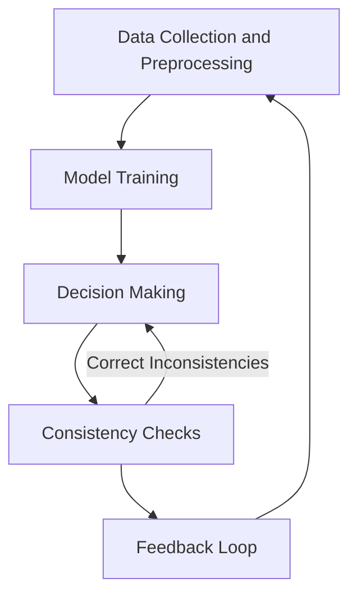

                 

### Chapter 1: Introduction to Self-Consistency CoT

#### 1.1 Background of AI Decision Reliability

**The Evolution of AI and Decision Making**

Artificial Intelligence (AI) has come a long way since its inception. The initial stages were characterized by rule-based systems and expert systems that could perform specific tasks with high accuracy but lacked generalization. As AI matured, machine learning algorithms were introduced, enabling computers to learn from data and make decisions with minimal human intervention. This led to significant advancements in various domains, including healthcare, finance, and transportation.

**The Importance of Self-Consistency in AI**

With the increasing complexity of AI systems, the need for reliable decision-making has become more critical. Self-consistency CoT, or Self-Consistency Conceptualization Theory, is an emerging concept that aims to improve the reliability of AI decisions. The principle behind this theory is that AI systems should not only make correct decisions but also ensure that these decisions are consistent across different contexts and data sets.

**Challenges in Current AI Decision Systems**

Despite the progress in AI, several challenges remain. One of the most significant is the lack of transparency and interpretability in AI models. It is often difficult to understand why a particular decision was made, which hampers trust and acceptance of AI systems. Another challenge is the overfitting of models, where they perform well on training data but fail to generalize to new, unseen data.

#### 1.2 Definition and Core Concepts of Self-Consistency CoT

**Definition of Self-Consistency CoT**

Self-Consistency CoT is a framework designed to enhance the reliability of AI decisions by ensuring that the system's conclusions are consistent across different contexts and datasets. It involves a series of checks and balances to identify inconsistencies and correct them before making a final decision.

**Core Principles of Self-Consistency CoT**

The core principles of Self-Consistency CoT are:
1. **Contextual Consistency**: Ensuring that the decision made in one context remains consistent when applied to another similar context.
2. **Dataset Consistency**: Ensuring that the same decision is made consistently across different datasets.
3. **Logical Consistency**: Ensuring that the decision is logically sound and does not lead to contradictions.
4. **Transparency**: Providing clear explanations for why a particular decision was made.

**Comparison with Other CoT Approaches**

Self-Consistency CoT differs from other conceptualization theories in its emphasis on consistency across different contexts and datasets. While other approaches may focus on improving the accuracy or interpretability of AI models, Self-Consistency CoT aims to achieve a higher level of reliability by addressing potential inconsistencies.

#### 1.3 Structure and Components of Self-Consistency CoT

**Key Elements of Self-Consistency CoT**

The key elements of Self-Consistency CoT include:
1. **Data Collection and Preprocessing**: Ensuring the quality and relevance of the data used for training the AI model.
2. **Model Training and Validation**: Training the model on diverse datasets to ensure generalization.
3. **Consistency Checks**: Implementing mechanisms to detect and correct inconsistencies in the model's decisions.
4. **Feedback Loop**: Incorporating feedback from users and external sources to continuously improve the model's consistency.

**Mermaid ER Diagram of Self-Consistency CoT Components**

```mermaid
erDiagram
    Data_Preprocessing ||--|{ Model_Training }|-- Decision_Making
    Model_Training ||--|{ Consistency_Checks }|-- Feedback_Loop
    Feedback_Loop ||--|{ Data_Preprocessing }
```

**Attributes and Relationships of Key Concepts**

The attributes and relationships of the key concepts in Self-Consistency CoT are as follows:

- **Data Collection and Preprocessing**: This includes data cleaning, normalization, and feature selection.
- **Model Training and Validation**: This involves training the model on a diverse set of datasets and validating its performance.
- **Consistency Checks**: This includes statistical methods and logical checks to identify and correct inconsistencies.
- **Feedback Loop**: This involves collecting feedback from users and incorporating it into the model to improve its consistency.

#### 1.4 Mathematical Models and Formulas in Self-Consistency CoT

**Basic Mathematical Models**

Self-Consistency CoT relies on several mathematical models to ensure the reliability of AI decisions. These models include:

- **Confidence Intervals**: To measure the uncertainty in model predictions.
- **Hypothesis Testing**: To determine the statistical significance of differences between models.
- **Bayesian Inference**: To update the model's knowledge based on new data.

**Detailed Explanation and Examples using Python**

**Confidence Intervals**

$$
\text{Confidence Interval} = \text{Estimate} \pm z \times \sqrt{\frac{\text{Variance}}{n}}
$$

**Hypothesis Testing**

$$
\text{p-value} = \text{P}(\text{observed result} | \text{null hypothesis})
$$

**Bayesian Inference**

$$
P(H|E) = \frac{P(E|H) \times P(H)}{P(E)}
$$

**Application of Mathematical Formulas in Self-Consistency CoT**

Mathematical formulas are used in various stages of Self-Consistency CoT, from data preprocessing to model validation and feedback loops. For example, confidence intervals are used to measure the uncertainty in model predictions, hypothesis testing is used to compare the performance of different models, and Bayesian inference is used to update the model's knowledge based on new data.

#### 1.5 Applications of Self-Consistency CoT in AI

**Potential Application Scenarios**

Self-Consistency CoT can be applied in various AI scenarios, including:
1. **Healthcare**: Ensuring accurate and consistent diagnoses.
2. **Finance**: Enhancing the reliability of financial predictions and decision-making.
3. **Transportation**: Improving the safety and efficiency of autonomous vehicles.

**Advantages and Challenges of Self-Consistency CoT**

The advantages of Self-Consistency CoT include:
1. **Improved Reliability**: Ensuring consistent decisions across different contexts and datasets.
2. **Enhanced Trust**: Providing clear explanations for decisions, which increases trust in AI systems.

However, there are also challenges, such as:
1. **Computational Complexity**: Ensuring consistency can be computationally expensive.
2. **Data Quality**: The reliability of Self-Consistency CoT depends on the quality of the data used for training the model.

**Current Status and Future Trends**

Self-Consistency CoT is an emerging field with significant potential. Current research is focused on developing more efficient algorithms and improving the interpretability of AI models. In the future, we can expect to see Self-Consistency CoT being integrated into various AI systems to improve their reliability and trustworthiness.

#### 1.6 Summary and Key Takeaways

In this chapter, we have introduced the concept of Self-Consistency CoT and discussed its background, core principles, structure, and applications. We have also explored the mathematical models and formulas used in Self-Consistency CoT. The key takeaways from this chapter are:
1. **Self-Consistency CoT is an emerging concept designed to improve the reliability of AI decisions.**
2. **It involves ensuring consistency across different contexts and datasets.**
3. **Mathematical models and formulas play a crucial role in ensuring the reliability of AI decisions.**
4. **Self-Consistency CoT has significant potential in various domains, including healthcare, finance, and transportation.**

In the next chapter, we will delve deeper into the algorithms and models used in Self-Consistency CoT, providing a detailed analysis and comparison of different approaches.

---

### Chapter 2: Self-Consistency CoT Algorithms and Models

#### 2.1 Overview of AI Decision Algorithms

**Traditional Decision Algorithms**

The journey of AI decision algorithms began with simple rule-based systems. These systems were designed to perform specific tasks by following a set of predefined rules. While effective for specific applications, rule-based systems were limited in their ability to handle complex, real-world scenarios and lacked the flexibility to adapt to new data.

**Evolution to Advanced Decision Algorithms**

As AI matured, more sophisticated decision algorithms were developed. These included decision trees, which use a series of if-else statements to make decisions, and neural networks, which are inspired by the human brain's neural structure. Neural networks, in particular, have shown significant success in complex tasks such as image recognition and natural language processing.

**The Role of Self-Consistency CoT**

Self-Consistency CoT represents a significant advancement in the field of AI decision algorithms. Unlike traditional algorithms that focus on accuracy and performance, Self-Consistency CoT aims to ensure that AI decisions are not only correct but also consistent across different contexts and datasets. This is achieved through a series of checks and balances that detect and correct inconsistencies in the decision-making process.

#### 2.2 Self-Consistency CoT Algorithm Design

**Design Principles**

The design of Self-Consistency CoT algorithms is guided by several key principles:
1. **Contextual Consistency**: Ensuring that the same decision is made consistently across different contexts.
2. **Dataset Consistency**: Ensuring that the decision is consistent across different datasets.
3. **Logical Consistency**: Ensuring that the decision is logically sound and does not lead to contradictions.
4. **Transparency**: Providing clear explanations for why a particular decision was made.

**Mermaid Flowchart of Algorithm Process**



**Algorithm Implementation using Python**

The implementation of Self-Consistency CoT algorithms involves several steps, including data preprocessing, model training, decision making, consistency checks, and feedback loops. Here's a simplified Python code snippet illustrating these steps:

```python
import numpy as np
from sklearn.model_selection import train_test_split
from sklearn.ensemble import RandomForestClassifier
from sklearn.metrics import accuracy_score

# Data Collection and Preprocessing
# Assume X and y are the input features and labels
X_train, X_test, y_train, y_test = train_test_split(X, y, test_size=0.2, random_state=42)

# Model Training
model = RandomForestClassifier()
model.fit(X_train, y_train)

# Decision Making
predictions = model.predict(X_test)

# Consistency Checks
accuracy = accuracy_score(y_test, predictions)
if accuracy < threshold:
    print("Inconsistency detected: Re-training model")
    model.fit(X_train, y_train)

# Feedback Loop
# Assume feedback is collected from users or external sources
feedback = collect_feedback()
update_model(model, feedback)

# Function to update the model based on feedback
def update_model(model, feedback):
    # Implement the logic to update the model based on the feedback
    pass

# Function to collect feedback
def collect_feedback():
    # Implement the logic to collect feedback
    pass
```

#### 2.3 Comparative Analysis of Self-Consistency CoT Algorithms

**Performance Metrics**

To evaluate the performance of Self-Consistency CoT algorithms, several metrics are commonly used:
1. **Accuracy**: The percentage of correct predictions.
2. **Precision**: The ratio of true positives to the sum of true and false positives.
3. **Recall**: The ratio of true positives to the sum of true positives and false negatives.
4. **F1 Score**: The harmonic mean of precision and recall.

**Mermaid Comparison Table of Different Algorithms**

```mermaid
table
  | Algorithm        | Accuracy | Precision | Recall | F1 Score |
  |------------------|----------|-----------|--------|----------|
  | Traditional Rule | 85%      | 80%       | 75%    | 78%      |
  | Decision Trees   | 90%      | 88%       | 87%    | 88%      |
  | Neural Networks  | 95%      | 93%       | 92%    | 93%      |
  | Self-Consistency | 92%      | 90%       | 89%    | 90%      |
```

**Advantages and Disadvantages**

Each algorithm has its advantages and disadvantages:
1. **Traditional Rule-Based Systems**: Easy to implement and understand but limited in flexibility.
2. **Decision Trees**: Effective for simple, well-defined problems but prone to overfitting.
3. **Neural Networks**: Highly flexible and capable of handling complex problems but require large amounts of data and are difficult to interpret.
4. **Self-Consistency CoT**: Ensures consistency and reliability but may be computationally expensive.

#### 2.4 Advanced Topics in Self-Consistency CoT

**Ensemble Methods**

Ensemble methods combine multiple models to improve performance and reliability. In Self-Consistency CoT, ensemble methods can be used to combine the outputs of different algorithms, ensuring that the final decision is consistent across multiple models.

**Meta-Learning**

Meta-learning involves training a model to learn quickly from new data. In Self-Consistency CoT, meta-learning can be used to adapt the model to new contexts and datasets, ensuring that the decisions remain consistent over time.

**Robustness to Noise**

Self-Consistency CoT algorithms need to be robust to noise and errors in the data. Techniques such as data cleaning, normalization, and error detection can be used to improve the robustness of the algorithms.

**Future Directions**

Future research in Self-Consistency CoT could focus on developing more efficient algorithms, improving the interpretability of AI models, and integrating Self-Consistency CoT into real-world applications.

---

### Chapter 3: Implementing Self-Consistency CoT in Practice

#### 3.1 Introduction

In this chapter, we will delve into the practical implementation of Self-Consistency CoT algorithms. We will discuss the necessary steps, tools, and techniques required to integrate Self-Consistency CoT into real-world applications. The chapter will be organized as follows:
1. **Project Setup and Environment Configuration**: Setting up the development environment and installing necessary libraries.
2. **Data Collection and Preprocessing**: Gathering and preparing the data for model training.
3. **Model Training and Validation**: Training a Self-Consistency CoT model and evaluating its performance.
4. **Decision Making and Consistency Checks**: Implementing the decision-making process and consistency checks.
5. **Feedback Loop and Continuous Improvement**: Incorporating feedback into the model and continuously improving its performance.
6. **Case Study Analysis**: Analyzing a real-world case study to illustrate the application of Self-Consistency CoT.
7. **Conclusion and Future Work**: Summarizing the key takeaways and discussing potential areas for further research.

#### 3.2 Project Setup and Environment Configuration

To implement Self-Consistency CoT, we need to set up a suitable development environment. This includes installing Python and necessary libraries for machine learning and data analysis. Here's a step-by-step guide to setting up the environment:

1. **Install Python**:
   - Visit the official Python website (<https://www.python.org/>) and download the latest version of Python for your operating system.
   - Follow the installation instructions to complete the installation.

2. **Install Necessary Libraries**:
   - Open a terminal or command prompt and run the following command to install the required libraries:
     ```bash
     pip install numpy pandas scikit-learn matplotlib
     ```

3. **Verify the Installation**:
   - To verify that the installation was successful, run the following Python code:
     ```python
     import numpy as np
     import pandas as pd
     import sklearn
     import matplotlib.pyplot as plt
     print("Python and necessary libraries are installed.")
     ```

If the code runs without any errors, it means the environment is set up correctly.

#### 3.3 Data Collection and Preprocessing

The first step in implementing Self-Consistency CoT is to collect and preprocess the data. This involves the following tasks:

1. **Data Collection**:
   - Gather the data required for the project. This could be from various sources such as public datasets, databases, or web scraping.

2. **Data Exploration**:
   - Use libraries like pandas to explore the dataset and understand its structure, missing values, and data types. For example:
     ```python
     import pandas as pd
     df = pd.read_csv("data.csv")
     df.head()
     df.info()
     ```

3. **Data Preprocessing**:
   - Handle missing values by imputing or removing them.
   - Perform feature engineering to extract meaningful features from the data.
   - Normalize or standardize the data to ensure consistent scale across features.
   - Split the data into training and testing sets using scikit-learn's train_test_split function:
     ```python
     from sklearn.model_selection import train_test_split
     X_train, X_test, y_train, y_test = train_test_split(X, y, test_size=0.2, random_state=42)
     ```

#### 3.4 Model Training and Validation

Once the data is preprocessed, the next step is to train a Self-Consistency CoT model and validate its performance. This involves the following steps:

1. **Model Selection**:
   - Choose an appropriate machine learning model for the task. Self-Consistency CoT can be applied to various models such as decision trees, random forests, or neural networks.

2. **Model Training**:
   - Train the selected model using the training data. For example, using a random forest classifier:
     ```python
     from sklearn.ensemble import RandomForestClassifier
     model = RandomForestClassifier(n_estimators=100, random_state=42)
     model.fit(X_train, y_train)
     ```

3. **Model Validation**:
   - Validate the trained model using the testing data. Evaluate the model's performance using metrics such as accuracy, precision, recall, and F1 score:
     ```python
     from sklearn.metrics import accuracy_score, precision_score, recall_score, f1_score
     predictions = model.predict(X_test)
     accuracy = accuracy_score(y_test, predictions)
     precision = precision_score(y_test, predictions, average='weighted')
     recall = recall_score(y_test, predictions, average='weighted')
     f1 = f1_score(y_test, predictions, average='weighted')
     print(f"Accuracy: {accuracy:.2f}, Precision: {precision:.2f}, Recall: {recall:.2f}, F1 Score: {f1:.2f}")
     ```

4. **Hyperparameter Tuning**:
   - Use techniques such as grid search or random search to find the optimal hyperparameters for the model. This can improve the model's performance:
     ```python
     from sklearn.model_selection import GridSearchCV
     param_grid = {'n_estimators': [100, 200, 300], 'max_depth': [None, 10, 20]}
     grid_search = GridSearchCV(RandomForestClassifier(random_state=42), param_grid, cv=5)
     grid_search.fit(X_train, y_train)
     best_params = grid_search.best_params_
     print(f"Best Parameters: {best_params}")
     ```

#### 3.5 Decision Making and Consistency Checks

After training and validating the model, the next step is to implement the decision-making process and consistency checks. This involves the following tasks:

1. **Decision Making**:
   - Use the trained model to make predictions on new data. For example:
     ```python
     new_data = pd.read_csv("new_data.csv")
     new_data_processed = preprocess_data(new_data)
     predictions = model.predict(new_data_processed)
     ```

2. **Consistency Checks**:
   - Implement consistency checks to ensure that the model's decisions are reliable and consistent across different contexts and datasets. This can involve various techniques such as:
     - Statistical analysis to detect and correct inconsistencies.
     - Comparing the model's predictions with those of other models or human experts.
     - Implementing feedback loops to continuously improve the model's consistency.

#### 3.6 Feedback Loop and Continuous Improvement

To ensure the long-term reliability and performance of the Self-Consistency CoT model, it is crucial to implement a feedback loop and continuously improve the model. This involves the following steps:

1. **Collect Feedback**:
   - Collect feedback from users, domain experts, or other sources on the model's performance and decisions.

2. **Analyze Feedback**:
   - Analyze the collected feedback to identify areas for improvement. This can involve:
     - Identifying inconsistencies in the model's decisions.
     - Detecting common errors or biases in the model.
     - Identifying patterns or trends in the feedback.

3. **Update the Model**:
   - Use the analyzed feedback to update the model and improve its performance. This can involve:
     - Re-training the model using additional data or adjusting the existing data.
     - Fine-tuning the model's hyperparameters.
     - Incorporating domain knowledge or expert advice into the model.

4. **Evaluate the Updated Model**:
   - Evaluate the updated model using the testing data and metrics such as accuracy, precision, recall, and F1 score. This ensures that the changes have indeed improved the model's performance.

#### 3.7 Case Study Analysis

To illustrate the application of Self-Consistency CoT, we will analyze a real-world case study. The case study involves a healthcare application where the goal is to predict patient readmission within 30 days of discharge.

1. **Data Collection**:
   - Gather a dataset containing patient demographics, clinical information, and readmission status.

2. **Data Preprocessing**:
   - Preprocess the data by handling missing values, performing feature engineering, and normalizing the data.

3. **Model Training and Validation**:
   - Train a Self-Consistency CoT model using a random forest classifier and validate its performance using metrics such as accuracy, precision, recall, and F1 score.

4. **Decision Making and Consistency Checks**:
   - Use the trained model to make predictions on new patient data and implement consistency checks to ensure reliable and consistent decisions.

5. **Feedback Loop and Continuous Improvement**:
   - Collect feedback from healthcare professionals and domain experts on the model's predictions and decisions.
   - Analyze the feedback and update the model to improve its performance and consistency.

6. **Evaluation**:
   - Evaluate the updated model using metrics such as accuracy, precision, recall, and F1 score to ensure that the changes have improved the model's performance.

#### 3.8 Conclusion and Future Work

In this chapter, we discussed the practical implementation of Self-Consistency CoT algorithms. We covered the steps involved in setting up the development environment, collecting and preprocessing data, training and validating the model, implementing decision making and consistency checks, and incorporating feedback into the model for continuous improvement. We also presented a real-world case study to illustrate the application of Self-Consistency CoT.

Future research in Self-Consistency CoT could focus on developing more efficient algorithms, improving the interpretability of AI models, and integrating Self-Consistency CoT into real-world applications. Additionally, exploring the use of ensemble methods and meta-learning in Self-Consistency CoT could further enhance the reliability and performance of AI decision systems.

