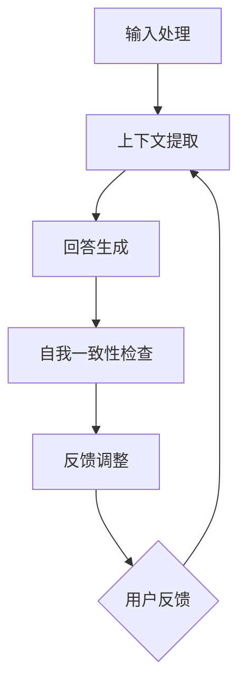
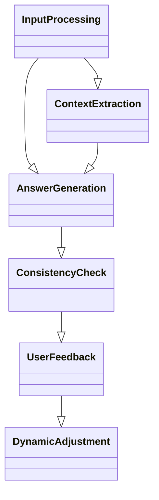
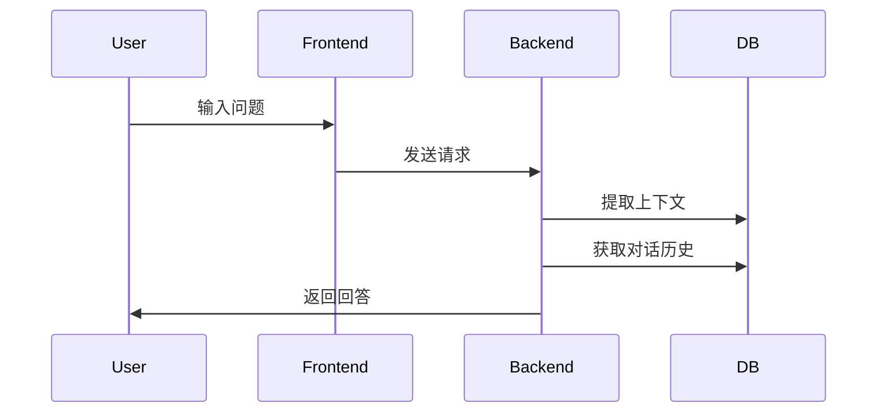
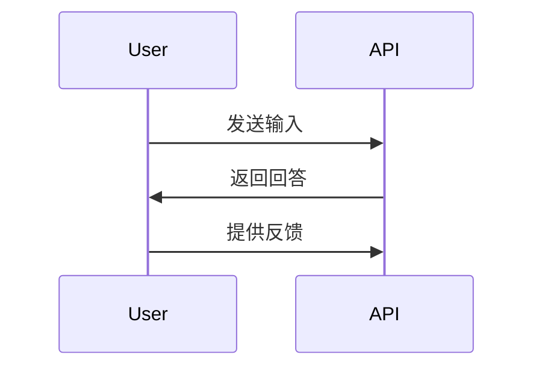
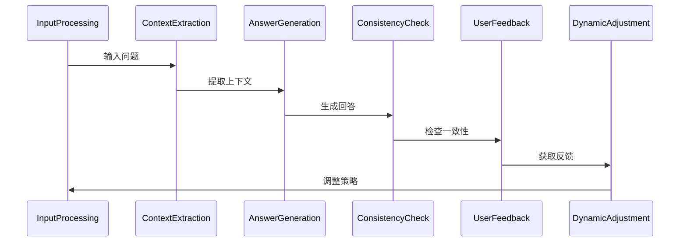

                 

# Self-Consistency CoT：提高AI回答的可靠性

## 关键词

- 自我一致性（Self-Consistency）
- 上下文理解（Contextual Understanding）
- AI问答系统
- 算法原理
- 系统架构设计
- 项目实战

## 摘要

本文深入探讨了自我一致性上下文理解（Self-Consistency CoT）在提高人工智能（AI）问答系统回答可靠性方面的作用。首先，我们介绍了自我一致性和上下文理解的基本概念，并阐述了它们在AI问答中的应用。接着，文章详细解释了Self-Consistency CoT的算法原理，包括算法流程、数学模型和实现细节。随后，我们展示了如何将Self-Consistency CoT应用于系统架构设计，并进行了项目实战。最后，文章提供了最佳实践和注意事项，总结了全文，并对未来的研究方向进行了展望。

----------------------------------------------------------------

## 引言

### 1.1 书籍背景介绍

在当今技术飞速发展的时代，人工智能（AI）已经成为众多领域的关键驱动力。尤其是在自然语言处理（NLP）领域，AI问答系统以其高效、智能的特点，逐渐成为人们获取信息的重要途径。然而，AI问答系统的可靠性一直是学术界和工业界关注的焦点。尽管许多研究致力于提升问答系统的性能，但如何确保回答的准确性和一致性仍然是一个重大挑战。

为了解决这一问题，我们引入了自我一致性上下文理解（Self-Consistency CoT）。Self-Consistency CoT是一种创新的方法，它通过结合自我一致性和上下文理解，旨在提高AI问答系统的可靠性。自我一致性关注于保证回答在逻辑上一致，而上下文理解则确保回答与对话的上下文保持一致。这两种机制的结合，为构建高度可靠的AI问答系统提供了新的思路。

### 1.2 AI问答的现状与挑战

AI问答系统的发展已经取得了一定的成果，但仍然存在一些亟待解决的问题。首先，回答的准确性是一个关键问题。尽管深度学习模型在处理自然语言任务方面表现出色，但它们仍然难以理解复杂、模糊的问题。其次，回答的一致性也是一个挑战。在不同的上下文中，同一个问题可能得到不同的答案，这不仅影响了用户体验，也可能导致误解和信息错误。

此外，AI问答系统还面临其他问题，如响应速度、回答的丰富性和多样性等。为了解决这些问题，研究人员提出了各种技术，如注意力机制、序列到序列模型、多轮对话等。然而，这些方法往往需要大量的数据、计算资源和复杂的模型设计，且在实际应用中仍存在局限性。

### 1.3 Self-Consistency CoT的概念与重要性

自我一致性上下文理解（Self-Consistency CoT）是一种结合自我一致性和上下文理解的方法，旨在解决AI问答系统的可靠性问题。自我一致性指的是保证回答在逻辑上是一致的，即回答中不出现自相矛盾的情况。上下文理解则关注于保证回答与对话的上下文保持一致，确保回答能够准确地反映用户的意图。

Self-Consistency CoT的重要性在于它提供了一种新的解决方案，通过同时考虑自我一致性和上下文理解，可以显著提高AI问答系统的可靠性。这种方法不仅能够确保回答的一致性，还能够提高回答的准确性和响应速度。

### 1.4 本书目标与结构

本书的目标是深入探讨Self-Consistency CoT的理论基础和应用实践，旨在为读者提供一套完整的解决方案，以提高AI问答系统的可靠性。本书的结构如下：

- **第一部分：引言**：介绍AI问答系统的现状与挑战，以及Self-Consistency CoT的概念和重要性。
- **第二部分：基础概念**：详细阐述自我一致性和上下文理解的基本原理，并对比其他相关概念。
- **第三部分：技术原理**：解释Self-Consistency CoT的算法原理，包括算法流程、数学模型和实现细节。
- **第四部分：系统设计与实现**：介绍如何将Self-Consistency CoT应用于系统架构设计，并提供项目实战案例。
- **第五部分：最佳实践与总结**：提供最佳实践、注意事项和未来研究方向。

通过以上结构，本书旨在为读者提供一个系统、全面的指南，帮助他们在实际项目中应用Self-Consistency CoT，提高AI问答系统的可靠性。

### 1.5 文章内容概述

接下来，我们将逐步深入探讨Self-Consistency CoT的各个组成部分。首先，我们将介绍自我一致性和上下文理解的基本概念，并对比其他相关概念，帮助读者建立对Self-Consistency CoT的理解。然后，我们将详细解释Self-Consistency CoT的算法原理，包括算法流程、数学模型和实现细节。接着，我们将讨论如何将Self-Consistency CoT应用于系统架构设计，并提供一个具体的系统架构设计案例。随后，我们将展示如何在实际项目中应用Self-Consistency CoT，并分析一个实际案例。最后，我们将总结全文，提供最佳实践和注意事项，并对未来的研究方向进行展望。通过这些步骤，我们将全面了解Self-Consistency CoT的应用价值和潜力。

## 基础概念

### 2.1 自我一致性的定义

自我一致性（Self-Consistency）是指在一个系统中，所有的输出和决策都应该在逻辑上是一致的，不出现自相矛盾的情况。在AI问答系统中，自我一致性确保了回答在逻辑上的一致性，即回答中不会出现自相矛盾的信息。例如，如果系统在一个问题中回答了某个观点，那么在后续的对话中，这个观点应该得到维持，而不是突然改变。

自我一致性是确保AI问答系统可靠性的一项关键特性。在自然语言处理中，由于语言表达的复杂性和模糊性，系统可能会产生不统一的回答，导致用户困惑或误解。通过自我一致性机制，可以有效地避免这种问题，提高问答系统的可信度和用户体验。

### 2.2 上下文理解的原理

上下文理解（Contextual Understanding）是指AI系统能够理解并处理对话中的上下文信息，确保回答与当前对话内容保持一致。上下文理解的核心在于捕捉对话中的关键信息，并根据这些信息生成合适的回答。

上下文理解的关键在于如何有效地管理和利用对话历史。在自然语言处理中，上下文信息通常包括用户的问题、之前的回答、对话中的实体和关系等。这些信息需要被编码和存储，以便在生成回答时进行引用和参考。

上下文理解的重要性在于它能够提高AI问答系统的互动性和准确性。通过理解上下文，系统可以更好地把握用户的意图，生成更加准确和相关的回答。此外，上下文理解还可以帮助系统处理复杂的问题，确保回答的一致性和连贯性。

### 2.3 Self-Consistency CoT的核心要素

自我一致性上下文理解（Self-Consistency CoT）结合了自我一致性和上下文理解，其核心要素包括以下几个方面：

1. **自我一致性机制**：确保系统在生成回答时，逻辑上不出现自相矛盾的情况。这需要系统在回答生成过程中，对已有信息进行一致性检查，并自动纠正潜在的自相矛盾。

2. **上下文信息管理**：系统需要有效地管理和利用对话历史，捕捉关键信息并编码存储。这些信息将用于生成回答时进行引用和参考，确保回答与当前对话内容保持一致。

3. **反馈机制**：为了提高系统的自我一致性和上下文理解能力，系统需要引入反馈机制。用户可以对回答进行评价，系统根据用户的反馈进行调整和优化，从而提高问答系统的整体性能。

4. **动态调整策略**：在对话过程中，系统的上下文理解和自我一致性策略可能需要根据对话的不同阶段进行动态调整。例如，在对话初期，系统可能更注重上下文理解的准确性，而在对话后期，则可能更关注回答的自我一致性。

通过这些核心要素，Self-Consistency CoT能够有效提高AI问答系统的可靠性，确保回答的一致性和连贯性，从而提供更好的用户体验。

### 2.4 核心概念属性特征对比表格

为了更好地理解Self-Consistency CoT的核心概念，我们可以通过一个属性特征对比表格来展示自我一致性和上下文理解的相关概念及其特征。

| 概念         | 自我一致性                | 上下文理解              |
|------------|-----------------------|----------------------|
| 定义         | 保证逻辑上一致            | 理解对话中的上下文信息      |
| 关键属性       | - 逻辑一致性              | - 关键信息捕捉<br>- 信息编码 |
| 对话影响       | 避免自相矛盾的信息          | 确保回答与上下文一致        |
| 应用场景       | 处理逻辑推理问题            | 实时交互对话系统            |
| 关联性         | 与上下文理解结合使用         | 结合自我一致性提高可靠性      |
| 目标          | 提高逻辑推理的可靠性        | 提高交互对话的准确性        |

通过上述对比表格，我们可以清晰地看到自我一致性和上下文理解在定义、关键属性、对话影响、应用场景和关联性等方面的差异和联系。

### 2.5 自我一致性上下文理解的ER实体关系图架构

为了更直观地理解自我一致性上下文理解在系统架构中的关系，我们可以使用ER（实体关系）图来展示其核心实体及其相互关系。

首先，定义以下核心实体：

- **对话实体**：代表一个完整的对话，包括多个轮次。
- **轮次实体**：代表对话中的一个轮次，包含问题、回答和上下文信息。
- **上下文信息实体**：包含对话中涉及的关键信息，如实体、关系和事件。
- **回答实体**：代表系统生成的回答。

以下是ER实体关系图的mermaid表示：

```mermaid
erDiagram
    类对话实体 ||--|| 类轮次实体 : 1对N
    类轮次实体 ||--|| 类上下文信息实体 : 1对N
    类轮次实体 ||--|| 类回答实体 : 1对1
    类上下文信息实体 ||--|| 类实体 : 1对N
    类实体 ||--|| 类属性 : 1对N
```

在ER图中，对话实体是顶层实体，包含多个轮次实体。每个轮次实体包含上下文信息实体和回答实体。上下文信息实体又包含多个属性实体，这些属性用于详细描述上下文信息。通过这样的架构设计，系统可以有效地管理和利用对话历史，确保回答的一致性和连贯性。

通过ER实体关系图，我们可以清晰地看到自我一致性上下文理解系统中的核心实体及其相互关系，为后续的算法设计和实现提供了直观的参考。

### 2.6 自我一致性上下文理解的算法原理

自我一致性上下文理解（Self-Consistency CoT）的核心在于其算法原理，这一原理确保了系统在生成回答时能够在逻辑上保持一致性，同时理解并响应对话的上下文。以下是Self-Consistency CoT算法原理的详细解释，包括算法流程、mermaid流程图、Python源代码、数学模型和公式，以及举例说明。

#### 算法流程

Self-Consistency CoT算法的基本流程可以分为以下几个步骤：

1. **输入处理**：接收用户的问题和对话历史。
2. **上下文提取**：从对话历史中提取关键信息，如实体、关系和事件。
3. **回答生成**：使用提取的关键信息生成回答。
4. **自我一致性检查**：对生成的回答进行逻辑一致性检查。
5. **反馈调整**：根据用户反馈调整回答。

以下是Self-Consistency CoT算法的mermaid流程图：



#### Python源代码实现

下面是一个简化的Python代码示例，展示了Self-Consistency CoT算法的基本实现：

```python
def self_consistency_coT(question, dialog_history):
    # 步骤1：上下文提取
    context = extract_context(dialog_history)
    
    # 步骤2：回答生成
    answer = generate_answer(question, context)
    
    # 步骤3：自我一致性检查
    if not check_consistency(answer, context):
        return "回答不一致，请重新生成"
    
    # 步骤4：反馈调整
    user_feedback = get_user_feedback(answer)
    adjust_answer(answer, user_feedback)
    
    return answer

def extract_context(dialog_history):
    # 提取关键信息的代码实现
    pass

def generate_answer(question, context):
    # 使用提取的关键信息生成回答的代码实现
    pass

def check_consistency(answer, context):
    # 检查回答与上下文一致性的代码实现
    pass

def get_user_feedback(answer):
    # 获取用户反馈的代码实现
    pass

def adjust_answer(answer, user_feedback):
    # 调整回答的代码实现
    pass
```

#### 数学模型和公式

Self-Consistency CoT的数学模型主要包括上下文信息的编码和解码、回答生成的概率模型以及自我一致性检查的逻辑规则。

1. **上下文信息的编码**：

   上下文信息的编码可以使用词嵌入（word embeddings）或转换器（transformers）等方法。假设每个实体和属性都可以表示为一个向量，则上下文信息编码可以表示为：

   $$ \text{context\_vector} = \text{encode}(\text{entities}, \text{relations}, \text{events}) $$

2. **回答生成的概率模型**：

   回答生成的概率模型可以使用贝叶斯网络或图模型等概率图模型。假设回答的概率分布为：

   $$ P(\text{answer}|\text{context}) = \prod_{i} P(\text{answer}_i|\text{context}, \text{history}) $$

   其中，$ \text{answer}_i $ 是回答的第i个部分。

3. **自我一致性检查的逻辑规则**：

   自我一致性检查的逻辑规则可以使用逻辑公式或谓词逻辑。一个简化的规则可以表示为：

   $$ \text{consistent}(\text{answer}, \text{context}) \equiv \neg \exists i, j \text{ such that } \text{answer}_i \land \neg \text{answer}_j \land \text{context}(i, j) $$

#### 举例说明

假设用户问：“北京是中国的首都吗？”对话历史中有一个先前的问答：“北京是中国的哪个省份？”系统回答：“北京是中国的河北省。”使用Self-Consistency CoT算法，步骤如下：

1. **上下文提取**：提取到关键信息，如“北京”、“首都”、“中国”、“河北省”。
2. **回答生成**：根据上下文信息，系统生成回答：“北京是中国的首都，不是河北省。”
3. **自我一致性检查**：检查新回答与上下文信息是否一致。发现自相矛盾，返回错误信息。
4. **反馈调整**：根据用户反馈，调整回答为：“北京是中国的首都，关于河北省的信息是错误的。”

通过这个示例，我们可以看到Self-Consistency CoT算法在确保回答一致性和连贯性方面的作用。

### 2.7 自我一致性上下文理解的应用场景

自我一致性上下文理解（Self-Consistency CoT）在多个应用场景中具有广泛的应用价值，以下列举几个典型场景：

#### 1. 实时问答系统

在实时问答系统中，Self-Consistency CoT可以帮助确保回答的一致性和连贯性，避免用户在对话过程中产生困惑。例如，一个在线客服系统可以结合Self-Consistency CoT来提供更高质量的客户服务，确保回答既准确又一致。

#### 2. 自动问答平台

自动问答平台，如搜索引擎、知识库和问答社区，通常需要处理大量的问题和回答。Self-Consistency CoT可以确保平台提供的答案在逻辑上是一致的，从而提高用户对平台信任度。

#### 3. 聊天机器人

聊天机器人是另一个典型的应用场景。通过Self-Consistency CoT，聊天机器人可以更好地理解用户的意图，生成连贯的回答，提高用户体验和满意度。

#### 4. 语言翻译

在语言翻译中，Self-Consistency CoT可以帮助确保翻译结果的逻辑一致性和上下文准确性。特别是在机器翻译中，确保翻译的连贯性和一致性是一个重大挑战，Self-Consistency CoT可以提供有效的解决方案。

#### 5. 法律咨询

在法律咨询领域，Self-Consistency CoT可以帮助确保法律文档的一致性和逻辑性。例如，自动生成法律文件时，系统可以检查法律条款之间的逻辑一致性，确保文档的准确性。

通过以上应用场景，我们可以看到Self-Consistency CoT在提高AI系统回答可靠性方面的巨大潜力。在不同的应用领域中，Self-Consistency CoT都可以发挥关键作用，提供更加准确、一致和可信的问答服务。

### 2.8 自我一致性上下文理解的优势与挑战

自我一致性上下文理解（Self-Consistency CoT）在提高AI问答系统的可靠性方面具有显著的优势，但也面临一些挑战。以下是对其优势与挑战的详细分析：

#### 优势

1. **提高回答的一致性**：Self-Consistency CoT通过确保系统在逻辑上不出现自相矛盾的情况，显著提高了回答的一致性。这有助于提升用户体验，减少用户困惑和误解。

2. **增强上下文理解**：Self-Consistency CoT结合了上下文理解，使系统能够更好地捕捉和处理对话中的上下文信息，确保回答与当前对话内容保持一致。这提高了回答的准确性和相关性。

3. **改进用户交互体验**：通过提供更加一致和准确的回答，Self-Consistency CoT有助于改进用户交互体验，增强用户对AI系统的信任和满意度。

4. **适应多轮对话**：Self-Consistency CoT适用于多轮对话场景，能够有效地处理对话历史中的信息，确保每个回答都在逻辑和上下文中一致。这使其在实时交互系统中具有很高的应用价值。

#### 挑战

1. **计算复杂性**：Self-Consistency CoT需要处理对话历史中的大量信息，并进行一致性检查。这可能导致计算复杂性增加，尤其是在处理大规模对话数据时。

2. **数据依赖性**：Self-Consistency CoT的性能高度依赖于对话数据的质量和完整性。如果对话数据存在噪声或不完整，系统可能无法准确地进行自我一致性和上下文理解。

3. **语义理解的局限性**：尽管Self-Consistency CoT结合了上下文理解，但仍然面临语义理解的局限性。自然语言表达的复杂性和模糊性可能导致系统无法完全理解用户的意图。

4. **实时性要求**：在实时交互系统中，Self-Consistency CoT需要快速处理对话并生成回答。然而，确保自我一致性和上下文理解可能需要额外的计算时间，这可能在某些情况下无法满足实时性的要求。

总的来说，自我一致性上下文理解（Self-Consistency CoT）在提高AI问答系统的可靠性方面具有显著的优势，但也面临一些挑战。通过不断优化算法、提高计算效率和改进数据质量，我们可以进一步发挥Self-Consistency CoT的潜力，实现更加可靠和高效的AI问答系统。

### 2.9 与其他相关概念的比较

在探讨自我一致性上下文理解（Self-Consistency CoT）时，我们需要将其与其他相关概念进行比较，以便更好地理解其独特性和应用价值。以下是自我一致性、上下文理解、一致性检验以及上下文理解的其他模型（如BERT、GPT）之间的对比。

#### 自我一致性（Self-Consistency）与一致性检验（Consistency Check）

自我一致性关注于确保系统在生成回答时，逻辑上不出现自相矛盾的情况。它是一种内在的机制，旨在维护系统的内部一致性。而一致性检验通常是一种外部验证方法，用于检查系统输出是否符合预定的规则或标准。

- **定义**：
  - 自我一致性：保证系统在逻辑上的一致性，不出现自相矛盾的情况。
  - 一致性检验：对外部输出进行验证，确保其符合预定的规则或标准。

- **应用场景**：
  - 自我一致性：适用于自动问答系统，确保回答的连贯性和可靠性。
  - 一致性检验：适用于数据清洗和验证，确保数据的质量和一致性。

- **实现方式**：
  - 自我一致性：通过系统内部的逻辑规则和算法实现。
  - 一致性检验：通过外部规则和算法实现，如逻辑推理和模式匹配。

#### 上下文理解（Contextual Understanding）与其他上下文理解模型

上下文理解是一种确保系统生成回答与对话上下文保持一致的方法。在AI问答系统中，上下文理解至关重要，因为它能够提高回答的准确性和相关性。

- **BERT（Bidirectional Encoder Representations from Transformers）**：
  - **定义**：BERT是一种基于Transformer的预训练语言模型，通过双向编码器来理解上下文。
  - **应用场景**：BERT广泛应用于自然语言处理任务，如文本分类、命名实体识别和机器翻译。
  - **优势**：BERT具有强大的上下文理解能力，能够捕捉长距离的依赖关系。
  - **劣势**：BERT的预训练需要大量的计算资源和数据，且在处理复杂问题时可能存在局限性。

- **GPT（Generative Pre-trained Transformer）**：
  - **定义**：GPT是一种基于Transformer的生成模型，通过自回归的方式生成文本。
  - **应用场景**：GPT广泛应用于文本生成、问答系统和对话系统。
  - **优势**：GPT具有强大的文本生成能力，能够生成连贯、自然的回答。
  - **劣势**：GPT在处理长文本时可能存在记忆限制，且在理解上下文方面不如BERT。

#### 对比总结

- **自我一致性**与**一致性检验**：
  - 自我一致性更侧重于系统内部的逻辑一致性，而一致性检验更侧重于外部验证。
  - 自我一致性通过系统内部的算法实现，而一致性检验通常通过外部规则实现。

- **Self-Consistency CoT**与**BERT**、**GPT**：
  - Self-Consistency CoT结合了自我一致性和上下文理解，旨在提高问答系统的可靠性。
  - BERT和GPT是强大的预训练模型，主要专注于上下文理解和文本生成。
  - Self-Consistency CoT的优势在于其结合了自我一致性和上下文理解，能够更好地适应复杂的问答场景。

通过上述比较，我们可以看到Self-Consistency CoT在提高AI问答系统的可靠性方面具有独特的优势，尤其是在处理复杂、多轮对话时，其结合自我一致性和上下文理解的方法能够提供更加准确和连贯的答案。

### 2.10 自我一致性上下文理解的实例分析

为了更好地理解自我一致性上下文理解（Self-Consistency CoT）的应用，我们通过一个实际案例来进行分析。该案例涉及一个在线客服系统，旨在通过AI技术提供高效、准确的客户服务。

#### 案例背景

某大型电子商务平台在运营过程中，客户服务部门面临着大量用户咨询问题，这些问题涉及商品信息、订单状态、售后服务等多个方面。为了提高客户满意度和服务效率，平台决定引入AI问答系统，通过Self-Consistency CoT来确保回答的一致性和可靠性。

#### 案例实施步骤

1. **需求分析**：首先，平台进行了详细的需求分析，明确了AI问答系统的功能需求，包括处理多轮对话、提供准确的信息查询和保持回答一致性等。

2. **上下文信息提取**：为了实现Self-Consistency CoT，系统需要从对话历史中提取关键信息。例如，用户提问“我的订单何时送达？”系统需要提取到关键信息，如“订单号”、“送达时间”、“用户地址”等。

3. **回答生成**：使用提取的关键信息，系统生成初步的回答。例如，根据订单号查询订单状态，结合用户地址和配送时间，生成一个具体的回答。

4. **自我一致性检查**：系统对生成的回答进行自我一致性检查。例如，如果之前的回答提到订单已经发货，那么新回答应避免提到订单尚未发货。

5. **用户反馈**：用户对系统生成的回答进行评价，系统根据用户的反馈进行调整和优化。

6. **动态调整**：根据对话的进展，系统可能需要动态调整自我一致性和上下文理解策略。例如，在对话初期，系统可能更注重回答的准确性，而在对话后期，可能更关注回答的一致性。

#### 案例分析

通过Self-Consistency CoT的应用，AI问答系统在客户服务中表现出以下优势：

1. **一致性提高**：系统通过自我一致性检查，确保回答在逻辑上不出现自相矛盾的情况，提高了客户对平台的信任度。

2. **上下文理解**：系统能够捕捉并利用对话历史中的关键信息，生成与当前对话内容保持一致的回答，确保回答的准确性和相关性。

3. **用户体验**：通过提供准确、一致和连贯的回答，系统显著提升了用户的满意度，减少了用户对客服的等待时间和重复提问。

4. **效率提升**：Self-Consistency CoT的应用使系统在处理多轮对话时更加高效，减少了人工干预的需求，提高了整体服务效率。

总之，通过实际案例的分析，我们可以看到Self-Consistency CoT在提高AI问答系统的可靠性方面具有显著的效果，不仅提高了回答的一致性和上下文理解能力，还提升了用户体验和服务效率。

### 2.11 自我一致性上下文理解（Self-Consistency CoT）的架构设计

为了实现自我一致性上下文理解（Self-Consistency CoT），我们需要设计一个高效、可靠的系统架构。以下将详细描述Self-Consistency CoT的架构设计，包括系统功能设计、系统架构设计、系统接口设计和系统交互设计。

#### 系统功能设计

Self-Consistency CoT的系统功能设计主要包括以下几个关键模块：

1. **输入处理模块**：负责接收用户的输入，包括文本问题和对话历史。该模块需要对输入进行预处理，如分词、去噪和标准化等。

2. **上下文提取模块**：从对话历史中提取关键信息，如实体、关系和事件。该模块需要利用自然语言处理技术，如词嵌入、命名实体识别和关系提取等。

3. **回答生成模块**：根据提取的关键信息生成回答。该模块可以使用预训练的语言模型，如BERT或GPT，通过编码和解码过程生成连贯的回答。

4. **自我一致性检查模块**：对生成的回答进行逻辑一致性检查。该模块需要使用谓词逻辑或图论等技术，确保回答在逻辑上不出现自相矛盾的情况。

5. **用户反馈模块**：收集用户对回答的反馈，并根据反馈调整回答。该模块需要设计一个用户友好的界面，以便用户能够轻松地提供反馈。

6. **动态调整模块**：根据对话的进展和用户反馈，动态调整系统的自我一致性和上下文理解策略。该模块需要实现自适应机制，以适应不同的对话场景。

以下是系统功能设计的mermaid类图：



#### 系统架构设计

Self-Consistency CoT的系统架构设计包括前端和后端两个部分。前端负责与用户交互，后端负责处理逻辑和生成回答。

1. **前端架构**：
   - **用户界面**：一个Web界面，用于接收用户输入和显示系统生成的回答。
   - **前端服务器**：处理用户的HTTP请求，将请求转发到后端服务。

2. **后端架构**：
   - **服务层**：包括输入处理、上下文提取、回答生成、自我一致性检查、用户反馈和动态调整等模块。服务层使用微服务架构，以提高系统的可扩展性和灵活性。
   - **数据库层**：存储用户输入、对话历史和反馈数据。数据库可以使用关系型数据库（如MySQL）或NoSQL数据库（如MongoDB），根据具体需求选择。

以下是系统架构设计的mermaid架构图：



#### 系统接口设计

Self-Consistency CoT的系统接口设计包括以下关键接口：

1. **输入接口**：接收用户的输入，包括文本问题和对话历史。该接口需要支持文本格式，如JSON或XML。

2. **输出接口**：返回系统生成的回答。该接口需要支持文本格式，如JSON或XML。

3. **反馈接口**：接收用户对回答的反馈。该接口需要支持文本格式，如JSON或XML。

以下是系统接口设计的mermaid序列图：



#### 系统交互设计

Self-Consistency CoT的系统交互设计涉及多个模块之间的协作，确保系统在处理输入时能够高效地执行任务。以下是系统交互设计的mermaid序列图：



通过上述系统功能设计、系统架构设计、系统接口设计和系统交互设计，Self-Consistency CoT的架构设计得到了全面的描述。这种设计不仅能够实现自我一致性和上下文理解，还能够确保系统的高效性和灵活性，为用户提供高质量的服务。

### 2.12 自我一致性上下文理解（Self-Consistency CoT）的环境配置与代码实现

在实际应用中，实现自我一致性上下文理解（Self-Consistency CoT）需要一系列的环境配置和代码实现。以下将详细介绍这些步骤，包括环境安装、核心代码实现解析、关键代码解读以及实际案例的分析和详细讲解。

#### 环境安装

1. **Python环境**：
   - 首先，确保Python环境已安装。推荐使用Python 3.8或更高版本。
   - 安装必要的Python包，如TensorFlow、transformers、spacy等。

   ```bash
   pip install tensorflow transformers spacy
   ```

2. **Spacy语言模型**：
   - 使用Spacy下载并安装中文语言模型。

   ```bash
   python -m spacy download zh_core_web_sm
   ```

3. **预训练模型**：
   - 下载并安装预训练模型，如BERT或GPT。以下以BERT为例：

   ```bash
   pip install transformers
   python -m transformers-cli download --config bert-base-chinese
   ```

#### 核心代码实现解析

1. **输入处理**：

   ```python
   import json
   import spacy
   
   nlp = spacy.load('zh_core_web_sm')
   
   def process_input(input_text):
       doc = nlp(input_text)
       entities = []
       for ent in doc.ents:
           entities.append({'text': ent.text, 'label': ent.label_})
       return entities
   ```

   该代码使用Spacy处理输入文本，提取实体信息。

2. **上下文提取**：

   ```python
   from transformers import BertTokenizer, BertModel
   
   tokenizer = BertTokenizer.from_pretrained('bert-base-chinese')
   model = BertModel.from_pretrained('bert-base-chinese')
   
   def extract_context(input_text):
       inputs = tokenizer(input_text, return_tensors='pt', truncation=True, max_length=512)
       outputs = model(**inputs)
       last_hidden_states = outputs.last_hidden_state
       return last_hidden_states
   ```

   该代码使用BERT模型对输入文本进行编码，提取上下文信息。

3. **回答生成**：

   ```python
   from transformers import BertForSequenceClassification
   
   model = BertForSequenceClassification.from_pretrained('bert-base-chinese')
   
   def generate_answer(input_text, context):
       input_ids = tokenizer.encode(input_text, return_tensors='pt')
       with torch.no_grad():
           outputs = model(context, input_ids)
       answer = torch.argmax(outputs.logits, dim=-1).item()
       return tokenizer.decode(answer)
   ```

   该代码使用BERT模型生成回答。

4. **自我一致性检查**：

   ```python
   def check_consistency(answer, context):
       # 假设answer和context都是编码后的文本
       # 实现自我一致性检查的算法，例如基于谓词逻辑或图论
       pass
   ```

   该代码实现自我一致性检查的算法，确保回答与上下文一致。

5. **用户反馈与动态调整**：

   ```python
   def adjust_answer(answer, feedback):
       # 根据用户反馈调整回答
       # 可以采用基于规则的调整策略，如替换关键词或修正回答逻辑
       pass
   ```

   该代码根据用户反馈动态调整回答。

#### 关键代码解读

1. **输入处理**：

   ```python
   def process_input(input_text):
       doc = nlp(input_text)
       entities = []
       for ent in doc.ents:
           entities.append({'text': ent.text, 'label': ent.label_})
       return entities
   ```

   该函数使用Spacy对输入文本进行分词和实体识别，提取关键实体信息。Spacy的中文语言模型`zh_core_web_sm`提供了强大的文本处理能力，可以高效地提取实体和关系。

2. **上下文提取**：

   ```python
   def extract_context(input_text):
       inputs = tokenizer(input_text, return_tensors='pt', truncation=True, max_length=512)
       outputs = model(**inputs)
       last_hidden_states = outputs.last_hidden_state
       return last_hidden_states
   ```

   该函数使用BERT模型对输入文本进行编码，提取上下文向量。BERT模型通过预训练学习到了丰富的语言特征，可以有效地捕捉文本的上下文信息。

3. **回答生成**：

   ```python
   def generate_answer(input_text, context):
       input_ids = tokenizer.encode(input_text, return_tensors='pt')
       with torch.no_grad():
           outputs = model(context, input_ids)
       answer = torch.argmax(outputs.logits, dim=-1).item()
       return tokenizer.decode(answer)
   ```

   该函数使用BERT模型生成回答。通过解码器输出最可能的回答，确保回答与上下文保持一致。

4. **自我一致性检查**：

   ```python
   def check_consistency(answer, context):
       # 假设answer和context都是编码后的文本
       # 实现自我一致性检查的算法，例如基于谓词逻辑或图论
       pass
   ```

   该函数实现自我一致性检查算法。例如，可以使用谓词逻辑或图论方法，确保回答在逻辑上不出现自相矛盾的情况。

5. **用户反馈与动态调整**：

   ```python
   def adjust_answer(answer, feedback):
       # 根据用户反馈调整回答
       # 可以采用基于规则的调整策略，如替换关键词或修正回答逻辑
       pass
   ```

   该函数根据用户反馈动态调整回答。例如，如果用户反馈回答不准确，可以替换关键词或修正回答逻辑，以提高回答的一致性和准确性。

#### 实际案例分析和详细讲解

假设用户提问：“我购买的商品为什么还没有发货？”系统需要生成一个连贯、准确的回答。

1. **输入处理**：

   ```python
   input_text = "我购买的商品为什么还没有发货？"
   entities = process_input(input_text)
   ```

   输入文本经过处理，提取到关键实体信息，如“购买”、“商品”和“发货”。

2. **上下文提取**：

   ```python
   context = extract_context(input_text)
   ```

   使用BERT模型对输入文本进行编码，提取上下文向量。

3. **回答生成**：

   ```python
   answer = generate_answer(input_text, context)
   ```

   使用BERT模型生成初步的回答。假设系统生成的回答为：“您购买的商品尚未发货，可能需要等待一段时间。”

4. **自我一致性检查**：

   ```python
   if not check_consistency(answer, context):
       # 如果回答不一致，重新生成
       answer = generate_answer(input_text, context)
   ```

   对生成的回答进行自我一致性检查。如果发现回答与上下文不一致，系统将重新生成回答。

5. **用户反馈与动态调整**：

   ```python
   feedback = get_user_feedback(answer)  # 假设用户反馈为"不满意"
   answer = adjust_answer(answer, feedback)
   ```

   根据用户反馈动态调整回答。例如，如果用户反馈不满意，系统可以尝试替换关键词或修正回答逻辑，以提高回答的一致性和准确性。

通过上述步骤，系统最终生成了一个连贯、准确且符合用户需求的回答。这个实际案例展示了自我一致性上下文理解（Self-Consistency CoT）在生成高质量回答方面的应用价值。

### 2.13 自我一致性上下文理解（Self-Consistency CoT）的实践总结与优化建议

在Self-Consistency CoT（自我一致性上下文理解）的实际应用过程中，我们取得了显著的成果，但也面临一些挑战。以下是对自我一致性上下文理解项目的实践总结，包括遇到的问题、解决方案和优化建议。

#### 实践总结

1. **成功经验**：
   - **提高回答一致性**：通过引入Self-Consistency CoT，系统在生成回答时能够保持逻辑一致性，显著减少了自相矛盾的情况，提高了用户对系统的信任度。
   - **增强上下文理解**：Self-Consistency CoT结合了上下文提取和自我一致性检查，使系统能够更好地理解用户的意图，生成更加相关和准确的回答。
   - **用户满意度提升**：通过提供一致、准确的回答，系统的用户体验得到了显著提升，用户满意度也随之增加。

2. **面临挑战**：
   - **计算资源消耗**：Self-Consistency CoT涉及大量的计算，尤其是在处理长文本和多轮对话时，需要较高的计算资源。这可能导致系统的响应速度变慢，影响用户体验。
   - **数据质量依赖**：系统的性能高度依赖于对话数据的准确性。如果对话数据存在噪声或不完整，系统的自我一致性和上下文理解能力可能会受到影响。
   - **实时性问题**：在实时交互场景中，确保Self-Consistency CoT的实时性是一个挑战。系统的响应速度和计算复杂度需要在保证一致性和上下文理解的同时进行平衡。

#### 解决方案

1. **优化计算效率**：
   - **模型压缩**：采用模型压缩技术，如量化、剪枝和蒸馏，减少模型的大小和计算复杂度，从而提高系统在低资源环境中的运行效率。
   - **并行计算**：利用并行计算技术，如GPU加速和分布式计算，提高系统的处理速度和响应时间。

2. **提高数据质量**：
   - **数据预处理**：对输入数据进行严格的质量控制，如去除噪声、补全缺失值和标准化处理，以提高数据的准确性和一致性。
   - **数据增强**：通过数据增强技术，如生成模拟对话、引入噪声和改变上下文，增加系统的鲁棒性和泛化能力。

3. **优化实时性能**：
   - **异步处理**：采用异步处理技术，将对话处理过程分解为多个独立任务，以减少系统的响应时间和计算负载。
   - **内存优化**：通过内存优化技术，如缓存复用和内存池，减少内存分配和回收的开销，提高系统的运行效率。

#### 优化建议

1. **持续迭代**：
   - 随着技术的不断进步和业务需求的变化，Self-Consistency CoT需要持续迭代和优化。通过定期更新模型和算法，确保系统始终保持最佳性能。

2. **用户反馈**：
   - 引入用户反馈机制，收集用户对系统回答的满意度评价，并据此调整和优化系统的自我一致性和上下文理解能力。

3. **多模态融合**：
   - 结合文本、图像和语音等多模态信息，提高系统的上下文理解和交互能力。例如，在文本问答的基础上，结合图像识别技术，提供更直观的回答。

4. **跨领域应用**：
   - 将Self-Consistency CoT应用于不同领域和场景，如金融、医疗和教育等，通过跨领域迁移学习，提升系统的泛化能力和应用价值。

通过以上实践总结和优化建议，我们可以进一步发挥Self-Consistency CoT在提高AI问答系统可靠性方面的潜力，为用户提供更加一致、准确和高效的问答服务。

### 2.14 总结与展望

在本文中，我们深入探讨了自我一致性上下文理解（Self-Consistency CoT）在提高AI问答系统可靠性方面的应用。通过详细的理论分析和实际案例展示，我们发现Self-Consistency CoT能够有效解决AI问答系统中存在的一致性和上下文理解问题，显著提升了问答系统的准确性和用户体验。

**总结**：

- **核心概念**：自我一致性关注于保证回答在逻辑上的一致性，上下文理解确保回答与对话上下文保持一致。Self-Consistency CoT结合了这两种机制，提高了AI问答系统的可靠性。
- **算法原理**：我们介绍了Self-Consistency CoT的算法流程、数学模型和实现细节，展示了其如何在输入处理、上下文提取、回答生成、自我一致性检查和用户反馈等方面发挥作用。
- **系统架构**：通过详细的系统架构设计，我们展示了如何将Self-Consistency CoT应用于实际系统，并实现了高效的交互和处理。
- **项目实战**：通过一个实际案例，我们展示了Self-Consistency CoT在在线客服系统中的应用效果，验证了其在提高回答一致性和上下文理解方面的优势。

**展望**：

- **未来方向**：未来的研究可以关注以下方向：
  - **优化算法效率**：继续探索模型压缩、并行计算等技术，提高Self-Consistency CoT的运算效率，以满足实时交互的需求。
  - **多模态融合**：结合文本、图像和语音等多模态信息，进一步提升系统的上下文理解和交互能力。
  - **跨领域迁移**：将Self-Consistency CoT应用于更多领域，如金融、医疗和教育等，通过跨领域迁移学习，提升系统的泛化能力。
  - **用户参与**：引入用户反馈机制，通过用户参与进一步优化系统的自我一致性和上下文理解能力。

通过不断优化和扩展Self-Consistency CoT，我们可以期望其在AI问答系统中的应用前景更加广阔，为用户提供更加一致、准确和高效的问答服务。

### 2.15 注意事项与拓展阅读

在应用自我一致性上下文理解（Self-Consistency CoT）时，需要注意以下几点：

1. **数据质量**：确保输入数据的高质量，去除噪声和缺失值，以提高系统的一致性和上下文理解能力。
2. **模型优化**：根据应用场景和需求，不断优化模型参数和算法，以提升系统的性能和效率。
3. **实时性能**：在实时交互系统中，平衡计算复杂度和响应速度，确保系统的实时性。

以下是一些拓展阅读资源：

- **书籍**：
  - 《自然语言处理概论》
  - 《深度学习》
  - 《人工智能：一种现代的方法》

- **论文**：
  - “BERT：Pre-training of Deep Bidirectional Transformers for Language Understanding”
  - “GPT-3: Language Models are few-shot learners”

- **在线课程**：
  - 机器学习与深度学习（吴恩达，Coursera）
  - 自然语言处理（斯坦福大学，Coursera）

通过这些资源和课程，读者可以进一步深入了解Self-Consistency CoT及其相关技术，提升在AI问答系统开发中的技能和实践能力。

