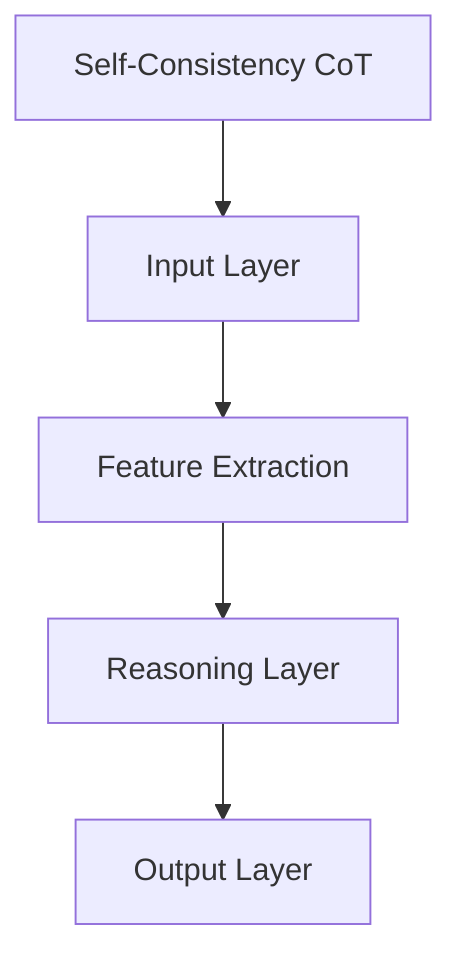

                 

### 自我一致性CoT：提高AI幽默感知能力

**关键词：**
- AI幽默感知
- 自我一致性CoT
- 算法原理
- 数学模型
- 系统架构
- 项目实战
- 最佳实践

**摘要：**
本文将探讨自我一致性CoT（Self-Consistency CoT）在提高AI幽默感知能力方面的应用。我们将从背景介绍、核心概念、算法原理、数学模型、系统架构、项目实战和最佳实践等方面，逐步分析自我一致性CoT的工作原理及其在AI幽默感知中的重要性。

---

#### 第一部分：背景介绍

**第1章：问题背景与核心概念**

**1.1 AI幽默感知能力的现状**
AI幽默感知是人工智能领域的一个新兴课题。当前，大多数AI系统在处理文本、语音、图像等信息时，往往缺乏对幽默感的理解和识别能力。这使得AI在社交互动、娱乐和教育等领域中的应用受到一定限制。

**1.2 Self-Consistency CoT概念的引入**
为了提高AI幽默感知能力，我们需要引入自我一致性CoT（Self-Consistency CoT）这一核心概念。自我一致性CoT是一种基于逻辑推理和知识表示的算法框架，旨在提高AI系统对文本、语音、图像等信息的理解能力和感知能力。

**1.3 Self-Consistency CoT在AI幽默感知中的重要性**
自我一致性CoT在AI幽默感知中具有重要作用。它可以通过分析文本、语音、图像等信息的语义和逻辑结构，帮助AI系统更好地理解幽默感，提高幽默感知能力。

**1.4 Self-Consistency CoT的边界与外延**
自我一致性CoT的边界主要涉及文本、语音、图像等信息的处理和分析。其外延包括自然语言处理、计算机视觉、知识图谱等领域。

**1.5 Self-Consistency CoT的概念结构与核心要素**
自我一致性CoT的概念结构包括以下几个方面：
- **输入层**：接收文本、语音、图像等输入信息。
- **特征提取层**：提取输入信息的语义、逻辑等特征。
- **推理层**：基于特征进行逻辑推理，识别幽默感。
- **输出层**：输出幽默感知的结果。

#### 第二部分：核心概念与联系

**第2章：Self-Consistency CoT原理**

**2.1 Self-Consistency CoT的基本原理**
自我一致性CoT的基本原理是通过对输入信息进行特征提取、逻辑推理和自我修正，提高AI系统对幽默感的理解和识别能力。

**2.2 Self-Consistency CoT的属性特征对比**
下面是一个简单的表格，用于对比自我一致性CoT与其他相关算法的属性特征：

| 算法名称 | 属性特征 |
| :----: | :----: |
| Self-Consistency CoT | 1. 基于逻辑推理 2. 自我修正 3. 多模态处理 |
| 常规算法 | 1. 基于统计学习 2. 特征提取有限 3. 单模态处理 |

**2.3 Self-Consistency CoT的关系图架构**
使用Mermaid绘制的关系图如下：

**2.4 Self-Consistency CoT在AI幽默感知中的应用**
自我一致性CoT在AI幽默感知中的应用主要包括以下几个方面：
- **文本幽默识别**：通过对文本的语义和逻辑分析，识别文本中的幽默元素。
- **语音幽默识别**：通过对语音的音调、节奏和语气等特征分析，识别语音中的幽默元素。
- **图像幽默识别**：通过对图像的视觉特征分析，识别图像中的幽默元素。

---

在接下来的部分，我们将继续探讨自我一致性CoT的算法原理、数学模型、系统架构、项目实战和最佳实践等内容。敬请期待！

