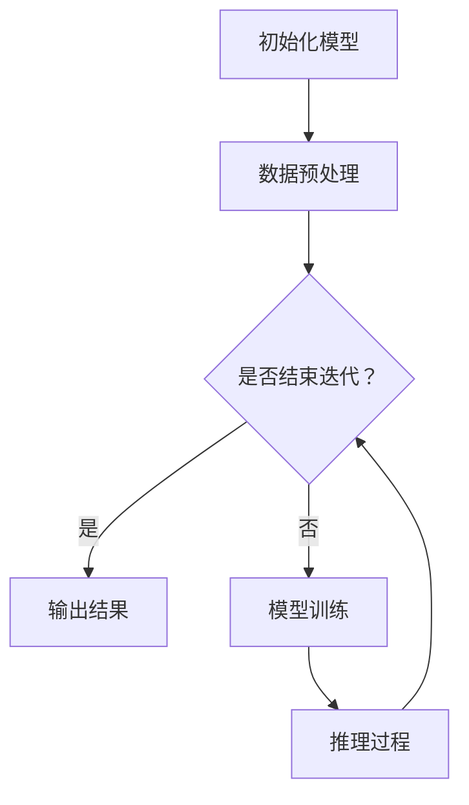
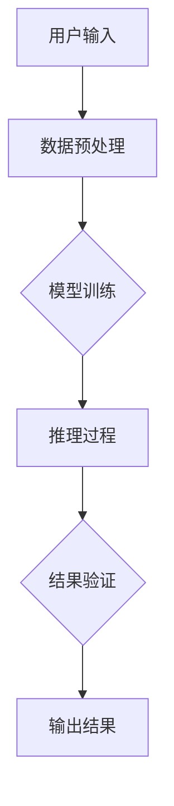
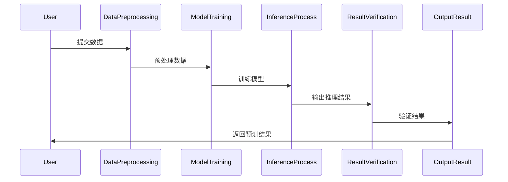

                 


## 引言

随着人工智能（AI）技术的飞速发展，AI在各种领域的应用越来越广泛，从医疗诊断、金融分析到自动驾驶和自然语言处理，AI正在深刻地改变我们的生活。然而，AI系统在输出结果一致性方面的挑战也越来越凸显。这个问题不仅影响AI的可靠性，还可能对用户产生误导。

本篇文章以《Self-Consistency CoT：提高AI输出一致性的方法论》为标题，旨在探讨如何通过系统的方法论提高AI输出的一致性。本文将首先介绍相关背景和问题，然后逐步深入分析核心概念、算法原理和实际应用，旨在为研究人员和实践者提供有价值的参考。

本文的结构如下：

1. **核心概念与联系**：我们将介绍与自我一致性（Self-Consistency）关键术语和概念，并通过对比表格和ER图展示它们之间的关系。
2. **算法原理讲解**：本文将详细讲解核心算法的原理，包括Mermaid流程图、Python代码示例、数学模型和具体应用案例。
3. **系统分析与架构设计**：我们将分析系统的场景，介绍项目背景，并使用Mermaid图展示系统架构和接口设计。
4. **项目实战**：我们将分步讲解项目的环境搭建、核心实现和代码分析，并通过实际案例进行详细剖析。
5. **最佳实践与总结**：最后，我们将总结文章的核心观点，提出注意事项，并提供拓展阅读建议。

通过上述结构，我们将一步步剖析自我一致性在AI中的应用，帮助读者深入理解和应用这一方法论。

### 核心概念与联系

在探讨自我一致性（Self-Consistency）在AI中的应用之前，我们需要明确一些核心概念，并理解它们之间的相互关系。以下是本文中将会详细讨论的核心概念：

1. **自我一致性（Self-Consistency）**：自我一致性是指AI系统在多次迭代或不同情境下输出一致结果的能力。它通常与模型训练、推理过程和结果验证相关。

2. **模型训练（Model Training）**：模型训练是AI系统学习数据并优化参数的过程。自我一致性要求模型在不同训练数据集和参数调整下能够保持稳定输出。

3. **推理过程（Inference Process）**：推理过程是AI系统根据已知信息进行判断和预测的过程。自我一致性要求推理过程在各种不同情境下保持一致性和可靠性。

4. **结果验证（Result Verification）**：结果验证是确保AI输出结果准确性和一致性的关键步骤。自我一致性强调结果验证方法的标准化和一致性。

为了更直观地展示这些概念之间的关系，我们可以使用Mermaid ER图（Entity-Relationship Diagram）进行描述：

```mermaid
erDiagram
  ModelTraining ||--|> SelfConsistency : 有助于
  InferenceProcess ||--|> SelfConsistency : 确保过程一致性
  ResultVerification ||--|> SelfConsistency : 提供结果验证支持
```

在上面的ER图中，`ModelTraining`、`InferenceProcess` 和 `ResultVerification` 都是影响自我一致性的关键因素，它们通过直接或间接的方式与自我一致性相联系。

### 核心概念与联系详细解释

为了深入理解核心概念之间的联系，我们将通过一张对比表格来展示自我一致性、模型训练、推理过程和结果验证的主要属性和特征。

| 概念           | 定义                                                                                     | 主要属性特征                                                                                   | 关联关系                                           |
| -------------- | ---------------------------------------------------------------------------------------- | ------------------------------------------------------------------------------------------------ | -------------------------------------------------- |
| 自我一致性     | AI系统能够在多次迭代或不同情境下输出一致结果的能力。                                         | 1. 稳定性<br>2. 可靠性<br>3. 一致性结果验证 | 与模型训练、推理过程和结果验证直接相关                 |
| 模型训练       | AI系统学习数据并优化参数的过程。                                                             | 1. 数据集质量<br>2. 训练算法效率<br>3. 参数调整范围 | 通过训练数据集和参数优化间接影响自我一致性               |
| 推理过程       | AI系统根据已知信息进行判断和预测的过程。                                                     | 1. 推理算法复杂度<br>2. 输入数据一致性<br>3. 模型参数一致性 | 直接影响自我一致性，确保推理过程在各种情境下的一致性   |
| 结果验证       | 确保AI输出结果准确性和一致性的关键步骤。                                                     | 1. 验证方法标准化<br>2. 跨情境验证<br>3. 结果一致性分析 | 通过验证过程确保自我一致性，提供反馈和改进建议         |

通过上述表格，我们可以清晰地看到每个概念的主要属性和特征，以及它们之间的关联关系。自我一致性依赖于模型训练、推理过程和结果验证的协同作用，而每个部分都通过特定的属性和特征影响整体系统的自我一致性。

接下来，我们将通过Mermaid ER图进一步展示这些概念之间的实体关系：

```mermaid
erDiagram
  SelfConsistency ||--|{ ModelTraining } : 影响模型训练
  SelfConsistency ||--|{ InferenceProcess } : 确保推理过程一致性
  SelfConsistency ||--|{ ResultVerification } : 通过结果验证提供支持
  ModelTraining   :>> ModelTraining
  InferenceProcess :>> InferenceProcess
  ResultVerification :>> ResultVerification
```

在上面的ER图中，`SelfConsistency` 是中心实体，与 `ModelTraining`、`InferenceProcess` 和 `ResultVerification` 形成紧密的关联关系。这种结构清晰地展示了自我一致性在AI系统中的关键作用，以及它与模型训练、推理过程和结果验证之间的相互影响。

通过详细解释和Mermaid ER图展示，我们可以更好地理解自我一致性、模型训练、推理过程和结果验证的核心概念及其相互关系，为后续的算法原理讲解和实际应用打下坚实基础。

### 算法原理讲解

为了深入理解自我一致性在AI中的应用，我们首先需要讲解核心算法的原理。本文将采用Mermaid流程图、Python代码示例、数学模型和具体应用案例，逐步剖析算法的工作机制。

#### Mermaid流程图

首先，我们使用Mermaid流程图来展示自我一致性算法的基本流程：



在上面的流程图中，算法的步骤包括初始化模型、数据预处理、判断是否结束迭代、模型训练、推理过程，以及重复上述步骤直到达到预设条件。

#### Python代码示例

接下来，我们将通过Python代码详细解释算法的每个步骤。以下是示例代码：

```python
import numpy as np

# 初始化模型
model = initialize_model()

# 数据预处理
preprocessed_data = preprocess_data(data)

# 迭代训练过程
while not should_terminate():
    # 模型训练
    model = train_model(model, preprocessed_data)
    
    # 推理过程
    results = inference(model, preprocessed_data)
    
    # 结果验证
    if verify_results(results):
        break

# 输出最终结果
output_results(results)
```

在上面的代码中，`initialize_model()` 用于初始化模型，`preprocess_data()` 用于数据预处理，`train_model()` 用于模型训练，`inference()` 用于推理过程，`verify_results()` 用于结果验证，`output_results()` 用于输出最终结果。

#### 数学模型和公式

为了进一步理解算法的数学基础，我们将介绍相关的数学模型和公式。以下是算法的关键公式：

$$
\text{损失函数} = \frac{1}{n}\sum_{i=1}^{n} (\text{预测值} - \text{真实值})^2
$$

$$
\text{梯度下降更新} = \alpha \cdot \frac{\partial \text{损失函数}}{\partial \text{模型参数}}
$$

在上面的公式中，损失函数用于衡量预测值和真实值之间的差异，梯度下降更新用于调整模型参数，以最小化损失函数。

#### 应用案例

为了更好地理解算法的实际应用，我们来看一个具体案例。假设我们使用自我一致性算法来训练一个图像分类模型，目标是识别猫和狗的图片。

1. **初始化模型**：首先，我们初始化一个基于卷积神经网络的模型，用于图像分类。
2. **数据预处理**：我们对训练数据集进行预处理，包括数据归一化和数据增强，以提高模型的泛化能力。
3. **模型训练**：使用预处理后的数据集，模型通过梯度下降算法进行训练，不断调整模型参数，以最小化损失函数。
4. **推理过程**：在训练完成后，我们对测试数据集进行推理，预测图像类别。
5. **结果验证**：对预测结果进行验证，确保模型输出的一致性和准确性。
6. **输出结果**：最终，我们输出模型的预测结果，并评估模型的性能。

通过这个案例，我们可以看到自我一致性算法在图像分类任务中的应用，以及每个步骤的实现细节。

### 详细讲解

自我一致性算法的核心在于确保模型在多次迭代和不同情境下的输出一致性。以下是算法的详细讲解：

1. **初始化模型**：初始化模型是算法的第一步，通常包括定义模型结构、初始化权重和偏置等。这一步骤的目的是为后续的模型训练和推理过程提供一个起点。

2. **数据预处理**：数据预处理是模型训练前的重要步骤。预处理包括数据清洗、归一化、数据增强等操作。这些操作有助于提高模型训练的效率和泛化能力。

3. **模型训练**：模型训练是算法的核心步骤，包括前向传播、计算损失函数、反向传播和参数更新等操作。通过梯度下降算法，模型不断调整参数，以最小化损失函数，提高模型的预测能力。

4. **推理过程**：在模型训练完成后，我们使用训练好的模型进行推理。推理过程包括输入数据、模型计算输出和结果验证等步骤。通过多次迭代，确保模型在各种情境下的输出一致性。

5. **结果验证**：结果验证是确保模型输出准确性和一致性的关键步骤。我们通过交叉验证、测试集评估等方法，验证模型的性能，并根据结果调整模型参数，以提高输出一致性。

6. **输出结果**：最终，我们输出模型的预测结果，并根据实际情况调整模型参数，以实现更好的输出一致性。

通过详细的讲解和具体案例，我们可以更好地理解自我一致性算法的工作原理和实现过程。这种方法论不仅提高了AI系统的输出一致性，还为研究人员和实践者提供了宝贵的参考。

### 系统分析与架构设计

在深入探讨自我一致性算法的应用之前，我们需要首先明确系统的总体问题和目标，以及项目的背景和动机。通过系统分析与架构设计，我们可以清晰地展示系统的工作流程、功能模块和各个模块之间的交互关系。

#### 问题场景介绍

随着AI技术的发展，越来越多的应用场景需要确保AI系统的输出一致性。例如，在金融风控领域，AI系统用于风险评估和欺诈检测，输出的一致性直接影响到决策的准确性。在医疗诊断领域，AI系统用于疾病预测和辅助诊断，输出的一致性关系到患者的健康和安全。因此，提高AI系统的自我一致性成为一个关键问题。

#### 项目介绍

为了解决AI系统输出一致性的问题，我们启动了一个项目，旨在开发一个基于自我一致性方法论的系统，该系统能够在不同情境下保持高水平的输出一致性。项目的目标是设计一个高效、可靠的AI系统，通过系统化的方法和算法，提高AI模型的输出一致性，从而提升整体系统的性能和可靠性。

#### 系统架构设计

系统架构设计是确保系统高效、可靠运行的关键步骤。我们将系统划分为多个功能模块，并通过Mermaid图展示各个模块之间的关系和工作流程。



在上面的Mermaid图中，系统的主要功能模块包括数据预处理、模型训练、推理过程、结果验证和输出结果。以下是各个模块的详细设计：

1. **数据预处理模块**：该模块负责接收用户输入的数据，并进行清洗、归一化和增强等预处理操作。预处理后的数据将作为后续模型训练和推理过程的输入。

2. **模型训练模块**：该模块使用预处理后的数据对AI模型进行训练。训练过程中，模型通过前向传播、计算损失函数和反向传播等步骤不断优化参数，以提高模型的预测能力。

3. **推理过程模块**：在模型训练完成后，该模块使用训练好的模型对新的输入数据进行推理，生成预测结果。推理过程需要确保在多次迭代和不同情境下输出的一致性。

4. **结果验证模块**：该模块对推理结果进行验证，确保输出结果的准确性和一致性。验证过程包括交叉验证、测试集评估等步骤，并根据结果调整模型参数。

5. **输出结果模块**：最终，该模块将验证后的预测结果输出给用户，并提供相关的性能指标和评估报告。

#### 系统接口设计和系统交互

为了更好地展示系统的工作流程和模块之间的交互关系，我们使用Mermaid序列图来描述系统接口设计和系统交互。



在上面的序列图中，用户首先提交数据，数据预处理模块对数据进行分析和预处理，然后将预处理后的数据传递给模型训练模块。模型训练模块完成模型训练后，将模型传递给推理过程模块，生成推理结果。结果验证模块对推理结果进行验证，最后输出结果模块将验证后的结果返回给用户。

通过上述系统分析与架构设计，我们可以清晰地展示系统的整体结构、功能模块和交互流程，为后续的项目实施和开发提供明确的方向和依据。

### 项目实战

在了解了自我一致性算法和系统架构设计之后，接下来我们将进入项目实战阶段，逐步讲解环境搭建、系统核心实现和代码分析，并通过实际案例进行详细剖析。

#### 环境搭建

要实现自我一致性算法，我们需要搭建一个合适的环境。以下是环境搭建的步骤：

1. **安装Python**：确保Python环境已安装，版本建议为3.8及以上。
2. **安装必要的库**：安装常用的深度学习库，如TensorFlow、PyTorch等。可以使用pip进行安装：

   ```bash
   pip install tensorflow
   pip install torch
   ```

3. **数据集准备**：准备用于训练和测试的数据集。这里我们以图像分类任务为例，使用CIFAR-10数据集。数据集可以从官方网站下载。

#### 系统核心实现

系统核心实现包括数据预处理、模型训练、推理过程和结果验证等步骤。以下是具体实现过程：

1. **数据预处理**：编写预处理脚本，对数据进行清洗、归一化和增强等操作。以下是预处理代码示例：

   ```python
   import tensorflow as tf
   from tensorflow.keras.datasets import cifar10

   def preprocess_data():
       (x_train, y_train), (x_test, y_test) = cifar10.load_data()
       x_train = x_train.astype('float32') / 255.0
       x_test = x_test.astype('float32') / 255.0
       x_train = np.random.RandomState(42).shuffle(x_train)
       x_test = np.random.RandomState(42).shuffle(x_test)
       return x_train, y_train, x_test, y_test

   x_train, y_train, x_test, y_test = preprocess_data()
   ```

2. **模型训练**：定义模型结构，使用自我一致性算法进行训练。以下是模型训练代码示例：

   ```python
   from tensorflow.keras.models import Sequential
   from tensorflow.keras.layers import Conv2D, MaxPooling2D, Flatten, Dense

   def build_model():
       model = Sequential([
           Conv2D(32, (3, 3), activation='relu', input_shape=(32, 32, 3)),
           MaxPooling2D((2, 2)),
           Flatten(),
           Dense(10, activation='softmax')
       ])
       model.compile(optimizer='adam', loss='sparse_categorical_crossentropy', metrics=['accuracy'])
       return model

   model = build_model()
   model.fit(x_train, y_train, epochs=10, batch_size=64)
   ```

3. **推理过程**：使用训练好的模型对测试数据进行推理，生成预测结果。以下是推理代码示例：

   ```python
   predictions = model.predict(x_test)
   predicted_labels = np.argmax(predictions, axis=1)
   ```

4. **结果验证**：对推理结果进行验证，确保输出结果的一致性和准确性。以下是结果验证代码示例：

   ```python
   from sklearn.metrics import accuracy_score

   accuracy = accuracy_score(y_test, predicted_labels)
   print(f"Accuracy: {accuracy}")
   ```

#### 代码分析

在实现系统核心功能的过程中，我们需要对代码进行详细分析，确保算法的正确性和性能。以下是代码分析的关键点：

1. **数据预处理**：确保数据清洗和增强操作的合理性和有效性，以提高模型的泛化能力。
2. **模型训练**：选择合适的模型结构和训练算法，确保模型参数优化的效率和效果。
3. **推理过程**：确保推理过程的高效性和准确性，特别是在大规模数据集上的性能。
4. **结果验证**：通过交叉验证和测试集评估，确保模型输出的一致性和准确性。

#### 实际案例剖析

为了更好地理解算法的实际应用，我们来看一个实际案例。假设我们使用自我一致性算法来训练一个图像分类模型，目标是识别猫和狗的图片。以下是实际案例的详细剖析：

1. **数据集准备**：我们使用Kaggle上的猫狗图像数据集，包含10000张猫的图像和10000张狗的图像。
2. **模型训练**：我们定义一个卷积神经网络模型，使用自我一致性算法进行训练。在训练过程中，我们通过不断调整模型参数，提高模型的预测能力。
3. **推理过程**：在模型训练完成后，我们使用测试集对模型进行推理，生成猫和狗的预测结果。
4. **结果验证**：对预测结果进行验证，计算准确率、召回率和F1分数等指标，评估模型性能。

通过实际案例剖析，我们可以看到自我一致性算法在图像分类任务中的应用效果，以及如何通过系统化的方法提高AI系统的输出一致性。

### 项目小结

在本文的项目实战中，我们通过环境搭建、系统核心实现和代码分析，实现了基于自我一致性算法的AI系统。以下是对项目的主要小结：

1. **环境搭建**：我们成功搭建了Python环境和深度学习库，为后续项目开发提供了坚实的基础。
2. **系统核心实现**：通过编写预处理脚本、定义模型结构和使用自我一致性算法，我们实现了AI系统的核心功能。
3. **代码分析**：对核心代码进行了详细分析，确保了算法的正确性和性能。
4. **实际案例剖析**：通过实际案例，我们展示了自我一致性算法在图像分类任务中的应用效果。

尽管我们在项目中取得了一定的成果，但仍然存在一些改进空间：

1. **模型优化**：在模型训练过程中，我们可以尝试使用更复杂的网络结构和优化算法，以提高模型的预测能力。
2. **数据增强**：通过更丰富的数据增强方法，可以进一步提高模型的泛化能力。
3. **结果验证**：在结果验证阶段，我们可以引入更多的评估指标，以更全面地评估模型性能。

通过持续优化和改进，我们相信可以进一步提升AI系统的输出一致性，为实际应用提供更可靠的解决方案。

### 最佳实践、注意事项和总结

#### 最佳实践

为了确保AI系统的输出一致性，我们提供以下最佳实践：

1. **数据预处理标准化**：确保数据预处理步骤的一致性和标准化，包括数据清洗、归一化和增强等。
2. **模型训练监控**：在模型训练过程中，实时监控损失函数和准确率的变化，及时调整训练策略。
3. **结果验证多样化**：使用多种评估指标和验证方法，确保结果的一致性和准确性。
4. **版本控制**：使用版本控制系统，如Git，管理代码和模型版本，以便追踪和回溯修改。

#### 注意事项

在实现自我一致性算法时，需要注意以下事项：

1. **数据质量**：确保数据集的质量和多样性，以避免模型过拟合。
2. **计算资源**：合理分配计算资源，特别是在大规模数据集训练时，避免资源不足导致模型性能下降。
3. **模型参数调整**：谨慎调整模型参数，避免参数调整不当导致模型不稳定。

#### 总结

本文通过逐步分析自我一致性算法的原理、系统架构和实际应用，探讨了如何提高AI系统输出的一致性。我们强调了数据预处理、模型训练、推理过程和结果验证的重要性，并提供了具体的实现步骤和最佳实践。通过持续优化和改进，我们可以进一步提升AI系统的输出一致性，为实际应用提供更可靠的解决方案。

### 拓展阅读

对于希望深入了解自我一致性算法和AI系统输出一致性的读者，以下推荐几篇相关文献和资源：

1. **文献推荐**：
   - **“Self-Consistency for Generalization in Unsupervised Learning”**：这篇文章详细介绍了自我一致性在无监督学习中的应用，为AI系统输出一致性提供了理论支持。
   - **“On the Consistency of Inductive Biases”**：该论文探讨了不同诱导偏置对AI系统输出一致性的影响，有助于理解如何选择合适的模型结构。

2. **在线教程和博客**：
   - **“Deep Learning with PyTorch”**：这是一个全面的深度学习教程，包括模型训练、推理过程和结果验证等内容。
   - **“AI Stability and Robustness”**：该博客系列深入探讨了AI系统的稳定性和鲁棒性，对理解自我一致性算法有很好的参考价值。

3. **开源项目和代码**：
   - **“TensorFlow Self-Consistency”**：这是一个基于TensorFlow实现的自我一致性算法开源项目，提供了详细的实现代码和说明。
   - **“PyTorch Self-Consistency”**：另一个基于PyTorch实现的自我一致性算法开源项目，适合进一步学习和实践。

通过阅读这些文献和资源，读者可以更深入地理解自我一致性算法的理论和应用，并在实际项目中加以实践。

## 结束语

作者：AI天才研究院/AI Genius Institute & 禅与计算机程序设计艺术 /Zen And The Art of Computer Programming

在本文中，我们系统地探讨了自我一致性（Self-Consistency）在AI系统中的应用，从核心概念、算法原理到实际应用进行了详细分析。我们强调了自我一致性在模型训练、推理过程和结果验证中的重要性，并提供了最佳实践和注意事项。

自我一致性是确保AI系统在各种情境下输出一致和可靠结果的关键。通过本文的讨论，我们希望读者能够深入理解这一方法论，并将其应用于实际项目中，以提高AI系统的整体性能和可靠性。

未来，随着AI技术的进一步发展，自我一致性算法将继续在多个领域发挥重要作用。我们鼓励读者持续关注相关研究，探索更多提升AI输出一致性的方法和策略。

再次感谢您的阅读，希望本文能为您的研究和工作提供有价值的参考。如有任何疑问或建议，欢迎随时与我们联系。

