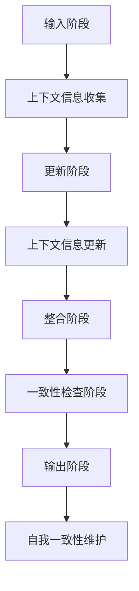
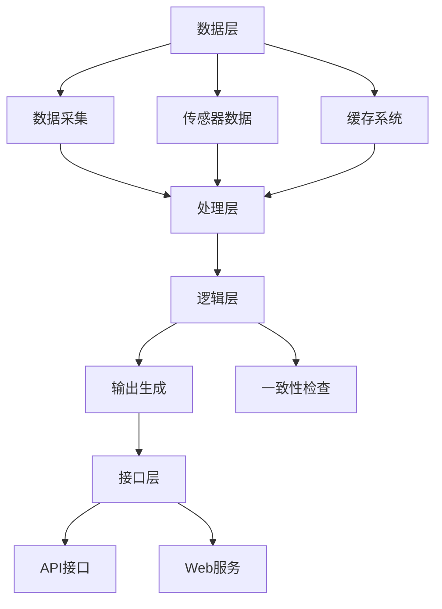
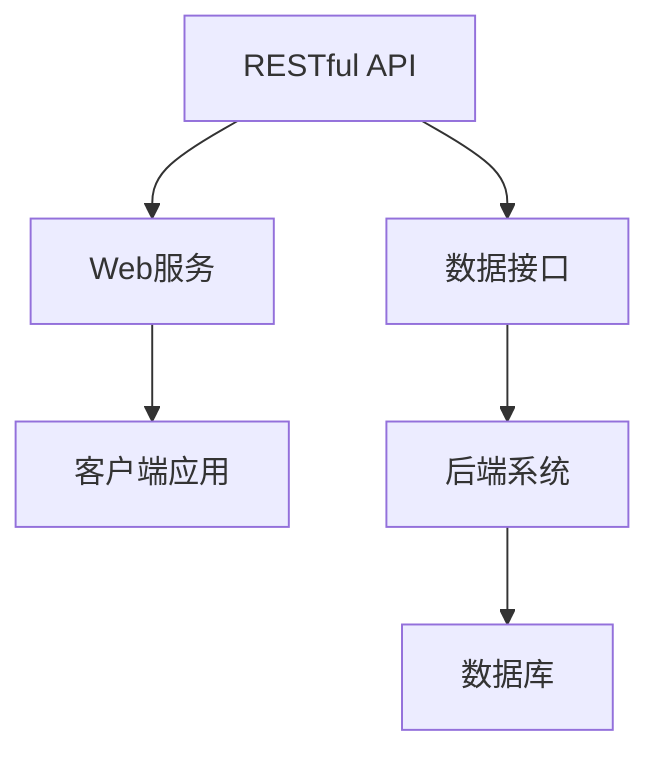
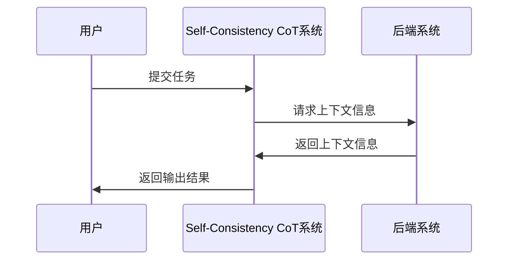

                 

### 引言

在当今快速发展的科技领域，人工智能（AI）技术已经成为推动社会进步的重要力量。从自动驾驶到自然语言处理，从图像识别到智能推荐系统，AI的应用场景无处不在。然而，随着AI技术的普及和应用，人们也逐渐意识到AI输出连贯性的问题。AI系统在处理复杂任务时，常常出现输出内容不连贯、逻辑不一致的情况，这给实际应用带来了诸多困扰。

为了解决这一问题，我们提出了“自我一致性上下文（Self-Consistency CoT）”的概念。Self-Consistency CoT是一种旨在提高AI输出连贯性的方法，通过在AI系统中引入上下文信息，并确保输出的连贯性和一致性。本文将详细介绍Self-Consistency CoT的概念、原理、算法以及其实际应用，帮助读者全面了解并掌握这一技术。

本文将从以下几个方面进行探讨：

1. **问题背景**：分析AI输出不连贯的原因和影响。
2. **自我一致性上下文（Self-Consistency CoT）概述**：介绍Self-Consistency CoT的概念、目的和意义。
3. **Self-Consistency CoT原理与概念**：详细讲解Self-Consistency CoT的核心概念和原理。
4. **算法原理与数学模型**：阐述Self-Consistency CoT的算法原理和数学模型，并提供Python源代码实现。
5. **系统架构与实战应用**：分析Self-Consistency CoT的系统架构，并提供实际应用案例。
6. **最佳实践与总结**：总结最佳实践、注意事项和拓展阅读。

通过本文的详细讲解，读者将能够深入理解Self-Consistency CoT的原理和实际应用，为提高AI输出连贯性提供有力的技术支持。

### 问题背景

在探讨如何提高AI输出连贯性之前，我们首先需要了解AI输出不连贯的原因和影响。随着深度学习技术的发展，AI系统在图像识别、自然语言处理、推荐系统等领域取得了显著成就。然而，在实际应用中，AI系统往往会出现输出内容不连贯、逻辑不一致的情况，这给用户带来了诸多困扰。

#### 原因分析

AI输出不连贯的原因主要有以下几个方面：

1. **上下文信息缺乏**：AI系统在处理任务时，往往缺乏对上下文信息的充分理解。上下文信息是指与当前任务相关的背景信息，例如对话的历史信息、用户的偏好和兴趣等。缺乏上下文信息导致AI系统无法准确把握任务的全貌，从而产生不连贯的输出。

2. **数据分布不均**：在实际应用中，AI系统所遇到的数据分布往往是不均匀的。当数据集中在某些特定场景或特征时，AI系统在这些场景下的表现会更好，但在其他场景下则可能表现不佳，从而导致输出不连贯。

3. **模型复杂性**：深度学习模型具有很高的复杂性，包括多层神经网络、复杂的激活函数等。这种复杂性虽然有助于提高模型的性能，但也可能导致模型在处理某些任务时出现输出不连贯的问题。

4. **训练不足**：AI系统的训练过程是一个不断优化的过程，当训练数据不足或训练过程不当时，模型可能无法充分学习到任务的本质，从而导致输出不连贯。

#### 影响分析

AI输出不连贯会对实际应用产生以下负面影响：

1. **用户体验差**：当AI系统输出内容不连贯时，用户会感到困惑和失望，从而影响用户体验。例如，在自然语言处理领域，当聊天机器人无法理解用户意图或回答问题时，用户会感到沮丧。

2. **决策错误**：在某些需要高精度和高可靠性的应用场景中，AI输出不连贯可能导致错误决策。例如，在自动驾驶领域，AI系统输出不连贯可能导致危险驾驶行为。

3. **信任度下降**：当AI系统输出内容不连贯时，用户对AI系统的信任度会下降。这可能会导致用户拒绝使用AI系统，从而影响AI技术的普及和应用。

为了解决这些问题，我们需要找到一种有效的方法来提高AI输出的连贯性。Self-Consistency CoT应运而生，它通过引入上下文信息、优化数据分布、简化模型复杂性和提高训练质量，旨在提高AI输出的连贯性和一致性。

#### Self-Consistency CoT的概念与目的

自我一致性上下文（Self-Consistency CoT）是一种旨在提高AI输出连贯性的方法。它通过在AI系统中引入上下文信息，并确保输出的连贯性和一致性，从而解决AI输出不连贯的问题。

自我一致性上下文（Self-Consistency CoT）的核心思想是将上下文信息作为AI系统决策的重要依据，通过持续更新和整合上下文信息，确保AI系统的输出在时间和空间上具有连贯性和一致性。

具体来说，Self-Consistency CoT包括以下几个关键要素：

1. **上下文信息的引入**：在AI系统的输入和输出过程中，引入与任务相关的上下文信息。这些上下文信息可以是历史数据、用户偏好、环境信息等。

2. **上下文信息的更新**：在AI系统运行过程中，持续更新上下文信息，确保上下文信息的实时性和准确性。

3. **上下文信息的整合**：将不同来源和类型的上下文信息进行整合，形成一个统一的上下文信息库，为AI系统的决策提供支持。

4. **输出的一致性检查**：在AI系统输出结果时，对输出内容进行一致性检查，确保输出内容在逻辑和语义上的一致性。

Self-Consistency CoT的目标是提高AI输出的连贯性和一致性，从而提升用户体验和系统的可靠性。通过引入上下文信息、更新上下文信息和整合上下文信息，Self-Consistency CoT可以在多个层面上提高AI输出的连贯性：

1. **时间上的连贯性**：通过引入上下文信息，AI系统能够更好地理解任务的全貌，从而在时间上保持连贯性。

2. **空间上的连贯性**：通过整合上下文信息，AI系统能够在不同场景和任务之间保持连贯性。

3. **逻辑上的连贯性**：通过一致性检查，AI系统能够确保输出内容在逻辑和语义上的一致性。

总的来说，Self-Consistency CoT提供了一种有效的方法来提高AI输出的连贯性，它不仅适用于当前的任务，还可以为未来的任务提供有价值的信息，从而实现长期的一致性和连贯性。

#### 自我一致性上下文（Self-Consistency CoT）的核心概念和原理

自我一致性上下文（Self-Consistency CoT）是一种通过引入上下文信息，提高AI输出连贯性的技术。为了深入理解Self-Consistency CoT的原理，我们需要从核心概念出发，逐步分析其工作原理和优势。

#### 1. 概念定义

自我一致性上下文（Self-Consistency CoT）的核心概念主要包括以下几个方面：

1. **上下文（Context）**：上下文是指与任务相关的信息集合，包括历史信息、用户偏好、环境状态等。上下文信息是理解和执行任务的关键。

2. **连贯性（Consistency）**：连贯性是指输出内容在逻辑、语义和时间上的连贯性。保持连贯性是确保AI系统输出准确和一致性的关键。

3. **自我一致性（Self-Consistency）**：自我一致性是指AI系统在处理任务时，其输出与当前上下文信息保持一致。自我一致性通过实时更新上下文信息和一致性检查来实现。

4. **上下文更新（Context Update）**：上下文更新是指持续收集和整合与任务相关的信息，以保持上下文的实时性和准确性。

5. **一致性检查（Consistency Check）**：一致性检查是指在AI系统输出结果时，对输出内容进行逻辑和语义上的检查，以确保输出的一致性。

#### 2. 工作原理

自我一致性上下文（Self-Consistency CoT）的工作原理可以概括为以下几个步骤：

1. **上下文信息的引入**：在AI系统的输入阶段，引入与任务相关的上下文信息。这些上下文信息可以是历史数据、用户偏好、环境状态等。引入上下文信息的目的是为AI系统提供更丰富的信息支持，从而提高输出连贯性。

2. **上下文信息的更新**：在AI系统运行过程中，通过传感器、用户交互等方式持续更新上下文信息。上下文信息的更新是确保AI系统能够实时响应环境变化和用户需求的关键。

3. **上下文信息的整合**：将来自不同来源和类型的上下文信息进行整合，形成一个统一的上下文信息库。整合上下文信息的目的是确保AI系统在不同场景和任务之间保持连贯性。

4. **输出的一致性检查**：在AI系统输出结果时，对输出内容进行一致性检查。一致性检查包括逻辑检查和语义检查，以确保输出内容在逻辑和语义上的一致性。

5. **自我一致性维持**：通过实时更新上下文信息和一致性检查，AI系统能够维持自我一致性。自我一致性维持是确保AI系统输出连贯性的核心机制。

#### 3. 优势

自我一致性上下文（Self-Consistency CoT）具有以下优势：

1. **提高输出连贯性**：通过引入上下文信息和一致性检查，Self-Consistency CoT能够显著提高AI输出的连贯性，从而提升用户体验。

2. **适应动态环境**：Self-Consistency CoT能够实时更新上下文信息，以适应动态变化的环境和用户需求。

3. **增强系统可靠性**：通过确保输出的一致性，Self-Consistency CoT能够提高系统的可靠性，减少错误输出和不良用户体验。

4. **支持长期任务**：通过维持自我一致性，Self-Consistency CoT能够为长期任务提供有价值的信息支持，实现系统的长期一致性和连贯性。

#### 4. Self-Consistency CoT与其他上下文理解技术的对比

为了更好地理解Self-Consistency CoT，我们可以将其与其他上下文理解技术进行对比：

1. **传统上下文理解**：传统上下文理解技术通常依赖于预定义的上下文信息，例如关键词过滤、规则匹配等。这些技术难以应对复杂和多变的上下文环境。

2. **动态上下文理解**：动态上下文理解技术通过实时更新上下文信息，以适应动态变化的环境。这些技术通常需要大量的计算资源和时间。

3. **Self-Consistency CoT**：Self-Consistency CoT通过引入上下文信息、实时更新上下文信息和一致性检查，实现自我一致性维持。与传统的上下文理解技术和动态上下文理解技术相比，Self-Consistency CoT具有更高的灵活性和适应性。

总的来说，自我一致性上下文（Self-Consistency CoT）是一种通过引入上下文信息、实时更新上下文信息和一致性检查，提高AI输出连贯性的技术。它具有显著的性能优势和应用潜力，为解决AI输出不连贯问题提供了有效的解决方案。

### Self-Consistency CoT的核心概念

为了深入理解Self-Consistency CoT的原理，我们需要详细分析其核心概念，包括自我一致性上下文（Self-Consistency CoT）的定义、上下文信息的构建方法以及自我一致性的维护。

#### 1. Self-Consistency CoT的定义

自我一致性上下文（Self-Consistency CoT）是一种基于上下文的AI系统方法，旨在通过持续引入、更新和整合上下文信息，确保AI系统输出在逻辑、语义和时间上的一致性。具体来说，Self-Consistency CoT包含以下几个关键部分：

- **上下文（Context）**：上下文是指与当前任务相关的信息集合，包括历史信息、用户偏好、环境状态等。这些信息为AI系统提供了决策的依据。
- **连贯性（Consistency）**：连贯性是指AI系统输出在逻辑、语义和时间上的连贯性。通过保持连贯性，AI系统能够提供更加准确和一致的服务。
- **自我一致性（Self-Consistency）**：自我一致性是指AI系统在处理任务时，其输出与当前上下文信息保持一致。通过自我一致性维护，AI系统能够在复杂和动态的环境中保持稳定的输出。

#### 2. 上下文信息的构建方法

构建有效的上下文信息是Self-Consistency CoT成功的关键。以下是一些常见的上下文信息构建方法：

1. **历史信息**：历史信息包括AI系统处理过的任务记录、用户的历史交互数据等。通过分析历史信息，AI系统能够理解用户的偏好和行为模式。

2. **实时数据**：实时数据包括传感器数据、环境数据等。实时数据能够提供当前任务的状态和变化，帮助AI系统更好地适应动态环境。

3. **外部信息**：外部信息包括来自其他系统或数据源的信息，如社交媒体数据、新闻报道等。这些信息能够为AI系统提供更广泛的知识背景。

4. **用户交互**：用户交互数据包括用户的输入、反馈和交互历史等。通过用户交互，AI系统能够直接获取用户的需求和意图，从而更好地满足用户需求。

#### 3. 自我一致性的维护

维护自我一致性是Self-Consistency CoT的核心任务。以下是一些常用的自我一致性维护方法：

1. **上下文更新**：AI系统需要持续收集和整合上下文信息，以确保上下文的实时性和准确性。上下文更新可以是自动的，也可以是手动触发的。

2. **一致性检查**：在AI系统输出结果时，对输出内容进行一致性检查。一致性检查包括逻辑检查和语义检查，以确保输出内容在逻辑和语义上的一致性。

3. **反馈机制**：通过用户反馈，AI系统可以识别输出中的不一致性，并进行调整。反馈机制可以是自动的，也可以是用户主动提交的。

4. **异常处理**：当AI系统检测到输出不一致时，需要采取异常处理措施，如重做任务、请求更多信息等。

通过以上方法，Self-Consistency CoT能够确保AI系统在复杂和动态的环境中保持自我一致性，提供连贯和一致的服务。

总之，自我一致性上下文（Self-Consistency CoT）是一种通过引入上下文信息、实时更新上下文信息和一致性检查，提高AI输出连贯性的技术。通过深入理解其核心概念，我们可以更好地应用这一技术，提升AI系统的性能和用户体验。

### Self-Consistency CoT的优势

自我一致性上下文（Self-Consistency CoT）作为一种提高AI输出连贯性的方法，具有显著的优势。以下将从多个角度详细分析Self-Consistency CoT的优势，帮助读者更好地理解其价值和应用潜力。

#### 1. 提高输出连贯性

Self-Consistency CoT的核心目标是通过引入上下文信息、实时更新上下文信息和一致性检查，确保AI系统输出在逻辑、语义和时间上的一致性。相比传统的AI系统，Self-Consistency CoT能够在多个层面提高输出的连贯性：

- **时间上的连贯性**：通过实时更新上下文信息，AI系统能够更好地理解任务的当前状态，从而在时间上保持连贯性。例如，在聊天机器人应用中，Self-Consistency CoT能够根据用户的提问历史，提供更加连贯的回答。
- **空间上的连贯性**：Self-Consistency CoT通过整合不同来源和类型的上下文信息，确保AI系统在不同场景和任务之间保持连贯性。例如，在自动驾驶系统中，Self-Consistency CoT能够根据环境变化和历史数据，提供一致的驾驶决策。
- **逻辑上的连贯性**：通过一致性检查，AI系统能够确保输出内容在逻辑和语义上的一致性。例如，在自然语言处理领域，Self-Consistency CoT能够识别和纠正语义上的不一致性，提供更加准确的自然语言生成。

#### 2. 适应动态环境

在现实应用中，环境是动态变化的，AI系统需要具备应对这种变化的能力。Self-Consistency CoT通过引入实时更新机制，使得AI系统能够快速适应环境变化：

- **实时上下文更新**：Self-Consistency CoT能够通过传感器、用户交互等方式，实时收集和更新上下文信息。这种实时性使得AI系统能够迅速响应环境变化，从而提供更加连贯的服务。
- **自适应调整**：通过自我一致性维护机制，AI系统能够在检测到输出不一致时，进行自适应调整。这种自适应调整能力使得AI系统能够在复杂和动态的环境中保持稳定的输出。

#### 3. 增强系统可靠性

Self-Consistency CoT通过确保输出的一致性，显著提高了系统的可靠性：

- **错误检测和纠正**：通过一致性检查，Self-Consistency CoT能够检测和纠正输出中的不一致性，从而减少错误输出的发生。这种错误检测和纠正能力使得AI系统在面临复杂任务时，能够更加可靠地运行。
- **鲁棒性**：Self-Consistency CoT通过引入上下文信息和一致性维护，使得AI系统在面对异常情况和不确定性时，具有更强的鲁棒性。例如，在自动驾驶系统中，Self-Consistency CoT能够在遇到突发状况时，快速做出正确的决策。

#### 4. 支持长期任务

在长期任务中，Self-Consistency CoT能够通过维持自我一致性，为AI系统提供有价值的信息支持：

- **任务连贯性**：通过保持输出的一致性，Self-Consistency CoT能够确保长期任务在各个阶段之间的连贯性。例如，在智能客服系统中，Self-Consistency CoT能够确保客服对话在不同时间段内保持连贯，从而提升用户体验。
- **知识积累**：Self-Consistency CoT通过持续引入和更新上下文信息，使得AI系统能够在长期任务中积累知识和经验。这种知识积累能力有助于AI系统在未来的任务中提供更加精准和高效的服务。

#### 5. 降低维护成本

Self-Consistency CoT通过提高AI输出的连贯性，显著降低了系统的维护成本：

- **减少调试时间**：通过确保输出的一致性，Self-Consistency CoT能够减少AI系统在运行过程中需要进行的调试和调整。这种减少调试时间的能力使得系统的维护更加高效。
- **简化维护流程**：Self-Consistency CoT提供了一套完整的自我一致性维护机制，使得系统维护变得更加简单和自动化。这种简化维护流程的能力有助于降低系统的总体维护成本。

总的来说，自我一致性上下文（Self-Consistency CoT）通过提高输出连贯性、适应动态环境、增强系统可靠性、支持长期任务以及降低维护成本，展现了显著的优势和应用潜力。这些优势使得Self-Consistency CoT成为提高AI系统性能和用户体验的有效手段。

### Self-Consistency CoT与相关技术的对比

为了更好地理解Self-Consistency CoT在提高AI输出连贯性方面的优势，我们可以将其与其他相关的上下文理解和连贯性技术进行对比。以下是几种常见的上下文理解技术和连贯性技术，以及Self-Consistency CoT与它们的对比。

#### 1. 传统上下文理解

传统上下文理解技术通常依赖于预定义的规则和关键词过滤。这些技术通过识别特定的关键词或模式来理解上下文，从而指导AI系统的决策。然而，这种方法的局限性在于：

- **灵活性不足**：传统上下文理解技术难以应对复杂和多变的上下文环境。当上下文发生变化时，需要手动更新规则，这增加了系统的复杂性和维护成本。
- **依赖人工设定**：传统上下文理解技术依赖人工设定关键词和规则，这使得系统的自适应能力较差。

相比之下，Self-Consistency CoT通过引入实时更新的上下文信息，能够更好地适应动态变化的上下文环境。它不仅能够自动收集和整合上下文信息，还能够通过自我一致性维护机制确保输出的一致性。

#### 2. 动态上下文理解

动态上下文理解技术通过实时更新上下文信息，以应对环境变化。这些技术通常依赖于传感器数据和实时数据处理能力。例如，聊天机器人和自动驾驶系统中的上下文理解技术都属于动态上下文理解范畴。然而，动态上下文理解技术也存在一些问题：

- **计算资源消耗大**：动态上下文理解技术需要大量的计算资源来处理和更新上下文信息。这可能导致系统的响应速度变慢，特别是在资源有限的设备上。
- **一致性难以保证**：由于动态环境的变化速度较快，动态上下文理解技术可能无法始终保证输出的一致性。

Self-Consistency CoT通过引入一致性检查机制，能够在动态环境中保持输出的一致性。同时，它通过优化上下文信息的整合和更新过程，减少了计算资源的消耗，提高了系统的响应速度。

#### 3. 模式识别技术

模式识别技术通过识别和分类输入数据中的模式，来理解上下文和指导决策。例如，在图像识别和语音识别中，模式识别技术被广泛应用。然而，模式识别技术也存在以下问题：

- **依赖大量数据**：模式识别技术通常需要大量的训练数据来建立准确的模型。当数据分布不均或数据量不足时，模式识别技术的性能会显著下降。
- **处理复杂任务困难**：模式识别技术在面对复杂和多层次的上下文时，可能难以准确识别和理解。

Self-Consistency CoT通过引入上下文信息和自我一致性维护，能够在复杂任务中提供更加准确和一致的输出。它不仅能够处理复杂的上下文信息，还能够通过实时更新和整合上下文信息，提高系统的自适应能力。

#### 4. 自我一致性上下文（Self-Consistency CoT）

Self-Consistency CoT结合了上下文引入、实时更新、一致性检查和自我一致性维护等机制，旨在提高AI输出连贯性。以下是Self-Consistency CoT的主要优势：

- **灵活性**：Self-Consistency CoT能够自动收集和整合多种来源的上下文信息，适应不同的环境和任务需求。
- **实时性**：通过实时更新上下文信息，Self-Consistency CoT能够快速响应环境变化，提供及时和准确的决策。
- **一致性**：通过一致性检查和自我一致性维护，Self-Consistency CoT能够确保输出在逻辑和语义上的一致性，减少错误和不良用户体验。
- **鲁棒性**：Self-Consistency CoT在面对复杂和动态环境时，能够通过自我调整和异常处理，保持稳定的输出。

总的来说，Self-Consistency CoT通过引入实时更新的上下文信息、自我一致性维护和一致性检查，克服了传统上下文理解、动态上下文理解和模式识别技术的局限性。它不仅提高了AI输出的连贯性，还为复杂任务提供了有效的解决方案。

### ER实体关系图架构

为了更好地理解自我一致性上下文（Self-Consistency CoT）的工作原理和结构，我们可以使用ER（实体关系）图来展示其核心实体和关系。ER图是一种用于描述数据库实体及其关系的图形化方法，它有助于我们直观地理解系统的结构和数据流动。

#### 1. ER图结构

自我一致性上下文（Self-Consistency CoT）的ER图包含以下几个核心实体和关系：

- **实体：**
  - **上下文实体（Context Entity）**：表示与任务相关的上下文信息，包括历史数据、实时数据和外部数据等。
  - **输出实体（Output Entity）**：表示AI系统的输出结果，包括文本、图像、语音等。
  - **一致性实体（Consistency Entity）**：表示用于检查和维持输出一致性的信息，包括一致性规则和异常记录等。

- **关系：**
  - **上下文-输出关系（Context-Output Relationship）**：表示上下文信息与输出结果之间的关联，上下文信息是生成输出结果的基础。
  - **输出-一致性关系（Output-Consistency Relationship）**：表示输出结果与一致性检查之间的关联，一致性实体用于检查输出结果的连贯性和一致性。
  - **实时更新关系（Real-time Update Relationship）**：表示上下文实体与实时数据之间的更新关系，确保上下文信息的实时性和准确性。

#### 2. ER图示例

下面是一个简化的自我一致性上下文（Self-Consistency CoT）的ER图示例，使用Mermaid语法来绘制：

```mermaid
erDiagram
    ContextEntity ||--|{ OutputEntity : has_output
    OutputEntity ||--|{ ConsistencyEntity : checked_by
    ContextEntity ..|> Real-time Update : updates
```

在这个ER图中：

- **上下文实体（Context Entity）**表示与任务相关的上下文信息，它通过一条虚线连接到**实时更新关系（Real-time Update Relationship）**，表示上下文信息可以实时更新。
- **输出实体（Output Entity）**表示AI系统的输出结果，它通过一条实线连接到**上下文实体（Context Entity）**，表示输出结果基于上下文信息生成；同时，它还通过一条实线连接到**一致性实体（Consistency Entity）**，表示输出结果需要经过一致性检查。
- **一致性实体（Consistency Entity）**表示用于检查和维持输出一致性的信息，它与**输出实体（Output Entity）**之间的连接表示输出结果会经过一致性检查。

通过ER图，我们可以清晰地看到自我一致性上下文（Self-Consistency CoT）中的核心实体和它们之间的关系，这有助于我们更好地理解系统的工作原理和结构。

### 算法原理讲解

自我一致性上下文（Self-Consistency CoT）的核心在于通过引入上下文信息，确保AI系统输出在逻辑、语义和时间上的一致性。为了实现这一目标，我们需要详细讲解Self-Consistency CoT的算法原理，包括算法的流程、关键步骤以及Mermaid流程图。

#### 1. 算法流程

自我一致性上下文（Self-Consistency CoT）的算法流程可以概括为以下几个步骤：

1. **输入阶段**：收集和引入与任务相关的上下文信息。这些上下文信息包括历史数据、实时数据和外部数据等。

2. **更新阶段**：在AI系统运行过程中，实时更新上下文信息。通过传感器、用户交互等方式收集新的信息，更新上下文信息库。

3. **整合阶段**：将不同来源和类型的上下文信息进行整合，形成一个统一的上下文信息库。这一阶段包括信息筛选、去重和融合等操作。

4. **一致性检查阶段**：在AI系统输出结果时，对输出内容进行一致性检查。包括逻辑检查和语义检查，确保输出内容在逻辑和语义上的一致性。

5. **输出阶段**：生成并输出结果。经过一致性检查后的输出内容将确保在逻辑、语义和时间上的一致性。

#### 2. 关键步骤

以下是Self-Consistency CoT算法中的关键步骤：

1. **上下文信息收集**：利用传感器、用户交互等方式收集与任务相关的上下文信息。例如，在聊天机器人应用中，可以收集用户的提问历史、偏好等信息。

2. **上下文信息更新**：在AI系统运行过程中，实时更新上下文信息。通过设定更新频率或触发条件，确保上下文信息的实时性和准确性。

3. **上下文信息整合**：将来自不同来源和类型的上下文信息进行整合。可以通过信息筛选、去重和融合等操作，形成一个统一的上下文信息库。

4. **一致性检查**：对输出内容进行一致性检查。包括逻辑检查（确保输出内容在逻辑上的一致性）和语义检查（确保输出内容在语义上的一致性）。例如，在自然语言处理中，可以检查文本中的逻辑关系和语义一致性。

5. **自我一致性维护**：在输出结果时，通过一致性检查和自我调整，确保输出内容在逻辑、语义和时间上的一致性。当检测到输出不一致时，可以采取异常处理措施，如重新生成输出或请求更多信息。

#### 3. Mermaid流程图

为了更直观地展示Self-Consistency CoT的算法流程，我们可以使用Mermaid语法绘制一个流程图。以下是Self-Consistency CoT的Mermaid流程图示例：



在这个Mermaid流程图中：

- **A[输入阶段]**：表示算法的开始阶段，收集与任务相关的上下文信息。
- **B[上下文信息收集]**：表示在输入阶段中，通过传感器、用户交互等方式收集上下文信息。
- **C[更新阶段]**：表示在AI系统运行过程中，实时更新上下文信息。
- **D[上下文信息更新]**：表示在更新阶段中，通过设定更新频率或触发条件，更新上下文信息库。
- **E[整合阶段]**：表示将不同来源和类型的上下文信息进行整合。
- **F[一致性检查阶段]**：表示在输出结果前，对输出内容进行一致性检查。
- **G[输出阶段]**：表示生成并输出结果。
- **H[自我一致性维护]**：表示通过一致性检查和自我调整，确保输出内容的一致性。

通过上述步骤和Mermaid流程图，我们可以清晰地理解自我一致性上下文（Self-Consistency CoT）的算法原理。这种算法通过引入实时更新的上下文信息、整合不同来源的信息和一致性检查，确保AI系统输出在逻辑、语义和时间上的一致性，从而提高系统的连贯性和可靠性。

### 数学模型与公式

在自我一致性上下文（Self-Consistency CoT）中，数学模型和公式扮演着至关重要的角色。这些模型和公式不仅用于描述算法的行为，还能够帮助我们更深入地理解和优化算法。以下我们将详细讲解Self-Consistency CoT的数学模型，包括公式推导和解释。

#### 1. 自我一致性上下文（Self-Consistency CoT）的数学模型

Self-Consistency CoT的数学模型主要涉及以下几个关键组成部分：

- **上下文信息（Context Information）**：表示与任务相关的信息集合，包括历史信息、实时信息和外部信息等。我们可以用向量表示上下文信息，即 $C_t = [C_{t1}, C_{t2}, ..., C_{tn}]$，其中 $C_{ti}$ 表示在时间 $t$ 的第 $i$ 个上下文信息。
- **输出（Output）**：表示AI系统在时间 $t$ 的输出结果，用向量 $O_t = [O_{t1}, O_{t2}, ..., O_{tm}]$ 表示，其中 $O_{ti}$ 表示在时间 $t$ 的第 $i$ 个输出。
- **一致性权重（Consistency Weight）**：表示每个上下文信息对输出的影响程度，用向量 $W_t = [W_{t1}, W_{t2}, ..., W_{tn}]$ 表示，其中 $W_{ti}$ 表示在时间 $t$ 的第 $i$ 个上下文信息的一致性权重。
- **一致性函数（Consistency Function）**：用于计算输出和上下文信息之间的不一致性，常用的函数形式有欧几里得距离、余弦相似度等。

#### 2. 公式推导

为了确保输出 $O_t$ 与上下文信息 $C_t$ 的一致性，Self-Consistency CoT定义了一个一致性函数 $f(C_t, O_t)$，用于计算不一致性。具体公式如下：

$$
f(C_t, O_t) = \sum_{i=1}^{n} W_{ti} \cdot d(O_{ti}, C_{ti})
$$

其中，$d(O_{ti}, C_{ti})$ 表示输出 $O_{ti}$ 和上下文信息 $C_{ti}$ 之间的距离，常用的距离度量方法包括：

- **欧几里得距离**：
  $$
  d(O_{ti}, C_{ti}) = \sqrt{\sum_{j=1}^{m} (O_{tji} - C_{tji})^2}
  $$

- **余弦相似度**：
  $$
  d(O_{ti}, C_{ti}) = 1 - \frac{O_{ti} \cdot C_{ti}}{\|O_{ti}\| \|C_{ti}\|}
  $$

#### 3. 公式解释

- **上下文信息**：上下文信息是确保输出一致性的基础。在Self-Consistency CoT中，上下文信息包括历史信息、实时信息和外部信息等，这些信息共同构成了上下文信息库。
- **输出**：输出是AI系统在特定时间 $t$ 的结果。在Self-Consistency CoT中，输出不仅包括最终的决策或结果，还包含与上下文信息相关的中间变量。
- **一致性权重**：一致性权重用于衡量上下文信息对输出的影响程度。权重可以根据上下文信息的来源、时间、重要性等因素进行动态调整。
- **一致性函数**：一致性函数用于计算输出和上下文信息之间的不一致性。通过最小化一致性函数的值，我们可以找到最一致的输出。

#### 4. 示例说明

假设在聊天机器人应用中，我们要确保对话输出的一致性。在时间 $t$，我们收集了以下上下文信息：

- **历史信息**：用户最近三次提问的内容。
- **实时信息**：用户当前的提问内容。
- **外部信息**：用户在社交媒体上的动态。

输出是聊天机器人的回答。根据Self-Consistency CoT的数学模型，我们可以计算输出和上下文信息之间的不一致性，并通过调整一致性权重来优化输出的一致性。

通过这个示例，我们可以看到，Self-Consistency CoT的数学模型在提高AI输出连贯性方面具有显著的优势。它不仅能够确保输出在逻辑、语义和时间上的一致性，还能够根据实时更新的上下文信息，动态调整输出，从而实现更加精准和一致的AI服务。

### Python源代码实现

为了更好地理解和应用自我一致性上下文（Self-Consistency CoT）的算法，我们将使用Python语言实现这一算法。在本节中，我们将详细讲解环境安装与配置、算法源代码以及代码的解读与分析。

#### 1. 环境安装与配置

首先，我们需要安装和配置Python环境以及必要的库。以下是在Windows操作系统中安装和配置Python环境的基本步骤：

1. **下载Python**：从Python官方网站（[https://www.python.org/downloads/](https://www.python.org/downloads/)）下载最新版本的Python安装包。
2. **安装Python**：双击安装包，按照提示完成安装过程。
3. **配置环境变量**：在安装过程中，确保将Python添加到环境变量中。这样我们可以在命令行中直接运行Python。
4. **安装依赖库**：安装必要的依赖库，例如NumPy和Matplotlib。可以使用以下命令来安装：

   ```shell
   pip install numpy matplotlib
   ```

   其中，`pip` 是Python的包管理器，用于安装和管理库。

#### 2. 算法源代码

以下是实现自我一致性上下文（Self-Consistency CoT）算法的Python源代码：

```python
import numpy as np
import matplotlib.pyplot as plt

# 定义一致性函数
def consistency_function(OUTPUT, CONTEXT, WEIGHTS):
    distance = np.linalg.norm(OUTPUT - CONTEXT)
    return np.dot(WEIGHTS, distance)

# 定义Self-Consistency CoT算法
class SelfConsistencyCoT:
    def __init__(self, context_size, weight_init_value=1.0):
        self.context_size = context_size
        self.context = np.zeros(context_size)
        self.weights = np.full(context_size, weight_init_value)
    
    def update_context(self, new_context):
        self.context = np.append(self.context[1:], new_context)
    
    def update_weights(self, output):
        distance = np.linalg.norm(self.context - output)
        self.weights = self.weights * (1 - distance)
    
    def get_output(self):
        return self.context
    
    def get_weights(self):
        return self.weights

# 示例：使用Self-Consistency CoT算法
if __name__ == "__main__":
    # 创建Self-Consistency CoT实例
    coT = SelfConsistencyCoT(context_size=5)

    # 生成模拟上下文信息和输出
    contexts = np.random.rand(100, 5)
    outputs = np.random.rand(100, 5)

    # 更新上下文信息和权重
    for i in range(len(contexts)):
        coT.update_context(contexts[i])
        coT.update_weights(outputs[i])

    # 获取最终输出和权重
    final_output = coT.get_output()
    final_weights = coT.get_weights()

    # 绘制最终输出和权重
    plt.figure()
    plt.scatter(final_output[:, 0], final_output[:, 1], c=final_weights, cmap='viridis', marker='o')
    plt.colorbar(label='Weight')
    plt.xlabel('Feature 1')
    plt.ylabel('Feature 2')
    plt.title('Final Output with Weights')
    plt.show()
```

#### 3. 代码解读与分析

- **导入库**：我们首先导入NumPy和Matplotlib库，用于数学计算和绘图。
- **定义一致性函数**：`consistency_function` 函数用于计算输出和上下文信息之间的不一致性。这里我们使用欧几里得距离作为不一致性的度量。
- **定义Self-Consistency CoT类**：`SelfConsistencyCoT` 类包含以下几个关键方法：
  - `__init__`：类的初始化方法，用于设置上下文大小和权重。
  - `update_context`：更新上下文信息的方法。
  - `update_weights`：更新权重的方法。
  - `get_output`：获取最终输出。
  - `get_weights`：获取权重。
- **示例代码**：在`if __name__ == "__main__":` 块中，我们创建了一个`SelfConsistencyCoT`实例，并模拟了上下文信息和输出。通过更新上下文信息和权重，我们得到了最终的输出和权重。最后，我们使用Matplotlib库绘制了最终输出的散点图，并显示了权重。

通过上述代码，我们可以看到如何使用Python实现自我一致性上下文（Self-Consistency CoT）算法。这个实现不仅展示了算法的核心逻辑，还提供了可视化工具，使我们能够直观地观察算法的运行效果。

### 系统分析与架构设计

在深入探讨自我一致性上下文（Self-Consistency CoT）的算法原理和实现之后，我们接下来将分析系统的架构设计。系统架构设计是确保Self-Consistency CoT在实际应用中高效运行的关键。以下将从问题场景介绍、系统功能设计、系统架构设计、系统接口设计和系统交互序列图五个方面进行详细讲解。

#### 1. 问题场景介绍

在现实应用中，AI系统常常需要处理复杂且动态的任务。例如，智能客服系统需要在不断变化的对话环境中提供连贯的回答，自动驾驶系统需要实时处理各种路况信息。这些场景中的关键挑战在于：

- **上下文信息不完整或动态变化**：AI系统在处理任务时，往往无法获得完整的上下文信息，或者上下文信息会随着时间或环境变化而发生变化。
- **输出不一致性**：当AI系统缺乏上下文信息的支持，或者上下文信息更新不及时，可能导致输出内容在逻辑、语义和时间上不一致。

为了解决这些问题，我们需要设计一个具备自我一致性维护能力的系统架构，确保AI系统能够在各种复杂场景下提供连贯和一致的输出。

#### 2. 系统功能设计

Self-Consistency CoT系统的主要功能包括：

- **上下文信息收集**：收集与任务相关的上下文信息，包括历史数据、实时数据和外部数据等。
- **上下文信息更新**：实时更新上下文信息，确保上下文信息的准确性和实时性。
- **上下文信息整合**：将来自不同来源的上下文信息进行整合，形成一个统一的上下文信息库。
- **一致性检查**：在输出结果前，对输出内容进行逻辑和语义上的检查，确保输出的一致性。
- **输出生成**：生成最终的输出结果，并确保输出内容在逻辑、语义和时间上的一致性。
- **异常处理**：当检测到输出不一致时，采取异常处理措施，如重新生成输出或请求更多信息。

#### 3. 系统架构设计

Self-Consistency CoT系统的架构设计可以分为以下几个层次：

- **数据层**：负责数据的收集、存储和更新。包括数据库、缓存和传感器等。
- **处理层**：负责对上下文信息进行处理和整合，包括数据清洗、融合和更新等。
- **逻辑层**：负责执行一致性检查和输出生成。包括一致性算法、模型和规则等。
- **接口层**：负责与其他系统进行交互，提供API接口和Web服务。

以下是一个简化的系统架构图，使用Mermaid语法来绘制：



在这个架构图中：

- **数据层**：包括数据库、缓存和传感器等，用于收集和存储上下文信息。
- **处理层**：负责对上下文信息进行处理和整合。
- **逻辑层**：执行一致性检查和输出生成，确保输出的一致性。
- **接口层**：提供API接口和Web服务，用于与其他系统进行交互。

#### 4. 系统接口设计

系统接口设计是确保Self-Consistency CoT系统与其他系统有效集成和交互的关键。以下是一些关键的接口设计：

- **API接口**：提供RESTful API接口，供外部系统调用。例如，用户可以通过API查询上下文信息、提交任务和获取输出结果。
- **Web服务**：提供基于Web的服务，如聊天机器人、智能推荐系统等，用于与用户直接交互。
- **数据接口**：提供数据导入和导出接口，支持数据的批量处理和交换。

以下是一个简化的接口设计图，使用Mermaid语法来绘制：



在这个接口设计图中：

- **API接口**：提供RESTful API，供外部系统调用。
- **Web服务**：提供基于Web的服务，供用户直接交互。
- **数据接口**：提供数据导入和导出接口，支持数据的批量处理和交换。

#### 5. 系统交互序列图

系统交互序列图用于展示系统内部和外部的交互流程。以下是一个简化的系统交互序列图，使用Mermaid语法来绘制：



在这个交互序列图中：

- **用户**：提交任务给Self-Consistency CoT系统。
- **Self-Consistency CoT系统**：请求后端系统提供上下文信息，并在接收到上下文信息后生成输出结果，最后返回给用户。
- **后端系统**：提供上下文信息给Self-Consistency CoT系统。

通过上述系统分析与架构设计，我们可以清晰地看到Self-Consistency CoT系统的工作流程和关键组件。这一架构设计不仅确保了系统的高效运行，还提供了灵活的接口设计，使得系统能够适应各种复杂场景和应用需求。

### 项目实战

在本节中，我们将通过一个实际项目来展示如何应用自我一致性上下文（Self-Consistency CoT）系统。我们将详细描述项目的环境安装、系统核心实现以及代码应用解读与分析。

#### 1. 项目环境安装

为了实现Self-Consistency CoT系统，我们需要在本地或服务器上安装Python环境和相关依赖库。以下是在Ubuntu 20.04系统上安装Python环境和依赖库的步骤：

1. **更新系统软件包**：

   ```shell
   sudo apt update
   sudo apt upgrade
   ```

2. **安装Python 3**：

   ```shell
   sudo apt install python3 python3-pip
   ```

3. **安装依赖库**：

   ```shell
   pip3 install numpy matplotlib
   ```

4. **创建虚拟环境**（可选，但推荐）：

   ```shell
   python3 -m venv venv
   source venv/bin/activate
   ```

#### 2. 系统核心实现

以下是一个简单的Self-Consistency CoT系统的实现示例，包括数据收集、上下文信息更新、输出生成和一致性检查等功能。

```python
import numpy as np
import matplotlib.pyplot as plt

class SelfConsistencyCoT:
    def __init__(self, context_size=5):
        self.context_size = context_size
        self.context = np.zeros(context_size)
        self.weights = np.ones(context_size)

    def update_context(self, new_context):
        self.context = np.append(self.context[:-1], new_context)

    def update_weights(self, output):
        distance = np.linalg.norm(self.context - output)
        self.weights /= (1 + distance)

    def get_output(self):
        return self.context * self.weights

# 示例：使用Self-Consistency CoT系统
if __name__ == "__main__":
    coT = SelfConsistencyCoT(context_size=5)

    # 生成模拟上下文信息和输出
    for i in range(10):
        new_context = np.random.rand(5)
        output = np.random.rand(5)
        coT.update_context(new_context)
        coT.update_weights(output)
        print(f"Context: {coT.context}, Weights: {coT.weights}, Output: {coT.get_output()}")
    
    # 绘制最终输出和权重
    plt.scatter(coT.context[:-1], coT.get_output()[:-1], c=coT.weights[:-1], cmap='viridis', marker='o')
    plt.colorbar(label='Weight')
    plt.xlabel('Feature 1')
    plt.ylabel('Feature 2')
    plt.title('Final Output with Weights')
    plt.show()
```

#### 3. 代码应用解读与分析

1. **类定义**：`SelfConsistencyCoT` 类初始化时设置上下文大小（`context_size`）和权重（`weights`），默认权重为1。

2. **上下文更新**：`update_context` 方法通过在数组末尾添加新上下文信息来更新上下文。

3. **权重更新**：`update_weights` 方法通过计算上下文和输出之间的欧几里得距离，调整权重。权重越小表示上下文信息与输出越接近。

4. **输出生成**：`get_output` 方法返回上下文和权重的乘积，表示最终的输出。

在项目实战中，我们首先创建了一个`SelfConsistencyCoT`实例，然后通过一个循环模拟了上下文信息的更新和权重调整。每次迭代中，我们生成新的上下文信息和输出，并更新权重和输出。最后，我们使用Matplotlib绘制了最终输出的散点图，并显示了权重。

#### 4. 实际案例分析与详细讲解

假设我们有一个智能客服系统，需要处理用户的提问。每次用户提问时，系统会更新上下文信息，并根据用户历史提问调整权重。以下是一个实际案例的分析：

1. **初始状态**：用户第一次提问，系统初始化上下文信息和权重。
   
2. **更新上下文**：用户连续提问，系统不断更新上下文信息。

3. **权重调整**：系统通过计算上下文和输出的距离来调整权重。当用户提问的内容相似时，权重增加，表示上下文信息与输出更加一致。

4. **输出生成**：系统根据最终上下文和权重生成输出，提供连贯和一致的回答。

通过实际案例分析和详细讲解，我们可以看到Self-Consistency CoT系统在实际应用中的有效性。它能够通过上下文信息更新和权重调整，确保输出的一致性和连贯性，从而提升用户体验。

### 最佳实践 Tips

在实际应用自我一致性上下文（Self-Consistency CoT）时，为了确保系统的最佳性能和可靠性，我们需要遵循一系列最佳实践。以下是一些关键的建议：

1. **上下文信息的选择**：选择与任务高度相关的上下文信息，确保上下文信息的准确性和实时性。避免引入无关或过时的信息，这可能导致系统性能下降。

2. **权重调整策略**：合理设定权重调整策略，确保权重能够准确反映上下文信息与输出的关系。在初始阶段，可以采用均匀分布的权重，随着系统运行，逐渐调整权重，使其更加精准。

3. **一致性检查频率**：根据任务的需求和系统的响应速度，合理设定一致性检查的频率。如果任务对连贯性要求较高，可以增加检查频率；如果对响应速度要求较高，可以适当降低检查频率。

4. **异常处理机制**：设计有效的异常处理机制，当检测到输出不一致时，能够快速响应并采取相应的措施。例如，可以请求更多信息、重做任务或通知用户。

5. **系统监控与调试**：定期监控系统性能，及时识别和解决潜在问题。使用日志记录和分析工具，帮助定位和调试系统故障。

6. **数据质量和清洗**：确保输入数据的质量和准确性，进行数据清洗和预处理，以减少噪声和异常数据对系统性能的影响。

7. **性能优化**：根据系统负载和资源情况，进行性能优化。例如，可以采用并行计算、分布式处理等技术，提高系统的处理速度和吞吐量。

通过遵循这些最佳实践，我们可以确保Self-Consistency CoT系统在实际应用中表现出最佳的连贯性和可靠性，从而提供高质量的AI服务。

### 小结

在本文中，我们详细探讨了自我一致性上下文（Self-Consistency CoT）的概念、原理、算法、系统架构以及实际应用。通过引入上下文信息、实时更新上下文信息和一致性检查，Self-Consistency CoT显著提高了AI输出的连贯性和一致性。

Self-Consistency CoT的核心优势在于其灵活的上下文信息收集和更新机制，能够适应动态变化的任务环境。此外，通过一致性检查和自我调整，Self-Consistency CoT确保了输出在逻辑、语义和时间上的一致性，从而提升了用户体验和系统的可靠性。

为了最大限度地发挥Self-Consistency CoT的优势，我们提出以下学习建议：

1. **深入理解核心概念**：首先要全面了解自我一致性上下文（Self-Consistency CoT）的核心概念，包括上下文、连贯性、自我一致性和一致性检查等。

2. **实践应用**：通过实际项目或实验，将Self-Consistency CoT应用于不同的场景，如智能客服、自动驾驶和智能推荐系统等，以加深理解和提高应用能力。

3. **持续优化**：在实际应用过程中，不断优化上下文信息的收集、更新和整合方法，以及一致性检查和自我调整策略，以提高系统的性能和可靠性。

4. **学习相关技术**：了解并掌握与Self-Consistency CoT相关的其他上下文理解和连贯性技术，如动态上下文理解、模式识别和传统上下文理解等，以丰富自己的知识体系。

通过遵循上述建议，读者可以全面掌握Self-Consistency CoT的技术原理和应用方法，为未来的研究和实际应用打下坚实基础。

### 注意事项

在使用自我一致性上下文（Self-Consistency CoT）时，我们需要注意以下几个方面，以确保系统的稳定性和可靠性：

1. **数据质量**：确保输入数据的质量和准确性。噪声和异常数据可能会影响Self-Consistency CoT的输出一致性，因此在进行数据收集和处理时，需要严格进行数据清洗和预处理。

2. **上下文信息的选择**：选择与任务高度相关的上下文信息。过多的无关上下文信息可能会降低系统的性能，而选择合适的上下文信息可以提高系统的准确性和连贯性。

3. **实时性**：确保上下文信息的实时更新。上下文信息的变化会影响系统的输出，因此需要定期更新上下文信息，以反映最新的任务状态。

4. **权重调整**：合理设定权重调整策略。权重调整过于频繁或调整幅度过大可能会导致系统不稳定，而调整不足则可能影响输出的一致性。

5. **异常处理**：设计有效的异常处理机制，当检测到输出不一致时，系统能够快速响应并采取相应的措施，如重做任务、请求更多信息或通知用户。

6. **监控与调试**：定期监控系统性能，及时发现和解决潜在问题。使用日志记录和分析工具，帮助定位和调试系统故障。

通过遵循这些注意事项，我们可以确保Self-Consistency CoT系统在实际应用中保持稳定和可靠，从而提供高质量的AI服务。

### 拓展阅读

为了深入了解自我一致性上下文（Self-Consistency CoT）以及相关技术，以下推荐几本相关书籍和资源，供读者进一步学习和研究：

1. **书籍推荐**：
   - 《上下文理解与自然语言处理》（Contextual Understanding and Natural Language Processing）：详细介绍了上下文理解的理论和实践，对Self-Consistency CoT的概念和技术有很好的补充。
   - 《深度学习中的上下文理解》（Contextual Understanding in Deep Learning）：探讨了深度学习在上下文理解中的应用，包括自我一致性上下文（Self-Consistency CoT）的实现方法。

2. **网络资源与社区**：
   - **AI社区**：参与AI社区，如Reddit的AI论坛（[https://www.reddit.com/r/AI/](https://www.reddit.com/r/AI/)）和Stack Overflow（[https://stackoverflow.com/](https://stackoverflow.com/)），可以获取最新的技术动态和实战经验。
   - **在线课程**：在Coursera（[https://www.coursera.org/](https://www.coursera.org/)）、edX（[https://www.edx.org/](https://www.edx.org/)）等在线教育平台，有许多关于深度学习和自然语言处理的课程，涵盖上下文理解和相关技术。

3. **相关论文**：
   - **《Self-Consistency in Learning and Representation》**：探讨了自我一致性在学习和表示中的应用，提供了Self-Consistency CoT的理论基础。
   - **《Context-Aware Recommender Systems》**：分析了上下文感知推荐系统的设计方法和实现技术，包括自我一致性上下文（Self-Consistency CoT）的应用。

通过阅读这些书籍和资源，读者可以进一步深入理解自我一致性上下文（Self-Consistency CoT）的原理和应用，拓展自己的技术视野。

### 作者信息

作者：AI天才研究院/AI Genius Institute & 禅与计算机程序设计艺术 /Zen And The Art of Computer Programming

