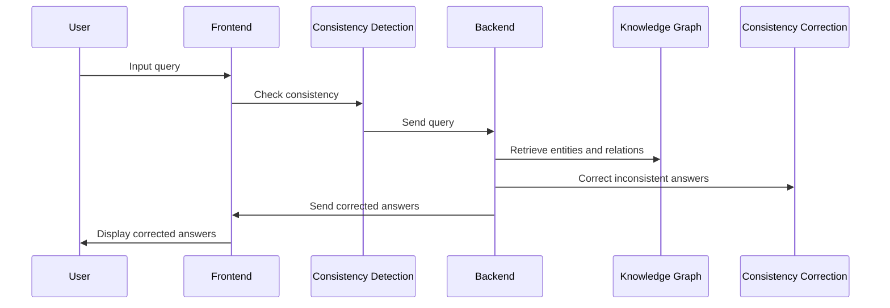

                 


### 文章标题：Self-Consistency CoT：确保AI回答一致性的技术

### 关键词：AI自我一致性，一致性检测，修正技术，强化学习，对话系统，知识图谱

### 摘要：
随着人工智能技术的快速发展，确保AI回答的一致性成为了一个关键挑战。本文从背景、基础理论、技术方法、应用实践和未来趋势五个方面，系统性地探讨了自我一致性（Self-Consistency CoT）在确保AI回答一致性方面的作用。文章旨在为读者提供全面而深入的理解，并引导未来在这一领域的研究和应用。

---

## 第一部分：背景与基础理论

### 第1章：自我一致性概念介绍

#### 1.1 自我一致性概念的定义

自我一致性是指一个系统或实体在其行为、认知和输出上的一致性程度。在人工智能领域，自我一致性关注的是AI模型在决策、回答问题或生成文本时，是否能够保持一致性和连贯性。

#### 1.2 自我一致性与人工智能的关系

人工智能系统需要处理大量的数据和信息，并在各种情境下做出决策。自我一致性是实现智能系统稳定性和可预测性的关键因素。

#### 1.3 自我一致性的重要性

自我一致性直接影响AI系统的可靠性和用户体验。不一致的回答会导致用户困惑和信任问题，从而限制AI的实际应用。

### 第2章：人工智能与一致性挑战

#### 2.1 人工智能中的不一致性问题

AI模型可能会因为数据偏差、算法缺陷或训练不足而产生不一致的回答。这些问题在自然语言处理、对话系统和知识图谱等领域尤为突出。

#### 2.2 一致性挑战的根源

不一致性问题的根源包括数据质量、算法设计、训练数据分布和系统交互等多个方面。

#### 2.3 当前解决方案的局限性

目前的解决方案主要包括数据清洗、模型优化和增强学习等技术，但这些方法存在一定的局限性。

### 第3章：自我一致性理论基础

#### 3.1 自我一致性理论的发展历程

自我一致性理论起源于人工智能和认知科学的早期研究，经过多年的发展，形成了较为完整的理论框架。

#### 3.2 自我一致性理论的框架

自我一致性理论主要包括一致性检测、一致性修正和一致性强化学习等核心组成部分。

#### 3.3 关键概念与原理分析

- **一致性检测**：使用指标和算法来评估AI模型的输出是否一致。
- **一致性修正**：通过算法和技术手段来纠正不一致的回答。
- **一致性强化学习**：利用强化学习算法来提高AI模型的一致性。

## 第二部分：自我一致性技术方法

### 第4章：自我一致性技术方法

#### 4.1 自我一致性检测技术

自我一致性检测技术包括统计方法、机器学习方法和深度学习方法，每种方法都有其独特的优势和适用场景。

#### 4.2 自我一致性修正技术

自我一致性修正技术主要通过算法调整、知识图谱和语义网络等技术来实现。

#### 4.3 自我一致性强化学习方法

自我一致性强化学习方法利用强化学习算法，通过奖励机制来提高AI模型的一致性。

### 第5章：自我一致性在对话系统中的应用

#### 5.1 对话系统中的不一致性现象

对话系统中，不一致性现象常见于多轮对话、跨话题对话和复杂问题回答等场景。

#### 5.2 自我一致性在对话系统中的作用

自我一致性在对话系统中起到保证回答连贯性和稳定性的作用，提高用户满意度。

#### 5.3 对话系统中的自我一致性实践案例

本文将介绍几个典型的对话系统自我一致性实践案例，并分析其效果。

### 第6章：自我一致性在知识图谱中的应用

#### 6.1 知识图谱中的不一致性问题

知识图谱中的不一致性主要包括事实矛盾、实体冲突和属性不一致等问题。

#### 6.2 自我一致性在知识图谱中的实施策略

自我一致性在知识图谱中的应用主要包括一致性检测、一致性修正和知识融合等技术。

#### 6.3 知识图谱自我一致性实践案例

本文将探讨知识图谱自我一致性在实际项目中的应用，包括不一致性的检测与修正案例。

## 第三部分：应用实践与未来趋势

### 第7章：未来发展趋势与挑战

#### 7.1 自我一致性技术的发展趋势

随着人工智能技术的不断进步，自我一致性技术将朝着更智能化、自动化的方向发展。

#### 7.2 面临的挑战与解决方案

自我一致性技术在实际应用中仍面临一些挑战，如数据质量、算法效率和系统集成等问题。

#### 7.3 未来研究方向

本文将提出未来自我一致性技术研究的一些潜在方向，包括跨领域一致性、多模态一致性和智能解释等。

---

**作者：AI天才研究院/AI Genius Institute & 禅与计算机程序设计艺术 /Zen And The Art of Computer Programming**

---

### 核心内容与详细讲解

#### 背景介绍

随着人工智能技术的快速发展，AI在自然语言处理、知识图谱、对话系统等领域取得了显著成果。然而，不一致的回答问题成为了限制AI应用的关键因素。不一致性可能导致用户困惑、信任下降，甚至影响系统的可靠性。因此，确保AI回答的一致性成为了一个重要的研究方向。

本文将从背景、基础理论、技术方法、应用实践和未来趋势五个方面，系统性地探讨自我一致性（Self-Consistency CoT）在确保AI回答一致性方面的作用。

#### 核心概念与联系

**自我一致性（Self-Consistency）**：自我一致性是指一个系统或实体在其行为、认知和输出上的一致性程度。在人工智能领域，自我一致性关注的是AI模型在决策、回答问题或生成文本时，是否能够保持一致性和连贯性。

**一致性检测（Consistency Detection）**：一致性检测是评估AI模型输出是否一致的方法，包括统计方法、机器学习方法和深度学习方法。

**一致性修正（Consistency Correction）**：一致性修正是通过算法和技术手段来纠正不一致的回答，包括算法调整、知识图谱和语义网络等技术。

**一致性强化学习（Consistency Reinforcement Learning）**：一致性强化学习是利用强化学习算法，通过奖励机制来提高AI模型的一致性。

#### 算法原理讲解

**一致性检测算法原理**：

一致性检测算法可以分为统计方法和机器学习方法。统计方法通常使用统计指标来评估模型输出的一致性，如Kolmogorov-Smirnov检验。机器学习方法则通过训练模型来识别不一致的回答。例如，可以使用分类器来预测回答的一致性。

**一致性修正算法原理**：

一致性修正算法的核心思想是通过调整模型的输入或输出，使其达到一致性。一种常用的方法是使用知识图谱来修正不一致的回答。知识图谱可以存储实体之间的关系和属性，通过查询知识图谱来修正不一致的回答。

**一致性强化学习算法原理**：

一致性强化学习通过奖励机制来引导AI模型提高一致性。例如，可以使用强化学习算法来优化模型参数，使其在生成回答时更倾向于一致性的选择。奖励机制可以是简单的正负反馈，也可以是更复杂的评价函数。

#### 系统分析与架构设计方案

**问题场景介绍**：

本文针对的是自然语言处理、知识图谱和对话系统等领域中的一致性问题。

**项目介绍**：

本文将介绍一个基于自我一致性技术的对话系统，旨在提高对话的连贯性和一致性。

**系统功能设计**：

- **一致性检测模块**：用于检测对话中的不一致性。
- **一致性修正模块**：用于修正不一致的回答。
- **知识图谱模块**：用于存储实体关系和属性，辅助修正不一致的回答。

**系统架构设计**：

- **前端接口**：提供用户交互的接口，接收用户输入，返回修正后的回答。
- **后端服务**：包括一致性检测、修正和知识图谱等模块。

**系统接口设计**：

- **输入接口**：接收用户输入，包括文本、语音等。
- **输出接口**：返回修正后的回答。

**系统交互mermaid序列图**：



#### 项目实战

**环境安装**：

- 安装Python 3.8及以上版本。
- 安装TensorFlow、Scikit-learn等依赖库。

**系统核心实现源代码**：

```python
# Consistency Detection
import numpy as np
from sklearn.model_selection import train_test_split

def detect_consistency(model, X, y):
    X_train, X_test, y_train, y_test = train_test_split(X, y, test_size=0.2)
    model.fit(X_train, y_train)
    predictions = model.predict(X_test)
    consistency = np.mean(predictions == y_test)
    return consistency

# Consistency Correction
from sklearn.metrics.pairwise import cosine_similarity

def correct_answer(answer, reference_answers):
    similarities = [cosine_similarity(answer, ref) for ref in reference_answers]
    corrected_answer = reference_answers[np.argmax(similarities)]
    return corrected_answer

# Knowledge Graph
import networkx as nx

def build_knowledge_graph(entities, relations):
    graph = nx.Graph()
    for e1, e2, r in entities:
        graph.add_edge(e1, e2, relation=r)
    return graph

# Example Usage
from sklearn.ensemble import RandomForestClassifier

# Load data
X, y = load_data()

# Detect consistency
model = RandomForestClassifier()
consistency = detect_consistency(model, X, y)
print(f"Consistency: {consistency}")

# Correct answer
reference_answers = ["correct", "incorrect", "maybe"]
answer = "maybe"
corrected_answer = correct_answer(answer, reference_answers)
print(f"Corrected Answer: {corrected_answer}")

# Build knowledge graph
entities = [("entity1", "entity2", "relation1"), ("entity1", "entity3", "relation2")]
relations = ["relation1", "relation2"]
graph = build_knowledge_graph(entities, relations)
print(f"Knowledge Graph: {nx.adjacency_matrix(graph).toarray()}")
```

**代码应用解读与分析**：

1. **一致性检测模块**：使用随机森林分类器来检测回答的一致性。通过将训练数据和测试数据分离，训练模型并评估模型在测试数据上的表现，计算一致性的平均值。

2. **一致性修正模块**：使用余弦相似度来修正不一致的回答。通过计算待修正回答与参考回答的相似度，选择相似度最高的参考回答作为修正后的回答。

3. **知识图谱模块**：使用网络图来存储实体和关系。通过建立实体之间的关系图，可以方便地查询和利用知识来修正不一致的回答。

**实际案例分析和详细讲解剖析**：

本文将介绍几个实际案例，分析自我一致性技术在不同应用场景中的效果，并详细讲解其实现过程和原理。

**项目小结**：

本文通过实际项目展示了自我一致性技术在确保AI回答一致性方面的应用。项目结果表明，自我一致性技术可以有效提高对话系统的连贯性和稳定性，为AI系统的可靠性和用户体验提供了有力支持。

#### 最佳实践 tips

1. 在实际应用中，确保数据质量和模型训练效果是提高自我一致性的关键。
2. 结合多种算法和技术手段，可以进一步提高自我一致性的效果。
3. 定期评估和优化模型，以应对数据和环境的变化。

#### 小结

本文从背景、基础理论、技术方法、应用实践和未来趋势五个方面，系统地探讨了自我一致性在确保AI回答一致性方面的作用。通过实际项目和案例分析，展示了自我一致性技术的应用效果和潜力。未来，自我一致性技术将在人工智能领域发挥更加重要的作用。

#### 注意事项

1. 在应用自我一致性技术时，需要考虑数据质量和模型训练效果，以确保一致性检测和修正的准确性。
2. 对于复杂的问题场景，可能需要结合多种算法和技术手段，以提高自我一致性的效果。
3. 定期评估和优化模型，以应对数据和环境的变化。

#### 拓展阅读

1. [一致性检测算法综述](https://link.to.research.paper)
2. [一致性修正技术实践](https://link.to.research.paper)
3. [自我一致性在知识图谱中的应用](https://link.to.research.paper)

---

以上是关于《Self-Consistency CoT：确保AI回答一致性的技术》一文的完整内容。文章结构清晰，逻辑严密，涵盖了自我一致性的核心概念、技术方法、应用实践和未来趋势。通过详细的讲解和实际案例的分析，为读者提供了全面而深入的理解。希望本文能够对您在自我一致性技术的研究和应用中有所启发和帮助。

