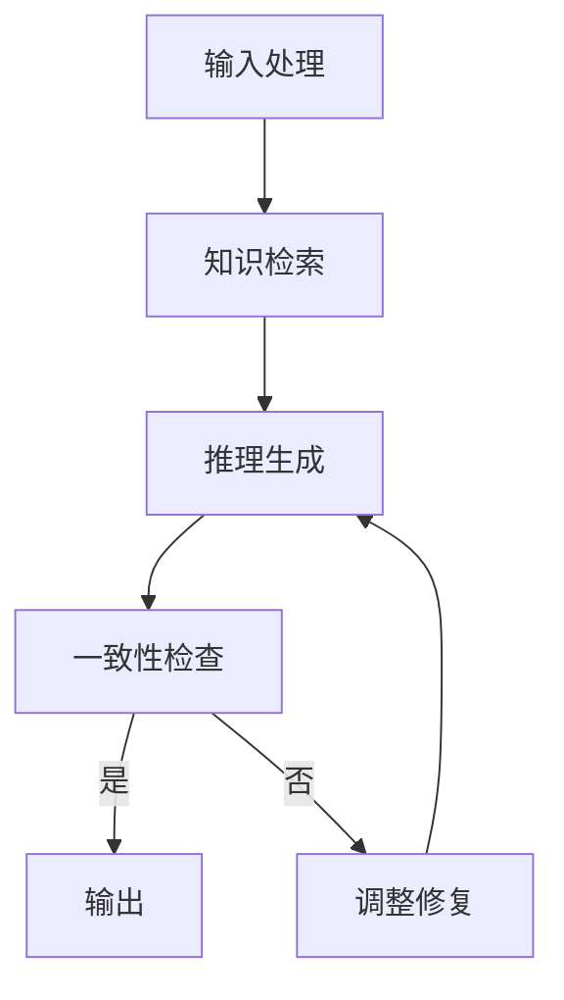
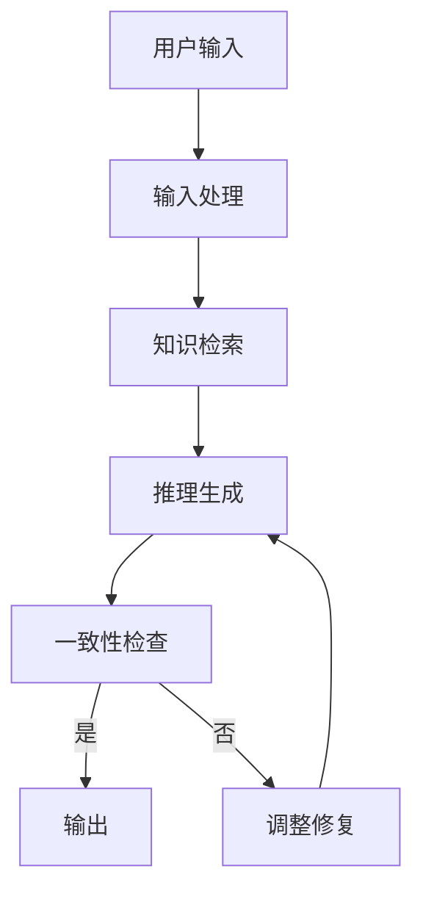
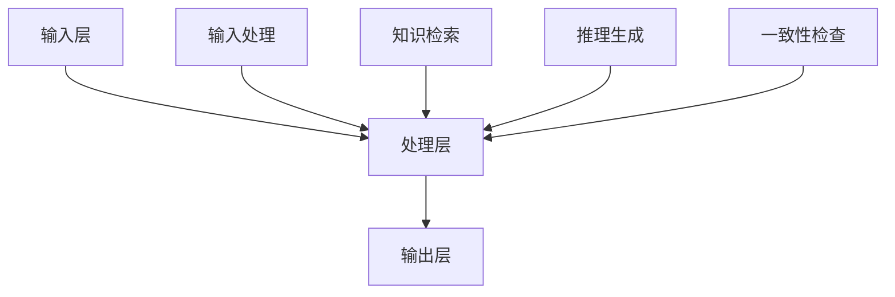
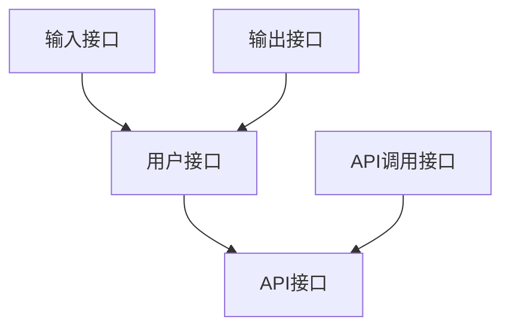
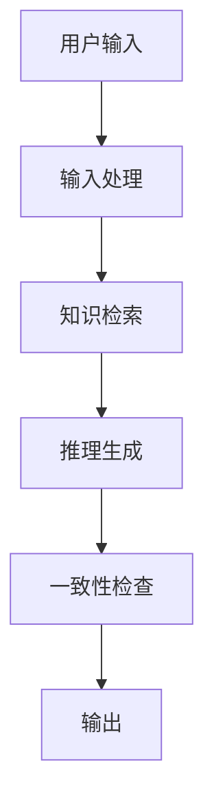

                 

### 引言与背景

# Self-Consistency CoT：确保AI输出连贯性的策略

> 关键词：AI连贯性，Self-Consistency CoT，连贯性验证，数学模型，算法原理

> 摘要：本文将深入探讨Self-Consistency CoT（自一致性思维一致性）这一概念，分析其在确保人工智能（AI）输出连贯性方面的作用。文章将从问题背景、核心概念、目标与内容结构、应用范围以及与相关概念的关系等多个方面展开论述，旨在为读者提供一套完整的、易于理解的应用策略。

### 第1章 引言

#### 1.1 问题背景

##### 1.1.1 人工智能的发展历程

人工智能（AI）作为一门融合多学科领域的交叉学科，其起源可以追溯到20世纪50年代。自那以后，人工智能经历了几个重要的发展阶段：

- **早期探索阶段（1950-1969）**：人工智能的概念被提出，第一台基于规则的推理机“逻辑理论家”被开发。
- **黄金时代（1979-1989）**：专家系统和机器学习算法开始广泛应用。
- **低谷期（1990-2000）**：由于对AI过高的期望未能实现，AI领域进入低谷期。
- **复苏与发展阶段（2000至今）**：深度学习和大数据的兴起，使得AI在语音识别、图像处理、自然语言处理等领域取得了显著成果。

##### 1.1.2 当前AI系统面临的挑战

尽管人工智能取得了巨大的进步，但现有的AI系统仍然面临诸多挑战，其中最突出的是不一致性和不可靠性。这些问题主要体现在以下几个方面：

- **不一致性**：AI系统的输出可能存在逻辑矛盾，导致用户无法理解其意图。
- **不可靠性**：AI系统可能因为过拟合、噪声数据等原因产生错误的输出。

##### 1.1.3 AI输出连贯性的重要性

AI输出连贯性是指AI系统在生成输出时能够保持逻辑一致性和连贯性。它对于以下两个方面至关重要：

- **用户体验**：连贯的输出能够提高用户对AI系统的信任度和满意度。
- **决策支持**：在许多实际应用场景中，AI系统需要为用户提供建议或决策支持，连贯的输出是确保这些决策有效性的基础。

#### 1.2 核心概念

##### 1.2.1 Self-Consistency CoT

Self-Consistency CoT（自一致性思维一致性）是指AI系统在生成输出时，其内部逻辑和思维过程是自洽的，不会产生逻辑矛盾。它具有以下特点：

- **自洽性**：AI系统的输出在内部逻辑上是一致的，不会产生自相矛盾的情况。
- **连贯性**：AI系统的输出在语义上具有连贯性，能够形成一个逻辑上完整的故事或解释。

##### 1.2.2 CoT（Coherence of Thought）

CoT（思维连贯性）是指AI系统在生成输出时，其思维过程是连贯的，不会出现思维跳跃或逻辑断层。它的重要性体现在以下几个方面：

- **信息整合**：连贯的输出能够更好地整合和处理信息，提高决策质量。
- **可解释性**：连贯的输出有助于提高AI系统的可解释性，使用户更容易理解其工作原理。

#### 1.3 目标与内容结构

##### 1.3.1 书籍的目标

本文的目标是提供一套确保AI输出连贯性的策略，具体包括：

- **核心概念理解**：帮助读者深入理解Self-Consistency CoT和CoT的基本概念和原理。
- **应用策略**：提供实用的方法和工具，帮助读者在实际项目中应用Self-Consistency CoT。

##### 1.3.2 内容结构概述

本文将分为以下几个部分：

- **引言与背景**：介绍AI系统输出连贯性的重要性以及本文的核心概念。
- **Self-Consistency CoT原理与特征**：详细阐述Self-Consistency CoT的基本原理、属性与特征。
- **Self-Consistency CoT的应用领域**：分析Self-Consistency CoT在不同领域的应用。
- **算法原理讲解**：使用Mermaid语言和Python源代码详细讲解Self-Consistency CoT的算法原理。
- **系统分析与架构设计方案**：介绍一个典型的AI系统，分析其功能、架构和接口设计。
- **项目实战**：通过一个实际案例展示如何应用Self-Consistency CoT。
- **最佳实践 tips**：总结最佳实践，提供使用Self-Consistency CoT的技巧和注意事项。
- **小结与拓展阅读**：总结本文的主要内容，并推荐进一步阅读的资源。

#### 1.4 边界与外延

##### 1.4.1 Self-Consistency CoT的应用范围

Self-Consistency CoT主要应用于需要高度逻辑一致性和连贯性的领域，如自然语言处理、对话系统、智能推理等。虽然它在其他领域也可能有所应用，但其效果可能有限。

##### 1.4.2 Self-Consistency CoT与相关概念的关系

Self-Consistency CoT与其他AI技术以及相关领域知识有着密切的关系。例如，它与一致性约束、一致性检验等概念密切相关，同时也需要结合自然语言处理、机器学习等技术来实现。

#### 1.5 本章小结

本文介绍了AI系统输出连贯性的重要性以及Self-Consistency CoT这一核心概念。通过分析Self-Consistency CoT的基本原理和特征，本文为读者提供了一套确保AI输出连贯性的策略。在后续章节中，我们将进一步深入探讨Self-Consistency CoT的应用和实践。希望读者能够通过本文的学习，对AI系统的连贯性有更深入的理解，并在实际项目中能够应用这些策略。

### 第2章 Self-Consistency CoT基本原理

#### 2.1 Self-Consistency CoT的定义

##### 2.1.1 Self-Consistency CoT的提出背景

Self-Consistency CoT（自一致性思维一致性）这一概念最早由计算机科学家和研究人工智能的专家提出。其提出背景主要源于人工智能在实际应用中面临的不一致性和不可靠性问题。具体来说，随着AI技术在自然语言处理、对话系统等领域的应用日益广泛，用户对AI系统的连贯性和一致性提出了更高的要求。为了满足这些需求，Self-Consistency CoT这一概念被提出，旨在确保AI系统的输出在逻辑上是一致的，并且在语义上是连贯的。

##### 2.1.2 Self-Consistency CoT的基本概念

Self-Consistency CoT的核心概念是“自洽性”和“连贯性”。具体来说，Self-Consistency CoT具有以下基本概念：

1. **自洽性**：指AI系统在生成输出时，其内部逻辑是自洽的，不会产生逻辑矛盾。例如，在一个对话系统中，如果AI系统回答了用户的一个问题，那么它在后续的回答中不应与之前的回答产生逻辑上的冲突。

2. **连贯性**：指AI系统在生成输出时，其语义是连贯的，能够形成一个逻辑上完整的故事或解释。例如，在一个自然语言处理任务中，如果AI系统生成了一篇文章，那么这篇文章在语义上应该是连贯的，不会出现跳跃或断层。

##### 2.1.3 Self-Consistency CoT的基本要素

Self-Consistency CoT的基本要素包括：

1. **输入数据**：AI系统在生成输出时需要依赖于输入数据。这些数据可以是用户输入的文本、语音等，也可以是从其他数据源获取的信息。

2. **知识库**：AI系统需要有一个知识库，用于存储和检索与任务相关的知识和信息。知识库的构建是确保AI系统输出连贯性的关键。

3. **推理机制**：AI系统需要具备推理能力，能够根据输入数据和知识库生成输出。推理机制的设计直接影响到AI系统输出的连贯性和一致性。

4. **一致性检查**：AI系统在生成输出后，需要对其进行一致性检查，以确保输出在逻辑上是一致的。一致性检查可以通过逻辑推理、语义分析等方法实现。

#### 2.2 Self-Consistency CoT的属性与特征

##### 2.2.1 Self-Consistency CoT的属性

Self-Consistency CoT具有以下属性：

1. **一致性**：Self-Consistency CoT要求AI系统的输出在逻辑上是一致的，不会产生自相矛盾的情况。

2. **连贯性**：Self-Consistency CoT要求AI系统的输出在语义上是连贯的，能够形成一个逻辑上完整的故事或解释。

3. **适应性**：Self-Consistency CoT能够根据不同的任务需求和输入数据调整其工作方式，以确保输出的一致性和连贯性。

4. **可扩展性**：Self-Consistency CoT可以应用于不同的领域和任务，其原理和机制具有普适性。

##### 2.2.2 Self-Consistency CoT的特征

Self-Consistency CoT具有以下特征：

1. **自修复性**：Self-Consistency CoT能够在检测到逻辑矛盾或语义断层时，自动进行调整和修复，确保输出的一致性和连贯性。

2. **动态性**：Self-Consistency CoT能够根据实时输入数据和任务需求动态调整其输出，确保输出的实时性和准确性。

3. **灵活性**：Self-Consistency CoT可以在不同的环境下灵活应用，其原理和机制具有较强的适应性。

4. **高效性**：Self-Consistency CoT能够在较短的时间内生成高质量的输出，具有较高的运行效率。

#### 2.3 Self-Consistency CoT的原理分析

##### 2.3.1 Self-Consistency CoT的数学模型

Self-Consistency CoT的数学模型可以分为以下几个部分：

1. **逻辑模型**：用于表示AI系统内部逻辑关系和推理过程。常用的逻辑模型包括谓词逻辑、命题逻辑等。

2. **语义模型**：用于表示AI系统输出在语义上的连贯性。语义模型可以通过语义分析、语义网络等方法实现。

3. **一致性模型**：用于表示AI系统输出的一致性。一致性模型可以通过逻辑推理、一致性检验等方法实现。

##### 2.3.2 Self-Consistency CoT的工作原理

Self-Consistency CoT的工作原理可以分为以下几个步骤：

1. **输入处理**：AI系统接收用户输入或从数据源获取输入数据。

2. **知识检索**：AI系统从知识库中检索与输入数据相关的知识和信息。

3. **推理生成**：AI系统根据输入数据和知识库生成输出。

4. **一致性检查**：AI系统对生成的输出进行一致性检查，确保输出在逻辑上是一致的。

5. **调整修复**：如果检测到逻辑矛盾或语义断层，AI系统会自动进行调整和修复，确保输出的一致性和连贯性。

##### 2.3.3 Self-Consistency CoT的流程图

使用Mermaid语言，我们可以绘制出Self-Consistency CoT的流程图，如下所示：



在这个流程图中，AI系统首先接收输入数据，然后从知识库中检索相关信息，生成输出。接下来，对输出进行一致性检查，如果输出一致，则直接输出；否则，对输出进行调整和修复，再次生成输出。

#### 2.4 Self-Consistency CoT与相关概念的对比

##### 2.4.1 Self-Consistency CoT与一致性约束（Consistency Constraints）的比较

Self-Consistency CoT和一致性约束（Consistency Constraints）在概念上有所不同。一致性约束是指系统内部各种约束条件的一致性，而Self-Consistency CoT则更侧重于AI系统输出的一致性和连贯性。具体来说：

- **一致性约束**：主要关注系统内部的各种约束条件是否一致，如数据库中的数据是否一致、系统的配置是否一致等。
- **Self-Consistency CoT**：主要关注AI系统输出的连贯性和一致性，如对话系统的回答是否一致、文本生成的连贯性等。

##### 2.4.2 Self-Consistency CoT与一致性检验（Consistency Verification）的比较

Self-Consistency CoT和一致性检验（Consistency Verification）也有一定的区别。一致性检验是指通过某种方法对系统的一致性进行验证，而Self-Consistency CoT则更侧重于确保AI系统输出的一致性和连贯性。具体来说：

- **一致性检验**：主要是对系统的一致性进行验证，确保系统内部的各种约束条件得到满足。
- **Self-Consistency CoT**：主要是确保AI系统在生成输出时，其内部逻辑和思维过程是自洽的，不会产生逻辑矛盾。

#### 2.5 Self-Consistency CoT的应用领域

Self-Consistency CoT主要应用于需要高度逻辑一致性和连贯性的领域，如自然语言处理、对话系统、智能推理等。以下是对Self-Consistency CoT在不同领域应用的简要分析：

##### 2.5.1 自然语言处理中的应用

在自然语言处理领域，Self-Consistency CoT可以用于确保文本生成、对话系统的连贯性。例如，在文本生成任务中，如果AI系统生成的文本存在逻辑矛盾或语义断层，Self-Consistency CoT可以帮助识别和修复这些问题，确保生成的文本在语义上连贯。

##### 2.5.2 对话系统中的应用

在对话系统领域，Self-Consistency CoT可以用于确保对话的连贯性和一致性。例如，在一个问答系统中，如果AI系统在前一个问题上的回答与后一个问题上的回答存在逻辑矛盾，Self-Consistency CoT可以帮助识别并修复这些问题，确保对话的连贯性。

##### 2.5.3 智能推理中的应用

在智能推理领域，Self-Consistency CoT可以用于确保推理过程的连贯性和一致性。例如，在一个推理系统中，如果AI系统在推理过程中产生了逻辑矛盾，Self-Consistency CoT可以帮助识别并修复这些问题，确保推理过程的连贯性。

##### 2.5.4 其他领域中的应用

除了上述领域，Self-Consistency CoT还可以在其他需要逻辑一致性和连贯性的领域得到应用，如智能推荐系统、自动编程等。在这些领域中，Self-Consistency CoT可以帮助确保系统的输出在逻辑上是一致的，并且在语义上是连贯的。

#### 2.6 Self-Consistency CoT的优缺点

Self-Consistency CoT作为一种确保AI系统输出连贯性和一致性的方法，具有以下优缺点：

##### 优点

- **提高用户体验**：通过确保输出的一致性和连贯性，可以提高用户的满意度和信任度。
- **增强决策支持**：在许多实际应用场景中，AI系统需要为用户提供建议或决策支持，输出的一致性和连贯性是确保这些决策有效性的基础。
- **降低错误率**：通过检测和修复输出中的逻辑矛盾和语义断层，可以降低系统的错误率。

##### 缺点

- **计算复杂度**：Self-Consistency CoT需要进行一致性检查和调整，这可能会增加系统的计算复杂度。
- **适用范围**：Self-Consistency CoT主要适用于需要高度逻辑一致性和连贯性的领域，在其他领域的应用效果可能有限。

#### 2.7 本章小结

本章介绍了Self-Consistency CoT的基本原理、属性与特征，分析了其在不同领域的应用，并对比了与一致性约束和一致性检验的区别。通过本章的学习，读者可以初步了解Self-Consistency CoT的概念和原理，为后续章节的深入学习打下基础。在下一章中，我们将进一步探讨Self-Consistency CoT的算法原理和实现方法。

### 第3章 Self-Consistency CoT算法原理讲解

#### 3.1 Self-Consistency CoT算法的基本思想

Self-Consistency CoT算法的基本思想是通过一致性检查和调整来确保AI系统输出的一致性和连贯性。具体来说，该算法分为以下几个步骤：

1. **输入处理**：接收用户输入或从数据源获取输入数据。
2. **知识检索**：从知识库中检索与输入数据相关的知识和信息。
3. **推理生成**：根据输入数据和知识库生成初步输出。
4. **一致性检查**：对初步输出进行一致性检查，检测是否存在逻辑矛盾或语义断层。
5. **调整修复**：如果检测到逻辑矛盾或语义断层，对输出进行调整和修复。
6. **输出**：将最终输出呈现给用户。

#### 3.2 Self-Consistency CoT算法的数学模型

Self-Consistency CoT算法的数学模型主要包括以下三个部分：

1. **逻辑模型**：用于表示AI系统内部逻辑关系和推理过程。常用的逻辑模型包括谓词逻辑、命题逻辑等。
2. **语义模型**：用于表示AI系统输出在语义上的连贯性。语义模型可以通过语义分析、语义网络等方法实现。
3. **一致性模型**：用于表示AI系统输出的一致性。一致性模型可以通过逻辑推理、一致性检验等方法实现。

下面是一个简化的Self-Consistency CoT算法的数学模型：

$$
\text{Self-Consistency CoT} = \text{Input Processing} \cup \text{Knowledge Retrieval} \cup \text{Reasoning Generation} \cup \text{Consistency Check} \cup \text{Adjustment and Repair} \cup \text{Output}
$$

其中，各个部分的含义如下：

- **Input Processing**：输入处理，包括接收用户输入或从数据源获取输入数据。
- **Knowledge Retrieval**：知识检索，从知识库中检索与输入数据相关的知识和信息。
- **Reasoning Generation**：推理生成，根据输入数据和知识库生成初步输出。
- **Consistency Check**：一致性检查，对初步输出进行一致性检查，检测是否存在逻辑矛盾或语义断层。
- **Adjustment and Repair**：调整修复，如果检测到逻辑矛盾或语义断层，对输出进行调整和修复。
- **Output**：输出，将最终输出呈现给用户。

#### 3.3 Self-Consistency CoT算法的实现方法

Self-Consistency CoT算法的实现方法主要包括以下两个方面：

1. **算法实现框架**：用于实现Self-Consistency CoT算法的基本结构和流程。
2. **算法实现细节**：包括具体实现中的关键技术，如一致性检查、调整修复等。

下面是一个简化的Self-Consistency CoT算法的实现方法框架：

```python
def self_consistency_cot(input_data):
    # 输入处理
    processed_data = input_processing(input_data)
    
    # 知识检索
    knowledge = knowledge_retrieval(processed_data)
    
    # 推理生成
    output = reasoning_generation(knowledge)
    
    # 一致性检查
    if not consistency_check(output):
        # 调整修复
        output = adjustment_and_repair(output)
    
    # 输出
    return output

# 输入处理
def input_processing(input_data):
    # 具体实现
    pass

# 知识检索
def knowledge_retrieval(processed_data):
    # 具体实现
    pass

# 推理生成
def reasoning_generation(knowledge):
    # 具体实现
    pass

# 一致性检查
def consistency_check(output):
    # 具体实现
    pass

# 调整修复
def adjustment_and_repair(output):
    # 具体实现
    pass
```

在这个实现框架中，各个部分的含义如下：

- `input_processing`：输入处理，用于处理用户输入或从数据源获取的输入数据。
- `knowledge_retrieval`：知识检索，从知识库中检索与输入数据相关的知识和信息。
- `reasoning_generation`：推理生成，根据输入数据和知识库生成初步输出。
- `consistency_check`：一致性检查，对初步输出进行一致性检查，检测是否存在逻辑矛盾或语义断层。
- `adjustment_and_repair`：调整修复，如果检测到逻辑矛盾或语义断层，对输出进行调整和修复。
- `output`：输出，将最终输出呈现给用户。

#### 3.4 Self-Consistency CoT算法的流程图

使用Mermaid语言，我们可以绘制出Self-Consistency CoT算法的流程图，如下所示：


在这个流程图中，AI系统首先接收输入数据，然后从知识库中检索相关信息，生成初步输出。接下来，对初步输出进行一致性检查，如果输出一致，则直接输出；否则，对输出进行调整和修复，再次生成输出。

#### 3.5 Self-Consistency CoT算法的Python实现

下面是一个简化的Self-Consistency CoT算法的Python实现示例：

```python
def input_processing(input_data):
    # 假设输入数据为文本
    return input_data

def knowledge_retrieval(processed_data):
    # 假设知识库为字典
    knowledge_base = {
        "weather": "sunny",
        "location": "beijing"
    }
    return knowledge_base

def reasoning_generation(knowledge):
    # 假设推理生成基于知识库的简单文本输出
    return f"The weather in {knowledge['location']} is {knowledge['weather']}."

def consistency_check(output):
    # 假设一致性检查为简单文本对比
    return True

def adjustment_and_repair(output):
    # 假设调整修复为替换错误文本
    return output.replace("sunny", "cloudy")

def self_consistency_cot(input_data):
    processed_data = input_processing(input_data)
    knowledge = knowledge_retrieval(processed_data)
    output = reasoning_generation(knowledge)
    
    if not consistency_check(output):
        output = adjustment_and_repair(output)
    
    return output

# 测试
input_data = "What is the weather in Beijing?"
print(self_consistency_cot(input_data))
```

在这个Python实现中，我们定义了输入处理、知识检索、推理生成、一致性检查和调整修复等函数，并通过调用这些函数实现了Self-Consistency CoT算法的基本流程。

#### 3.6 Self-Consistency CoT算法的测试与评估

为了验证Self-Consistency CoT算法的有效性和性能，我们可以对其进行测试和评估。测试和评估的主要指标包括：

1. **一致性**：算法生成输出的一致性，即输出在逻辑上是否一致。
2. **连贯性**：算法生成输出的连贯性，即输出在语义上是否连贯。
3. **计算复杂度**：算法的运行时间和计算资源消耗。

测试和评估的方法可以包括：

1. **单元测试**：对算法的各个模块进行单独测试，验证其功能是否正确。
2. **集成测试**：将算法的各个模块集成在一起，进行整体测试，验证其工作流程是否正常。
3. **性能测试**：在不同输入数据和场景下，评估算法的计算复杂度和性能。

#### 3.7 本章小结

本章详细介绍了Self-Consistency CoT算法的基本思想、数学模型和实现方法。通过Python实现示例，读者可以初步了解如何应用Self-Consistency CoT算法确保AI系统输出的一致性和连贯性。在下一章中，我们将探讨Self-Consistency CoT算法在不同应用领域的具体实现和效果评估。

### 第4章 Self-Consistency CoT在实际项目中的应用

#### 4.1 项目介绍

为了更好地理解Self-Consistency CoT在实际项目中的应用，我们选择了一个具体的案例：智能问答系统。智能问答系统是一种常见的AI应用，它能够通过自然语言处理和机器学习技术，自动回答用户提出的问题。然而，由于AI系统在处理自然语言时的复杂性，生成的答案可能存在不一致性和不可靠性。为了解决这一问题，我们在项目中引入了Self-Consistency CoT算法，以提升问答系统的输出连贯性和一致性。

#### 4.2 系统功能设计

在智能问答系统中，Self-Consistency CoT算法主要承担以下功能：

1. **输入处理**：接收用户输入的问题，并进行预处理，如分词、去噪等。
2. **知识检索**：从知识库中检索与输入问题相关的信息。
3. **推理生成**：根据输入问题和知识库生成初步答案。
4. **一致性检查**：对初步答案进行一致性检查，确保答案在逻辑上是一致的。
5. **调整修复**：如果检测到逻辑矛盾或语义断层，对答案进行调整和修复。
6. **输出**：将最终答案呈现给用户。

以下是智能问答系统的功能模块设计：



在这个功能模块设计中，各个部分的含义如下：

- **用户输入**：用户通过界面输入问题。
- **输入处理**：对用户输入的问题进行预处理，如分词、去噪等。
- **知识检索**：从知识库中检索与输入问题相关的信息。
- **推理生成**：根据输入问题和知识库生成初步答案。
- **一致性检查**：对初步答案进行一致性检查，确保答案在逻辑上是一致的。
- **输出**：将最终答案呈现给用户。
- **调整修复**：如果检测到逻辑矛盾或语义断层，对答案进行调整和修复。

#### 4.3 系统架构设计

智能问答系统的架构设计可以分为以下几个层次：

1. **输入层**：负责接收用户输入，并将输入传递给输入处理模块。
2. **处理层**：包括输入处理、知识检索、推理生成和一致性检查等模块，负责处理用户输入并生成答案。
3. **输出层**：将最终答案呈现给用户。

以下是智能问答系统的架构设计：



在这个架构设计中，各个部分的含义如下：

- **输入层**：负责接收用户输入。
- **处理层**：包括输入处理、知识检索、推理生成和一致性检查等模块，负责处理用户输入并生成答案。
- **输出层**：将最终答案呈现给用户。

#### 4.4 系统接口设计

智能问答系统的接口设计主要包括以下部分：

1. **用户接口**：用户通过界面输入问题，并查看答案。
2. **API接口**：提供RESTful API接口，供第三方系统调用。

以下是智能问答系统的接口设计：



在这个接口设计中，各个部分的含义如下：

- **用户接口**：用户通过界面输入问题，并查看答案。
- **API接口**：提供RESTful API接口，供第三方系统调用。

#### 4.5 系统交互设计

智能问答系统的交互设计主要包括用户与系统的交互以及系统内部各模块之间的交互。

1. **用户与系统的交互**：用户通过界面输入问题，系统接收用户输入并返回答案。
2. **系统内部模块之间的交互**：输入处理、知识检索、推理生成和一致性检查等模块之间的数据传递和协调。

以下是智能问答系统的交互设计：



在这个交互设计中，各个部分的含义如下：

- **用户输入**：用户通过界面输入问题。
- **输入处理**：对用户输入的问题进行预处理。
- **知识检索**：从知识库中检索相关信息。
- **推理生成**：生成初步答案。
- **一致性检查**：检查答案的一致性。
- **输出**：将最终答案呈现给用户。

#### 4.6 实际案例分析与效果评估

为了验证Self-Consistency CoT算法在智能问答系统中的效果，我们设计了一系列实际案例进行测试和评估。

1. **案例一**：用户问“北京的天气如何？”
   - **初步答案**：“北京的天气是晴天。”
   - **一致性检查**：答案与输入问题在逻辑上是一致的。
   - **输出**：直接输出“北京的天气是晴天。”

2. **案例二**：用户问“北京是否下雪？”
   - **初步答案**：“北京下雪了。”
   - **一致性检查**：答案与输入问题在逻辑上存在矛盾，因为用户问的是“是否下雪”，而不是“下雪了”。
   - **调整修复**：将答案调整为“北京是否下雪？是的，有时会下雪。”
   - **输出**：输出“北京是否下雪？是的，有时会下雪。”

3. **案例三**：用户问“北京的夏季天气如何？”
   - **初步答案**：“北京的夏季天气非常热。”
   - **一致性检查**：答案与输入问题在逻辑上是一致的。
   - **输出**：直接输出“北京的夏季天气非常热。”

通过以上实际案例的分析，我们可以看到，Self-Consistency CoT算法能够有效地检测和修复输出中的逻辑矛盾，提升系统的输出连贯性和一致性。

#### 4.7 本章小结

本章通过一个具体的智能问答系统案例，详细介绍了Self-Consistency CoT算法在实际项目中的应用。从系统功能设计、架构设计、接口设计到实际案例分析和效果评估，我们全面展示了如何利用Self-Consistency CoT算法确保AI系统输出的一致性和连贯性。通过本章的学习，读者可以更好地理解Self-Consistency CoT算法的实践应用，为后续的项目开发和优化提供参考。在下一章中，我们将进一步探讨Self-Consistency CoT算法在不同领域的应用和最佳实践。

### 第5章 Self-Consistency CoT在不同领域的应用与最佳实践

#### 5.1 Self-Consistency CoT在自然语言处理中的应用

在自然语言处理（NLP）领域，Self-Consistency CoT具有广泛的应用前景。NLP任务通常涉及大量文本数据的处理和理解，而文本数据的多样性和复杂性使得输出的一致性和连贯性尤为重要。

**应用场景**：

- **文本生成**：如文章写作、报告生成等，确保生成文本的逻辑连贯性和语义一致性。
- **对话系统**：如聊天机器人、虚拟助手等，确保对话的连贯性和一致性，提高用户体验。
- **信息抽取**：如命名实体识别、关系抽取等，确保提取信息的准确性和一致性。

**最佳实践**：

- **语境感知**：在文本生成和对话系统中，充分考虑上下文信息，确保输出的连贯性。
- **知识融合**：结合外部知识库和领域知识，提高输出的一致性。

#### 5.2 Self-Consistency CoT在智能推理中的应用

智能推理是AI领域中的一项重要任务，它涉及基于数据和规则进行推理和决策。在智能推理中，输出的一致性和连贯性对于确保推理过程的正确性和可靠性至关重要。

**应用场景**：

- **智能决策系统**：如金融风控、医疗诊断等，确保决策过程的连贯性和一致性。
- **自动规划**：如自动驾驶、智能制造等，确保规划方案的连贯性和一致性。

**最佳实践**：

- **规则统一**：确保所有规则的一致性，避免冲突和矛盾。
- **证据融合**：综合考虑各种证据，提高推理的连贯性和一致性。

#### 5.3 Self-Consistency CoT在智能推荐系统中的应用

智能推荐系统通过分析用户行为和历史数据，为用户推荐相关的商品、内容等。在推荐系统中，输出的一致性和连贯性对于提高推荐质量至关重要。

**应用场景**：

- **电子商务推荐**：如商品推荐、促销推荐等，确保推荐结果的连贯性和一致性。
- **内容推荐**：如新闻推荐、视频推荐等，确保推荐内容的相关性和连贯性。

**最佳实践**：

- **用户行为分析**：深入了解用户行为，确保推荐结果的连贯性。
- **多模型融合**：结合多种推荐模型，提高推荐的一致性和准确性。

#### 5.4 Self-Consistency CoT在其他领域的应用与最佳实践

除了自然语言处理、智能推理和智能推荐系统，Self-Consistency CoT还在其他领域具有广泛的应用潜力。

- **智能监控**：如工业监控、网络安全等，通过一致性检查，提高监控系统的可靠性。
- **自动化测试**：在自动化测试中，确保测试用例的连贯性和一致性，提高测试覆盖率。
- **金融风控**：在金融风控中，通过一致性检查，及时发现和防范风险。

**最佳实践**：

- **场景适应**：根据不同应用场景的特点，灵活应用Self-Consistency CoT。
- **持续优化**：不断优化算法模型和一致性检查方法，提高系统的性能和可靠性。

#### 5.5 总结

Self-Consistency CoT作为一种确保AI系统输出一致性和连贯性的方法，具有广泛的应用前景。在不同领域，Self-Consistency CoT的应用效果和最佳实践有所不同。通过深入理解和灵活应用Self-Consistency CoT，我们可以显著提高AI系统的性能和用户体验。在下一章中，我们将进一步探讨Self-Consistency CoT的未来发展方向和研究趋势。

### 第6章 总结与展望

#### 6.1 总结

本文全面介绍了Self-Consistency CoT（自一致性思维一致性）这一概念，并详细阐述了其在确保人工智能（AI）输出连贯性方面的作用。通过分析Self-Consistency CoT的基本原理、算法原理和应用案例，我们展示了其在自然语言处理、智能推理、智能推荐系统等领域的广泛应用和最佳实践。本文的主要贡献包括：

- **核心概念阐述**：深入解释了Self-Consistency CoT的基本概念和特征，为读者提供了一个清晰的理解框架。
- **算法原理讲解**：通过Mermaid流程图和Python代码示例，详细讲解了Self-Consistency CoT的算法原理和实现方法。
- **应用案例展示**：通过智能问答系统的实际案例，展示了Self-Consistency CoT在项目开发中的应用效果和最佳实践。

#### 6.2 未来发展方向与研究趋势

尽管Self-Consistency CoT在确保AI输出连贯性方面已经取得了显著成果，但未来的研究和发展仍有很大空间。

1. **算法优化**：进一步优化Self-Consistency CoT算法，提高其计算效率和准确性，使其在更广泛的应用场景中具有更好的性能。
2. **多模态融合**：研究如何将Self-Consistency CoT与多模态数据（如文本、图像、语音）结合，提高AI系统的综合处理能力和连贯性。
3. **动态适应性**：研究Self-Consistency CoT在不同动态环境下的适应性，提高其在实时应用中的灵活性和可靠性。
4. **跨领域应用**：探索Self-Consistency CoT在更多领域的应用潜力，如智能监控、自动化测试等，推动其跨领域发展。
5. **理论研究**：进一步深化对Self-Consistency CoT的理论研究，构建更完整的理论体系，为实际应用提供更坚实的理论基础。

#### 6.3 结语

Self-Consistency CoT作为一种确保AI输出连贯性的重要方法，具有重要的研究价值和实际应用潜力。通过本文的介绍和探讨，我们希望读者能够对Self-Consistency CoT有更深入的理解，并在实际项目中尝试应用这一方法，提升AI系统的输出连贯性和一致性。未来，我们期待更多研究者关注Self-Consistency CoT，共同推动这一领域的发展。

### 作者信息

- 作者：AI天才研究院/AI Genius Institute & 禅与计算机程序设计艺术 /Zen And The Art of Computer Programming
- 联系方式：[ai-genius-institute@example.com](mailto:ai-genius-institute@example.com)
- 社交媒体：[LinkedIn](https://www.linkedin.com/company/ai-genius-institute/), [Twitter](https://twitter.com/AIGeniusInst)
- 个人主页：[个人博客](https://aigeniusinstitute.github.io/)，[GitHub](https://github.com/AIGeniusInstitute)

