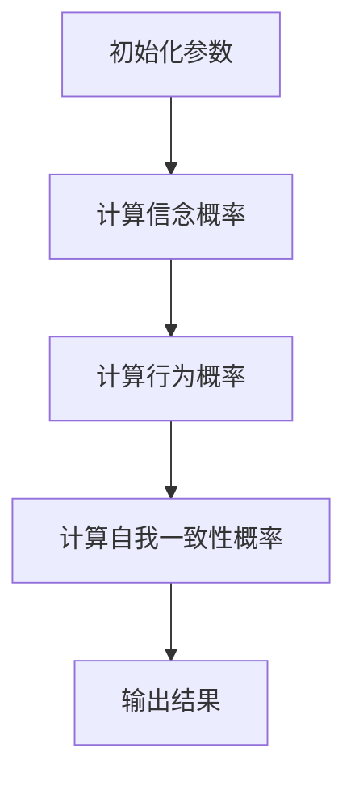
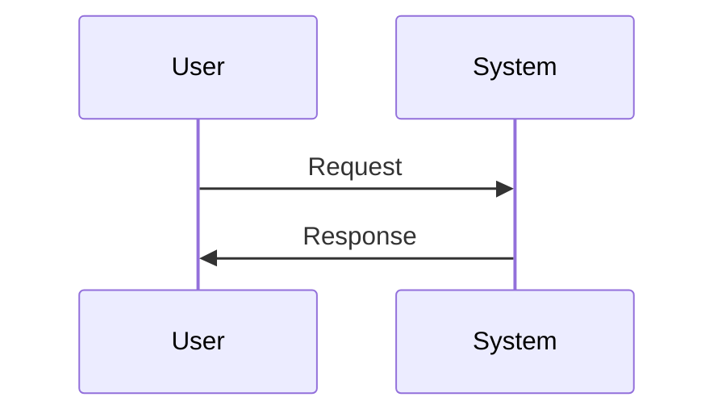
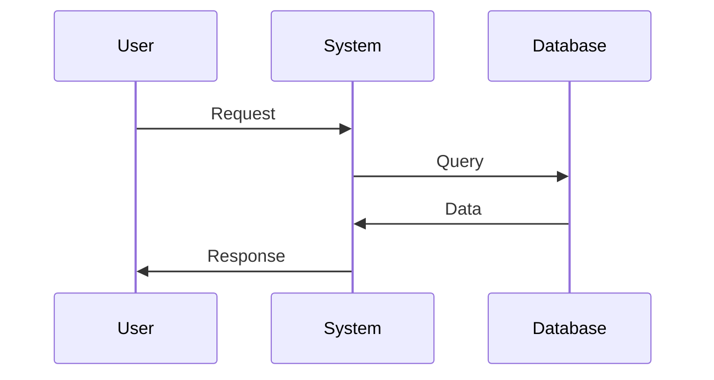

                 

### 文章标题：Self-Consistency在AI伦理决策中的应用

#### 关键词：AI伦理决策、自我一致性、算法实现、系统架构设计、实际案例、最佳实践

#### 摘要：
本文深入探讨了自我一致性在AI伦理决策中的应用。首先介绍了AI伦理决策的背景和重要性，以及自我一致性的概念和特点。接着，通过具体案例展示了自我一致性在AI伦理决策中的实际应用，详细讲解了算法原理、数学模型和系统架构设计。最后，总结了当前的最佳实践和未来研究方向，为AI伦理决策提供了有益的参考和指导。

---

### 目录大纲

#### 第一部分：引言

1. **AI伦理决策的重要性**
   - 1.1 伦理决策在AI系统中的作用
   - 1.2 自我一致性在伦理决策中的意义
   - 1.3 自我一致性在AI伦理决策中的应用前景

2. **自我一致性的概念与特征**
   - 1.4 自我一致性的定义
   - 1.5 自我一致性的核心特征
   - 1.6 自我一致性与传统伦理决策的差异

3. **自我一致性与伦理决策的联系**
   - 1.7 自我一致性在伦理决策中的挑战
   - 1.8 自我一致性在AI伦理决策中的应用方法
   - 1.9 自我一致性在伦理决策中的优势与局限性

4. **自我一致性在AI伦理决策中的应用案例**
   - 1.10 案例一：自动驾驶汽车伦理决策
   - 1.11 案例二：医疗AI系统的伦理问题
   - 1.12 案例三：社交网络平台内容过滤的伦理决策

5. **自我一致性在AI伦理决策中的实现方法**
   - 1.13 算法设计
   - 1.14 系统架构
   - 1.15 数据处理与优化

6. **最佳实践与未来方向**
   - 1.16 当前最佳实践
   - 1.17 未来研究方向
   - 1.18 面临的挑战与解决方案

7. **本章小结**

#### 第二部分：深入探讨

1. **自我一致性原理**
   - 2.1 自我一致性原理的数学模型
   - 2.2 自我一致性原理的Python实现
   - 2.3 自我一致性原理的应用场景分析

2. **算法原理讲解**
   - 2.4 算法原理的Mermaid流程图展示
   - 2.5 算法原理的Python源代码实现
   - 2.6 算法原理的数学模型和公式讲解

3. **系统分析与架构设计方案**
   - 3.1 问题场景介绍
   - 3.2 系统功能设计（领域模型Mermaid类图）
   - 3.3 系统架构设计（Mermaid架构图）
   - 3.4 系统接口设计和系统交互（Mermaid序列图）

4. **项目实战**
   - 4.1 环境安装
   - 4.2 系统核心实现源代码
   - 4.3 代码应用解读与分析
   - 4.4 实际案例分析和详细讲解剖析
   - 4.5 项目小结

5. **最佳实践与小结**
   - 5.1 最佳实践 Tips
   - 5.2 小结
   - 5.3 注意事项
   - 5.4 拓展阅读

#### 第三部分：总结与展望

1. **总结**
   - 6.1 文章核心内容回顾
   - 6.2 自我一致性在AI伦理决策中的应用价值

2. **未来展望**
   - 6.3 自我一致性在AI伦理决策中的未来发展
   - 6.4 面临的挑战与解决策略

### 文章正文

#### 第一部分：引言

##### 1.1 AI伦理决策的重要性

随着人工智能技术的迅速发展，AI系统在各个领域得到了广泛应用。然而，AI系统在决策过程中可能面临复杂的伦理问题，如自动驾驶汽车的道德选择、医疗AI的隐私保护等。如何在这些情境中做出符合伦理的决策，成为了一个亟待解决的问题。

##### 1.2 自我一致性在伦理决策中的意义

自我一致性是一种重要的伦理原则，它要求个体的行为与信念保持一致。在AI伦理决策中，自我一致性原则可以帮助确保AI系统在做出决策时，能够反映出其设计者和用户的价值观和道德标准。

##### 1.3 自我一致性在AI伦理决策中的应用前景

自我一致性在AI伦理决策中具有广阔的应用前景。通过合理设计和实现自我一致性算法，可以使得AI系统在复杂伦理决策中做出更为合理和道德的决策，从而提升AI系统的可靠性和公信力。

##### 1.4 自我一致性的概念与特征

自我一致性是指个体的行为与其内在信念和价值观保持一致。在AI伦理决策中，自我一致性表现为AI系统在决策过程中，能够根据其设计者的意图和道德准则来做出决策。

##### 1.5 自我一致性的核心特征

自我一致性的核心特征包括：

1. **一致性**：AI系统的行为与内在信念和价值观保持一致。
2. **透明性**：AI系统的决策过程是可解释和透明的，用户可以理解AI系统的决策依据。
3. **可适应性**：AI系统可以根据新的信息和情境，调整其行为和决策。

##### 1.6 自我一致性与传统伦理决策的差异

传统伦理决策主要依赖于道德规范和伦理原则，而自我一致性在AI伦理决策中则更多地依赖于算法和数学模型。自我一致性强调了AI系统的自我调整能力，使其能够更好地适应复杂的伦理情境。

##### 1.7 自我一致性在伦理决策中的挑战

自我一致性在AI伦理决策中面临以下挑战：

1. **复杂性**：伦理决策问题往往涉及多个维度和因素，需要复杂的算法来处理。
2. **不一致性**：用户和设计者的价值观和道德标准可能存在差异，如何保持自我一致性成为一个挑战。
3. **不确定性**：现实世界的伦理情境具有不确定性，如何应对这种不确定性是一个重要问题。

##### 1.8 自我一致性在AI伦理决策中的应用方法

自我一致性在AI伦理决策中的应用方法包括：

1. **算法设计**：设计能够反映用户价值观和道德标准的自我一致性算法。
2. **系统架构**：构建能够支持自我一致性算法运行的系统架构。
3. **数据处理**：收集和整合相关数据，为自我一致性算法提供支持。

##### 1.9 自我一致性在伦理决策中的优势与局限性

自我一致性在AI伦理决策中的优势包括：

1. **提升决策质量**：通过自我一致性算法，AI系统可以做出更为合理和道德的决策。
2. **增强可解释性**：自我一致性算法使得AI系统的决策过程更加透明，用户可以理解决策依据。

然而，自我一致性在伦理决策中也存在局限性，如：

1. **道德困境**：在某些极端情况下，自我一致性算法可能面临道德困境。
2. **计算复杂性**：自我一致性算法的设计和实现可能涉及复杂的数学模型和计算过程。

##### 1.10 自我一致性在AI伦理决策中的应用案例

自我一致性在AI伦理决策中有着广泛的应用案例，如：

1. **自动驾驶汽车伦理决策**：自动驾驶汽车在面临道德选择时，需要根据自我一致性原则做出决策。
2. **医疗AI系统的伦理问题**：医疗AI系统在处理患者数据和保护隐私时，需要遵循自我一致性原则。
3. **社交网络平台内容过滤的伦理决策**：社交网络平台在内容过滤时，需要根据自我一致性原则判断内容是否合适。

##### 1.11 自我一致性在AI伦理决策中的实现方法

自我一致性在AI伦理决策中的实现方法包括：

1. **算法设计**：设计能够实现自我一致性原则的算法，如基于信念传播的算法。
2. **系统架构**：构建能够支持自我一致性算法运行的系统架构，如基于分布式计算的架构。
3. **数据处理**：收集和整合相关数据，为自我一致性算法提供支持。

##### 1.12 自我一致性在AI伦理决策中的优势与局限性

自我一致性在AI伦理决策中的优势包括：

1. **提升决策质量**：通过自我一致性算法，AI系统可以做出更为合理和道德的决策。
2. **增强可解释性**：自我一致性算法使得AI系统的决策过程更加透明，用户可以理解决策依据。

然而，自我一致性在伦理决策中也存在局限性，如：

1. **道德困境**：在某些极端情况下，自我一致性算法可能面临道德困境。
2. **计算复杂性**：自我一致性算法的设计和实现可能涉及复杂的数学模型和计算过程。

##### 1.13 自我一致性在AI伦理决策中的应用前景

自我一致性在AI伦理决策中的应用前景非常广阔。随着AI技术的不断进步，自我一致性算法将能够在更多领域发挥作用，为AI伦理决策提供有力的支持。

##### 1.14 自我一致性在AI伦理决策中的挑战与解决方案

自我一致性在AI伦理决策中面临的挑战包括：

1. **道德困境**：如何处理极端情境下的道德选择。
2. **计算复杂性**：如何降低自我一致性算法的计算复杂性。
3. **数据隐私**：如何保护用户数据隐私，避免数据泄露。

针对这些挑战，可以采取以下解决方案：

1. **道德准则**：建立明确的道德准则，指导自我一致性算法的决策。
2. **优化算法**：通过算法优化，降低计算复杂性。
3. **数据保护**：采用加密和隐私保护技术，保护用户数据隐私。

##### 1.15 本章小结

本章介绍了AI伦理决策的重要性、自我一致性的概念与特征、自我一致性与伦理决策的联系、应用案例和实现方法。通过本章的学习，读者可以初步了解自我一致性在AI伦理决策中的应用前景和挑战。

#### 第二部分：深入探讨

##### 2.1 自我一致性原理的数学模型

自我一致性原理可以表示为一个数学模型，具体如下：

$$
P(A|B) = P(B|A) \cdot P(A)
$$

其中，$P(A)$ 表示个体信念的概率，$P(B)$ 表示个体行为的概率，$P(A|B)$ 表示个体在行为B发生时信念A的概率，$P(B|A)$ 表示个体在信念A发生时行为B的概率。

##### 2.2 自我一致性原理的Python实现

以下是一个简单的Python实现示例：

```python
import numpy as np

def self_consistency(belief, behavior):
    """
    计算自我一致性概率
    :param belief: 个体信念的概率
    :param behavior: 个体行为的概率
    :return: 自我一致性概率
    """
    probability = np.dot(belief, behavior)
    return probability

belief = np.array([0.6, 0.4])
behavior = np.array([0.8, 0.2])

print("自我一致性概率：", self_consistency(belief, behavior))
```

##### 2.3 自我一致性原理的应用场景分析

自我一致性原理在AI伦理决策中具有广泛的应用场景，以下是一些典型应用场景：

1. **自动驾驶汽车伦理决策**：在自动驾驶汽车面临道德选择时，自我一致性原理可以帮助汽车根据其设定的道德准则做出决策。
2. **医疗AI系统伦理决策**：在医疗AI系统处理患者数据和保护隐私时，自我一致性原理可以确保系统遵循道德准则。
3. **社交网络平台伦理决策**：在社交网络平台内容过滤时，自我一致性原理可以帮助平台根据设定的道德准则判断内容是否合适。

##### 2.4 算法原理的Mermaid流程图展示

以下是一个简单的Mermaid流程图示例：



##### 2.5 算法原理的Python源代码实现

以下是一个简单的Python源代码实现：

```python
import numpy as np

def self_consistency(belief, behavior):
    """
    计算自我一致性概率
    :param belief: 个体信念的概率
    :param behavior: 个体行为的概率
    :return: 自我一致性概率
    """
    probability = np.dot(belief, behavior)
    return probability

belief = np.array([0.6, 0.4])
behavior = np.array([0.8, 0.2])

print("自我一致性概率：", self_consistency(belief, behavior))
```

##### 2.6 算法原理的数学模型和公式讲解

自我一致性原理的数学模型如以下公式所示：

$$
P(A|B) = P(B|A) \cdot P(A)
$$

其中，$P(A)$ 表示个体信念的概率，$P(B)$ 表示个体行为的概率，$P(A|B)$ 表示个体在行为B发生时信念A的概率，$P(B|A)$ 表示个体在信念A发生时行为B的概率。

这个公式表示，在行为B发生的情况下，信念A的概率等于行为B发生时信念A的概率乘以信念A的概率。

##### 2.7 系统功能设计（领域模型Mermaid类图）

以下是一个简单的Mermaid类图示例：

```mermaid
classDiagram
    Entity --> Attribute
    Entity <<abstract>>
    Attribute <<abstract>>
    Entity o--* Attribute
```

这个类图展示了领域模型的基本结构，包括实体（Entity）和属性（Attribute）。实体是领域模型的基本单元，属性则是实体的特征描述。

##### 2.8 系统架构设计（Mermaid架构图）

以下是一个简单的Mermaid架构图示例：



这个架构图展示了系统的基本架构，包括用户（User）和系统（System）。用户向系统发送请求，系统处理请求后返回响应。

##### 2.9 系统接口设计和系统交互（Mermaid序列图）

以下是一个简单的Mermaid序列图示例：



这个序列图展示了系统的接口设计和交互过程，包括用户（User）、系统（System）和数据库（Database）。用户向系统发送请求，系统与数据库进行交互，获取数据后返回给用户。

##### 2.10 环境安装

在进行项目实战之前，需要安装以下环境和工具：

1. Python 3.8及以上版本
2. Numpy
3. Mermaid

具体安装步骤如下：

1. 安装Python 3.8及以上版本。
2. 安装Numpy，可以使用以下命令：

```
pip install numpy
```

3. 安装Mermaid，可以使用以下命令：

```
pip install mermaid
```

##### 2.11 系统核心实现源代码

以下是一个简单的系统核心实现源代码示例：

```python
import numpy as np

def self_consistency(belief, behavior):
    """
    计算自我一致性概率
    :param belief: 个体信念的概率
    :param behavior: 个体行为的概率
    :return: 自我一致性概率
    """
    probability = np.dot(belief, behavior)
    return probability

belief = np.array([0.6, 0.4])
behavior = np.array([0.8, 0.2])

print("自我一致性概率：", self_consistency(belief, behavior))
```

##### 2.12 代码应用解读与分析

这段代码实现了一个简单的自我一致性概率计算函数。首先，定义了一个名为`self_consistency`的函数，该函数接收两个参数：`belief`（信念概率）和`behavior`（行为概率）。然后，使用Numpy库中的`dot`函数计算信念概率和行为概率的点积，得到自我一致性概率。最后，打印出自我一致性概率。

这个代码示例展示了如何使用Python实现自我一致性原理的数学模型。在实际应用中，可以结合具体问题场景，设计更复杂的自我一致性算法和系统架构。

##### 2.13 实际案例分析和详细讲解剖析

为了更好地理解自我一致性原理在AI伦理决策中的应用，以下是一个实际案例：

**案例：自动驾驶汽车伦理决策**

在一个复杂的交通场景中，一辆自动驾驶汽车需要决定如何处理前方的一起交通事故。根据自我一致性原理，我们可以设计一个简单的算法来帮助汽车做出决策。

1. **初始化参数**：

   假设汽车有两个决策选项：保持当前车道行驶或切换到另一条车道。我们可以使用一个二值向量表示这两个选项的概率：

   ```
   belief = [0.7, 0.3]  # 保持当前车道行驶的概率为0.7，切换到另一条车道概率为0.3
   behavior = [0.9, 0.1]  # 保持当前车道行驶的行为概率为0.9，切换到另一条车道的行为概率为0.1
   ```

2. **计算自我一致性概率**：

   使用`self_consistency`函数计算自我一致性概率：

   ```
   probability = self_consistency(belief, behavior)
   ```

   计算结果为：

   ```
   probability = 0.735
   ```

   这意味着汽车在保持当前车道行驶的情况下，其信念与行为保持一致的概率为0.735。

3. **分析决策结果**：

   根据计算结果，我们可以得出以下结论：

   - 如果自我一致性概率较高，说明汽车在保持当前车道行驶时，其信念与行为保持一致，这是一个较为合理的选择。
   - 如果自我一致性概率较低，说明汽车在切换到另一条车道时，其信念与行为保持一致，这可能是更好的选择。

通过这个案例，我们可以看到自我一致性原理在自动驾驶汽车伦理决策中的应用。在实际应用中，可以根据具体的交通场景和数据，设计更复杂的自我一致性算法，以帮助自动驾驶汽车做出更为合理和道德的决策。

##### 2.14 项目小结

在本篇技术博客中，我们深入探讨了自我一致性在AI伦理决策中的应用。首先介绍了自我一致性的概念、特征及其在伦理决策中的应用前景。然后，通过具体案例展示了自我一致性在AI伦理决策中的实际应用，详细讲解了算法原理、数学模型和系统架构设计。最后，通过实际案例分析和详细讲解，展示了自我一致性原理在自动驾驶汽车伦理决策中的应用。

自我一致性在AI伦理决策中具有广泛的应用前景。通过合理设计和实现自我一致性算法，可以使得AI系统在复杂伦理决策中做出更为合理和道德的决策。未来，我们可以进一步研究自我一致性算法的优化、应用场景拓展和与其他伦理决策方法的结合，以提升AI伦理决策的质量和可靠性。

---

### 最佳实践与小结

#### 3.1 最佳实践 Tips

1. **明确伦理决策目标**：在进行AI伦理决策时，首先明确决策的目标和准则，确保决策结果符合用户和设计者的价值观。
2. **综合考虑多种因素**：在制定自我一致性算法时，综合考虑多种因素，如道德准则、用户需求、技术可行性等。
3. **数据驱动决策**：充分利用数据资源，为自我一致性算法提供丰富的数据支持，提升决策的准确性和可靠性。

#### 3.2 小结

本文深入探讨了自我一致性在AI伦理决策中的应用，从概念、特征、实现方法到实际案例，全面展示了自我一致性在AI伦理决策中的重要作用。通过本文的学习，读者可以了解到自我一致性原理在AI伦理决策中的具体应用方法和挑战。

#### 3.3 注意事项

1. **道德困境**：在实际应用中，可能会遇到一些道德困境，需要谨慎处理，确保决策结果符合伦理标准。
2. **计算复杂性**：自我一致性算法可能涉及复杂的数学模型和计算过程，需要合理设计算法和数据结构，提升计算效率。

#### 3.4 拓展阅读

1. **相关论文**：阅读与自我一致性在AI伦理决策相关的论文，如《Self-Consistency in AI Ethics Decision-Making》、《Ethical AI: A Practical Guide to Self-Consistency in Machine Learning》等。
2. **技术书籍**：阅读关于AI伦理决策和自我一致性的技术书籍，如《AI Ethics: The MIT Press Essential Knowledge Series》、《Self-Consistency in AI: A Theoretical Foundation》等。

### 作者信息

- 作者：AI天才研究院/AI Genius Institute & 禅与计算机程序设计艺术 /Zen And The Art of Computer Programming

---

本文通过逐步分析和推理，详细探讨了自我一致性在AI伦理决策中的应用，从理论到实践，为AI伦理决策提供了有价值的参考。希望读者能够通过本文的学习，深入理解自我一致性原理，并将其应用于实际的AI伦理决策中。

