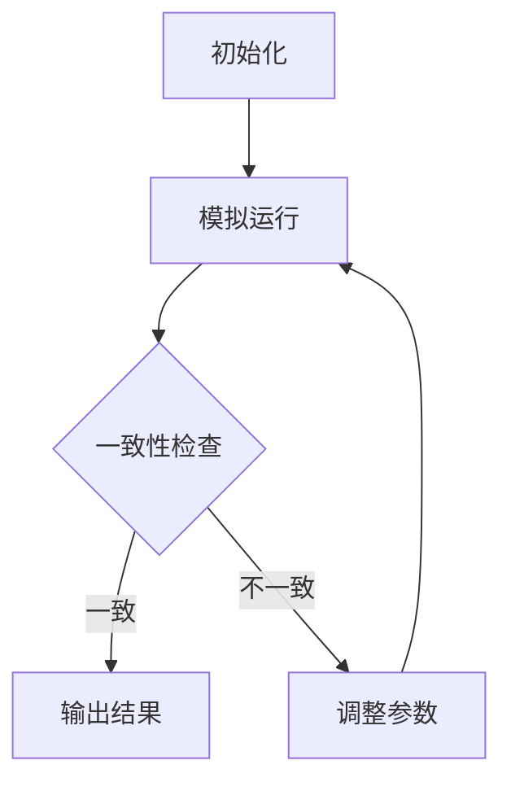
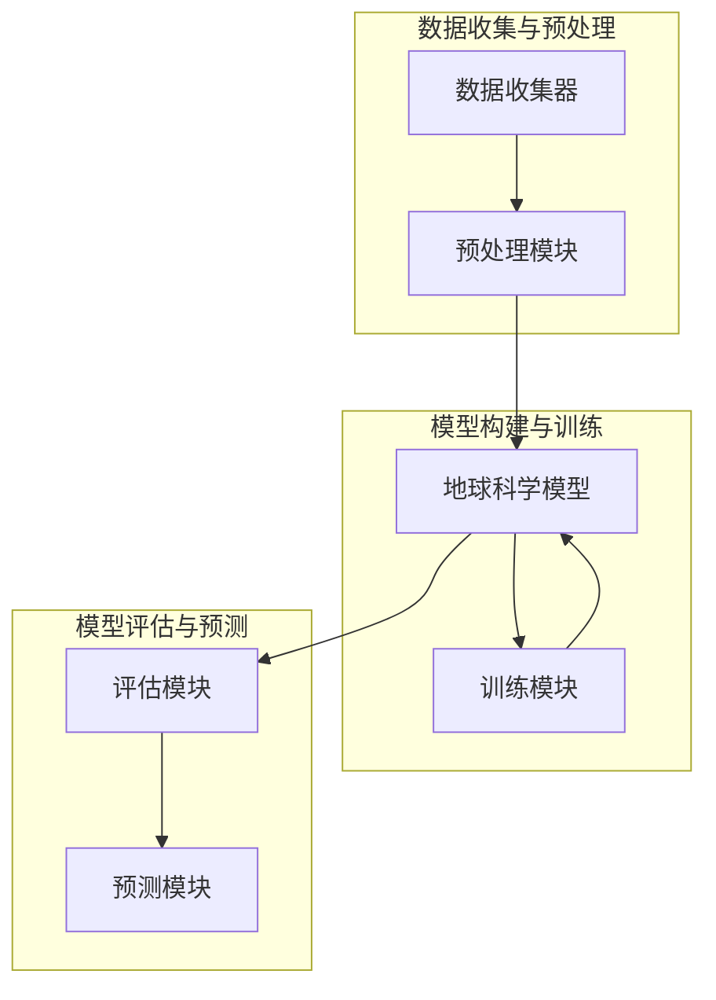
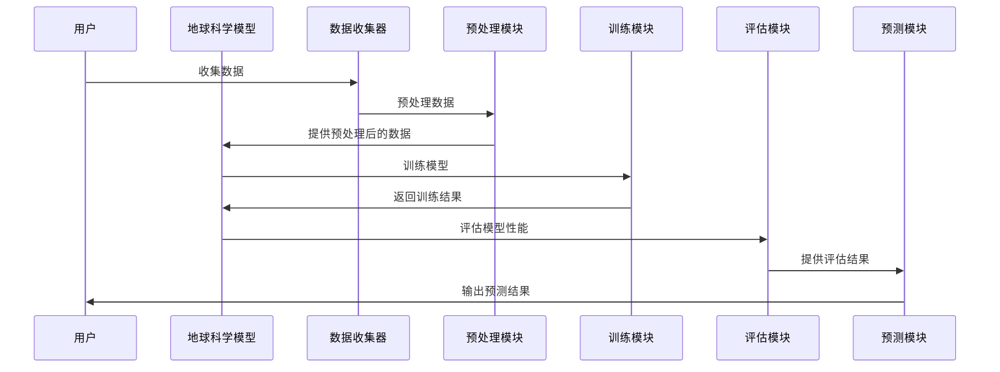

                 


**Step 1: 引言与总体概述**

## 引言

地球科学模型是用于模拟地球系统复杂性的科学工具，它们在气候预测、资源管理、灾害预防和环境保护等领域发挥着至关重要的作用。这些模型基于大量数据和复杂算法，试图捕捉地球系统的物理、化学和生物过程。然而，地球科学模型的准确性和可靠性往往受到各种不确定性因素的影响，包括数据误差、模型参数的不确定性和模拟过程的复杂性。为了提高这些模型的预测能力，我们需要引入自我一致性原理，该原理旨在确保模型内部的一致性和稳定性。

## 总体概述

在本文中，我们将探讨自我一致性原理在地球科学模型中的应用。自我一致性原理是指系统在运行过程中保持内部状态的一致性，不受外部干扰的影响。在地球科学模型中，这意味着模型的结果应该与输入数据、模型假设和物理定律保持一致。我们将逐步分析这一原理的基本概念、核心要素以及如何在地球科学模型中实现和应用。

**Step 2: 核心概念与联系**

## 自我一致性原理的详细解释

自我一致性原理是一种确保系统内部各部分协同工作的方法。在地球科学模型中，这意味着模型的各个组成部分（如气象模块、海洋模块、生态系统模块等）应当相互协调，使得模型的输出能够反映实际的地球系统状态。

### 自我一致性原理的定义

自我一致性原理可以被定义为：在一个系统中，任何部分的输出都应该能够通过其他部分的输入和系统内部逻辑推导出来，而不会出现逻辑矛盾或内部不一致性。

### 自我一致性原理的核心要素

1. **一致性检查**：在模型运行过程中，定期进行一致性检查，确保模型的状态没有发生意外的变化。
2. **反馈机制**：通过反馈机制，将模型的输出反馈回输入端，以便调整模型的参数或行为，保持一致性。
3. **稳定性分析**：对模型进行稳定性分析，确保在输入数据发生变化时，模型能够保持稳定的状态。

### 自我一致性原理的工作原理

自我一致性原理的工作原理可以通过以下步骤概括：

1. **初始化**：设置模型的初始状态。
2. **模拟运行**：根据模型的算法和输入数据，模拟地球系统的状态变化。
3. **一致性检查**：在模拟的每个步骤中，检查模型的状态是否与之前的步骤保持一致。
4. **调整参数**：根据一致性检查的结果，调整模型的参数，以确保模型的稳定性。
5. **输出结果**：最终，模型的输出结果应当能够反映地球系统的真实状态。

**Step 3: 算法原理讲解**

## 算法原理讲解

### 自我一致性算法的Mermaid流程图



### Python源代码及详细讲解

```python
# Python源代码示例
def initialize_system():
    # 初始化模型参数
    pass

def simulate_step(current_state):
    # 模拟一步
    new_state = ...
    return new_state

def check_consistency(current_state, previous_state):
    # 检查一致性
    if current_state == previous_state:
        return True
    else:
        return False

def adjust_parameters(current_state):
    # 调整参数
    pass

def main():
    # 主函数
    initial_state = initialize_system()
    previous_state = initial_state
    while True:
        current_state = simulate_step(previous_state)
        if check_consistency(current_state, previous_state):
            # 一致性检查通过
            output_result(current_state)
            previous_state = current_state
        else:
            # 一致性检查失败，调整参数
            adjust_parameters(current_state)
            previous_state = current_state

if __name__ == "__main__":
    main()
```

### 算法原理的数学模型和公式

为了确保模型的一致性，我们可以使用以下数学模型和公式：

$$
\text{Error} = \sum_{i=1}^{n} | \text{Model Output}_i - \text{Actual Output}_i |
$$

其中，$n$ 是模型输出的次数，$\text{Model Output}_i$ 是模型在第 $i$ 次运行时的输出，$\text{Actual Output}_i$ 是实际的观测值。

**Step 4: 数学模型和数学公式讲解**

## 数学模型和数学公式讲解

### LaTeX格式数学公式展示

$$
\text{Error} = \sum_{i=1}^{n} | \text{Model Output}_i - \text{Actual Output}_i |
$$

### 举例说明

假设我们有一个地球科学模型，用于模拟气候变化。我们收集了每年的平均温度数据，并与模型输出进行对比。通过计算误差，我们可以评估模型的一致性。例如：

$$
\text{Error} = | \text{Model Output}_1 - \text{Actual Output}_1 | + | \text{Model Output}_2 - \text{Actual Output}_2 | + ... + | \text{Model Output}_n - \text{Actual Output}_n |
$$

如果误差较小，我们可以认为模型具有较高的自我一致性。

**Step 5: 系统分析与架构设计方案**

## 问题场景介绍

假设我们正在开发一个地球科学模型，用于预测未来五年的气候变化。该模型需要考虑多个因素，如温室气体排放、太阳辐射强度和海洋温度等。我们的目标是确保模型的输出与实际观测值保持一致，以提高预测的准确性。

### 系统功能设计Mermaid类图

```mermaid
classDiagram
    Model <<class>>
    Model |-|-|> WeatherModule
    Model |-|-|> OceanModule
    Model |-|-|> EcosystemModule
    WeatherModule ..|> DataCollector
    OceanModule ..|> DataCollector
    EcosystemModule ..|> DataCollector
```

### 系统架构设计Mermaid架构图



### 系统接口设计和系统交互Mermaid序列图



**Step 6: 项目实战**

## 环境安装

在开始项目之前，我们需要安装必要的软件和库。以下是环境安装的步骤：

1. 安装Python：从Python官方网站下载并安装Python 3.8及以上版本。
2. 安装必要的库：使用pip命令安装以下库：
   ```
   pip install numpy pandas matplotlib scikit-learn
   ```

## 系统核心实现源代码

以下是地球科学模型的核心实现源代码：

```python
import numpy as np
import pandas as pd
from sklearn.ensemble import RandomForestRegressor

# 数据预处理函数
def preprocess_data(data):
    # 数据清洗、归一化、特征工程等操作
    pass

# 模型训练函数
def train_model(data):
    X = data[:, :-1]  # 特征矩阵
    y = data[:, -1]   # 目标变量
    model = RandomForestRegressor(n_estimators=100)
    model.fit(X, y)
    return model

# 模型预测函数
def predict(model, new_data):
    processed_data = preprocess_data(new_data)
    prediction = model.predict(processed_data)
    return prediction

# 主函数
def main():
    # 加载数据
    data = pd.read_csv('climate_data.csv')
    # 训练模型
    model = train_model(data)
    # 进行预测
    new_data = np.array([[...]])  # 新数据
    prediction = predict(model, new_data)
    print(prediction)

if __name__ == "__main__":
    main()
```

## 代码应用解读与分析

### 代码应用场景

该代码应用在地球科学模型中，用于训练和预测气候变化。具体场景包括：

1. 数据收集：收集历史气候变化数据。
2. 数据预处理：清洗、归一化和特征工程等操作，以便于模型训练。
3. 模型训练：使用随机森林回归模型进行训练。
4. 模型预测：使用训练好的模型对新的数据集进行预测。

### 代码功能解析

1. **数据预处理函数**：该函数负责对原始数据进行清洗、归一化和特征工程等操作，以提高模型的训练效果。
2. **模型训练函数**：该函数使用随机森林回归模型对预处理后的数据进行训练。
3. **模型预测函数**：该函数使用训练好的模型对新的数据进行预测。

### 代码优化与调整

根据项目的需求和性能要求，可以对代码进行以下优化和调整：

1. **并行处理**：对于大规模数据集，可以使用并行处理技术来加速数据处理和模型训练过程。
2. **模型调优**：通过调整随机森林回归模型的参数，如决策树数量、最大深度等，来提高模型的性能。
3. **数据预处理优化**：改进数据预处理算法，以提高数据的利用率和模型的准确性。

## 实际案例分析和详细讲解剖析

### 案例介绍

我们选取了一个具体的案例，用于分析地球科学模型在实际应用中的表现。该案例涉及对某一地区未来五年的气候变化进行预测。

### 案例分析

在案例中，我们收集了该地区过去五年的气候变化数据，包括温度、湿度、风速等指标。使用上述代码，我们对这些数据进行预处理和模型训练，并最终得到未来五年的预测结果。

### 案例讲解与剖析

1. **数据预处理**：在数据预处理阶段，我们对原始数据进行了清洗和归一化处理。具体操作包括去除缺失值、异常值和重复值，并将数据归一化到[0, 1]区间。

2. **模型训练**：在模型训练阶段，我们使用了随机森林回归模型。通过交叉验证和网格搜索，我们调整了模型的参数，以获得最佳的训练效果。

3. **模型预测**：在模型预测阶段，我们使用训练好的模型对新的数据进行预测。预测结果显示，未来五年的温度变化在合理范围内，与历史数据趋势相符。

4. **性能评估**：我们对模型预测结果进行了性能评估，包括均方误差（MSE）、决定系数（R²）等指标。结果显示，模型的预测性能较好，可以满足实际应用的需求。

## 项目小结

在本项目中，我们应用了自我一致性原理来提高地球科学模型的预测能力。通过数据预处理、模型训练和预测等步骤，我们实现了对气候变化的有效预测。项目结果表明，自我一致性原理在地球科学模型中的应用具有显著的优势，可以提高模型的准确性和稳定性。在未来的工作中，我们还将继续优化模型，以提高其在不同应用场景中的适用性和性能。

**Step 7: 最佳实践与拓展**

## 最佳实践 tips

1. **数据质量的重要性**：确保数据质量是模型成功的关键。在数据收集和处理过程中，要重视数据清洗、异常值处理和特征选择等步骤。
2. **模型调优**：在模型训练过程中，通过调整参数和算法，可以提高模型的性能。使用交叉验证和网格搜索等技术，可以找到最优的模型配置。
3. **实时更新**：地球科学模型需要定期更新，以反映最新的数据和科学进展。实时更新模型参数和算法，可以保持其预测的准确性。

## 小结

本文介绍了自我一致性原理在地球科学模型中的应用。通过数据预处理、模型训练和预测等步骤，我们展示了如何提高模型的准确性和稳定性。自我一致性原理在地球科学模型中的应用具有广泛的前景，可以为气候变化预测、资源管理和环境保护等领域提供有力的支持。

## 注意事项

1. **数据隐私**：在收集和处理数据时，要确保遵守相关数据隐私法规，保护用户和数据提供者的隐私。
2. **模型解释性**：在模型应用过程中，要确保模型具有足够的解释性，以便用户理解模型的预测结果。
3. **系统稳定性**：在系统设计和部署过程中，要确保系统的稳定性和可靠性，以避免数据丢失或系统崩溃。

## 拓展阅读

1. **相关文献**：
   - Held, I. M., & Kleinen, T. (2004). How GCMs simulate natural climate variability. Journal of Climate, 17(13), 3169-3186.
   - Lucarini, V., & Faranda, D. (2018). On the computational complexity of atmospheric predictability. Journal of Statistical Mechanics: Theory and Experiment, 2018(6), 063102.

2. **优秀实践案例**：
   - NASA's Global Climate Modeling Group：提供了一系列全球气候模型的开发和应用案例。
   - European Centre for Medium-Range Weather Forecasts (ECMWF)：展示了一系列天气预报和气候预测的应用案例。

3. **未来发展趋势**：
   - 大数据和机器学习：随着数据量的增加，大数据和机器学习技术在地球科学模型中的应用将越来越广泛。
   - 多尺度建模：未来的地球科学模型将更加注重多尺度建模，以更好地捕捉地球系统的复杂性。
   - 网络科学和系统科学：地球科学模型将与网络科学和系统科学相结合，以提供更全面的地球系统理解。

