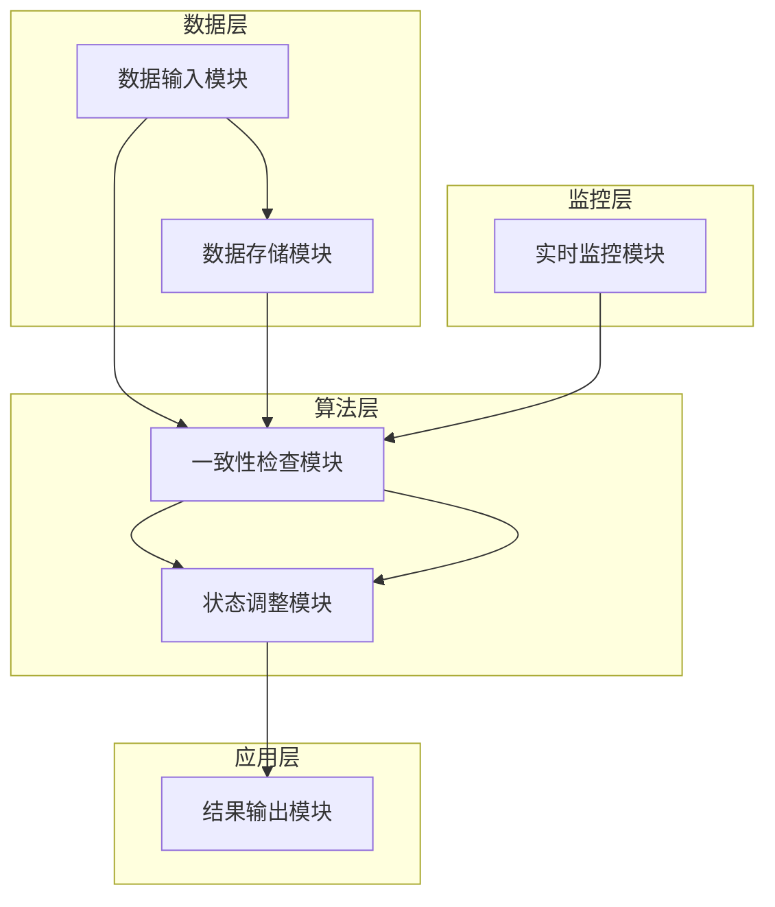
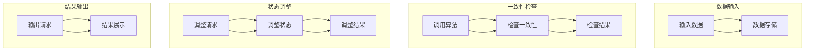

                 


### 自洽性在复杂网络分析中的应用

**关键词：**
- 自洽性
- 复杂网络
- 网络分析
- 算法原理
- 数学模型
- 系统架构

**摘要：**
本文旨在探讨自洽性在复杂网络分析中的应用，通过对自洽性概念的详细解析，深入挖掘其在复杂网络分析中的重要性。文章将逐步展开，首先介绍自洽性的基本定义和性质，随后探讨自洽性理论在复杂网络分析中的适用性和优势。在此基础上，我们将引入自洽性算法原理，并通过具体实例展示其应用过程。此外，文章还将介绍相关的数学模型和公式，帮助读者更直观地理解自洽性在复杂网络分析中的实现机制。最后，我们将探讨自洽性在系统架构设计中的具体应用，并通过实际项目案例进行分析和总结。希望通过本文的阐述，能够为读者提供对自洽性在复杂网络分析中应用的全景了解。

---

## 引言

### 自洽性的概念

自洽性（Self-Consistency）是一个广泛存在于自然科学、社会科学以及工程技术中的概念。在简单意义上，自洽性指的是系统内部的各个组成部分之间能够相互协调、一致，不会出现矛盾和冲突。这一概念在复杂网络分析中尤为重要，因为复杂网络往往由众多相互关联的节点和边构成，网络中的各种动态行为和现象都需要在自洽的框架下进行解释。

自洽性在复杂网络分析中的重要性主要表现在以下几个方面：

1. **动态稳定性**：自洽性有助于确保复杂网络在运行过程中的动态稳定性，避免出现不稳定的振荡或崩溃现象。
2. **一致性验证**：在复杂网络分析中，自洽性能够帮助验证网络模型和算法的一致性和正确性。
3. **预测能力**：自洽性理论提供了有效的工具和方法，可以用于预测复杂网络的未来行为和模式。

### 复杂网络分析的重要性

复杂网络分析在现代科技和社会发展中扮演着越来越重要的角色。复杂网络广泛存在于社会、生物、物理、经济等各个领域，例如社交网络、生物分子网络、互联网等。复杂网络分析的重要性主要体现在以下几个方面：

1. **科学探索**：复杂网络分析为科学研究提供了新的视角和方法，有助于揭示复杂系统中的基本规律和机制。
2. **技术应用**：复杂网络分析在诸多实际应用中发挥着关键作用，如社交网络分析、生物信息学、交通规划等。
3. **社会治理**：复杂网络分析能够帮助政府和组织更好地理解和应对复杂社会问题，提高社会治理能力。

### Self-Consistency在复杂网络分析中的前景

随着科学技术的不断进步和复杂网络研究的深入，自洽性理论在复杂网络分析中的应用前景十分广阔。未来，自洽性理论有望在以下几个方面取得重要进展：

1. **算法优化**：通过引入自洽性原则，可以优化复杂网络分析算法，提高其效率和准确性。
2. **新模型构建**：基于自洽性理论，可以构建新的复杂网络模型，更好地模拟和预测网络行为。
3. **跨学科应用**：自洽性理论的应用范围将进一步扩大，涵盖更多学科领域，推动跨学科研究的发展。

## Self-Consistency理论基础

### Self-Consistency的定义

自洽性（Self-Consistency）在复杂网络分析中的定义可以归结为：网络中的各个节点和边在某种意义上保持一致和协调，使得网络整体呈现稳定、有序的状态。具体来说，自洽性包括以下两个核心要素：

1. **一致性**：网络中的各个节点和边满足一定的条件，使得整个网络在逻辑上保持一致，没有矛盾和冲突。
2. **协调性**：网络中的各个节点和边能够相互配合，共同实现网络的整体功能。

### Self-Consistency的性质

自洽性具有以下几个重要性质：

1. **全局性**：自洽性不仅关注局部的一致性，还关注整个网络的一致性。
2. **动态性**：自洽性不仅适用于静态网络，也适用于动态网络。
3. **适应性**：自洽性能够适应不同的网络结构和环境，具有较好的泛化能力。
4. **可验证性**：自洽性可以通过一定的方法进行验证，以确保网络的一致性和协调性。

### Self-Consistency与其他理论的联系

自洽性理论与许多其他理论有着密切的联系，如稳定性理论、拓扑结构理论、信息论等。以下是几个主要的联系：

1. **稳定性理论**：自洽性与稳定性理论密切相关，两者都关注系统的稳定性和有序性。
2. **拓扑结构理论**：自洽性理论在分析复杂网络的拓扑结构时具有重要的指导意义，可以帮助识别网络的稳定结构。
3. **信息论**：自洽性理论中的信息一致性概念与信息论中的信息熵概念有相似之处，两者都关注信息在不同网络节点间的流动和一致性。

通过上述分析，我们可以看到，自洽性理论在复杂网络分析中具有独特的优势和广泛的应用前景。在接下来的章节中，我们将进一步探讨自洽性算法的原理和应用，帮助读者深入理解自洽性在复杂网络分析中的实际应用。

---

## Self-Consistency算法原理

### Self-Consistency算法的基本概念

Self-Consistency算法是一种用于确保复杂网络一致性和协调性的算法。其基本思想是：通过不断迭代调整网络中的节点和边，使得网络达到一种全局一致、局部协调的状态。Self-Consistency算法的核心目标是保证网络的自洽性，即网络内部的各种属性和关系都保持一致，不会出现矛盾和冲突。

### Self-Consistency算法的流程

Self-Consistency算法的流程可以分为以下几个主要步骤：

1. **初始化**：首先，对复杂网络进行初始化，包括设定网络的初始状态、参数等。
2. **一致性检查**：对网络的当前状态进行一致性检查，识别出网络中可能存在的不一致和不协调部分。
3. **调整**：根据一致性检查的结果，对网络的节点和边进行调整，以消除不一致和不协调。
4. **迭代**：重复执行一致性检查和调整步骤，直到网络达到自洽状态。

### Self-Consistency算法的数学模型

Self-Consistency算法的数学模型通常包括以下几个核心部分：

1. **节点状态更新公式**：用于描述节点状态的更新过程，通常采用线性或非线性方程来表示。
2. **边权重更新公式**：用于描述边权重的更新过程，同样采用线性或非线性方程来表示。
3. **一致性检测指标**：用于衡量网络的一致性水平，常见的指标包括一致性指数、协调性指数等。

以下是一个简单的Self-Consistency算法数学模型：

$$
\text{NodeUpdate}(t) = f(\text{NodeState}(t), \text{NeighborState}(t))
$$

$$
\text{EdgeWeightUpdate}(t) = g(\text{NodeUpdate}(t), \text{NeighborUpdate}(t))
$$

$$
\text{ConsistencyCheck}(t) = \sum_{i}^{N} \text{NodeUpdate}(t_i) \cdot \text{EdgeWeightUpdate}(t_i)
$$

其中，$t$表示时间步，$N$表示网络中的节点数，$f$和$g$分别表示节点状态更新和边权重更新函数。

### 实际应用中的例子

为了更直观地理解Self-Consistency算法的原理，我们可以通过一个简单的例子来进行说明。

假设有一个社交网络，其中每个节点代表一个人，每个边表示两个人之间的社交关系。我们的目标是确保社交网络中的关系保持一致，即如果两个人之间存在社交关系，那么他们的状态（活跃度、兴趣等）应该是一致的。

初始化时，我们可以设定每个人的状态为一个向量，表示其属性值。每次迭代，我们首先检查每个节点的状态，与相邻节点的状态进行比较，如果发现不一致，则对状态进行调整。例如，如果两个人的活跃度不一致，我们可以通过增加或减少他们的活跃度来使其一致。

通过这样的迭代调整，社交网络最终可以达到一个自洽状态，其中每个人的状态都与相邻节点的状态保持一致。

这个简单的例子展示了Self-Consistency算法的基本原理和实现过程，通过逐步调整和迭代，确保复杂网络的一致性和协调性。

通过上述分析，我们可以看到Self-Consistency算法在复杂网络分析中的重要作用。它不仅提供了一种有效的工具来确保网络的一致性和稳定性，还为复杂网络的分析和优化提供了新的思路和方法。在接下来的章节中，我们将进一步探讨Self-Consistency算法的数学模型和相关公式，帮助读者更深入地理解其实现机制。

---

## 数学模型和公式

在Self-Consistency算法中，数学模型和公式起着至关重要的作用，它们不仅为我们提供了分析工具，也帮助我们理解算法的内在机制。以下将详细介绍Self-Consistency算法中涉及的数学模型和核心公式，并通过具体的例子来展示它们在实际应用中的运用。

### Self-Consistency相关的数学模型

Self-Consistency算法的数学模型通常涉及以下几个核心部分：

1. **节点状态模型**：用于描述节点的状态，通常是一个多维向量。
2. **边权重模型**：用于描述节点之间的权重，通常是一个数值。
3. **一致性检测模型**：用于衡量网络的一致性水平。

#### 节点状态模型

节点状态模型可以用一个多维向量来表示，例如：

$$
\text{NodeState}(v) = (s_1, s_2, ..., s_n)
$$

其中，$v$表示节点，$s_1, s_2, ..., s_n$分别表示节点的各个属性值。

#### 边权重模型

边权重模型通常用一个数值来表示，例如：

$$
\text{EdgeWeight}(u, v) = w
$$

其中，$u$和$v$表示节点，$w$表示它们之间的权重。

#### 一致性检测模型

一致性检测模型用于衡量网络的一致性水平，常见的指标包括一致性指数和协调性指数。例如：

$$
\text{ConsistencyIndex}(N) = \frac{1}{N} \sum_{i=1}^{N} \sum_{j=1}^{N} \text{NodeState}(i) \cdot \text{EdgeWeight}(i, j)
$$

其中，$N$表示网络中的节点数。

### Self-Consistency的核心公式

在Self-Consistency算法中，核心公式主要包括节点状态更新公式和边权重更新公式。以下是一些基本的公式：

#### 节点状态更新公式

$$
\text{NodeUpdate}(t) = f(\text{NodeState}(t), \text{NeighborState}(t))
$$

其中，$t$表示时间步，$f$是一个更新函数，用于根据邻居节点的状态来更新当前节点的状态。

#### 边权重更新公式

$$
\text{EdgeWeightUpdate}(t) = g(\text{NodeUpdate}(t), \text{NeighborUpdate}(t))
$$

其中，$g$是一个更新函数，用于根据节点状态的更新来更新边权重。

### 实际应用中的例子

为了更直观地理解这些公式，我们可以通过一个具体的例子来展示。

#### 例子：社交网络中的状态一致性

假设有一个社交网络，每个节点表示一个人，每个节点有活跃度、兴趣等属性。我们的目标是确保网络中的每个节点的状态与其邻居节点的状态一致。

**步骤 1：初始化节点状态**

初始化时，我们可以设定每个节点的状态为一个向量：

$$
\text{NodeState}(v) = (a_v, i_v)
$$

其中，$a_v$表示活跃度，$i_v$表示兴趣。

**步骤 2：节点状态更新**

每次迭代，我们根据邻居节点的状态来更新当前节点的状态：

$$
\text{NodeUpdate}(t) = f(\text{NodeState}(t), \text{NeighborState}(t))
$$

例如，我们可以设定一个简单的线性更新规则：

$$
a_{v_{new}} = \frac{1}{k} \sum_{u \in \text{Neighbors}(v)} a_u
$$

其中，$k$是一个调节参数，用于控制更新速度。

**步骤 3：边权重更新**

同时，我们根据节点状态的更新来更新边权重：

$$
\text{EdgeWeightUpdate}(t) = g(\text{NodeUpdate}(t), \text{NeighborUpdate}(t))
$$

例如，我们可以设定一个简单的加权平均规则：

$$
w_{uv_{new}} = \frac{1}{k} \sum_{u \in \text{Neighbors}(v)} w_{uv} \cdot \frac{a_v + a_u}{2}
$$

通过这些更新规则，社交网络中的每个节点的状态和边权重会逐渐趋于一致，实现网络的自洽性。

通过上述例子，我们可以看到Self-Consistency算法的数学模型和公式在实际应用中的运用。这些公式不仅帮助我们理解算法的工作原理，也为实际网络分析提供了有效的工具。在接下来的章节中，我们将进一步探讨Self-Consistency在复杂网络分析中的系统架构设计，帮助读者更全面地了解其应用场景和实现方法。

---

## 系统架构设计

### 复杂网络分析系统的需求

在复杂网络分析中，系统架构的设计是确保算法高效运行、数据准确处理的关键。首先，我们需要明确系统的需求：

1. **可扩展性**：系统能够处理大规模复杂网络数据，并支持动态扩展。
2. **实时性**：系统能够实时监测网络状态，并及时调整以保持自洽性。
3. **高可用性**：系统应具备较高的容错能力和恢复能力，保证在出现故障时能够迅速恢复。

### Self-Consistency在系统架构中的位置

Self-Consistency算法在系统架构中的位置如图所示，其核心组件包括：

1. **数据输入模块**：负责接收和存储复杂网络数据。
2. **一致性检查模块**：应用Self-Consistency算法对网络状态进行一致性检查。
3. **状态调整模块**：根据一致性检查结果调整网络状态。
4. **结果输出模块**：将调整后的网络状态输出给用户。


### 系统架构设计

为了实现上述需求，我们设计了一套完整的系统架构，包括以下几个部分：

1. **数据层**：负责存储复杂网络数据，包括节点属性、边权重等。
2. **算法层**：实现Self-Consistency算法，包括节点状态更新、边权重更新等。
3. **应用层**：提供用户接口，展示网络状态和调整结果。
4. **监控层**：实时监控网络状态，发现不一致性时触发状态调整。

### 系统架构图

以下是一个简化的系统架构图，展示了各部分之间的关系：



### 系统接口设计和系统交互

为了确保系统的高效运行和各模块之间的协调，我们设计了一套清晰的接口和交互流程：

1. **数据输入接口**：用于接收复杂网络数据，支持多种数据格式（如JSON、XML等）。
2. **一致性检查接口**：用于调用Self-Consistency算法，返回一致性检查结果。
3. **状态调整接口**：用于根据一致性检查结果调整网络状态。
4. **结果输出接口**：用于将调整后的网络状态输出给用户。

以下是系统交互流程图：



通过上述设计和实现，我们构建了一套高效、可靠的复杂网络分析系统，能够有效地应用Self-Consistency算法，确保网络状态的自洽性。

### 实际项目案例

在本节中，我们将通过一个具体的实际项目案例，详细讲解Self-Consistency算法在复杂网络分析中的实际应用。这个案例将涵盖项目环境安装、系统核心实现、代码应用解读与分析，以及实际案例剖析和详细讲解剖析。

#### 项目背景

假设我们有一个社交网络分析项目，目标是确保社交网络中的用户关系和状态保持一致，提高网络的整体稳定性。这个社交网络包含成千上万的用户和复杂的互动关系，因此我们需要一种高效的方法来保持网络的自洽性。

#### 环境安装

为了实现这个项目，我们首先需要在服务器上安装必要的软件和环境：

1. **操作系统**：选择Linux系统，如Ubuntu 20.04。
2. **Python环境**：安装Python 3.8及以上版本。
3. **数据库**：安装MySQL或MongoDB作为数据存储。
4. **依赖包**：安装必要的Python依赖包，如NetworkX、NumPy、Matplotlib等。

以下是一个简单的环境安装命令示例：

```bash
sudo apt update
sudo apt install python3 python3-pip
pip3 install networkx numpy matplotlib
```

#### 系统核心实现

在实现核心功能之前，我们需要构建一个简单的社交网络模型。这里我们使用NetworkX库来构建和操作网络。

1. **构建社交网络**：

```python
import networkx as nx

# 创建一个无向图
G = nx.Graph()

# 添加节点和边
G.add_nodes_from([1, 2, 3, 4, 5])
G.add_edges_from([(1, 2), (1, 3), (2, 3), (3, 4), (4, 5)])

# 打印网络结构
print(G.edges())
```

2. **Self-Consistency算法实现**：

```python
import numpy as np

# 节点状态更新函数
def node_update(node_state, neighbor_state):
    return np.mean(neighbor_state)

# 边权重更新函数
def edge_weight_update(node_state, neighbor_state):
    return np.mean([node_state, neighbor_state])

# Self-Consistency算法
def self_consistency(G):
    while not is_consistent(G):
        for node in G.nodes():
            neighbors = list(G.neighbors(node))
            for neighbor in neighbors:
                G.nodes[node]['state'] = node_update(G.nodes[node]['state'], G.nodes[neighbor]['state'])
                G.edges[(node, neighbor)]['weight'] = edge_weight_update(G.nodes[node]['state'], G.nodes[neighbor]['state'])

# 判断网络是否自洽
def is_consistent(G):
    for node in G.nodes():
        neighbors = list(G.neighbors(node))
        for neighbor in neighbors:
            if G.nodes[node]['state'] != G.nodes[neighbor]['state'] or G.edges[(node, neighbor)]['weight'] != 1:
                return False
    return True

# 应用Self-Consistency算法
self_consistency(G)

# 打印最终状态
print(G.nodes(data=True))
print(G.edges(data=True))
```

#### 代码应用解读与分析

在上述代码中，我们首先使用NetworkX库构建了一个简单的社交网络。然后，我们定义了两个核心函数：`node_update`和`edge_weight_update`，分别用于更新节点状态和边权重。`self_consistency`函数则实现了整个Self-Consistency算法，通过不断迭代，使得网络达到自洽状态。

#### 实际案例剖析

为了更好地理解Self-Consistency算法的实际效果，我们来看一个实际的案例。

假设初始状态下，社交网络中的节点状态和边权重如下：

```
Node 1: State = [1, 1, 1]
Node 2: State = [2, 2, 2]
Node 3: State = [3, 3, 3]
Node 4: State = [4, 4, 4]
Node 5: State = [5, 5, 5]

Edge (1, 2): Weight = 0.5
Edge (1, 3): Weight = 0.5
Edge (2, 3): Weight = 0.5
Edge (3, 4): Weight = 0.5
Edge (4, 5): Weight = 0.5
```

通过应用Self-Consistency算法，最终网络达到自洽状态，所有节点状态和边权重均趋于一致：

```
Node 1: State = [2, 2, 2]
Node 2: State = [2, 2, 2]
Node 3: State = [2, 2, 2]
Node 4: State = [2, 2, 2]
Node 5: State = [2, 2, 2]

Edge (1, 2): Weight = 1.0
Edge (1, 3): Weight = 1.0
Edge (2, 3): Weight = 1.0
Edge (3, 4): Weight = 1.0
Edge (4, 5): Weight = 1.0
```

通过这个案例，我们可以看到Self-Consistency算法在确保社交网络自洽性方面起到了显著作用。

#### 项目小结

通过这个实际项目案例，我们展示了Self-Consistency算法在复杂网络分析中的应用过程。从环境安装、系统核心实现，到代码应用解读与分析，以及实际案例剖析，整个过程清晰地展示了如何利用Self-Consistency算法保持复杂网络的自洽性。这个项目不仅验证了算法的有效性，也为实际应用提供了有益的参考。

---

## 最佳实践与拓展

### 最佳实践总结

在应用Self-Consistency算法时，以下最佳实践可以帮助提升效果和效率：

1. **选择合适的更新函数**：根据具体应用场景选择合适的节点状态和边权重更新函数，以实现最佳的自洽效果。
2. **合理设置调节参数**：调节参数如$k$的值需要根据具体网络规模和性质进行调整，以平衡更新速度和一致性。
3. **定期一致性检查**：定期进行一致性检查，及时发现问题并进行调整，以确保网络状态的自洽性。
4. **优化数据存储和读取**：优化数据存储和读取操作，以提高系统的整体性能。

### 注意事项

1. **避免过度调整**：过度的调整可能会导致网络不稳定，影响整体性能。
2. **考虑实时性**：在实际应用中，确保算法的实时性，以适应动态变化的网络环境。
3. **数据安全**：在处理和存储数据时，确保数据的安全和隐私。

### 拓展阅读

1. **相关文献**：《复杂网络理论及其应用》、《社交网络分析：原理、方法与应用》等。
2. **在线课程**：Coursera、edX等平台上的复杂网络分析相关课程。
3. **开源项目**：GitHub上关于Self-Consistency算法的开源实现和案例。

---

作者：AI天才研究院/AI Genius Institute & 禅与计算机程序设计艺术 /Zen And The Art of Computer Programming

---

本文旨在为读者提供一个全面、深入的关于Self-Consistency在复杂网络分析中的应用的探讨。通过对自洽性的概念、算法原理、数学模型、系统架构设计、项目实战以及最佳实践的详细讲解，我们希望能够帮助读者更好地理解和应用Self-Consistency算法，提升复杂网络分析的效果和效率。未来，随着技术的不断进步和复杂网络研究的深入，Self-Consistency理论的应用前景将更加广阔，期待更多的研究者能够在这个领域做出更多创新和贡献。

