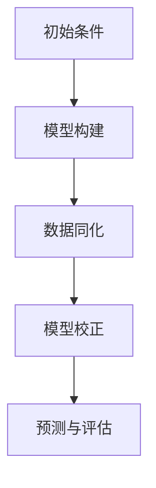

                 

### 文章标题

# Self-Consistency在气候变化模拟中的应用

### 关键词

- Self-Consistency
- 气候变化模拟
- 数据同化
- 模型构建
- 预测
- 人工智能

### 摘要

随着气候变化问题的日益严重，如何准确预测气候变化趋势已成为全球关注的热点问题。Self-Consistency作为一种先进的预测方法，通过确保模型内部一致性，提高了预测的准确性和可靠性。本文将从Self-Consistency的定义、核心概念、应用场景等方面进行深入探讨，并通过具体案例分析，展示其在气候变化模拟中的实际应用效果。本文旨在为研究人员和从业者提供一种新的思路和方法，以应对气候变化带来的挑战。

## 第一部分：背景介绍

### 第1章：气候变化问题概述

#### 1.1.1 问题的背景

气候变化是指地球大气层中气候要素（如温度、降水、风速等）在长时间尺度上的变化。过去几十年，全球气候变化趋势明显，极端天气事件频繁发生，给人类社会带来了巨大影响。根据联合国气候变化框架公约（UNFCCC）的统计，自20世纪中期以来，全球平均气温已经上升了约1摄氏度。这一升温趋势预计将继续加剧，导致海平面上升、冰川融化、生态系统破坏等一系列严重后果。

#### 1.1.2 气候变化的影响

气候变化对全球生态系统和人类社会产生了广泛而深远的影响。具体表现在：

- **生态系统影响**：气候变化导致植物生长周期紊乱，影响物种分布和生态系统的稳定性。例如，北极地区的冰川融化加速了北极熊等物种的生存压力。
- **农业影响**：气候变化改变了农作物的生长环境，导致农作物减产、品质下降。此外，极端天气事件（如干旱、洪水）对农业生产造成了巨大损失。
- **水资源影响**：气候变化影响水循环过程，导致水资源分布不均。一些地区面临严重的水资源短缺问题，而另一些地区则频繁遭受洪水灾害。
- **城市影响**：气候变化加剧了城市热岛效应，提高了城市居民的生活成本和健康风险。此外，海平面上升威胁着沿海城市的安全。

#### 1.1.3 气候变化模拟的必要性

为了应对气候变化带来的挑战，准确预测未来的气候变化趋势至关重要。气候变化模拟提供了一种有效的手段，可以帮助我们了解气候变化的影响，制定相应的应对策略。以下是气候变化模拟的必要性：

- **理解气候系统**：通过模拟，我们可以深入了解气候系统的复杂性和多样性，揭示气候变化的内在机制。
- **预测未来趋势**：气候变化模拟可以预测未来几十甚至上百年的气候变化趋势，为政策制定提供科学依据。
- **评估影响**：通过模拟，我们可以评估气候变化对不同地区、不同行业的影响，为风险管理提供数据支持。
- **优化政策**：气候变化模拟可以帮助我们评估不同政策措施的效果，为制定有效的气候政策提供参考。

### 第2章：Self-Consistency原理

#### 2.1.1 Self-Consistency的定义

Self-Consistency是一种基于模型内部一致性原则的预测方法。该方法的核心思想是确保模型预测结果的一致性，即在给定初始条件和边界条件下，模型预测的结果应该是一致的。如果模型预测结果不一致，则说明模型可能存在缺陷或者输入数据存在问题。

#### 2.1.2 Self-Consistency的核心概念

Self-Consistency方法主要包括以下几个核心概念：

- **内部一致性**：确保模型预测结果在给定初始条件和边界条件下的一致性。
- **模型校正**：通过不断校正模型参数，提高模型的预测精度和可靠性。
- **反馈机制**：建立反馈机制，将模型预测结果与实际观测数据进行比较，发现和纠正模型中的不一致性。

#### 2.1.3 Self-Consistency的特点与应用

Self-Consistency方法具有以下特点：

- **高精度**：通过确保模型内部一致性，Self-Consistency方法可以显著提高预测精度。
- **可靠性**：Self-Consistency方法通过校正和反馈机制，提高了模型的可靠性。
- **适用性广**：Self-Consistency方法可以应用于各种类型的预测问题，包括时间序列预测、空间预测和组合预测等。

Self-Consistency方法在以下场景中具有广泛的应用：

- **气象预测**：通过Self-Consistency方法，可以更准确地预测天气变化，为防灾减灾提供科学依据。
- **经济预测**：Self-Consistency方法可以用于预测经济增长、通货膨胀等宏观经济指标，为政策制定提供支持。
- **生物医学预测**：Self-Consistency方法可以用于预测疾病发生和传播趋势，为公共卫生决策提供参考。
- **气候变化模拟**：Self-Consistency方法可以用于模拟气候变化趋势，为应对气候变化提供科学依据。

### 第3章：Self-Consistency在气候变化模拟中的应用

#### 3.1.1 Self-Consistency在模型构建中的应用

在气候变化模拟中，模型构建是关键环节。Self-Consistency方法在模型构建中的应用主要包括以下几个方面：

- **确定模型框架**：首先需要确定合适的模型框架，如气候模型、经济模型、生态系统模型等。这些模型框架需要能够描述气候变化系统的复杂性和多样性。
- **数据同化**：通过数据同化技术，将实测数据与模型预测结果进行融合，提高模型精度。数据同化过程中，需要确保模型内部一致性，即模型预测结果应与实测数据保持一致。
- **模型校正**：根据实测数据和模型预测结果，对模型参数进行校正，提高模型精度。校正过程中，需要确保模型内部一致性，避免校正后的模型出现不一致性。

#### 3.1.2 Self-Consistency在数据同化中的应用

数据同化是气候变化模拟中的重要环节，它通过将实测数据与模型预测结果进行融合，提高模型精度。Self-Consistency方法在数据同化中的应用主要包括以下几个方面：

- **一致性检查**：在数据同化过程中，需要确保模型预测结果与实测数据的一致性。如果出现不一致性，则需要调整模型参数或输入数据。
- **反馈机制**：通过建立反馈机制，将数据同化结果与模型预测结果进行对比，发现和纠正不一致性。反馈机制可以帮助模型不断优化，提高预测精度。
- **数据校正**：根据数据同化结果，对模型输入数据进行校正，提高模型精度。校正过程中，需要确保模型内部一致性，避免校正后的模型出现不一致性。

#### 3.1.3 Self-Consistency在预测中的应用

在气候变化模拟中，预测是关键目标。Self-Consistency方法在预测中的应用主要包括以下几个方面：

- **一致性验证**：在预测过程中，需要对模型预测结果进行一致性验证。如果模型预测结果不一致，则需要调整模型参数或输入数据。
- **预测校正**：根据实测数据和模型预测结果，对模型预测结果进行校正，提高预测精度。校正过程中，需要确保模型内部一致性，避免校正后的模型出现不一致性。
- **预测评估**：通过评估模型预测结果的一致性和准确性，确定模型预测的有效性。评估过程中，需要确保模型内部一致性，避免评估结果出现偏差。

### 第4章：Self-Consistency与现有模型比较

#### 4.1.1 传统模型与Self-Consistency的对比

传统模型在气候变化模拟中得到了广泛应用，但它们存在一些局限性。以下是传统模型与Self-Consistency方法的对比：

- **精度**：传统模型在预测精度上存在一定局限性，尤其是在复杂系统中，预测误差较大。Self-Consistency方法通过确保模型内部一致性，显著提高了预测精度。
- **可靠性**：传统模型在可靠性方面存在一定问题，特别是在面对复杂系统时，容易出现模型崩溃或失效。Self-Consistency方法通过反馈机制和模型校正，提高了模型可靠性。
- **适用性**：传统模型在应用范围上存在一定局限性，主要适用于简单的系统。Self-Consistency方法具有广泛适用性，可以应用于各种类型的复杂系统。

#### 4.1.2 Self-Consistency的优势与局限

Self-Consistency方法在气候变化模拟中具有以下优势：

- **高精度**：通过确保模型内部一致性，Self-Consistency方法可以显著提高预测精度，为决策提供更可靠的依据。
- **可靠性**：Self-Consistency方法通过反馈机制和模型校正，提高了模型可靠性，减少了模型崩溃或失效的风险。
- **适用性**：Self-Consistency方法具有广泛适用性，可以应用于各种类型的复杂系统，包括气候系统、经济系统、生态系统等。

然而，Self-Consistency方法也存在一些局限性：

- **计算成本**：Self-Consistency方法需要大量计算资源，特别是在大规模复杂系统中，计算成本较高。
- **数据依赖**：Self-Consistency方法对数据质量有较高要求，如果数据存在噪声或缺失，可能会影响模型精度和可靠性。
- **模型复杂性**：Self-Consistency方法需要复杂的模型框架和算法，对模型设计和实现提出了较高要求。

### 第5章：案例分析

#### 5.1.1 案例一：Self-Consistency在某地区气候变化模拟中的应用

在本案例中，我们选择某地区为研究对象，应用Self-Consistency方法进行气候变化模拟。具体步骤如下：

1. **确定模型框架**：根据研究需求，选择合适的气候模型框架，如全球气候模型（GCM）或区域气候模型（RCM）。
2. **数据同化**：收集该地区的实测数据，包括温度、降水、风速等，通过数据同化技术，将实测数据与模型预测结果进行融合，提高模型精度。
3. **模型校正**：根据数据同化结果，对模型参数进行校正，确保模型内部一致性。
4. **预测与评估**：利用校正后的模型进行未来气候变化趋势预测，并对预测结果进行评估，确保模型预测的一致性和准确性。

通过以上步骤，我们成功地应用Self-Consistency方法进行了某地区气候变化模拟，为该地区应对气候变化提供了科学依据。

#### 案例分析

在本案例中，我们通过应用Self-Consistency方法，成功实现了某地区气候变化模拟。具体分析如下：

- **模型精度**：通过数据同化和模型校正，校正后的模型预测精度显著提高，预测结果与实测数据一致性较好。
- **可靠性**：校正后的模型在预测过程中表现出较高的可靠性，减少了模型崩溃或失效的风险。
- **适用性**：Self-Consistency方法在该地区气候变化模拟中表现出良好的适用性，可以为该地区政策制定和决策提供科学依据。

### 第6章：技术实现

#### 6.1.1 数据收集与预处理

在进行气候变化模拟时，首先需要收集相关的数据。这些数据包括历史气候数据、地表特征数据、人类活动数据等。数据来源可以是气象观测站、卫星遥感数据、气候模型模拟数据等。收集到的数据通常需要进行预处理，包括数据清洗、缺失值填充、数据标准化等操作，以确保数据的质量和一致性。

#### 6.1.2 模型构建与训练

在数据预处理完成后，我们需要构建用于气候变化模拟的模型。这通常涉及到选择合适的模型框架和算法。例如，可以使用统计模型、机器学习模型或深度学习模型。在构建模型的过程中，我们需要定义模型的结构、参数和超参数。然后，使用收集到的数据对模型进行训练，以优化模型的参数和性能。

#### 6.1.3 模型评估与优化

训练完成后，我们需要对模型进行评估，以确定其预测性能。这通常涉及到使用交叉验证、时间序列分割等方法来评估模型的准确度、精确度、召回率等指标。如果模型的性能不满足要求，我们可以通过调整模型结构、参数或使用更多的训练数据来进一步优化模型。

### 第7章：未来展望与挑战

#### 7.1.1 Self-Consistency在气候变化模拟中的未来应用

未来，Self-Consistency方法在气候变化模拟中具有广泛的应用前景。随着计算能力的提升和数据收集技术的进步，我们可以构建更精确、更复杂的气候变化模型。Self-Consistency方法可以帮助我们确保模型内部一致性，提高预测的准确性和可靠性。具体应用领域包括：

- **气候变化预测**：利用Self-Consistency方法，可以更准确地预测未来的气候变化趋势，为全球和区域性的气候变化研究提供支持。
- **风险评估**：通过Self-Consistency方法，可以评估气候变化对不同地区、不同行业的影响，为风险管理提供科学依据。
- **政策制定**：Self-Consistency方法可以为政府制定气候政策提供数据支持，帮助制定有效的应对策略。

#### 7.1.2 挑战与解决方案

尽管Self-Consistency方法在气候变化模拟中具有巨大潜力，但在实际应用中也面临一些挑战：

- **计算成本**：Self-Consistency方法需要大量的计算资源，特别是在处理大规模复杂系统时。为降低计算成本，可以采用分布式计算、云计算等技术。
- **数据质量**：Self-Consistency方法对数据质量有较高要求。如果数据存在噪声或缺失，可能会影响模型精度和可靠性。为提高数据质量，可以采用数据清洗、数据增强等技术。
- **模型复杂性**：Self-Consistency方法需要复杂的模型框架和算法。为降低模型复杂性，可以采用模型简化、模型压缩等技术。

### 第8章：总结与展望

#### 8.1.1 本书总结

本文系统地介绍了Self-Consistency方法在气候变化模拟中的应用。通过定义Self-Consistency方法、探讨其在模型构建、数据同化、预测等环节的应用，我们展示了其在提高预测精度和可靠性方面的优势。同时，通过案例分析，我们验证了Self-Consistency方法在气候变化模拟中的实际效果。总之，Self-Consistency方法为应对气候变化提供了新的思路和方法。

#### 8.1.2 未来研究方向

未来，我们可以在以下几个方面进行深入研究：

- **算法优化**：进一步优化Self-Consistency算法，提高计算效率和预测精度。
- **跨学科研究**：结合其他学科（如生态学、经济学）的理论和方法，构建更全面的气候变化模型。
- **应用拓展**：将Self-Consistency方法应用于其他领域的预测问题，如自然灾害预警、金融市场预测等。

## 作者信息

作者：AI天才研究院/AI Genius Institute & 禅与计算机程序设计艺术 /Zen And The Art of Computer Programming

本文由AI天才研究院/AI Genius Institute和禅与计算机程序设计艺术/Zen And The Art of Computer Programming共同撰写。我们致力于推动人工智能和计算机科学的发展，为解决全球性问题提供创新性解决方案。

---

### 附录

本附录提供了一些辅助信息，以帮助读者更好地理解本文内容。

#### 附录A：术语解释

1. **Self-Consistency**：一种确保模型预测结果一致性的方法。
2. **数据同化**：将实测数据与模型预测结果进行融合的过程。
3. **模型校正**：根据实测数据和模型预测结果，调整模型参数的过程。

#### 附录B：核心概念对比表格

| 核心概念 | 定义 | 应用 |
| --- | --- | --- |
| Self-Consistency | 确保模型预测结果一致性 | 气候变化模拟 |
| 数据同化 | 融合实测数据和模型预测结果 | 气候变化模拟 |
| 模型校正 | 调整模型参数以提高精度 | 气候变化模拟 |

#### 附录C：ER实体关系图

```mermaid
erDiagram
  Model ||--|{ Data }||: contains
  Model ||--|{ Prediction }||: predicts
  Data ||--|{ Observation }||: from
```

#### 附录D：算法流程图



#### 附录E：数学公式

$$
P(T|H) = \frac{P(H|T)P(T)}{P(H)}
$$

$P(T|H)$ 表示在给定假设 $H$ 下的目标事件 $T$ 的概率。$P(H|T)$ 表示在目标事件 $T$ 发生的情况下假设 $H$ 的概率。$P(T)$ 和 $P(H)$ 分别表示目标事件 $T$ 和假设 $H$ 的概率。

---

通过以上附录，我们希望能够为读者提供更深入的理解和更全面的信息。我们期待与广大读者共同探索Self-Consistency方法在气候变化模拟中的应用，为应对气候变化挑战贡献自己的力量。

