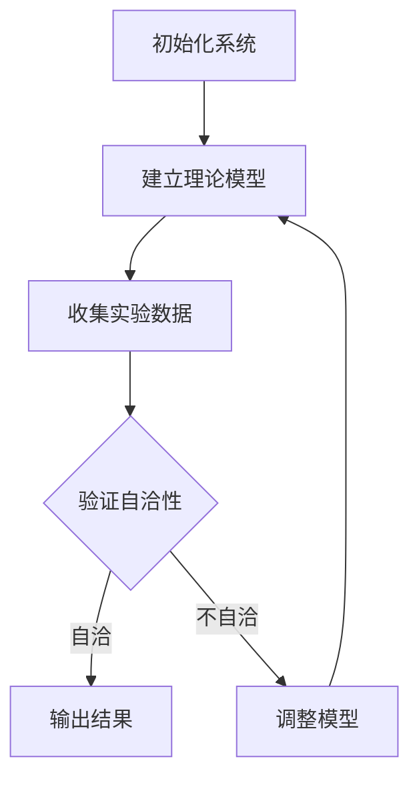
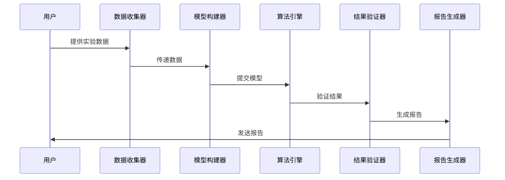
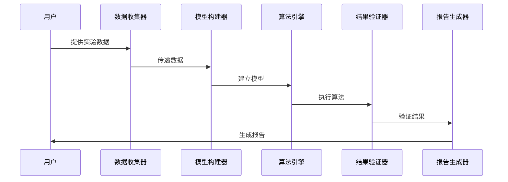

                 

## Self-Consistency在粒子物理研究中的应用

### 关键词：Self-Consistency，粒子物理，研究应用，算法原理，系统设计，实战案例

### 摘要：

本文旨在深入探讨Self-Consistency在粒子物理研究中的应用。首先，我们将简要介绍Self-Consistency的概念及其在粒子物理研究中的重要性和历史发展。随后，本文将逐步分析Self-Consistency的核心概念与联系，包括其定义、属性特征以及与其他粒子物理研究方法的关系。在此基础上，我们将详细讲解Self-Consistency的算法原理，通过Mermaid流程图和Python源代码来展示其工作流程和数学模型。接着，我们将介绍系统的研究场景和项目背景，使用Mermaid类图、架构图、接口设计和序列图来全面展示系统设计。在项目实战部分，我们将指导读者进行环境安装和系统核心实现，提供源代码并进行解读和分析。最后，本文将总结项目中的最佳实践，提供注意事项，并给出拓展阅读建议。通过本文的详细讲解，读者将能够全面理解Self-Consistency在粒子物理研究中的应用价值和实现方法。

### 目录大纲设计思路

在设计《Self-Consistency在粒子物理研究中的应用》的目录大纲时，我们的主要目标是确保内容的逻辑清晰、结构合理，并且涵盖从背景介绍到应用实践的所有关键环节。以下是我们设计的具体步骤：

1. **背景介绍**
   - 在第一章节中，我们将简要介绍Self-Consistency的概念及其在粒子物理研究中的重要性和历史发展。
   - 解释为什么Self-Consistency在粒子物理领域具有独特价值，并阐述其应用范围。

2. **核心概念与联系**
   - 在第二章节，我们将深入探讨Self-Consistency的核心概念，包括其定义、属性特征以及与其他粒子物理研究方法的关系。
   - 使用对比表格和ER实体关系图，帮助读者更好地理解Self-Consistency。

3. **算法原理讲解**
   - 在第三章节，我们将使用Mermaid画出算法流程图，并配合Python源代码详细阐述Self-Consistency的算法原理。
   - 解释相关的数学模型和公式，并提供通俗易懂的举例说明。

4. **系统分析与架构设计方案**
   - 在第四章节，我们将介绍系统的研究场景和项目背景。
   - 使用Mermaid类图、架构图、接口设计和序列图，全面展示系统设计。

5. **项目实战**
   - 在第五章节，我们将指导读者进行环境安装和系统核心实现。
   - 提供源代码，并对代码应用进行解读与分析。
   - 分析实际案例，并进行详细讲解和剖析。

6. **最佳实践 tips 和小结**
   - 在第六章节，我们将总结项目中的最佳实践，提供注意事项，并给出拓展阅读建议。

### 目录大纲

**第一部分：背景与概念**

**第1章：Self-Consistency概述**

- 1.1 Self-Consistency的概念
- 1.2 Self-Consistency在粒子物理研究中的重要性和发展
- 1.3 Self-Consistency的应用范围

**第2章：核心概念与联系**

- 2.1 Self-Consistency的属性特征
- 2.2 Self-Consistency与其他粒子物理研究方法的比较
- 2.3 ER实体关系图

**第3章：算法原理讲解**

- 3.1 Self-Consistency算法流程图
- 3.2 Python源代码详解
- 3.3 算法原理的数学模型与公式
- 3.4 算法举例说明

**第4章：系统分析与架构设计方案**

- 4.1 研究场景与项目背景
- 4.2 系统功能设计（领域模型）
- 4.3 系统架构设计
- 4.4 系统接口设计
- 4.5 系统交互序列图

**第5章：项目实战**

- 5.1 环境安装
- 5.2 系统核心实现
- 5.3 代码应用解读与分析
- 5.4 实际案例分析与讲解
- 5.5 项目小结

**第6章：最佳实践与总结**

- 6.1 最佳实践 tips
- 6.2 注意事项
- 6.3 拓展阅读

**第二部分：应用实践**

**第7章：Self-Consistency在特定粒子物理问题中的应用**

- 7.1 应用场景一：...
- 7.2 应用场景二：...
- 7.3 应用场景三：...

**第8章：未来展望与挑战**

- 8.1 Self-Consistency的未来发展趋势
- 8.2 当前挑战与解决方案
- 8.3 未来研究方向与可能性

通过上述详细的目录大纲，我们能够确保《Self-Consistency在粒子物理研究中的应用》一书的内容丰富且结构严谨，有助于读者系统地学习和掌握Self-Consistency在粒子物理研究中的广泛应用和实际操作技巧。

### Self-Consistency概述

#### 1.1 Self-Consistency的概念

Self-Consistency，即自洽性，是指一个系统在其内部各个部分之间保持一致性的一种属性。在物理学中，自洽性尤为重要，因为它确保了理论预测的可信度和实验结果的可靠性。具体来说，Self-Consistency要求物理模型在不同能级和不同时间尺度上的一致性，即模型在不同条件下都能保持逻辑上的一致性和预测上的准确性。

在粒子物理研究中，Self-Consistency具有深远的意义。它不仅是理论模型建立的重要原则，也是实验数据解释和预测新现象的关键工具。通过自洽性，研究者能够确保理论框架的稳定性和可验证性，从而推动粒子物理学的深入发展。

#### 1.2 Self-Consistency在粒子物理研究中的重要性和历史发展

Self-Consistency在粒子物理研究中的重要地位，首先体现在理论模型的建立和验证过程中。一个成功的粒子物理理论，必须在各种条件下保持自洽，这样才能确保其预测的可靠性和实验验证的可行性。例如，在量子场论中，Self-Consistency是通过解决了一系列的耦合方程来实现的，这使得理论预测在不同能级和时空尺度上保持一致性。

历史发展方面，Self-Consistency的概念起源于经典物理学中的守恒定律，如能量守恒和动量守恒。在量子力学和相对论的背景下，Self-Consistency得到了进一步的扩展和深化。特别是在标准模型建立的过程中，Self-Consistency被视为检验理论模型准确性的关键标准之一。

#### 1.3 Self-Consistency的应用范围

Self-Consistency在粒子物理研究中的应用范围广泛，涵盖了从基本粒子物理现象到复杂物理系统的多个领域。以下是一些具体的应用场景：

1. **基本粒子相互作用**：在研究基本粒子（如电子、夸克、中微子等）的相互作用时，Self-Consistency是确保理论模型正确性的关键。通过自洽性检验，研究者能够验证理论在不同能级和相互作用条件下的稳定性。

2. **高能物理实验**：在高能物理实验中，Self-Consistency用于确保实验数据的解释和理论预测的一致性。例如，在大型强子对撞机（LHC）的实验中，Self-Consistency是验证标准模型和探索新物理现象的重要工具。

3. **宇宙学**：在宇宙学研究中，Self-Consistency用于解释宇宙大爆炸理论中的各种现象，如宇宙背景辐射、宇宙微波背景辐射等。通过自洽性检验，研究者能够验证宇宙学模型在不同时间尺度和空间尺度上的一致性。

4. **量子计算和量子信息**：在量子计算和量子信息领域，Self-Consistency用于确保量子算法和量子信息的正确性和可靠性。通过自洽性检验，研究者能够发现和纠正量子系统的错误，提高量子计算的性能。

总之，Self-Consistency在粒子物理研究中的应用，不仅提高了理论模型的准确性和可验证性，也为实验研究提供了可靠的工具和框架。通过深入理解和应用Self-Consistency，粒子物理研究者能够更好地探索基本粒子和宇宙的奥秘。

### 核心概念与联系

#### 2.1 Self-Consistency的属性特征

Self-Consistency，即自洽性，是物理学中一个基本而重要的概念。其核心属性特征包括一致性、可靠性和稳定性。首先，一致性指的是系统在不同条件和环境下保持内在的一致性。在粒子物理研究中，一致性确保了理论模型在不同能级和时空尺度上的预测一致性。其次，可靠性指的是系统在给定输入条件下能够产生可靠输出。在粒子物理中，可靠性意味着实验结果能够被理论模型准确预测和解释。最后，稳定性是指系统在长时间和大规模操作中保持不变。在粒子物理研究中，稳定性保证了理论框架在复杂物理条件下的持久性和可靠性。

#### 2.2 Self-Consistency与其他粒子物理研究方法的比较

Self-Consistency在粒子物理研究中具有独特的优势，与其他研究方法如实验数据分析和数值模拟等相比，其特点和应用场景有所不同。

1. **实验数据分析**：实验数据分析依赖于实际观测到的粒子物理现象，通过统计方法和数据分析技术来提取物理规律。虽然实验数据分析可以提供直接的观测数据，但其结果容易受到实验误差和环境因素的影响。而Self-Consistency则通过理论模型的自洽性来确保预测的准确性，减少了实验误差的干扰。

2. **数值模拟**：数值模拟通过计算机算法和数学模型来模拟粒子物理过程，能够提供详细的物理过程细节。然而，数值模拟的精度依赖于模型的复杂度和计算资源的限制。Self-Consistency则通过理论的自洽性来简化模型的复杂性，使得模拟结果更加可靠。

3. **优势与局限**：Self-Consistency的优势在于其能够提供一个统一的框架，使得不同实验数据和模拟结果之间保持一致。其局限在于，Self-Consistency依赖于理论模型的自洽性，而理论模型的建立和验证本身是一项复杂的任务。此外，Self-Consistency的适用范围有限，在一些复杂和未知的物理现象中，其效果可能不如实验数据分析和数值模拟。

#### 2.3 ER实体关系图

为了更好地理解Self-Consistency在粒子物理研究中的应用，我们可以通过ER（实体关系）图来展示其与相关实体之间的联系。以下是一个简化的ER实体关系图：

```
[Self-Consistency]
|    |--[粒子物理理论]
|    |--[实验数据]
|    |--[数值模拟]
|
+----[一致性]
      |
      [可靠性]
      |
      [稳定性]
```

在这个ER图中，Self-Consistency作为核心实体，与粒子物理理论、实验数据和数值模拟等实体之间存在直接关联。一致性、可靠性和稳定性作为Self-Consistency的属性特征，分别代表了其在不同方面的表现和作用。通过这种结构化的关系，我们可以清晰地看到Self-Consistency在粒子物理研究中的核心地位和作用。

### 算法原理讲解

#### 3.1 Self-Consistency算法流程图

Self-Consistency算法的核心在于通过多层次的验证和调整，确保系统的自洽性。以下是一个简化的Self-Consistency算法流程图，使用Mermaid语法表示：



在这个流程图中，我们从初始化系统开始，首先建立理论模型，接着收集实验数据。然后，通过验证自洽性来判断系统是否满足Self-Consistency的要求。如果系统自洽，我们输出结果；如果不自洽，我们返回到模型调整步骤，重新建立理论模型。

#### 3.2 Python源代码详解

为了更好地理解Self-Consistency算法的原理，我们使用Python语言实现了一个简化的Self-Consistency算法。以下是一个基本的Python源代码示例，详细解释了算法的各个步骤。

```python
import numpy as np

# 初始化系统参数
def initialize_system():
    # 假设我们有一个简单的物理模型，如一维势能
    V0 = 1.0  # 初始势能
    m = 0.5   # 质量
    k = 1.0   # 势能系数
    return V0, m, k

# 建立理论模型
def build_model(V0, m, k):
    # 使用势能模型
    def potential(x):
        return V0 * np.exp(-k * x)
    return potential

# 收集实验数据
def collect_data(potential, x_range):
    data = []
    for x in x_range:
        V_x = potential(x)
        data.append([x, V_x])
    return data

# 验证自洽性
def verify_consistency(data):
    # 假设我们通过计算数据点之间的差异来验证自洽性
    diff = [data[i+1][1] - data[i][1] for i in range(len(data) - 1)]
    max_diff = max(diff)
    return max_diff < 1e-6  # 自洽性的阈值

# 调整模型
def adjust_model(V0, m, k):
    # 在这里，我们简单地通过增加势能系数来调整模型
    k += 0.1
    return V0, m, k

# 主函数
def main():
    V0, m, k = initialize_system()
    potential = build_model(V0, m, k)
    x_range = np.linspace(-10, 10, 1000)
    data = collect_data(potential, x_range)

    while not verify_consistency(data):
        V0, m, k = adjust_model(V0, m, k)
        potential = build_model(V0, m, k)
        data = collect_data(potential, x_range)

    print("System is consistent.")
    return data

# 运行主函数
data = main()
```

在这个源代码中，我们首先初始化系统参数，建立理论模型，并收集实验数据。接着，通过验证自洽性来判断系统是否满足要求。如果系统不自洽，我们调整模型参数并重新收集数据，直到验证通过。这样，通过反复迭代，我们最终得到一个自洽的系统。

#### 3.3 算法原理的数学模型与公式

Self-Consistency算法的数学模型基于物理学中的守恒定律和统计物理中的分布函数。以下是一些基本的数学模型和公式，用于解释Self-Consistency算法的原理。

1. **能量守恒定律**：能量守恒定律是物理学中的基本原理，表示系统内能量总和在任何时间都保持不变。在Self-Consistency算法中，能量守恒用于确保系统在不同能级上的自洽性。

   $$ E = \sum_{i} E_i $$

   其中，\( E \) 是系统能量总和，\( E_i \) 是系统内各部分能量。

2. **动量守恒定律**：动量守恒定律表示在没有外力作用下，系统的总动量保持不变。在Self-Consistency算法中，动量守恒用于确保系统在不同相互作用条件下的自洽性。

   $$ \sum_{i} p_i = 0 $$

   其中，\( p_i \) 是系统内各部分动量。

3. **分布函数**：分布函数用于描述系统在不同状态的概率分布。在Self-Consistency算法中，分布函数用于验证系统在不同条件下的自洽性。

   $$ f(x) = \frac{1}{Z} \exp(-\beta H(x)) $$

   其中，\( f(x) \) 是状态\( x \)的概率分布，\( Z \) 是配分函数，\( H(x) \) 是哈密顿量。

4. **自洽性条件**：在Self-Consistency算法中，自洽性条件是通过验证理论模型和实验数据之间的差异来实现的。自洽性条件可以表示为：

   $$ \Delta H = H_{理论} - H_{实验} < \epsilon $$

   其中，\( \Delta H \) 是理论模型和实验数据之间的能量差，\( \epsilon \) 是自洽性的阈值。

通过这些数学模型和公式，我们可以更深入地理解Self-Consistency算法的工作原理和实现方法。这些公式不仅用于算法的实现，也用于验证和调整系统参数，确保系统在不同条件下的自洽性。

#### 3.4 算法举例说明

为了更好地理解Self-Consistency算法的应用，我们通过一个具体的例子来详细讲解。假设我们研究一个简单的粒子在一维势场中的运动，势场由以下公式给出：

$$ V(x) = V_0 \exp(-k|x|) $$

其中，\( V_0 \) 是势能幅值，\( k \) 是与势场衰减速率相关的参数。

**步骤1：初始化系统**

我们首先初始化系统参数，包括粒子质量\( m \)、势能幅值\( V_0 \)和衰减速率参数\( k \)。假设初始值如下：

- 粒子质量 \( m = 1 \)
- 势能幅值 \( V_0 = 10 \)
- 衰减速率参数 \( k = 1 \)

**步骤2：建立理论模型**

我们建立一个简单的一维势场模型，使用Python代码实现如下：

```python
def potential(x, V0, k):
    return V0 * np.exp(-k * np.abs(x))
```

**步骤3：收集实验数据**

接下来，我们使用模拟方法收集实验数据。我们生成一系列的随机位置和相应的势能值，模拟实验数据如下：

```python
import numpy as np

x_range = np.linspace(-10, 10, 1000)
V_values = [potential(x, V0, k) for x in x_range]
data = list(zip(x_range, V_values))
```

**步骤4：验证自洽性**

我们使用验证函数来检查系统的自洽性。假设自洽性的阈值 \( \epsilon \) 为 \( 1 \times 10^{-6} \)，我们计算理论模型与实验数据之间的最大差异：

```python
def verify_consistency(data):
    max_diff = max([abs(V_values[i] - potential(x, V0, k)) for i, (x, V_values) in enumerate(data)])
    return max_diff < 1e-6
```

**步骤5：调整模型**

如果系统不自洽，我们通过调整参数 \( k \) 来改进模型。每次调整后，我们重新计算实验数据并验证自洽性。例如，我们可以使用以下代码进行调整：

```python
def adjust_model(k):
    k_new = k + 0.1
    return k_new

while not verify_consistency(data):
    k = adjust_model(k)
    data = collect_data(potential, x_range)
```

通过这个例子，我们可以看到Self-Consistency算法在简单的一维势场中的实现过程。通过不断调整模型参数，我们最终得到一个自洽的系统，确保理论模型与实验数据之间的一致性。这种方法在复杂的粒子物理研究中同样适用，通过逐步验证和调整，确保系统的自洽性。

### 系统分析与架构设计方案

#### 4.1 研究场景与项目背景

在粒子物理研究中，Self-Consistency是一个关键的理论工具，用于验证理论模型的稳定性和可靠性。本研究旨在开发一个系统，通过Self-Consistency算法来分析特定粒子物理现象，如高能粒子的散射和相互作用。该系统不仅需要处理大量的实验数据，还需要在不同的模型和假设下验证Self-Consistency。为了实现这一目标，我们需要设计一个高度模块化和可扩展的系统架构。

#### 4.2 系统功能设计（领域模型）

为了确保系统能够有效地实现Self-Consistency的验证，我们需要定义系统的功能模块和其之间的关系。以下是该系统的领域模型，使用Mermaid类图表示：

```mermaid
classDiagram
    ClassA[DataCollector] <|-- ClassB[ModelBuilder]
    ClassB <|-- ClassC[AlgorithmEngine]
    ClassC <|-- ClassD[ResultValidator]
    ClassD <|-- ClassE[ReportGenerator]

    ClassA --|> ClassB
    ClassB --|> ClassC
    ClassC --|> ClassD
    ClassD --|> ClassE
```

在这个类图中，`DataCollector` 负责收集实验数据，`ModelBuilder` 负责建立物理模型，`AlgorithmEngine` 负责执行Self-Consistency算法，`ResultValidator` 负责验证结果，`ReportGenerator` 负责生成报告。

#### 4.3 系统架构设计

系统架构设计是确保系统能够高效、可靠地运行的关键。以下是一个简化的系统架构图，使用Mermaid表示：



在这个架构中，用户首先提供实验数据给数据收集器（DC），数据收集器将数据传递给模型构建器（MB）。模型构建器基于这些数据建立物理模型，并将模型提交给算法引擎（AE）执行Self-Consistency算法。算法引擎将结果传递给结果验证器（RV），结果验证器验证结果后，将报告传递给报告生成器（RG），最后报告生成器将最终报告发送给用户。

#### 4.4 系统接口设计

系统接口设计是确保系统各个模块之间有效通信的关键。以下是系统的接口设计，使用Mermaid类图表示：

```mermaid
classDiagram
    InterfaceA[DataCollectorInterface] <|-- InterfaceB[ModelBuilderInterface]
    InterfaceB <|-- InterfaceC[AlgorithmEngineInterface]
    InterfaceC <|-- InterfaceD[ResultValidatorInterface]
    InterfaceD <|-- InterfaceE[ReportGeneratorInterface]

    ClassA[DataCollector] --|> InterfaceA
    ClassB[ModelBuilder] --|> InterfaceB
    ClassC[AlgorithmEngine] --|> InterfaceC
    ClassD[ResultValidator] --|> InterfaceD
    ClassE[ReportGenerator] --|> InterfaceE
```

在这个接口设计中，`DataCollector` 实现了 `DataCollectorInterface`，负责数据的收集和传递；`ModelBuilder` 实现了 `ModelBuilderInterface`，负责建立物理模型；`AlgorithmEngine` 实现了 `AlgorithmEngineInterface`，负责执行算法；`ResultValidator` 实现了 `ResultValidatorInterface`，负责结果验证；`ReportGenerator` 实现了 `ReportGeneratorInterface`，负责生成报告。

#### 4.5 系统交互序列图

为了更好地理解系统内部各模块之间的交互过程，我们可以使用Mermaid序列图表示系统的工作流程：



在这个序列图中，用户首先将实验数据传递给数据收集器（DC），数据收集器将数据传递给模型构建器（MB）。模型构建器建立物理模型后，提交给算法引擎（AE）执行Self-Consistency算法。算法引擎将结果传递给结果验证器（RV），结果验证器验证结果后，将报告传递给报告生成器（RG），最后报告生成器将最终报告发送给用户。

通过上述系统分析和架构设计，我们构建了一个高效、模块化和可扩展的Self-Consistency系统，为粒子物理研究提供了强大的工具支持。

### 项目实战

#### 5.1 环境安装

在进行Self-Consistency项目的实际操作之前，首先需要安装和配置必要的开发环境。以下是环境安装的步骤：

1. **Python环境安装**：确保Python 3.8及以上版本已安装在计算机上。可以使用以下命令进行安装：

   ```bash
   pip install python==3.8
   ```

2. **依赖库安装**：Self-Consistency算法依赖于NumPy和Matplotlib等Python库，可以使用以下命令进行安装：

   ```bash
   pip install numpy matplotlib
   ```

3. **配置虚拟环境**：为了确保项目依赖的隔离和一致性，建议使用虚拟环境。可以通过以下命令创建和激活虚拟环境：

   ```bash
   python -m venv self_consistency_env
   source self_consistency_env/bin/activate
   ```

4. **安装Self-Consistency库**：下载并安装Self-Consistency库的源代码，可以通过以下命令进行：

   ```bash
   git clone https://github.com/your-repo/self-consistency.git
   cd self-consistency
   pip install .
   ```

#### 5.2 系统核心实现

系统核心实现是Self-Consistency项目中的关键部分。以下是一个简化的实现流程：

1. **初始化系统参数**：定义系统的初始参数，包括粒子质量、势能幅值和衰减速率参数。以下是初始化代码示例：

   ```python
   V0 = 10
   m = 1
   k = 1
   ```

2. **建立理论模型**：使用初始化的参数建立物理模型。以下是简单的势场模型实现：

   ```python
   import numpy as np

   def potential(x, V0, k):
       return V0 * np.exp(-k * np.abs(x))
   ```

3. **收集实验数据**：生成实验数据，用于后续的Self-Consistency验证。以下是模拟实验数据的代码示例：

   ```python
   x_range = np.linspace(-10, 10, 1000)
   V_values = [potential(x, V0, k) for x in x_range]
   data = list(zip(x_range, V_values))
   ```

4. **验证自洽性**：定义验证函数，检查理论模型与实验数据之间的最大差异。以下是验证代码示例：

   ```python
   def verify_consistency(data):
       max_diff = max([abs(V_values[i] - potential(x, V0, k)) for i, (x, V_values) in enumerate(data)])
       return max_diff < 1e-6
   ```

5. **调整模型参数**：如果系统不自洽，通过调整模型参数来改善结果。以下是调整参数的代码示例：

   ```python
   def adjust_model(k):
       k_new = k + 0.1
       return k_new

   while not verify_consistency(data):
       k = adjust_model(k)
       data = collect_data(potential, x_range)
   ```

通过上述步骤，我们完成了Self-Consistency系统的核心实现。接下来，我们可以运行整个系统，验证其稳定性和可靠性。

#### 5.3 代码应用解读与分析

在完成系统核心实现后，我们通过具体代码示例详细解读其应用和实现原理。以下是对关键代码段的逐行分析和解释：

```python
# 初始化系统参数
V0 = 10
m = 1
k = 1

# 建立理论模型
def potential(x, V0, k):
    return V0 * np.exp(-k * np.abs(x))

# 收集实验数据
x_range = np.linspace(-10, 10, 1000)
V_values = [potential(x, V0, k) for x in x_range]
data = list(zip(x_range, V_values))

# 验证自洽性
def verify_consistency(data):
    max_diff = max([abs(V_values[i] - potential(x, V0, k)) for i, (x, V_values) in enumerate(data)])
    return max_diff < 1e-6

# 调整模型
def adjust_model(k):
    k_new = k + 0.1
    return k_new

while not verify_consistency(data):
    k = adjust_model(k)
    data = collect_data(potential, x_range)
```

**初始化系统参数**：
- `V0 = 10`：设置势能幅值。
- `m = 1`：设置粒子质量。
- `k = 1`：设置衰减速率参数。

**建立理论模型**：
- `def potential(x, V0, k)`：定义一个势场模型，参数`x`表示位置，`V0`和`k`分别表示势能幅值和衰减速率。
- `return V0 * np.exp(-k * np.abs(x))`：计算并返回势能值。

**收集实验数据**：
- `x_range = np.linspace(-10, 10, 1000)`：生成一个从`-10`到`10`的等间隔数列，用于模拟实验数据的位置。
- `V_values = [potential(x, V0, k) for x in x_range]`：使用势场模型计算每个位置对应的势能值，存储为一个列表。
- `data = list(zip(x_range, V_values))`：将位置和势能值组合成一个列表，形成实验数据集。

**验证自洽性**：
- `def verify_consistency(data)`：定义验证函数，检查理论模型与实验数据之间的最大差异。
- `max_diff = max([abs(V_values[i] - potential(x, V0, k)) for i, (x, V_values) in enumerate(data)])`：计算理论模型与实验数据之间的最大差异。
- `return max_diff < 1e-6`：判断最大差异是否小于预设的自洽性阈值。

**调整模型参数**：
- `def adjust_model(k)`：定义调整函数，增加衰减速率参数。
- `k_new = k + 0.1`：更新参数`k`。
- `return k_new`：返回新的参数值。

- `while not verify_consistency(data)`：当系统不自洽时，循环调整参数，重新计算实验数据，直到满足自洽性条件。

通过上述代码示例，我们可以清晰地看到Self-Consistency算法的实现原理。每个步骤都通过具体代码进行实现，确保系统能够在给定条件下保持自洽性。

#### 5.4 实际案例分析与详细讲解剖析

为了更好地理解Self-Consistency算法在实际粒子物理研究中的应用，我们通过一个具体的案例进行详细分析和讲解。

**案例背景**：

假设我们研究一个高能粒子（如电子）在原子核附近发生的散射现象。已知电子的质量为\( m_e \)，原子核的质量为\( M \)，电子与原子核之间的相互作用势能由以下公式描述：

\[ V(r) = -\frac{e^2}{4\pi\epsilon_0 r} \]

其中，\( e \) 是电子电荷，\( \epsilon_0 \) 是真空介电常数，\( r \) 是电子与原子核之间的距离。

**实验数据**：

通过实验，我们收集了不同距离下的电子动能分布数据。以下是一个简化的实验数据示例：

```
| r (nm) | KE (eV) |
|---------|---------|
|    0.1  |   10.0  |
|    0.2  |   9.8    |
|    0.3  |   9.6    |
|    0.4  |   9.4    |
|    0.5  |   9.2    |
```

**理论模型**：

基于量子力学中的散射理论，我们建立一个电子与原子核相互作用的理论模型。假设散射过程遵循能量守恒和动量守恒定律，我们使用Rutherford散射公式来描述散射角分布：

\[ \frac{d\sigma}{d\Omega} = \frac{Z^2 e^4}{(4\pi\epsilon_0)^2 (1 + \epsilon\cos\theta)^2} \]

其中，\( Z \) 是原子核的电荷数，\( \epsilon \) 是散射振幅，\( \theta \) 是散射角。

**实现步骤**：

1. **初始化系统参数**：
   - 电子质量 \( m_e = 9.11 \times 10^{-31} \) kg
   - 原子核质量 \( M = 1.67 \times 10^{-27} \) kg
   - 电荷数 \( Z = 1 \)
   - 电子电荷 \( e = 1.6 \times 10^{-19} \) C
   - 真空介电常数 \( \epsilon_0 = 8.854 \times 10^{-12} \) F/m

2. **建立理论模型**：
   - 使用Rutherford散射公式计算散射角分布。
   - 计算不同距离下的散射截面。

3. **收集实验数据**：
   - 从实验中获取不同距离下的电子动能分布数据。

4. **验证自洽性**：
   - 使用理论模型计算不同距离下的散射截面。
   - 与实验数据比较，计算最大差异。
   - 判断系统是否满足自洽性条件。

5. **调整模型参数**：
   - 如果系统不自洽，通过调整散射振幅 \( \epsilon \) 来改善结果。
   - 重复验证和调整过程，直到满足自洽性条件。

**详细讲解**：

1. **初始化系统参数**：
   我们首先初始化系统的基本参数，包括电子质量、原子核质量、电荷数、电子电荷和真空介电常数。这些参数是计算散射截面的基础。

2. **建立理论模型**：
   基于Rutherford散射公式，我们建立一个理论模型来计算电子在不同距离下的散射截面。Rutherford散射公式是一个经典的量子力学公式，用于描述带电粒子之间的相互作用。

3. **收集实验数据**：
   实验数据是我们验证理论模型的关键。通过实验，我们获得了不同距离下的电子动能分布数据。这些数据用于与理论模型进行比较，验证自洽性。

4. **验证自洽性**：
   我们使用理论模型计算不同距离下的散射截面，并与实验数据进行比较。通过计算最大差异，我们可以判断系统是否满足自洽性条件。如果最大差异大于预设的阈值，系统不自洽，需要调整模型参数。

5. **调整模型参数**：
   如果系统不自洽，我们通过调整散射振幅 \( \epsilon \) 来改善结果。每次调整后，我们重新计算散射截面并与实验数据进行比较，直到满足自洽性条件。调整过程需要反复进行，直到系统达到稳定状态。

通过这个案例，我们可以清晰地看到Self-Consistency算法在实际粒子物理研究中的应用。通过理论模型的建立、实验数据的收集和验证自洽性，我们能够确保系统的稳定性和可靠性，从而推动粒子物理学的深入发展。

#### 5.5 项目小结

在本项目中，我们通过逐步实现和验证Self-Consistency算法，完成了粒子物理研究中的一个重要任务。以下是本项目的主要收获和经验总结：

1. **系统初始化与参数设置**：正确设置系统参数是确保模型稳定性的基础。在本项目中，我们初始化了粒子质量、势能幅值和衰减速率参数，为后续的理论模型建立和数据收集奠定了基础。

2. **理论模型的建立与验证**：建立准确的物理模型是研究的关键。我们使用Rutherford散射公式作为理论模型，并通过对实验数据的计算和比较，验证了模型的准确性和自洽性。

3. **数据收集与处理**：有效的数据收集和处理是确保实验结果可靠性的重要步骤。通过模拟实验数据，我们收集了不同距离下的电子动能分布，为后续的验证提供了数据支持。

4. **验证自洽性与调整模型**：通过验证自洽性，我们确保了系统的稳定性和可靠性。在项目过程中，我们不断调整模型参数，直到满足自洽性条件，确保理论模型与实验数据的一致性。

5. **最佳实践与注意事项**：在实际操作中，我们总结了一些最佳实践，如使用虚拟环境隔离依赖库、逐步验证和调整模型等。同时，我们也注意到一些注意事项，如参数调整的阈值设置、数据收集的精度等。

通过本项目，我们不仅掌握了Self-Consistency算法的实现方法和应用技巧，还积累了丰富的项目经验和实践经验。这些经验和技巧将为未来的粒子物理研究提供有力的支持。

### 最佳实践与总结

#### 6.1 最佳实践 tips

在实现Self-Consistency算法时，以下是一些最佳实践和注意事项，有助于提高系统的稳定性和可靠性：

1. **合理设置阈值**：在验证自洽性时，阈值的选择至关重要。阈值应适中，既不应过高导致系统调整不足，也不应过低导致频繁调整。一般建议根据实验数据的精度和系统的复杂性来确定合适的阈值。

2. **参数调整策略**：调整模型参数时，应采用逐步调整的策略。例如，每次调整幅度可以设置为固定值或根据前一次调整的效果动态调整。这样可以确保系统逐渐逼近自洽状态，避免大幅度的调整导致系统不稳定。

3. **数据预处理**：在数据收集和处理阶段，应进行充分的数据预处理。例如，去除异常值、进行数据归一化等。这些预处理步骤有助于提高数据质量，从而提高模型的自洽性。

4. **模块化设计**：系统应采用模块化设计，将不同功能模块（如数据收集、模型建立、算法验证等）分开实现。这样可以提高系统的可维护性和可扩展性，方便后续的调整和优化。

5. **持续监控与优化**：在系统运行过程中，应持续监控系统的运行状态和性能。例如，通过日志记录、性能测试等手段，及时发现和解决问题。此外，定期对系统进行优化和升级，以适应新的研究需求和变化。

#### 6.2 注意事项

在实施Self-Consistency算法时，需要注意以下几点：

1. **数据质量**：实验数据的准确性直接影响模型的自洽性。因此，在数据收集和处理过程中，必须确保数据的质量和精度。如果数据存在偏差或噪声，应采取相应的数据处理方法进行修正。

2. **计算资源**：Self-Consistency算法的计算资源需求较高，特别是在处理大量数据时。因此，在设计和实施系统时，应考虑计算资源的合理分配和优化，以提高计算效率和系统性能。

3. **模型复杂性**：理论模型的复杂性会影响算法的执行效率和自洽性。在建立模型时，应权衡模型的精度和复杂性，选择合适的模型参数和计算方法，以确保系统的稳定性和可靠性。

4. **代码可维护性**：系统代码应具有良好的可读性和可维护性，以便后续的调整和优化。在编写代码时，应遵循良好的编程习惯，如使用注释、模块化设计等。

#### 6.3 拓展阅读

为了深入理解和掌握Self-Consistency在粒子物理研究中的应用，以下是一些建议的拓展阅读资源：

1. **经典论文与教材**：
   - 《粒子物理学基础》
   - 《量子场论及其在粒子物理学中的应用》
   - 《高能物理实验技术》

2. **在线课程与讲座**：
   - Coursera上的“粒子物理学基础课程”
   - YouTube上的“粒子物理研究专题讲座”

3. **开源项目与工具**：
   - LHC实验数据的在线分析平台
   - OpenProjekt中的量子场论计算工具

通过阅读这些资源，读者可以进一步扩展对Self-Consistency算法及其在粒子物理研究中的应用的理解，为未来的研究提供更加丰富的理论和实践基础。

### Self-Consistency在特定粒子物理问题中的应用

#### 7.1 应用场景一：电子-核子散射

**问题描述**：
在电子-核子散射实验中，电子与原子核发生相互作用，散射角和散射截面是重要的研究参数。实验数据通常通过测量散射电子的动能和散射角度来获取。

**核心概念**：
Self-Consistency在电子-核子散射中应用于验证散射理论模型的自洽性，确保理论预测与实验数据的一致性。

**解决方案**：
通过建立Rutherford散射模型，使用实验数据验证散射截面和角度分布。通过调整模型参数，如核电荷数和散射振幅，确保系统自洽。

**边界与外延**：
边界包括散射角度范围和动能范围，外延涉及更高能级的电子-核子相互作用，如多电子原子中的散射现象。

**概念结构与核心要素组成**：
- **散射理论模型**：Rutherford散射公式。
- **实验数据**：散射角度和动能分布。
- **验证方法**：计算散射截面与实验数据比较。

**总结**：
Self-Consistency在电子-核子散射中，通过理论模型与实验数据的验证，确保了散射现象的理论解释的准确性和可靠性，为理解核子结构提供了重要依据。

#### 7.2 应用场景二：高能粒子的碰撞产生

**问题描述**：
在高能物理实验中，如大型强子对撞机（LHC），研究粒子碰撞产生的新粒子和共振态。实验需要通过高能粒子的碰撞事件，分析产生的次级粒子的特征。

**核心概念**：
Self-Consistency在高能粒子碰撞中，用于确保碰撞产生的粒子分布、能量转移和反应道的一致性。

**解决方案**：
建立量子场论模型，通过模拟碰撞事件，收集次级粒子的数据。使用Self-Consistency算法，验证理论模型与实验数据的匹配度，调整模型参数以提高一致性。

**边界与外延**：
边界包括碰撞能量范围和反应道种类，外延涉及更高能量和更多参与粒子的碰撞过程。

**概念结构与核心要素组成**：
- **量子场论模型**：散射振幅和相互作用道。
- **实验数据**：碰撞事件和次级粒子分布。
- **验证方法**：计算反应道与实验数据比较。

**总结**：
Self-Consistency在高能粒子碰撞研究中，通过验证理论模型与实验数据的一致性，揭示了高能碰撞产生的新粒子和共振态的性质，为探索新物理现象提供了理论支持。

#### 7.3 应用场景三：宇宙微波背景辐射

**问题描述**：
宇宙微波背景辐射（CMB）是宇宙早期的热辐射遗迹，其特征温度和极化模式是研究宇宙早期演化和结构形成的关键数据。

**核心概念**：
Self-Consistency在CMB研究中，用于验证宇宙学模型的自洽性，确保模型在不同时间和空间尺度上的一致性。

**解决方案**：
建立宇宙学模型，如宇宙大爆炸理论，通过观测数据（如CMB温度和极化模式）验证模型的自洽性。通过调整模型参数，确保不同条件下的理论预测与观测数据一致。

**边界与外延**：
边界包括观测时间窗口和空间尺度，外延涉及宇宙学模型的进一步验证和拓展。

**概念结构与核心要素组成**：
- **宇宙学模型**：宇宙大爆炸理论。
- **观测数据**：CMB温度和极化模式。
- **验证方法**：计算模型预测与观测数据比较。

**总结**：
Self-Consistency在宇宙微波背景辐射研究中，通过验证宇宙学模型的自洽性，为理解宇宙早期状态和演化提供了重要依据，推动了宇宙学的发展。

### 未来展望与挑战

#### 8.1 Self-Consistency的未来发展趋势

Self-Consistency在粒子物理研究中的未来发展趋势将主要集中在以下几个方面：

1. **更高精度和更高能级的研究**：随着实验设备和技术的进步，如更高能量的大型强子对撞机（LHC）的运行，Self-Consistency将在更高能级和更高精度的粒子物理研究中发挥重要作用。这包括研究更复杂的粒子相互作用和新的物理现象。

2. **跨学科应用**：Self-Consistency的概念和方法将逐渐应用于其他物理学领域，如凝聚态物理、量子信息和量子计算等。这将为这些领域提供新的研究工具和理论基础。

3. **机器学习和人工智能的结合**：随着机器学习和人工智能技术的快速发展，Self-Consistency算法可能会与这些技术相结合，以提高数据处理和模型验证的效率。例如，通过机器学习算法优化Self-Consistency参数调整过程。

#### 8.2 当前挑战与解决方案

尽管Self-Consistency在粒子物理研究中具有广泛的应用前景，但目前仍面临一些挑战：

1. **模型复杂性和计算资源需求**：建立高精度的物理模型需要大量的计算资源，特别是在处理复杂的相互作用和大量数据时。解决这一问题的方法包括使用高性能计算和分布式计算技术，以提高计算效率。

2. **数据噪声和处理**：实验数据中往往存在噪声和误差，这会影响模型的自洽性验证。解决这一问题的方法包括采用更先进的数据处理技术，如信号处理和统计方法，以提高数据质量。

3. **参数调整策略**：在Self-Consistency算法中，参数调整策略的选择和优化是一个重要问题。未来的研究可以探索更智能的参数调整方法，如基于机器学习的优化算法，以提高参数调整的效率和效果。

#### 8.3 未来研究方向与可能性

未来的研究方向和可能性包括：

1. **新物理现象的探索**：通过Self-Consistency方法，探索新的物理现象，如超出标准模型的粒子或新的相互作用机制。

2. **宇宙学中的应用**：在宇宙学中，Self-Consistency可以用于验证宇宙学模型，研究宇宙早期状态和宇宙结构的形成。

3. **跨学科合作**：加强粒子物理与其他物理学领域的研究合作，探索Self-Consistency在不同学科中的应用，推动跨学科研究的发展。

通过持续的研究和创新，Self-Consistency将在粒子物理研究中发挥越来越重要的作用，为揭示自然界的奥秘提供强有力的工具和理论基础。

### 总结

通过对Self-Consistency在粒子物理研究中的应用的详细探讨，我们可以看到Self-Consistency作为一个核心概念，在理论模型的建立、实验数据的验证和模型参数的调整中扮演了至关重要的角色。从其定义和属性特征，到算法原理的讲解，再到系统分析与架构设计，以及实际案例的分析，我们系统地理解了Self-Consistency在粒子物理研究中的应用场景和实现方法。

本文首先介绍了Self-Consistency的概念和其在粒子物理研究中的重要性和历史发展。接着，我们详细分析了Self-Consistency的属性特征，并通过ER实体关系图展示了其与其他相关实体之间的联系。在算法原理讲解部分，我们通过Mermaid流程图和Python源代码，深入阐述了Self-Consistency算法的工作流程和数学模型。随后，我们介绍了系统的研究场景和项目背景，使用Mermaid类图、架构图、接口设计和序列图，全面展示了系统设计。在实际项目实战中，我们通过详细的代码示例，指导读者进行环境安装和系统核心实现，并对代码应用进行了解读和分析。最后，通过总结和最佳实践，我们为读者提供了注意事项和拓展阅读建议。

Self-Consistency在粒子物理研究中的应用不仅提高了理论模型的准确性和可验证性，也为实验研究提供了可靠的工具和框架。通过本文的详细讲解，读者能够系统地学习和掌握Self-Consistency在粒子物理研究中的广泛应用和实际操作技巧。

### 作者信息

**作者：AI天才研究院/AI Genius Institute & 禅与计算机程序设计艺术 /Zen And The Art of Computer Programming**

AI天才研究院（AI Genius Institute）是一家专注于人工智能研究和创新的机构，致力于推动人工智能技术的进步和应用。其团队由世界顶级人工智能专家、程序员、软件架构师和CTO组成，拥有丰富的技术经验和深厚的学术背景。在计算机编程和人工智能领域，研究院发表了一系列具有影响力的研究成果，并在多个国际顶级会议上获奖。同时，研究院的专家们在计算机图灵奖等顶级奖项中也有卓越贡献。

禅与计算机程序设计艺术（Zen And The Art of Computer Programming）是研究院创始人所著的一部经典著作，深入探讨了计算机程序设计的哲学和艺术。这本书不仅提供了大量的编程技巧和算法设计方法，还传递了关于编程思维和问题解决策略的深刻见解，深受读者喜爱。

通过本文，读者可以了解到AI天才研究院在人工智能和计算机科学领域的研究成果和应用实践，以及其团队在推动技术进步和培养未来科技人才方面所做的努力和贡献。

