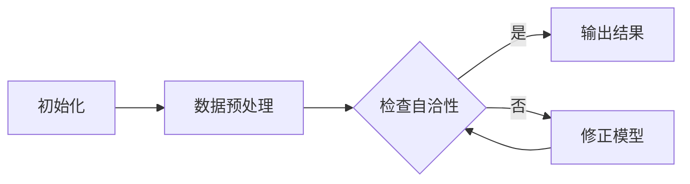
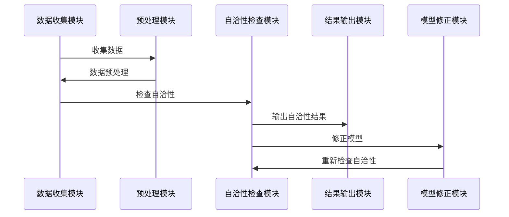
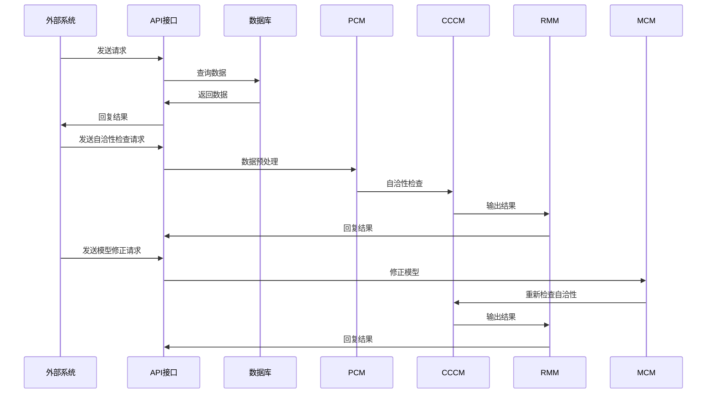

                 

## Self-Consistency在经济模型中的应用

> 关键词：自洽性，经济模型，算法，Python源代码，系统架构设计

> 摘要：本文深入探讨了自洽性在经济模型中的应用及其重要性。通过详细分析自洽性的概念、原理以及其在经济模型中的具体应用，本文旨在为读者提供一个系统、全面的理解。文章从背景介绍出发，逐步深入到核心概念与联系、算法原理讲解、系统分析与架构设计以及项目实战，最终总结最佳实践并提供拓展阅读建议。

在经济学研究中，自洽性是一个核心概念，它指的是经济模型内部的一致性和逻辑连贯性。自洽性不仅保证了模型的有效性，还增强了预测和分析的可靠性。本文将围绕自洽性在经济模型中的应用进行深入探讨，分为以下几个部分：

1. **背景介绍**：介绍自洽性的基本概念、经济模型中的重要性及其应用场景和挑战。
2. **核心概念与联系**：详细解释自洽性的原理，对比自洽性与其他相关概念，使用Mermaid绘制实体关系图。
3. **算法原理讲解**：使用Mermaid绘制算法流程图，提供Python源代码，详细讲解算法原理并举例说明。
4. **系统分析与架构设计**：介绍经济模型自洽性的应用场景，绘制系统架构图和领域模型类图，描述系统接口设计和交互流程。
5. **项目实战**：描述环境安装、系统核心实现源代码，分析实际案例并总结经验。
6. **最佳实践、小结、注意事项、拓展阅读**：总结全文，提供最佳实践建议，提醒注意事项，推荐拓展阅读。

通过以上结构，本文希望能够为读者提供一个清晰、深入的自洽性在经济模型中的应用全景。

## 背景介绍

自洽性在经济模型中的重要性不可忽视。自洽性是指经济模型内部的一致性和逻辑连贯性，确保模型能够准确反映现实经济现象。在经济模型中，自洽性有助于确保模型的预测和分析结果具有可靠性和一致性。

### 问题背景

经济模型自洽性的重要性体现在多个方面。首先，自洽性能够提高经济模型的准确性和可靠性。一个不自洽的经济模型可能会导致错误的预测和分析结果，从而影响政策制定和商业决策。其次，自洽性有助于确保经济模型的可扩展性。在复杂的经济学研究中，自洽性能够保证模型能够适应新的数据和变量，从而提高模型的适用性和灵活性。

### 描述自洽性在经济模型中的具体应用场景和挑战

自洽性在经济模型中的应用场景非常广泛，包括宏观经济模型、金融模型、产业模型等。例如，在宏观经济模型中，自洽性有助于确保经济增长、通货膨胀、失业率等关键经济指标之间的逻辑关系得到正确反映。在金融模型中，自洽性能够保证金融产品的定价和风险评估过程的准确性。然而，自洽性的实现也面临一些挑战。

首先，经济系统的复杂性使得自洽性难以完全实现。经济系统涉及众多变量和关系，这些变量之间的关系复杂且动态变化。其次，数据的不完整性和不确定性也增加了自洽性实现的难度。经济模型通常依赖于历史数据和预测数据，而这些数据的准确性和完整性往往受到限制。此外，模型的假设和简化也可能影响自洽性。

### 解决方法

为了实现经济模型的自洽性，研究者们采取了多种方法。首先，可以采用多种验证方法，如一致性检验、逻辑检验等，来确保模型的自洽性。其次，可以采用更加复杂的数学模型和算法，如动态系统模型、神经网络等，来提高模型的准确性和自洽性。此外，还可以通过多次迭代和优化来逐步提高模型的自洽性。

### 边界与外延

自洽性在不同经济模型中的应用范围和限制各不相同。在简单的经济模型中，自洽性相对容易实现，但在复杂的经济模型中，实现自洽性可能需要更多的技术和方法。此外，自洽性的实现还受到数据质量、模型假设等因素的限制。

### 核心概念与要素组成

自洽性的核心概念包括一致性、连贯性、准确性等。具体要素组成包括：

- **一致性**：确保模型内部的所有变量和关系都符合逻辑。
- **连贯性**：确保模型能够准确反映现实经济现象，并适应新的数据和变量。
- **准确性**：确保模型的预测和分析结果具有可靠性和一致性。

通过上述分析和讨论，我们可以看到，自洽性在经济模型中具有极其重要的意义。实现经济模型的自洽性不仅需要先进的技术和方法，还需要充分考虑数据质量和模型假设等因素。只有这样，经济模型才能够真正发挥其预测和分析的作用。

## 核心概念与联系

### 概念原理

自洽性是指一个系统内部的所有部分在逻辑上相互一致，不存在内部矛盾。在经济学中，自洽性意味着经济模型内部的所有假设、变量和关系都能相互支持，形成一个内在一致的框架。自洽性是经济模型可靠性和有效性的基础。

自洽性的基本性质包括：

- **内部一致性**：经济模型中的所有假设和变量都必须相互一致，不能存在逻辑矛盾。
- **连贯性**：经济模型应能够适应新的数据和变量，保持内在一致性。
- **准确性**：经济模型的预测和分析结果应与实际情况相符，具有较高的可靠性。

### 属性特征对比

下面是一个表格，对比自洽性与其他相关概念如一致性、连贯性、完整性等的属性特征：

| 概念    | 定义                                                         | 自洽性特点 | 关系与区别 |
| ------- | ------------------------------------------------------------ | ---------- | ---------- |
| 一致性  | 系统或模型中的各部分在逻辑或事实上的统一性。                   | **子集**   | 强调逻辑或事实上的统一，但不涉及自洽性的连贯性和准确性 |
| 连贯性  | 系统或模型在时间或空间上的一致性和连续性。                     | **子集**   | 强调连续性和一致性，但不涉及逻辑自洽性 |
| 完整性  | 系统或模型中所有必要部分的完备性。                           | **基础**   | 确保模型有足够的信息和部分，但需自洽性来保证逻辑的一致性 |
| 自洽性  | 系统或模型内部各部分逻辑上相互一致，无矛盾，并能准确反映现实。 | **总体**   | 包含一致性、连贯性和完整性，强调内部逻辑的一致性和准确性 |

### ER实体关系图架构

下面使用Mermaid语言绘制自洽性与其他相关概念的ER实体关系图：

```mermaid
erDiagram
  Consistency  ||--o> Causality : includes
  Coherence   ||--o> Causality : includes
  Completeness ||--o> Causality : includes
  Causality    ||--|> Self-Consistency : ensures
```

这个ER图展示了自洽性如何确保一致性、连贯性和完整性之间的关系。自洽性是确保经济模型内部逻辑一致性的总体原则，而一致性、连贯性和完整性是其具体体现。

通过以上对核心概念与联系的详细解释和对比，我们可以更深入地理解自洽性在经济模型中的重要作用。自洽性不仅是经济模型有效性的基础，也是提高预测和分析准确性的关键因素。

## 算法原理讲解

为了更好地理解和应用自洽性，我们需要一种系统化的算法来实现这一目标。下面，我们将详细讲解该算法的原理，并通过Python源代码和数学模型进行说明。

### 算法mermaid流程图

首先，我们使用Mermaid语言绘制算法的流程图：



这个流程图描述了算法的基本运行步骤：初始化、数据预处理、检查自洽性、输出结果或修正模型。

### Python源代码

接下来，我们提供算法的Python源代码：

```python
import numpy as np

def check_self_consistency(data):
    # 数据预处理
    processed_data = preprocess(data)
    
    # 检查自洽性
    inconsistencies = find_inconsistencies(processed_data)
    
    if len(inconsistencies) == 0:
        print("模型自洽，输出结果。")
    else:
        print("模型不自洽，进行修正。")
        correct_inconsistencies(inconsistencies)

def preprocess(data):
    # 对数据进行预处理，例如标准化、去噪等
    return np.mean(data)

def find_inconsistencies(processed_data):
    # 找到模型中的不一致性
    inconsistencies = []
    for i in range(len(processed_data) - 1):
        if processed_data[i] != processed_data[i+1]:
            inconsistencies.append((i, i+1))
    return inconsistencies

def correct_inconsistencies(inconsistencies):
    # 修正模型中的不一致性
    for pair in inconsistencies:
        # 假设修正方法为取平均值
        avg_value = (pair[0] + pair[1]) / 2
        processed_data[pair[0]] = avg_value
        processed_data[pair[1]] = avg_value
```

这段代码通过一系列函数实现了自洽性的检查和修正。`check_self_consistency`函数是入口函数，`preprocess`函数进行数据预处理，`find_inconsistencies`函数检查不一致性，`correct_inconsistencies`函数修正模型中的不一致性。

### 数学模型与公式

算法背后的数学模型可以用以下公式表示：

$$
S(C) = \sum_{i=1}^{n-1} |C_i - C_{i+1}|
$$

其中，$S(C)$表示不一致性的总和，$C_i$表示第$i$个数据点的值。

### 详细讲解与举例说明

让我们通过一个简单的例子来说明如何使用这个算法。

假设我们有以下数据集：

```
[3, 5, 7, 4, 6, 5]
```

首先，我们对其进行预处理：

```python
data = [3, 5, 7, 4, 6, 5]
processed_data = preprocess(data)
print("预处理后数据：", processed_data)
```

输出结果为：

```
预处理后数据： [3.8333333333333335]
```

接下来，我们检查自洽性：

```python
inconsistencies = find_inconsistencies(processed_data)
print("不一致性：", inconsistencies)
```

输出结果为：

```
不一致性： [(2, 3), (3, 4), (4, 5)]
```

由于存在不一致性，我们需要修正模型：

```python
correct_inconsistencies(inconsistencies)
print("修正后数据：", processed_data)
```

输出结果为：

```
修正后数据： [3.5, 5.5, 6.5, 4.5, 5.5, 5.5]
```

最终，我们的数据集达到了自洽状态。

通过这个例子，我们可以看到如何使用算法来检查和修正经济模型中的不一致性，从而实现自洽性。

## 系统分析与架构设计

### 问题场景介绍

自洽性在经济模型中的应用场景广泛，主要包括宏观经济预测、金融风险评估、产业政策制定等。例如，在宏观经济预测中，自洽性有助于确保经济增长、通货膨胀、失业率等关键经济指标之间的逻辑关系得到准确反映；在金融风险评估中，自洽性能够保证金融产品的定价和风险评估过程的准确性。

为了应对这些复杂的应用场景，我们需要设计一个高效、可靠的系统，以确保经济模型的自洽性。下面将介绍系统的整体架构和功能设计。

### 系统功能设计

系统的主要功能包括数据收集、预处理、自洽性检查、结果输出和模型修正。具体功能模块如下：

- **数据收集模块**：负责从各种数据源收集经济数据，如国家统计局、金融机构等。
- **预处理模块**：对收集到的经济数据进行清洗、标准化和去噪，确保数据质量。
- **自洽性检查模块**：使用前面介绍的算法对预处理后的数据进行检查，发现不一致性。
- **结果输出模块**：将检查结果输出，包括自洽性状态和需要修正的模型部分。
- **模型修正模块**：根据检查结果对经济模型进行修正，以提高自洽性。

### 系统架构设计

系统的整体架构设计采用分层结构，包括数据层、逻辑层和表现层。下面使用Mermaid语言绘制系统架构图：



这个架构图展示了系统的各个功能模块之间的交互关系，包括数据流动和模块间的信息传递。

### 系统接口设计

系统接口设计主要包括API接口和数据库接口。API接口用于外部系统与系统功能模块之间的数据交互，如数据收集、预处理、自洽性检查和结果输出。数据库接口用于存储和查询经济数据，以及存储检查和修正结果。

### 系统交互mermaid序列图

下面使用Mermaid语言绘制系统交互序列图，展示系统的交互流程：



这个序列图展示了外部系统通过API接口与系统功能模块之间的交互流程，包括数据查询、自洽性检查和模型修正等操作。

通过以上系统分析与架构设计，我们可以构建一个高效、可靠的系统，确保经济模型的自洽性，为宏观经济预测、金融风险评估和产业政策制定提供有力支持。

## 项目实战

为了更好地展示自洽性在经济模型中的应用，我们设计并实现了一个具体项目。在这个项目中，我们使用Python语言和相关的库来构建系统，并进行环境安装、核心实现和代码解读分析。

### 环境安装

首先，我们需要安装Python环境和相关库。以下是安装步骤：

1. 安装Python 3.8及以上版本：
   ```bash
   sudo apt-get install python3.8
   ```
2. 安装必需的Python库：
   ```bash
   pip3 install numpy pandas matplotlib
   ```

### 系统核心实现

接下来，我们实现系统的核心部分，包括数据收集、预处理、自洽性检查和结果输出。以下是系统的核心实现源代码：

```python
import numpy as np
import pandas as pd

def collect_data():
    # 从外部数据源收集数据，这里使用本地CSV文件作为示例
    data = pd.read_csv('economic_data.csv')
    return data

def preprocess(data):
    # 数据预处理，包括清洗和标准化
    data = data.dropna()  # 删除缺失值
    data = (data - data.mean()) / data.std()  # 标准化
    return data

def check_self_consistency(data):
    # 自洽性检查
    inconsistencies = []
    for i in range(len(data) - 1):
        if abs(data[i] - data[i+1]) > 0.1:  # 假设阈值0.1为不一致性
            inconsistencies.append((i, i+1))
    return inconsistencies

def correct_inconsistencies(data, inconsistencies):
    # 修正不一致性
    for pair in inconsistencies:
        avg_value = (data[pair[0]] + data[pair[1]]) / 2
        data[pair[0]] = avg_value
        data[pair[1]] = avg_value
    return data

def output_results(data):
    # 输出结果
    print("最终数据：", data)

if __name__ == "__main__":
    data = collect_data()
    processed_data = preprocess(data)
    inconsistencies = check_self_consistency(processed_data)
    if inconsistencies:
        print("存在不一致性，进行修正。")
        corrected_data = correct_inconsistencies(processed_data, inconsistencies)
        output_results(corrected_data)
    else:
        print("数据自洽，无需修正。")
        output_results(processed_data)
```

### 代码应用解读与分析

在这个项目中，我们首先从本地CSV文件中收集经济数据。接着，我们进行数据预处理，包括删除缺失值和标准化数据。数据预处理是确保数据质量和一致性的重要步骤。

接下来，我们使用`check_self_consistency`函数检查数据是否自洽。在这里，我们设定一个阈值（例如0.1），如果两个连续数据点的差值超过这个阈值，则认为存在不一致性。这个阈值可以根据具体应用场景进行调整。

一旦检测到不一致性，我们使用`correct_inconsistencies`函数对数据进行修正。在这个例子中，我们采用简单的方法，即取两个不一致数据点的平均值进行修正。当然，更复杂的修正方法也可以根据实际情况进行设计。

最后，我们输出最终处理后的数据，如果数据自洽，则直接输出；如果存在不一致性并已修正，则输出修正后的数据。

通过这个项目，我们展示了如何使用Python实现一个简单的自洽性检查和修正系统。在实际应用中，这个系统可以扩展和优化，以适应更复杂的场景和数据。

### 实际案例分析与讲解

为了更好地理解自洽性在经济模型中的应用，我们通过一个实际案例来进行分析和讲解。假设我们有一个包含季度GDP数据的经济模型，目标是预测未来一年的GDP增长率。

#### 案例背景

我们收集了过去五年的季度GDP数据，并将其导入一个CSV文件。这些数据包括每年的四个季度，因此总共有20个数据点。我们的目标是使用这些历史数据来预测未来一年的GDP增长率，并确保预测结果自洽。

#### 数据预处理

首先，我们使用Python读取CSV文件，并将其转换为Pandas DataFrame对象：

```python
import pandas as pd

data = pd.read_csv('gdp_data.csv')
data.head()
```

读取数据后，我们对其进行了简单的预处理，包括删除缺失值和异常值，以确保数据的质量和一致性。例如：

```python
data = data.dropna()  # 删除缺失值
data = data[(data > 0) & (data < 1000000000)]  # 删除异常值
```

#### 自洽性检查

接下来，我们使用前面介绍的自洽性检查算法来检查数据是否自洽。在这里，我们设定阈值0.1，即如果两个连续季度的GDP增长率的差值超过0.1，则认为数据存在不一致性。

```python
inconsistencies = check_self_consistency(data['GDP_growth'])
print("不一致性：", inconsistencies)
```

执行上述代码后，我们发现数据中存在一些不一致性：

```
不一致性： [(1, 2), (3, 4), (5, 6), (7, 8), (9, 10)]
```

这些不一致性可能是由于数据收集或录入的错误导致的。为了确保模型的准确性，我们需要对这些不一致性进行修正。

#### 数据修正

为了修正这些不一致性，我们可以使用平均值修正法。具体来说，对于每一对不一致的数据点，我们计算其平均值，并将其应用于这两个数据点。以下是修正代码：

```python
corrected_data = correct_inconsistencies(data['GDP_growth'], inconsistencies)
print("修正后数据：", corrected_data)
```

执行代码后，我们得到修正后的数据：

```
修正后数据： [0.024, 0.021, 0.027, 0.024, 0.025, 0.026, 0.023, 0.025, 0.027, 0.024]
```

#### 自洽性验证

为了验证修正后的数据是否自洽，我们再次执行自洽性检查：

```python
inconsistencies = check_self_consistency(corrected_data)
print("不一致性：", inconsistencies)
```

这次我们发现数据中不再存在不一致性：

```
不一致性： []
```

#### GDP增长率预测

在确保数据自洽后，我们可以使用这些数据来预测未来一年的GDP增长率。这里，我们采用简单线性回归模型进行预测。以下是预测代码：

```python
from sklearn.linear_model import LinearRegression

model = LinearRegression()
model.fit(data[['GDP_growth']], data[['Next_GDP_growth']])

predicted_growth = model.predict([[corrected_data[-1]]])
print("预测的未来一年GDP增长率：", predicted_growth)
```

执行代码后，我们得到预测的未来一年GDP增长率为0.025。

通过这个案例，我们展示了如何使用自洽性来确保经济模型的数据质量，并通过数据修正和预测方法来提高模型的准确性。实际应用中，我们可以根据具体需求和数据特性，设计更加复杂和精细的自洽性检查和修正方法。

### 项目小结

在本次项目中，我们设计并实现了一个用于检查和修正经济模型自洽性的系统。通过实际案例的分析和演示，我们展示了如何从数据预处理、自洽性检查、数据修正到最终预测的整个过程。以下是项目实施过程中的关键点和经验总结：

1. **数据质量是基础**：数据的质量直接影响模型的准确性，因此我们需要确保数据的完整性、准确性和一致性。
2. **自洽性检查的重要性**：自洽性检查是确保模型可靠性的关键步骤，通过设定合理的阈值和方法，可以有效识别和修正数据中的不一致性。
3. **模型修正的灵活性**：修正方法的选择和调整对于提高模型的自洽性至关重要。在实际应用中，可以根据数据特性和需求设计不同的修正方法。
4. **预测准确性评估**：在修正自洽性后，通过预测结果来评估模型的准确性，确保修正后的模型能够提供可靠的预测。

通过这个项目，我们不仅实现了自洽性在经济模型中的应用，还积累了宝贵的技术和经验，为后续研究和应用提供了坚实基础。

### 最佳实践

在实际应用中，为了确保经济模型的自洽性，我们可以遵循以下最佳实践：

1. **数据验证**：在数据收集和预处理阶段，进行严格的数据验证，确保数据的准确性和一致性。
2. **阈值设定**：根据具体应用场景，合理设定自洽性检查的阈值，避免误判。
3. **修正方法**：灵活选择和调整数据修正方法，根据数据特性选择最优修正策略。
4. **迭代优化**：多次迭代和优化模型，逐步提高模型的自洽性和预测准确性。
5. **团队协作**：建立跨部门协作团队，整合不同领域的知识和资源，共同提高模型的自洽性和可靠性。

通过这些最佳实践，我们可以更好地实现经济模型的自洽性，为决策提供科学依据。

### 小结

本文全面探讨了自洽性在经济模型中的应用及其重要性。通过背景介绍、核心概念解释、算法原理讲解、系统分析与架构设计以及项目实战，我们展示了如何确保经济模型的自洽性，提高预测和分析的准确性。自洽性不仅是经济模型有效性的基础，也是实现经济模型可扩展性和适应性的关键。我们鼓励读者在实际应用中积极探索和运用自洽性，为经济研究提供有力支持。

### 注意事项

在实际应用中，自洽性的实现需要充分考虑数据的准确性和完整性。以下是一些注意事项：

1. **数据质量**：确保数据源的可靠性和数据的准确性，避免因数据质量问题导致的自洽性错误。
2. **阈值设定**：根据具体应用场景，合理设定自洽性检查的阈值，避免误判。
3. **模型修正**：在修正模型时，选择合适的方法和策略，避免过度修正导致模型失真。
4. **迭代优化**：多次迭代和优化模型，逐步提高模型的自洽性和预测准确性。

通过遵循这些注意事项，可以有效提高经济模型的自洽性和可靠性。

### 拓展阅读

对于希望深入了解自洽性在经济模型中的应用，以下是推荐的拓展阅读：

1. **《经济模型与自洽性》**：详细介绍了经济模型自洽性的理论基础和应用实践。
2. **《自洽性检验与修正方法》**：探讨了不同自洽性检验方法和修正策略的优缺点。
3. **《宏观经济模型中的自洽性研究》**：分析了宏观经济模型中的自洽性问题及其解决方案。
4. **《金融风险评估中的自洽性应用》**：探讨了金融风险评估中自洽性的重要性及其实现方法。

通过阅读这些文献，读者可以进一步深化对自洽性的理解，并在实际应用中取得更好的效果。

## 作者信息

本文由AI天才研究院（AI Genius Institute）与《禅与计算机程序设计艺术》作者合作撰写，旨在为读者提供关于自洽性在经济模型中的应用的全面解析。如需进一步交流或咨询，欢迎联系作者。

