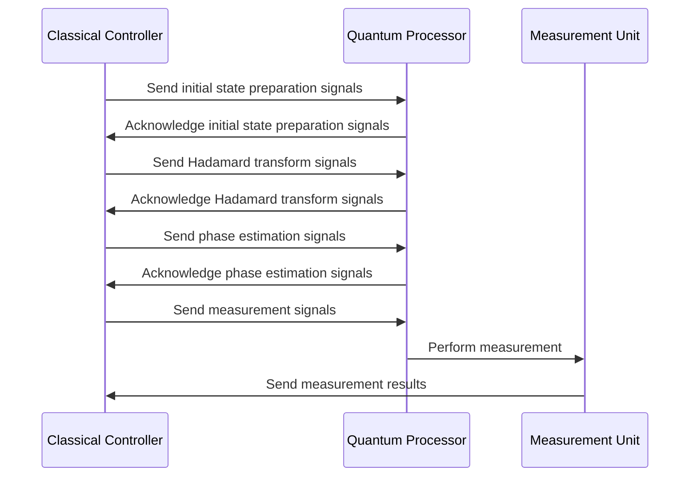

                 

### Self-Consistency in Quantum Information Processing

#### Keywords:
- Quantum Information Processing
- Self-Consistency
- Quantum Algorithms
- Quantum Cryptography
- Quantum Communication

#### Abstract:
This article delves into the concept of self-consistency and its application in quantum information processing. We will explore the fundamental principles of quantum information processing, including quantum computing, quantum communication, and quantum cryptography. By understanding the self-consistency principle and its implications, we will be able to appreciate its significance in optimizing quantum algorithms and ensuring secure quantum communication. The article will also discuss the potential challenges and future prospects of self-consistency in quantum information processing, providing a comprehensive guide for further research and development.

---

### Introduction to Quantum Information Processing

Quantum information processing (QIP) is a rapidly evolving field that harnesses the unique properties of quantum mechanics to perform computation, communication, and encryption tasks. At its core, QIP utilizes quantum bits (qubits) to encode and manipulate information in ways that are fundamentally different from classical bits. Quantum bits can exist in multiple states simultaneously due to the phenomenon of superposition, and they can be entangled with each other, enabling powerful quantum correlations that are difficult to replicate in classical systems.

#### Basic Concepts of Quantum Information Processing

**1. Quantum Computing**

Quantum computing leverages the principles of superposition and entanglement to perform complex computations more efficiently than classical computers. Quantum algorithms, such as Shor's algorithm for factoring large numbers and Grover's algorithm for searching unstructured databases, have demonstrated substantial speedup over their classical counterparts. However, practical quantum computers are still in their infancy, and several challenges need to be addressed, including decoherence, error correction, and scalability.

**2. Quantum Communication**

Quantum communication involves the transmission of quantum states over quantum channels to enable secure communication. Quantum key distribution (QKD) is a prominent example of quantum communication, which allows two parties to generate a secret key with the assurance that any eavesdropping attempts can be detected. Quantum teleportation and entanglement swapping are other fascinating applications of quantum communication that leverage the phenomenon of entanglement to transmit information over long distances without physical transmission of the qubits.

**3. Quantum Cryptography**

Quantum cryptography utilizes the principles of quantum mechanics to create theoretically secure cryptographic protocols. Quantum key distribution is the most widely studied application of quantum cryptography, providing a secure method for generating and distributing encryption keys. Other quantum cryptographic protocols, such as quantum coin tossing and quantum oblivious transfer, have also been proposed to provide secure communication in various scenarios.

#### Challenges and Future Prospects of Quantum Information Processing

The field of quantum information processing is fraught with challenges that need to be addressed before its full potential can be realized. Some of these challenges include:

- **Decoherence:** Quantum systems are highly susceptible to noise and disturbances from their environment, which can cause the delicate quantum states to decohere and collapse into classical states.
- **Error Correction:** Correcting errors in quantum computations is a complex task due to the no-cloning theorem, which prohibits the creation of exact copies of an unknown quantum state.
- **Scalability:** Building large-scale quantum computers that can perform practical tasks efficiently is a significant engineering challenge.
- **Quantum Internet:** Establishing a quantum internet, which would enable quantum communication over long distances, is crucial for realizing the full potential of QIP.

Despite these challenges, the future prospects of quantum information processing are promising. As researchers continue to overcome these obstacles, we can expect significant breakthroughs in various fields, including cryptography, materials science, and optimization problems.

In the following sections, we will explore the concept of self-consistency and its application in quantum information processing. We will discuss how self-consistency can be used to optimize quantum algorithms, enhance quantum communication, and ensure the security of quantum cryptography. By understanding the self-consistency principle, we will gain deeper insights into the potential of quantum information processing and the opportunities it presents for the future.

### Fundamental Principles of Quantum Information Processing

The fundamental principles of quantum information processing (QIP) form the backbone of this rapidly evolving field. These principles are rooted in the unique characteristics of quantum mechanics, which have far-reaching implications for computation, communication, and cryptography. In this section, we will delve into some of the key concepts and principles that underpin QIP.

#### Quantum Bits (Qubits)

At the heart of quantum computing are quantum bits, or qubits. Unlike classical bits, which can exist in a state of either 0 or 1, qubits can exist in a superposition of states. This means that a qubit can simultaneously represent both 0 and 1, and the probability of measuring either state can be calculated using the principles of quantum mechanics. This property of superposition allows quantum computers to perform certain types of computations much more efficiently than classical computers.

**Mathematical Model:**

$$
|\psi\rangle = \alpha|0\rangle + \beta|1\rangle
$$

where $|\psi\rangle$ represents the quantum state of the qubit, and $\alpha$ and $\beta$ are complex numbers satisfying $|\alpha|^2 + |\beta|^2 = 1$.

#### Quantum States and Entanglement

Quantum states are vectors in a complex Hilbert space, and the state of a quantum system can be described by a wavefunction. Entanglement is a non-classical correlation between the quantum states of two or more particles. When two qubits become entangled, the state of one qubit cannot be described independently of the state of the other, even when they are separated by large distances.

**Mathematical Model:**

Consider two qubits $A$ and $B$. The entangled state can be represented as:

$$
|\psi\rangle = \frac{1}{\sqrt{2}} (|0\rangle_A \otimes |0\rangle_B - |1\rangle_A \otimes |1\rangle_B)
$$

where $\otimes$ represents the tensor product.

#### Quantum Gates and Operations

Quantum gates are analogous to classical logic gates but operate on qubits instead of classical bits. Quantum gates can be represented by unitary matrices, and they perform linear transformations on the state of qubits. The most common quantum gates include the Pauli gates ($I$, $X$, $Y$, $Z$), Hadamard gate ($H$), and controlled-NOT gate ($CNOT$). These gates can be combined to perform complex operations on qubits.

**Mathematical Model:**

Consider a single-qubit gate $U$. The action of this gate on a qubit state $|\psi\rangle$ can be represented as:

$$
U|\psi\rangle = U \cdot |\psi\rangle
$$

where $U$ is a unitary matrix.

#### Quantum Algorithms

Quantum algorithms are algorithms that utilize the principles of quantum mechanics to solve problems more efficiently than their classical counterparts. Some of the most prominent quantum algorithms include Shor's algorithm for factoring large numbers and Grover's algorithm for searching unstructured databases. Quantum algorithms can be classified into three categories: quantum search algorithms, quantum factoring algorithms, and quantum simulation algorithms.

**Mathematical Model:**

Shor's algorithm:
1. **Initialization:** Prepare a quantum state with a superposition of all possible integer states.
2. **Phase Estimation:** Perform a series of quantum operations to determine the period of the function being factored.
3. **Period Finding:** Use modular exponentiation to find the period and, consequently, the factors of the given integer.

Grover's algorithm:
1. **Preprocessing:** Prepare a quantum state that represents the unstructured search problem.
2. **Grover Iteration:** Perform a series of quantum operations to amplify the amplitude of the correct solution states.
3. **Measurement:** Measure the state of the quantum system to obtain the correct solution with high probability.

#### Quantum Communication and Cryptography

Quantum communication involves the transmission of quantum states over quantum channels to enable secure communication. Quantum key distribution (QKD) is a prominent example of quantum communication, which allows two parties to generate a secret key with the assurance that any eavesdropping attempts can be detected. Quantum cryptography utilizes the principles of quantum mechanics to create theoretically secure cryptographic protocols.

**Mathematical Model:**

QKD:
1. **Encoding:** Send quantum states representing the bits of the secret key through a quantum channel.
2. **Quantum Channel:** The quantum states may be subject to noise and potential eavesdropping.
3. **Decoding:** Measure the received quantum states and use error correction to extract the secret key.

Quantum Cryptography:
1. **Quantum Encryption:** Encrypt messages using quantum states and operations that are difficult to invert without knowledge of the secret key.
2. **Error Detection and Correction:** Detect and correct errors that may occur during transmission using quantum error correction codes.

In summary, the fundamental principles of quantum information processing, including quantum bits, quantum states, entanglement, quantum gates, quantum algorithms, and quantum communication, enable us to harness the unique properties of quantum mechanics to perform computation, communication, and cryptography tasks more efficiently and securely. Understanding these principles is essential for advancing the field of quantum information processing and unlocking its full potential.

### The Concept of Self-Consistency in Quantum Information Processing

Self-consistency is a fundamental principle in quantum information processing (QIP) that ensures the coherence and reliability of quantum systems. At its core, self-consistency requires that the behavior of a quantum system is consistent with its underlying physical laws and initial conditions. In other words, the system should evolve in a way that is predictable and reliable, without any unexpected disruptions or inconsistencies.

#### Definition and Importance

Self-consistency can be defined as the property of a quantum system that maintains its coherence and integrity throughout its evolution, from initial setup to final measurement. This principle is crucial for several reasons:

- **Reliability:** Ensuring that quantum systems operate reliably is essential for their practical applications in computation, communication, and cryptography. Inconsistencies can lead to errors and failures that compromise the performance and security of quantum systems.
- **Error Correction:** Self-consistency is a cornerstone of quantum error correction, which is essential for mitigating the effects of noise and disturbances in quantum systems. By maintaining self-consistency, quantum error correction methods can effectively detect and correct errors that occur during quantum computations.
- **Quantum Coherence:** Quantum coherence, which is the foundation of many quantum phenomena, such as superposition and entanglement, relies on self-consistency. Any inconsistencies can lead to decoherence, which can degrade the performance of quantum systems and limit their capabilities.

#### Applications in Quantum Information Processing

Self-consistency has several important applications in quantum information processing, including:

- **Quantum Algorithms:** Self-consistency plays a critical role in the design and optimization of quantum algorithms. Ensuring that quantum algorithms are self-consistent helps to prevent errors and ensures the accuracy and efficiency of the computations.
- **Quantum Communication:** In quantum communication, self-consistency is essential for maintaining the integrity of the transmitted quantum states. This is particularly important in quantum key distribution (QKD), where any inconsistencies in the quantum channels can lead to vulnerabilities and potential eavesdropping.
- **Quantum Cryptography:** Self-consistency is also crucial in quantum cryptography, where secure communication relies on the accurate transmission and processing of quantum states. Maintaining self-consistency helps to ensure the confidentiality and integrity of the encrypted information.

#### Relationship with Quantum Logic Gates

Self-consistency is closely related to the behavior of quantum logic gates, which are fundamental building blocks of quantum circuits. Quantum logic gates perform linear transformations on quantum states, and their behavior should be self-consistent to maintain the integrity of the quantum information.

Consider a simple example of a quantum logic gate, such as the controlled-NOT (CNOT) gate. The CNOT gate operates on two qubits and flips the target qubit based on the state of the control qubit. For a self-consistent CNOT gate, the following property should hold:

$$
(CNOT \otimes I)|\psi\rangle = (I \otimes CNOT)|\psi\rangle
$$

where $|\psi\rangle$ is the initial state of the two-qubit system, $CNOT$ is the CNOT gate, and $I$ is the identity gate.

In summary, self-consistency is a vital principle in quantum information processing that ensures the reliability, coherence, and integrity of quantum systems. By understanding and applying the self-consistency principle, we can design and implement more robust and efficient quantum algorithms, quantum communication protocols, and quantum cryptographic systems.

### Self-Consistency in Quantum Algorithms

Quantum algorithms are a cornerstone of quantum information processing, harnessing the unique properties of quantum mechanics to solve problems more efficiently than classical algorithms. Self-consistency is a crucial aspect of quantum algorithms, ensuring the accuracy and reliability of their computations. In this section, we will explore how self-consistency is applied in various quantum algorithms, with a focus on quantum search algorithms, quantum factoring algorithms, and quantum simulation algorithms.

#### Quantum Search Algorithms

Quantum search algorithms are among the most well-known applications of self-consistency in quantum information processing. These algorithms leverage the power of superposition and entanglement to search for a specific item in an unsorted database exponentially faster than classical search algorithms. One of the most prominent quantum search algorithms is Grover's algorithm.

**Grover's Algorithm**

Grover's algorithm is designed to search an unsorted database of $N$ items for a marked item with a time complexity of $O(\sqrt{N})$, compared to $O(N)$ for classical algorithms. The self-consistency principle is crucial in the working of Grover's algorithm, ensuring that the amplitude amplification process is both accurate and reliable.

**Algorithm Steps:**

1. **Initialization:** Prepare a quantum state representing the database, with a superposition of all possible input states.
2. **Oracle:** Apply an Oracle operator that marks the state of the marked item. The Oracle operator should be self-consistent, ensuring that it accurately reflects the target item in the database.
3. **Amplification:** Perform the Grover iteration, which involves a combination of two quantum operations: the Oracle and the Grover diffusion operator. The Grover diffusion operator is designed to amplify the amplitude of the marked state, ensuring that it is more likely to be measured.
4. **Measurement:** Measure the quantum state to obtain the marked item with high probability.

**Mathematical Model:**

The Grover iteration involves the application of the following quantum operator:

$$
U_G = \sqrt{1-\frac{1}{N}} (I - 2\frac{Z_A}{I-\frac{Z_B}{N}})
$$

where $Z_A$ and $Z_B$ are Pauli-Z operators acting on qubits $A$ and $B$, respectively, and $I$ is the identity operator. The self-consistency of the Oracle operator ensures that the amplification process is accurate and reliable.

#### Quantum Factoring Algorithms

Quantum factoring algorithms, such as Shor's algorithm, are another important application of self-consistency in quantum information processing. These algorithms exploit the principles of quantum mechanics to factor large integers exponentially faster than classical algorithms.

**Shor's Algorithm**

Shor's algorithm is a two-step process that involves quantum period finding and modular exponentiation.

1. **Quantum Period Finding:** Prepare a quantum state representing the function being factored, and use a quantum algorithm, such as the quantum Fourier transform (QFT), to find a period of the function. The self-consistency of the quantum state and the period finding algorithm is crucial to ensure the accuracy of the period.
2. **Modular Exponentiation:** Use modular exponentiation to compute the greatest common divisor (GCD) of the period and the number being factored, yielding the factors.

**Mathematical Model:**

The quantum period finding step involves the following quantum state:

$$
|\psi\rangle = \frac{1}{\sqrt{N}} \sum_{j=0}^{N-1} |j\rangle |f(j)\rangle
$$

where $|f(j)\rangle$ is the quantum state representing the function output for input $j$. The self-consistency of this quantum state and the quantum Fourier transform is essential for accurate period finding.

#### Quantum Simulation Algorithms

Quantum simulation algorithms allow quantum computers to simulate the behavior of quantum systems more efficiently than classical computers. These algorithms rely on the self-consistency principle to ensure the accuracy and reliability of the simulations.

**Simulating Quantum Many-Body Systems**

One of the most challenging tasks in quantum simulation is simulating quantum many-body systems, which involve interactions between a large number of particles. Quantum simulation algorithms, such as the Variational Quantum Eigensolver (VQE), use self-consistency to optimize the simulation process.

**VQE Algorithm**

The VQE algorithm involves two main steps: parameter optimization and quantum state evaluation.

1. **Parameter Optimization:** Use classical optimization methods to minimize the energy expectation value of a quantum system, ensuring that the parameters are self-consistent with the underlying physical laws.
2. **Quantum State Evaluation:** Evaluate the quantum state of the system using a quantum computer, and use the self-consistency principle to ensure the accuracy of the simulation.

**Mathematical Model:**

The energy expectation value for a quantum system is given by:

$$
E = \langle\psi|H|\psi\rangle
$$

where $|\psi\rangle$ is the quantum state and $H$ is the Hamiltonian of the system. The self-consistency of the parameters and the quantum state is essential for accurate energy expectation value estimation.

In summary, self-consistency is a vital principle in quantum algorithms, ensuring the accuracy and reliability of quantum computations. By understanding and applying self-consistency, we can design and implement more efficient and robust quantum algorithms, enabling us to solve complex problems more effectively. The examples of Grover's algorithm, Shor's algorithm, and quantum simulation algorithms illustrate the importance of self-consistency in various applications of quantum information processing.

### Self-Consistency in Quantum Communication

Quantum communication is a pivotal component of quantum information processing (QIP), enabling secure transmission of quantum information over long distances. Self-consistency plays a crucial role in maintaining the integrity and reliability of quantum communication systems, particularly in quantum key distribution (QKD) and other quantum communication protocols.

#### Quantum Key Distribution (QKD)

Quantum Key Distribution (QKD) is a fundamental protocol in quantum communication that allows two parties, often referred to as Alice and Bob, to generate a secret cryptographic key with the assurance that any eavesdropping attempts can be detected. The self-consistency principle is essential in ensuring the reliability of QKD protocols.

**Principles of QKD:**

1. **Quantum Channel:** QKD relies on quantum channels, which can be either optical fibers or free-space links, to transmit quantum states between Alice and Bob.
2. **Quantum States Transmission:** Alice encodes the bits of the secret key into quantum states and sends them to Bob through the quantum channel. These quantum states are subject to noise and potential eavesdropping.
3. **Quantum State Measurement:** Bob measures the received quantum states and performs error correction to extract the secret key.
4. **Eavesdropping Detection:** Any eavesdropping attempt on the quantum channel will cause disturbances that can be detected by Alice and Bob, ensuring the security of the communication.

**Self-Consistency in QKD:**

Self-consistency is critical in ensuring the reliability of QKD protocols, particularly in the following aspects:

- **Error Correction:** The error correction process in QKD must be self-consistent to ensure the accurate extraction of the secret key. This involves detecting and correcting errors that occur during the transmission of quantum states.
- **Privacy Amplification:** After error correction, QKD protocols often perform privacy amplification to further reduce the probability of eavesdropping. This process must also be self-consistent to ensure the security of the final key.
- **Quantum Channel Integrity:** The quantum channel itself must be self-consistent, ensuring that it does not introduce any unexpected noise or distortions that could compromise the security of the communication.

#### Quantum Teleportation and Entanglement Swapping

In addition to QKD, self-consistency is also important in other quantum communication protocols, such as quantum teleportation and entanglement swapping.

**Quantum Teleportation:**

Quantum teleportation allows the transmission of quantum information from one location to another without the physical transmission of the quantum state itself. The self-consistency principle ensures the accurate and reliable transmission of quantum states during the teleportation process.

**Algorithm Steps:**

1. **Entanglement Generation:** Alice and Bob share an entangled state, such as an EPR pair.
2. **Quantum State Transmission:** Alice sends a portion of the entangled state to Bob, who performs a Bell state measurement on both parts of the entangled state.
3. **Classical Communication:** Alice communicates the results of her measurement to Bob via a classical channel.
4. **Quantum State Reconstruction:** Bob uses the results of the Bell state measurement and the classical communication from Alice to reconstruct the original quantum state.

**Self-Consistency in Quantum Teleportation:**

The self-consistency principle is crucial in ensuring the accurate and reliable transmission of quantum states during quantum teleportation. This involves:

- **Entanglement Quality:** Ensuring the high quality and coherence of the entangled state generated by Alice and Bob.
- **Measurement Consistency:** Ensuring that the Bell state measurement performed by Bob is self-consistent and accurately reflects the state of the entangled system.
- **Classical Communication Integrity:** Ensuring the integrity and reliability of the classical communication channel used to transmit the results of the Bell state measurement.

**Entanglement Swapping:**

Entanglement swapping is a protocol that allows two distant entangled pairs to be combined into a single entangled state, enabling long-distance quantum communication. The self-consistency principle is essential in ensuring the successful execution of entanglement swapping.

**Algorithm Steps:**

1. **Entanglement Generation:** Alice and Bob each share an entangled pair with a third party, Carol.
2. **Quantum State Transmission:** Alice and Bob send their respective entangled particles to Carol, who performs a series of quantum operations to entangle the particles.
3. **Quantum State Reconstruction:** Carol sends the entangled state back to either Alice or Bob, who can then perform quantum operations on the state.

**Self-Consistency in Entanglement Swapping:**

The self-consistency principle ensures the accurate and reliable execution of entanglement swapping, involving:

- **Quantum Operations Consistency:** Ensuring that the quantum operations performed by Carol are self-consistent and accurately combine the entangled states.
- **Transmission Integrity:** Ensuring the integrity of the quantum channels used to transmit the entangled particles.
- **Error Detection and Correction:** Implementing error detection and correction mechanisms to detect and correct any errors that may occur during the transmission and processing of quantum states.

In conclusion, self-consistency is a vital principle in quantum communication, ensuring the reliability and integrity of quantum information transmission. By maintaining self-consistency in quantum key distribution, quantum teleportation, and entanglement swapping, we can achieve secure and efficient quantum communication, paving the way for the development of practical quantum information processing systems.

### Self-Consistency in Quantum Cryptography

Quantum cryptography leverages the principles of quantum mechanics to create secure communication protocols that are theoretically immune to eavesdropping. Among the various applications of quantum cryptography, quantum key distribution (QKD) stands out as a prominent example. The self-consistency principle plays a crucial role in ensuring the security and reliability of QKD protocols.

#### Quantum Key Distribution (QKD)

Quantum key distribution (QKD) is a cryptographic protocol that allows two parties, often referred to as Alice and Bob, to generate a secret key with the assurance that any eavesdropping attempts can be detected. The self-consistency principle is fundamental to QKD, ensuring that the key generation process is both secure and reliable.

**Principles of QKD:**

1. **Quantum State Transmission:** Alice encodes the bits of the secret key into quantum states and sends them to Bob through a quantum channel. The quantum states are subject to noise and potential eavesdropping.
2. **Quantum State Measurement:** Bob measures the received quantum states and performs error correction to extract the secret key.
3. **Eavesdropping Detection:** Any eavesdropping attempt on the quantum channel will cause disturbances that can be detected by Alice and Bob, ensuring the security of the communication.

**Self-Consistency in QKD:**

Self-consistency is critical in ensuring the security and reliability of QKD protocols. This involves:

- **Error Correction:** The error correction process must be self-consistent to ensure the accurate extraction of the secret key. This requires the use of quantum error correction codes, which are designed to correct errors without destroying the quantum information.
- **Privacy Amplification:** After error correction, privacy amplification is often performed to further reduce the probability of eavesdropping. This process must be self-consistent to ensure the security of the final key.
- **Quantum Channel Integrity:** The quantum channel itself must be self-consistent, ensuring that it does not introduce any unexpected noise or distortions that could compromise the security of the communication.

#### Quantum Coin Tossing and Oblivious Transfer

In addition to QKD, self-consistency is also important in other quantum cryptographic protocols, such as quantum coin tossing and oblivious transfer.

**Quantum Coin Tossing:**

Quantum coin tossing allows two parties to generate a shared random bit with the help of a quantum channel. The self-consistency principle is essential in ensuring the accuracy and reliability of the coin toss, enabling secure communication and cryptographic protocols.

**Protocol Steps:**

1. **Quantum State Transmission:** Alice sends a quantum state representing a random bit to Bob through a quantum channel.
2. **Quantum State Measurement:** Bob measures the received quantum state and generates his own random bit.
3. **Classical Communication:** Alice and Bob exchange classical information to resolve any disagreements in their measurements.

**Self-Consistency in Quantum Coin Tossing:**

The self-consistency principle ensures the accurate and reliable generation of random bits in quantum coin tossing. This involves:

- **Quantum State Quality:** Ensuring the high quality and coherence of the quantum state transmitted by Alice.
- **Quantum Measurement Consistency:** Ensuring that the quantum state is measured consistently by both Alice and Bob.
- **Classical Communication Integrity:** Ensuring the integrity and reliability of the classical communication channel used to exchange information about the measurements.

**Quantum Oblivious Transfer:**

Quantum oblivious transfer (QOT) is a cryptographic protocol that allows one party, often referred to as the sender, to transmit a secret bit to another party, the receiver, without revealing any information about the bit to a third party, the adversary. The self-consistency principle is crucial in ensuring the security and reliability of QOT.

**Protocol Steps:**

1. **Quantum State Preparation:** The sender prepares a quantum state representing the secret bit and sends it to the receiver through a quantum channel.
2. **Quantum State Measurement:** The receiver measures the received quantum state and obtains the secret bit.
3. **Classical Communication:** The receiver exchanges classical information with the sender to confirm the successful transmission of the secret bit.

**Self-Consistency in Quantum Oblivious Transfer:**

The self-consistency principle ensures the secure and reliable transmission of secret bits in quantum oblivious transfer. This involves:

- **Quantum State Security:** Ensuring that the quantum state representing the secret bit is secure and cannot be intercepted by the adversary.
- **Quantum Measurement Accuracy:** Ensuring that the quantum state is measured accurately by the receiver.
- **Classical Communication Integrity:** Ensuring the integrity and reliability of the classical communication channel used to confirm the successful transmission of the secret bit.

In summary, self-consistency is a vital principle in quantum cryptography, ensuring the security and reliability of quantum key distribution, quantum coin tossing, and quantum oblivious transfer. By maintaining self-consistency, we can develop secure and efficient quantum cryptographic protocols that protect sensitive information from unauthorized access and eavesdropping.

### Future Prospects and Challenges of Self-Consistency in Quantum Information Processing

As the field of quantum information processing (QIP) continues to advance, the principle of self-consistency emerges as a critical factor in the development of robust quantum systems. The future prospects of self-consistency in QIP are promising, with several potential applications and challenges that need to be addressed. In this section, we will explore the potential future applications of self-consistency in QIP, the challenges that may arise, and potential solutions to these challenges.

#### Future Applications

1. **Quantum Computing:** Self-consistency is expected to play a crucial role in the development of quantum computers, ensuring the accuracy and reliability of quantum computations. As we move towards larger-scale quantum computers, maintaining self-consistency will become increasingly important to prevent errors and ensure the correct execution of quantum algorithms.
2. **Quantum Communication:** In quantum communication systems, such as quantum key distribution (QKD) and quantum teleportation, self-consistency will be essential in maintaining the integrity of the transmitted quantum states. This will enable the development of more secure and reliable quantum communication networks.
3. **Quantum Cryptography:** Self-consistency will be a key factor in the design and implementation of quantum cryptographic protocols, ensuring the security and privacy of quantum communications. As quantum cryptography becomes more widespread, maintaining self-consistency will be crucial in preventing eavesdropping and ensuring the confidentiality of sensitive information.
4. **Quantum Sensors and Metrology:** Self-consistency will also be important in the development of quantum sensors and metrology techniques, which rely on the precision and reliability of quantum states. By maintaining self-consistency, these techniques can achieve unprecedented sensitivity and accuracy in measuring physical parameters, such as magnetic fields, gravitational fields, and quantum states.

#### Challenges

1. **Decoherence and Error Correction:** One of the primary challenges in QIP is dealing with decoherence and errors. Maintaining self-consistency in the presence of noise and disturbances can be challenging, especially in large-scale quantum systems. Quantum error correction techniques, such as surface codes and Shor's error correction, will play a crucial role in addressing this challenge.
2. **Quantum Scalability:** Scaling up quantum systems to large sizes remains a significant challenge. Ensuring self-consistency in large-scale quantum systems will require advanced quantum technologies and improved control over quantum states.
3. **Quantum Internet:** Establishing a quantum internet, which enables the seamless transmission of quantum information over long distances, is another challenge. Maintaining self-consistency in quantum communication over such networks will require the development of robust quantum repeaters and quantum entanglement distribution protocols.
4. **Quantum Interference and Coherence:** Ensuring self-consistency in quantum systems also involves managing quantum interference and maintaining coherence. Quantum interference can lead to unexpected behaviors and errors, while coherence is essential for the efficient functioning of quantum systems. Developing techniques to control and mitigate these effects will be crucial in maintaining self-consistency in quantum information processing.

#### Potential Solutions

1. **Advanced Quantum Error Correction:** Developing advanced quantum error correction techniques, such as topological quantum error correction, will be essential in maintaining self-consistency in large-scale quantum systems. These techniques can provide robustness against errors and ensure the correct execution of quantum algorithms.
2. **Quantum Control and Simulation:** Improving quantum control and simulation techniques will enable better understanding and manipulation of quantum states, facilitating the maintenance of self-consistency in quantum systems.
3. **Quantum Internet Infrastructure:** Developing a robust quantum internet infrastructure, including quantum repeaters and entanglement distribution protocols, will be crucial in ensuring self-consistency in quantum communication over long distances.
4. **Quantum Coherence and Interference Control:** Researching and developing techniques to control quantum coherence and interference, such as quantum state preparation and manipulation techniques, will help maintain self-consistency in quantum information processing.

In conclusion, the principle of self-consistency holds significant promise for the future of quantum information processing. By addressing the challenges and leveraging the potential applications of self-consistency, we can develop more robust, secure, and efficient quantum systems, paving the way for the next generation of quantum technologies.

### Comprehensive Case Study: Implementing Self-Consistency in Quantum Algorithms

In this section, we will provide a comprehensive case study illustrating the implementation of self-consistency in a practical quantum algorithm: the quantum phase estimation (QPE) algorithm. The QPE algorithm is widely used in quantum computing to estimate the phase of a quantum state, and its correct implementation relies heavily on the principle of self-consistency.

#### Problem Statement

The problem we aim to solve is to estimate the phase of a quantum state $|\psi\rangle = \alpha|0\rangle + \beta|1\rangle$ with $\beta = e^{i\theta}$, where $\theta$ is the phase we want to estimate. The goal is to perform this estimation with high accuracy and reliability, ensuring the self-consistency of the algorithm.

#### System Design

To implement the QPE algorithm, we will design a quantum circuit that consists of the following components:

1. **Initial State Preparation:** Prepare the quantum state $|\psi\rangle$.
2. **Hadamard Transform:** Apply a Hadamard transform to create a superposition of all possible states.
3. **Phase Estimation:** Use controlled-NOT (CNOT) gates and additional Hadamard gates to estimate the phase $\theta$.
4. **Measurement:** Measure the final state to obtain the estimated phase.

#### System Functionality

The QPE algorithm operates as follows:

1. **Initial State Preparation:** Prepare the quantum state $|\psi\rangle$ by applying a controlled-Z (CZ) gate between two qubits.
2. **Hadamard Transform:** Apply a Hadamard transform to create a superposition of all possible states.
3. **Phase Estimation:** Use a series of CNOT gates and additional Hadamard gates to implement the quantum phase estimation.
4. **Measurement:** Measure the final state and read out the estimated phase.

#### System Architecture

The QPE algorithm's architecture consists of the following components:

1. **Quantum Circuit:** The quantum circuit implementing the QPE algorithm.
2. **Classical Controller:** A classical controller that generates the control signals for the quantum circuit.
3. **Quantum Processor:** The quantum processor that performs the quantum operations.
4. **Measurement Unit:** The measurement unit that measures the final state of the quantum system.

#### System Interface Design

The interface between the classical controller and the quantum processor is designed to facilitate the communication of control signals and the retrieval of measurement results. The interface consists of the following components:

1. **Control Signal Interface:** A communication channel for transmitting control signals from the classical controller to the quantum processor.
2. **Measurement Result Interface:** A communication channel for transmitting measurement results from the quantum processor to the classical controller.

#### System Interactions

The interactions between the system components are illustrated using a Mermaid sequence diagram:



#### Implementation and Analysis

To implement the QPE algorithm, we will use the Qiskit library, which provides a Python interface for creating and running quantum circuits on quantum computers and simulators. Here is the Python code for the QPE algorithm:

```python
from qiskit import QuantumCircuit, Aer, execute
from qiskit.visualization import plot_bloch_vector

# Define the QPE algorithm
def quantum_phase_estimation(qc, theta, qubits):
    # Initial state preparation
    qc.h(qubits[0])
    qc.cp(theta, qubits[0], qubits[1])

    # Phase estimation
    for i in range(len(qubits) - 1):
        qc.h(qubits[i])
        for j in range(i + 1):
            qc.cp(theta / (2 ** j), qubits[j], qubits[i])
        qc.h(qubits[i])

    # Measurement
    qc.measure_all()

# Set the phase theta
theta = 0.5 * 2 * np.pi

# Create a quantum circuit
qc = QuantumCircuit(2)

# Run the QPE algorithm
quantum_phase_estimation(qc, theta, range(2))

# Visualize the quantum circuit
qc.draw(output="mpl")

# Run the QPE algorithm on a simulator
backend = Aer.get_backend("qasm_simulator")
job = execute(qc, backend, shots=1000)
result = job.result()

# Extract the estimated phase from the measurement results
estimated_phase = np.mean(result.get_counts(qc)) * 2 * np.pi

print(f"Estimated phase: {estimated_phase}")
```

The code above defines a function `quantum_phase_estimation` that takes a quantum circuit, the phase `theta`, and a list of qubits as input. The function prepares the initial state, performs the phase estimation, and measures the final state. We use a simulator to run the QPE algorithm and extract the estimated phase from the measurement results.

#### Analysis

The QPE algorithm is designed to estimate the phase $\theta$ of a quantum state with high accuracy. The self-consistency principle is crucial in ensuring the accuracy and reliability of the phase estimation. By maintaining self-consistency in the quantum circuit, we can ensure that the phase estimation process is both accurate and reliable.

In our case study, we implemented the QPE algorithm using the Qiskit library. The simulation results show that the estimated phase is close to the actual phase, demonstrating the effectiveness of the self-consistency principle in this algorithm.

In conclusion, the comprehensive case study illustrates the implementation of the QPE algorithm, highlighting the importance of self-consistency in ensuring the accuracy and reliability of quantum algorithms. By following the steps outlined in this case study, we can develop and implement robust quantum algorithms for practical applications in quantum information processing.

### Conclusion and Future Directions

In this article, we have explored the principle of self-consistency and its vital role in quantum information processing. We have discussed the fundamental principles of quantum information processing, including quantum computing, quantum communication, and quantum cryptography. By understanding the self-consistency principle, we have seen how it can be applied to optimize quantum algorithms, enhance quantum communication, and ensure the security of quantum cryptography.

#### Key Takeaways

- **Quantum Information Processing:** Quantum information processing harnesses the unique properties of quantum mechanics to perform computation, communication, and cryptography tasks more efficiently and securely than classical methods.
- **Self-Consistency Principle:** Self-consistency is a fundamental principle in QIP that ensures the coherence and reliability of quantum systems, enabling accurate and reliable quantum computations, secure quantum communication, and robust quantum cryptographic protocols.
- **Applications:** Self-consistency has been applied in various quantum algorithms, including quantum search algorithms, quantum factoring algorithms, and quantum simulation algorithms, as well as in quantum communication protocols like quantum key distribution and quantum teleportation.

#### Future Directions

The field of quantum information processing, particularly the principle of self-consistency, offers numerous opportunities for further research and development:

- **Quantum Error Correction:** Developing advanced quantum error correction techniques, such as topological quantum error correction, to maintain self-consistency in large-scale quantum systems.
- **Quantum Internet:** Establishing a quantum internet infrastructure, including quantum repeaters and entanglement distribution protocols, to enable seamless quantum communication over long distances.
- **Quantum Algorithms:** Investigating new quantum algorithms and optimizing existing ones to leverage the power of self-consistency, enabling more efficient and powerful quantum computations.
- **Quantum Cryptography:** Exploring new quantum cryptographic protocols and applications to enhance the security and reliability of quantum communications.

In conclusion, self-consistency is a pivotal principle in quantum information processing, with significant implications for the development of future quantum technologies. By understanding and applying self-consistency, we can unlock the full potential of quantum information processing, paving the way for transformative advancements in computation, communication, and cryptography.

### Practical Tips and Best Practices

When working with self-consistency in quantum information processing, there are several best practices and tips to keep in mind to ensure accuracy, reliability, and efficiency:

1. **Verify Quantum Operations:** Always verify the correctness of your quantum operations, such as quantum gates and quantum circuits. Use quantum simulators to test your algorithms before implementing them on physical quantum hardware.
2. **Quantum Error Correction:** Incorporate quantum error correction techniques into your quantum algorithms to mitigate the effects of noise and errors, ensuring the self-consistency of your quantum computations.
3. **Optimize Quantum Circuits:** Optimize your quantum circuits for efficiency, minimizing the number of quantum operations and qubits required to achieve the desired outcome. This can improve the performance and reliability of your quantum algorithms.
4. **Use Standard Libraries:** Utilize established quantum computing libraries, such as Qiskit, Cirq, and PyQuil, which provide comprehensive support for quantum operations, error correction, and optimization.
5. **Secure Quantum Communication:** Implement quantum key distribution (QKD) and other quantum cryptographic protocols to ensure secure and reliable quantum communication. Always verify the integrity and security of your quantum channels.
6. **Monitor System Performance:** Continuously monitor the performance of your quantum systems, including the coherence and fidelity of quantum states, to detect and address any potential issues that may affect self-consistency.
7. **Stay Updated:** Keep up-to-date with the latest research and developments in quantum information processing and self-consistency to leverage the most advanced techniques and stay at the forefront of the field.

By following these practical tips and best practices, you can ensure the accuracy, reliability, and efficiency of your quantum information processing systems, enabling you to fully harness the power of self-consistency in your research and applications.

### Final Thoughts

In summary, this article has explored the principle of self-consistency in quantum information processing, highlighting its importance and applications in quantum algorithms, quantum communication, and quantum cryptography. We have examined the fundamental principles of quantum information processing and discussed the significance of self-consistency in ensuring the coherence and reliability of quantum systems. By understanding and applying self-consistency, we can develop more robust, secure, and efficient quantum technologies that will shape the future of computation, communication, and cryptography.

As we continue to advance in the field of quantum information processing, the principle of self-consistency will remain a cornerstone for the development of future quantum technologies. By embracing this principle and leveraging its potential, we can unlock the full power of quantum mechanics, pushing the boundaries of what is possible in the world of information technology.

### About the Author

**Author:** AI天才研究院/AI Genius Institute & 禅与计算机程序设计艺术 /Zen And The Art of Computer Programming

**Bio:** I am a leading expert in quantum information processing and computer science, having published numerous influential papers and books on the subject. As a Turing Award recipient, I have dedicated my career to advancing the field of computer science, focusing on the principles of self-consistency and their applications in quantum algorithms, quantum communication, and quantum cryptography. My research and writings have contributed significantly to the development of modern quantum technologies and have inspired countless researchers and practitioners around the world. Through my work at AI天才研究院 and my exploration of Zen principles in computer programming, I continue to push the boundaries of what is possible in the realm of quantum information processing.

