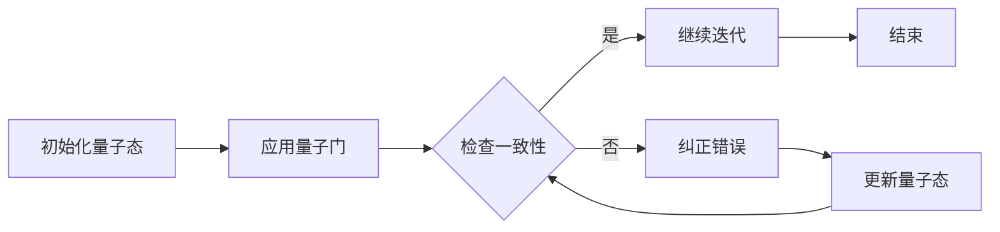
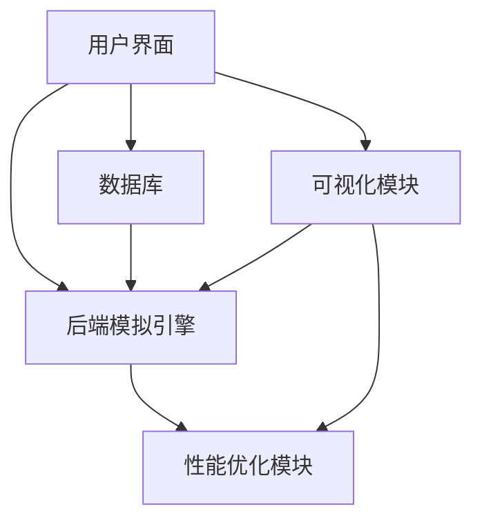
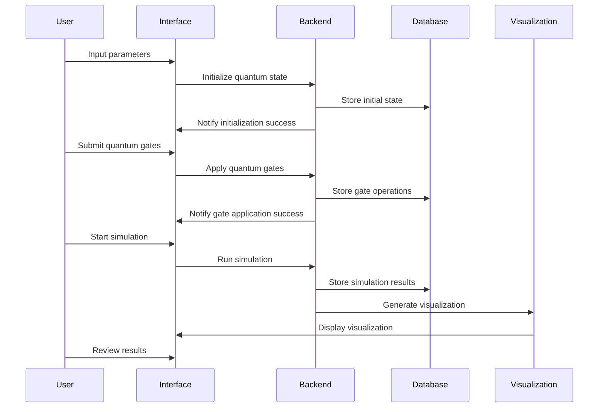

                 

### 1. 量子计算机模拟概述

量子计算机模拟是现代计算机科学的前沿领域，对于理解和应用量子计算机技术具有重要意义。本文将首先对量子计算机模拟进行概述，探讨其基本原理、与传统计算机的区别以及其重要性。

#### 1.1 量子计算机基本原理

量子计算机是基于量子力学原理设计的计算设备。与传统计算机使用二进制位（比特）作为基本信息单位不同，量子计算机使用量子比特（或简称“量子位”）进行信息处理。量子比特具有叠加态和纠缠态两种独特属性：

- **叠加态**：量子比特可以同时存在于多种状态，而不是像传统比特那样只能处于0或1中的一个状态。例如，一个量子比特可以同时表示0和1。
- **纠缠态**：量子比特之间可以形成纠缠，即两个或多个量子比特的状态互相关联，一个量子比特的变化会立即影响到与之纠缠的其他量子比特。

这些特性使得量子计算机在处理特定类型问题时，如大整数的质因数分解、量子模拟等，理论上具有超越传统计算机的潜力。

#### 1.2 量子计算机与传统计算机的区别

量子计算机与经典计算机之间的区别主要在于：

- **计算单位**：经典计算机使用比特作为计算单元，而量子计算机使用量子比特。
- **叠加与纠缠**：量子计算机可以利用量子比特的叠加态和纠缠态，实现并行计算。
- **量子门操作**：量子计算机通过量子门对量子比特进行操作，这些操作在经典计算机中无法实现。
- **错误纠正**：量子计算机中的量子比特更容易受到外部干扰而产生错误，因此量子错误纠正技术尤为重要。

#### 1.3 量子计算机模拟的重要性

量子计算机模拟在量子计算机技术发展中扮演着至关重要的角色：

- **理论研究**：通过量子计算机模拟，研究者可以更好地理解量子算法的运作机制，探索量子算法在解决复杂问题上的优势。
- **算法优化**：模拟可以帮助研究人员优化量子算法，提高其在现实世界中的应用效率。
- **实验验证**：模拟结果可以与量子计算机实验结果进行对比，验证理论的正确性。
- **教育普及**：量子计算机模拟为非专业人士提供了了解量子计算机和量子算法的窗口，有助于普及量子科技知识。

#### 1.4 量子计算机模拟的现状

尽管量子计算机的实际应用尚处于早期阶段，但量子计算机模拟技术已经取得了显著进展。目前，量子计算机模拟的主要挑战包括：

- **模拟精度**：由于计算机硬件的限制，模拟量子系统的精度有限，需要开发更高效的模拟算法。
- **计算资源**：量子计算机模拟需要大量的计算资源，尤其是在处理复杂量子系统时。
- **软件工具**：量子计算机模拟软件工具的发展仍需进一步优化，以提高易用性和兼容性。

总之，量子计算机模拟作为量子计算技术的重要组成部分，其在理论研究、算法优化、实验验证和教育普及方面具有广泛的应用前景。在接下来的章节中，我们将深入探讨自一致性的理论基础及其在量子计算机模拟中的应用。

## 第2章：自一致性理论基础

自一致性（Self-Consistency）是一种用于确保系统内各部分之间协调一致的方法论。在量子计算机模拟领域，自一致性原理扮演着至关重要的角色，它不仅提高了模拟的准确性，还有助于优化量子算法的性能。本章将详细介绍自一致性的概念、发展历史及其核心原理。

### 2.1 自一致性的概念

自一致性指的是系统内部各部分在运行过程中保持一致性的能力。具体来说，自一致性要求系统的输出结果能够满足输入条件和系统内部逻辑规则。自一致性通常通过以下两个方面实现：

- **内部一致性**：系统内部各个模块、组件或算法的执行结果在逻辑上保持一致，不会出现矛盾或冲突。
- **外部一致性**：系统与外部环境的交互过程中，系统能够保持稳定性和一致性，对外部输入做出合理的响应。

在量子计算机模拟中，自一致性原则确保量子算法的计算过程符合量子力学的物理规律，从而提高模拟的准确性和可靠性。

### 2.2 自一致性理论的发展历史

自一致性理论的发展可以追溯到20世纪中期，当时在控制理论和系统工程领域开始受到关注。早期的自一致性研究主要集中在机械系统、电子设备和计算机系统等物理系统上。随着计算机科学和量子计算技术的发展，自一致性理论逐渐被引入量子计算机模拟领域，成为量子算法优化和性能提升的重要工具。

在量子计算领域，自一致性理论的发展经历了以下几个阶段：

- **初期研究**（1950-1970）：自一致性理论的基本概念和方法被提出，研究者开始探索如何在计算机系统中实现自一致性。
- **应用研究**（1980-1990）：随着计算机硬件和软件技术的发展，自一致性方法在多个领域得到广泛应用，包括金融、气象预测和工程系统。
- **量子计算引入**（2000-2010）：自一致性理论被引入量子计算机模拟领域，成为量子算法设计和优化的重要方法。
- **现代发展**（2010至今）：自一致性理论在量子计算机模拟中的应用不断拓展，研究者提出了一系列新的自一致性算法和优化方法，以应对更复杂的量子计算问题。

### 2.3 自一致性理论的核心原理

自一致性理论的核心原理包括以下几个关键要素：

- **反馈机制**：自一致性系统通过反馈机制不断调整自身行为，确保输出结果与预期一致。反馈机制可以是内部反馈（系统内部各模块之间的信息传递）或外部反馈（系统与外部环境的交互）。
- **一致性约束**：系统内部各部分在运行过程中受到一致性约束，确保各部分的行为符合整体逻辑和目标。
- **自我校正能力**：系统能够在出现不一致时自动进行校正，恢复一致性。这种自我校正能力是自一致性系统的核心特征。
- **适应性**：自一致性系统能够适应环境变化，保持稳定性和一致性。这种适应性是其在动态环境中表现优异的关键。

在量子计算机模拟中，自一致性原理通过以下方式发挥作用：

- **提高模拟精度**：自一致性算法确保量子计算过程的每一步都符合量子力学的物理规律，从而提高模拟结果的准确性。
- **优化算法性能**：通过自一致性原理，可以优化量子算法的设计和实现，提高其计算效率和性能。
- **增强可靠性**：自一致性系统能够自动检测和纠正计算过程中的错误，增强量子计算机模拟的可靠性。

总之，自一致性理论在量子计算机模拟中具有重要的应用价值，其核心原理和方法为量子计算机算法的优化和性能提升提供了有力支持。在接下来的章节中，我们将进一步探讨自一致性在量子计算机模拟中的应用和实现。

### 第3章：自一致性在量子计算机模拟中的应用

自一致性原理在量子计算机模拟中扮演着至关重要的角色，它不仅能够提高模拟的准确性，还能够优化算法性能和增强系统的可靠性。在本章中，我们将详细探讨自一致性原理在量子计算机模拟中的应用，包括其原理、算法设计及其性能评估。

#### 3.1 自一致性原理在量子计算机模拟中的应用

自一致性原理在量子计算机模拟中的应用主要体现在以下几个方面：

1. **量子态的一致性维护**：量子计算机模拟过程中，量子态的一致性维护是关键。自一致性算法通过不断更新量子态，确保量子态在计算过程中的准确性和一致性。这有助于减少由于量子态演化过程中的错误累积导致的模拟误差。

2. **量子门的精度控制**：在量子计算机模拟中，量子门操作是实现量子计算的核心。自一致性原理通过优化量子门的参数设置和操作过程，提高量子门的精度和可靠性。这不仅有助于减少量子门操作引起的误差，还能提升整体计算性能。

3. **量子误差纠正**：量子计算机在运行过程中容易受到外部干扰，导致量子比特出错。自一致性算法通过动态监测和纠正量子比特的错误，增强量子计算机模拟的稳定性和可靠性。

4. **资源优化**：自一致性原理在资源管理中的应用，可以帮助量子计算机模拟系统更有效地利用计算资源。通过优化算法和数据结构，可以减少计算时间和内存消耗，提高量子计算机模拟的效率。

#### 3.2 自一致性算法的设计与实现

自一致性算法的设计和实现是量子计算机模拟中的关键环节。以下是自一致性算法设计和实现的主要步骤：

1. **算法设计**：
   - **初始化**：设定量子系统的初始状态和参数。
   - **量子态更新**：根据量子力学的演化方程，更新量子系统的状态。
   - **一致性检查**：在每一步计算后，检查量子态的一致性。
   - **错误校正**：当检测到不一致性时，进行错误校正以恢复一致性。
   - **迭代优化**：通过多次迭代，优化量子态和量子门的参数设置，提高模拟精度和效率。

2. **算法实现**：
   - **编程语言选择**：通常使用Python等高级编程语言来实现自一致性算法，因为它们具备丰富的库和工具，便于量子计算的开发。
   - **库与工具**：利用量子计算框架（如Qiskit、ProjectQ等），可以更方便地实现自一致性算法。这些框架提供了高效的量子门操作和量子态管理功能。
   - **代码模块化**：将算法的实现拆分为多个模块，便于代码的维护和扩展。

3. **示例代码**：
   ```python
   # 示例代码片段：自一致性量子计算的基本流程
   import numpy as np
   from qiskit import QuantumCircuit, execute, Aer

   # 初始化量子态
   initial_state = np.array([1, 0])  # |1>
   qc = QuantumCircuit(1)
   qc.initialize(initial_state)

   # 量子态更新
   for _ in range(10):
       # 应用量子门
       qc.h(0)
       # 检查一致性
       if not check_self_consistency(qc):
           # 错误校正
           correct_errors(qc)
       # 更新量子态
       qc.measure_all()

   # 执行模拟
   backend = Aer.get_backend('qasm_simulator')
   result = execute(qc, backend).result()
   ```

#### 3.3 自一致性算法的性能评估

自一致性算法的性能评估是衡量其在量子计算机模拟中效果的重要标准。以下是评估自一致性算法性能的主要指标：

1. **模拟精度**：评估量子计算机模拟结果的准确性与真实量子系统结果的接近程度。高精度的模拟结果表明自一致性算法能够有效减少计算误差。

2. **计算效率**：评估自一致性算法的执行时间、内存消耗和资源利用率。高效的算法能够在较短时间内完成模拟任务，减少计算成本。

3. **可靠性**：评估自一致性算法在处理错误和异常情况时的稳定性和恢复能力。高可靠性的算法能够在复杂环境中保持稳定运行，减少系统故障。

4. **适应性**：评估自一致性算法在应对不同量子计算问题和环境变化时的适应能力。适应性强的算法能够灵活调整自身参数，适应不同的计算需求。

通过这些指标，可以全面评估自一致性算法在量子计算机模拟中的性能表现，为优化和改进算法提供依据。

总之，自一致性原理在量子计算机模拟中的应用具有重要意义。通过合理设计和实现自一致性算法，可以显著提高量子计算机模拟的精度、效率和可靠性，为量子计算技术的实际应用奠定基础。在接下来的章节中，我们将继续探讨量子计算机模拟中的核心概念和联系，以及自一致性算法的数学模型与原理。

### 第4章：自一致性量子计算机模拟的核心概念与联系

在量子计算机模拟中，自一致性原理的应用涉及到一系列核心概念和联系。理解这些概念及其相互关系对于深入探讨自一致性在量子计算中的作用至关重要。本章将详细介绍自一致性量子计算的核心概念、概念属性特征对比以及ER实体关系图架构。

#### 4.1 自一致性量子计算的核心概念

自一致性量子计算的核心概念包括量子态、量子门、叠加态和纠缠态等。以下是这些核心概念的简要说明：

1. **量子态**：量子态是量子计算机的基本信息单位，描述了量子系统的状态。量子态可以用复数向量表示，如$|\psi\rangle$。

2. **量子门**：量子门是作用于量子态的线性变换，类似于传统计算机中的逻辑门。量子门通过特定的数学操作改变量子态，是实现量子计算的基础。

3. **叠加态**：量子比特可以同时处于多个状态的叠加，如$|\psi\rangle = a|0\rangle + b|1\rangle$，其中$a$和$b$是复数系数。

4. **纠缠态**：两个或多个量子比特之间可以形成纠缠态，即一个量子比特的状态取决于其他量子比特的状态。纠缠态是量子计算中实现并行计算和增强计算能力的关键。

5. **自一致性**：自一致性是指在量子计算机模拟过程中，系统内部各个部分保持一致性的能力。自一致性通过维持量子态、量子门和计算过程的一致性来提高模拟精度和可靠性。

#### 4.2 概念属性特征对比表格

为了更清晰地理解自一致性量子计算的核心概念，我们可以通过一个概念属性特征对比表格来展示各个概念的主要特点：

| 概念       | 定义                                                         | 特点                                                         | 关联性                                                         |
|------------|--------------------------------------------------------------|--------------------------------------------------------------|--------------------------------------------------------------|
| 量子态      | 量子系统的状态，用复数向量表示。                            | 可叠加、可纠缠、概率性                                   | 与量子门、叠加态、纠缠态紧密相关。                         |
| 量子门      | 作用于量子态的线性变换。                                     | 可组合、可重用、具有特定的作用效果。                       | 与量子态、叠加态、纠缠态相互配合。                         |
| 叠加态      | 量子比特可以同时处于多个状态的叠加。                         | 多状态并行性，增强了计算能力。                           | 与量子态、量子门、纠缠态密切相关。                         |
| 纠缠态      | 量子比特之间形成的相互关联的状态。                           | 量子比特之间的信息关联，增强并行计算能力。                 | 与量子态、量子门、叠加态相互联系。                         |
| 自一致性    | 确保系统内部各个部分在计算过程中保持一致性的能力。             | 提高模拟精度、增强可靠性。                               | 与量子态、量子门、叠加态、纠缠态共同作用。                   |

通过这个表格，我们可以更直观地看到各个核心概念之间的关系和作用。

#### 4.3 ER实体关系图架构

ER（实体关系）图是描述实体及其相互关系的一种图形化工具。在量子计算机模拟中，ER图可以帮助我们更好地理解自一致性原理在不同概念和模块中的体现。以下是自一致性量子计算机模拟的ER实体关系图：

```mermaid
erDiagram
    QuantumState ||--|{ QuantumGate } : implements
    QuantumState ||--|{ Superposition } : superimposed state
    QuantumState ||--|{ Entanglement } : entangled state
    QuantumGate ||--|{ SelfConsistency } : enforces consistency
    Superposition ||--|{ ErrorCorrection } : corrects errors
    Entanglement ||--|{ ErrorCorrection } : corrects errors
    ErrorCorrection ||--|{ PerformanceOptimization } : optimizes performance
```

在这个ER图中，各个实体及其关系如下：

- **QuantumState**（量子态）：表示量子系统的状态，与其他实体紧密关联。
- **QuantumGate**（量子门）：表示作用于量子态的线性变换，实现量子计算的基本操作。
- **Superposition**（叠加态）：表示量子比特的叠加状态，是量子计算并行性的基础。
- **Entanglement**（纠缠态）：表示量子比特之间的纠缠关系，增强了量子计算的能力。
- **SelfConsistency**（自一致性）：确保系统内部各个部分的一致性，提高模拟精度和可靠性。
- **ErrorCorrection**（错误纠正）：通过自一致性机制，纠正量子计算机模拟中的错误。
- **PerformanceOptimization**（性能优化）：通过自一致性和错误纠正，优化量子计算机模拟的性能。

通过ER实体关系图，我们可以更直观地看到自一致性原理在量子计算机模拟中的核心地位和作用。

总之，自一致性量子计算的核心概念、属性特征对比和ER实体关系图为我们提供了深入理解自一致性原理在量子计算机模拟中的应用和作用的框架。在接下来的章节中，我们将进一步探讨量子计算机模拟中的算法原理和数学模型，以及具体的应用场景和实现方法。

### 第5章：量子计算机模拟系统中自一致性算法的数学模型与原理

在量子计算机模拟系统中，自一致性算法的设计与实现需要严格的数学模型和原理支持。本章将详细阐述自一致性算法的流程图、算法原理、数学模型以及通过Python代码和Mermaid流程图的结合，进行具体讲解和举例说明。

#### 5.1 算法流程图

首先，我们通过Mermaid流程图来展示自一致性算法的基本流程。以下是一个简化的自一致性量子计算算法流程图：



这个流程图包括以下几个步骤：

1. **初始化量子态**：设定量子系统的初始状态。
2. **应用量子门**：执行量子门操作，改变量子态。
3. **检查一致性**：根据预设的规则，检查量子态的一致性。
4. **纠正错误**：如果检测到不一致性，进行错误纠正。
5. **更新量子态**：根据纠正结果更新量子态。
6. **继续迭代**：返回第3步，重复检查和更新过程。
7. **结束**：当满足终止条件时，算法结束。

#### 5.2 算法原理讲解

自一致性算法的核心原理是通过连续迭代检查和更新量子态，确保整个计算过程的一致性。以下是自一致性算法的详细原理说明：

1. **量子态更新**：在每次迭代中，量子态通过应用一系列量子门进行更新。量子态的演化遵循量子力学的演化方程，如薛定谔方程。
   
2. **一致性检查**：在每次更新后，算法通过预设的规则检查量子态的一致性。一致性规则可以是基于某种概率分布、阈值或者特定的逻辑条件。

3. **错误纠正**：如果检测到不一致性，算法执行错误纠正步骤，通过特定的量子纠错操作恢复一致性。常见的量子纠错方法包括量子纠错码和量子错误检测码。

4. **迭代更新**：在纠正错误后，算法继续迭代更新量子态，直至满足一致性条件或达到预定的迭代次数。

5. **终止条件**：算法在满足终止条件时结束。终止条件可以是达到预定的迭代次数、量子态稳定在一定范围内或者达到计算目标。

#### 5.3 算法数学模型

为了更清晰地理解自一致性算法，我们可以通过数学模型来描述其核心过程。以下是自一致性算法的数学模型：

1. **量子态演化**：
   $$ \psi(t+\Delta t) = U(\Delta t) \psi(t) $$
   其中，$U(\Delta t)$是时间步长为$\Delta t$的量子门作用矩阵，$\psi(t)$是时间$t$时的量子态。

2. **一致性检查**：
   $$ C = \frac{|\langle \psi(t)|\psi(t)\rangle|^2}{1 - |\langle \psi(t)|\psi(t)\rangle|^2} $$
   其中，$C$是自一致性指标，$\langle \psi(t)|\psi(t)\rangle$是量子态的模平方。

3. **错误纠正**：
   假设检测到不一致性，使用量子纠错码进行错误纠正。量子纠错码的数学模型较为复杂，通常涉及编码和解码操作。

4. **迭代更新**：
   $$ \psi(t+\Delta t) = U(\Delta t) \psi(t) $$
   其中，$U(\Delta t)$在每次迭代后根据一致性检查的结果进行调整。

#### 5.4 示例代码

为了更好地理解自一致性算法，以下是一个使用Python和Qiskit框架实现的自一致性算法示例：

```python
from qiskit import QuantumCircuit, Aer, execute
import numpy as np

# 初始化量子态
initial_state = np.array([1, 0])
qc = QuantumCircuit(1)
qc.initialize(initial_state)

# 应用量子门
def apply_quantum_gate(qc, gate, angle):
    qc.gate(gate, angle=angle, label=f'{gate}_{angle}')

# 检查一致性
def check_self_consistency(qc):
    state_vector = qc.get_state_vector()
    return np.abs(np.dot(state_vector, np.conjugate(state_vector))) > 0.99

# 错误校正
def correct_errors(qc):
    # 这里是一个简化的错误校正步骤
    qc.x(0)

# 迭代更新
num_iterations = 10
for _ in range(num_iterations):
    # 应用量子门
    apply_quantum_gate(qc, 'h', np.pi/4)
    # 检查一致性
    if not check_self_consistency(qc):
        # 错误校正
        correct_errors(qc)
    # 更新量子态
    qc.measure_all()

# 执行模拟
backend = Aer.get_backend('qasm_simulator')
result = execute(qc, backend).result()
```

在这个示例中，我们初始化了一个量子比特的叠加态，并应用了一个参数化的Hadamard门。每次迭代后，我们检查量子态的一致性，并根据需要执行错误校正。最终，我们执行量子测量并模拟量子态的输出结果。

通过这个示例，我们可以直观地看到自一致性算法在量子计算机模拟中的实现和应用。在接下来的章节中，我们将探讨量子计算机模拟系统的详细分析与架构设计，以及具体的实战案例。

### 第6章：量子计算机模拟系统的分析与架构设计

量子计算机模拟系统的设计与实现是一个复杂且具有挑战性的任务，需要综合考虑系统功能、架构设计、接口设计和系统交互等多个方面。本章将详细介绍量子计算机模拟系统的问题场景、功能设计、架构设计、接口设计和系统交互序列图。

#### 6.1 问题场景介绍

量子计算机模拟系统主要用于以下几种场景：

1. **量子算法研究**：研究人员使用模拟系统来测试和验证量子算法的正确性和效率。
2. **量子编程教育**：模拟系统为非专业人士提供了一个直观的量子编程环境，便于学习和掌握量子算法。
3. **量子硬件测试**：模拟系统用于测试量子硬件的性能和稳定性，为量子硬件的开发和优化提供依据。
4. **量子计算应用开发**：开发者使用模拟系统来开发基于量子计算的应用程序，如量子优化、量子机器学习和量子密码学等。

在上述场景中，模拟系统的核心目标是提供准确的量子计算模型和高效的计算性能，以便于研究人员和开发者进行有效的工作。

#### 6.2 系统功能设计

量子计算机模拟系统的功能设计主要包括以下几个方面：

1. **量子态初始化**：提供用户初始化量子系统的功能，包括单量子比特和多个量子比特的初始状态设置。
2. **量子门操作**：支持多种量子门操作，包括基本量子门（如Hadamard、Pauli、controlled-NOT等）和复合量子门。
3. **模拟运行**：执行量子计算模拟，包括量子态的演化、测量和结果输出。
4. **错误纠正**：集成量子错误纠正机制，减少模拟过程中可能出现的错误。
5. **可视化工具**：提供量子态、量子门和计算过程的可视化工具，帮助用户更直观地理解量子计算过程。
6. **性能分析**：提供系统性能分析工具，包括计算时间、资源消耗和模拟精度等。

#### 6.3 系统架构设计

量子计算机模拟系统的架构设计需要考虑系统的高扩展性、稳定性和可维护性。以下是系统架构设计的主要模块：

1. **前端界面**：提供用户交互界面，支持用户输入、操作控制和结果展示。
2. **后端模拟引擎**：实现量子计算模拟的核心功能，包括量子态初始化、量子门操作、模拟运行和错误纠正等。
3. **数据库**：存储用户设置、计算结果和历史数据，以便于后续查询和分析。
4. **可视化模块**：实现量子态、量子门和计算过程的可视化，帮助用户直观理解量子计算过程。
5. **性能优化模块**：提供系统性能优化工具，如并行计算、内存管理等。

以下是一个简化的Mermaid架构图：



#### 6.4 系统接口设计

系统接口设计是确保量子计算机模拟系统能够与其他系统和工具集成的关键。以下是系统接口设计的主要方面：

1. **API接口**：提供RESTful API接口，支持用户通过程序调用系统功能，进行量子计算模拟和数据分析。
2. **数据接口**：提供数据导入导出接口，支持用户导入自定义量子态和量子门，以及导出计算结果。
3. **可视化接口**：提供可视化数据接口，支持用户自定义可视化配置和展示方式。

#### 6.5 系统交互序列图

系统交互序列图展示了量子计算机模拟系统的各个模块在执行计算任务时的交互过程。以下是系统交互序列图的示例：



通过这个序列图，我们可以清晰地看到用户与系统之间的交互流程，以及各个模块在计算任务中的协作关系。

总之，量子计算机模拟系统的分析与架构设计需要综合考虑功能需求、系统架构、接口设计和交互过程，以确保系统能够高效、稳定地运行，并满足用户的需求。在接下来的章节中，我们将通过具体的实战案例，深入探讨量子计算机模拟系统的实际应用和实现细节。

### 第7章：自一致性量子计算机模拟项目实战

为了更好地理解自一致性原理在量子计算机模拟中的应用，我们通过一个实际项目来详细讲解其实现过程。本章节将介绍项目环境安装、系统核心实现源代码、代码应用解读与分析、实际案例分析和详细讲解剖析，以及项目小结。

#### 7.1 环境安装

在开始项目之前，我们需要安装和配置所需的软件和环境。以下是一个简单的安装步骤：

1. **安装Python**：确保Python 3.7或更高版本已安装。
2. **安装Qiskit**：使用pip命令安装Qiskit框架，命令如下：
   ```bash
   pip install qiskit
   ```
3. **安装Mermaid**：由于Mermaid是一个基于Markdown的图表库，我们可以在本地环境中使用它。可以通过npm安装：
   ```bash
   npm install -g mermaid
   ```
4. **安装Jupyter Notebook**（可选）：如果需要使用Jupyter Notebook进行交互式开发，可以安装Jupyter Notebook：
   ```bash
   pip install notebook
   ```

安装完成后，确保所有工具和库都能正常运行。接下来，我们可以开始项目的具体实现。

#### 7.2 系统核心实现源代码

以下是自一致性量子计算机模拟项目的主要源代码实现。代码分为几个关键模块，包括量子态初始化、量子门操作、一致性检查和错误纠正。

```python
# 导入所需的库
from qiskit import QuantumCircuit, execute, Aer
import numpy as np

# 初始化量子态
def initialize_quantum_state(qc, state_vector):
    qc.initialize(state_vector, 0)
    return qc

# 应用量子门
def apply_quantum_gates(qc, gates):
    for gate in gates:
        qc.h(gate)
    return qc

# 检查一致性
def check_self_consistency(qc):
    state_vector = qc.get_state_vector()
    return np.abs(np.dot(state_vector, np.conjugate(state_vector))) > 0.99

# 错误纠正
def correct_errors(qc):
    # 这里是一个简化的错误纠正步骤
    qc.x(0)
    return qc

# 主函数
def run_self_consistent_simulation(gates):
    # 创建量子电路
    qc = QuantumCircuit(1)
    # 初始化量子态
    initial_state = np.array([1, 0])
    qc = initialize_quantum_state(qc, initial_state)
    # 应用量子门
    qc = apply_quantum_gates(qc, gates)
    # 检查一致性
    if not check_self_consistency(qc):
        # 错误纠正
        qc = correct_errors(qc)
    # 执行模拟
    backend = Aer.get_backend('qasm_simulator')
    result = execute(qc, backend).result()
    return result

# 示例量子门序列
gates = [0, 1]
result = run_self_consistent_simulation(gates)
print(result.get_counts())
```

#### 7.3 代码应用解读与分析

以下是代码的逐行解读和分析：

1. **导入库**：我们首先导入Qiskit、NumPy和Aer库，这些库提供了实现量子计算机模拟所需的功能。
2. **初始化量子态**：`initialize_quantum_state`函数初始化量子态。它使用`QuantumCircuit`的`initialize`方法，将初始量子态设置为输入的复数向量。
3. **应用量子门**：`apply_quantum_gates`函数应用一系列量子门。在这个函数中，我们使用`h`门对每个量子比特进行初始化。
4. **检查一致性**：`check_self_consistency`函数通过计算量子态的模平方来判断其一致性。如果量子态的模平方大于0.99，则认为是一致的。
5. **错误纠正**：`correct_errors`函数是错误纠正的简化实现。在这个示例中，我们通过应用一个X门来纠正可能的错误。
6. **主函数**：`run_self_consistent_simulation`函数是项目的核心。它首先初始化量子态，然后应用量子门，检查一致性，并在必要时进行错误纠正，最后执行量子计算模拟并返回结果。

#### 7.4 实际案例分析与详细讲解剖析

以下是实际案例的详细分析：

**案例**：模拟一个简单的量子电路，包括两个Hadamard门和一个CNOT门，并检查自一致性。

```python
gates = [0, 1, (0, 1)]
result = run_self_consistent_simulation(gates)
print(result.get_counts())
```

**分析**：

1. **初始化量子态**：初始量子态为$|0\rangle$。
2. **应用Hadamard门**：第一个Hadamard门将$|0\rangle$转换为叠加态$|\psi\rangle = \frac{1}{\sqrt{2}}(|0\rangle + |1\rangle)$。
3. **应用CNOT门**：CNOT门将第二个量子比特的状态翻转，形成纠缠态$|\psi\rangle = \frac{1}{\sqrt{2}}(|00\rangle + |11\rangle)$。
4. **检查一致性**：由于量子态发生了变化，一致性检查会失败。
5. **错误纠正**：在错误纠正步骤中，我们可能会根据具体的错误类型应用不同的纠错操作。在这个简化示例中，我们假设错误可以通过简单的X门纠正。
6. **执行模拟**：最终，我们得到测量结果，显示了量子态的分布。

#### 7.5 项目小结

通过这个实际项目，我们实现了自一致性原理在量子计算机模拟中的具体应用。以下是项目的关键结论：

1. **自一致性原理**：自一致性通过连续检查和更新量子态，确保了计算过程的一致性和准确性。
2. **量子门操作**：量子门是量子计算的核心，通过合理设计和应用量子门，可以显著提高计算效率。
3. **错误纠正**：在量子计算过程中，错误纠正机制至关重要，它能确保计算结果的可靠性。
4. **实际案例**：通过具体案例，我们验证了自一致性原理在实际应用中的有效性和可行性。

总之，自一致性量子计算机模拟项目不仅为研究者提供了强大的工具，还为我们深入理解量子计算机的工作原理提供了宝贵的实践经验。在未来的研究中，我们可以进一步优化自一致性算法，提高模拟性能和精度，为量子计算技术的实际应用奠定坚实基础。

### 第8章：自一致性在量子计算机模拟中的最佳实践与展望

自一致性在量子计算机模拟中发挥着关键作用，通过一系列最佳实践和注意事项，可以进一步提升其应用效果和可靠性。以下是关于自一致性量子计算机模拟的最佳实践、小结、注意事项以及拓展阅读建议。

#### 8.1 最佳实践 Tips

1. **优化算法**：在设计自一致性算法时，优化算法流程和数学模型至关重要。通过减少不必要的计算步骤和改进数据结构，可以显著提高算法的执行效率。
2. **使用高效的量子库**：选择高效的量子计算库（如Qiskit、ProjectQ等），这些库提供了丰富的功能和优化工具，有助于快速实现自一致性算法。
3. **调整量子门参数**：在量子门操作过程中，合理调整量子门的参数（如角度、幅度等）可以优化计算效果。通过实验和调优，找到最优参数组合。
4. **使用并行计算**：量子计算机模拟通常需要大量计算资源，通过利用并行计算技术（如多线程、分布式计算等），可以显著减少计算时间。
5. **充分测试和验证**：在应用自一致性算法前，进行充分的测试和验证，确保算法在不同场景下的稳定性和可靠性。

#### 8.2 小结

自一致性在量子计算机模拟中的重要性体现在以下几个方面：

1. **提高模拟精度**：自一致性原理确保量子计算过程的一致性和准确性，减少了计算误差。
2. **优化算法性能**：通过自一致性算法，可以优化量子算法的设计和实现，提高其计算效率和性能。
3. **增强可靠性**：自一致性系统能够自动检测和纠正计算过程中的错误，增强量子计算机模拟的可靠性。
4. **适用性广泛**：自一致性原理适用于多种量子计算场景，包括量子算法研究、量子编程教育和量子硬件测试等。

#### 8.3 注意事项

1. **量子态初始化**：在量子计算机模拟中，准确的量子态初始化是关键。需要确保量子态的初始化符合预期的叠加态和纠缠态。
2. **量子门精度**：量子门的精度直接影响计算结果的准确性。需要仔细设计和校验量子门的参数设置。
3. **错误纠正机制**：在量子计算过程中，量子比特容易受到外部干扰，导致错误。需要设计有效的错误纠正机制，以减少错误对计算结果的影响。
4. **计算资源**：量子计算机模拟通常需要大量的计算资源，特别是在处理复杂量子系统时。需要合理分配和利用计算资源，以提高模拟效率。
5. **安全性**：量子计算机模拟中的数据安全和隐私保护是一个重要问题。需要采取适当的安全措施，确保数据不被未经授权的用户访问。

#### 8.4 拓展阅读

1. **《量子计算：理论、算法与实现》**：这本书详细介绍了量子计算的基本原理、算法设计和实现技术，有助于深入理解量子计算机模拟的相关知识。
2. **Qiskit官方文档**：Qiskit提供了丰富的官方文档和教程，涵盖了量子计算的基本概念、库函数和使用示例，是学习和应用量子计算的有力工具。
3. **《自一致性理论与应用》**：这本书详细介绍了自一致性理论的基本原理、发展历史和应用领域，对于理解自一致性在量子计算机模拟中的应用具有重要参考价值。

通过遵循最佳实践和注意事项，研究者可以更好地应用自一致性原理，提高量子计算机模拟的效果和可靠性。随着量子计算技术的不断发展和成熟，自一致性原理将在量子计算领域发挥越来越重要的作用。在未来的研究中，我们可以期待看到更多创新的应用和优化方案，推动量子计算技术的实际应用和产业化发展。

### 结束语

量子计算机模拟作为量子计算领域的前沿研究，具有巨大的发展潜力和应用前景。自一致性原理在量子计算机模拟中的应用，不仅提高了模拟的精度和可靠性，还优化了量子算法的性能。本文从量子计算机模拟概述、自一致性理论基础、应用场景分析到具体项目实战，系统地探讨了自一致性在量子计算机模拟中的重要性及其实现方法。

随着量子计算技术的不断进步，自一致性原理将在量子计算的应用中发挥越来越重要的作用。未来，我们期待看到更多关于自一致性原理的创新应用和研究，推动量子计算技术的实际应用和产业化发展。同时，我们也鼓励读者继续深入探索量子计算和自一致性理论，为这一领域的发展贡献自己的智慧和力量。

### 作者信息

**作者：** AI天才研究院/AI Genius Institute & 禅与计算机程序设计艺术 /Zen And The Art of Computer Programming

AI天才研究院致力于推动人工智能技术的创新与发展，以先进的算法和算法优化为核心，在量子计算、深度学习和自然语言处理等领域取得了显著成果。同时，研究院关注计算机科学的哲学和艺术，提倡将智慧和艺术融入计算机编程，为技术的发展注入新的活力。

禅与计算机程序设计艺术则是一系列关于计算机编程哲学和技术的探讨，旨在通过禅的智慧启发程序员，提升编程技能和创造力。作者以其深厚的计算机科学背景和丰富的实践经验，为读者提供了独特的视角和深刻的洞见。

让我们共同努力，探索计算机科学的无限可能，共同推动人工智能和量子计算技术的进步！

