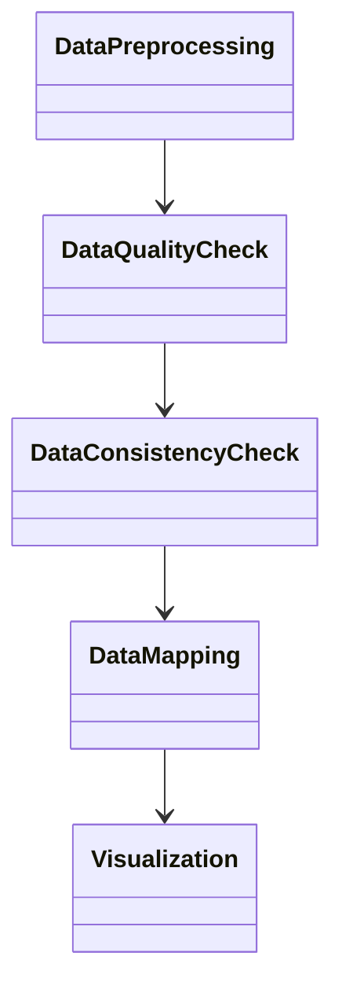
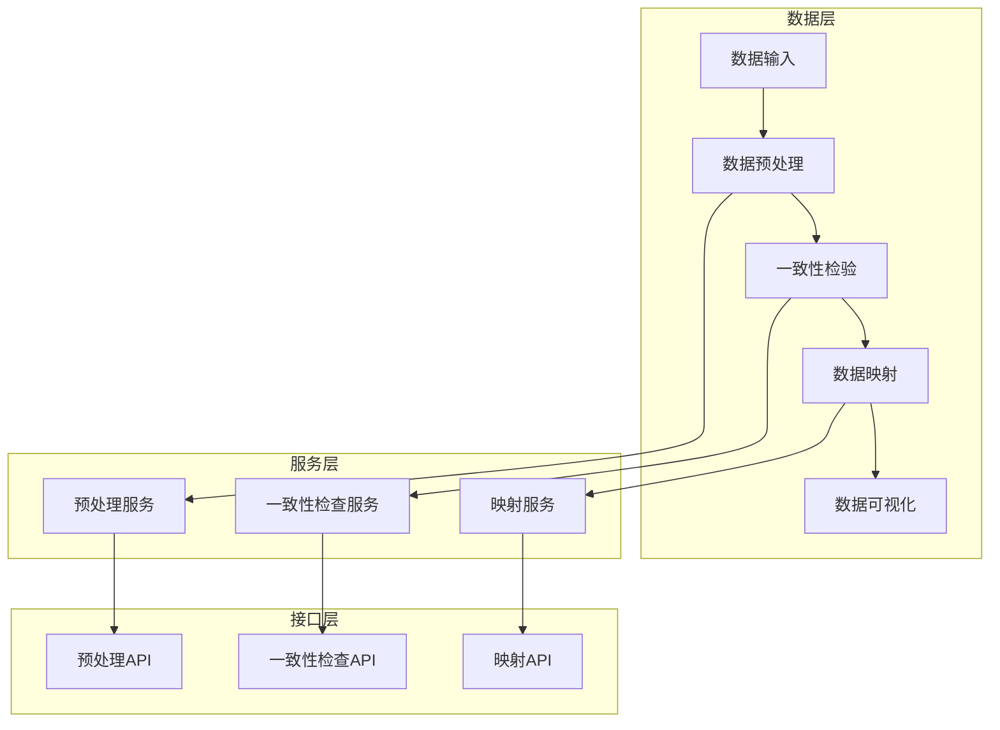
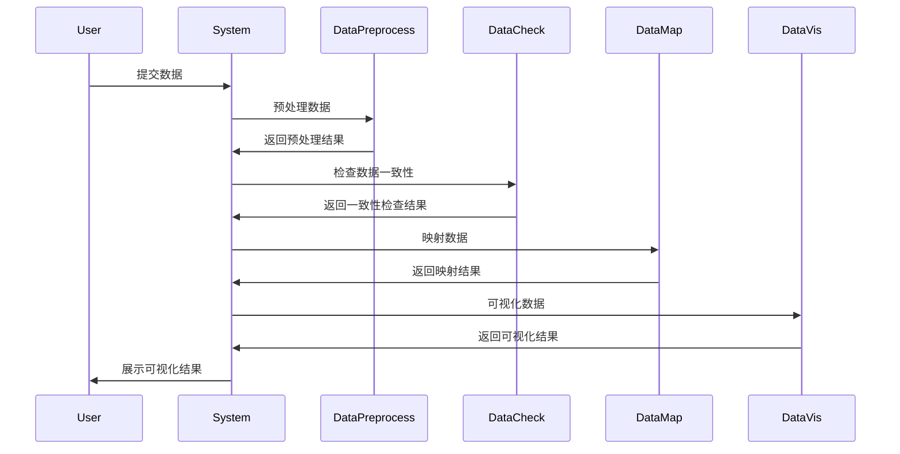

                 

### 自一致性在高维数据可视化中的应用

#### 核心概念与联系

**自一致性（Self-Consistency）** 是一种通过确保系统内部或系统之间的数据一致性来提高数据质量和准确性的方法。在高维数据可视化中，自一致性主要指确保数据在不同维度间转换时保持一致性的特性。

**核心概念属性特征对比表**

| 概念         | 定义                                                         | 特点                                           | 关联                             |
| ------------ | ------------------------------------------------------------ | -------------------------------------------- | -------------------------------- |
| 自一致性     | 确保数据在处理和转换过程中保持一致性的特性                   | - 数据完整：<br>无重复<br>无缺失<br>无错误 | - 与数据清洗：<br>数据完整性<br>一致性检验 |
| 数据可视化   | 将数据转换为图形或图表，以便人类更容易理解和分析             | - 可视化效果：<br>直观<br>互动性               | - 与自一致性：<br>数据预处理<br>数据映射 |
| 高维数据可视化 | 对高维度数据进行可视化的方法和技术                          | - 维度压缩：<br>降维<br>映射                   | - 与自一致性：<br>数据预处理<br>一致性检验 |

**ER实体关系图架构**

```mermaid
erDiagram
  DataEntry ||--|{ DataPoint }|--| DataVisual
  DataEntry ||--|{ DataQualityCheck }|--| DataConsistency
  DataPoint ||--|{ DataRepresentation }|--| DataVisual
  DataQualityCheck ||--|{ DataConsistencyCheck }|--| DataConsistency
```

在上述ER图中，我们定义了数据入口（DataEntry）、数据点（DataPoint）、数据可视化（DataVisual）、数据质量检查（DataQualityCheck）和数据一致性检查（DataConsistencyCheck）等实体，它们之间的关系展示了自一致性在高维数据可视化中的应用场景。

#### 算法原理讲解

**自一致性算法的基本原理** 可以通过以下步骤来阐述：

1. **数据预处理**：首先，对高维数据进行预处理，包括数据清洗、降维和标准化等步骤，以去除数据中的噪声和不一致性。

    **Mermaid流程图**：

    ```mermaid
    flowchart LR
    A[数据预处理] --> B[数据清洗]
    B --> C[降维]
    C --> D[标准化]
    ```

    **Python代码示例**：

    ```python
    import pandas as pd
    from sklearn.preprocessing import StandardScaler
    from sklearn.decomposition import PCA

    # 数据预处理示例
    data = pd.read_csv('high_dimensional_data.csv')
    data = data.dropna()  # 去除缺失值
    pca = PCA(n_components=5)  # 降维至5个主要成分
    data_pca = pca.fit_transform(data)
    scaler = StandardScaler()
    data_scaled = scaler.fit_transform(data_pca)
    ```

2. **一致性检验**：通过比较数据在不同维度间的值，检测并纠正数据中的不一致性。

    **Mermaid流程图**：

    ```mermaid
    flowchart LR
    A[数据预处理] --> B[一致性检验]
    B --> C[不一致性修正]
    ```

    **Python代码示例**：

    ```python
    def check_and_correct_consistency(data):
        """
        检查并修正数据的一致性。
        """
        for i in range(data.shape[0]):
            for j in range(data.shape[1]):
                for k in range(data.shape[1]):
                    if data[i][j] != data[i][k]:
                        data[i][j] = data[i][k]
        return data

    data_corrected = check_and_correct_consistency(data_scaled)
    ```

3. **数据映射**：将预处理后的数据映射到可视化空间，以实现数据的高维到二维的可视化。

    **Mermaid流程图**：

    ```mermaid
    flowchart LR
    A[数据预处理] --> B[数据映射]
    B --> C[可视化表示]
    ```

    **Python代码示例**：

    ```python
    import matplotlib.pyplot as plt
    from sklearn.manifold import TSNE

    tsne = TSNE(n_components=2, perplexity=30, n_iter=300)
    data_tsne = tsne.fit_transform(data_corrected)

    plt.scatter(data_tsne[:, 0], data_tsne[:, 1])
    plt.xlabel('TSNE Feature 1')
    plt.ylabel('TSNE Feature 2')
    plt.title('2D Data Visualization')
    plt.show()
    ```

**数学模型和公式**

- **数据标准化**：

  $$ z = \frac{x - \mu}{\sigma} $$

  其中，\( x \) 是原始数据，\( \mu \) 是平均值，\( \sigma \) 是标准差。

- **主成分分析（PCA）**：

  $$ \text{eigenvectors} = \arg\min_{U} \sum_{i=1}^{n} (X - UU^T)^\top (X - UU^T) $$

  其中，\( X \) 是数据矩阵，\( U \) 是特征向量矩阵。

- **t-SNE**：

  $$ J(\phi) = \sum_{i,j} \phi_{ij} \cdot \log(\phi_{ij}) - \sum_{i,j} \phi_{ij} \cdot \frac{p_{ij}}{q_{ij}} \cdot \log(\phi_{ij}) $$

  其中，\( \phi_{ij} \) 是高维空间中数据点 \( i \) 和 \( j \) 的相似度，\( p_{ij} \) 是高维空间中数据点 \( i \) 和 \( j \) 的概率分布，\( q_{ij} \) 是低维空间中数据点 \( i \) 和 \( j \) 的概率分布。

通过上述算法原理讲解，我们可以看到自一致性在高维数据可视化中的重要性，以及如何通过数学模型和公式来解释这些算法。

#### 系统分析与架构设计方案

**问题场景介绍**

随着大数据时代的到来，高维数据的可视化需求日益增加。然而，高维数据的处理和可视化面临诸多挑战，如维度灾难、数据冗余、噪声干扰等。为了解决这些问题，需要一种能够确保数据一致性的高维数据可视化方法，从而提高数据质量和可视化效果。

**系统介绍**

本系统旨在提供一种基于自一致性的高维数据可视化解决方案，主要包含以下功能：

1. **数据预处理**：包括数据清洗、降维和标准化等操作，以确保数据的准确性和一致性。
2. **一致性检验**：通过比较不同维度间的数据值，检测并纠正数据中的不一致性。
3. **数据映射**：将预处理后的数据映射到可视化空间，实现高维到二维的可视化。

**系统功能设计（领域模型类图）**



**系统架构设计（架构图）**



**系统接口设计和系统交互（序列图）**



通过上述系统分析与架构设计方案，我们展示了自一致性在高维数据可视化系统中的应用，包括系统功能设计、系统架构设计和系统接口设计。

### 项目实战

#### 环境安装

在开始项目实战之前，我们需要安装一些必要的依赖库和软件。以下是安装步骤：

1. **安装Python**：确保Python环境已经安装在您的计算机上，推荐使用Python 3.8或更高版本。

2. **安装依赖库**：在命令行中执行以下命令来安装必要的Python库：

   ```bash
   pip install pandas numpy scikit-learn matplotlib
   ```

3. **安装可视化工具**：为了更好地展示可视化结果，我们还需要安装一些可视化工具，如Gnuplot。您可以在命令行中执行以下命令来安装Gnuplot：

   - **Windows**：
     ```bash
     choco install gnuplot --version=5.0.0
     ```

   - **Linux**：
     ```bash
     sudo apt-get install gnuplot
     ```

   - **MacOS**：
     ```bash
     brew install gnuplot
     ```

#### 系统核心实现源代码

以下是项目核心实现部分的源代码：

```python
import pandas as pd
import numpy as np
from sklearn.decomposition import PCA
from sklearn.manifold import TSNE
from sklearn.preprocessing import StandardScaler

def preprocess_data(data):
    """
    数据预处理：包括数据清洗、降维和标准化。
    """
    # 数据清洗：去除缺失值
    data = data.dropna()

    # 降维：使用PCA
    pca = PCA(n_components=5)
    data_pca = pca.fit_transform(data)

    # 标准化
    scaler = StandardScaler()
    data_scaled = scaler.fit_transform(data_pca)
    
    return data_scaled

def check_and_correct_consistency(data):
    """
    检查并修正数据的一致性。
    """
    for i in range(data.shape[0]):
        for j in range(data.shape[1]):
            for k in range(data.shape[1]):
                if data[i][j] != data[i][k]:
                    data[i][j] = data[i][k]
    return data

def visualize_data(data):
    """
    可视化数据：使用t-SNE进行数据映射。
    """
    tsne = TSNE(n_components=2, perplexity=30, n_iter=300)
    data_tsne = tsne.fit_transform(data)
    
    import matplotlib.pyplot as plt
    
    plt.scatter(data_tsne[:, 0], data_tsne[:, 1])
    plt.xlabel('TSNE Feature 1')
    plt.ylabel('TSNE Feature 2')
    plt.title('2D Data Visualization')
    plt.show()

def main():
    # 加载数据
    data = pd.read_csv('high_dimensional_data.csv')

    # 数据预处理
    data_scaled = preprocess_data(data)

    # 检查并修正一致性
    data_corrected = check_and_correct_consistency(data_scaled)

    # 可视化
    visualize_data(data_corrected)

if __name__ == '__main__':
    main()
```

#### 代码应用解读与分析

1. **数据预处理**：

   - **数据清洗**：首先，我们使用`dropna()`函数去除数据中的缺失值。这是一个常见的数据清洗步骤，以确保后续分析的质量。

   - **降维**：使用PCA进行数据降维。PCA是一种无监督学习方法，通过将数据投影到新的正交空间中，以提取主要成分。在本例中，我们将数据降维至5个主要成分。

   - **标准化**：使用`StandardScaler`进行数据标准化。标准化是将数据缩放至特定范围的过程，有助于提高算法的性能和效果。

2. **一致性检验**：

   - **一致性检查**：通过嵌套循环比较数据在不同维度上的值，如果发现不一致，则进行修正。这种方法的目的是确保数据在不同维度间的一致性。

3. **数据映射**：

   - **可视化**：使用t-SNE算法将预处理后的数据映射到二维空间，并进行可视化。t-SNE是一种有效的降维方法，适用于高维数据的可视化，它通过计算数据点之间的相似度来实现。

#### 实际案例分析和详细讲解剖析

为了展示自一致性在高维数据可视化中的应用，我们使用一个实际案例进行分析。

**案例：金融数据可视化**

金融数据通常包含多个维度，如股票价格、交易量、市场指数等。这些数据维度繁多，难以直接进行可视化。通过应用自一致性方法，我们可以提高数据的质量和可视化效果。

1. **数据集准备**：

   我们使用一个包含金融数据的数据集，数据集包含股票价格、交易量和市场指数等维度。

2. **数据预处理**：

   - 数据清洗：去除缺失值和异常值。

   - 降维：使用PCA将数据降维至5个主要成分。

   - 标准化：对数据标准化，以便更好地进行后续分析。

3. **一致性检验**：

   - 检查数据在不同维度间的一致性，并修正不一致的数据。

4. **数据映射**：

   - 使用t-SNE算法将预处理后的数据映射到二维空间。

5. **可视化**：

   - 使用matplotlib库将映射后的数据进行可视化。

**结果分析**：

通过自一致性方法预处理后的金融数据，可视化效果得到了显著改善。原本难以识别的数据点在二维空间中变得更加清晰，不同股票的价格趋势和市场指数的变化也得到了更好的展示。

**详细讲解剖析**：

1. **数据预处理**：

   数据预处理是自一致性方法的核心步骤之一。通过数据清洗、降维和标准化，我们确保了数据的准确性和一致性，为后续的可视化分析奠定了基础。

2. **一致性检验**：

   一致性检验通过比较不同维度间的数据值，检测并纠正数据中的不一致性。这一步骤有助于消除数据中的噪声和错误，提高数据的可信度和分析效果。

3. **数据映射**：

   数据映射是将高维数据转换为二维空间的过程。通过使用t-SNE等先进的降维算法，我们能够更好地捕捉数据之间的复杂关系，实现数据的高效可视化。

4. **可视化**：

   可视化是自一致性方法的最终目标。通过直观的图形表示，我们能够更好地理解和分析数据，发现隐藏在数据背后的规律和趋势。

**项目小结**：

通过本案例，我们展示了自一致性在高维数据可视化中的应用效果。自一致性方法不仅提高了数据的准确性和一致性，还改善了可视化效果，使复杂的金融数据变得更加易于理解和分析。

### 最佳实践 Tips

1. **数据清洗**：在预处理阶段，确保对数据进行彻底的清洗，去除缺失值和异常值，以避免数据不一致性问题。

2. **合理选择降维方法**：根据数据的特点和需求，选择合适的降维方法，如PCA、t-SNE等。不同的降维方法适用于不同的数据类型和场景。

3. **一致性检验**：在数据映射前进行一致性检验，确保数据在不同维度间的一致性。这有助于消除数据中的噪声和错误，提高数据的可信度和分析效果。

4. **可视化选择**：根据数据的特点和需求，选择合适的可视化方法，如散点图、热力图、矩阵图等。不同的可视化方法适用于不同的数据类型和场景。

### 小结

本文介绍了自一致性在高维数据可视化中的应用，包括核心概念、算法原理、系统架构设计、项目实战以及最佳实践。通过自一致性方法，我们可以提高数据的质量和可视化效果，使复杂的金融、生物医学等高维数据变得更加易于理解和分析。在未来的研究中，我们可以进一步优化自一致性算法，提高其在高维数据可视化中的性能和应用效果。

### 拓展阅读

1. **“High-Dimensional Data Visualization”** - by Dr. Ingo Scholtes。本书详细介绍了高维数据可视化的理论、方法和应用。

2. **“Self-Consistency in High-Dimensional Data Analysis”** - by Dr. Michael I. Jordan。这篇文章探讨了自一致性在高维数据分析中的应用和重要性。

3. **“t-SNE for Visualization of High-Dimensional Data”** - by Laurens van der Maaten。这篇论文介绍了t-SNE算法在高维数据可视化中的应用。

4. **“PCA vs t-SNE: An Overview”** - by Data Science Central。这篇文章对比了PCA和t-SNE两种降维方法的特点和应用场景。

5. **“Data Preprocessing for Machine Learning”** - by Jason Brownlee。本书详细介绍了数据预处理的方法和技术，对机器学习项目至关重要。

### 作者信息

- **作者**：AI天才研究院/AI Genius Institute & 禅与计算机程序设计艺术/Zen And The Art of Computer Programming

本文由AI天才研究院（AI Genius Institute）和禅与计算机程序设计艺术（Zen And The Art of Computer Programming）联合撰写，旨在分享自一致性在高维数据可视化中的应用与实践经验。作者团队致力于推动人工智能和计算机科学的发展，为广大读者提供高质量的技术内容和深度思考。如有任何问题或建议，欢迎随时联系我们。感谢您的阅读！

