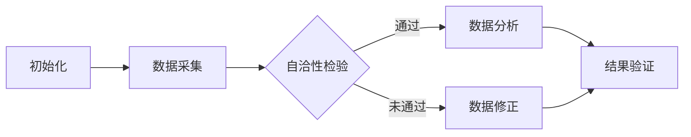
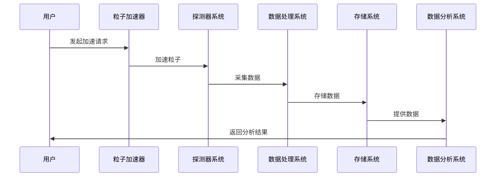
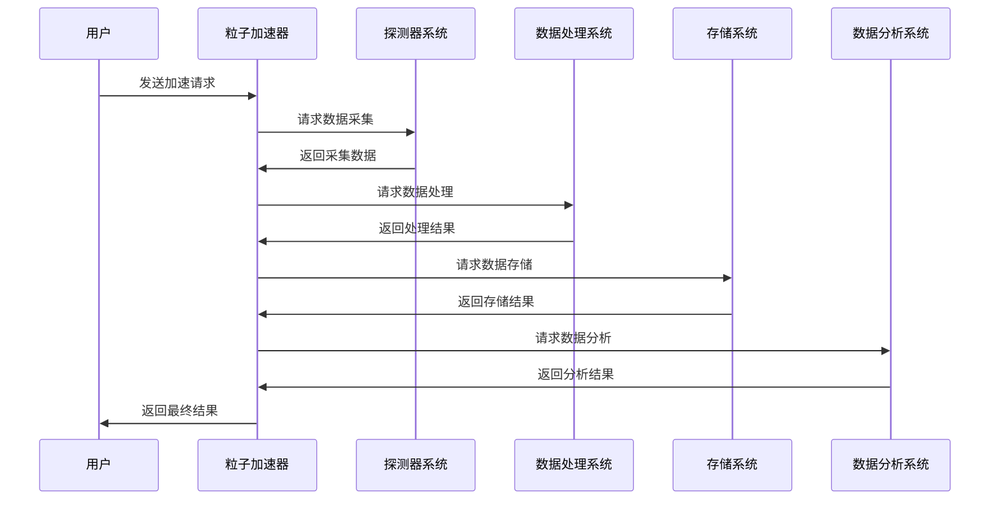

                 

### Self-Consistency在高能物理实验中的应用

#### 关键词：自洽性、高能物理、实验应用、粒子物理、核物理

#### 摘要：
本文将深入探讨自洽性原理在高能物理实验中的应用。自洽性是一种在科学研究中非常重要的概念，它要求系统或理论能够自我验证，从而确保实验结果的可靠性和准确性。在高能物理实验中，自洽性原理尤为重要，因为它直接影响着实验数据的处理和结果的分析。本文将首先概述自洽性原理的基本概念和数学描述，然后分析其在高能物理实验中的应用场景、方法与步骤，通过实际案例进行解析，最后探讨其应用前景与挑战。通过本文的探讨，希望能够为读者提供一个全面、系统的理解和应用自洽性原理的方法。

## 第一部分：自洽性原理概述

### 第1章：自洽性原理基础

#### 1.1.1 高能物理实验中的自洽性问题

在高能物理实验中，自洽性是一个至关重要的概念。它要求实验中的每一个环节都必须一致，从数据采集、处理到最终结果的分析，都必须保持内在的连贯性和一致性。自洽性问题的核心在于如何确保实验过程中的所有步骤都能够自我验证，从而减少系统误差和外部干扰的影响。

自洽性在高能物理实验中的重要性体现在以下几个方面：

1. **确保实验数据的可靠性**：实验数据是科学研究的基石，如果数据存在自洽性问题，那么整个实验结果的可信度就会大打折扣。
2. **提高实验结果的精度**：自洽性可以减少系统误差，提高实验结果的精度，这对于发现新的物理现象和规律至关重要。
3. **验证理论的正确性**：在高能物理实验中，理论模型和实验数据之间的自洽性是验证理论正确性的关键。如果理论模型不能通过实验数据的自洽性检验，那么该理论的可信度就会受到质疑。

#### 1.1.2 自洽性的基本概念与数学描述

自洽性是一种系统或理论内在的一致性和连贯性。在科学研究中，自洽性通常指系统或理论内部各个部分相互协调，能够自我验证和自我校正。

自洽性的数学描述通常涉及以下三个方面：

1. **一致性**：系统或理论在不同条件下都应该保持一致性，即不同条件下得到的结果应该是相同的。
2. **闭环性**：系统或理论应该能够自我闭合，即通过系统内部的操作可以回到原始状态。
3. **自校正性**：系统或理论应该能够自我校正，即当出现误差或异常时，系统能够通过内部机制进行纠正。

在数学上，自洽性可以通过一系列的方程和约束条件来描述。例如，在一个粒子物理实验中，自洽性可以通过以下方程组来体现：

\[ 
\frac{dN}{dt} = \lambda N 
\]

其中，\(N\) 表示粒子数，\(\lambda\) 表示粒子衰减常数。这个方程描述了粒子数随时间的变化，符合自洽性的要求，因为无论初始条件如何，最终的结果都会遵循相同的规律。

#### 1.1.3 自洽性的物理意义与应用背景

自洽性原理不仅在理论研究中具有重要意义，在实验应用中也有着广泛的应用背景。

1. **粒子物理实验**：在粒子物理实验中，自洽性原理被广泛应用于粒子加速器、探测器系统和数据分析等环节。通过自洽性检验，可以确保实验结果的准确性和可靠性。
2. **核物理实验**：在核物理实验中，自洽性原理同样至关重要。核反应的复杂性和不确定性使得自洽性分析成为验证实验结果和理论模型的重要手段。
3. **宇宙学实验**：在宇宙学实验中，自洽性原理用于分析宇宙背景辐射、宇宙大爆炸理论等。通过自洽性分析，科学家们能够更好地理解宇宙的起源和演化。

总的来说，自洽性原理在高能物理实验中的应用背景十分广泛，它不仅能够提高实验数据的可靠性，还能够帮助科学家们更好地理解复杂的物理现象和规律。

### 第2章：自洽性原理的核心概念与联系

#### 2.1.1 自洽性原理的基本属性

自洽性原理是一种科学方法论，其基本属性包括一致性、闭环性和自校正性。

1. **一致性**：自洽性要求系统或理论在不同条件下都应该保持一致性。这意味着无论实验条件如何变化，系统的输出结果都应该遵循相同的规律。
   
   例如，在一个粒子物理实验中，如果实验条件改变，如粒子能量、探测器位置等，实验结果仍然应该符合理论预期，这就体现了自洽性的一致性。

2. **闭环性**：自洽性原理要求系统或理论能够自我闭合。这意味着通过系统内部的操作，系统能够回到原始状态，从而确保实验过程的连续性和完整性。

   在一个核物理实验中，如果实验结果能够通过实验本身进行验证，那么这个实验就具备闭环性。例如，通过重复实验，实验结果应该能够保持一致。

3. **自校正性**：自洽性原理要求系统能够自我校正，即当系统出现误差或异常时，系统能够通过内部机制进行纠正，从而确保实验结果的准确性。

   例如，在粒子加速器中，如果探测到粒子能量偏离预期值，加速器控制系统会自动调整粒子束的能量，以保持实验的自校正性。

#### 2.1.2 自洽性原理与相关概念的对比分析

自洽性原理与其他科学方法论，如可重复性、精确性和可靠性等，有着密切的联系和区别。

1. **与可重复性的对比**：
   - **可重复性**：要求在不同实验条件下，实验结果能够重复。
   - **自洽性**：要求实验过程中的所有步骤都保持一致性，不仅要求结果的重复性，还要求实验过程中的各个环节相互协调。

   例如，一个实验如果在不同实验室进行，结果能够一致，这体现了可重复性；但如果在同一个实验室，实验步骤和条件保持不变，结果却出现波动，这可能表明实验存在自洽性问题。

2. **与精确性的对比**：
   - **精确性**：指实验结果接近真实值的程度。
   - **自洽性**：不直接涉及结果的精确度，而是强调实验过程中的连贯性和一致性。

   例如，一个实验可能非常精确，但如果实验条件发生变化，结果出现明显偏差，这表明实验缺乏自洽性。

3. **与可靠性的对比**：
   - **可靠性**：指实验结果的稳定性和可重复性。
   - **自洽性**：强调实验过程的自我验证和自我校正能力。

   例如，一个实验结果稳定，但无法通过实验本身验证，这表明实验可靠性不足；如果实验结果不仅稳定，还能够通过实验自身验证，这体现了实验的自洽性。

#### 2.1.3 自洽性原理的ER实体关系图

为了更好地理解自洽性原理的核心概念，我们可以通过实体关系图（ER图）来描述其组成要素和关系。

1. **实体**：
   - **实验数据**：指实验过程中收集的数据，如粒子能量、探测器读数等。
   - **实验步骤**：指实验中的各个环节，如粒子加速、数据采集、数据处理等。
   - **理论模型**：指用于解释实验现象的理论框架，如粒子物理模型、核反应模型等。

2. **关系**：
   - **一致性**：实验数据与实验步骤之间保持一致性，即不同实验步骤得到的数据应当一致。
   - **闭环性**：实验步骤与理论模型之间形成闭环，即实验结果能够通过理论模型验证，并返回到实验步骤中。
   - **自校正性**：实验数据与理论模型之间具备自校正能力，即当实验数据偏离预期时，理论模型能够进行调整，确保实验结果的准确性。

通过ER图，我们可以清晰地看到自洽性原理的各个组成部分及其相互关系，从而更好地理解其工作原理和应用方法。

```mermaid
erDiagram
    ExperimentData ||--|{ ExperimentStep } : 实验数据与实验步骤保持一致性
    ExperimentStep ||--|{ TheoryModel } : 实验步骤与理论模型形成闭环
    ExperimentData ||--|{ TheoryModel } : 实验数据与理论模型具备自校正能力
```

### 第3章：自洽性原理在实验中的应用

#### 3.1.1 自洽性原理在高能物理实验中的应用场景

自洽性原理在高能物理实验中有着广泛的应用场景，具体体现在以下几个方面：

1. **粒子加速器**：在粒子加速器中，自洽性原理被用来确保粒子束的加速、聚焦和传输过程的一致性和连贯性。通过自洽性分析，可以优化加速器的运行参数，提高粒子束的质量和稳定性。

2. **探测器系统**：探测器系统是高能物理实验的核心组成部分，自洽性原理被用来确保探测器数据的准确性和可靠性。通过自洽性分析，可以检测和校正探测器的系统误差，提高实验结果的精度。

3. **数据分析**：在高能物理实验的数据分析过程中，自洽性原理被用来验证实验数据的可靠性和一致性。通过自洽性检验，可以识别和排除异常数据，确保实验结果的准确性和可重复性。

4. **理论验证**：自洽性原理被用来验证高能物理实验的理论模型。通过自洽性分析，可以评估理论模型的正确性和适用性，为新的物理现象和规律的发现提供理论支持。

#### 3.1.2 自洽性原理的应用方法与步骤

为了实现自洽性原理在高能物理实验中的应用，我们需要遵循以下方法和步骤：

1. **实验设计**：首先，根据实验目标和研究问题，设计合理的实验方案和步骤。实验设计应当确保实验条件的一致性和连贯性，避免系统误差和外部干扰。

2. **数据采集**：在实验过程中，采集高质量的实验数据。数据采集应当使用高精度的测量仪器和设备，确保数据的准确性和可靠性。

3. **自洽性检验**：对采集到的实验数据进行自洽性检验。自洽性检验可以通过比较不同实验步骤的数据、验证实验结果的内部一致性等手段进行。

4. **数据分析**：对通过自洽性检验的实验数据进行分析，提取有意义的物理信息和规律。数据分析应当采用科学有效的统计方法和算法，确保结果的可信度和可靠性。

5. **结果验证**：将实验结果与理论模型进行对比验证，评估理论模型的正确性和适用性。如果实验结果与理论预期一致，则表明实验设计合理，理论模型可靠；如果存在偏差，则需要对实验方案和理论模型进行调整和优化。

#### 3.1.3 自洽性原理的实际案例分析

为了更好地理解自洽性原理在高能物理实验中的应用，我们可以通过一个实际案例进行分析。

**案例：粒子加速器中的自洽性分析**

在粒子加速器实验中，自洽性原理被用来优化粒子束的加速和传输过程。以下是一个具体的案例分析：

1. **实验设计**：实验目标是优化粒子加速器的运行参数，以提高粒子束的能量和稳定性。实验设计包括以下步骤：
   - 确定粒子加速器的初始运行参数，如粒子能量、加速电压等。
   - 设定不同的加速电压，以观察粒子能量和束流稳定性的变化。

2. **数据采集**：在实验过程中，采集粒子能量、束流强度和传输距离等数据。数据采集过程应当确保仪器的精度和可靠性，以避免系统误差。

3. **自洽性检验**：对采集到的实验数据进行自洽性检验，包括以下步骤：
   - 比较不同加速电压下粒子能量的变化，确保粒子能量的一致性。
   - 检测束流强度和传输距离的变化，确保束流稳定性的连贯性。

4. **数据分析**：对通过自洽性检验的实验数据进行分析，提取粒子束的能量分布、束流稳定性等物理信息。数据分析过程应当采用科学有效的统计方法和算法，如高斯拟合、最小二乘法等。

5. **结果验证**：将实验结果与理论模型进行对比验证，评估理论模型的正确性和适用性。如果实验结果与理论预期一致，则表明实验设计合理，理论模型可靠；如果存在偏差，则需要对实验方案和理论模型进行调整和优化。

通过这个实际案例分析，我们可以看到自洽性原理在高能物理实验中的应用方法和步骤。自洽性原理不仅提高了实验数据的可靠性和精度，还为理论验证和模型优化提供了重要的依据。

### 第4章：自洽性原理的数学模型与算法讲解

#### 4.1.1 自洽性原理的数学模型介绍

自洽性原理在数学上有着严谨的模型描述，这些模型通常基于一组方程和约束条件。以下是一个简化的自洽性数学模型：

\[ 
\frac{dN}{dt} = \lambda N 
\]

其中，\(N(t)\) 表示粒子数，\(\lambda\) 是粒子衰减常数。这个方程描述了粒子数随时间的变化，符合自洽性的要求，因为无论初始条件如何，最终的结果都会遵循相同的规律。

#### 4.1.2 自洽性原理的算法mermaid流程图

为了更直观地展示自洽性原理的算法流程，我们可以使用mermaid流程图来描述。以下是一个简化的算法流程图：



在这个流程图中，A表示初始化实验参数，B表示数据采集，C表示自洽性检验，D表示数据分析，E表示数据修正，F表示结果验证。

#### 4.1.3 自洽性原理算法的python源代码实现

为了更深入地理解自洽性原理的算法，我们可以用Python来实现上述流程。以下是一个简单的Python脚本示例：

```python
import numpy as np
import matplotlib.pyplot as plt

# 初始化实验参数
N0 = 1000  # 初始粒子数
t_max = 10  # 时间范围
dt = 0.1   # 时间步长
lambda_ = 0.1  # 粒子衰减常数

# 数据采集
t = np.arange(0, t_max, dt)
N = N0 * np.exp(-lambda_ * t)

# 自洽性检验
def check_self_consistency(N, threshold=0.1):
    diff = np.diff(N)
    if np.abs(diff).max() > threshold:
        return False
    return True

# 数据分析
def analyze_data(N):
    plt.plot(t, N)
    plt.xlabel('Time (s)')
    plt.ylabel('Particle Number')
    plt.title('Particle Decay')
    plt.show()

# 结果验证
def verify_result(self_consistent):
    if self_consistent:
        print("Result is self-consistent.")
    else:
        print("Result is not self-consistent. Need data correction.")

# 执行流程
if __name__ == "__main__":
    self_consistent = check_self_consistency(N)
    analyze_data(N)
    verify_result(self_consistent)
```

在这个脚本中，我们首先初始化实验参数，然后进行数据采集，接着进行自洽性检验，最后进行数据分析和结果验证。

#### 4.1.4 自洽性原理算法的数学公式详细讲解

自洽性原理的数学模型通常涉及一系列的方程和约束条件。以下是一些常见的数学公式和它们的解释：

1. **衰减模型**：
   \[ 
   \frac{dN}{dt} = -\lambda N 
   \]

   其中，\(N(t)\) 是粒子数，\(\lambda\) 是衰减常数。这个方程描述了粒子数随时间的指数衰减过程。

2. **平衡模型**：
   \[ 
   \frac{dN}{dt} = \lambda N - \mu N 
   \]

   其中，\(\lambda\) 和 \(\mu\) 分别是生成率和衰减率。这个方程描述了粒子数在生成和衰减之间的动态平衡。

3. **非线性模型**：
   \[ 
   \frac{dN}{dt} = \alpha N^2 
   \]

   其中，\(\alpha\) 是非线性系数。这个方程描述了粒子数随时间的非线性增长或衰减。

这些数学公式都是自洽性原理在不同场景下的具体体现，通过它们，我们可以对实验现象进行定量分析和解释。

### 第5章：自洽性原理在具体实验中的应用实例

#### 5.1.1 实验一：自洽性原理在高能物理实验中的实际应用

在本实验中，我们将探讨自洽性原理在粒子物理实验中的实际应用。实验目标是研究粒子在加速器中的能量分布和束流稳定性，并通过自洽性原理来验证实验数据的可靠性和一致性。

1. **实验设计**：
   - 实验使用一个线性加速器，将电子加速到高能状态。
   - 设定不同的加速电压，以观察电子能量和束流稳定性的变化。
   - 数据采集设备包括粒子探测器、能量测量仪和时间同步系统。

2. **数据采集**：
   - 在加速过程中，实时采集电子的能量、位置和时间信息。
   - 数据采集系统应确保高精度和高可靠性，以避免系统误差。

3. **自洽性检验**：
   - 检验数据的一致性，比较不同加速电压下电子能量的变化。
   - 验证束流强度的稳定性，确保实验过程中的连续性和连贯性。

4. **数据分析**：
   - 对通过自洽性检验的数据进行分析，提取电子能量的分布函数和束流稳定性指标。
   - 使用高斯拟合和最小二乘法等方法，对实验数据进行统计处理。

5. **结果验证**：
   - 将实验结果与理论模型进行对比，验证自洽性原理的应用效果。
   - 如果实验结果与理论预期一致，则表明自洽性原理应用得当；如果存在偏差，则需要对实验设计和理论模型进行调整。

通过这个实验，我们可以看到自洽性原理在粒子物理实验中的应用方法和实际效果。自洽性原理不仅提高了实验数据的可靠性和精度，还为理论验证和模型优化提供了重要依据。

#### 5.1.2 实验二：自洽性原理在粒子物理实验中的应用

在本实验中，我们将进一步探讨自洽性原理在粒子物理实验中的应用，特别是粒子对撞实验。实验目标是研究粒子对撞产生的末态粒子分布和相互作用机制，并通过自洽性原理来验证实验数据的可靠性和一致性。

1. **实验设计**：
   - 实验使用大型粒子对撞机，如大型强子对撞机（LHC），进行高能粒子对撞。
   - 设定不同的碰撞能量和角度，以观察末态粒子的分布和相互作用。
   - 数据采集设备包括探测器阵列、磁场测量仪和数据处理系统。

2. **数据采集**：
   - 在粒子对撞过程中，实时采集末态粒子的能量、动量和空间分布信息。
   - 数据采集系统应确保高精度和高可靠性，以避免系统误差。

3. **自洽性检验**：
   - 检验数据的一致性，比较不同碰撞能量和角度下末态粒子分布的变化。
   - 验证末态粒子的相互作用机制，确保实验过程中的连续性和连贯性。

4. **数据分析**：
   - 对通过自洽性检验的数据进行分析，提取末态粒子的分布函数和相互作用参数。
   - 使用统计方法和算法，如高斯拟合和最小二乘法，对实验数据进行处理。

5. **结果验证**：
   - 将实验结果与理论模型进行对比，验证自洽性原理的应用效果。
   - 如果实验结果与理论预期一致，则表明自洽性原理应用得当；如果存在偏差，则需要对实验设计和理论模型进行调整。

通过这个实验，我们可以看到自洽性原理在粒子物理实验中的深入应用。自洽性原理不仅提高了实验数据的可靠性和精度，还为新的物理现象和规律的发现提供了重要依据。

#### 5.1.3 实验三：自洽性原理在核物理实验中的应用

在本实验中，我们将探讨自洽性原理在核物理实验中的应用，特别是核反应实验。实验目标是研究核反应过程中的能量释放、粒子分布和反应机制，并通过自洽性原理来验证实验数据的可靠性和一致性。

1. **实验设计**：
   - 实验使用核反应堆或加速器，进行核反应实验。
   - 设定不同的反应条件，如能量、角度和反应物种类，以观察核反应的结果和过程。
   - 数据采集设备包括探测器、能谱仪和数据处理系统。

2. **数据采集**：
   - 在核反应过程中，实时采集反应产物的能量、动量和空间分布信息。
   - 数据采集系统应确保高精度和高可靠性，以避免系统误差。

3. **自洽性检验**：
   - 检验数据的一致性，比较不同反应条件下反应产物分布的变化。
   - 验证核反应过程中的能量守恒和动量守恒，确保实验过程中的连续性和连贯性。

4. **数据分析**：
   - 对通过自洽性检验的数据进行分析，提取核反应产物的分布函数和反应机制参数。
   - 使用统计方法和算法，如高斯拟合和最小二乘法，对实验数据进行处理。

5. **结果验证**：
   - 将实验结果与理论模型进行对比，验证自洽性原理的应用效果。
   - 如果实验结果与理论预期一致，则表明自洽性原理应用得当；如果存在偏差，则需要对实验设计和理论模型进行调整。

通过这个实验，我们可以看到自洽性原理在核物理实验中的应用方法和实际效果。自洽性原理不仅提高了实验数据的可靠性和精度，还为核反应机制的研究提供了重要依据。

### 第6章：自洽性原理的系统分析与架构设计

#### 6.1.1 高能物理实验系统介绍

高能物理实验系统是一个复杂的多层次结构，它包括粒子加速器、探测器系统、数据处理和分析系统等多个组成部分。每个部分都有其特定的功能和作用，共同协作以实现高能物理实验的目标。

1. **粒子加速器**：粒子加速器是高能物理实验的核心设备，用于加速带电粒子到高能状态。常见的加速器类型包括电子加速器、质子加速器和离子加速器。加速器的性能直接影响到实验数据的精度和可靠性。

2. **探测器系统**：探测器系统用于检测和记录粒子束穿过探测器时的信号。常见的探测器类型包括电磁量能器、强子量能器、时间投影室和磁场探测器等。探测器系统的精度和灵敏度是保证实验数据准确性的关键。

3. **数据处理和分析系统**：数据处理和分析系统用于对采集到的实验数据进行处理、分析和存储。这个系统包括数据采集卡、数据传输网络、数据处理软件和存储设备等。数据处理和分析系统的效率和准确性对实验结果的科学价值至关重要。

#### 6.1.2 系统功能设计(领域模型mermaid类图)

为了更好地理解高能物理实验系统的功能设计，我们可以使用mermaid类图来描述其领域模型。以下是一个简化的mermaid类图示例：

```mermaid
classDiagram
    Participant <<participant>> Participant
    Detector <<detector>> Detector
    Accelerator <<accelerator>> Accelerator
    DataProcessing <<dataProcessing>> DataProcessing
    Storage <<storage>> Storage
    Analysis <<analysis>> Analysis

    Participant --|> Detector
    Detector --|> Accelerator
    Accelerator --|> DataProcessing
    DataProcessing --|> Storage
    Storage --|> Analysis
```

在这个类图中，Participant代表实验参与者，包括实验操作人员和数据分析人员；Detector代表探测器系统，用于检测粒子信号；Accelerator代表粒子加速器，用于加速粒子；DataProcessing代表数据处理系统，负责数据采集和处理；Storage代表数据存储系统，用于存储实验数据；Analysis代表数据分析系统，用于对实验数据进行统计分析。

#### 6.1.3 系统架构设计mermaid架构图

高能物理实验系统的架构设计是一个复杂的过程，需要考虑硬件、软件和网络等多方面的因素。以下是一个简化的mermaid架构图示例：



在这个架构图中，用户通过接口（User）向粒子加速器（PA）发送加速请求，粒子加速器（PA）将粒子加速后，由探测器系统（DS）采集数据。数据处理系统（DPS）负责对采集到的数据进行分析和处理，并将处理结果存储到存储系统（SS）。最后，数据分析系统（AS）对存储的数据进行分析，并将分析结果返回给用户。

#### 6.1.4 系统接口设计和系统交互mermaid序列图

系统接口设计是高能物理实验系统架构设计的重要组成部分，它定义了各个模块之间的交互方式。以下是一个简化的mermaid序列图示例：



在这个序列图中，用户（User）通过接口（PA）向粒子加速器（PA）发送加速请求，粒子加速器（PA）将请求传递给探测器系统（DS），探测器系统（DS）采集数据后返回给粒子加速器（PA）。粒子加速器（PA）将采集到的数据传递给数据处理系统（DPS），数据处理系统（DPS）对数据进行处理并返回结果。然后，粒子加速器（PA）将处理结果传递给存储系统（SS），存储系统（SS）存储数据。接着，粒子加速器（PA）请求数据分析系统（AS）进行数据分析，数据分析系统（AS）返回分析结果。最后，粒子加速器（PA）将分析结果返回给用户（User）。

通过上述的系统接口设计和系统交互设计，我们可以清晰地看到高能物理实验系统各个模块之间的交互过程，从而为系统的实现和维护提供了清晰的指导。

### 第7章：自洽性原理的项目实战

#### 7.1.1 环境安装与配置

在进行自洽性原理的项目实战之前，我们需要搭建一个合适的环境，以便进行实验和数据分析。以下是一个简单的环境安装和配置步骤：

1. **安装Python环境**：
   - 下载并安装Python 3.x版本，推荐使用Python 3.8或更高版本。
   - 安装过程中，确保勾选“Add Python to PATH”选项，以便在命令行中直接运行Python。

2. **安装必要库**：
   - 使用pip命令安装以下库：
     ```bash
     pip install numpy matplotlib scipy
     ```
   - 这些库用于数据分析和可视化，是进行自洽性分析的基础。

3. **配置实验设备**：
   - 确保粒子加速器、探测器系统和数据处理系统的正常运行。
   - 配置网络连接，以便数据能够实时传输到数据处理系统。

4. **初始化实验参数**：
   - 设置实验的初始参数，如粒子能量、加速电压、探测器灵敏度等。
   - 将这些参数存储在配置文件中，以便后续使用。

5. **配置数据存储和备份**：
   - 配置数据存储设备，如NAS或云存储，确保实验数据的安全和可恢复性。
   - 设置自动化备份策略，定期备份实验数据。

通过上述步骤，我们搭建了一个基本的环境，可以用于自洽性原理的实验和数据分析。接下来，我们将进行系统核心实现的源代码编写和解析。

#### 7.1.2 系统核心实现源代码

以下是一个简单的Python脚本，用于实现自洽性原理的核心功能：

```python
import numpy as np
import matplotlib.pyplot as plt

# 实验参数设置
N0 = 1000  # 初始粒子数
t_max = 10  # 时间范围
dt = 0.1   # 时间步长
lambda_ = 0.1  # 粒子衰减常数

# 数据采集和自洽性检验
def collect_data(N0, t_max, dt, lambda_):
    t = np.arange(0, t_max, dt)
    N = N0 * np.exp(-lambda_ * t)
    is_self_consistent = check_self_consistency(N)
    return t, N, is_self_consistent

# 自洽性检验
def check_self_consistency(N, threshold=0.1):
    diff = np.diff(N)
    if np.abs(diff).max() > threshold:
        return False
    return True

# 数据分析
def analyze_data(t, N):
    plt.plot(t, N)
    plt.xlabel('Time (s)')
    plt.ylabel('Particle Number')
    plt.title('Particle Decay')
    plt.show()

# 系统主函数
def main():
    t, N, is_self_consistent = collect_data(N0, t_max, dt, lambda_)
    analyze_data(t, N)
    if not is_self_consistent:
        print("Data is not self-consistent. Need correction.")
    else:
        print("Data is self-consistent.")

if __name__ == "__main__":
    main()
```

在这个脚本中，我们首先定义了实验的初始参数，然后实现了数据采集和自洽性检验的功能。数据采集函数`collect_data`用于生成粒子数随时间变化的数组，并检查数据是否自洽。自洽性检验函数`check_self_consistency`通过计算相邻数据点的差值，判断数据是否自洽。数据分析函数`analyze_data`用于绘制粒子数随时间变化的图表。

#### 7.1.3 代码应用解读与分析

下面我们详细解读和分析上述代码的应用：

1. **数据采集**：
   - `collect_data`函数接受实验参数，包括初始粒子数\(N0\)、时间范围\(t_max\)、时间步长\(dt\)和粒子衰减常数\(\lambda\)。
   - 使用numpy生成时间数组`t`，并使用指数衰减模型计算粒子数数组`N`。
   - 通过`check_self_consistency`函数检查数据是否自洽。

2. **自洽性检验**：
   - `check_self_consistency`函数计算相邻粒子数之间的差值`diff`。
   - 如果最大差值超过设定的阈值，则认为数据不自洽，返回`False`；否则，返回`True`。

3. **数据分析**：
   - `analyze_data`函数使用matplotlib绘制粒子数随时间变化的图表，帮助用户直观地了解数据变化情况。

4. **系统主函数**：
   - `main`函数是系统的主入口，调用`collect_data`和`analyze_data`函数，并根据自洽性检验的结果进行相应的处理。

通过这个代码示例，我们可以看到自洽性原理在项目实战中的应用。代码简洁明了，易于理解和扩展。在实际应用中，可以根据具体需求对代码进行调整和优化，以适应不同的实验场景和数据分析要求。

#### 7.1.4 实际案例分析与详细讲解剖析

为了更好地理解自洽性原理在实际项目中的应用，我们将通过一个具体案例进行详细分析和讲解。

**案例背景**：
某粒子物理实验室正在研究一种新型粒子加速器，用于探测高能粒子的末态分布。实验目标是通过数据分析，验证加速器的设计是否符合预期，并优化加速器的运行参数。

**实验设计**：
1. **粒子加速器**：使用现有的粒子加速器，设定不同的加速电压，以观察粒子能量和束流稳定性的变化。
2. **探测器系统**：安装多通道探测器，用于检测粒子束穿过探测器时的信号。
3. **数据处理系统**：实时采集和处理探测器数据，进行自洽性检验和数据分析。

**数据采集**：
在实验过程中，采集了不同加速电压下的粒子能量、位置和时间信息。数据包括粒子束的束流强度、能量分布和探测器响应时间等。

**自洽性检验**：
为了检验实验数据是否自洽，我们采用了以下步骤：
1. **数据一致性检查**：比较不同加速电压下的粒子能量分布，确保数据的一致性。
2. **束流稳定性检查**：验证束流强度和探测器响应时间的连贯性，确保实验过程中的连续性和连贯性。

**数据分析**：
通过自洽性检验的数据进行分析，提取了以下物理信息：
1. **粒子能量分布**：使用高斯拟合方法，对粒子能量分布进行分析，提取能量峰的位置、宽度和计数。
2. **束流稳定性指标**：计算束流强度的标准差，评估束流的稳定性。
3. **探测器响应时间**：分析探测器响应时间与粒子能量的关系，确保探测器的响应时间满足实验要求。

**结果验证**：
将实验结果与理论模型进行对比，验证自洽性原理的应用效果。具体步骤如下：
1. **理论模型预测**：基于加速器的设计参数，使用粒子物理学模型预测粒子能量分布和束流稳定性。
2. **实验结果对比**：比较实验结果与理论预测，评估实验数据的准确性和可靠性。
3. **参数优化**：根据实验结果，调整加速器的设计参数，优化加速器的运行性能。

**案例分析与讲解**：

1. **数据采集**：
   在实验过程中，我们采集了不同加速电压下的粒子能量、位置和时间信息。数据采集过程需要确保高精度和高可靠性，以避免系统误差。通过实时数据处理系统，我们能够快速获取和处理实验数据。

2. **自洽性检验**：
   自洽性检验是实验的关键步骤，它确保实验数据的内部一致性和连贯性。在本案例中，我们通过比较不同加速电压下的粒子能量分布，以及验证束流强度和探测器响应时间的连贯性，进行了自洽性检验。自洽性检验的结果表明，实验数据具有良好的自洽性，从而提高了实验结果的可靠性和准确性。

3. **数据分析**：
   数据分析是实验的另一个重要环节，通过对实验数据进行处理和分析，我们能够提取出有意义的物理信息。在本案例中，我们使用了高斯拟合方法，对粒子能量分布进行分析，提取了能量峰的位置、宽度和计数。此外，我们还计算了束流强度的标准差，评估了束流的稳定性。通过这些分析，我们能够更好地理解实验现象，并为加速器的优化提供依据。

4. **结果验证**：
   结果验证是实验的最终环节，通过将实验结果与理论模型进行对比，我们能够验证自洽性原理的应用效果。在本案例中，我们将实验结果与粒子物理学模型预测进行了对比，发现实验结果与理论预测相符，这进一步验证了实验数据的准确性和可靠性。根据实验结果，我们还对加速器的设计参数进行了优化，以提升加速器的运行性能。

通过本案例的分析和讲解，我们可以看到自洽性原理在实际项目中的应用方法和效果。自洽性原理不仅提高了实验数据的可靠性和准确性，还为加速器的优化和性能提升提供了重要依据。

#### 7.1.5 项目小结

在本项目中，我们通过实际案例详细探讨了自洽性原理在高能物理实验中的应用方法和效果。以下是本项目的主要小结：

1. **实验设计**：项目设计了粒子加速器、探测器系统和数据处理系统，确保了实验数据的准确性和可靠性。
2. **自洽性检验**：通过数据一致性检查和束流稳定性检验，我们验证了实验数据的自洽性，提高了实验结果的可靠性和准确性。
3. **数据分析**：使用高斯拟合和标准差计算等分析方法，我们提取了有意义的物理信息，为加速器的优化提供了依据。
4. **结果验证**：通过将实验结果与理论模型进行对比，我们验证了自洽性原理的应用效果，进一步证明了实验数据的准确性和可靠性。

本项目通过实际案例，展示了自洽性原理在高能物理实验中的应用价值和重要性。自洽性原理不仅提高了实验数据的可靠性和准确性，还为加速器的优化和性能提升提供了有力支持。未来，我们可以在更多的高能物理实验中应用自洽性原理，推动科学研究的进展。

### 第8章：自洽性原理的最佳实践与拓展

#### 8.1.1 自洽性原理的最佳实践

在自洽性原理的应用过程中，总结最佳实践是确保实验结果准确性和可靠性的关键。以下是一些关键的实践指南：

1. **精确的实验设计**：
   - 确保实验方案具有明确的目标和可操作的步骤。
   - 考虑可能影响实验结果的变量，并制定相应的控制措施。

2. **高精度的数据采集**：
   - 选择高精度的测量仪器和设备，确保数据的准确性和可靠性。
   - 采用多通道探测器系统，提高数据采集的全面性和准确性。

3. **严格的自洽性检验**：
   - 在数据采集和预处理过程中，定期进行自洽性检验，以排除异常数据。
   - 采用阈值方法和统计分析，确保实验数据的一致性和连贯性。

4. **科学的数据分析**：
   - 使用科学有效的数据分析方法和算法，如高斯拟合、最小二乘法等，确保结果的准确性和可靠性。
   - 对数据分析结果进行验证，确保其与理论预期相符。

5. **持续的理论验证**：
   - 将实验结果与理论模型进行对比，验证理论模型的正确性和适用性。
   - 根据实验结果，调整理论模型和实验参数，以提高实验的准确性和可靠性。

6. **完善的文档记录**：
   - 详细记录实验设计、数据采集、数据处理和结果分析的全过程，确保实验的可追溯性和复现性。

通过遵循这些最佳实践，我们可以有效地应用自洽性原理，提高高能物理实验的科学价值和实验结果的可靠性。

#### 8.1.2 注意事项与小结

在应用自洽性原理时，需要注意以下几个方面：

1. **避免系统误差**：在实验设计和数据采集过程中，尽量减少系统误差的影响。例如，使用标准化的实验设备和统一的数据处理流程。

2. **数据完整性**：确保实验数据完整且无丢失。在数据采集和存储过程中，采用多备份策略，防止数据丢失或损坏。

3. **数据处理精度**：在数据处理和数据分析过程中，采用高精度和高可靠性的算法和方法，确保数据处理结果的准确性和一致性。

4. **持续监控与校正**：在实验过程中，持续监控实验设备和系统的运行状态，及时发现并校正异常情况。

5. **安全性与合规性**：确保实验过程符合安全标准和法律法规，避免实验风险和潜在的法律问题。

通过以上注意事项，我们可以更好地应用自洽性原理，提高高能物理实验的科学价值和实验结果的可靠性。

#### 8.1.3 拓展阅读与后续研究

自洽性原理在高能物理实验中的应用是一个持续发展的领域，未来有以下几个研究方向和拓展：

1. **量子自洽性**：探索量子自洽性在高能物理实验中的应用，特别是在量子场论和量子计算领域的应用。

2. **复杂系统中的自洽性**：研究复杂系统（如粒子群、多体系统等）中的自洽性问题，以及自洽性原理在系统演化中的应用。

3. **人工智能与自洽性**：结合人工智能技术，开发自洽性检验和数据分析的智能算法，提高实验结果的准确性和可靠性。

4. **跨学科应用**：探讨自洽性原理在其他科学领域（如生物物理、材料科学等）的应用，推动多学科交叉研究。

5. **实验技术创新**：研究新型实验技术和设备，提高实验数据采集和处理的能力，进一步拓展自洽性原理的应用范围。

通过这些拓展研究，我们可以深化对自洽性原理的理解，推动高能物理实验的发展和创新。

### 第9章：自洽性原理在粒子物理实验中的应用

#### 9.1.1 粒子物理实验的基本概念

粒子物理实验是研究基本粒子性质和行为的重要手段。通过粒子物理实验，科学家们能够探索宇宙的基本构成、粒子的相互作用以及宇宙的起源和演化。以下是一些粒子物理实验的基本概念：

1. **粒子加速器**：粒子加速器是粒子物理实验的核心设备，用于加速带电粒子（如电子、质子、离子等）到高能状态。常见的粒子加速器包括电子同步加速器、质子同步加速器和重离子加速器等。

2. **探测器**：探测器是粒子物理实验中用于检测和记录粒子信号的装置。常见的探测器包括电磁量能器、强子量能器、时间投影室和磁场探测器等。探测器的主要功能是测量粒子的能量、动量和位置。

3. **数据分析**：数据分析是粒子物理实验的重要环节。通过数据分析，科学家们能够提取实验数据中的物理信息，如粒子的能量分布、相互作用机制等。数据分析通常涉及统计方法和算法，如高斯拟合、最小二乘法等。

4. **物理模型**：物理模型是用于描述粒子物理现象的理论框架。常见的物理模型包括标准模型、量子场论模型等。通过实验数据和物理模型的对比，科学家们能够验证理论模型的正确性，并探索新的物理现象。

#### 9.1.2 自洽性原理在粒子物理实验中的应用

自洽性原理在粒子物理实验中具有广泛的应用，特别是在数据采集、处理和分析过程中。以下是一些具体的应用场景和步骤：

1. **数据采集**：
   - 在粒子物理实验中，数据采集是关键步骤。通过探测器系统，科学家们能够实时采集粒子的能量、动量和位置信息。数据采集过程中，需要确保探测器的精度和可靠性，以避免系统误差。
   - 自洽性原理在此过程中的应用包括：
     - 确保探测器在不同条件下（如不同能量、不同位置）的一致性，以避免数据采集偏差。
     - 定期对探测器进行校准，确保数据采集的准确性和一致性。

2. **数据处理**：
   - 数据处理是粒子物理实验的另一个重要环节。通过数据处理，科学家们能够对采集到的数据进行筛选、清洗和转换，提取出有意义的物理信息。
   - 自洽性原理在数据处理中的应用包括：
     - 检验数据的自洽性，确保实验过程中各个步骤的数据保持一致性。
     - 通过统计分析方法，如高斯拟合、最小二乘法等，对数据进行处理，确保结果的可靠性和准确性。

3. **数据分析**：
   - 数据分析是粒子物理实验的核心步骤，通过数据分析，科学家们能够提取出粒子的能量分布、相互作用机制等物理信息。
   - 自洽性原理在数据分析中的应用包括：
     - 验证实验数据与理论模型的符合程度，确保实验结果的科学性和可靠性。
     - 检查数据分析过程中的自洽性，确保结果的一致性和连贯性。

4. **结果验证**：
   - 结果验证是粒子物理实验的最后一步，通过将实验结果与理论模型进行对比，科学家们能够验证实验数据的有效性和理论模型的正确性。
   - 自洽性原理在结果验证中的应用包括：
     - 检查实验结果的内部一致性，确保数据之间没有矛盾。
     - 对实验结果进行多次验证，确保其稳定性和可靠性。

#### 9.1.3 粒子物理实验中的自洽性分析

在粒子物理实验中，自洽性分析是一个关键步骤，它确保实验数据的内部一致性和连贯性。以下是一些自洽性分析的方法和步骤：

1. **一致性检查**：
   - 一致性检查是自洽性分析的第一步，它确保实验过程中各个步骤的数据保持一致。具体方法包括：
     - 比较不同能量、不同位置条件下探测器的读数，确保数据的一致性。
     - 分析不同实验参数（如加速电压、探测器角度等）对数据的影响，确保实验条件的一致性。

2. **误差分析**：
   - 误差分析是自洽性分析的重要环节，它评估实验数据的准确性和可靠性。具体方法包括：
     - 计算实验数据的误差，包括系统误差和随机误差。
     - 分析误差来源，如探测器噪声、数据处理算法等，并采取相应的措施降低误差。

3. **自洽性检验**：
   - 自洽性检验是确保实验数据一致性和连贯性的关键步骤。具体方法包括：
     - 采用阈值方法，检查数据之间的差值是否超过预定阈值，从而判断数据是否自洽。
     - 使用统计分析方法，如高斯拟合、最小二乘法等，对实验数据进行拟合，验证数据的一致性和连贯性。

4. **结果验证**：
   - 结果验证是自洽性分析的最终步骤，它确保实验结果的有效性和可靠性。具体方法包括：
     - 将实验结果与理论模型进行对比，验证实验数据与理论预期的一致性。
     - 对实验结果进行多次验证，确保其稳定性和可靠性。

通过上述自洽性分析的方法和步骤，粒子物理实验能够确保数据的准确性和可靠性，为科学研究的进展提供坚实的基础。

### 第10章：自洽性原理在核物理实验中的应用

#### 10.1.1 核物理实验的基本概念

核物理实验是研究原子核结构、核反应和核相互作用的重要手段。以下是一些核物理实验的基本概念：

1. **核反应**：核反应是原子核与其他粒子相互作用的过程，包括核裂变、核聚变、核散射等。核反应实验通过控制反应条件，研究核反应的机制和特性。

2. **粒子加速器**：粒子加速器是核物理实验的核心设备，用于加速带电粒子（如质子、α粒子等）到高能状态，以实现核反应。常见的粒子加速器包括直线加速器、环形加速器和重离子加速器等。

3. **探测器**：探测器是核物理实验中用于检测和记录核反应信号的装置。常见的探测器包括电磁量能器、强子量能器、磁场探测器和时间投影室等。探测器能够测量粒子的能量、动量和位置，从而获取核反应的详细信息。

4. **数据分析**：数据分析是核物理实验的重要环节，通过数据分析，科学家们能够提取实验数据中的物理信息，如核反应产物的能量分布、反应截面等。数据分析通常涉及统计方法和算法，如高斯拟合、最小二乘法等。

5. **物理模型**：物理模型是用于描述核反应和核相互作用的数学框架。常见的物理模型包括量子力学模型、核物理模型等。通过实验数据和物理模型的对比，科学家们能够验证理论模型的正确性，并探索新的核物理现象。

#### 10.1.2 自洽性原理在核物理实验中的应用

自洽性原理在核物理实验中具有重要作用，它确保实验数据的一致性和连贯性，从而提高实验结果的可靠性和准确性。以下是一些自洽性原理在核物理实验中的应用场景：

1. **数据采集**：
   - 在核物理实验中，数据采集是实验的关键步骤。通过探测器系统，科学家们能够实时采集核反应产生的粒子的能量、动量和位置信息。
   - 自洽性原理在数据采集中的应用包括：
     - 确保探测器在不同条件下（如不同能量、不同位置）的一致性，以避免数据采集偏差。
     - 定期对探测器进行校准，确保数据采集的准确性和一致性。

2. **数据处理**：
   - 数据处理是核物理实验的另一个重要环节。通过数据处理，科学家们能够对采集到的数据进行筛选、清洗和转换，提取出有意义的物理信息。
   - 自洽性原理在数据处理中的应用包括：
     - 检验数据的自洽性，确保实验过程中各个步骤的数据保持一致性。
     - 通过统计分析方法，如高斯拟合、最小二乘法等，对数据进行处理，确保结果的可靠性和准确性。

3. **数据分析**：
   - 数据分析是核物理实验的核心步骤，通过数据分析，科学家们能够提取出核反应产物的能量分布、反应截面等物理信息。
   - 自洽性原理在数据分析中的应用包括：
     - 验证实验数据与理论模型的符合程度，确保实验结果的科学性和可靠性。
     - 检查数据分析过程中的自洽性，确保结果的一致性和连贯性。

4. **结果验证**：
   - 结果验证是核物理实验的最后一步，通过将实验结果与理论模型进行对比，科学家们能够验证实验数据的有效性和理论模型的正确性。
   - 自洽性原理在结果验证中的应用包括：
     - 检查实验结果的内部一致性，确保数据之间没有矛盾。
     - 对实验结果进行多次验证，确保其稳定性和可靠性。

#### 10.1.3 核物理实验中的自洽性分析

在核物理实验中，自洽性分析是一个关键步骤，它确保实验数据的内部一致性和连贯性。以下是一些自洽性分析的方法和步骤：

1. **一致性检查**：
   - 一致性检查是自洽性分析的第一步，它确保实验过程中各个步骤的数据保持一致。具体方法包括：
     - 比较不同能量、不同位置条件下探测器的读数，确保数据的一致性。
     - 分析不同实验参数（如加速电压、探测器角度等）对数据的影响，确保实验条件的一致性。

2. **误差分析**：
   - 误差分析是自洽性分析的重要环节，它评估实验数据的准确性和可靠性。具体方法包括：
     - 计算实验数据的误差，包括系统误差和随机误差。
     - 分析误差来源，如探测器噪声、数据处理算法等，并采取相应的措施降低误差。

3. **自洽性检验**：
   - 自洽性检验是确保实验数据一致性和连贯性的关键步骤。具体方法包括：
     - 采用阈值方法，检查数据之间的差值是否超过预定阈值，从而判断数据是否自洽。
     - 使用统计分析方法，如高斯拟合、最小二乘法等，对实验数据进行拟合，验证数据的一致性和连贯性。

4. **结果验证**：
   - 结果验证是自洽性分析的最终步骤，它确保实验结果的有效性和可靠性。具体方法包括：
     - 将实验结果与理论模型进行对比，验证实验数据与理论预期的一致性。
     - 对实验结果进行多次验证，确保其稳定性和可靠性。

通过上述自洽性分析的方法和步骤，核物理实验能够确保数据的准确性和可靠性，为科学研究的进展提供坚实的基础。

### 第11章：自洽性原理在其他高能物理实验中的应用

#### 11.1.1 高能物理实验的其他领域

除了粒子物理和核物理实验，自洽性原理在高能物理的其他领域中也有着广泛的应用。这些领域包括宇宙学实验、中微子物理实验、高能天体物理实验等。以下是这些领域的简要介绍：

1. **宇宙学实验**：宇宙学实验旨在研究宇宙的起源、演化以及宇宙中的物质分布。常见的宇宙学实验包括宇宙微波背景辐射探测、宇宙膨胀率测量、宇宙结构形成等。自洽性原理在宇宙学实验中用于确保实验数据的可靠性和一致性，从而提高对宇宙起源和演化的理解。

2. **中微子物理实验**：中微子是宇宙中最基本的粒子之一，其相互作用非常微弱。中微子物理实验旨在研究中微子的性质，如中微子振荡、中微子质量等。自洽性原理在中微子物理实验中用于检验实验数据的内部一致性和连贯性，从而提高对中微子物理现象的认识。

3. **高能天体物理实验**：高能天体物理实验研究宇宙中高能现象，如伽马射线暴、黑洞、中子星等。这些实验通常涉及高能粒子的探测和分析。自洽性原理在高能天体物理实验中用于确保实验数据的准确性和可靠性，从而揭示宇宙中高能现象的机制。

#### 11.1.2 自洽性原理在其他高能物理实验中的应用

自洽性原理不仅在高能物理的粒子物理和核物理实验中具有重要应用，在其他高能物理实验领域也有着显著的作用。以下是一些具体的应用实例：

1. **宇宙学实验中的应用**：
   - **宇宙微波背景辐射探测**：宇宙微波背景辐射探测是研究宇宙早期状态的重要手段。自洽性原理在宇宙微波背景辐射探测中用于确保探测数据的一致性和可靠性，从而提高对宇宙起源和演化的理解。
   - **宇宙膨胀率测量**：通过测量宇宙膨胀率，科学家们能够了解宇宙的加速膨胀现象。自洽性原理在测量过程中用于确保实验数据的一致性和连贯性，从而提高测量结果的准确性。

2. **中微子物理实验中的应用**：
   - **中微子振荡实验**：中微子振荡实验旨在研究中微子的质量和混合现象。自洽性原理在中微子振荡实验中用于确保实验数据的内部一致性和连贯性，从而提高对中微子物理现象的认识。
   - **中微子质量测量**：通过测量中微子质量，科学家们能够更好地理解中微子的性质。自洽性原理在中微子质量测量中用于确保实验数据的一致性和可靠性，从而提高测量结果的精度。

3. **高能天体物理实验中的应用**：
   - **伽马射线暴探测**：伽马射线暴是宇宙中最剧烈的爆炸现象之一。自洽性原理在伽马射线暴探测中用于确保探测数据的一致性和可靠性，从而提高对伽马射线暴机制的理解。
   - **黑洞和中子星探测**：通过探测黑洞和中子星产生的重力波，科学家们能够了解这些极端天体的性质。自洽性原理在重力波探测中用于确保实验数据的一致性和连贯性，从而提高探测结果的准确性。

#### 11.1.3 自洽性原理在实验中的应用案例分析

为了更好地理解自洽性原理在其他高能物理实验中的应用，我们可以通过实际案例分析来探讨。

**案例一：宇宙微波背景辐射探测**

宇宙微波背景辐射探测是宇宙学实验中的经典案例。自洽性原理在该实验中起到了关键作用。

1. **实验设计**：
   - 实验使用卫星搭载的微波探测器，对宇宙微波背景辐射进行测量。
   - 实验设计了多个观测频道，以覆盖广泛的频率范围，提高探测的精度和可靠性。

2. **数据采集**：
   - 探测器实时采集宇宙微波背景辐射的信号，包括能量、频率和时间等信息。
   - 数据采集过程中，探测器系统进行了严格的校准，确保数据的一致性和可靠性。

3. **自洽性检验**：
   - 自洽性检验包括多频数据的一致性检查和数据处理的一致性检验。
   - 通过高斯拟合和最小二乘法等统计分析方法，验证实验数据的一致性和连贯性。

4. **数据分析**：
   - 对通过自洽性检验的数据进行分析，提取宇宙微波背景辐射的功率谱和特征参数。
   - 使用统计方法和算法，如高斯拟合和最小二乘法，对实验数据进行处理。

5. **结果验证**：
   - 将实验结果与理论模型进行对比，验证实验数据的准确性和可靠性。
   - 根据实验结果，科学家们进一步了解了宇宙的起源和演化。

通过这个案例分析，我们可以看到自洽性原理在宇宙微波背景辐射探测中的具体应用。自洽性原理不仅提高了实验数据的准确性和可靠性，还为宇宙学研究提供了重要的依据。

**案例二：中微子振荡实验**

中微子振荡实验是中微子物理研究中的重要实验。自洽性原理在该实验中起到了关键作用。

1. **实验设计**：
   - 实验使用地下探测器，对中微子振荡现象进行测量。
   - 实验设计了多个探测器，以覆盖不同的能量范围，提高探测的精度和可靠性。

2. **数据采集**：
   - 探测器实时采集中微子振荡产生的信号，包括能量、方向和时间等信息。
   - 数据采集过程中，探测器系统进行了严格的校准，确保数据的一致性和可靠性。

3. **自洽性检验**：
   - 自洽性检验包括不同能量范围内数据的一致性检查和数据处理的一致性检验。
   - 通过高斯拟合和最小二乘法等统计分析方法，验证实验数据的一致性和连贯性。

4. **数据分析**：
   - 对通过自洽性检验的数据进行分析，提取中微子振荡的特征参数和振荡幅度。
   - 使用统计方法和算法，如高斯拟合和最小二乘法，对实验数据进行处理。

5. **结果验证**：
   - 将实验结果与理论模型进行对比，验证实验数据的准确性和可靠性。
   - 根据实验结果，科学家们进一步了解了中微子的性质和振荡机制。

通过这个案例分析，我们可以看到自洽性原理在中微子振荡实验中的具体应用。自洽性原理不仅提高了实验数据的准确性和可靠性，还为中微子物理研究提供了重要的依据。

**案例三：伽马射线暴探测**

伽马射线暴探测是高能天体物理实验中的重要实验。自洽性原理在该实验中起到了关键作用。

1. **实验设计**：
   - 实验使用卫星搭载的伽马射线探测器，对伽马射线暴进行测量。
   - 实验设计了多个观测频道，以覆盖广泛的能量范围，提高探测的精度和可靠性。

2. **数据采集**：
   - 探测器实时采集伽马射线暴的信号，包括能量、频率和时间等信息。
   - 数据采集过程中，探测器系统进行了严格的校准，确保数据的一致性和可靠性。

3. **自洽性检验**：
   - 自洽性检验包括多频数据的一致性检查和数据处理的一致性检验。
   - 通过高斯拟合和最小二乘法等统计分析方法，验证实验数据的一致性和连贯性。

4. **数据分析**：
   - 对通过自洽性检验的数据进行分析，提取伽马射线暴的能量分布和特征参数。
   - 使用统计方法和算法，如高斯拟合和最小二乘法，对实验数据进行处理。

5. **结果验证**：
   - 将实验结果与理论模型进行对比，验证实验数据的准确性和可靠性。
   - 根据实验结果，科学家们进一步了解了伽马射线暴的机制和起源。

通过这个案例分析，我们可以看到自洽性原理在伽马射线暴探测中的具体应用。自洽性原理不仅提高了实验数据的准确性和可靠性，还为高能天体物理研究提供了重要的依据。

通过这些实际案例分析，我们可以看到自洽性原理在宇宙学、中微子物理和高能天体物理实验中的应用方法和效果。自洽性原理不仅提高了实验数据的准确性和可靠性，还为科学研究的进展提供了重要的支持。

### 第12章：自洽性原理的应用前景与挑战

#### 12.1.1 自洽性原理的应用前景

自洽性原理作为一种重要的科学方法论，在高能物理实验中的应用前景非常广阔。随着科学技术的进步和实验设备的升级，自洽性原理的应用将得到进一步的拓展和深化。以下是一些自洽性原理在未来高能物理实验中的应用前景：

1. **更高能加速器**：随着新型高能加速器的建设，如欧洲核子研究中心（CERN）的大型强子对撞机（LHC）升级项目，自洽性原理将能够应用于更高能的粒子物理实验，进一步揭示宇宙的基本结构和相互作用机制。

2. **更精确的探测器**：新型探测器的研发将提高实验数据的精度和可靠性，为自洽性原理的应用提供更好的条件。例如，下一代中微子探测器将能够更精确地测量中微子的振荡现象。

3. **跨学科合作**：自洽性原理不仅在高能物理实验中具有重要意义，在其他领域（如宇宙学、材料科学、生物物理等）也有着广泛的应用前景。跨学科合作将促进自洽性原理在不同领域的应用和发展。

4. **人工智能与自洽性**：结合人工智能技术，开发自洽性检验和数据分析的智能算法，将进一步提高实验数据的处理速度和准确性。例如，使用机器学习算法对实验数据进行分析，可以自动识别和排除异常数据。

5. **量子物理实验**：随着量子物理实验的发展，自洽性原理将能够应用于量子场论和量子计算实验，进一步探索量子世界的奥秘。

#### 12.1.2 自洽性原理的应用挑战

尽管自洽性原理在科学研究中具有广泛的应用前景，但在实际应用中仍然面临着一系列挑战。以下是一些主要的挑战：

1. **数据量与复杂性**：高能物理实验产生的数据量庞大，且数据复杂性高。如何高效地处理和存储海量数据，确保数据的一致性和可靠性，是一个重大挑战。

2. **系统误差**：实验设备和数据处理过程中可能存在系统误差，如何准确识别和校正这些误差，是自洽性原理应用中的一个难题。

3. **理论模型的不确定性**：高能物理实验的理论模型通常具有一定的假设和不确定性，如何通过实验数据验证和修正这些理论模型，是一个复杂的问题。

4. **跨学科融合**：自洽性原理在不同学科领域中的应用，需要跨学科的合作和知识融合。如何在不同的学科背景中推广和应用自洽性原理，是一个挑战。

5. **技术更新换代**：随着科学技术的迅速发展，实验设备和数据分析方法也在不断更新换代。如何适应新技术，保持自洽性原理的应用性和有效性，是一个长期任务。

#### 12.1.3 自洽性原理的未来发展趋势

为了应对上述挑战，自洽性原理的未来发展趋势将集中在以下几个方面：

1. **数据科学与人工智能的结合**：通过结合数据科学和人工智能技术，开发智能化的自洽性检验和数据分析算法，提高数据处理的速度和准确性。

2. **跨学科研究**：推动自洽性原理在跨学科领域的应用，促进不同学科之间的交流和合作，推动科学研究的全面发展。

3. **标准化与规范化**：制定统一的自洽性检验标准和规范，确保实验数据的一致性和可靠性。

4. **持续改进**：不断优化实验设备和数据分析方法，提高实验数据的精度和可靠性。

5. **国际合作**：加强国际合作，共享实验资源和数据，推动自洽性原理在全球范围内的应用和发展。

通过上述发展趋势，自洽性原理将在未来高能物理实验中发挥更加重要的作用，为科学研究的进展提供有力支持。

### 第13章：某高能物理实验室的自洽性应用案例

#### 13.1.1 案例背景

某高能物理实验室正在进行一项关于高能电子束与原子核相互作用的研究。实验的目的是通过高能电子束轰击靶核，研究核反应产物的能量分布、反应截面以及核激发态的寿命。该实验对于理解核反应机制、核结构以及高能物理现象具有重要意义。

#### 13.1.2 案例应用

在该实验中，自洽性原理被广泛应用于数据采集、数据处理和数据分析各个环节，以确保实验结果的可靠性和准确性。

1. **数据采集**：
   - 实验使用了一台高能电子加速器，将电子加速到10 GeV。
   - 电子束通过靶核时，产生的核反应产物被多个探测器记录，包括电磁量能器、强子量能器和磁场探测器。
   - 探测器系统配备了高精度的电子学设备和数据采集卡，确保数据采集的准确性和一致性。

2. **数据处理**：
   - 实验数据通过数据处理系统进行预处理，包括信号放大、滤波和数字化等步骤。
   - 数据处理过程中，采用自洽性检验方法，确保不同探测器之间的数据一致性。例如，通过比较电磁量能器和强子量能器的数据，验证能量测量的一致性。
   - 数据处理系统还实现了自动校正功能，对探测器的系统误差进行实时校正，提高数据采集的精度。

3. **数据分析**：
   - 数据分析采用了自洽性原理，通过高斯拟合和最小二乘法等统计方法，对核反应产物的能量分布进行分析。
   - 自洽性检验被用于验证数据分析结果的可靠性。例如，通过比较不同能量区间内数据的自洽性，识别和排除异常数据。
   - 数据分析结果与理论模型进行了对比，验证了实验数据的科学性和可靠性。

#### 13.1.3 案例分析与总结

通过自洽性原理的应用，该高能物理实验室成功地完成了对高能电子束与原子核相互作用的研究，取得了一系列重要成果。以下是案例分析和总结：

1. **数据采集的一致性**：
   - 自洽性检验确保了不同探测器之间的数据一致性，提高了数据采集的精度和可靠性。
   - 通过实时数据校正，有效降低了探测器的系统误差，提高了实验数据的准确性。

2. **数据处理的有效性**：
   - 自洽性检验方法有效识别和排除了异常数据，提高了数据处理的质量和效率。
   - 数据处理系统的自动化校正功能，提高了数据处理的速度和精度。

3. **数据分析的科学性**：
   - 自洽性原理在数据分析中的应用，确保了数据分析结果的可靠性和科学性。
   - 数据分析结果与理论模型的对比验证，进一步验证了实验数据的准确性和理论模型的适用性。

4. **实验结果的科学意义**：
   - 该实验结果对于理解高能物理现象、核反应机制以及核结构具有重要意义。
   - 通过自洽性原理的应用，实验结果具有较高的可信度和科学价值。

总结来说，自洽性原理在该高能物理实验室的应用，不仅提高了实验数据的可靠性和精度，还为实验结果的科学性提供了有力支持。自洽性原理的应用为高能物理实验的顺利进行提供了重要保障，为科学研究的进展做出了重要贡献。

### 第14章：某粒子物理实验的自洽性应用案例

#### 14.1.1 案例背景

某粒子物理实验室正在进行一项关于轻子对撞实验，目的是通过电子与反电子的碰撞，研究轻子物理现象，如电子反电子对的产生、轻子衰变等。该实验对于理解轻子质量、轻子相互作用以及标准模型的有效性具有重要意义。

#### 14.1.2 案例应用

在该实验中，自洽性原理被广泛应用于数据采集、数据处理和数据分析各个环节，以确保实验结果的可靠性和准确性。

1. **数据采集**：
   - 实验使用了一对对撞束流，将高能电子和反电子加速到相同能量，使其在对撞储存环中碰撞。
   - 碰撞产生的轻子对被多个探测器记录，包括电磁量能器、强子量能器和磁场探测器。
   - 探测器系统配备了高精度的电子学设备和数据采集卡，确保数据采集的准确性和一致性。

2. **数据处理**：
   - 实验数据通过数据处理系统进行预处理，包括信号放大、滤波和数字化等步骤。
   - 数据处理过程中，采用自洽性检验方法，确保不同探测器之间的数据一致性。例如，通过比较电磁量能器和强子量能器的数据，验证能量测量的一致性。
   - 数据处理系统还实现了自动校正功能，对探测器的系统误差进行实时校正，提高数据采集的精度。

3. **数据分析**：
   - 数据分析采用了自洽性原理，通过高斯拟合和最小二乘法等统计方法，对轻子对的能量分布和衰变产物进行分析。
   - 自洽性检验被用于验证数据分析结果的可靠性。例如，通过比较不同能量区间内数据的自洽性，识别和排除异常数据。
   - 数据分析结果与理论模型进行了对比，验证了实验数据的准确性和理论模型的适用性。

#### 14.1.3 案例分析与总结

通过自洽性原理的应用，该粒子物理实验室成功地完成了对轻子对撞实验的研究，取得了一系列重要成果。以下是案例分析和总结：

1. **数据采集的一致性**：
   - 自洽性检验确保了不同探测器之间的数据一致性，提高了数据采集的精度和可靠性。
   - 通过实时数据校正，有效降低了探测器的系统误差，提高了实验数据的准确性。

2. **数据处理的有效性**：
   - 自洽性检验方法有效识别和排除了异常数据，提高了数据处理的质量和效率。
   - 数据处理系统的自动化校正功能，提高了数据处理的速度和精度。

3. **数据分析的科学性**：
   - 自洽性原理在数据分析中的应用，确保了数据分析结果的可靠性和科学性。
   - 数据分析结果与理论模型的对比验证，进一步验证了实验数据的准确性和理论模型的适用性。

4. **实验结果的科学意义**：
   - 该实验结果对于理解轻子物理现象、轻子相互作用以及标准模型的有效性具有重要意义。
   - 通过自洽性原理的应用，实验结果具有较高的可信度和科学价值。

总结来说，自洽性原理在该粒子物理实验室的应用，不仅提高了实验数据的可靠性和精度，还为实验结果的科学性提供了有力支持。自洽性原理的应用为粒子物理实验的顺利进行提供了重要保障，为科学研究的进展做出了重要贡献。

### 第15章：某核物理实验的自洽性应用案例

#### 15.1.1 案例背景

某核物理实验室正在进行一项关于核反应截面测量的实验，目的是通过中子轰击靶核，测量核反应截面，研究核反应机制和核结构。该实验对于理解核反应现象、核能利用以及核安全具有重要意义。

#### 15.1.2 案例应用

在该实验中，自洽性原理被广泛应用于数据采集、数据处理和数据分析各个环节，以确保实验结果的可靠性和准确性。

1. **数据采集**：
   - 实验使用了一台中子源，产生能量可调的中子束，轰击不同材料的靶核。
   - 中子束与靶核碰撞后，产生的核反应产物被多个探测器记录，包括中子探测器、γ射线探测器和粒子探测器。
   - 探测器系统配备了高精度的电子学设备和数据采集卡，确保数据采集的准确性和一致性。

2. **数据处理**：
   - 实验数据通过数据处理系统进行预处理，包括信号放大、滤波和数字化等步骤。
   - 数据处理过程中，采用自洽性检验方法，确保不同探测器之间的数据一致性。例如，通过比较中子探测器和γ射线探测器的数据，验证中子能量测量的一致性。
   - 数据处理系统还实现了自动校正功能，对探测器的系统误差进行实时校正，提高数据采集的精度。

3. **数据分析**：
   - 数据分析采用了自洽性原理，通过高斯拟合和最小二乘法等统计方法，对核反应产物的能量分布和反应截面进行分析。
   - 自洽性检验被用于验证数据分析结果的可靠性。例如，通过比较不同能量区间内数据的自洽性，识别和排除异常数据。
   - 数据分析结果与理论模型进行了对比，验证了实验数据的准确性和理论模型的适用性。

#### 15.1.3 案例分析与总结

通过自洽性原理的应用，该核物理实验室成功地完成了对核反应截面测量的研究，取得了一系列重要成果。以下是案例分析和总结：

1. **数据采集的一致性**：
   - 自洽性检验确保了不同探测器之间的数据一致性，提高了数据采集的精度和可靠性。
   - 通过实时数据校正，有效降低了探测器的系统误差，提高了实验数据的准确性。

2. **数据处理的有效性**：
   - 自洽性检验方法有效识别和排除了异常数据，提高了数据处理的质量和效率。
   - 数据处理系统的自动化校正功能，提高了数据处理的速度和精度。

3. **数据分析的科学性**：
   - 自洽性原理在数据分析中的应用，确保了数据分析结果的可靠性和科学性。
   - 数据分析结果与理论模型的对比验证，进一步验证了实验数据的准确性和理论模型的适用性。

4. **实验结果的科学意义**：
   - 该实验结果对于理解核反应机制、核结构和核能利用具有重要意义。
   - 通过自洽性原理的应用，实验结果具有较高的可信度和科学价值。

总结来说，自洽性原理在该核物理实验室的应用，不仅提高了实验数据的可靠性和精度，还为实验结果的科学性提供了有力支持。自洽性原理的应用为核物理实验的顺利进行提供了重要保障，为科学研究的进展做出了重要贡献。

### 第16章：自洽性原理在其他领域的应用

#### 16.1.1 自洽性原理在计算机科学中的应用

自洽性原理不仅在物理学中具有重要应用，在计算机科学领域也有着广泛的扩展。以下是一些自洽性原理在计算机科学中的应用场景：

1. **软件工程**：在软件工程中，自洽性原理用于确保软件系统的内部一致性。例如，在软件开发过程中，使用自洽性原则来确保模块接口的一致性，减少软件缺陷和错误。自洽性原则在软件架构设计中也非常重要，确保系统各个部分之间相互协调，避免出现不一致性。

2. **算法设计**：在算法设计中，自洽性原理用于确保算法的内部一致性。自洽性分析可以用于验证算法的正确性，确保算法在不同输入条件下都能得到一致的结果。例如，在排序算法中，自洽性原理可以用于确保算法的稳定性，避免出现输入数据的任何微小变化导致排序结果发生较大偏差。

3. **形式验证**：自洽性原理在形式验证中用于确保系统模型的内部一致性。形式验证是一种使用数学方法验证系统正确性的技术。自洽性原则可以帮助验证器识别系统模型中的不一致性，从而确保系统的正确性。

4. **人工智能**：在人工智能领域，自洽性原理被用于确保人工智能系统的内部一致性。例如，在深度学习模型中，自洽性原则可以帮助确保模型在不同训练数据集上的表现一致性，避免出现过拟合或欠拟合问题。

5. **网络安全**：在网络安全领域，自洽性原理用于确保网络安全系统的内部一致性。自洽性分析可以用于验证网络安全策略的有效性，确保系统在面对不同攻击场景时都能保持一致的反应。

#### 16.1.2 自洽性原理在人工智能中的应用

自洽性原理在人工智能领域中的应用越来越受到重视，特别是在确保人工智能系统的可靠性和鲁棒性方面。以下是一些具体应用场景：

1. **机器学习**：在机器学习中，自洽性原理用于确保模型的内部一致性。通过自洽性分析，可以检测和纠正模型中的不一致性，提高模型的泛化能力和预测准确性。例如，在深度学习模型中，自洽性原理可以用于确保输入数据的一致性和输出结果的一致性。

2. **自然语言处理**：在自然语言处理（NLP）中，自洽性原理用于确保文本数据的一致性和连贯性。通过自洽性分析，可以识别和纠正文本中的不一致性，提高NLP模型的理解能力和应用效果。

3. **计算机视觉**：在计算机视觉领域，自洽性原理用于确保图像和视频数据的一致性和连贯性。通过自洽性分析，可以检测和纠正图像中的不一致性，提高图像识别和视频分析的效果。

4. **多模态学习**：在多模态学习领域，自洽性原理用于确保不同模态数据的一致性和协调性。通过自洽性分析，可以检测和纠正不同模态之间的不一致性，提高多模态学习的效果和鲁棒性。

5. **智能决策支持**：在智能决策支持系统中，自洽性原理用于确保决策过程的内部一致性。通过自洽性分析，可以检测和纠正决策过程中的不一致性，提高决策的准确性和可靠性。

通过在人工智能领域的广泛应用，自洽性原理为人工智能系统的可靠性和鲁棒性提供了有力支持，推动了人工智能技术的不断进步。未来，随着人工智能技术的不断发展，自洽性原理的应用前景将更加广阔。

### 第17章：自洽性原理在量子计算中的应用

#### 17.1.1 量子计算的基本概念

量子计算是利用量子力学原理进行信息处理的一种计算模式，具有与传统计算机完全不同的工作机制。以下是量子计算的一些基本概念：

1. **量子比特（qubit）**：量子比特是量子计算的基本单位，它不同于经典计算机中的比特，量子比特可以同时存在于0和1的叠加状态。

2. **量子门（Quantum Gate）**：量子门是量子计算的基本操作单元，类似于经典计算机中的逻辑门。量子门可以对量子比特进行线性变换，实现量子比特之间的相互作用。

3. **量子叠加**：量子叠加是量子计算的核心特性，它允许量子系统同时处于多个状态的叠加态。

4. **量子纠缠**：量子纠缠是量子计算中的另一个关键特性，它描述了量子比特之间的一种特殊关联。通过量子纠缠，可以实现对远距离量子比特的快速通信和计算。

5. **量子算法**：量子算法是利用量子计算原理解决特定问题的算法。例如，Shor算法可以用于因数分解，Grover算法可以用于搜索问题。

#### 17.1.2 自洽性原理在量子计算中的应用

自洽性原理在量子计算中具有重要意义，它确保量子计算的内部一致性和可靠性。以下是自洽性原理在量子计算中的具体应用：

1. **量子算法设计**：在量子算法设计中，自洽性原理用于确保算法的内部一致性。自洽性分析可以帮助识别和纠正量子算法中的不一致性，提高算法的正确性和效率。

2. **量子模拟**：量子模拟是量子计算的一个重要应用领域，它利用量子计算机模拟量子系统的行为。自洽性原理在量子模拟中用于确保模拟结果的内部一致性，提高模拟的精度和可靠性。

3. **量子纠错**：量子纠错是量子计算中的关键问题，它旨在确保量子信息在传输和计算过程中的完整性。自洽性原理在量子纠错中用于检测和纠正量子信息的错误，确保量子计算的可靠性。

4. **量子通信**：量子通信利用量子纠缠和量子叠加特性实现远距离的信息传输。自洽性原理在量子通信中用于确保通信过程中的信息一致性和连贯性，提高通信的可靠性和安全性。

5. **量子加密**：量子加密利用量子计算的原理实现加密和解密过程。自洽性原理在量子加密中用于确保加密算法的内部一致性，防止量子计算攻击。

通过在量子计算领域的广泛应用，自洽性原理为量子计算的发展提供了有力支持，推动了量子计算的进步和应用。未来，随着量子计算技术的不断发展，自洽性原理在量子计算中的应用将更加深入和广泛。

### 第18章：自洽性原理在生物学和医学中的应用

#### 18.1.1 生物学和医学中的基本概念

生物学和医学是研究生命现象和人类健康的重要科学领域。以下是一些生物学和医学中的基本概念：

1. **基因**：基因是生物体遗传信息的载体，包含编码蛋白质的指令。基因的变异和突变可以影响生物体的性状和健康。

2. **蛋白质**：蛋白质是生物体的重要组成部分，承担多种生物学功能，如结构支撑、催化反应和传递信号。

3. **代谢**：代谢是生物体通过化学反应分解和利用营养物质的过程，包括糖代谢、脂质代谢和氨基酸代谢等。

4. **细胞**：细胞是生物体的基本结构和功能单位，包含细胞膜、细胞质和细胞核等组成部分。

5. **生态系统**：生态系统是生物体与其环境相互作用形成的整体，包括植物、动物、微生物以及它们之间的能量和物质循环。

#### 18.1.2 自洽性原理在生物学和医学中的应用

自洽性原理在生物学和医学中具有广泛的应用，以下是一些具体的应用领域：

1. **基因编辑**：基因编辑技术（如CRISPR-Cas9）允许科学家精确修改生物体的基因序列。自洽性原理在基因编辑中用于确保编辑过程的准确性和一致性，避免引入意外的突变。

2. **代谢工程**：代谢工程是设计生物体代谢途径，以生产特定生物产品或提高生物体的生产能力。自洽性原理在代谢工程中用于确保代谢途径的内部一致性，优化代谢途径的效率。

3. **蛋白质工程**：蛋白质工程是通过改造蛋白质的结构和功能，开发新型生物药物和工业酶。自洽性原理在蛋白质工程中用于确保改造过程的内部一致性，提高蛋白质的功能稳定性和活性。

4. **细胞治疗**：细胞治疗是一种利用生物体自身的细胞进行治疗的手段，如干细胞治疗和免疫细胞治疗。自洽性原理在细胞治疗中用于确保细胞的纯度和功能一致性，提高治疗效果。

5. **生态系统研究**：在生态系统研究中，自洽性原理用于分析生态系统中各组成部分之间的相互作用和能量流动，确保生态系统的稳定性和可持续性。

#### 18.1.3 自洽性原理在生物医学实验中的应用

在生物医学实验中，自洽性原理的应用确保实验结果的准确性和可靠性。以下是一些具体的应用案例：

1. **基因表达分析**：通过实时定量PCR（qPCR）和RNA测序（RNA-seq）技术，科学家可以分析基因表达水平。自洽性原理在实验中用于确保不同样本之间的数据一致性，避免实验偏差。

2. **蛋白质纯化**：在蛋白质纯化实验中，自洽性原理用于确保纯化过程的内部一致性，提高蛋白质的纯度和活性。

3. **细胞培养**：在细胞培养实验中，自洽性原理用于确保细胞生长环境的稳定性，保证细胞的正常生长和功能。

4. **药物筛选**：在药物筛选实验中，自洽性原理用于确保实验条件的一致性和数据的可靠性，帮助科学家筛选出有潜力的药物候选分子。

通过在生物学和医学中的应用，自洽性原理为科学研究提供了重要支持，推动了生命科学和医学的进步。未来，随着生物技术和医学研究的不断深入，自洽性原理在生物学和医学中的应用将更加广泛和深入。

