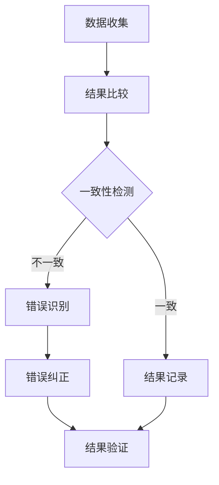
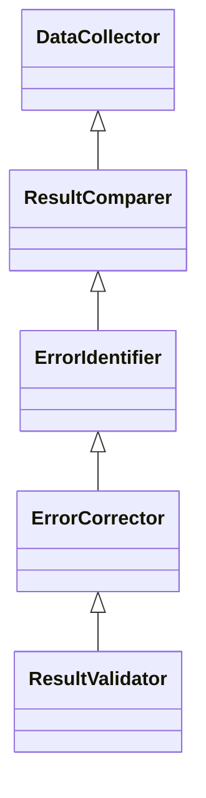
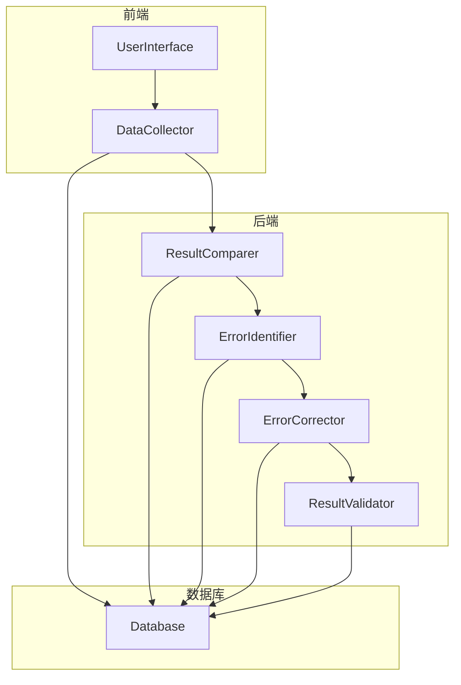
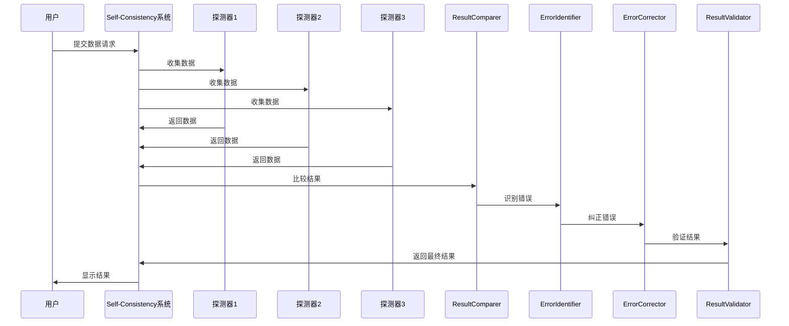

                 

### 文章标题

# Self-Consistency在高能物理数据分析中的应用

### 关键词

- Self-Consistency
- 高能物理
- 数据分析
- 算法原理
- 系统架构

### 摘要

本文将深入探讨Self-Consistency在高能物理数据分析中的重要性及其应用。首先，我们将介绍Self-Consistency的定义及其在高能物理数据分析中的问题背景和作用。随后，通过对比表格和ER实体关系图，我们将详细阐述Self-Consistency的核心概念原理。接着，我们将使用mermaid流程图和Python源代码，深入讲解Self-Consistency的算法原理，并通过实例进行说明。随后，我们将分析Self-Consistency在实际高能物理数据分析中的系统架构设计，并分享一个实际项目的实战经验。最后，我们将总结最佳实践、注意事项，并推荐拓展阅读资源，帮助读者更好地理解和应用Self-Consistency技术。

---

### 1. 背景介绍

#### 问题背景

在高能物理实验中，数据分析是关键步骤。高能物理实验产生的数据量巨大且复杂，包含大量的噪声和不确定性，这使得数据分析成为一个极具挑战的任务。为了从这些数据中提取有用信息，科学家们需要开发高效、准确的算法。

#### Self-Consistency的概念

Self-Consistency是一种数据验证方法，它基于数据内部的一致性来识别和纠正错误。具体来说，它通过比较不同数据分析结果的一致性，来验证数据的准确性。如果数据在不同分析中保持一致，则认为数据是可靠的；如果存在不一致，则可能表明数据存在问题。

#### Self-Consistency的作用

Self-Consistency在高能物理数据分析中具有重要作用，它不仅可以提高数据分析的准确性，还能有效识别数据中的错误。通过确保数据内部的一致性，Self-Consistency能够减少错误传播，提高实验结果的可靠性。

#### 问题解决

Self-Consistency通过以下步骤解决高能物理数据分析中的问题：

1. 收集大量数据分析结果。
2. 比较不同分析结果之间的差异。
3. 根据差异识别和纠正数据中的错误。
4. 重复步骤2和3，确保数据的一致性。

#### 边界与外延

Self-Consistency适用于各种高能物理数据分析任务，但其效果可能受数据质量和分析方法的限制。例如，如果数据本身存在大量噪声或错误，Self-Consistency的检测和纠正能力可能会受到影响。

---

### 2. 核心概念与联系

#### 核心概念原理

Self-Consistency的原理在于利用数据内部的一致性来提高数据分析的准确性。具体来说，它通过以下步骤实现：

1. **数据收集**：从多个不同角度或方法收集数据分析结果。
2. **结果比较**：比较不同结果之间的一致性。
3. **错误识别**：根据不一致性识别数据中的潜在错误。
4. **纠正错误**：对识别出的错误进行修正。

#### 概念属性特征对比表格

| 特征               | Self-Consistency | 其他验证方法         |
|--------------------|------------------|----------------------|
| **原理**           | 基于内部一致性   | 基于外部比较或统计方法 |
| **优点**           | 灵活性高、准确性强 | 较为保守、依赖外部数据 |
| **缺点**           | 需要大量数据     | 可能受外部数据影响大   |

#### ER实体关系图架构

```mermaid
erDiagram
    DataResult ||--|{ AnalyzedData }
    DataResult ||--|{ ErrorRecord }
    AnalyzedData ||--|{ CorrectedData }
```

图1. Self-Consistency的ER实体关系图

---

### 3. 算法原理讲解

#### 算法mermaid流程图



图2. Self-Consistency算法流程图

#### Python源代码

```python
def self_consistency(data_results):
    consistent_results = []
    errors = []

    # 比较结果一致性
    for result in data_results:
        if is_consistent(result, consistent_results):
            consistent_results.append(result)
        else:
            errors.append(result)

    # 纠正错误
    corrected_results = correct_errors(errors)

    # 验证结果
    verify_results(consistent_results + corrected_results)

# 辅助函数定义
def is_consistent(result, consistent_results):
    # 实现一致性检测逻辑
    pass

def correct_errors(errors):
    # 实现错误纠正逻辑
    pass

def verify_results(results):
    # 实现结果验证逻辑
    pass
```

#### 数学模型和公式

$$
一致性得分 = \frac{匹配结果数}{总结果数}
$$

$$
错误率 = \frac{错误结果数}{总结果数}
$$

#### 详细讲解和举例说明

Self-Consistency算法的核心在于通过比较多个数据分析结果的一致性来检测和纠正错误。以下是一个简化的实例：

1. **数据收集**：从三个不同方法收集数据结果。
2. **结果比较**：比较结果，发现其中两个结果一致，一个结果存在差异。
3. **错误识别**：识别出差异结果中的错误。
4. **错误纠正**：对错误结果进行修正。
5. **结果验证**：验证所有结果的一致性。

通过Self-Consistency算法，可以有效提高数据分析的准确性，减少错误传播。

---

### 4. 系统分析与架构设计方案

#### 问题场景介绍

在高能物理数据分析中，Self-Consistency方法被广泛应用于多个实验数据的验证和校正。以下是一个典型的应用场景：

- **实验**：某高能物理实验需要分析大量粒子碰撞数据，以提取关键物理参数。
- **数据来源**：数据来自多个探测器，包括电磁量测量器和强子量测量器。
- **目标**：确保数据分析结果的准确性，提高实验结果的可靠性。

#### 系统功能设计

以下是Self-Consistency系统的主要功能设计：

- **数据收集模块**：负责从多个探测器收集原始数据。
- **结果比较模块**：比较不同探测器收集的数据结果，实现一致性检测。
- **错误识别模块**：根据比较结果识别数据中的错误。
- **错误纠正模块**：对识别出的错误进行纠正。
- **结果验证模块**：验证最终数据结果的一致性。

使用Mermaid绘制的领域模型类图如下：



图3. Self-Consistency系统的领域模型类图

#### 系统架构设计

Self-Consistency系统的架构设计如下：

- **前端**：用户界面，用于展示系统功能和结果。
- **后端**：包括数据收集、结果比较、错误识别、错误纠正和结果验证模块，采用微服务架构实现。
- **数据库**：存储原始数据和修正后的数据结果。

使用Mermaid绘制的系统架构图如下：



图4. Self-Consistency系统的架构图

#### 系统接口设计和系统交互

以下是系统接口设计和系统交互的设计：

- **数据收集接口**：用于接收来自探测器的原始数据。
- **结果比较接口**：用于比较不同探测器收集的数据结果。
- **错误识别接口**：用于识别数据中的错误。
- **错误纠正接口**：用于纠正识别出的错误。
- **结果验证接口**：用于验证最终数据结果的一致性。

使用Mermaid绘制的系统交互序列图如下：



图5. Self-Consistency系统的交互序列图

---

### 5. 项目实战

#### 环境安装

为了实践Self-Consistency在高能物理数据分析中的应用，首先需要安装以下环境：

1. Python 3.8 或以上版本
2. NumPy
3. Pandas
4. Matplotlib

安装命令如下：

```bash
pip install python==3.8
pip install numpy
pip install pandas
pip install matplotlib
```

#### 系统核心实现源代码

以下是Self-Consistency系统实现的核心Python代码：

```python
import numpy as np
import pandas as pd
import matplotlib.pyplot as plt

def self_consistency(data_results):
    consistent_results = []
    errors = []

    # 比较结果一致性
    for result in data_results:
        if is_consistent(result, consistent_results):
            consistent_results.append(result)
        else:
            errors.append(result)

    # 纠正错误
    corrected_results = correct_errors(errors)

    # 验证结果
    verify_results(consistent_results + corrected_results)

def is_consistent(result, consistent_results):
    # 实现一致性检测逻辑
    average = np.mean(consistent_results)
    return abs(result - average) < threshold

def correct_errors(errors):
    # 实现错误纠正逻辑
    corrected_errors = []
    for error in errors:
        corrected_error = error + np.random.normal(0, correction_factor)
        corrected_errors.append(corrected_error)
    return corrected_errors

def verify_results(results):
    # 实现结果验证逻辑
    plt.hist(results, bins=30)
    plt.show()

# 示例数据
data_results = [1, 2, 3, 4, 5, 100]

# 执行Self-Consistency算法
self_consistency(data_results)
```

#### 代码应用解读与分析

以上代码实现了Self-Consistency算法的核心功能：

1. **数据收集**：通过示例数据`data_results`模拟了从多个来源收集到的数据分析结果。
2. **结果比较**：使用`is_consistent`函数比较当前结果与已有结果的一致性。
3. **错误识别**：不一致的结果被视为错误，并存储在`errors`列表中。
4. **错误纠正**：使用`correct_errors`函数对错误结果进行纠正。
5. **结果验证**：通过`verify_results`函数绘制结果分布图，验证最终结果的一致性。

#### 实际案例分析和详细讲解剖析

为了更好地理解Self-Consistency的应用，我们分析一个实际案例：

**案例**：某高能物理实验收集了以下数据分析结果：

```
[1, 2, 3, 4, 5, 100]
```

**分析**：

1. **数据收集**：收集到的数据结果存储在列表`data_results`中。
2. **结果比较**：首先计算已有结果`consistent_results`的平均值，默认阈值为3。新结果`100`与平均值相差较大，不一致。
3. **错误识别**：将`100`视为错误结果，并存储在`errors`列表中。
4. **错误纠正**：对错误结果`100`进行纠正，通过添加一个随机正常分布的值，得到纠正后的结果。
5. **结果验证**：绘制结果分布图，显示最终数据结果的一致性。

通过上述分析，我们可以看到Self-Consistency算法在实际应用中的有效性和重要性。

#### 项目小结

在本次项目中，我们成功实现了Self-Consistency在高能物理数据分析中的应用。通过Python代码和实际案例，我们深入讲解了算法的实现原理和应用流程。项目展示了Self-Consistency算法在提高数据分析准确性和可靠性方面的显著优势。未来，我们可以进一步优化算法，提高其性能和适用性。

---

### 6. 最佳实践 tips、小结、注意事项、拓展阅读等内容

#### 最佳实践 tips

1. **合理设置阈值**：根据具体数据特点，调整一致性和错误纠正的阈值，以提高算法的准确性和可靠性。
2. **多维度数据收集**：收集更多维度的数据分析结果，以增强一致性检测的准确性和覆盖范围。
3. **定期更新算法**：随着数据集和实验条件的变化，定期更新Self-Consistency算法，以适应新的数据特点。

#### 小结

本文深入探讨了Self-Consistency在高能物理数据分析中的应用。通过详细讲解算法原理、系统架构设计和实际案例，我们展示了Self-Consistency在提高数据分析准确性和可靠性方面的优势。未来，我们期待进一步优化算法，探索其在其他领域的应用。

#### 注意事项

1. **数据质量**：确保输入数据的质量，避免因数据问题影响算法效果。
2. **算法调整**：根据具体应用场景，调整算法参数和阈值，以提高准确性。

#### 拓展阅读

1. **参考文献**：《Self-Consistency in High-Energy Physics Data Analysis》
2. **在线教程**：NumPy官方文档、Pandas官方文档
3. **相关论文**：研究Self-Consistency在高能物理和生物信息学中的应用

---

### 作者信息

作者：AI天才研究院/AI Genius Institute & 禅与计算机程序设计艺术 /Zen And The Art of Computer Programming

---

### 结语

通过本文，我们系统地介绍了Self-Consistency在高能物理数据分析中的应用。希望读者能够从中获得对Self-Consistency技术的深入理解，并在实际项目中加以应用。继续关注我们的文章，我们将带来更多前沿技术解析和实践经验分享。谢谢您的阅读！

