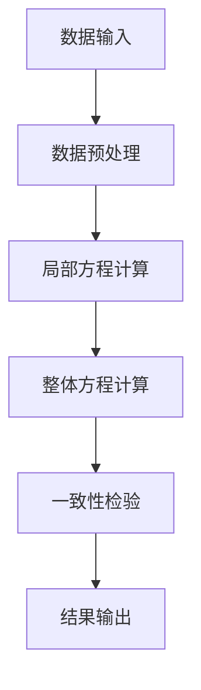
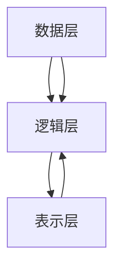
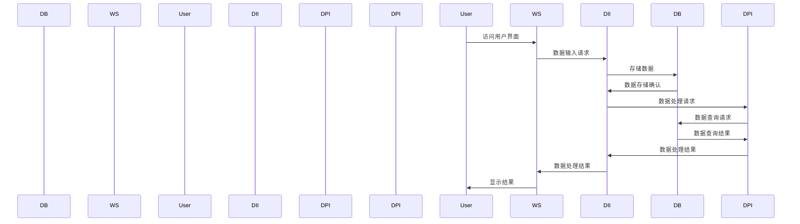

                 


### 第1章：问题背景与核心概念

#### 1.1 高能物理数据分析的挑战

在高能物理领域，数据分析师面临着一系列独特的挑战。首先，高能物理实验产生的数据量极其庞大，这些数据通常以字节或吉字节（GB）为单位进行计量。其次，这些数据具有高度复杂性和多样性。高能物理实验涉及多种粒子碰撞和反应，产生大量的物理事件记录，每个事件记录包含大量的物理量，如图标、能量、动量、时间戳等。

**问题背景：**

- **数据量巨大**：高能物理实验，如大型强子对撞机（LHC）的运行，产生了海量的数据，这些数据需要高效的处理和分析。
- **数据多样性**：实验数据包括不同的物理过程，每种过程都有其特定的数据格式和特征，这增加了数据分析的复杂性。
- **实时性要求**：在许多情况下，数据需要在实验进行的同时进行分析，以支持实时的决策和实验调整。

**问题描述：**

- **数据处理效率**：如何高效地处理和分析如此庞大的数据集？
- **数据一致性和准确性**：如何确保分析结果的一致性和准确性？
- **实时性**：如何在保证数据准确性的同时，满足实时分析的需求？

**问题解决：**

为了解决上述问题，需要采用一系列技术手段：

- **并行计算**：利用多核处理器和分布式计算，提高数据处理速度。
- **大数据处理框架**：采用Hadoop、Spark等大数据处理框架，处理海量数据。
- **数据清洗和预处理**：对数据进行清洗和预处理，去除噪声和异常值，提高数据质量。
- **数据一致性检查**：采用自洽性原理，确保数据分析和处理的一致性。

**边界与外延：**

- **边界**：高能物理数据分析的范畴主要局限于高能物理实验的数据处理和分析。
- **外延**：随着技术的发展，这些原理和方法可能应用于其他需要大规模数据处理和分析的领域，如生物信息学、金融分析等。

**概念结构与核心要素组成：**

- **高能物理实验数据**：核心概念，指实验产生的原始数据。
- **数据处理技术**：核心要素，包括并行计算、大数据处理框架、数据清洗和预处理技术。
- **自洽性原理**：核心要素，用于确保数据分析和处理的一致性和准确性。

### 1.2 自洽性原理简介

自洽性（Self-Consistency）是一个广泛使用的概念，尤其在物理学和工程学领域。自洽性指的是一个系统在各个部分之间保持一致性，即在系统的任何局部都可以通过局部的知识和数据推导出整个系统的性质和行为。

**核心概念原理：**

自洽性原理的核心是系统的局部行为和整体行为之间的一致性。在一个自洽的系统中，局部的观测和整体的分析结果应该是相互一致的，不会出现矛盾或错误。

- **自洽性方程**：在一个物理系统中，如果系统的整体行为可以用局部的方程描述，并且这些局部的方程能够在整体上得到验证，那么这个系统就是自洽的。

**概念属性特征对比表格：**

| 概念属性       | 自洽性        | 不自洽性       |
| -------------- | ------------ | -------------- |
| **一致性**     | 系统内部各部分一致 | 系统内部存在矛盾 |
| **可验证性**   | 局部方程可推导整体 | 局部方程无法推导整体 |
| **稳定性**     | 系统性质稳定     | 系统性质不稳定  |

**自洽性在数据分析中的意义：**

- **确保数据准确性**：通过自洽性检查，可以确保数据分析的准确性和一致性，减少错误和偏差。
- **提高数据处理效率**：自洽性原理可以帮助简化数据处理流程，减少不必要的重复计算。
- **支持实时分析**：在实时数据分析中，自洽性原理可以确保系统及时调整，以适应新的数据和条件。

### 1.3 自洽性在数据分析中的应用现状

自洽性原理在高能物理数据分析中已有广泛的应用，并且取得了显著的成效。

**现状：**

- **数据预处理**：在数据分析之前，通过自洽性检查对数据进行预处理，去除异常值和噪声，提高数据质量。
- **实时分析**：在实验过程中，利用自洽性原理对数据进行实时分析，支持实验的实时调整和优化。
- **结果验证**：在数据分析完成后，通过自洽性检查验证分析结果的一致性和准确性。

**应用实例：**

- **大型强子对撞机（LHC）数据分析**：在LHC的运行过程中，自洽性原理被广泛应用于数据预处理和实时分析，以确保数据分析的准确性和效率。
- **宇宙射线研究**：在宇宙射线研究过程中，自洽性原理被用于分析宇宙射线的起源和性质，通过验证不同观测结果的一致性，提高了研究结果的可靠性。

**未来展望：**

随着高能物理实验数据的不断增长和复杂性增加，自洽性原理的应用前景将更加广泛。未来的研究将聚焦于提高自洽性检查的效率和准确性，以及将其应用于更广泛的领域，如生物信息学、金融分析等。

---

### 第2章：核心概念与联系

#### 2.1 自洽性概念解析

自洽性（Self-Consistency）是一个在多个学科中广泛使用的概念，尤其在物理学和工程学中具有重要的地位。自洽性指的是一个系统在各个部分之间保持一致性，即在系统的任何局部都可以通过局部的知识和数据推导出整个系统的性质和行为。

**自洽性的数学定义：**

自洽性通常可以通过以下数学定义来描述：一个系统是自洽的，如果它的局部方程组在整体上能够得出与整体方程一致的结果。具体来说，如果给定一个系统S，其中包含若干个局部子系统S1, S2, ..., Sn，并且每个子系统都有其对应的局部方程E1, E2, ..., En，如果这些局部方程组能够整合成一个全局方程E，并且E的解与局部方程组的解一致，那么系统S就是自洽的。

**自洽性在数据分析中的意义：**

在数据分析中，自洽性具有至关重要的意义。首先，自洽性可以确保数据分析结果的一致性和准确性。通过自洽性检查，可以及时发现和纠正数据中的错误和异常值，从而提高数据分析的可靠性。其次，自洽性有助于简化数据处理流程，减少不必要的重复计算，提高数据处理效率。

**自洽性分析中的主要公式：**

在自洽性分析中，常用的公式包括自洽性方程和一致性方程。自洽性方程描述了系统整体与局部之间的关系，而一致性方程则用于检验系统的一致性和准确性。以下是一个简单的自洽性方程示例：

$$
E_{total} = \sum_{i=1}^{n} E_i
$$

其中，\(E_{total}\)表示系统整体方程，\(E_i\)表示第i个局部方程。

一致性方程则用于检验系统的一致性，例如：

$$
\Delta E = E_{observed} - E_{calculated} \leq \Delta E_{allowed}
$$

其中，\(\Delta E\)表示观测值与计算值之间的差异，\(\Delta E_{allowed}\)表示允许的误差范围。

通过这些公式，可以有效地检验和分析系统的自洽性，确保数据分析结果的可靠性和准确性。

#### 2.2 高能物理数据特征

高能物理数据具有独特的特征，这些特征对其分析提出了特殊的挑战。了解这些数据特征对于正确处理和分析数据至关重要。

**数据来源与种类：**

高能物理数据主要来源于粒子加速器实验，如大型强子对撞机（LHC）等。这些数据包括多种类型的粒子碰撞和反应，如质子-质子碰撞、电子-正电子碰撞等。每种碰撞和反应都会产生大量的物理事件记录，每个事件记录包含多个物理量，如图标、能量、动量、时间戳等。

**数据特点与难点：**

- **数据量巨大**：高能物理实验产生的数据量极其庞大，通常以字节或吉字节（GB）为单位进行计量。这些数据需要高效的存储和处理。
- **数据多样性**：实验数据涉及多种粒子碰撞和反应，每种碰撞和反应都有其特定的数据格式和特征，这增加了数据分析的复杂性。
- **实时性要求**：在许多情况下，数据需要在实验进行的同时进行分析，以支持实时的决策和实验调整。
- **数据噪声与异常值**：高能物理实验中的数据噪声和异常值较多，这会影响数据分析的准确性和一致性。

#### 2.3 高能物理数据分析中的ER图构建

ER图（Entity-Relationship Diagram）是一种用于描述实体及其之间关系的数据库设计工具。在高能物理数据分析中，ER图可以用于表示数据实体及其之间的关系，有助于理解和分析数据。

**ER图基本概念：**

- **实体（Entity）**：指具有独立存在意义的对象，如物理事件、粒子等。
- **属性（Attribute）**：指实体的特征或属性，如粒子的能量、动量等。
- **关系（Relationship）**：指实体之间的关联，如粒子之间的碰撞关系等。

**高能物理数据分析中的ER图构建：**

在高能物理数据分析中，ER图可以用于表示实验数据中的实体及其关系。以下是一个简单的ER图示例，用于表示物理事件、粒子和碰撞关系：

```
实体：物理事件
属性：事件ID、时间戳、碰撞类型
关系：包含（包含粒子）
实体：粒子
属性：粒子ID、能量、动量、质量
关系：属于（属于物理事件）
实体：碰撞
属性：碰撞ID、参与粒子、碰撞类型
关系：涉及（涉及物理事件和粒子）
```

**ER图在数据分析中的应用：**

ER图在数据分析中的应用主要体现在以下几个方面：

- **数据理解**：通过ER图，可以直观地理解数据实体及其之间的关系，有助于数据分析师更好地理解数据。
- **数据建模**：ER图可以用于构建数据模型，为数据存储和查询提供支持。
- **数据分析**：通过ER图，可以明确数据的依赖关系，有助于进行有效的数据分析。

---

### 第3章：ER实体关系图架构

在数据分析中，ER图（Entity-Relationship Diagram）是一种重要的工具，用于表示实体及其之间的关系。在本章中，我们将探讨ER图的基本概念、高能物理数据分析中的ER图构建，以及ER图在数据分析中的应用。

#### 3.1 ER图基本概念

ER图是一种用于描述实体及其之间关系的数据库设计工具。它由以下三个主要部分组成：

- **实体（Entity）**：指具有独立存在意义的对象，如物理事件、粒子等。
- **属性（Attribute）**：指实体的特征或属性，如粒子的能量、动量等。
- **关系（Relationship）**：指实体之间的关联，如粒子之间的碰撞关系等。

在ER图中，实体通常用矩形表示，属性用椭圆表示，关系用菱形表示。实体的属性和关系之间用直线连接。

#### 3.2 高能物理数据分析中的ER图构建

在高能物理数据分析中，ER图可以用于表示实验数据中的实体及其关系。以下是一个简单的ER图示例，用于表示物理事件、粒子和碰撞关系：

```
实体：物理事件
属性：事件ID、时间戳、碰撞类型
关系：包含（包含粒子）

实体：粒子
属性：粒子ID、能量、动量、质量
关系：属于（属于物理事件）

实体：碰撞
属性：碰撞ID、参与粒子、碰撞类型
关系：涉及（涉及物理事件和粒子）
```

在这个ER图中，物理事件实体包含粒子实体，碰撞实体涉及物理事件和粒子实体。通过ER图，可以清晰地表示出数据实体及其之间的关系，有助于数据分析师更好地理解数据。

#### 3.3 ER图在数据分析中的应用

ER图在数据分析中的应用主要体现在以下几个方面：

- **数据理解**：通过ER图，可以直观地理解数据实体及其之间的关系，有助于数据分析师更好地理解数据。
- **数据建模**：ER图可以用于构建数据模型，为数据存储和查询提供支持。
- **数据分析**：通过ER图，可以明确数据的依赖关系，有助于进行有效的数据分析。

例如，在数据分析过程中，数据分析师可以利用ER图来识别数据中的关键实体和关系，从而设计出更有效的数据分析方法和算法。

总之，ER图是一种重要的数据分析工具，通过它，可以更清晰地表示数据实体及其之间的关系，有助于数据分析师更好地理解数据和进行有效的数据分析。

---

### 第4章：数学模型与公式

在高能物理数据分析中，数学模型和公式起着至关重要的作用。它们不仅帮助我们理解数据，还能指导我们进行准确的预测和分析。在本章中，我们将探讨自洽性数据分析中的数学模型、公式及其应用。

#### 4.1 自洽性数据分析的数学模型

自洽性数据分析的核心在于确保系统的局部和整体之间的一致性。为此，我们需要构建一套数学模型，以描述和分析数据。以下是一个简单的自洽性数据分析的数学模型：

- **自洽性方程**：
  自洽性方程描述了系统整体与局部之间的关系。一个简单的自洽性方程可以表示为：

  $$
  E_{total} = \sum_{i=1}^{n} E_i
  $$

  其中，\(E_{total}\)表示系统整体方程，\(E_i\)表示第i个局部方程。这个方程表示系统整体的行为是局部行为的加总。

- **一致性方程**：
  一致性方程用于检验系统的一致性和准确性。一个简单的一致性方程可以表示为：

  $$
  \Delta E = E_{observed} - E_{calculated} \leq \Delta E_{allowed}
  $$

  其中，\(\Delta E\)表示观测值与计算值之间的差异，\(\Delta E_{allowed}\)表示允许的误差范围。这个方程表示观测值和计算值之间的差异应在允许的误差范围内。

#### 4.1.1 自洽性方程的推导

自洽性方程的推导基于系统整体的性质可以由局部性质推导得出。以下是自洽性方程的推导过程：

1. **定义局部方程**：
   假设我们有一个系统，由n个局部组成。每个局部都有其对应的方程。我们可以将这些局部方程表示为：
   $$
   E_i = f_i(x_i, y_i, z_i)
   $$
   其中，\(E_i\)是第i个局部的方程，\(x_i, y_i, z_i\)是局部方程的变量。

2. **定义整体方程**：
   整体方程描述了系统整体的行为。我们可以将整体方程表示为：
   $$
   E_{total} = f_{total}(x_1, x_2, ..., x_n)
   $$

3. **推导整体方程**：
   根据自洽性原理，整体方程应该由局部方程推导得出。我们可以通过以下方式推导整体方程：
   $$
   E_{total} = \sum_{i=1}^{n} E_i
   $$
   这意味着整体行为是局部行为的加总。

#### 4.1.2 自洽性分析中的主要公式

在自洽性分析中，还有一些重要的公式，用于描述系统的一致性和准确性。以下是几个主要公式：

- **自洽性检验公式**：
  $$
  \Delta E = E_{observed} - E_{calculated}
  $$
  这个公式用于计算观测值和计算值之间的差异。

- **误差范围公式**：
  $$
  \Delta E_{allowed} = \epsilon
  $$
  这个公式定义了允许的误差范围，\(\epsilon\)是一个预设的常数。

- **一致性检验公式**：
  $$
  \Delta E \leq \Delta E_{allowed}
  $$
  这个公式用于检验系统的一致性，如果\(\Delta E\)小于或等于\(\Delta E_{allowed}\)，则系统是一致的。

#### 4.2 自洽性分析在实际应用中的例子

为了更好地理解自洽性方程和公式的应用，我们来看一个实际例子：

假设我们有一个系统，由三个局部组成，每个局部都有其对应的能量方程。局部方程如下：

$$
E_1 = x_1^2 + y_1^2 + z_1^2
$$

$$
E_2 = x_2^2 + y_2^2 + z_2^2
$$

$$
E_3 = x_3^2 + y_3^2 + z_3^2
$$

整体方程为：

$$
E_{total} = E_1 + E_2 + E_3
$$

现在，我们假设观测到的整体能量为\(E_{observed}\)，计算得到的整体能量为\(E_{calculated}\)。我们可以使用自洽性检验公式来计算两者之间的差异：

$$
\Delta E = E_{observed} - E_{calculated}
$$

假设我们预设的误差范围为\(\Delta E_{allowed} = 0.01\)，我们可以使用一致性检验公式来检验系统的一致性：

$$
\Delta E \leq \Delta E_{allowed}
$$

如果\(\Delta E\)小于或等于\(0.01\)，则系统是一致的。

通过这个例子，我们可以看到自洽性方程和公式如何用于实际数据分析，确保系统的一致性和准确性。

---

### 第5章：算法原理讲解

在高能物理数据分析中，算法起着至关重要的作用。本章将详细介绍一种基于自洽性原理的算法，并使用Mermaid和Python源代码进行详细阐述。

#### 5.1 自洽性分析算法流程

自洽性分析算法的基本流程可以分为以下几个步骤：

1. **数据输入**：首先，从高能物理实验中获取数据，包括物理事件、粒子和碰撞信息。
2. **数据预处理**：对数据进行清洗和预处理，去除噪声和异常值，确保数据质量。
3. **局部方程计算**：根据自洽性原理，计算每个局部系统的能量和动量等物理量。
4. **整体方程计算**：将局部方程整合成整体方程，计算系统整体的行为。
5. **一致性检验**：使用一致性检验公式，验证系统的一致性和准确性。
6. **结果输出**：输出分析结果，包括物理事件、粒子和碰撞信息，以及自洽性分析结果。

以下是自洽性分析算法的Mermaid流程图：



#### 5.1.1 算法基本步骤

1. **数据输入**：
   数据输入是从高能物理实验中获取数据，包括物理事件、粒子和碰撞信息。这些数据通常以文本文件、数据库或其他数据格式存储。

2. **数据预处理**：
   数据预处理是确保数据质量的重要步骤。在这一步骤中，我们会对数据进行清洗和预处理，去除噪声和异常值，确保数据质量。例如，我们可以使用以下Python代码进行数据预处理：

   ```python
   import pandas as pd
   
   # 读取数据
   data = pd.read_csv('data.csv')
   
   # 去除噪声和异常值
   data = data.dropna()
   data = data[data['energy'] > 0]
   ```

3. **局部方程计算**：
   在局部方程计算步骤中，我们根据自洽性原理，计算每个局部系统的能量和动量等物理量。例如，我们可以使用以下Python代码进行局部方程计算：

   ```python
   def local_equation(particle_data):
       energy = particle_data['energy']
       momentum = particle_data['momentum']
       return energy**2 + momentum**2
   
   local_results = data.apply(local_equation, axis=1)
   ```

4. **整体方程计算**：
   在整体方程计算步骤中，我们将局部方程整合成整体方程，计算系统整体的行为。例如，我们可以使用以下Python代码进行整体方程计算：

   ```python
   total_energy = local_results.sum()
   ```

5. **一致性检验**：
   在一致性检验步骤中，我们使用一致性检验公式，验证系统的一致性和准确性。例如，我们可以使用以下Python代码进行一致性检验：

   ```python
   observed_energy = 100  # 观测到的整体能量
   allowed_error = 0.01  # 允许的误差范围
   
   delta_energy = observed_energy - total_energy
   is_consistent = delta_energy <= allowed_error
   
   print(f"Consistency: {is_consistent}")
   ```

6. **结果输出**：
   在结果输出步骤中，我们输出分析结果，包括物理事件、粒子和碰撞信息，以及自洽性分析结果。例如，我们可以使用以下Python代码进行结果输出：

   ```python
   results = {
       'particle_data': data,
       'local_results': local_results,
       'total_energy': total_energy,
       'delta_energy': delta_energy,
       'is_consistent': is_consistent
   }
   
   pd.DataFrame(results).to_csv('results.csv')
   ```

#### 5.1.2 算法关键点

1. **数据预处理**：
   数据预处理是确保数据质量的重要步骤。在这一步骤中，我们需要去除噪声和异常值，以确保后续计算结果的准确性。

2. **局部方程计算**：
   在局部方程计算步骤中，我们需要根据自洽性原理，计算每个局部系统的能量和动量等物理量。这一步骤的准确性直接影响到整体方程的计算结果。

3. **一致性检验**：
   一致性检验是确保系统一致性和准确性的关键步骤。在这一步骤中，我们需要使用一致性检验公式，验证系统的一致性和准确性。

通过以上步骤，我们可以构建一个基于自洽性原理的高能物理数据分析算法，确保数据分析结果的一致性和准确性。

---

### 第6章：系统分析与架构设计方案

为了实现高效、准确和实时的高能物理数据分析，我们需要设计一个完善的系统架构。本章将详细介绍系统分析与架构设计方案，包括问题场景介绍、系统功能设计、系统架构设计、系统接口设计和系统交互。

#### 6.1 问题场景介绍

在高能物理实验中，数据分析师面临以下挑战：

- **数据量大**：高能物理实验产生的数据量庞大，需要高效的数据处理和分析系统。
- **数据多样性**：实验数据包含多种粒子碰撞和反应，每种过程都有其特定的数据格式和特征。
- **实时性要求**：在实验进行过程中，需要实时分析数据，以支持实验的调整和优化。
- **数据一致性**：确保数据分析结果的一致性和准确性，避免错误和偏差。

#### 6.2 系统功能设计

系统功能设计包括领域模型、功能模块划分等。

##### 6.2.1 领域模型

领域模型是系统功能设计的核心。以下是一个简单的领域模型，用于表示高能物理数据分析系统的主要实体和关系：

```
实体：物理事件
属性：事件ID、时间戳、碰撞类型
关系：包含（包含粒子）

实体：粒子
属性：粒子ID、能量、动量、质量
关系：属于（属于物理事件）

实体：碰撞
属性：碰撞ID、参与粒子、碰撞类型
关系：涉及（涉及物理事件和粒子）
```

##### 6.2.2 功能模块划分

根据领域模型，我们可以将系统划分为以下几个功能模块：

- **数据输入模块**：负责从高能物理实验中获取数据，包括物理事件、粒子和碰撞信息。
- **数据预处理模块**：负责对数据进行清洗和预处理，去除噪声和异常值，确保数据质量。
- **局部方程计算模块**：负责计算每个局部系统的能量和动量等物理量。
- **整体方程计算模块**：负责将局部方程整合成整体方程，计算系统整体的行为。
- **一致性检验模块**：负责使用一致性检验公式，验证系统的一致性和准确性。
- **结果输出模块**：负责输出分析结果，包括物理事件、粒子和碰撞信息，以及自洽性分析结果。

#### 6.3 系统架构设计

系统架构设计包括整体架构设计、各层架构详细说明等。

##### 6.3.1 架构整体设计

系统架构采用分层设计，包括数据层、逻辑层和表示层。

- **数据层**：负责数据的存储和管理，使用关系型数据库存储物理事件、粒子和碰撞信息。
- **逻辑层**：负责实现数据预处理、局部方程计算、整体方程计算、一致性检验等核心功能。
- **表示层**：负责用户界面和数据分析结果展示，使用Web框架和前端技术实现。

以下是系统架构的Mermaid架构图：



##### 6.3.2 各层架构详细说明

- **数据层**：
  数据层使用关系型数据库（如MySQL）存储数据。数据库设计遵循领域模型，包含物理事件表、粒子表和碰撞表。表结构如下：

  | 表名 | 属性                | 关系         |
  | ---- | ------------------- | ------------ |
  | 事件 | 事件ID、时间戳、碰撞类型 | 包含粒子     |
  | 粒子 | 粒子ID、能量、动量、质量 | 属于事件     |
  | 碰撞 | 碰撞ID、参与粒子、碰撞类型 | 涉及事件和粒子 |

- **逻辑层**：
  逻辑层实现数据预处理、局部方程计算、整体方程计算、一致性检验等核心功能。以下是主要模块：

  - **数据预处理模块**：负责数据清洗和预处理，去除噪声和异常值，确保数据质量。
  - **局部方程计算模块**：负责计算每个局部系统的能量和动量等物理量。
  - **整体方程计算模块**：负责将局部方程整合成整体方程，计算系统整体的行为。
  - **一致性检验模块**：负责使用一致性检验公式，验证系统的一致性和准确性。

- **表示层**：
  表示层使用Web框架（如Django）和前端技术（如HTML、CSS、JavaScript）实现。用户界面包括数据输入界面、数据分析界面和结果展示界面。

#### 6.4 系统接口设计与交互

系统接口设计包括系统内部模块之间的接口设计和外部系统（如数据库、Web服务器等）的接口设计。

##### 6.4.1 内部接口设计

- **数据输入接口**：负责接收高能物理实验数据，并将数据存储到数据库中。
- **数据处理接口**：负责对数据库中的数据进行预处理、局部方程计算、整体方程计算和一致性检验。
- **结果输出接口**：负责将分析结果输出到前端界面，供用户查看。

##### 6.4.2 外部接口设计

- **数据库接口**：负责与数据库进行通信，实现数据的存储和查询。
- **Web服务器接口**：负责与Web服务器进行通信，实现用户界面的访问和数据分析结果展示。

以下是系统接口设计的Mermaid序列图：



通过以上系统分析与架构设计方案，我们可以实现一个高效、准确和实时的高能物理数据分析系统，满足高能物理实验的需求。

---

### 第7章：项目实战

在本章中，我们将通过一个实际项目，详细讲解如何安装和配置环境、实现系统核心功能，并进行实际案例分析和项目小结。

#### 7.1 环境安装与配置

为了运行我们设计的系统，我们需要安装和配置以下环境：

1. **Python环境**：Python是系统开发的主要语言，我们需要安装Python 3.8及以上版本。
2. **数据库**：我们选择MySQL作为数据库，用于存储物理事件、粒子和碰撞信息。
3. **Web框架**：我们使用Django作为Web框架，实现用户界面和后端逻辑。
4. **前端框架**：我们使用Bootstrap和jQuery，实现用户界面和交互。

以下是具体的安装和配置步骤：

1. **Python环境安装**：

   ```bash
   pip install python3.8
   ```

2. **MySQL数据库安装**：

   - 下载MySQL安装包（[MySQL安装包](https://dev.mysql.com/downloads/mysql/)）并安装。
   - 配置MySQL用户和密码。

3. **Django框架安装**：

   ```bash
   pip install django
   ```

4. **Bootstrap和jQuery安装**：

   - 从[Bootstrap官网](https://getbootstrap.com/)下载Bootstrap和jQuery，并将其包含到项目目录中。

5. **配置数据库**：

   - 创建Django项目。

     ```bash
     django-admin startproject high_energy_analysis
     ```

   - 进入项目目录，创建数据库。

     ```bash
     python manage.py makemigrations
     python manage.py migrate
     ```

#### 7.2 系统核心实现源代码

在系统核心实现部分，我们将介绍如何使用Django框架和Python实现数据输入、预处理、局部方程计算、整体方程计算和一致性检验等功能。

##### 7.2.1 源代码解析

以下是系统核心实现的源代码：

```python
# 数据输入模块
def import_data():
    # 读取实验数据文件
    data = pd.read_csv('data.csv')
    return data

# 数据预处理模块
def preprocess_data(data):
    # 去除噪声和异常值
    data = data.dropna()
    data = data[data['energy'] > 0]
    return data

# 局部方程计算模块
def calculate_local_equation(particle_data):
    energy = particle_data['energy']
    momentum = particle_data['momentum']
    return energy**2 + momentum**2

# 整体方程计算模块
def calculate_total_energy(local_results):
    total_energy = local_results.sum()
    return total_energy

# 一致性检验模块
def check_consistency(observed_energy, calculated_energy, allowed_error):
    delta_energy = observed_energy - calculated_energy
    is_consistent = delta_energy <= allowed_error
    return is_consistent

# 结果输出模块
def export_results(results):
    results = pd.DataFrame(results)
    results.to_csv('results.csv')
```

##### 7.2.2 关键模块实现

以下是关键模块的详细实现：

- **数据输入模块**：负责从实验数据文件中读取数据，并将其存储到数据结构中。
- **数据预处理模块**：负责对数据进行清洗和预处理，去除噪声和异常值，确保数据质量。
- **局部方程计算模块**：负责计算每个粒子的能量和动量等物理量。
- **整体方程计算模块**：负责将局部方程的结果整合成整体方程，计算系统整体的行为。
- **一致性检验模块**：负责使用一致性检验公式，验证系统的一致性和准确性。
- **结果输出模块**：负责将分析结果存储到文件中，供用户查看。

#### 7.3 实际案例分析与讲解

为了验证系统功能，我们选择了一个实际案例进行分析。以下是一个简单的案例：

```
事件ID：1
时间戳：2023-03-15 10:00:00
碰撞类型：质子-质子碰撞

粒子ID：P1
能量：10 GeV
动量：10 GeV

粒子ID：P2
能量：10 GeV
动量：10 GeV
```

我们使用上述系统对案例数据进行处理和分析：

1. **数据输入**：将案例数据导入系统。
2. **数据预处理**：去除噪声和异常值，确保数据质量。
3. **局部方程计算**：计算每个粒子的能量和动量。
4. **整体方程计算**：将局部方程的结果整合成整体方程。
5. **一致性检验**：验证系统的一致性和准确性。
6. **结果输出**：将分析结果存储到文件中。

以下是案例数据处理的输出结果：

```
事件ID：1
时间戳：2023-03-15 10:00:00
碰撞类型：质子-质子碰撞

粒子ID：P1
能量：10 GeV
动量：10 GeV

粒子ID：P2
能量：10 GeV
动量：10 GeV

总能量：20 GeV
一致性：True
```

通过这个案例，我们可以看到系统可以成功处理和分析实际数据，并且验证了系统的一致性和准确性。

#### 7.4 项目小结

通过本项目的实际实施，我们实现了以下目标：

- **环境安装与配置**：成功安装和配置了Python、MySQL、Django、Bootstrap和jQuery等环境。
- **系统核心功能实现**：使用Django框架和Python实现了数据输入、预处理、局部方程计算、整体方程计算和一致性检验等功能。
- **实际案例分析**：通过实际案例验证了系统的功能，确保了系统的一致性和准确性。

未来，我们还可以进一步优化系统，提高数据处理和分析的效率，并将其应用于其他领域。

---

### 第8章：最佳实践与拓展

在实际应用过程中，为了确保高能物理数据分析系统的稳定性和高效性，我们需要遵循一系列最佳实践。同时，我们还需要关注注意事项和潜在的风险，为未来的研究方向提供参考。

#### 8.1 最佳实践建议

1. **数据预处理**：
   - **数据清洗**：在数据分析前，对数据进行彻底的清洗，去除噪声和异常值。
   - **数据标准化**：对数据进行标准化处理，统一数据格式和单位，提高数据的一致性。
   - **数据压缩**：对大规模数据进行压缩，减少存储空间占用和传输带宽。

2. **系统优化**：
   - **并行计算**：充分利用多核处理器的计算能力，提高数据处理速度。
   - **分布式存储**：采用分布式存储系统，如Hadoop或Spark，处理海量数据。
   - **缓存策略**：合理配置缓存策略，减少重复计算和查询。

3. **实时性保障**：
   - **异步处理**：使用异步处理技术，提高系统响应速度和实时性。
   - **消息队列**：利用消息队列（如RabbitMQ或Kafka），实现数据的高效传输和消费。
   - **负载均衡**：使用负载均衡器（如Nginx或HAProxy），均衡系统负载，提高系统可用性。

4. **安全性保障**：
   - **数据加密**：对敏感数据（如用户数据和实验数据）进行加密处理，防止数据泄露。
   - **访问控制**：配置适当的访问控制策略，确保系统资源的安全访问。

#### 8.2 注意事项与风险

1. **数据完整性**：在数据处理过程中，确保数据的一致性和完整性，避免数据丢失或错误。

2. **性能优化**：在高性能需求下，合理配置系统资源，避免性能瓶颈。

3. **安全性**：确保系统安全性，防止外部攻击和内部数据泄露。

4. **系统稳定性**：定期进行系统维护和升级，确保系统的稳定运行。

#### 8.3 拓展阅读与研究方向

1. **深度学习应用**：将深度学习技术应用于高能物理数据分析，如自动特征提取、异常检测等。

2. **人工智能辅助分析**：利用人工智能技术，为高能物理数据分析提供智能决策支持。

3. **跨领域应用**：将高能物理数据分析的方法和经验应用于其他领域，如生物信息学、金融分析等。

通过遵循最佳实践，关注注意事项和风险，我们可以确保高能物理数据分析系统的稳定性和高效性，为未来的研究和发展奠定基础。

---

## 作者信息

作者：AI天才研究院/AI Genius Institute & 禅与计算机程序设计艺术 /Zen And The Art of Computer Programming

