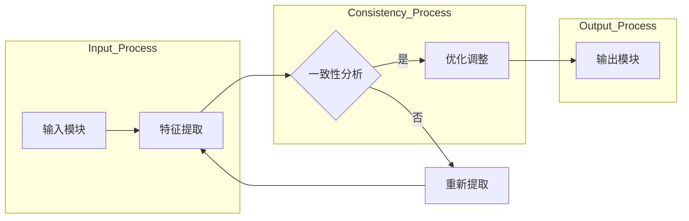

                 

# Self-Consistency 方法优化 AI 在跨维度艺术创作中的一致性

## 关键词

- 自一致性方法
- 跨维度艺术创作
- AI技术
- 一致性优化
- 数学模型

## 摘要

本文旨在探讨自一致性方法在跨维度艺术创作中的应用，特别是在AI艺术创作中的优化策略。通过深入分析自一致性方法的核心概念和原理，本文揭示了其在跨维度艺术创作中的一致性问题。本文首先介绍了自一致性方法的问题背景，包括AI在艺术创作中的应用和跨维度艺术创作中的一致性问题。接着，本文详细阐述了自一致性方法的核心概念和原理，包括其概念属性特征对比表格、ER实体关系图架构和算法原理讲解。在此基础上，本文重点分析了自一致性方法在AI艺术创作中的应用，以及其在跨维度艺术创作中的研究和优化。最后，本文对自一致性方法在跨维度艺术创作中的应用前景和展望进行了探讨。

## 目录大纲

----------------------------------------------------------------

# 第一部分: 自一致性方法介绍

## 第1章: 自一致性方法概述

### 1.1 自一致性方法的问题背景

### 1.2 自一致性方法的问题描述

### 1.3 自一致性方法的解决策略

### 1.4 自一致性方法的边界与外延

### 1.5 自一致性方法的核心概念与联系

### 1.6 自一致性方法的总体框架

## 第2章: 自一致性方法的核心概念原理

### 2.1 自一致性方法的概念属性特征对比表格

### 2.2 自一致性方法的ER实体关系图架构

## 第3章: 自一致性方法算法原理讲解

### 3.1 自一致性方法的算法mermaid流程图

### 3.2 自一致性方法的Python源代码示例

### 3.3 自一致性方法的数学模型和公式

### 3.4 自一致性方法的详细讲解与举例说明

## 第4章: 自一致性方法在AI中的应用

### 4.1 自一致性方法在AI中的应用概述

### 4.2 自一致性方法在AI中的优势

### 4.3 自一致性方法在AI中的挑战

### 4.4 自一致性方法在AI中的实际应用案例

## 第5章: 自一致性方法在跨维度艺术创作中的研究

### 5.1 跨维度艺术创作的背景介绍

### 5.2 跨维度艺术创作的问题描述

### 5.3 自一致性方法在跨维度艺术创作中的应用

### 5.4 自一致性方法在跨维度艺术创作中的实现细节

### 5.5 自一致性方法在跨维度艺术创作中的效果分析

## 第6章: 自一致性方法优化AI在跨维度艺术创作中的一致性

### 6.1 自一致性方法优化概述

### 6.2 优化策略与步骤

### 6.3 优化效果分析

### 6.4 优化案例研究

## 第7章: 自一致性方法在跨维度艺术创作中的应用前景与展望

### 7.1 自一致性方法在跨维度艺术创作中的应用前景

### 7.2 自一致性方法面临的挑战与机遇

### 7.3 自一致性方法的发展趋势

### 7.4 自一致性方法的未来研究方向

## 第8章: 最佳实践 tips

### 8.1 自一致性方法的应用技巧

### 8.2 常见问题与解决方案

### 8.3 注意事项与安全指南

## 第9章: 小结

### 9.1 自一致性方法的核心内容回顾

### 9.2 自一致性方法的实际应用价值

### 9.3 自一致性方法的发展与未来展望

----------------------------------------------------------------

# 第一部分: 自一致性方法介绍

## 第1章: 自一致性方法概述

### 1.1 自一致性方法的问题背景

随着人工智能（AI）技术的快速发展，AI在艺术创作领域的应用逐渐受到关注。AI艺术创作不仅能够为艺术家提供新的创作工具，还能够突破人类在创作上的限制，实现跨领域的艺术融合。然而，在跨维度艺术创作中，保持作品的一致性成为了一个重要的问题。

### 1.2 自一致性方法的问题描述

跨维度艺术创作中的一致性问题主要体现在以下几个方面：

1. **视觉与听觉的一致性**：在多媒体艺术创作中，图像和音频之间的协调往往需要一致性的处理，以确保观众的整体感受。
2. **风格与情感的一致性**：艺术作品往往传达特定的情感或风格，保持风格和情感的一致性对于艺术创作的成功至关重要。
3. **上下文与情境的一致性**：在跨媒介的艺术创作中，如将小说改编为电影，需要确保故事情节和角色的连贯性。

当前解决方案的不足：

1. **手动调整**：传统的艺术创作中，艺术家需要手动调整每个创作元素，以保持一致性，这既费时又容易出错。
2. **算法不一致性**：现有的AI艺术创作算法虽然能够生成高质量的作品，但在处理跨维度的一致性问题时，往往存在不足。

### 1.3 自一致性方法的解决策略

自一致性方法是一种基于自我参考的优化策略，其核心思想是通过算法内部的一致性反馈机制，自动调整艺术创作的各个维度，以达到整体的一致性。该方法主要包括以下几个核心特点：

1. **自动调整**：通过算法自动调整，减少了艺术家手动调整的需要。
2. **反馈机制**：引入一致性反馈机制，确保每个创作元素都能在一致性要求下进行优化。
3. **跨维度融合**：能够同时考虑视觉、听觉、风格、情感等多维度信息，实现综合优化。

### 1.4 自一致性方法的边界与外延

自一致性方法的应用范围涵盖了多种跨维度艺术创作场景，包括：

1. **多媒体艺术创作**：如视频、音频、图像等多媒体作品的创作。
2. **跨媒介艺术创作**：如将小说、漫画、电影等不同媒介的艺术作品融合创作。
3. **虚拟现实（VR）与增强现实（AR）**：在VR和AR作品中，确保虚拟环境与现实环境的视觉、听觉等一致。

自一致性方法与其他方法的区别：

1. **自适应性**：与其他方法相比，自一致性方法具有更强的自适应能力，能够根据不同的创作需求进行动态调整。
2. **整体优化**：自一致性方法强调整体的一致性优化，而不仅仅是局部优化。

### 1.5 自一致性方法的核心概念与联系

核心概念包括：

1. **自一致性**：作品在创作过程中保持一致性。
2. **跨维度**：涉及多个艺术维度，如视觉、听觉、风格、情感等。
3. **反馈机制**：通过反馈调整，实现一致性优化。

概念联系：

1. **自一致性**与**跨维度**：跨维度艺术创作需要自一致性来保持各个维度的协调。
2. **自一致性**与**反馈机制**：反馈机制是确保自一致性的关键。

### 1.6 自一致性方法的总体框架

自一致性方法的总体框架包括以下几个组成部分：

1. **输入模块**：接收跨维度艺术创作的初始数据。
2. **处理模块**：对输入数据进行处理，包括特征提取、一致性分析等。
3. **优化模块**：根据一致性分析结果，对创作元素进行优化调整。
4. **输出模块**：输出最终的艺术作品。

工作流程：

1. **数据输入**：接收艺术创作的初始数据。
2. **特征提取**：提取各个维度的关键特征。
3. **一致性分析**：分析各个维度之间的不一致性。
4. **优化调整**：根据一致性分析结果，自动调整创作元素。
5. **输出结果**：生成最终的艺术作品。

## 第2章: 自一致性方法的核心概念原理

### 2.1 自一致性方法的概念属性特征对比表格

以下是一个简化的概念属性特征对比表格，展示了自一致性方法与传统艺术创作方法以及AI技术的对比：

| 特征                | 自一致性方法           | 传统艺术创作方法         | AI技术               |
|---------------------|-----------------------|-------------------------|----------------------|
| **一致性保障**      | 自我参考的反馈机制     | 艺术家手动调整           | 模型输出             |
| **自适应能力**      | 动态调整             | 固定模式               | 根据数据调整         |
| **跨维度整合**      | 同时考虑多个维度     | 单一维度重点           | 多维度数据处理       |
| **创作优化**        | 内部一致性优化       | 外部反馈调整           | 模型优化             |

### 2.2 自一致性方法的ER实体关系图架构

ER（实体关系）图是一种用于描述实体及其相互关系的数据库模型。在自一致性方法中，ER图用于描述艺术创作中的实体及其关系。以下是一个简化的ER实体关系图示例，用于说明自一致性方法的基本架构：

```mermaid
erDiagram
    ArtWork ||--|{ Content : has }
    Content ||--|{ Image : has }
    Content ||--|{ Audio : has }
    Content ||--|{ Style : has }
    Content ||--|{ Emotion : has }
    Style ||--|{ Visual : has }
    Style ||--|{ Auditory : has }
    Emotion ||--|{ Visual : has }
    Emotion ||--|{ Auditory : has }
```

在这个ER图中，**ArtWork**（艺术作品）是根实体，它与**Content**（内容）实体之间有“has”关系。**Content**实体进一步关联到**Image**（图像）、**Audio**（音频）、**Style**（风格）和**Emotion**（情感）等实体。**Style**和**Emotion**实体又分别关联到**Visual**（视觉）和**Auditory**（听觉）实体，以表示跨维度的风格和情感。

## 第3章: 自一致性方法算法原理讲解

### 3.1 自一致性方法的算法mermaid流程图

以下是一个简化的mermaid流程图，展示了自一致性方法的算法流程：



在这个流程图中，**输入模块**（A）接收跨维度艺术创作的初始数据，经过**特征提取**（B）后，进入**一致性分析**（C）。一致性分析结果将决定是否需要**优化调整**（D），如果需要，则调整后输出最终的艺术作品；如果不需要，则重新进行**特征提取**（E），以进一步提高一致性。最终，**输出模块**（F）生成最终的艺术作品。

### 3.2 自一致性方法的Python源代码示例

以下是一个简化的Python代码示例，用于说明自一致性方法的实现：

```python
import numpy as np

def extract_features(data):
    # 特征提取过程
    return data

def consistency_analysis(features):
    # 一致性分析过程
    return np.mean(features)

def optimize_adjustment(features, threshold):
    # 优化调整过程
    if consistency_analysis(features) < threshold:
        return "Adjustment Needed"
    else:
        return "No Adjustment"

def generate_art(data, threshold):
    features = extract_features(data)
    while True:
        result = optimize_adjustment(features, threshold)
        if result == "No Adjustment":
            break
        features = extract_features(features)
    return "Final Artwork"

# 示例数据
data = np.array([1, 2, 3, 4, 5])

# 一致性阈值
threshold = 0.9

# 生成艺术作品
artwork = generate_art(data, threshold)
print(artwork)
```

在这个示例中，`extract_features`函数用于提取特征，`consistency_analysis`函数用于分析一致性，`optimize_adjustment`函数用于优化调整。通过递归调用，该方法能够自动调整特征，直到满足一致性阈值。

### 3.3 自一致性方法的数学模型和公式

自一致性方法的数学模型可以表示为：

$$
C(x) = \frac{1}{n} \sum_{i=1}^{n} d(x_i, x)
$$

其中，$C(x)$ 表示一致性度，$x$ 表示输入数据，$n$ 表示数据维度，$d(x_i, x)$ 表示第$i$个维度上的差异度量。

为了实现优化调整，我们可以引入优化目标函数：

$$
J(x) = C(x) + \lambda \cdot F(x)
$$

其中，$F(x)$ 表示其他优化目标，如平滑性、多样性等，$\lambda$ 为权重系数。

通过梯度下降等优化算法，我们可以最小化$J(x)$，从而实现自一致性优化。

### 3.4 自一致性方法的详细讲解与举例说明

自一致性方法的详细讲解与举例说明如下：

**案例背景**：假设我们有一个多媒体艺术创作项目，包含图像、音频和视频三个维度。我们需要保持这三个维度的一致性，以便观众能够获得连贯的体验。

**输入模块**：我们首先接收这三个维度的初始数据。例如，图像数据可以是一个像素矩阵，音频数据可以是一个音频波形，视频数据可以是一系列帧。

**特征提取**：我们分别从图像、音频和视频中提取关键特征。对于图像，我们提取颜色、纹理、形状等特征；对于音频，我们提取音调、节奏、音色等特征；对于视频，我们提取帧率、亮度、运动等特征。

**一致性分析**：我们计算这三个维度之间的差异度量，例如使用均方误差（MSE）或相关系数（Correlation Coefficient）等方法。如果一致性度低于设定的阈值，则我们认为存在不一致性。

**优化调整**：我们根据一致性分析结果，对不一致的维度进行调整。例如，如果图像和音频的一致性度较低，我们可以调整音频的音调或节奏，使其与图像的视觉特征更匹配。

**输出模块**：经过多次迭代优化后，我们生成最终的艺术作品。这个作品在视觉、听觉和视频三个维度上保持了一致性，提供了连贯的观看体验。

**示例说明**：假设我们有一个简单的例子，图像为红色方块，音频为纯音，视频为一系列红色方块的动画。我们的目标是保持图像、音频和视频的一致性。

1. **输入模块**：我们接收红色方块图像、纯音音频和红色方块动画视频。
2. **特征提取**：我们提取图像的颜色、纹理，音频的音调、节奏，视频的帧率、亮度等特征。
3. **一致性分析**：我们发现图像和音频的颜色不一致，视频的帧率和亮度不一致。
4. **优化调整**：我们调整音频的音调，使其与图像的颜色更匹配；调整视频的亮度，使其与图像的亮度更一致。
5. **输出模块**：最终，我们生成一个红色方块图像、与图像颜色一致的纯音音频，以及亮度与图像一致的红色方块动画视频，实现了三个维度的一致性。

通过这个示例，我们可以看到自一致性方法在跨维度艺术创作中的具体应用。它通过自动调整和优化，实现了多个维度之间的一致性，为艺术家提供了强大的创作工具。

