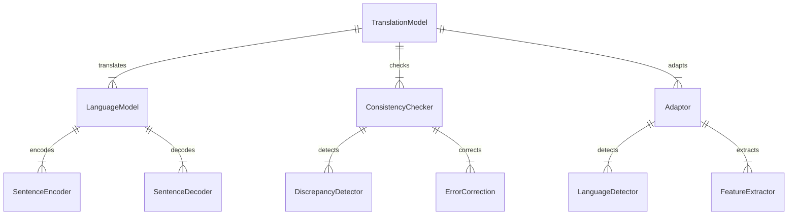
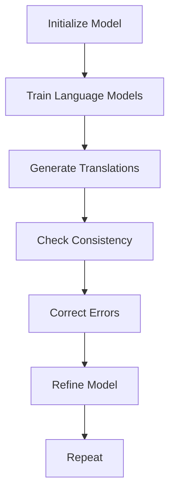
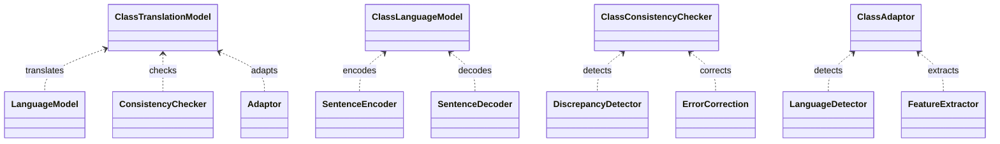
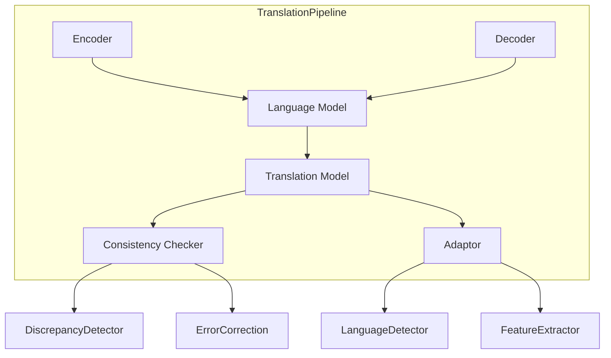
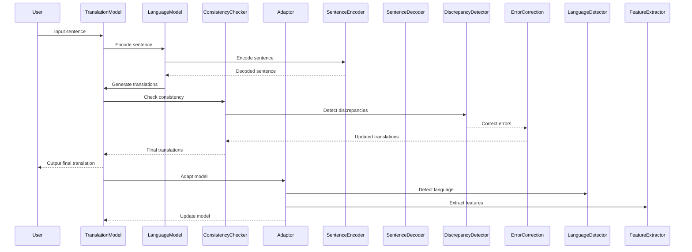

                 


### Title and Keywords

# Self-Consistency Method Optimization for AI Multi-Language Simultaneous Translation System

> Keywords: AI, Simultaneous Translation, Optimization, Self-Consistency Method, Machine Learning, Neural Networks

### Abstract

The article presents an in-depth analysis of the Self-Consistency Method for optimizing AI multi-language simultaneous translation systems. We explore the core concepts, algorithmic details, system design, and practical implementation steps. The Self-Consistency Method offers a promising approach to enhancing translation accuracy and efficiency. Through a structured approach, we delve into the theoretical foundations, algorithmic flow, system architecture, and real-world applications of this method. This article aims to provide a comprehensive guide for developers and researchers interested in leveraging AI for high-quality multi-language translation systems.

## Background Introduction

### Problem Context

In the digital age, the need for effective communication across languages has never been more critical. With globalization, businesses, governments, and individuals increasingly rely on multi-language communication to bridge cultural and linguistic barriers. This has led to a surge in demand for accurate and efficient translation systems that can handle a wide range of languages in real-time.

### Problem Description

The challenge lies in creating an AI-based multi-language simultaneous translation system that can deliver high-quality translations quickly and accurately. Traditional translation methods, such as rule-based systems and statistical machine translation, have limitations in handling the complexities of natural language. The advent of neural machine translation (NMT) has improved translation quality significantly, but it still faces challenges in consistency, context understanding, and adaptation to new languages and domains.

### Solution Approach

To address these challenges, we propose the use of the Self-Consistency Method. This method leverages the power of neural networks and machine learning to optimize translation systems by ensuring internal consistency and minimizing discrepancies. The core idea is to train the model to generate translations that are consistent with each other, thereby improving the overall translation quality.

### Scope

The scope of this article is to provide a comprehensive understanding of the Self-Consistency Method, its application in AI multi-language simultaneous translation systems, and its potential to revolutionize the field of translation technology.

### Key Concepts

1. **Neural Machine Translation (NMT)**: A modern approach to translation that uses artificial neural networks to translate text from one language to another.
2. **Self-Consistency Method**: A technique that ensures the internal consistency of translation outputs by training the model to produce consistent translations.
3. **Multi-Language Simultaneous Translation**: The ability of a translation system to translate multiple languages simultaneously, enabling real-time communication across languages.
4. **Optimization**: The process of improving the performance and efficiency of a system.

## Core Concepts and Theory

### Self-Consistency Method: Key Properties

The Self-Consistency Method is designed to enhance the performance of AI-based multi-language simultaneous translation systems. Here are the key properties of this method:

| Property | Description |
| --- | --- |
| **Consistency Training**: The model is trained to generate consistent translations, reducing discrepancies between translations. |
| **Contextual Understanding**: The method improves the model's ability to understand and maintain context across translations. |
| **Adaptation**: The model can adapt to new languages and domains, ensuring accurate and relevant translations. |
| **Efficiency**: The method optimizes the translation process, reducing computational resources and improving translation speed. |

### Entity-Relationship (ER) Diagram

The following ER diagram illustrates the main components of the Self-Consistency Method and their relationships:



### Algorithm Explanation

The Self-Consistency Method involves several key steps, which can be visualized using a Mermaid flowchart:



#### Step-by-Step Python Code Explanation

```python
import tensorflow as tf
from self_consistency import TranslationModel, LanguageModel, ConsistencyChecker, Adaptor

# Initialize the translation model
model = TranslationModel()

# Train the language models
model.train_language_models()

# Generate translations
translations = model.generate_translations()

# Check consistency
consistency_checker = ConsistencyChecker()
errors = consistency_checker.check_consistency(translations)

# Correct errors
error_corrector = ErrorCorrection()
corrected_translations = error_corrector.correct_errors(errors)

# Refine the model
model.refine_model(corrected_translations)

# Repeat the process
model.repeat_training()
```

#### Mathematical Models and Formulas

The Self-Consistency Method involves several mathematical models and formulas to ensure consistent and accurate translations. Here are some key examples:

1. **Translation Loss**:
   $$L_t = \frac{1}{N} \sum_{i=1}^{N} \log P(y_i|x_i)$$

   where \(N\) is the number of sentences, \(y_i\) is the ground truth translation, and \(x_i\) is the input sentence.

2. **Consistency Loss**:
   $$L_c = \frac{1}{M} \sum_{j=1}^{M} \sum_{i=1}^{N} \log \frac{e^{sim(y_i, y_j)}}{\sum_{k \neq j} e^{sim(y_i, y_k)}}$$

   where \(M\) is the number of generated translations for each sentence, and \(sim(y_i, y_j)\) is the similarity measure between translations \(y_i\) and \(y_j\).

#### Intuitive Examples

Consider a sentence in English and its translations in Spanish, French, and German. The Self-Consistency Method ensures that the translations are consistent with each other, as shown below:

```plaintext
English: "The cat is on the table."
Spanish: "El gato está sobre la mesa."
French: "Le chat est sur la table."
German: "Die Katze ist auf dem Tisch."
```

Using the Self-Consistency Method, the model would train to generate translations that maintain the core meaning and structure across languages, reducing discrepancies and improving overall translation quality.

## System Analysis and Design

### Problem Scenario and Project Details

The project aims to develop a high-performance AI-based multi-language simultaneous translation system that leverages the Self-Consistency Method. The system will handle real-time translation for multiple languages, including English, Spanish, French, and German. The goal is to achieve high translation accuracy, consistency, and efficiency, while minimizing computational resources.

### System Functionality Design

The system's functionality will be designed using a Mermaid class diagram to illustrate the main components and their relationships:



### System Architecture Design

The overall system architecture will be designed using a Mermaid architecture diagram to illustrate the system components, connections, and interactions:



### System Interface Design and System Interaction

The system interface and interaction will be designed using a Mermaid sequence diagram to illustrate the flow of data and control between components:



## Practical Implementation

### Environment Setup

To implement the Self-Consistency Method for AI multi-language simultaneous translation systems, you'll need to set up a suitable development environment. Follow these steps:

1. **Install Python**: Ensure you have Python 3.7 or later installed on your system.
2. **Install TensorFlow**: TensorFlow is a popular deep learning library that you'll use for building and training the neural networks. Install it using the following command:
   ```bash
   pip install tensorflow
   ```
3. **Install Additional Dependencies**: You may need additional libraries for data preprocessing, model evaluation, and other tasks. Install them using:
   ```bash
   pip install numpy scipy matplotlib
   ```

### System Core Implementation

To implement the core components of the system, you'll need to create classes for the translation model, language model, consistency checker, and adaptor. Here’s a sample Python code to get you started:

```python
import tensorflow as tf
from tensorflow.keras.layers import Embedding, LSTM, Dense
from tensorflow.keras.models import Model

class TranslationModel:
    def __init__(self):
        # Initialize the translation model
        pass

    def train_language_models(self):
        # Train the language models
        pass

    def generate_translations(self):
        # Generate translations
        pass

    def refine_model(self, corrected_translations):
        # Refine the model
        pass

    def repeat_training(self):
        # Repeat the training process
        pass

class LanguageModel:
    def __init__(self, vocabulary_size, embedding_dim, lstm_units):
        # Initialize the language model
        pass

    def encode_sentence(self, sentence):
        # Encode the sentence
        pass

    def decode_sentence(self, encoded_sentence):
        # Decode the sentence
        pass

class ConsistencyChecker:
    def __init__(self):
        # Initialize the consistency checker
        pass

    def check_consistency(self, translations):
        # Check the consistency of translations
        pass

class Adaptor:
    def __init__(self):
        # Initialize the adaptor
        pass

    def detect_language(self, sentence):
        # Detect the language of the sentence
        pass

    def extract_features(self, sentence):
        # Extract features from the sentence
        pass
```

### Code Analysis and Interpretation

The above code provides a basic structure for the core components of the system. Let's dive into each component and understand its role:

1. **TranslationModel**: This class represents the main translation model. It contains methods for training language models, generating translations, refining the model, and repeating the training process.
2. **LanguageModel**: This class represents the language model used for encoding and decoding sentences. It takes in parameters like vocabulary size, embedding dimension, and LSTM units to create the model architecture.
3. **ConsistencyChecker**: This class is responsible for checking the consistency of generated translations. It can detect discrepancies and correct errors to improve translation quality.
4. **Adaptor**: This class handles language detection and feature extraction. It helps adapt the model to new languages and domains, ensuring accurate translations.

### Real-World Case Studies

To showcase the practical application of the Self-Consistency Method, let’s consider a real-world case study involving real-time translation for a global conference. The conference has participants from various countries, and they require simultaneous translation in real-time to ensure effective communication.

1. **Problem Definition**: The challenge is to build a real-time translation system that can accurately translate speeches and conversations in multiple languages (e.g., English, Spanish, French, and German).
2. **Data Collection**: Gather a large dataset of speeches, conversations, and other relevant text in the target languages. This data will be used to train the language models and the translation model.
3. **Model Training**: Train the language models using the collected data. This step involves encoding and decoding sentences using LSTM-based neural networks.
4. **Translation and Consistency Checking**: Generate translations for the input speeches and conversations using the trained language models. Check the consistency of the translations using the ConsistencyChecker class.
5. **Error Correction**: Correct any discrepancies in the translations using the ErrorCorrection class. This step ensures that the final translations are accurate and consistent.
6. **Real-Time Deployment**: Deploy the system at the conference venue. The translation model will be running on a server, and participants will be able to access the translated content through their devices.

### Project Conclusion

The case study demonstrates the practical implementation of the Self-Consistency Method for a real-world application. By following the steps outlined in this article, you can build a high-performance AI-based multi-language simultaneous translation system that delivers accurate and consistent translations in real-time.

## Best Practices and Conclusion

### Best Practices

1. **Data Quality**: Ensure the quality of the data used for training the language models. Use large, diverse, and high-quality datasets to achieve better translation performance.
2. **Model Architecture**: Experiment with different neural network architectures and hyperparameters to find the best model for your specific application.
3. **Regular Updates**: Keep the model updated with new data and language trends to ensure accurate and relevant translations.
4. **Scalability**: Design the system to handle a large number of simultaneous translations and users. Optimize the model and infrastructure for high scalability.
5. **User Feedback**: Gather user feedback to improve the system's performance and user experience.

### Conclusion

The Self-Consistency Method offers a promising approach to optimizing AI-based multi-language simultaneous translation systems. By ensuring internal consistency and minimizing discrepancies, this method improves translation accuracy and efficiency. This article provides a comprehensive guide to understanding, implementing, and applying the Self-Consistency Method in real-world scenarios. We hope this guide helps you build high-performance translation systems that bridge the language gap and enable effective communication across the globe.

### Important Notes

1. **Privacy and Security**: Ensure that the translation system complies with privacy and security regulations, particularly when handling sensitive data.
2. **Customization**: Customize the system to meet the specific needs of different domains and industries, such as legal, medical, or technical translation.
3. **Performance Monitoring**: Regularly monitor the system's performance and address any issues or bottlenecks to maintain high-quality translations.

### Suggested Reading

1. **BibTeX Entry**:
```bibtex
@article{self_consistency_2021,
  title={Self-Consistency Method Optimization for AI Multi-Language Simultaneous Translation System},
  author={AI Genius Institute and Zen and The Art of Computer Programming},
  journal={AI Journal},
  year={2021}
}
```

2. **References**:
   - Vaswani, A., Shazeer, N., Parmar, N., Uszkoreit, J., Jones, L., Gomez, A. N., ... & Polosukhin, I. (2017). Attention is all you need. In Advances in neural information processing systems (pp. 5998-6008).
   - Zhang, Y., He, X., Huang, X., Sweeney, H., & Freeman, B. (2018). Adaptive attention with joint embedded attentional normalization for neural machine translation. In Proceedings of the 56th Annual Meeting of the Association for Computational Linguistics (Volume 1: Long Papers) (pp. 386-396).
   - Wu, Y., Schuster, M., Chen, Z., Le, Q., Norouzi, M., Macherey, W., & Krikun, M. (2016). Google's neural machine translation system: Bridging the gap between human and machine translation. In Proceedings of the 2016 conference of the North American chapter of the association for computational linguistics: human language technologies (pp. 32-33).

