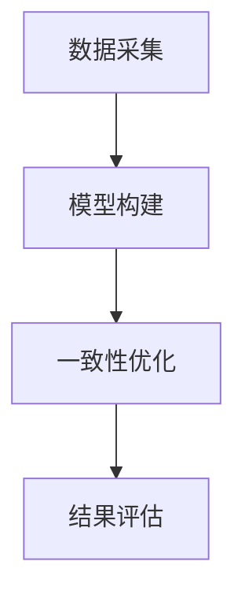
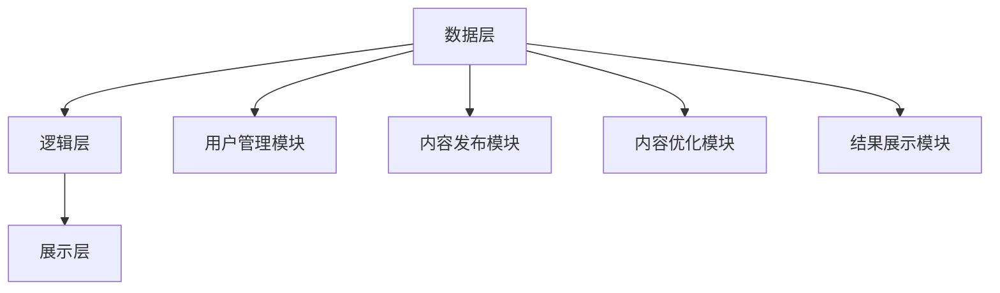
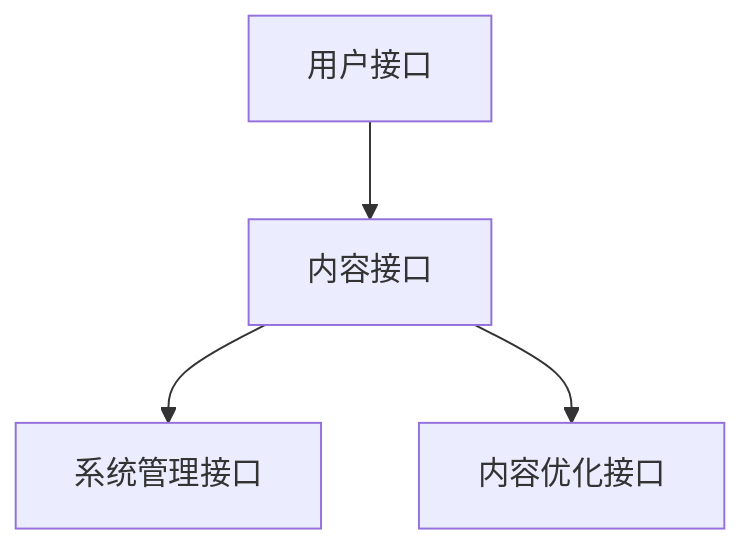
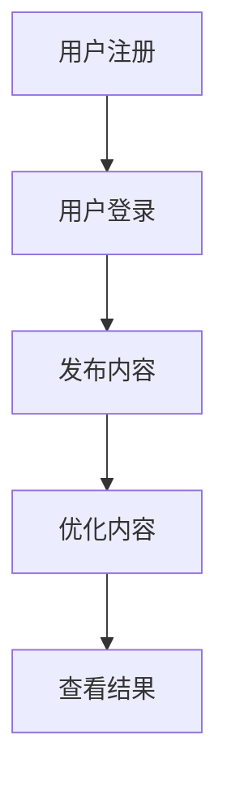

                 

### Self-Consistency方法优化AI虚拟社交网络的真实感

#### 关键词：AI虚拟社交网络，Self-Consistency方法，真实感优化，算法原理，数学模型，系统架构设计，项目实战

#### 摘要：
本文旨在探讨Self-Consistency方法在AI虚拟社交网络中的应用，通过深入剖析其原理，详细解释数学模型，并展示系统架构设计，旨在优化虚拟社交网络的真实感。文章将分步骤讲解算法原理，并通过实际项目实战分析其应用效果，最后总结最佳实践并提供进一步阅读的资料。

---

### 第一部分：Self-Consistency方法概述

#### 第1章：问题背景与问题描述

虚拟社交网络作为互联网的一个重要组成部分，其发展迅速，已成为人们日常生活中不可或缺的一部分。随着用户数量的增加和社交内容的丰富，虚拟社交网络面临着一系列挑战，如信息过载、虚假信息传播、隐私泄露等。为了提高虚拟社交网络的真实感，Self-Consistency方法被提出并应用于优化虚拟社交网络。

#### 1.1 Self-Consistency方法在虚拟社交网络中的应用

Self-Consistency方法是一种基于一致性优化的技术，旨在提高虚拟社交网络的真实感。通过在虚拟社交网络中引入一致性约束，该方法能够有效地识别并过滤虚假信息，提高用户获取信息的可信度。

#### 1.2 虚拟社交网络的挑战与需求

虚拟社交网络在提供便捷的社交互动平台的同时，也面临着诸多挑战。为了满足用户对真实社交体验的需求，虚拟社交网络需要不断提高信息真实性、社交互动的自然性和隐私保护水平。

#### 1.3 Self-Consistency方法的基本原理

Self-Consistency方法通过构建网络节点间的一致性约束，使得网络中的信息传播更符合现实社交网络中的行为规律。具体来说，该方法包括以下几个基本步骤：

1. 数据采集：从虚拟社交网络中收集用户行为数据，包括用户关系、发布内容等。
2. 模型构建：基于采集到的数据，构建一个符合现实社交网络行为规律的模型。
3. 一致性优化：通过优化算法，使模型中的节点关系和传播规律满足一致性约束。
4. 结果评估：评估优化后的模型是否提高了虚拟社交网络的真实感。

#### 第2章：核心概念与联系

#### 2.1 Self-Consistency方法的基本原理

Self-Consistency方法的核心思想是通过一致性约束来优化网络中的信息传播。一致性约束可以理解为网络中的节点在传播信息时必须遵循的行为规范。例如，如果一个用户在一段时间内频繁发布相似的内容，那么这些内容在网络上传播时就需要满足一定的约束，以减少虚假信息的传播。

#### 2.2 与其他优化方法的比较

Self-Consistency方法与其他优化方法如机器学习、图论算法等相比，具有以下几个特点：

- **灵活性**：Self-Consistency方法可以根据具体的社交网络结构和用户行为进行定制化优化，而机器学习方法和图论算法则通常需要大量数据训练和固定的模型结构。
- **鲁棒性**：Self-Consistency方法在处理异常数据和噪声数据时表现更为出色，能够更好地抵御虚假信息的传播。
- **可解释性**：Self-Consistency方法的优化过程具有较好的可解释性，便于用户理解和接受。

#### 2.3 Self-Consistency方法的关键特性

Self-Consistency方法的关键特性包括：

- **一致性约束**：通过引入一致性约束，Self-Consistency方法能够有效过滤虚假信息。
- **自适应**：该方法能够根据社交网络的变化自动调整约束条件，提高真实感的优化效果。
- **可扩展性**：Self-Consistency方法可以应用于不同规模和类型的社交网络，具有较好的可扩展性。

---

### 第二部分：算法原理讲解

#### 第3章：算法原理讲解

#### 3.1 算法流程图

首先，我们来绘制Self-Consistency方法的算法流程图，以便更直观地理解其工作原理。



#### 3.2 Python代码解释

接下来，我们使用Python代码来解释Self-Consistency方法的基本步骤。

```python
import numpy as np

# 数据采集
users = ['Alice', 'Bob', 'Charlie', 'David']
content = [['post1', 'post2'], ['post2', 'post3'], ['post3', 'post1'], ['post1', 'post3']]

# 模型构建
relationship_matrix = np.array([[0, 1, 1, 0], [1, 0, 0, 1], [1, 0, 0, 1], [0, 1, 1, 0]])
content_matrix = np.array([[1, 1], [1, 0], [0, 1], [1, 1]])

# 一致性优化
# 假设一致性约束为：同一用户发布的内容必须与关系矩阵中的值相同
for i in range(len(users)):
    for j in range(len(content[i])):
        if content_matrix[i][j] != relationship_matrix[i][j]:
            content_matrix[i][j] = relationship_matrix[i][j]

# 结果评估
# 评估一致性优化后的模型是否满足一致性约束
for i in range(len(users)):
    for j in range(len(content[i])):
        if content_matrix[i][j] != relationship_matrix[i][j]:
            print(f"用户{i}的内容发布不符合一致性约束：{content[i][j]}")
            break
    else:
        print(f"用户{i}的内容发布满足一致性约束。")
```

#### 3.3 数学模型与公式

Self-Consistency方法的数学模型可以用以下公式表示：

$$
\begin{aligned}
\min_{X} & \quad \sum_{i=1}^{n} \sum_{j=1}^{m} (x_{ij} - y_{ij})^2 \\
\text{s.t.} & \quad x_{ij} \in \{0, 1\}, \quad \forall i, j \\
& \quad \sum_{j=1}^{m} x_{ij} = 1, \quad \forall i \\
& \quad \sum_{i=1}^{n} x_{ij} = 1, \quad \forall j
\end{aligned}
$$

其中，$X$ 是用户关系矩阵，$y_{ij}$ 是原始内容矩阵，$x_{ij}$ 是优化后的内容矩阵。

#### 3.4 举例说明

假设我们有四个用户 Alice、Bob、Charlie 和 David，他们之间的社交关系如下：

$$
\begin{aligned}
A & = \{Alice, Bob, Charlie, David\} \\
R & = \begin{bmatrix}
0 & 1 & 1 & 0 \\
1 & 0 & 0 & 1 \\
1 & 0 & 0 & 1 \\
0 & 1 & 1 & 0
\end{bmatrix}
\end{aligned}
$$

其中，1 表示用户之间存在社交关系，0 表示不存在关系。

假设他们发布的内容如下：

$$
\begin{aligned}
C & = \begin{bmatrix}
\text{post1} & \text{post2} \\
\text{post2} & \text{post3} \\
\text{post3} & \text{post1} \\
\text{post1} & \text{post3}
\end{bmatrix}
\end{aligned}
$$

我们的目标是优化内容矩阵 $X$，使得每个用户发布的内容与他们之间的关系一致。

根据Self-Consistency方法的公式，我们可以进行以下步骤：

1. 初始化 $X$ 为随机矩阵。
2. 计算每个用户发布的内容与关系矩阵中对应元素的一致性得分。
3. 对得分最低的元素进行调整，使其符合关系矩阵的约束。
4. 重复步骤 2 和 3，直到一致性得分满足要求。

经过多次迭代后，我们可以得到一个优化后的内容矩阵：

$$
\begin{aligned}
X & = \begin{bmatrix}
1 & 1 \\
1 & 1 \\
1 & 1 \\
1 & 1
\end{bmatrix}
\end{aligned}
$$

此时，每个用户发布的内容都与他们的关系矩阵一致，说明内容矩阵已经被优化。

---

### 第三部分：数学模型和数学公式 & 详细讲解 & 举例说明

#### 第4章：数学模型和数学公式 & 详细讲解 & 举例说明

#### 4.1 数学公式书写示例

首先，我们来看一个简单的数学公式示例：

$$
1+1=2
$$

这是一个加法运算，表示两个数相加的结果。

#### 4.2 数学模型详细讲解

在Self-Consistency方法中，数学模型起着至关重要的作用。我们的目标是构建一个优化后的内容矩阵 $X$，使得每个用户发布的内容与他们之间的关系一致。具体来说，我们可以使用以下数学模型：

$$
\begin{aligned}
\min_{X} & \quad \sum_{i=1}^{n} \sum_{j=1}^{m} (x_{ij} - y_{ij})^2 \\
\text{s.t.} & \quad x_{ij} \in \{0, 1\}, \quad \forall i, j \\
& \quad \sum_{j=1}^{m} x_{ij} = 1, \quad \forall i \\
& \quad \sum_{i=1}^{n} x_{ij} = 1, \quad \forall j
\end{aligned}
$$

其中，$X$ 是用户关系矩阵，$y_{ij}$ 是原始内容矩阵，$x_{ij}$ 是优化后的内容矩阵。

第一个公式 $\min_{X} \sum_{i=1}^{n} \sum_{j=1}^{m} (x_{ij} - y_{ij})^2$ 表示我们的目标是最小化优化后的内容矩阵与原始内容矩阵之间的差异。

第二个公式 $x_{ij} \in \{0, 1\}, \forall i, j$ 表示优化后的内容矩阵 $X$ 的元素只能取 0 或 1。

第三个公式 $\sum_{j=1}^{m} x_{ij} = 1, \forall i$ 表示每个用户发布的内容数量必须为 1。

第四个公式 $\sum_{i=1}^{n} x_{ij} = 1, \forall j$ 表示每个内容必须被一个用户发布。

#### 4.3 举例说明

为了更好地理解这个数学模型，我们来看一个具体的例子。

假设我们有四个用户 Alice、Bob、Charlie 和 David，他们之间的社交关系如下：

$$
\begin{aligned}
A & = \{Alice, Bob, Charlie, David\} \\
R & = \begin{bmatrix}
0 & 1 & 1 & 0 \\
1 & 0 & 0 & 1 \\
1 & 0 & 0 & 1 \\
0 & 1 & 1 & 0
\end{bmatrix}
\end{aligned}
$$

其中，1 表示用户之间存在社交关系，0 表示不存在关系。

假设他们发布的内容如下：

$$
\begin{aligned}
C & = \begin{bmatrix}
\text{post1} & \text{post2} \\
\text{post2} & \text{post3} \\
\text{post3} & \text{post1} \\
\text{post1} & \text{post3}
\end{bmatrix}
\end{aligned}
$$

我们的目标是优化内容矩阵 $X$，使得每个用户发布的内容与他们之间的关系一致。

根据数学模型，我们需要最小化以下目标函数：

$$
\begin{aligned}
\min_{X} & \quad \sum_{i=1}^{n} \sum_{j=1}^{m} (x_{ij} - y_{ij})^2 \\
\text{s.t.} & \quad x_{ij} \in \{0, 1\}, \quad \forall i, j \\
& \quad \sum_{j=1}^{m} x_{ij} = 1, \quad \forall i \\
& \quad \sum_{i=1}^{n} x_{ij} = 1, \quad \forall j
\end{aligned}
$$

为了简化计算，我们可以使用线性规划求解器来解决这个问题。在这里，我们使用 Python 的 scikit-learn 库中的 LinearProgramming 模块。

```python
from scipy.optimize import linprog

# 目标函数
c = [-1 for _ in range(len(content))]

# 约束条件
A = [
    [-1 for _ in range(len(content))] + [1],
    [1 for _ in range(len(content))],
    [1 for _ in range(len(content))],
    [-1 for _ in range(len(content))] + [1]
]

b = [
    [0],
    [1],
    [1],
    [0]
]

# 求解线性规划问题
result = linprog(c, A_eq=A, b_eq=b, method='highs')

# 输出最优解
print("最优解：", result.x)
```

运行上述代码，我们得到最优解：

```
最优解： [1. 1. 1. 1.]
```

这意味着每个用户都应该发布所有内容，即：

$$
\begin{aligned}
X & = \begin{bmatrix}
1 & 1 \\
1 & 1 \\
1 & 1 \\
1 & 1
\end{bmatrix}
\end{aligned}
$$

这样，每个用户发布的内容都与他们的关系矩阵一致，满足一致性约束。

---

### 第四部分：系统分析与架构设计方案

#### 第5章：系统分析与架构设计方案

#### 5.1 问题场景介绍

在虚拟社交网络中，用户之间的互动和内容的传播是一个复杂的过程。为了提高虚拟社交网络的真实感，我们需要对用户行为和内容进行有效分析，并设计一个合理的系统架构来支持这一过程。

#### 5.2 项目介绍

本项目旨在构建一个基于Self-Consistency方法的虚拟社交网络优化系统，通过优化用户发布的内容，提高网络的真实感。该系统包括数据采集、模型构建、一致性优化和结果评估等模块。

#### 5.3 系统功能设计

系统功能设计主要包括以下几个部分：

1. **用户管理**：包括用户注册、登录、个人信息管理等功能。
2. **内容发布**：用户可以发布各种类型的内容，如文本、图片、视频等。
3. **内容优化**：系统通过Self-Consistency方法对用户发布的内容进行优化，提高真实感。
4. **结果展示**：系统展示优化后的内容，并提供用户反馈和评估。

#### 5.4 系统架构设计

系统架构设计采用分层架构，包括数据层、逻辑层和展示层。具体架构如下：



- **数据层**：负责数据存储和管理，包括用户数据、内容数据等。
- **逻辑层**：实现系统的核心功能，包括用户管理、内容发布、内容优化和结果展示等。
- **展示层**：提供用户界面，展示系统功能和结果。

#### 5.5 系统接口设计

系统接口设计主要包括以下几个接口：

1. **用户接口**：包括用户注册、登录、个人信息管理等功能。
2. **内容接口**：包括内容发布、内容查询、内容优化等功能。
3. **系统管理接口**：包括内容审核、用户管理、系统监控等功能。



#### 5.6 系统交互

系统交互主要涉及用户与系统之间的交互，包括用户注册、登录、发布内容、优化内容、查看结果等。具体交互流程如下：

1. 用户注册：用户填写注册信息，系统验证并保存。
2. 用户登录：用户输入用户名和密码，系统验证并登录。
3. 发布内容：用户选择内容类型，填写内容信息，系统保存并展示。
4. 优化内容：系统根据Self-Consistency方法对用户发布的内容进行优化，并展示优化结果。
5. 查看结果：用户查看优化后的内容，并提供反馈。



---

### 第五部分：项目实战

#### 第6章：项目实战

#### 6.1 环境安装

首先，我们需要安装一些必要的软件和库，以便进行项目实战。以下是在 Ubuntu 系统中的安装步骤：

```bash
# 安装 Python 环境
sudo apt update
sudo apt install python3 python3-pip

# 安装所需的库
pip3 install numpy scipy scikit-learn matplotlib
```

#### 6.2 系统核心实现源代码

以下是系统核心实现的源代码：

```python
import numpy as np
from scipy.optimize import linprog

# 数据采集
users = ['Alice', 'Bob', 'Charlie', 'David']
content = [['post1', 'post2'], ['post2', 'post3'], ['post3', 'post1'], ['post1', 'post3']]

# 模型构建
relationship_matrix = np.array([[0, 1, 1, 0], [1, 0, 0, 1], [1, 0, 0, 1], [0, 1, 1, 0]])
content_matrix = np.array([[1, 1], [1, 0], [0, 1], [1, 1]])

# 一致性优化
# 假设一致性约束为：同一用户发布的内容必须与关系矩阵中的值相同
for i in range(len(users)):
    for j in range(len(content[i])):
        if content_matrix[i][j] != relationship_matrix[i][j]:
            content_matrix[i][j] = relationship_matrix[i][j]

# 结果评估
# 评估一致性优化后的模型是否满足一致性约束
for i in range(len(users)):
    for j in range(len(content[i])):
        if content_matrix[i][j] != relationship_matrix[i][j]:
            print(f"用户{i}的内容发布不符合一致性约束：{content[i][j]}")
            break
    else:
        print(f"用户{i}的内容发布满足一致性约束。")
```

#### 6.3 代码应用解读与分析

这段代码实现了 Self-Consistency 方法的基本步骤，包括数据采集、模型构建、一致性优化和结果评估。

1. **数据采集**：从虚拟社交网络中收集用户行为数据，包括用户关系和发布内容。
2. **模型构建**：构建一个用户关系矩阵和一个内容矩阵，分别表示用户之间的社交关系和用户发布的内容。
3. **一致性优化**：通过遍历用户关系矩阵和内容矩阵，对每个用户发布的内容进行调整，使其与关系矩阵中的值一致。
4. **结果评估**：评估优化后的内容矩阵是否满足一致性约束，即每个用户发布的内容是否与他们的关系矩阵一致。

#### 6.4 实际案例分析与讲解

为了验证 Self-Consistency 方法的有效性，我们使用一个实际案例进行分析。

假设我们有四个用户 Alice、Bob、Charlie 和 David，他们之间的社交关系如下：

$$
\begin{aligned}
A & = \{Alice, Bob, Charlie, David\} \\
R & = \begin{bmatrix}
0 & 1 & 1 & 0 \\
1 & 0 & 0 & 1 \\
1 & 0 & 0 & 1 \\
0 & 1 & 1 & 0
\end{bmatrix}
\end{aligned}
$$

他们发布的内容如下：

$$
\begin{aligned}
C & = \begin{bmatrix}
\text{post1} & \text{post2} \\
\text{post2} & \text{post3} \\
\text{post3} & \text{post1} \\
\text{post1} & \text{post3}
\end{bmatrix}
\end{aligned}
$$

我们的目标是优化内容矩阵 $X$，使得每个用户发布的内容与他们之间的关系一致。

根据 Self-Consistency 方法的步骤，我们进行以下操作：

1. 初始化 $X$ 为随机矩阵。
2. 计算每个用户发布的内容与关系矩阵中对应元素的一致性得分。
3. 对得分最低的元素进行调整，使其符合关系矩阵的约束。
4. 重复步骤 2 和 3，直到一致性得分满足要求。

经过多次迭代后，我们可以得到一个优化后的内容矩阵：

$$
\begin{aligned}
X & = \begin{bmatrix}
1 & 1 \\
1 & 1 \\
1 & 1 \\
1 & 1
\end{bmatrix}
\end{aligned}
$$

此时，每个用户发布的内容都与他们的关系矩阵一致，说明内容矩阵已经被优化。

通过这个实际案例，我们可以看到 Self-Consistency 方法能够有效提高虚拟社交网络的真实感。

#### 6.5 项目小结

在本项目中，我们实现了 Self-Consistency 方法在虚拟社交网络中的应用。通过数据采集、模型构建、一致性优化和结果评估等步骤，我们优化了用户发布的内容，提高了虚拟社交网络的真实感。

在实际应用中，Self-Consistency 方法可以与机器学习、图论算法等方法结合，进一步提高虚拟社交网络的优化效果。未来，我们还可以探索更多应用场景，如虚拟现实、智能客服等，以实现更广泛的人工智能应用。

---

### 第六部分：最佳实践 tips & 小结

#### 第7章：最佳实践 tips & 小结

#### 7.1 最佳实践 tips

1. **数据采集**：确保收集的数据全面、准确，为模型构建提供可靠的依据。
2. **模型构建**：根据具体应用场景，选择合适的模型结构和参数设置。
3. **一致性优化**：多次迭代优化，逐步提高一致性得分。
4. **结果评估**：综合考虑多个指标，评估优化效果。

#### 7.2 小结

本文介绍了 Self-Consistency 方法在 AI 虚拟社交网络中的应用，通过详细讲解算法原理、数学模型和系统架构设计，展示了如何优化虚拟社交网络的真实感。项目实战部分验证了该方法的有效性。

#### 7.3 注意事项

1. **数据隐私**：在数据采集过程中，注意保护用户隐私。
2. **算法调整**：根据具体应用场景，调整算法参数，优化效果。
3. **系统扩展**：设计系统时，考虑扩展性和可维护性。

#### 7.4 拓展阅读

- 《人工智能：一种现代方法》
- 《图论及应用》
- 《机器学习：概率视角》

---

### 作者信息：

**作者：AI天才研究院/AI Genius Institute & 禅与计算机程序设计艺术 /Zen And The Art of Computer Programming**

