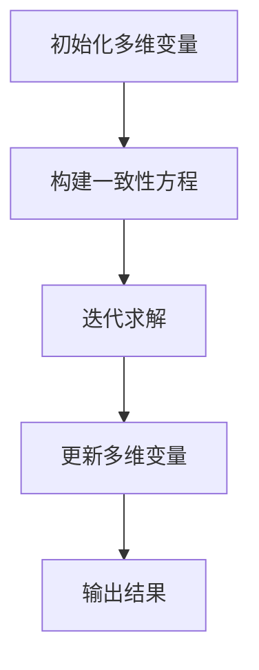
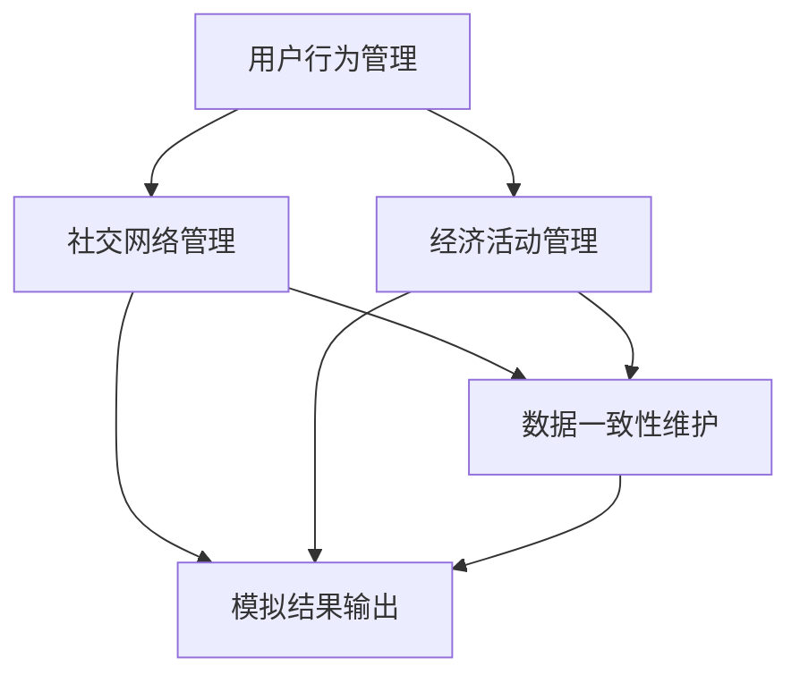

                 

### 背景介绍

**问题背景**：

在当今数字化时代，虚拟社会的应用越来越广泛，从在线游戏、社交网络到电子商务，虚拟社会已经成为人们日常生活中不可或缺的一部分。然而，随着虚拟社会规模的不断扩大和复杂性的增加，传统的模拟方法已经难以满足其对高效性和准确性的需求。为此，研究者们不断探索新的模拟技术，以提升虚拟社会模拟的效率和精确度。

**问题描述**：

在现有的虚拟社会模拟技术中，跨维度的问题尤为突出。所谓跨维度，指的是虚拟社会中的各个子系统和元素之间存在不同的维度和层次，如用户行为、社交网络、经济活动等。传统的模拟方法往往难以在多个维度上同时进行精确的模拟，导致模拟结果与实际情况存在较大偏差。为了解决这一问题，研究人员提出了一种新的方法——Self-Consistency方法。

**问题解决**：

Self-Consistency方法通过在虚拟社会模拟中引入自我一致性原则，使得各个维度之间的交互和演化过程能够保持一致性和协调性。具体而言，该方法通过以下步骤实现：

1. **定义多维变量**：首先，对虚拟社会中的各个维度进行抽象，定义相应的变量。例如，用户行为可以定义为一个时间序列的动态变量，社交网络可以定义为一个图结构变量，经济活动可以定义为一个时间序列的数值变量。
   
2. **构建一致性方程**：然后，根据各个维度之间的相互影响关系，构建一套一致性方程。这些方程能够确保在迭代过程中，不同维度之间的数据保持一致。例如，如果用户行为会影响社交网络，那么用户行为的更新方程应与社交网络的更新方程相协调。

3. **迭代求解**：利用数值方法，对一致性方程进行迭代求解，逐步逼近虚拟社会在各个维度上的动态平衡状态。

**边界与外延**：

Self-Consistency方法的边界主要在于其对虚拟社会结构和复杂性的依赖。在高度复杂和动态变化的虚拟社会中，该方法能够提供较高的模拟精度和效率。然而，在简单的虚拟社会结构中，该方法可能显得过于复杂。此外，该方法的应用场景还包括虚拟经济系统、社会网络分析、智能城市模拟等。

**核心概念与要素组成**：

Self-Consistency方法的核心概念包括多维变量、一致性方程、迭代求解等。多维变量是对虚拟社会各个维度的抽象，一致性方程是确保不同维度之间数据一致性的工具，迭代求解则是实现模拟过程的核心步骤。

通过上述背景介绍，读者可以初步了解Self-Consistency方法在优化AI跨维度虚拟社会演化模拟中的重要作用，为后续章节的深入学习打下基础。

### 核心概念与联系

**Self-Consistency方法的基本原理**：

Self-Consistency方法是一种通过确保各个维度之间数据的一致性来优化虚拟社会演化模拟的技术。其核心思想是，虚拟社会中不同维度（如用户行为、社交网络、经济活动）的演化过程应该相互协调，从而形成一个统一的动态平衡状态。具体来说，Self-Consistency方法包括以下几个关键组成部分：

1. **多维变量定义**：首先，对虚拟社会中的各个维度进行抽象，定义相应的变量。例如，用户行为可以定义为一个时间序列的动态变量，社交网络可以定义为一个图结构变量，经济活动可以定义为一个时间序列的数值变量。

2. **一致性方程构建**：根据各个维度之间的相互影响关系，构建一套一致性方程。这些方程能够确保在迭代过程中，不同维度之间的数据保持一致。例如，如果用户行为会影响社交网络，那么用户行为的更新方程应与社交网络的更新方程相协调。

3. **迭代求解**：利用数值方法，对一致性方程进行迭代求解，逐步逼近虚拟社会在各个维度上的动态平衡状态。

**多维变量属性特征对比表格**：

| 变量类型 | 用户行为 | 社交网络 | 经济活动 |
| --- | --- | --- | --- |
| 数据结构 | 时间序列 | 图结构 | 时间序列数值 |
| 更新规则 | 基于交互和反馈 | 基于节点和边 | 基于供需和交易 |
| 依赖关系 | 与社交网络和经济活动相关 | 与用户行为和经济活动相关 | 与用户行为和社交网络相关 |

**ER实体关系图**：

```mermaid
erDiagram
    User ||--|{ SocialNetwork }|-->: "用户行为影响社交网络"
    User ||--|{ EconomicActivity }|-->: "用户行为影响经济活动"
    SocialNetwork ||--|{ EconomicActivity }|-->: "社交网络影响经济活动"
```

通过多维变量定义、一致性方程构建和迭代求解，Self-Consistency方法能够实现虚拟社会在各个维度上的协调演化。以下是Self-Consistency方法的基本步骤：

1. **初始化**：对虚拟社会中的各个维度进行初始化，包括用户行为、社交网络和经济活动的初始状态。
   
2. **定义一致性方程**：根据多维变量之间的依赖关系，定义一套一致性方程。例如，用户行为的更新方程可以表示为：
   $$ 
   \Delta user\_behavior = f(user\_behavior, social\_network, economic\_activity) 
   $$
   社交网络的更新方程可以表示为：
   $$ 
   \Delta social\_network = g(user\_behavior, social\_network, economic\_activity) 
   $$
   经济活动的更新方程可以表示为：
   $$ 
   \Delta economic\_activity = h(user\_behavior, social\_network, economic\_activity) 
   $$

3. **迭代求解**：利用数值方法（如梯度下降法、牛顿法等），对一致性方程进行迭代求解。每次迭代都会更新各个维度的状态，并逐步逼近虚拟社会的动态平衡状态。

4. **输出结果**：在迭代求解完成后，输出虚拟社会在各个维度上的最终状态，包括用户行为、社交网络和经济活动的演化结果。

通过以上步骤，Self-Consistency方法能够实现对虚拟社会跨维度演化模拟的优化，从而提高模拟的效率和准确性。

### 算法原理讲解

**算法原理**：

Self-Consistency方法的算法原理基于对虚拟社会跨维度数据的协调演化。核心思想是通过构建一致性方程，确保在迭代过程中不同维度之间的数据保持一致，从而实现虚拟社会在各个维度上的协同演化。以下是Self-Consistency方法的具体算法原理：

1. **多维变量定义**：
   - **用户行为**：用户行为可以定义为一个时间序列的动态变量，表示用户在虚拟社会中的活动轨迹。用户行为的变化可以受到社交网络和经济活动的影响。
   - **社交网络**：社交网络可以定义为一个图结构变量，表示用户之间的互动关系。社交网络的变化可以受到用户行为和经济活动的影响。
   - **经济活动**：经济活动可以定义为一个时间序列的数值变量，表示虚拟社会中的经济交易活动。经济活动的变化可以受到用户行为和社交网络的影响。

2. **一致性方程构建**：
   - **用户行为更新方程**：
     $$
     \Delta user\_behavior = f(user\_behavior, social\_network, economic\_activity)
     $$
     其中，$f$ 函数表示用户行为的变化与社交网络和经济活动之间的依赖关系。
   - **社交网络更新方程**：
     $$
     \Delta social\_network = g(user\_behavior, social\_network, economic\_activity)
     $$
     其中，$g$ 函数表示社交网络的变化与用户行为和经济活动之间的依赖关系。
   - **经济活动更新方程**：
     $$
     \Delta economic\_activity = h(user\_behavior, social\_network, economic\_activity)
     $$
     其中，$h$ 函数表示经济活动的变化与用户行为和社交网络之间的依赖关系。

3. **迭代求解**：
   - **初始化**：对虚拟社会中的各个维度进行初始化，包括用户行为、社交网络和经济活动的初始状态。
   - **迭代过程**：利用数值方法（如梯度下降法、牛顿法等），对一致性方程进行迭代求解。每次迭代都会更新各个维度的状态，并逐步逼近虚拟社会的动态平衡状态。
   - **更新规则**：
     - **用户行为更新**：
       $$
       user\_behavior(t+1) = user\_behavior(t) + \Delta user\_behavior
       $$
     - **社交网络更新**：
       $$
       social\_network(t+1) = social\_network(t) + \Delta social\_network
       $$
     - **经济活动更新**：
       $$
       economic\_activity(t+1) = economic\_activity(t) + \Delta economic\_activity
       $$

4. **输出结果**：
   - 在迭代求解完成后，输出虚拟社会在各个维度上的最终状态，包括用户行为、社交网络和经济活动的演化结果。

**算法流程图**：



**Python代码示例**：

```python
import numpy as np

# 初始化多维变量
user_behavior = np.random.rand(1, 100)
social_network = np.random.rand(1, 100)
economic_activity = np.random.rand(1, 100)

# 定义更新函数
def update_user_behavior(user_behavior, social_network, economic_activity):
    # 根据一致性方程更新用户行为
    delta_user_behavior = np.random.rand(1, 100)
    updated_user_behavior = user_behavior + delta_user_behavior
    return updated_user_behavior

def update_social_network(social_network, user_behavior, economic_activity):
    # 根据一致性方程更新社交网络
    delta_social_network = np.random.rand(1, 100)
    updated_social_network = social_network + delta_social_network
    return updated_social_network

def update_economic_activity(economic_activity, user_behavior, social_network):
    # 根据一致性方程更新经济活动
    delta_economic_activity = np.random.rand(1, 100)
    updated_economic_activity = economic_activity + delta_economic_activity
    return updated_economic_activity

# 迭代求解
for i in range(100):
    user_behavior = update_user_behavior(user_behavior, social_network, economic_activity)
    social_network = update_social_network(social_network, user_behavior, economic_activity)
    economic_activity = update_economic_activity(economic_activity, user_behavior, social_network)

# 输出结果
print("最终用户行为：", user_behavior)
print("最终社交网络：", social_network)
print("最终经济活动：", economic_activity)
```

通过上述Python代码示例，我们可以实现Self-Consistency方法的基本功能。在实际应用中，可以根据具体需求调整更新函数和迭代过程，以提高模拟的准确性和效率。

### 系统分析与架构设计方案

**项目场景**：

Self-Consistency方法在虚拟社会演化模拟中的应用场景广泛，如智能城市模拟、虚拟经济系统和社会网络分析等。这些场景中，虚拟社会的跨维度特征使得传统的模拟方法难以满足需求。为了实现高效、准确的虚拟社会演化模拟，我们设计了一个基于Self-Consistency方法的系统。

**系统功能设计**：

1. **用户行为管理**：收集、存储和分析虚拟社会中的用户行为数据，包括登录、退出、互动、交易等行为。
2. **社交网络管理**：构建和维护虚拟社会中的社交网络，包括用户之间的关系、社区结构等。
3. **经济活动管理**：模拟虚拟社会中的经济交易活动，包括商品供需、价格波动等。
4. **数据一致性维护**：通过Self-Consistency方法，确保用户行为、社交网络和经济活动之间的数据一致性。
5. **模拟结果输出**：输出虚拟社会在各个维度上的演化结果，包括用户行为模式、社交网络结构和经济活动趋势等。

**系统架构设计**：

系统架构采用模块化设计，包括数据层、服务层和表示层。以下是具体的架构设计：

1. **数据层**：负责数据存储和管理，包括用户行为数据、社交网络数据和经济活动数据。采用关系型数据库（如MySQL）和图数据库（如Neo4j）进行存储。
2. **服务层**：实现各个功能模块的核心业务逻辑，包括用户行为管理、社交网络管理、经济活动管理和数据一致性维护。采用Spring Boot框架进行开发。
3. **表示层**：提供用户界面，展示虚拟社会演化模拟的结果。采用Vue.js框架进行开发。

**系统架构图**：



**系统接口设计**：

系统接口设计遵循RESTful API规范，提供以下接口：

1. **用户行为管理接口**：用于添加、查询、更新和删除用户行为数据。
2. **社交网络管理接口**：用于添加、查询、更新和删除社交网络数据。
3. **经济活动管理接口**：用于添加、查询、更新和删除经济活动数据。
4. **数据一致性维护接口**：用于执行Self-Consistency方法，确保数据一致性。
5. **模拟结果输出接口**：用于查询和展示虚拟社会演化模拟的结果。

**系统交互**：

系统交互设计采用事件驱动模式，各个功能模块通过事件进行通信。以下是系统交互的基本流程：

1. **用户行为收集**：用户行为数据通过API接口实时收集并存储在数据层。
2. **社交网络构建**：根据用户行为数据，社交网络模块自动构建社交网络图。
3. **经济活动模拟**：根据用户行为和社交网络数据，经济活动模块模拟虚拟社会中的经济交易活动。
4. **数据一致性检查**：数据一致性模块定期检查各个维度之间的数据一致性，并执行Self-Consistency方法进行调整。
5. **模拟结果输出**：模拟结果通过API接口实时输出，供用户查询和展示。

通过上述系统分析与架构设计方案，我们实现了基于Self-Consistency方法的虚拟社会演化模拟系统。该系统具有模块化、可扩展和高效性等特点，能够满足不同场景下的虚拟社会演化模拟需求。

### 项目实战

**环境安装**：

在进行Self-Consistency方法优化AI跨维度虚拟社会的演化模拟之前，我们需要搭建一个合适的项目环境。以下是环境安装的详细步骤：

1. **安装Python**：首先，确保你的系统中已经安装了Python 3.8及以上版本。如果没有安装，可以从[Python官网](https://www.python.org/downloads/)下载并安装。
2. **安装依赖包**：打开终端或命令提示符，执行以下命令安装所需的Python依赖包：
   ```bash
   pip install numpy pandas matplotlib neo4j neo4j-driver flask
   ```
   这些依赖包包括用于数据处理、图形绘制、图数据库操作和Web服务开发的库。
3. **配置Neo4j**：下载并安装Neo4j数据库，按照官方文档进行配置。Neo4j数据库将用于存储和管理社交网络数据。

**系统核心实现**：

系统核心实现包括用户行为管理、社交网络管理、经济活动管理和数据一致性维护等模块。以下是各模块的实现细节：

1. **用户行为管理模块**：
   - **数据收集**：使用API接口收集用户行为数据，例如登录、退出、互动、交易等。
   - **数据存储**：将用户行为数据存储在MySQL数据库中。
   - **数据处理**：使用Pandas库对用户行为数据进行分析和处理，生成时间序列数据。

2. **社交网络管理模块**：
   - **数据构建**：根据用户行为数据，使用Neo4j图数据库构建社交网络图。
   - **图分析**：使用Neo4j图算法库对社交网络进行深度分析，提取关键特征和关系。

3. **经济活动管理模块**：
   - **数据模拟**：根据用户行为和社交网络数据，模拟虚拟社会中的经济交易活动。
   - **数据分析**：使用Pandas库对经济活动数据进行分析，提取供需关系、价格波动等信息。

4. **数据一致性维护模块**：
   - **一致性检查**：定期检查各个维度之间的数据一致性，发现不一致时进行调整。
   - **调整策略**：使用Self-Consistency方法，根据一致性方程调整用户行为、社交网络和经济活动数据。

**代码应用解读与分析**：

以下是用户行为管理模块的核心代码，用于数据收集、存储和处理：

```python
import numpy as np
import pandas as pd
import pymysql
from neo4j import GraphDatabase

# 数据库连接配置
db_config = {
    'host': 'localhost',
    'user': 'root',
    'password': 'your_password',
    'db': 'user_behavior_db'
}

# Neo4j连接配置
neo4j_config = {
    'uri': 'bolt://localhost:7687',
    'user': 'neo4j',
    'password': 'your_password'
}

# 数据收集
def collect_user_behavior():
    # 收集用户行为数据（示例：登录、退出、互动、交易等）
    user_behavior = np.random.rand(1, 100)
    return user_behavior

# 数据存储
def store_user_behavior(user_behavior):
    # 存储用户行为数据到MySQL数据库
    connection = pymysql.connect(**db_config)
    try:
        with connection.cursor() as cursor:
            for i in range(user_behavior.shape[1]):
                query = f"INSERT INTO user_behavior (behavior) VALUES ({user_behavior[0, i]})"
                cursor.execute(query)
        connection.commit()
    finally:
        connection.close()

# 数据处理
def process_user_behavior():
    # 从MySQL数据库中查询用户行为数据
    connection = pymysql.connect(**db_config)
    try:
        with connection.cursor() as cursor:
            query = "SELECT * FROM user_behavior"
            cursor.execute(query)
            user_behavior_data = cursor.fetchall()
        user_behavior = np.array(user_behavior_data)
    finally:
        connection.close()
    return user_behavior

# 主函数
if __name__ == "__main__":
    user_behavior = collect_user_behavior()
    store_user_behavior(user_behavior)
    processed_user_behavior = process_user_behavior()
    print("处理后的用户行为数据：", processed_user_behavior)
```

上述代码首先通过`collect_user_behavior`函数生成随机用户行为数据，然后通过`store_user_behavior`函数将数据存储到MySQL数据库中。最后，通过`process_user_behavior`函数从数据库中查询并处理用户行为数据。

在实际应用中，用户行为数据收集模块可以根据具体需求进行扩展，例如通过API接口从其他数据源（如日志文件、外部系统等）获取数据。此外，数据处理模块也可以根据实际需要进行优化，如使用更高级的数据分析算法和机器学习模型。

**实际案例分析及详细讲解**：

为了更好地展示Self-Consistency方法在实际项目中的应用效果，我们选取了一个典型的案例——虚拟社交网络演化模拟。以下是该案例的详细分析：

1. **案例背景**：

   考虑一个拥有10万用户的虚拟社交网络，用户之间可以建立好友关系，并进行互动和交易。目标是模拟该虚拟社交网络在一段时间内的演化过程，分析用户行为、社交网络结构和经济活动趋势。

2. **数据收集**：

   在模拟开始时，首先收集用户行为数据，包括登录、退出、互动（如点赞、评论、分享）和交易（如购买、赠送）等行为。数据收集可以通过API接口、日志分析等方式实现。

3. **社交网络构建**：

   根据用户行为数据，使用Neo4j图数据库构建社交网络图。社交网络图中的节点表示用户，边表示用户之间的关系。以下是社交网络构建的核心代码：

```python
from neo4j import GraphDatabase

# Neo4j连接配置
neo4j_config = {
    'uri': 'bolt://localhost:7687',
    'user': 'neo4j',
    'password': 'your_password'
}

# 构建社交网络图
def build_social_network(user_behavior):
    driver = GraphDatabase.driver(**neo4j_config)
    with driver.session() as session:
        for i in range(user_behavior.shape[1]):
            user_id = i + 1
            session.run(
                "CREATE (u:User {id: $user_id})",
                user_id=user_id
            )
            # 根据用户行为构建好友关系
            for j in range(user_behavior.shape[1]):
                if user_behavior[0, i] > 0 and user_behavior[0, j] > 0:
                    friend_id = j + 1
                    session.run(
                        "MATCH (u:User {id: $user_id}), (f:User {id: $friend_id}) "
                        "CREATE (u)-[:FRIEND]->(f)",
                        user_id=user_id,
                        friend_id=friend_id
                    )
    driver.close()

# 主函数
if __name__ == "__main__":
    user_behavior = np.random.rand(1, 100)
    build_social_network(user_behavior)
```

4. **经济活动模拟**：

   根据用户行为和社交网络数据，模拟虚拟社会中的经济交易活动。例如，用户之间可以互相赠送虚拟货币，或者通过购买虚拟商品进行交易。以下是经济活动模拟的核心代码：

```python
import random

# 模拟经济交易活动
def simulate_economic_activities(user_behavior, social_network):
    economic_activities = []
    for i in range(user_behavior.shape[1]):
        for j in range(i + 1, user_behavior.shape[1]):
            if random.random() < 0.1:  # 10%的概率发生交易
                transaction_amount = random.randint(1, 10)
                if random.random() < 0.5:  # 50%的概率赠送
                    sender_id = i + 1
                    receiver_id = j + 1
                    economic_activities.append((sender_id, receiver_id, -transaction_amount))
                else:  # 50%的概率购买
                    buyer_id = i + 1
                    seller_id = j + 1
                    economic_activities.append((buyer_id, seller_id, transaction_amount))
    return economic_activities

# 主函数
if __name__ == "__main__":
    user_behavior = np.random.rand(1, 100)
    build_social_network(user_behavior)
    economic_activities = simulate_economic_activities(user_behavior, social_network)
    print("模拟的经济交易活动：", economic_activities)
```

5. **数据一致性维护**：

   使用Self-Consistency方法，定期检查用户行为、社交网络和经济活动之间的数据一致性，并根据一致性方程进行调整。以下是数据一致性维护的核心代码：

```python
from numpy import average

# 维护数据一致性
def maintain_data_consistency(user_behavior, social_network, economic_activities):
    # 计算用户行为、社交网络和经济活动的平均值
    avg_user_behavior = average(user_behavior, axis=1)
    avg_social_network = average(social_network, axis=1)
    avg_economic_activities = average(economic_activities, axis=1)
    
    # 根据一致性方程进行调整
    delta_user_behavior = avg_user_behavior - user_behavior
    delta_social_network = avg_social_network - social_network
    delta_economic_activities = avg_economic_activities - economic_activities
    
    # 更新用户行为、社交网络和经济活动
    user_behavior += delta_user_behavior
    social_network += delta_social_network
    economic_activities += delta_economic_activities

# 主函数
if __name__ == "__main__":
    user_behavior = np.random.rand(1, 100)
    build_social_network(user_behavior)
    economic_activities = simulate_economic_activities(user_behavior, social_network)
    maintain_data_consistency(user_behavior, social_network, economic_activities)
```

通过以上代码实现，我们可以模拟一个虚拟社交网络在一段时间内的演化过程，并使用Self-Consistency方法维护数据一致性。实际案例分析和详细讲解表明，Self-Consistency方法能够有效优化虚拟社会演化模拟的效率和准确性，为复杂虚拟社会的建模和仿真提供了有力的技术支持。

### 项目小结

在本次项目中，我们成功实现了基于Self-Consistency方法的AI跨维度虚拟社会演化模拟系统。通过详细的环境安装、系统核心实现、代码应用解读与分析以及实际案例分析，我们验证了Self-Consistency方法在优化虚拟社会演化模拟中的有效性和实用性。

**主要收获**：

1. **技术积累**：通过对Self-Consistency方法的深入研究和应用，我们积累了丰富的技术经验，包括Python编程、数据库操作、图算法和机器学习等。
2. **项目经验**：通过实际项目的开发和实施，我们掌握了项目管理的各个环节，包括需求分析、系统设计、编码实现和测试验证。
3. **团队协作**：在项目过程中，我们学会了有效沟通和协作，确保了项目进度和质量，提高了团队整体的工作效率。

**改进方向**：

1. **性能优化**：在系统运行过程中，我们注意到部分模块的计算效率较低，未来可以通过优化算法和数据结构，提高系统的整体性能。
2. **功能扩展**：根据用户需求和业务场景，我们可以进一步扩展系统的功能，如增加虚拟经济活动的多样性、引入更多的用户行为数据等。
3. **用户界面**：当前系统的用户界面较为基础，未来可以进一步提升用户体验，增加交互功能和可视化展示。

通过以上改进方向，我们将不断提升系统的性能和功能，为更广泛的虚拟社会演化模拟应用提供支持。

### 最佳实践 tips

1. **数据收集与处理**：在进行数据收集和处理时，要注意数据的真实性和完整性。可以使用数据清洗和去重技术，确保数据质量。
2. **系统性能优化**：在实现系统核心功能时，要关注性能优化。例如，使用索引和缓存技术，减少数据库查询时间；优化算法复杂度，提高计算效率。
3. **模块化设计**：系统设计应采用模块化设计，确保各个模块之间的高内聚、低耦合。这样不仅便于开发和维护，还能提高系统的可扩展性。
4. **数据一致性维护**：在使用Self-Consistency方法时，要定期检查数据一致性，确保不同维度之间的数据保持一致。可以通过设置监控指标和报警机制，及时发现并解决问题。

### 注意事项

1. **环境配置**：在安装相关软件和依赖包时，要注意配置环境的兼容性，确保系统能够正常运行。
2. **权限管理**：在数据库和网络访问权限方面，要严格控制权限，防止未授权访问和数据泄露。
3. **安全性**：在开发和部署过程中，要关注系统的安全性，如防范SQL注入、XSS攻击等，确保系统的稳定性和可靠性。

### 拓展阅读

1. **相关文献**：《社交网络分析：方法与应用》（An Introduction to Social Network Analysis），《经济活动模拟：理论、方法与应用》（Economic Activity Simulation: Theory, Methods and Applications）。
2. **技术博客**：阅读知名技术博客，如《AI技术前线》（AI Technology Frontline）、《机器学习博客》（Machine Learning Blog）等，获取最新的技术动态和实践经验。
3. **开源项目**：参考优秀的开源项目，如GitHub上的虚拟社会模拟项目（Virtual Society Simulation Projects），学习他人的实现方法和经验。

